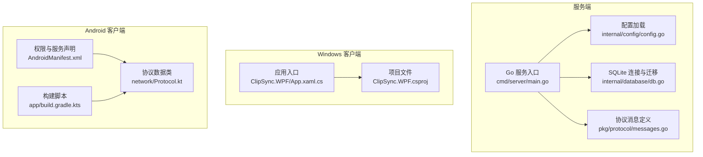
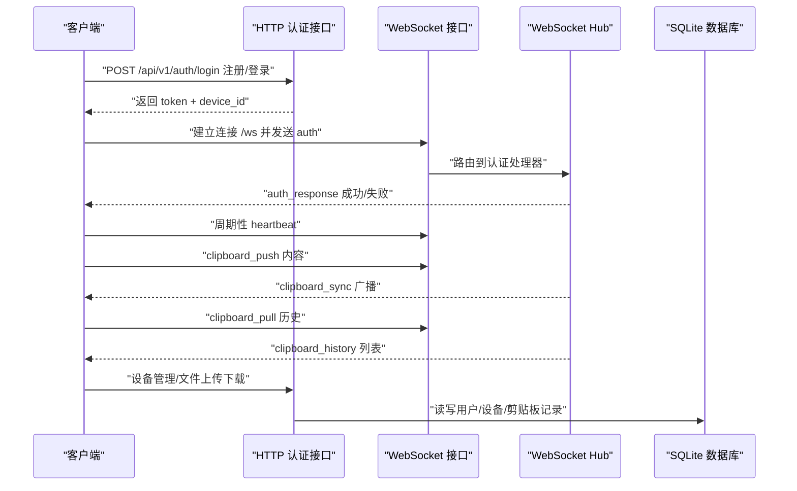
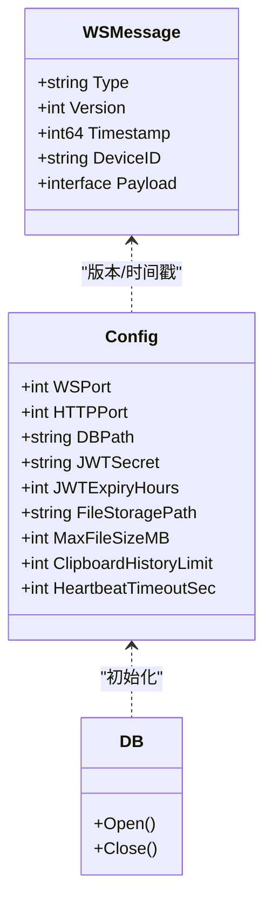
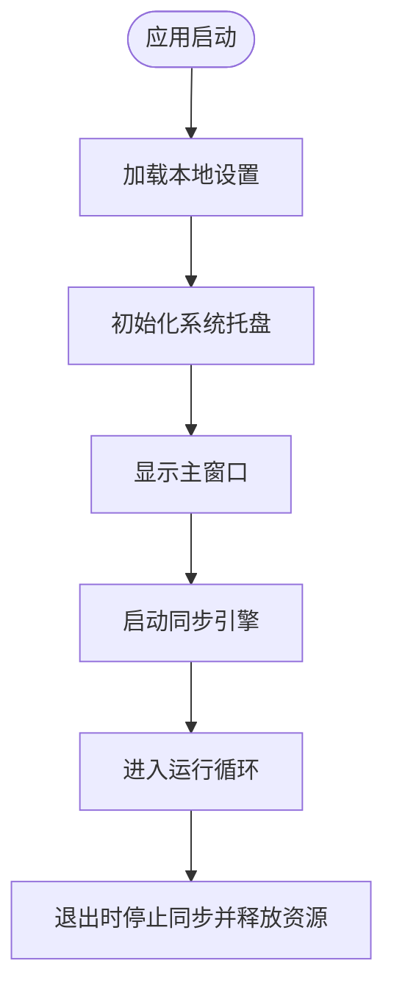
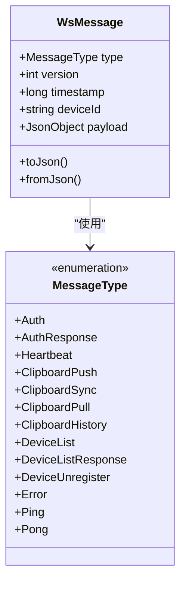
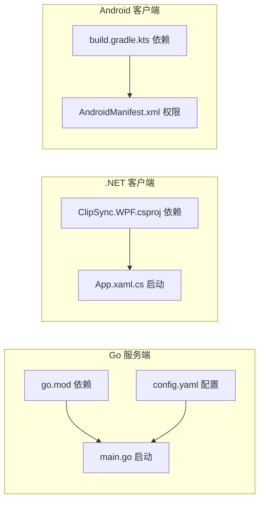

# 快速开始

<cite>
**本文引用的文件**
- [DEVELOPMENT_PLAN.md](file://DEVELOPMENT_PLAN.md)
- [InstallationLog.txt](file://InstallationLog.txt)
- [test-protocol-compatibility.ps1](file://scripts/test-protocol-compatibility.ps1)
- [Makefile](file://clipSync-server/Makefile)
- [go.mod](file://clipSync-server/go.mod)
- [config.yaml](file://clipSync-server/configs/config.yaml)
- [main.go](file://clipSync-server/cmd/server/main.go)
- [config.go](file://clipSync-server/internal/config/config.go)
- [db.go](file://clipSync-server/internal/database/db.go)
- [messages.go](file://clipSync-server/pkg/protocol/messages.go)
- [build.gradle.kts](file://clipSync-android/app/build.gradle.kts)
- [AndroidManifest.xml](file://clipSync-android/app/src/main/AndroidManifest.xml)
- [Protocol.kt](file://clipSync-android/app/src/main/java/com/clipsync/app/network/Protocol.kt)
- [ClipSync.WPF.csproj](file://clipSync-windows/ClipSync.WPF/ClipSync.WPF.csproj)
- [App.xaml.cs](file://clipSync-windows/ClipSync.WPF/App.xaml.cs)
</cite>

## 目录
1. [简介](#简介)
2. [项目结构](#项目结构)
3. [核心组件](#核心组件)
4. [架构总览](#架构总览)
5. [详细组件分析](#详细组件分析)
6. [依赖与环境要求](#依赖与环境要求)
7. [构建与运行步骤](#构建与运行步骤)
8. [使用示例](#使用示例)
9. [依赖关系分析](#依赖关系分析)
10. [性能考虑](#性能考虑)
11. [故障排除指南](#故障排除指南)
12. [结论](#结论)

## 简介
本指南面向新加入的开发者，帮助你在最短时间内完成 ClipSync 的开发环境搭建与首次运行。内容涵盖环境准备、各平台构建与运行、基础使用流程（首次设备注册、登录认证、剪贴板同步测试）以及常见问题排查。

## 项目结构
项目采用多模块并行开发架构，包含：
- Go 语言服务端：负责认证、设备管理、文件上传下载、WebSocket 消息路由与广播
- Windows WPF 客户端：系统托盘集成、本地数据库缓存、剪贴板监控与同步
- Android 客户端：前台服务、剪贴板监听、Room 数据库存储、Compose UI

图表来源
- [main.go:19-126](file://clipSync-server/cmd/server/main.go#L19-L126)
- [config.go:10-55](file://clipSync-server/internal/config/config.go#L10-L55)
- [db.go:17-56](file://clipSync-server/internal/database/db.go#L17-L56)
- [messages.go:5-131](file://clipSync-server/pkg/protocol/messages.go#L5-L131)
- [App.xaml.cs:12-52](file://clipSync-windows/ClipSync.WPF/App.xaml.cs#L12-L52)
- [ClipSync.WPF.csproj:1-24](file://clipSync-windows/ClipSync.WPF/ClipSync.WPF.csproj#L1-L24)
- [AndroidManifest.xml:1-64](file://clipSync-android/app/src/main/AndroidManifest.xml#L1-L64)
- [Protocol.kt:18-34](file://clipSync-android/app/src/main/java/com/clipsync/app/network/Protocol.kt#L18-L34)
- [build.gradle.kts:1-102](file://clipSync-android/app/build.gradle.kts#L1-L102)

章节来源
- [DEVELOPMENT_PLAN.md:365-527](file://DEVELOPMENT_PLAN.md#L365-L527)

## 核心组件
- 协议规范：统一的 WebSocket 消息与 HTTP API 规范，确保三端一致性
- 服务端：基于 Go 的 HTTP + WebSocket 双栈服务，内置 JWT 认证、心跳检测、文件上传下载与设备管理
- 客户端：Windows 使用 WPF + SQLite；Android 使用 Kotlin + Room，均实现剪贴板监听与消息编解码

章节来源
- [DEVELOPMENT_PLAN.md:18-362](file://DEVELOPMENT_PLAN.md#L18-L362)
- [messages.go:5-131](file://clipSync-server/pkg/protocol/messages.go#L5-L131)

## 架构总览
下图展示了服务端与两端客户端之间的交互关系，包括认证、心跳、剪贴板推送/同步、历史拉取与设备管理。

图表来源
- [main.go:68-115](file://clipSync-server/cmd/server/main.go#L68-L115)
- [messages.go:107-123](file://clipSync-server/pkg/protocol/messages.go#L107-L123)
- [config.yaml:3-28](file://clipSync-server/configs/config.yaml#L3-L28)

## 详细组件分析

### 服务端组件
- 配置系统：从 YAML 加载端口、JWT 密钥、文件存储路径、历史限制与心跳超时
- 数据库层：SQLite 连接、WAL 模式、连接池优化与迁移执行
- 协议层：统一的消息结构体与常量，支持序列化/反序列化
- 路由与中间件：HTTP 路由注册、JWT 中间件保护、WebSocket 处理器

图表来源
- [config.go:10-21](file://clipSync-server/internal/config/config.go#L10-L21)
- [db.go:12-15](file://clipSync-server/internal/database/db.go#L12-L15)
- [messages.go:5-12](file://clipSync-server/pkg/protocol/messages.go#L5-L12)

章节来源
- [config.yaml:1-29](file://clipSync-server/configs/config.yaml#L1-L29)
- [config.go:23-55](file://clipSync-server/internal/config/config.go#L23-L55)
- [db.go:17-56](file://clipSync-server/internal/database/db.go#L17-L56)
- [messages.go:107-131](file://clipSync-server/pkg/protocol/messages.go#L107-L131)

### Windows 客户端组件
- 应用入口：全局异常处理、设置加载、同步引擎与系统托盘初始化
- 项目配置：WPF、SQLite、MVVM Toolkit、Newtonsoft.Json、NotifyIcon 等依赖

图表来源
- [App.xaml.cs:12-63](file://clipSync-windows/ClipSync.WPF/App.xaml.cs#L12-L63)
- [ClipSync.WPF.csproj:13-19](file://clipSync-windows/ClipSync.WPF/ClipSync.WPF.csproj#L13-L19)

章节来源
- [App.xaml.cs:12-63](file://clipSync-windows/ClipSync.WPF/App.xaml.cs#L12-L63)
- [ClipSync.WPF.csproj:1-24](file://clipSync-windows/ClipSync.WPF/ClipSync.WPF.csproj#L1-L24)

### Android 客户端组件
- 权限与服务：网络、前台服务、开机自启、通知等权限声明
- 协议数据类：Kotlin 序列化模型与消息构造器
- 构建脚本：Compose、OkHttp、Room、DataStore、协程等依赖

图表来源
- [Protocol.kt:20-52](file://clipSync-android/app/src/main/java/com/clipsync/app/network/Protocol.kt#L20-L52)
- [Protocol.kt:36-52](file://clipSync-android/app/src/main/java/com/clipsync/app/network/Protocol.kt#L36-L52)

章节来源
- [AndroidManifest.xml:5-17](file://clipSync-android/app/src/main/AndroidManifest.xml#L5-L17)
- [Protocol.kt:18-34](file://clipSync-android/app/src/main/java/com/clipsync/app/network/Protocol.kt#L18-L34)
- [build.gradle.kts:57-101](file://clipSync-android/app/build.gradle.kts#L57-L101)

## 依赖与环境要求
- Go 开发环境
  - 版本：1.26.2
  - 依赖：gorilla/websocket、golang-jwt、mattn/go-sqlite3、golang.org/x/crypto、yaml.v3
- .NET 开发环境
  - 目标框架：net8.0-windows
  - 依赖：Microsoft.Data.Sqlite、CommunityToolkit.Mvvm、Newtonsoft.Json、Hardcodet.NotifyIcon.Wpf
- Android 开发环境
  - SDK：minSdk 26、targetSdk 34、compileSdk 34
  - 构建工具：Java 17、Jetpack Compose、OkHttp、Room、DataStore、协程
- 其他
  - 服务端默认端口：WebSocket 8080、HTTP 8081
  - 数据库：SQLite（WAL 模式）
  - 文件存储：./data/files

章节来源
- [go.mod:3-11](file://clipSync-server/go.mod#L3-L11)
- [ClipSync.WPF.csproj:3-11](file://clipSync-windows/ClipSync.WPF/ClipSync.WPF.csproj#L3-L11)
- [build.gradle.kts:8-55](file://clipSync-android/app/build.gradle.kts#L8-L55)
- [config.yaml:3-28](file://clipSync-server/configs/config.yaml#L3-L28)

## 构建与运行步骤

### 服务端（Go）
- 安装依赖
  - 执行：make deps 或 go mod tidy
- 编译
  - 执行：make build 或 go build -o bin/clipsync-server ./cmd/server
- 运行
  - 执行：make run 或 go run ./cmd/server
- 清理
  - 执行：make clean 清除 bin 与 data 目录

章节来源
- [Makefile:18-33](file://clipSync-server/Makefile#L18-L33)
- [main.go:19-126](file://clipSync-server/cmd/server/main.go#L19-L126)

### Windows 客户端（.NET）
- 使用 Visual Studio 打开解决方案 ClipSync.WPF.sln
- 设置目标框架 net8.0-windows
- 还原 NuGet 包后直接运行或生成

章节来源
- [ClipSync.WPF.csproj:1-24](file://clipSync-windows/ClipSync.WPF/ClipSync.WPF.csproj#L1-L24)
- [App.xaml.cs:12-52](file://clipSync-windows/ClipSync.WPF/App.xaml.cs#L12-L52)

### Android 客户端（Kotlin/Gradle）
- 在 Android Studio 中打开项目
- 同步 Gradle（minSdk 26、Java 17、Compose）
- 运行 app 模块

章节来源
- [build.gradle.kts:1-102](file://clipSync-android/app/build.gradle.kts#L1-L102)
- [AndroidManifest.xml:1-64](file://clipSync-android/app/src/main/AndroidManifest.xml#L1-L64)

## 使用示例

### 基本使用流程
- 启动服务端
  - 运行服务端可执行文件或 go run ./cmd/server
  - 预期：HTTP 8081 与 WebSocket 8080 启动，日志输出“Server starting”
- Windows 客户端
  - 启动应用，自动加载设置并初始化托盘
  - 首次运行建议在设置中配置服务端地址与端口
- Android 客户端
  - 启动应用，按需授予通知与前台服务权限
  - 首次运行建议在设置中配置服务端地址与端口

章节来源
- [main.go:19-126](file://clipSync-server/cmd/server/main.go#L19-L126)
- [App.xaml.cs:12-52](file://clipSync-windows/ClipSync.WPF/App.xaml.cs#L12-L52)
- [AndroidManifest.xml:19-61](file://clipSync-android/app/src/main/AndroidManifest.xml#L19-L61)

### 首次设备注册与登录认证
- 使用 PowerShell 测试脚本验证协议兼容性与健康检查
  - 执行：.\scripts\test-protocol-compatibility.ps1
  - 预期：所有检查项通过，健康检查返回 status=ok，登录返回 token 与 device_id
- 说明：该脚本会调用 HTTP /api/v1/health 与 /api/v1/auth/login 端点进行验证

章节来源
- [test-protocol-compatibility.ps1:166-191](file://scripts/test-protocol-compatibility.ps1#L166-L191)
- [DEVELOPMENT_PLAN.md:182-250](file://DEVELOPMENT_PLAN.md#L182-L250)

### 剪贴板同步测试
- 在一台设备上复制文本或图片
- 在另一台设备上观察剪贴板历史或实时同步
- 如需验证历史拉取，可在客户端触发 clipboard_pull 并查看 clipboard_history 返回

章节来源
- [DEVELOPMENT_PLAN.md:118-151](file://DEVELOPMENT_PLAN.md#L118-L151)
- [messages.go:55-79](file://clipSync-server/pkg/protocol/messages.go#L55-L79)

## 依赖关系分析

图表来源
- [go.mod:5-11](file://clipSync-server/go.mod#L5-L11)
- [main.go:19-126](file://clipSync-server/cmd/server/main.go#L19-L126)
- [config.yaml:1-29](file://clipSync-server/configs/config.yaml#L1-L29)
- [ClipSync.WPF.csproj:13-19](file://clipSync-windows/ClipSync.WPF/ClipSync.WPF.csproj#L13-L19)
- [App.xaml.cs:12-52](file://clipSync-windows/ClipSync.WPF/App.xaml.cs#L12-L52)
- [build.gradle.kts:57-101](file://clipSync-android/app/build.gradle.kts#L57-L101)
- [AndroidManifest.xml:5-17](file://clipSync-android/app/src/main/AndroidManifest.xml#L5-L17)

## 性能考虑
- 服务端数据库优化
  - WAL 模式、连接池（最大打开连接数 4，空闲 2）、同步级别 NORMAL、缓存大小与临时存储内存化
- 心跳与断线重连
  - 心跳间隔约 30 秒，超时阈值 90 秒，客户端应实现自动重连
- 文件传输
  - 大内容通过分片上传/下载，单文件最大 5MB

章节来源
- [db.go:29-49](file://clipSync-server/internal/database/db.go#L29-L49)
- [config.yaml:27-28](file://clipSync-server/configs/config.yaml#L27-L28)
- [DEVELOPMENT_PLAN.md:251-282](file://DEVELOPMENT_PLAN.md#L251-L282)

## 故障排除指南
- 无法连接服务端
  - 检查服务端是否在 8080（WS）与 8081（HTTP）端口运行
  - 使用健康检查端点验证：GET /api/v1/health
- 登录失败
  - 确认用户名/密码正确，平台参数为 windows 或 android
  - 查看错误码 AUTH_FAILED 或 INVALID_CREDENTIALS
- 心跳频繁断开
  - 检查客户端心跳定时器（约 30 秒），确认网络稳定
  - 服务端心跳超时阈值为 90 秒
- 文件上传失败
  - 确认文件大小不超过 5MB，校验和匹配
- Android 权限问题
  - 确保已声明 INTERNET、ACCESS_NETWORK_STATE、FOREGROUND_SERVICE 等权限
- Windows 异常崩溃
  - 应用已设置全局异常处理，查看输出日志定位异常

章节来源
- [test-protocol-compatibility.ps1:166-191](file://scripts/test-protocol-compatibility.ps1#L166-L191)
- [config.yaml:27-28](file://clipSync-server/configs/config.yaml#L27-L28)
- [DEVELOPMENT_PLAN.md:350-362](file://DEVELOPMENT_PLAN.md#L350-L362)
- [AndroidManifest.xml:5-17](file://clipSync-android/app/src/main/AndroidManifest.xml#L5-L17)
- [App.xaml.cs:16-33](file://clipSync-windows/ClipSync.WPF/App.xaml.cs#L16-L33)

## 结论
通过本快速开始指南，你可以在本地完成服务端与两端客户端的环境搭建与首次运行。建议先运行服务端，再分别启动 Windows 与 Android 客户端，最后使用 PowerShell 脚本验证协议兼容性与登录流程。如遇问题，请参考故障排除章节逐步排查。