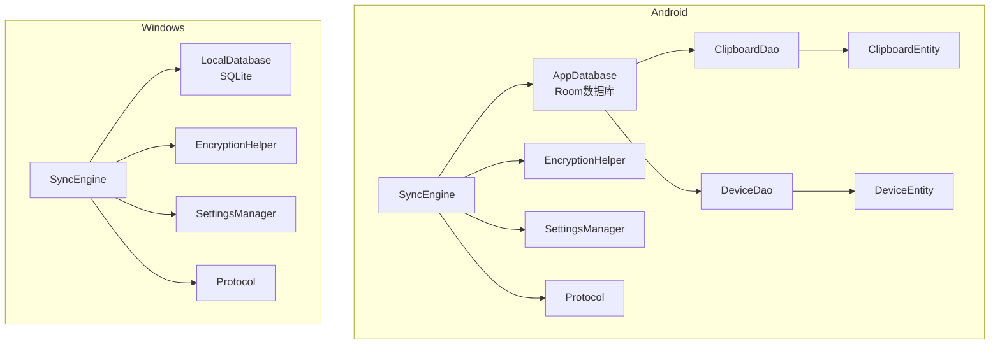
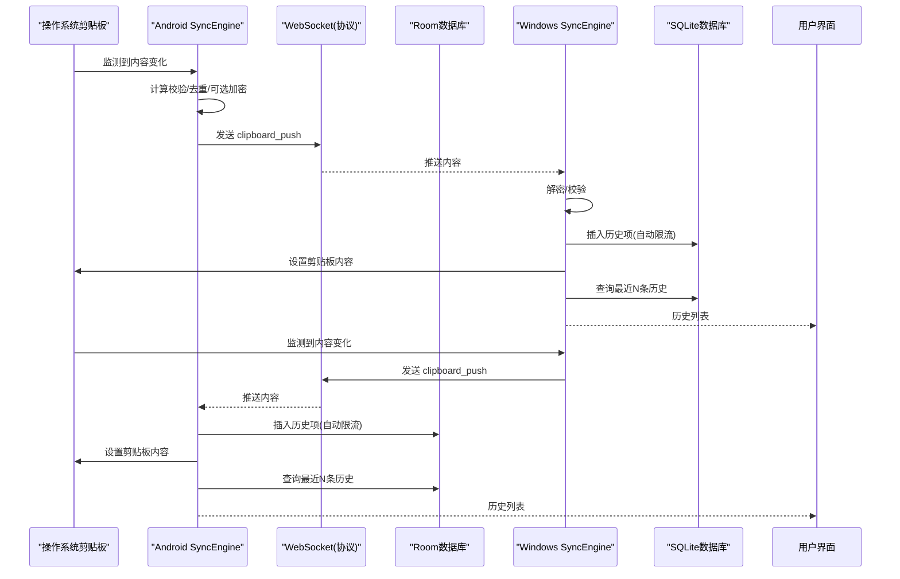
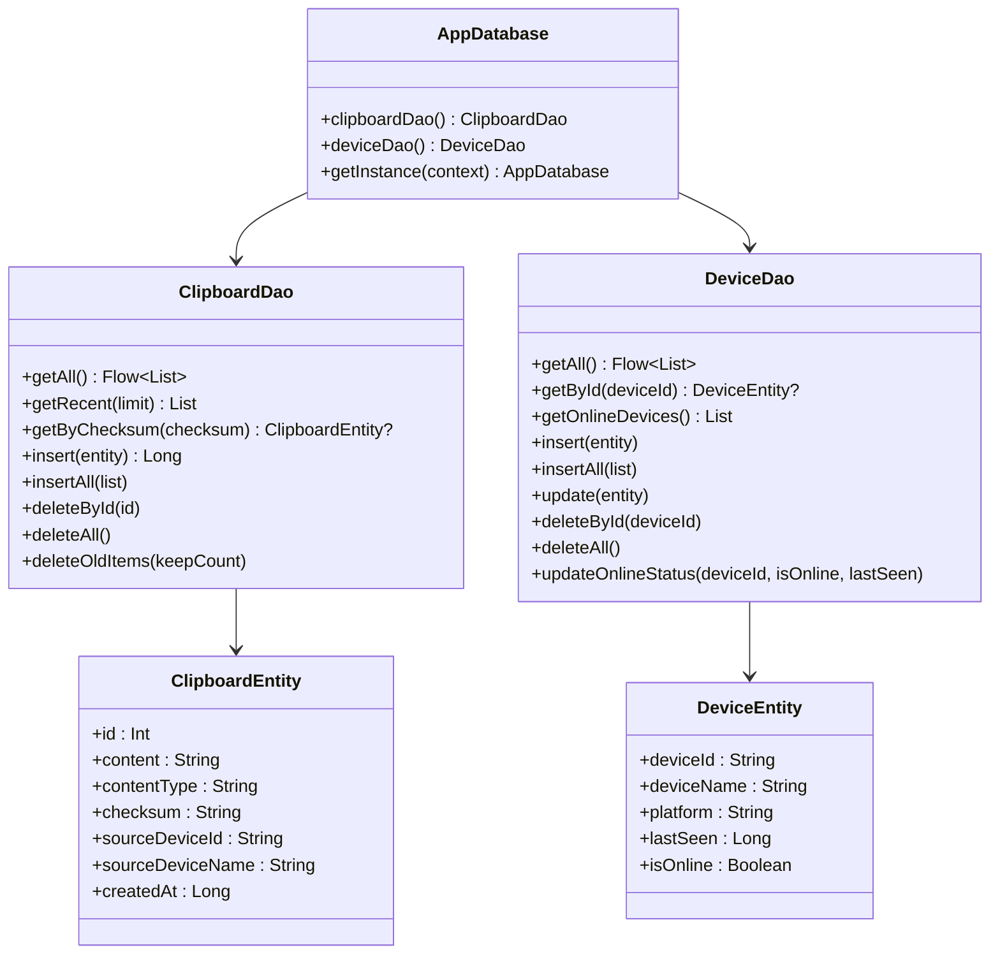
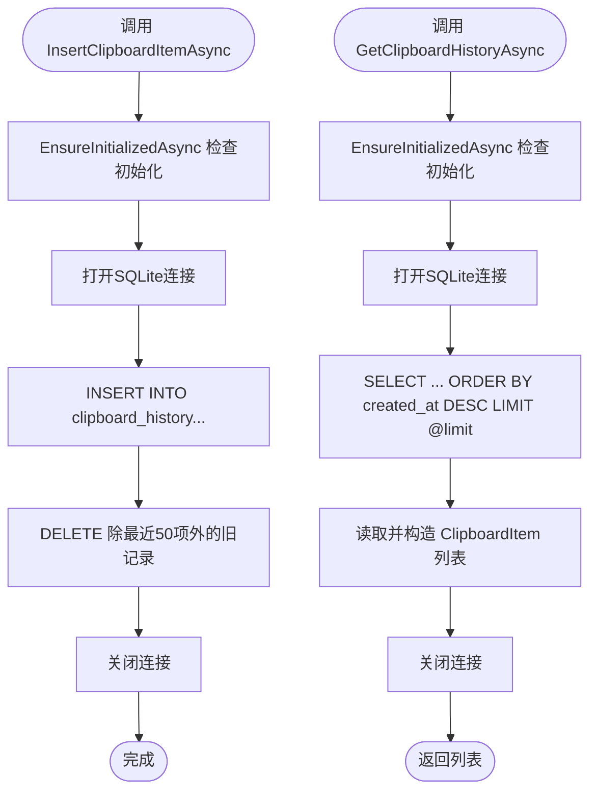
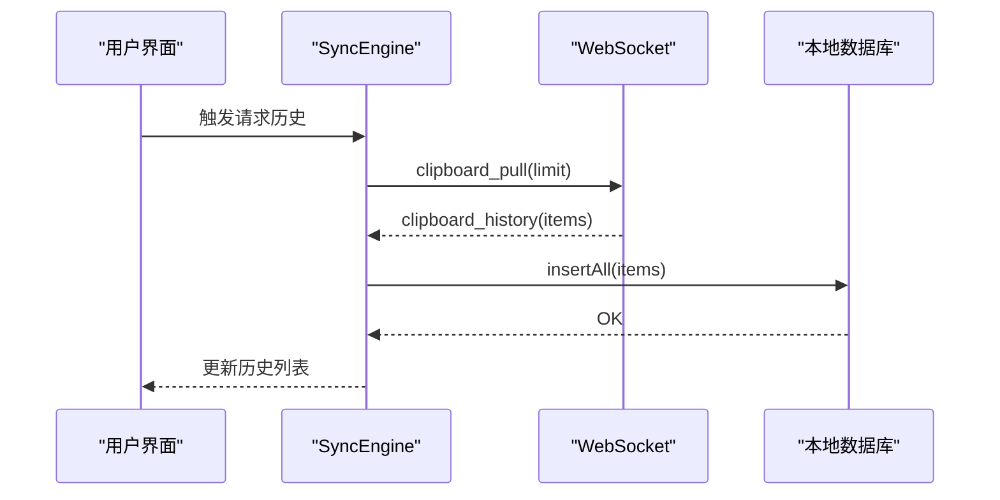
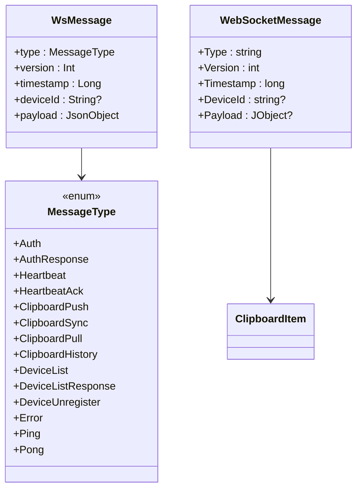
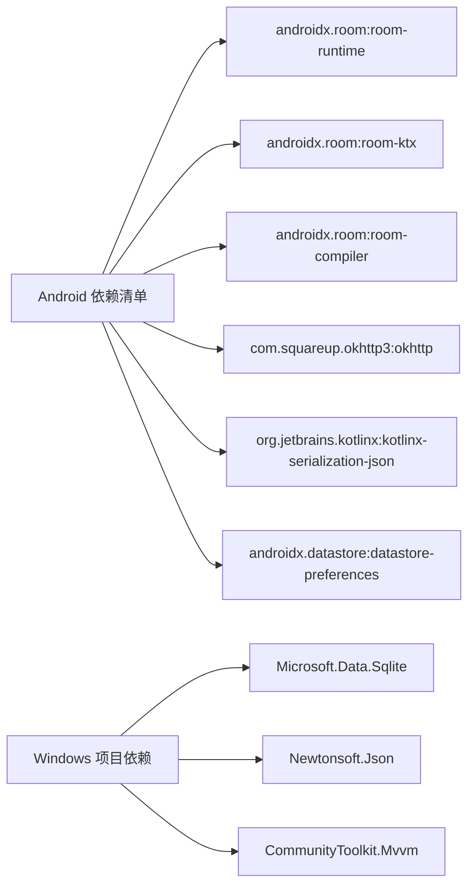

# 客户端数据库

<cite>
**本文引用的文件**
- [AppDatabase.kt](file://clipSync-android/app/src/main/java/com/clipsync/app/data/AppDatabase.kt)
- [ClipboardDao.kt](file://clipSync-android/app/src/main/java/com/clipsync/app/data/ClipboardDao.kt)
- [DeviceDao.kt](file://clipSync-android/app/src/main/java/com/clipsync/app/data/DeviceDao.kt)
- [ClipboardEntity.kt](file://clipSync-android/app/src/main/java/com/clipsync/app/data/entities/ClipboardEntity.kt)
- [DeviceEntity.kt](file://clipSync-android/app/src/main/java/com/clipsync/app/data/entities/DeviceEntity.kt)
- [SyncEngine.kt](file://clipSync-android/app/src/main/java/com/clipsync/app/core/SyncEngine.kt)
- [EncryptionHelper.kt](file://clipSync-android/app/src/main/java/com/clipsync/app/core/EncryptionHelper.kt)
- [SettingsManager.kt](file://clipSync-android/app/src/main/java/com/clipsync/app/core/SettingsManager.kt)
- [Protocol.kt](file://clipSync-android/app/src/main/java/com/clipsync/app/network/Protocol.kt)
- [LocalDatabase.cs](file://clipSync-windows/ClipSync.WPF/Storage/LocalDatabase.cs)
- [SyncEngine.cs](file://clipSync-windows/ClipSync.WPF/Core/SyncEngine.cs)
- [EncryptionHelper.cs](file://clipSync-windows/ClipSync.WPF/Core/EncryptionHelper.cs)
- [SettingsManager.cs](file://clipSync-windows/ClipSync.WPF/Core/SettingsManager.cs)
- [Protocol.cs](file://clipSync-windows/ClipSync.WPF/Network/Protocol.cs)
- [build.gradle.kts](file://clipSync-android/app/build.gradle.kts)
- [ClipSync.WPF.csproj](file://clipSync-windows/ClipSync.WPF/ClipSync.WPF.csproj)
</cite>

## 目录
1. [简介](#简介)
2. [项目结构](#项目结构)
3. [核心组件](#核心组件)
4. [架构总览](#架构总览)
5. [详细组件分析](#详细组件分析)
6. [依赖关系分析](#依赖关系分析)
7. [性能与内存管理](#性能与内存管理)
8. [故障排查指南](#故障排查指南)
9. [结论](#结论)
10. [附录](#附录)

## 简介
本文件系统性梳理ClipSync客户端在Android与Windows平台上的本地数据库实现与使用方式，覆盖以下主题：
- Android端Room数据库配置与实体、DAO设计及查询方法
- Windows端SQLite数据库配置与表结构、操作封装
- 离线缓存策略与数据同步机制（推送/拉取/去重）
- 数据持久化模式与生命周期管理
- 跨平台数据模型映射与序列化处理
- 内存管理与性能优化建议
- 数据冲突解决与一致性维护策略

## 项目结构
Android与Windows两端均实现了独立的本地数据库模块，并通过各自的同步引擎与网络协议进行数据交互。

图表来源
- [AppDatabase.kt:14-39](file://clipSync-android/app/src/main/java/com/clipsync/app/data/AppDatabase.kt#L14-L39)
- [ClipboardDao.kt:13-49](file://clipSync-android/app/src/main/java/com/clipsync/app/data/ClipboardDao.kt#L13-L49)
- [DeviceDao.kt:14-43](file://clipSync-android/app/src/main/java/com/clipsync/app/data/DeviceDao.kt#L14-L43)
- [LocalDatabase.cs:15-169](file://clipSync-windows/ClipSync.WPF/Storage/LocalDatabase.cs#L15-L169)

章节来源
- [AppDatabase.kt:14-39](file://clipSync-android/app/src/main/java/com/clipsync/app/data/AppDatabase.kt#L14-L39)
- [LocalDatabase.cs:15-169](file://clipSync-windows/ClipSync.WPF/Storage/LocalDatabase.cs#L15-L169)

## 核心组件
- Android Room数据库：提供类型安全的实体与DAO访问，支持流式查询与协程异步操作。
- Windows SQLite数据库：提供轻量级SQL操作封装，自动建表与索引，支持历史项上限控制。
- 同步引擎：负责本地剪贴板监控、消息构建、去重、加密/解密、历史入库与拉取。
- 设置管理：持久化设备信息、服务器地址、开关状态等配置。
- 加密工具：统一的AES-256-CBC加解密格式，保障跨平台兼容。

章节来源
- [SyncEngine.kt:27-239](file://clipSync-android/app/src/main/java/com/clipsync/app/core/SyncEngine.kt#L27-L239)
- [SyncEngine.cs:8-422](file://clipSync-windows/ClipSync.WPF/Core/SyncEngine.cs#L8-L422)
- [SettingsManager.kt:21-170](file://clipSync-android/app/src/main/java/com/clipsync/app/core/SettingsManager.kt#L21-L170)
- [SettingsManager.cs:44-102](file://clipSync-windows/ClipSync.WPF/Core/SettingsManager.cs#L44-L102)
- [EncryptionHelper.kt:22-157](file://clipSync-android/app/src/main/java/com/clipsync/app/core/EncryptionHelper.kt#L22-L157)
- [EncryptionHelper.cs:18-134](file://clipSync-windows/ClipSync.WPF/Core/EncryptionHelper.cs#L18-L134)

## 架构总览
Android与Windows两端均采用“本地数据库 + 同步引擎 + 网络协议”的分层架构。同步引擎在本地变化时推送，收到远端消息后写入本地历史并更新剪贴板；两端均内置去重与加密机制，保证一致性与安全性。

图表来源
- [SyncEngine.kt:72-227](file://clipSync-android/app/src/main/java/com/clipsync/app/core/SyncEngine.kt#L72-L227)
- [SyncEngine.cs:95-267](file://clipSync-windows/ClipSync.WPF/Core/SyncEngine.cs#L95-L267)
- [Protocol.kt:210-262](file://clipSync-android/app/src/main/java/com/clipsync/app/network/Protocol.kt#L210-L262)
- [Protocol.cs:99-141](file://clipSync-windows/ClipSync.WPF/Network/Protocol.cs#L99-L141)

## 详细组件分析

### Android Room数据库与DAO
- 数据库与实体
  - 数据库类声明实体集合与版本号，提供单例构建器。
  - 实体定义字段与主键，含时间戳、来源设备信息、内容类型与校验和等。
- DAO接口
  - 剪贴板DAO：提供按时间倒序查询、按校验和检索、批量插入、删除与清理旧项等方法。
  - 设备DAO：提供在线设备筛选、按ID查询、批量插入、更新与状态变更等方法。
- 查询特性
  - 使用Flow对剪贴板DAO查询结果进行响应式监听。
  - 支持LIMIT与复杂子查询以实现“仅保留最近N项”的清理逻辑。

图表来源
- [AppDatabase.kt:14-39](file://clipSync-android/app/src/main/java/com/clipsync/app/data/AppDatabase.kt#L14-L39)
- [ClipboardEntity.kt:9-19](file://clipSync-android/app/src/main/java/com/clipsync/app/data/entities/ClipboardEntity.kt#L9-L19)
- [DeviceEntity.kt:9-17](file://clipSync-android/app/src/main/java/com/clipsync/app/data/entities/DeviceEntity.kt#L9-L17)
- [ClipboardDao.kt:13-49](file://clipSync-android/app/src/main/java/com/clipsync/app/data/ClipboardDao.kt#L13-L49)
- [DeviceDao.kt:14-43](file://clipSync-android/app/src/main/java/com/clipsync/app/data/DeviceDao.kt#L14-L43)

章节来源
- [AppDatabase.kt:14-39](file://clipSync-android/app/src/main/java/com/clipsync/app/data/AppDatabase.kt#L14-L39)
- [ClipboardDao.kt:13-49](file://clipSync-android/app/src/main/java/com/clipsync/app/data/ClipboardDao.kt#L13-L49)
- [DeviceDao.kt:14-43](file://clipSync-android/app/src/main/java/com/clipsync/app/data/DeviceDao.kt#L14-L43)
- [ClipboardEntity.kt:9-19](file://clipSync-android/app/src/main/java/com/clipsync/app/data/entities/ClipboardEntity.kt#L9-L19)
- [DeviceEntity.kt:9-17](file://clipSync-android/app/src/main/java/com/clipsync/app/data/entities/DeviceEntity.kt#L9-L17)

### Windows SQLite数据库与操作封装
- 初始化与建表
  - 首次使用时创建clipboard_history表与索引，确保按时间倒序查询高效。
- 插入与查询
  - 插入时同时执行“仅保留最近50项”的清理逻辑。
  - 查询支持LIMIT限制返回数量。
- 清理与释放
  - 提供清空历史与基础资源释放接口。

图表来源
- [LocalDatabase.cs:26-96](file://clipSync-windows/ClipSync.WPF/Storage/LocalDatabase.cs#L26-L96)
- [LocalDatabase.cs:98-137](file://clipSync-windows/ClipSync.WPF/Storage/LocalDatabase.cs#L98-L137)

章节来源
- [LocalDatabase.cs:15-169](file://clipSync-windows/ClipSync.WPF/Storage/LocalDatabase.cs#L15-L169)

### 同步与离线缓存策略
- 推送流程
  - 本地变化触发后，计算校验和并进行去重判断；根据设置决定是否加密；发送clipboard_push；成功后写入本地历史并执行“仅保留最近50项”清理。
- 拉取流程
  - 认证成功后请求最近N条历史；服务端返回历史列表后批量写入本地数据库。
- 去重与一致性
  - 两端均基于checksum进行重复检测，避免回环与冗余传输。
  - 同源设备发出的内容会被忽略，防止回环。
- 离线缓存
  - 两端均保存最近N条历史，用于UI展示与后续同步。

图表来源
- [SyncEngine.kt:199-203](file://clipSync-android/app/src/main/java/com/clipsync/app/core/SyncEngine.kt#L199-L203)
- [SyncEngine.kt:165-194](file://clipSync-android/app/src/main/java/com/clipsync/app/core/SyncEngine.kt#L165-L194)
- [SyncEngine.cs:374-379](file://clipSync-windows/ClipSync.WPF/Core/SyncEngine.cs#L374-L379)

章节来源
- [SyncEngine.kt:72-227](file://clipSync-android/app/src/main/java/com/clipsync/app/core/SyncEngine.kt#L72-L227)
- [SyncEngine.cs:95-267](file://clipSync-windows/ClipSync.WPF/Core/SyncEngine.cs#L95-L267)

### 数据模型映射与序列化
- Android端
  - 使用kotlinx.serialization定义消息体与枚举，统一JSON序列化配置。
  - 协议构建器生成标准消息，包含类型、版本、时间戳与载荷。
- Windows端
  - 使用Newtonsoft.Json进行消息序列化/反序列化，定义WebSocketMessage与ClipboardItem等数据类。
  - 协议工具类负责消息组装与加密开关处理。
- 跨平台兼容
  - 加密格式统一为“base64(salt):base64(IV+ciphertext)”；校验算法统一为SHA-256；消息字段命名保持一致。

图表来源
- [Protocol.kt:20-52](file://clipSync-android/app/src/main/java/com/clipsync/app/network/Protocol.kt#L20-L52)
- [Protocol.cs:8-36](file://clipSync-windows/ClipSync.WPF/Network/Protocol.cs#L8-L36)

章节来源
- [Protocol.kt:12-262](file://clipSync-android/app/src/main/java/com/clipsync/app/network/Protocol.kt#L12-L262)
- [Protocol.cs:60-165](file://clipSync-windows/ClipSync.WPF/Network/Protocol.cs#L60-L165)

### 生命周期与配置管理
- Android
  - 使用DataStore Preferences持久化设置，提供流式读取与更新。
  - 数据库单例随应用生命周期持有，避免重复创建。
- Windows
  - 使用JSON文件存储设置，线程安全地加载/保存。
  - 数据库实例在启动时初始化，支持显式清理与释放。

章节来源
- [SettingsManager.kt:21-170](file://clipSync-android/app/src/main/java/com/clipsync/app/core/SettingsManager.kt#L21-L170)
- [SettingsManager.cs:44-102](file://clipSync-windows/ClipSync.WPF/Core/SettingsManager.cs#L44-L102)
- [AppDatabase.kt:24-39](file://clipSync-android/app/src/main/java/com/clipsync/app/data/AppDatabase.kt#L24-L39)

### 版本与迁移（现状与建议）
- 当前状态
  - Android Room数据库版本号为1，未见显式的迁移脚本或版本升级逻辑。
  - Windows SQLite当前版本亦未见迁移脚本。
- 建议
  - 引入Room Migration以支持未来schema变更。
  - Windows端可引入版本号与迁移脚本，确保数据兼容。

章节来源
- [AppDatabase.kt:16](file://clipSync-android/app/src/main/java/com/clipsync/app/data/AppDatabase.kt#L16)
- [build.gradle.kts:80-84](file://clipSync-android/app/build.gradle.kts#L80-L84)
- [ClipSync.WPF.csproj:14](file://clipSync-windows/ClipSync.WPF/ClipSync.WPF.csproj#L14)

## 依赖关系分析
- Android
  - Room运行时、KTX、编译器KSP；OkHttp用于WebSocket；kotlinx.serialization用于协议；DataStore用于设置。
- Windows
  - Microsoft.Data.Sqlite用于SQLite；Newtonsoft.Json用于序列化；CommunityToolkit用于MVVM。

图表来源
- [build.gradle.kts:80-97](file://clipSync-android/app/build.gradle.kts#L80-L97)
- [ClipSync.WPF.csproj:13-19](file://clipSync-windows/ClipSync.WPF/ClipSync.WPF.csproj#L13-L19)

章节来源
- [build.gradle.kts:80-97](file://clipSync-android/app/build.gradle.kts#L80-L97)
- [ClipSync.WPF.csproj:13-19](file://clipSync-windows/ClipSync.WPF/ClipSync.WPF.csproj#L13-L19)

## 性能与内存管理
- 查询与索引
  - Android端剪贴板表按时间倒序查询，建议保持索引以提升排序效率。
  - Windows端已创建按created_at的索引，有助于快速排序与分页。
- 批量写入
  - Android端提供insertAll以减少事务开销。
- 去重与限流
  - 两端均基于checksum去重，避免重复传输；历史项上限控制降低存储与查询压力。
- 线程与协程
  - Android端使用IO调度器与SupervisorJob隔离错误；Windows端多处使用Task.Run异步化数据库操作。
- 内存与资源
  - 加密/解密过程避免大对象常驻内存；数据库连接在每次操作中创建/销毁，减少长连接占用。

章节来源
- [ClipboardDao.kt:16-19](file://clipSync-android/app/src/main/java/com/clipsync/app/data/ClipboardDao.kt#L16-L19)
- [LocalDatabase.cs:50-54](file://clipSync-windows/ClipSync.WPF/Storage/LocalDatabase.cs#L50-L54)
- [SyncEngine.kt:33](file://clipSync-android/app/src/main/java/com/clipsync/app/core/SyncEngine.kt#L33)
- [SyncEngine.cs:32-57](file://clipSync-windows/ClipSync.WPF/Core/SyncEngine.cs#L32-L57)

## 故障排查指南
- 连接与认证
  - 若认证失败，检查服务器URL与令牌；确认协议消息类型与载荷字段正确。
- 加密问题
  - 加密失败不会降级为明文，需检查密码与格式；解密失败会返回null或抛出异常。
- 去重与回环
  - 若出现循环同步，检查checksum计算与去重逻辑；确保同源设备内容被忽略。
- 数据库异常
  - Android端数据库未初始化会导致查询失败；Windows端需确认InitializeAsync已执行。
- 索引与性能
  - 若查询变慢，确认索引是否存在；必要时重建索引或调整LIMIT。

章节来源
- [SyncEngine.kt:86-91](file://clipSync-android/app/src/main/java/com/clipsync/app/core/SyncEngine.kt#L86-L91)
- [SyncEngine.cs:208-219](file://clipSync-windows/ClipSync.WPF/Core/SyncEngine.cs#L208-L219)
- [EncryptionHelper.kt:48-50](file://clipSync-android/app/src/main/java/com/clipsync/app/core/EncryptionHelper.kt#L48-L50)
- [EncryptionHelper.cs:28-30](file://clipSync-windows/ClipSync.WPF/Core/EncryptionHelper.cs#L28-L30)
- [LocalDatabase.cs:26-58](file://clipSync-windows/ClipSync.WPF/Storage/LocalDatabase.cs#L26-L58)

## 结论
- Android与Windows两端均实现了可靠的本地数据库与同步机制，具备去重、加密与历史限流能力。
- Android端采用Room+DAO+Flow，Windows端采用SQLite+封装类，两者在协议与加密格式上保持一致，便于跨平台协作。
- 建议后续引入Room迁移与版本管理，以及更完善的错误恢复与重试策略，进一步提升稳定性与可维护性。

## 附录
- 关键路径参考
  - Android数据库与DAO：[AppDatabase.kt](file://clipSync-android/app/src/main/java/com/clipsync/app/data/AppDatabase.kt)，[ClipboardDao.kt](file://clipSync-android/app/src/main/java/com/clipsync/app/data/ClipboardDao.kt)，[DeviceDao.kt](file://clipSync-android/app/src/main/java/com/clipsync/app/data/DeviceDao.kt)
  - Windows数据库封装：[LocalDatabase.cs](file://clipSync-windows/ClipSync.WPF/Storage/LocalDatabase.cs)
  - 同步与协议：[SyncEngine.kt](file://clipSync-android/app/src/main/java/com/clipsync/app/core/SyncEngine.kt)，[SyncEngine.cs](file://clipSync-windows/ClipSync.WPF/Core/SyncEngine.cs)，[Protocol.kt](file://clipSync-android/app/src/main/java/com/clipsync/app/network/Protocol.kt)，[Protocol.cs](file://clipSync-windows/ClipSync.WPF/Network/Protocol.cs)
  - 设置与加密：[SettingsManager.kt](file://clipSync-android/app/src/main/java/com/clipsync/app/core/SettingsManager.kt)，[SettingsManager.cs](file://clipSync-windows/ClipSync.WPF/Core/SettingsManager.cs)，[EncryptionHelper.kt](file://clipSync-android/app/src/main/java/com/clipsync/app/core/EncryptionHelper.kt)，[EncryptionHelper.cs](file://clipSync-windows/ClipSync.WPF/Core/EncryptionHelper.cs)