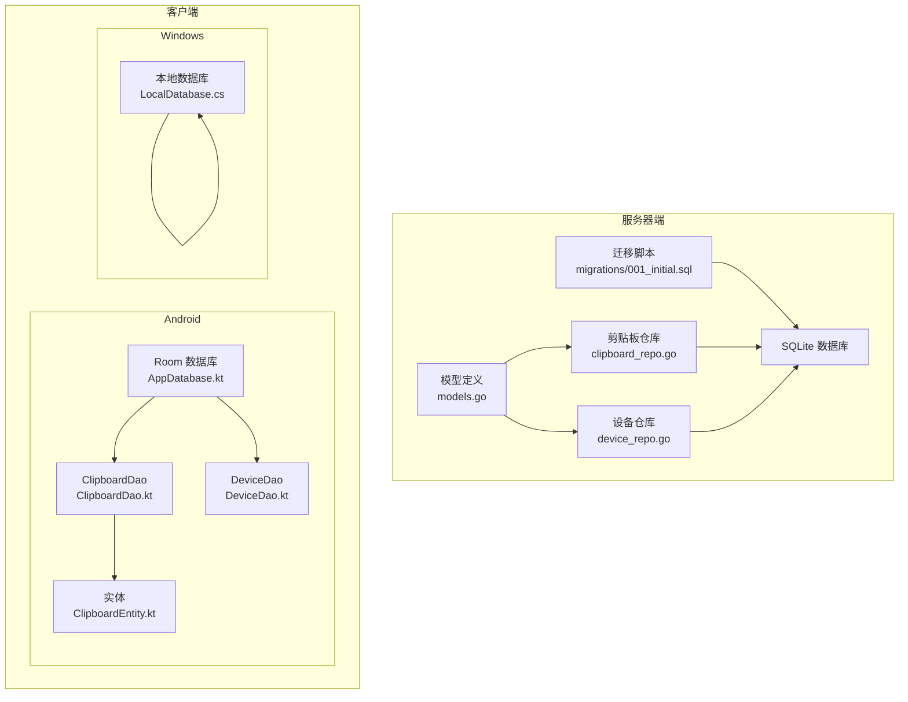
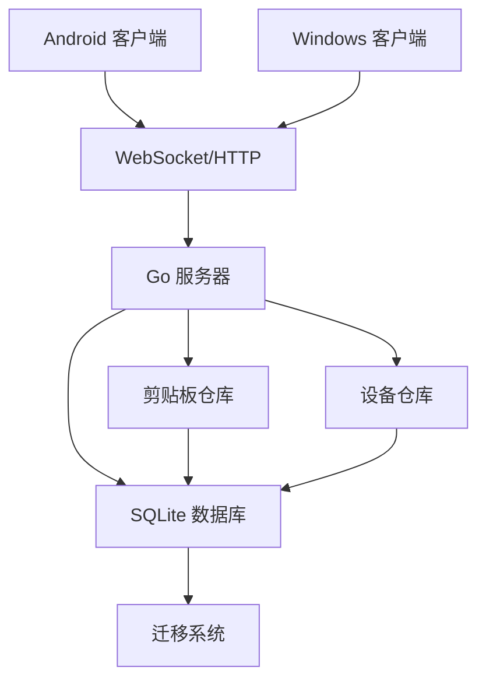
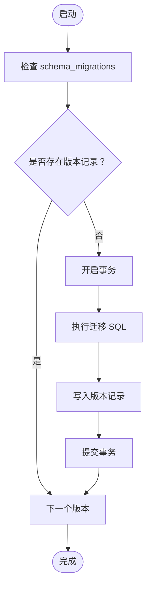
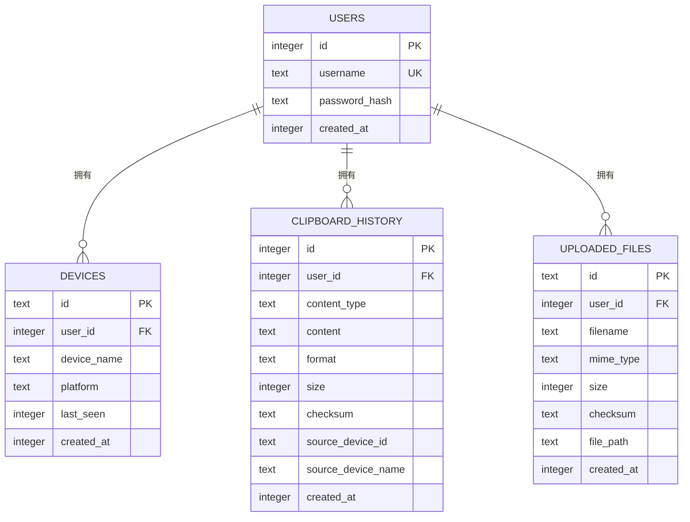
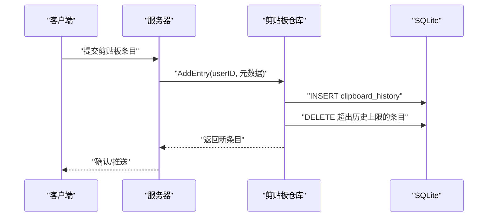
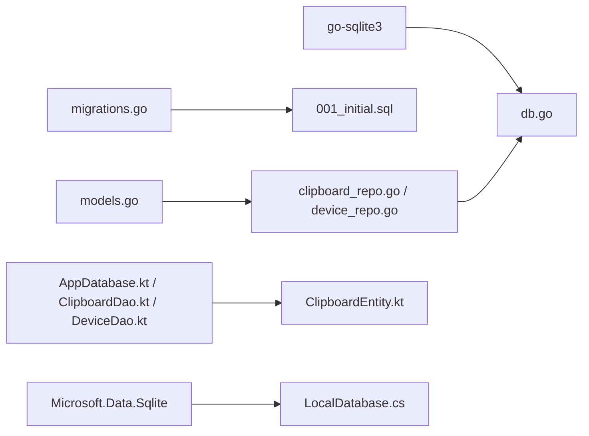

# 数据库设计

<cite>
**本文引用的文件**
- [clipSync-server 内部数据库：db.go](file://clipSync-server/internal/database/db.go)
- [clipSync-server 内部数据库：models.go](file://clipSync-server/internal/database/models.go)
- [clipSync-server 内部数据库：migrations.go](file://clipSync-server/internal/database/migrations.go)
- [clipSync-server 迁移脚本：001_initial.sql](file://clipSync-server/migrations/001_initial.sql)
- [clipSync-server 内部数据库：clipboard_repo.go](file://clipSync-server/internal/database/clipboard_repo.go)
- [clipSync-server 内部数据库：device_repo.go](file://clipSync-server/internal/database/device_repo.go)
- [clipSync-android 应用数据库：AppDatabase.kt](file://clipSync-android/app/src/main/java/com/clipsync/app/data/AppDatabase.kt)
- [clipSync-android 应用数据库：ClipboardDao.kt](file://clipSync-android/app/src/main/java/com/clipsync/app/data/ClipboardDao.kt)
- [clipSync-android 应用数据库：DeviceDao.kt](file://clipSync-android/app/src/main/java/com/clipsync/app/data/DeviceDao.kt)
- [clipSync-android 应用数据库：ClipboardEntity.kt](file://clipSync-android/app/src/main/java/com/clipsync/app/data/entities/ClipboardEntity.kt)
- [clipSync-windows WPF 本地存储：LocalDatabase.cs](file://clipSync-windows/ClipSync.WPF/Storage/LocalDatabase.cs)
</cite>

## 目录
1. [简介](#简介)
2. [项目结构](#项目结构)
3. [核心组件](#核心组件)
4. [架构总览](#架构总览)
5. [详细组件分析](#详细组件分析)
6. [依赖分析](#依赖分析)
7. [性能考虑](#性能考虑)
8. [故障排查指南](#故障排查指南)
9. [结论](#结论)
10. [附录](#附录)

## 简介
本文件为 ClipSync 数据库设计的综合文档，覆盖服务器端 SQLite 数据库与客户端本地数据库（Android Room 与 Windows SQLite）的设计差异、实体关系、字段定义与数据类型、主键/外键、索引与约束、数据验证与业务规则、数据访问模式、缓存策略与性能考量、数据生命周期与保留策略、迁移路径与版本管理、以及数据安全与隐私要求。文档同时提供架构图与示例数据，帮助开发者与运维人员理解并维护数据库层。

## 项目结构
- 服务器端采用 Go 编写的 SQLite 数据库封装与迁移机制，提供用户、设备与剪贴板历史三张表，并通过仓库层提供增删查改能力。
- 客户端 Android 使用 Room（基于 SQLite）持久化剪贴板历史与设备信息；Windows WPF 使用 Microsoft.Data.Sqlite 直接操作本地 SQLite 文件。

图表来源
- [clipSync-server 内部数据库：migrations.go:1-114](file://clipSync-server/internal/database/migrations.go#L1-L114)
- [clipSync-server 迁移脚本：001_initial.sql:1-55](file://clipSync-server/migrations/001_initial.sql#L1-L55)
- [clipSync-server 内部数据库：clipboard_repo.go:1-140](file://clipSync-server/internal/database/clipboard_repo.go#L1-L140)
- [clipSync-server 内部数据库：device_repo.go:1-126](file://clipSync-server/internal/database/device_repo.go#L1-L126)
- [clipSync-server 内部数据库：models.go:1-46](file://clipSync-server/internal/database/models.go#L1-L46)
- [clipSync-android 应用数据库：AppDatabase.kt:1-41](file://clipSync-android/app/src/main/java/com/clipsync/app/data/AppDatabase.kt#L1-L41)
- [clipSync-android 应用数据库：ClipboardDao.kt:1-50](file://clipSync-android/app/src/main/java/com/clipsync/app/data/ClipboardDao.kt#L1-L50)
- [clipSync-android 应用数据库：DeviceDao.kt:1-44](file://clipSync-android/app/src/main/java/com/clipsync/app/data/DeviceDao.kt#L1-L44)
- [clipSync-android 应用数据库：ClipboardEntity.kt:1-20](file://clipSync-android/app/src/main/java/com/clipsync/app/data/entities/ClipboardEntity.kt#L1-L20)
- [clipSync-windows WPF 本地存储：LocalDatabase.cs:1-169](file://clipSync-windows/ClipSync.WPF/Storage/LocalDatabase.cs#L1-L169)

章节来源
- [clipSync-server 内部数据库：db.go:1-62](file://clipSync-server/internal/database/db.go#L1-L62)
- [clipSync-server 内部数据库：migrations.go:1-114](file://clipSync-server/internal/database/migrations.go#L1-L114)
- [clipSync-server 迁移脚本：001_initial.sql:1-55](file://clipSync-server/migrations/001_initial.sql#L1-L55)
- [clipSync-android 应用数据库：AppDatabase.kt:1-41](file://clipSync-android/app/src/main/java/com/clipsync/app/data/AppDatabase.kt#L1-L41)
- [clipSync-windows WPF 本地存储：LocalDatabase.cs:1-169](file://clipSync-windows/ClipSync.WPF/Storage/LocalDatabase.cs#L1-L169)

## 核心组件
- 服务器端数据库连接与配置：封装 SQLite 连接、WAL 模式、同步级别、缓存大小、临时存储位置等参数，优化并发读取与写入。
- 迁移系统：基于 schema_migrations 表跟踪已应用的迁移版本，按版本顺序执行 SQL 脚本，确保数据库结构演进可追踪。
- 仓库层（Repository）：提供剪贴板历史与设备的增删查改接口，包含去重校验、历史上限控制、分页查询等业务逻辑。
- 模型定义：统一用户、设备、剪贴板条目、上传文件的数据结构，明确字段含义与默认值。
- 客户端数据库：
  - Android：Room 数据库，提供 ClipboardDao 与 DeviceDao，支持流式查询与冲突处理策略。
  - Windows：LocalDatabase 直接使用 Microsoft.Data.Sqlite，提供初始化、插入、查询与清理等方法。

章节来源
- [clipSync-server 内部数据库：db.go:17-56](file://clipSync-server/internal/database/db.go#L17-L56)
- [clipSync-server 内部数据库：migrations.go:8-113](file://clipSync-server/internal/database/migrations.go#L8-L113)
- [clipSync-server 内部数据库：clipboard_repo.go:20-139](file://clipSync-server/internal/database/clipboard_repo.go#L20-L139)
- [clipSync-server 内部数据库：device_repo.go:21-119](file://clipSync-server/internal/database/device_repo.go#L21-L119)
- [clipSync-server 内部数据库：models.go:3-45](file://clipSync-server/internal/database/models.go#L3-L45)
- [clipSync-android 应用数据库：AppDatabase.kt:14-40](file://clipSync-android/app/src/main/java/com/clipsync/app/data/AppDatabase.kt#L14-L40)
- [clipSync-android 应用数据库：ClipboardDao.kt:14-48](file://clipSync-android/app/src/main/java/com/clipsync/app/data/ClipboardDao.kt#L14-L48)
- [clipSync-android 应用数据库：DeviceDao.kt:14-43](file://clipSync-android/app/src/main/java/com/clipsync/app/data/DeviceDao.kt#L14-L43)
- [clipSync-windows WPF 本地存储：LocalDatabase.cs:26-160](file://clipSync-windows/ClipSync.WPF/Storage/LocalDatabase.cs#L26-L160)

## 架构总览
服务器端以 SQLite 为核心，通过迁移脚本初始化表结构与索引；仓库层负责业务逻辑与数据一致性；客户端分别以 Room 与原生 SQLite 实现本地持久化，保持与服务端一致的字段语义与查询模式。

图表来源
- [clipSync-server 内部数据库：db.go:18-55](file://clipSync-server/internal/database/db.go#L18-L55)
- [clipSync-server 内部数据库：migrations.go:9-113](file://clipSync-server/internal/database/migrations.go#L9-L113)
- [clipSync-server 内部数据库：clipboard_repo.go:20-139](file://clipSync-server/internal/database/clipboard_repo.go#L20-L139)
- [clipSync-server 内部数据库：device_repo.go:21-119](file://clipSync-server/internal/database/device_repo.go#L21-L119)

## 详细组件分析

### 服务器端数据库与迁移
- 初始化与连接参数
  - 启用 WAL 模式提升并发读取性能。
  - 设置同步级别为 NORMAL，平衡可靠性与性能。
  - 配置缓存大小与临时存储于内存，减少磁盘 IO。
  - 连接池限制最大打开与空闲连接数，适配低资源环境。
- 迁移机制
  - 使用 schema_migrations 表记录已应用版本。
  - 按版本顺序执行迁移 SQL，事务包裹失败回滚。
  - 初始版本包含 users、devices、clipboard_history、uploaded_files 四张表及必要索引。

图表来源
- [clipSync-server 内部数据库：migrations.go:82-110](file://clipSync-server/internal/database/migrations.go#L82-L110)

章节来源
- [clipSync-server 内部数据库：db.go:18-55](file://clipSync-server/internal/database/db.go#L18-L55)
- [clipSync-server 内部数据库：migrations.go:9-113](file://clipSync-server/internal/database/migrations.go#L9-L113)
- [clipSync-server 迁移脚本：001_initial.sql:1-55](file://clipSync-server/migrations/001_initial.sql#L1-L55)

### 数据模型与实体关系
- 用户（users）
  - 主键：自增整数 id。
  - 字段：用户名唯一、密码哈希、创建时间（毫秒时间戳）。
- 设备（devices）
  - 主键：设备 ID（字符串前缀 + 随机十六进制）。
  - 外键：user_id 引用 users.id，删除时级联。
  - 字段：所属用户、设备名称、平台、最后在线时间、创建时间。
- 剪贴板历史（clipboard_history）
  - 主键：自增整数 id。
  - 外键：user_id 引用 users.id，删除时级联。
  - 字段：内容类型、内容文本、格式、大小、校验和、来源设备 ID/名称、创建时间。
- 上传文件（uploaded_files）
  - 主键：文件 ID（字符串）。
  - 外键：user_id 引用 users.id，删除时级联。
  - 字段：文件名、MIME 类型、大小、校验和、物理路径、创建时间。

图表来源
- [clipSync-server 内部数据库：models.go:3-45](file://clipSync-server/internal/database/models.go#L3-L45)
- [clipSync-server 迁移脚本：001_initial.sql:4-54](file://clipSync-server/migrations/001_initial.sql#L4-L54)

章节来源
- [clipSync-server 内部数据库：models.go:3-45](file://clipSync-server/internal/database/models.go#L3-L45)
- [clipSync-server 迁移脚本：001_initial.sql:4-54](file://clipSync-server/migrations/001_initial.sql#L4-L54)

### 索引与约束
- 索引
  - devices.user_id：加速按用户查询设备列表。
  - clipboard_history.user_id：加速按用户查询剪贴板历史。
  - clipboard_history.user_id + checksum：去重与快速查找重复项。
  - clipboard_history.user_id + created_at DESC：高效分页与最新优先。
  - uploaded_files.user_id：加速按用户查询上传文件。
  - Windows 本地表：idx_clipboard_created_at（按创建时间倒序）。
- 约束
  - 唯一性：users.username 唯一。
  - 外键级联：删除用户时自动删除其设备与历史。
  - 默认值：时间戳字段默认当前时间（毫秒），format 默认 text/plain，size 默认 0。

章节来源
- [clipSync-server 迁移脚本：001_initial.sql:22-54](file://clipSync-server/migrations/001_initial.sql#L22-L54)
- [clipSync-server 内部数据库：migrations.go:45-77](file://clipSync-server/internal/database/migrations.go#L45-L77)
- [clipSync-windows WPF 本地存储：LocalDatabase.cs:50-54](file://clipSync-windows/ClipSync.WPF/Storage/LocalDatabase.cs#L50-L54)

### 数据验证与业务规则
- 去重规则
  - 服务器端：按 user_id + checksum 查询重复，避免重复存储相同内容。
  - 客户端：Room 提供 REPLACE 冲突策略，Windows 本地表通过去重查询与上限清理保证一致性。
- 历史上限与清理
  - 服务器端：插入后按用户维度删除超出历史上限的最旧条目。
  - 客户端：Android 与 Windows 均限制保留最近 N 条（如 50）。
- 分页与排序
  - 服务器端：支持 after_id 的增量分页与总数统计。
  - 客户端：按创建时间倒序返回，支持限制数量。
- 设备归属校验
  - 服务器端：删除/更新设备需校验 user_id 与设备 ID 匹配。

章节来源
- [clipSync-server 内部数据库：clipboard_repo.go:20-139](file://clipSync-server/internal/database/clipboard_repo.go#L20-L139)
- [clipSync-server 内部数据库：device_repo.go:92-119](file://clipSync-server/internal/database/device_repo.go#L92-L119)
- [clipSync-android 应用数据库：ClipboardDao.kt:37-48](file://clipSync-android/app/src/main/java/com/clipsync/app/data/ClipboardDao.kt#L37-L48)
- [clipSync-windows WPF 本地存储：LocalDatabase.cs:85-95](file://clipSync-windows/ClipSync.WPF/Storage/LocalDatabase.cs#L85-L95)

### 数据访问模式
- 服务器端
  - 插入：AddEntry 执行插入并强制历史上限。
  - 查询：GetHistory 支持 after_id 增量分页；GetLatestByUser 获取最新条目。
  - 去重：CheckDuplicateChecksum 按用户与校验和判断重复。
  - 设备：CreateDevice、GetDevice、GetDevicesByUser、UpdateDeviceLastSeen、DeleteDevice、DeviceBelongsToUser。
- 客户端
  - Android：ClipboardDao 提供 Flow 流式查询、按校验和查询、批量插入与清理。
  - Windows：LocalDatabase 提供初始化、插入、查询与清空历史。

图表来源
- [clipSync-server 内部数据库：clipboard_repo.go:20-64](file://clipSync-server/internal/database/clipboard_repo.go#L20-L64)

章节来源
- [clipSync-server 内部数据库：clipboard_repo.go:20-139](file://clipSync-server/internal/database/clipboard_repo.go#L20-L139)
- [clipSync-server 内部数据库：device_repo.go:21-119](file://clipSync-server/internal/database/device_repo.go#L21-L119)
- [clipSync-android 应用数据库：ClipboardDao.kt:14-48](file://clipSync-android/app/src/main/java/com/clipsync/app/data/ClipboardDao.kt#L14-L48)
- [clipSync-windows WPF 本地存储：LocalDatabase.cs:60-96](file://clipSync-windows/ClipSync.WPF/Storage/LocalDatabase.cs#L60-L96)

### 示例数据
- 用户
  - 字段：id, username, password_hash, created_at
  - 示例：id=1, username="alice", password_hash="...", created_at=1700000000000
- 设备
  - 字段：id, user_id, device_name, platform, last_seen, created_at
  - 示例：id="dev-a1b2c3...", user_id=1, device_name="Pixel 7", platform="Android", last_seen=1700000000000
- 剪贴板历史
  - 字段：id, user_id, content_type, content, format, size, checksum, source_device_id, source_device_name, created_at
  - 示例：id=101, user_id=1, content_type="text", content="Hello", format="text/plain", size=5, checksum="abc123", source_device_id="dev-a1b2c3...", source_device_name="Pixel 7", created_at=1700000000000
- 上传文件
  - 字段：id, user_id, filename, mime_type, size, checksum, file_path, created_at
  - 示例：id="f-xyz789...", user_id=1, filename="image.png", mime_type="image/png", size=102400, checksum="def456", file_path="/data/uploads/...", created_at=1700000000000

章节来源
- [clipSync-server 内部数据库：models.go:3-45](file://clipSync-server/internal/database/models.go#L3-L45)
- [clipSync-server 迁移脚本：001_initial.sql:4-54](file://clipSync-server/migrations/001_initial.sql#L4-L54)

## 依赖分析
- 服务器端
  - 数据库驱动：github.com/mattn/go-sqlite3
  - 连接池与 WAL：由 db.go 中的连接参数与 PRAGMA 控制
  - 迁移依赖：migrations.go 与 001_initial.sql
  - 仓库依赖：models.go 中的结构体作为数据契约
- 客户端
  - Android：Room 注解与 DAO 接口，实体类映射到 clipboard_history 与 devices
  - Windows：Microsoft.Data.Sqlite 直接执行 SQL 与索引

图表来源
- [clipSync-server 内部数据库：db.go:9-10](file://clipSync-server/internal/database/db.go#L9-L10)
- [clipSync-server 内部数据库：migrations.go:1-114](file://clipSync-server/internal/database/migrations.go#L1-L114)
- [clipSync-server 迁移脚本：001_initial.sql:1-55](file://clipSync-server/migrations/001_initial.sql#L1-L55)
- [clipSync-server 内部数据库：clipboard_repo.go:1-18](file://clipSync-server/internal/database/clipboard_repo.go#L1-L18)
- [clipSync-server 内部数据库：device_repo.go:1-19](file://clipSync-server/internal/database/device_repo.go#L1-L19)
- [clipSync-android 应用数据库：AppDatabase.kt:14-22](file://clipSync-android/app/src/main/java/com/clipsync/app/data/AppDatabase.kt#L14-L22)
- [clipSync-android 应用数据库：ClipboardDao.kt:14-29](file://clipSync-android/app/src/main/java/com/clipsync/app/data/ClipboardDao.kt#L14-L29)
- [clipSync-android 应用数据库：DeviceDao.kt:14-33](file://clipSync-android/app/src/main/java/com/clipsync/app/data/DeviceDao.kt#L14-L33)
- [clipSync-android 应用数据库：ClipboardEntity.kt:9-19](file://clipSync-android/app/src/main/java/com/clipsync/app/data/entities/ClipboardEntity.kt#L9-L19)
- [clipSync-windows WPF 本地存储：LocalDatabase.cs:32-33](file://clipSync-windows/ClipSync.WPF/Storage/LocalDatabase.cs#L32-L33)

章节来源
- [clipSync-server 内部数据库：db.go:3-10](file://clipSync-server/internal/database/db.go#L3-L10)
- [clipSync-server 内部数据库：migrations.go:1-114](file://clipSync-server/internal/database/migrations.go#L1-L114)
- [clipSync-android 应用数据库：AppDatabase.kt:14-22](file://clipSync-android/app/src/main/java/com/clipsync/app/data/AppDatabase.kt#L14-L22)
- [clipSync-windows WPF 本地存储：LocalDatabase.cs:32-33](file://clipSync-windows/ClipSync.WPF/Storage/LocalDatabase.cs#L32-L33)

## 性能考虑
- 服务器端
  - WAL 模式与 NORMAL 同步：提升并发读取吞吐，降低写入阻塞。
  - 缓存与临时存储：设置缓存大小与临时存储于内存，减少磁盘 IO。
  - 连接池：限制最大打开与空闲连接，避免高负载下的资源耗尽。
  - 索引：多列组合索引支持高频查询（用户 + 时间、用户 + 校验和）。
- 客户端
  - Android Room：利用数据库连接复用与异步查询，Flow 支持响应式 UI 更新。
  - Windows SQLite：在单线程场景下直接执行 SQL，配合索引与 LIMIT 限制结果集。

章节来源
- [clipSync-server 内部数据库：db.go:18-55](file://clipSync-server/internal/database/db.go#L18-L55)
- [clipSync-server 内部数据库：migrations.go:45-77](file://clipSync-server/internal/database/migrations.go#L45-L77)
- [clipSync-android 应用数据库：AppDatabase.kt:24-39](file://clipSync-android/app/src/main/java/com/clipsync/app/data/AppDatabase.kt#L24-L39)
- [clipSync-windows WPF 本地存储：LocalDatabase.cs:50-54](file://clipSync-windows/ClipSync.WPF/Storage/LocalDatabase.cs#L50-L54)

## 故障排查指南
- 连接与初始化
  - 确认数据库目录存在且可写；检查 WAL 模式与 PRAGMA 设置是否生效。
  - 若 Ping 失败，检查驱动导入与连接字符串参数。
- 迁移失败
  - 检查 schema_migrations 是否正确记录版本；逐个版本回溯 SQL 语法与外键依赖。
- 查询异常
  - 核对索引是否存在；确认查询条件中使用了合适的列（如 user_id、checksum、created_at）。
- 历史清理无效
  - 确认历史上限参数与删除逻辑；检查事务是否成功提交。
- 客户端插入冲突
  - Android 使用 REPLACE 策略；Windows 需自行去重或限制保留数量。

章节来源
- [clipSync-server 内部数据库：db.go:18-55](file://clipSync-server/internal/database/db.go#L18-L55)
- [clipSync-server 内部数据库：migrations.go:82-113](file://clipSync-server/internal/database/migrations.go#L82-L113)
- [clipSync-server 内部数据库：clipboard_repo.go:39-50](file://clipSync-server/internal/database/clipboard_repo.go#L39-L50)
- [clipSync-android 应用数据库：ClipboardDao.kt:25-29](file://clipSync-android/app/src/main/java/com/clipsync/app/data/ClipboardDao.kt#L25-L29)
- [clipSync-windows WPF 本地存储：LocalDatabase.cs:85-95](file://clipSync-windows/ClipSync.WPF/Storage/LocalDatabase.cs#L85-L95)

## 结论
本设计在服务器端通过 SQLite+WAL+索引实现高性能与可扩展性，在客户端通过 Room 与原生 SQLite 保障跨平台一致性与易用性。迁移系统确保结构演进可控，仓库层封装业务规则与数据一致性，索引与连接池优化查询与并发。建议在生产环境中持续监控 WAL 日志大小、索引命中率与连接池利用率，并定期评估历史保留策略与归档方案。

## 附录

### 数据生命周期、保留策略与归档规则
- 生命周期
  - 创建：用户注册、设备绑定、剪贴板条目写入、文件上传。
  - 维护：设备在线状态更新、历史条目按上限清理。
  - 删除：用户注销或设备解绑触发级联删除。
- 保留策略
  - 剪贴板历史：服务器端按用户维度限制 N 条；客户端同样限制最近 N 条。
  - 上传文件：按用户维度保留，结合业务需求设定过期清理。
- 归档规则
  - 可选：将超过一定周期的历史条目导出至只读归档表，保留关键字段用于审计。

章节来源
- [clipSync-server 内部数据库：clipboard_repo.go:39-50](file://clipSync-server/internal/database/clipboard_repo.go#L39-L50)
- [clipSync-android 应用数据库：ClipboardDao.kt:37-48](file://clipSync-android/app/src/main/java/com/clipsync/app/data/ClipboardDao.kt#L37-L48)
- [clipSync-windows WPF 本地存储：LocalDatabase.cs:85-95](file://clipSync-windows/ClipSync.WPF/Storage/LocalDatabase.cs#L85-L95)

### 数据迁移路径与版本管理
- 版本化迁移
  - 使用 schema_migrations 记录已应用版本；每次新增迁移时递增版本号。
  - 迁移脚本内含建表、索引与约束定义，确保幂等执行。
- 回滚与兼容
  - 仅在开发阶段进行回滚；生产环境建议通过新增迁移修复问题。
- 自动化
  - 启动时自动运行迁移；在 CI/CD 中集成迁移步骤。

章节来源
- [clipSync-server 内部数据库：migrations.go:8-113](file://clipSync-server/internal/database/migrations.go#L8-L113)
- [clipSync-server 迁移脚本：001_initial.sql:1-55](file://clipSync-server/migrations/001_initial.sql#L1-L55)

### 数据安全、隐私与访问控制
- 存储安全
  - 密码字段使用强哈希（bcrypt）存储；敏感字段（如文件路径）避免明文日志输出。
- 访问控制
  - 设备归属校验：删除/更新设备需匹配 user_id；剪贴板查询按 user_id 过滤。
  - 传输安全：WebSocket/HTTP 使用加密通道；服务端 JWT 中间件保护接口。
- 隐私合规
  - 最小化采集：仅存储必要的剪贴板元数据与校验和；不保存原始敏感内容。
  - 用户权利：提供导出与删除个人数据的能力。

章节来源
- [clipSync-server 内部数据库：models.go:3-9](file://clipSync-server/internal/database/models.go#L3-L9)
- [clipSync-server 内部数据库：device_repo.go:108-119](file://clipSync-server/internal/database/device_repo.go#L108-L119)
- [clipSync-server 内部数据库：clipboard_repo.go:128-139](file://clipSync-server/internal/database/clipboard_repo.go#L128-L139)

### 服务器端 SQLite 与客户端本地数据库设计差异
- 服务器端
  - 使用 go-sqlite3 驱动，集中式 WAL，连接池与 PRAGMA 参数统一优化。
  - 仓库层封装业务逻辑（去重、历史上限、分页）。
- 客户端
  - Android：Room 提供类型安全与响应式查询；DAO 支持 Flow 与批量操作。
  - Windows：LocalDatabase 直接使用 Microsoft.Data.Sqlite，手动维护索引与清理逻辑。

章节来源
- [clipSync-server 内部数据库：db.go:18-55](file://clipSync-server/internal/database/db.go#L18-L55)
- [clipSync-android 应用数据库：AppDatabase.kt:14-39](file://clipSync-android/app/src/main/java/com/clipsync/app/data/AppDatabase.kt#L14-L39)
- [clipSync-android 应用数据库：ClipboardDao.kt:14-48](file://clipSync-android/app/src/main/java/com/clipsync/app/data/ClipboardDao.kt#L14-L48)
- [clipSync-windows WPF 本地存储：LocalDatabase.cs:26-96](file://clipSync-windows/ClipSync.WPF/Storage/LocalDatabase.cs#L26-L96)