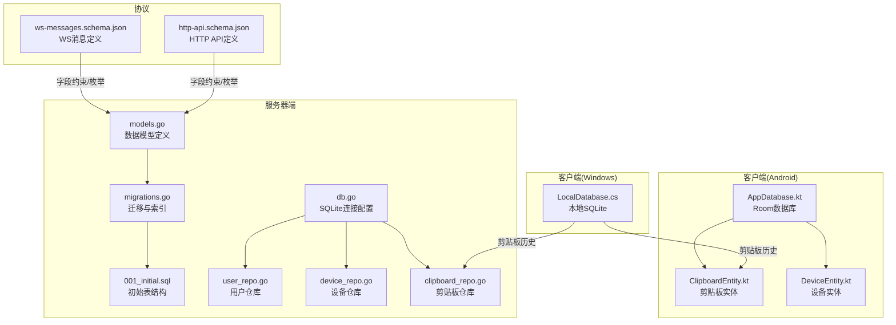
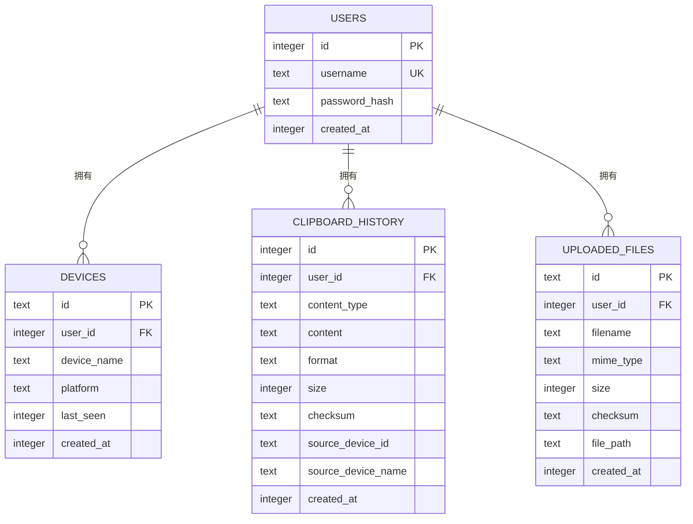
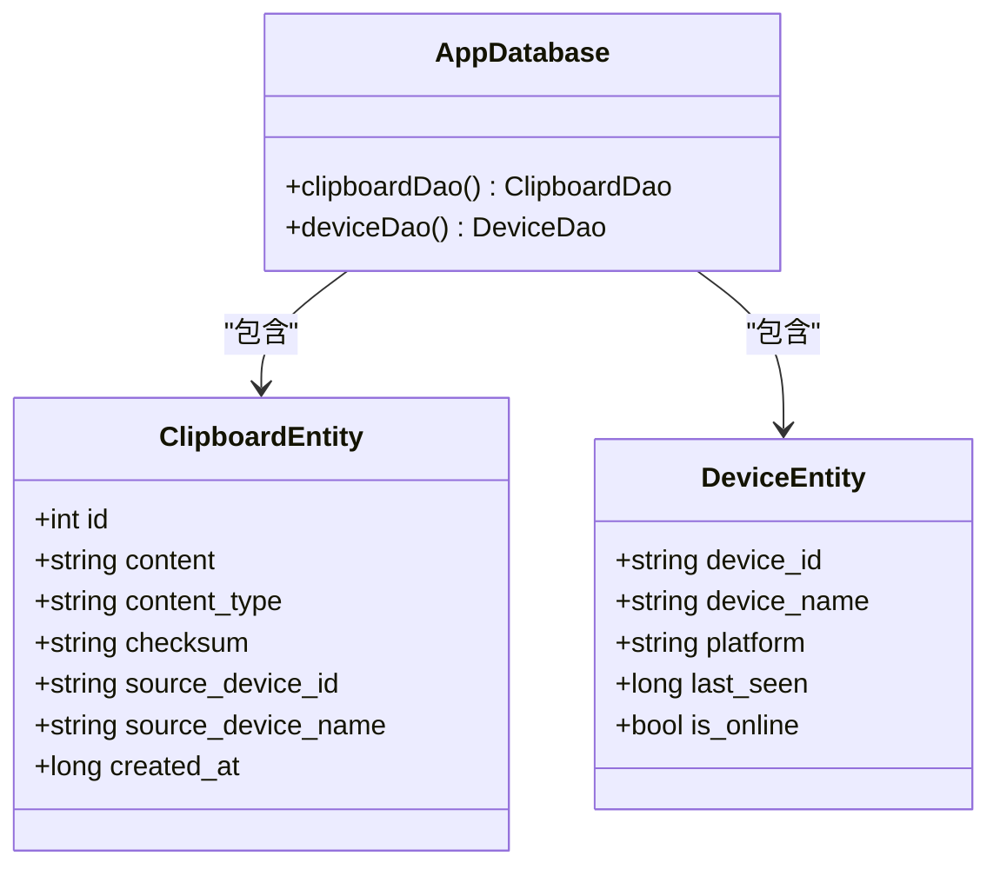
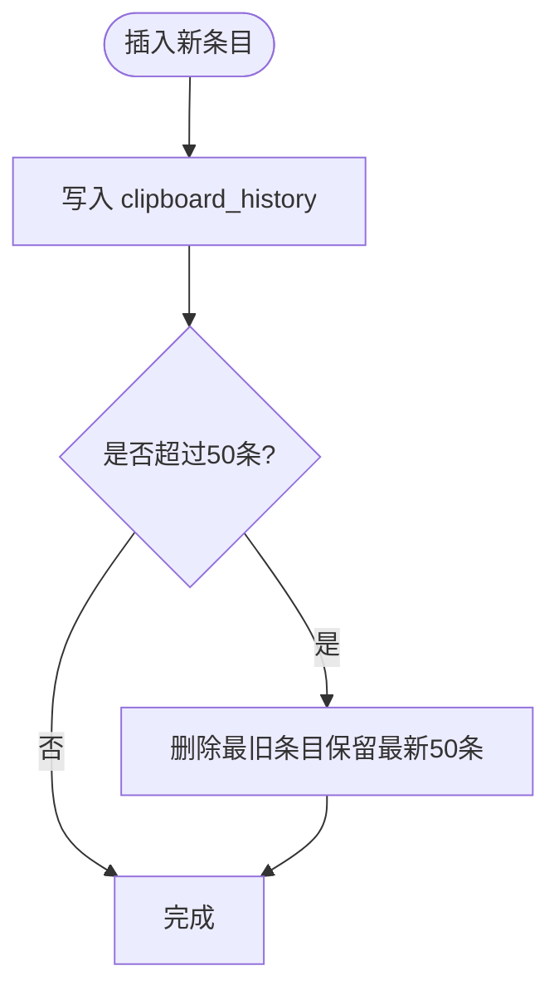
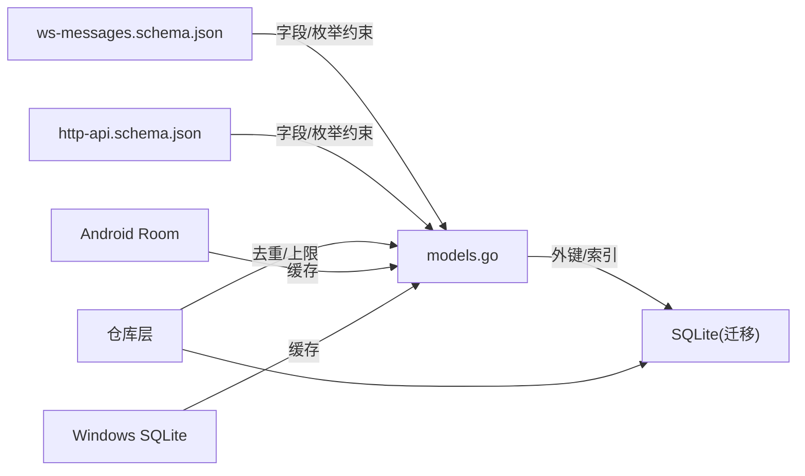
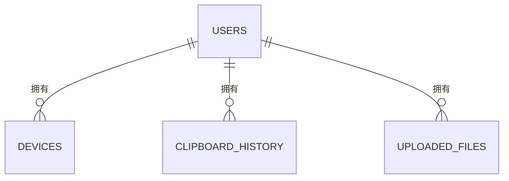

# 数据模型

<cite>
**本文引用的文件**
- [models.go](file://clipSync-server/internal/database/models.go)
- [migrations.go](file://clipSync-server/internal/database/migrations.go)
- [001_initial.sql](file://clipSync-server/migrations/001_initial.sql)
- [db.go](file://clipSync-server/internal/database/db.go)
- [user_repo.go](file://clipSync-server/internal/database/user_repo.go)
- [device_repo.go](file://clipSync-server/internal/database/device_repo.go)
- [clipboard_repo.go](file://clipSync-server/internal/database/clipboard_repo.go)
- [ClipboardEntity.kt](file://clipSync-android/app/src/main/java/com/clipsync/app/data/entities/ClipboardEntity.kt)
- [DeviceEntity.kt](file://clipSync-android/app/src/main/java/com/clipsync/app/data/entities/DeviceEntity.kt)
- [AppDatabase.kt](file://clipSync-android/app/src/main/java/com/clipsync/app/data/AppDatabase.kt)
- [LocalDatabase.cs](file://clipSync-windows/ClipSync.WPF/Storage/LocalDatabase.cs)
- [ws-messages.schema.json](file://protocol/ws-messages.schema.json)
- [http-api.schema.json](file://protocol/http-api.schema.json)
</cite>

## 目录
1. [简介](#简介)
2. [项目结构](#项目结构)
3. [核心组件](#核心组件)
4. [架构总览](#架构总览)
5. [详细组件分析](#详细组件分析)
6. [依赖关系分析](#依赖关系分析)
7. [性能考量](#性能考量)
8. [故障排查指南](#故障排查指南)
9. [结论](#结论)
10. [附录](#附录)

## 简介
本文件系统性梳理 ClipSync 的数据模型，覆盖服务器端与客户端（Android、Windows）的核心实体与关系映射，明确字段定义、数据类型、约束条件、索引设计与业务含义，并给出实体关系图、数据字典、示例数据与典型查询场景，同时解释数据验证规则与一致性保障机制。

## 项目结构
围绕数据模型的关键文件分布如下：
- 服务器端：数据库模型定义、迁移脚本、仓库层（Repository）、SQLite 连接配置
- 客户端（Android）：Room 实体与数据库
- 客户端（Windows）：本地 SQLite 存储
- 协议：WebSocket 消息与 HTTP API 的字段与约束定义



图表来源
- [models.go:1-46](file://clipSync-server/internal/database/models.go#L1-L46)
- [migrations.go:1-114](file://clipSync-server/internal/database/migrations.go#L1-L114)
- [001_initial.sql:1-55](file://clipSync-server/migrations/001_initial.sql#L1-L55)
- [db.go:1-62](file://clipSync-server/internal/database/db.go#L1-L62)
- [user_repo.go:1-91](file://clipSync-server/internal/database/user_repo.go#L1-L91)
- [device_repo.go:1-126](file://clipSync-server/internal/database/device_repo.go#L1-L126)
- [clipboard_repo.go:1-140](file://clipSync-server/internal/database/clipboard_repo.go#L1-L140)
- [AppDatabase.kt:1-41](file://clipSync-android/app/src/main/java/com/clipsync/app/data/AppDatabase.kt#L1-L41)
- [ClipboardEntity.kt:1-20](file://clipSync-android/app/src/main/java/com/clipsync/app/data/entities/ClipboardEntity.kt#L1-L20)
- [DeviceEntity.kt:1-18](file://clipSync-android/app/src/main/java/com/clipsync/app/data/entities/DeviceEntity.kt#L1-L18)
- [LocalDatabase.cs:1-169](file://clipSync-windows/ClipSync.WPF/Storage/LocalDatabase.cs#L1-L169)
- [ws-messages.schema.json:1-261](file://protocol/ws-messages.schema.json#L1-L261)
- [http-api.schema.json:1-293](file://protocol/http-api.schema.json#L1-L293)

章节来源
- [models.go:1-46](file://clipSync-server/internal/database/models.go#L1-L46)
- [migrations.go:1-114](file://clipSync-server/internal/database/migrations.go#L1-L114)
- [001_initial.sql:1-55](file://clipSync-server/migrations/001_initial.sql#L1-L55)
- [db.go:1-62](file://clipSync-server/internal/database/db.go#L1-L62)
- [AppDatabase.kt:1-41](file://clipSync-android/app/src/main/java/com/clipsync/app/data/AppDatabase.kt#L1-L41)
- [ClipboardEntity.kt:1-20](file://clipSync-android/app/src/main/java/com/clipsync/app/data/entities/ClipboardEntity.kt#L1-L20)
- [DeviceEntity.kt:1-18](file://clipSync-android/app/src/main/java/com/clipsync/app/data/entities/DeviceEntity.kt#L1-L18)
- [LocalDatabase.cs:1-169](file://clipSync-windows/ClipSync.WPF/Storage/LocalDatabase.cs#L1-L169)
- [ws-messages.schema.json:1-261](file://protocol/ws-messages.schema.json#L1-L261)
- [http-api.schema.json:1-293](file://protocol/http-api.schema.json#L1-L293)

## 核心组件
本节对服务器端与客户端的核心实体进行字段级说明，包括数据类型、约束、业务含义与取值范围。

- User（用户）
  - 字段
    - id: 整数，自增主键
    - username: 文本，唯一，长度限制见 HTTP API 规范
    - password: 文本，bcrypt 哈希存储
    - created_at: 整数，毫秒时间戳
  - 约束
    - username 唯一
    - created_at 默认当前时间（毫秒）
  - 业务含义
    - 用户标识与认证凭据存储
  - 取值范围
    - username 长度 3~50；password 长度 6~128
  - 关系
    - 一对多：一个用户可拥有多个设备与剪贴板条目

- Device（设备）
  - 字段
    - id: 文本，主键，格式由服务端生成（dev-前缀 + 随机十六进制）
    - user_id: 整数，外键，指向 users.id
    - device_name: 文本，设备名称
    - platform: 文本，平台枚举（windows/android/macos/ios）
    - last_seen: 整数，毫秒时间戳
    - created_at: 整数，毫秒时间戳
  - 约束
    - 外键：devices.user_id -> users.id（级联删除）
    - created_at/last_seen 默认当前时间（毫秒）
  - 业务含义
    - 设备注册与在线状态维护
  - 取值范围
    - platform 枚举限定
  - 关系
    - 多对一：多个设备属于一个用户

- ClipboardEntry（剪贴板条目）
  - 字段
    - id: 整数，自增主键
    - user_id: 整数，外键，指向 users.id
    - content_type: 文本，枚举（text/image/file）
    - content: 文本或二进制（服务端以字符串存储，客户端可能为二进制）
    - format: 文本，默认 text/plain
    - size: 整数，默认 0
    - checksum: 文本，内容哈希
    - source_device_id: 文本，来源设备 id
    - source_device_name: 文本，来源设备名称
    - created_at: 整数，毫秒时间戳
  - 约束
    - 外键：clipboard_history.user_id -> users.id（级联删除）
    - format 默认值
    - size 非负
  - 业务含义
    - 同步的剪贴板内容记录
  - 取值范围
    - content_type 枚举；size >= 0
  - 关系
    - 多对一：多个条目属于一个用户

- UploadedFile（上传文件）
  - 字段
    - id: 文本，主键
    - user_id: 整数，外键，指向 users.id
    - filename: 文本
    - mime_type: 文本
    - size: 整数
    - checksum: 文本
    - file_path: 文本，文件存储路径
    - created_at: 整数，毫秒时间戳
  - 约束
    - 外键：uploaded_files.user_id -> users.id（级联删除）
  - 业务含义
    - 文件上传与下载的元数据与存储位置
  - 取值范围
    - size 非负
  - 关系
    - 多对一：多个文件属于一个用户

- Android ClipboardEntity（剪贴板实体）
  - 字段
    - id: 整数，自增主键
    - content: 文本
    - content_type: 文本，默认 text
    - checksum: 文本，默认空
    - source_device_id: 文本，默认空
    - source_device_name: 文本，默认空
    - created_at: 长整型，毫秒时间戳
  - 约束
    - 本地表结构，无外键
  - 业务含义
    - 本地剪贴板历史缓存
  - 取值范围
    - content_type 默认 text

- Android DeviceEntity（设备实体）
  - 字段
    - device_id: 文本，主键
    - device_name: 文本
    - platform: 文本，默认 android
    - last_seen: 长整型，毫秒时间戳
    - is_online: 布尔，默认 false
  - 约束
    - 本地表结构，无外键
  - 业务含义
    - 已知设备列表与在线状态标记
  - 取值范围
    - platform 默认 android

- Windows LocalDatabase（本地数据库）
  - 表：clipboard_history
    - 字段
      - id: 整数，自增主键
      - content_type: 文本，非空
      - content: 文本，非空
      - format: 文本，非空
      - size: 整数，默认 0
      - checksum: 文本，非空
      - source_device_id: 文本，非空
      - source_device_name: 文本，非空
      - created_at: 整数，非空
    - 约束
      - 本地表，无外键
      - created_at 降序索引
    - 业务含义
      - 本地剪贴板历史缓存
    - 取值范围
      - size 非负

章节来源
- [models.go:3-45](file://clipSync-server/internal/database/models.go#L3-L45)
- [001_initial.sql:4-54](file://clipSync-server/migrations/001_initial.sql#L4-L54)
- [ClipboardEntity.kt:9-19](file://clipSync-android/app/src/main/java/com/clipsync/app/data/entities/ClipboardEntity.kt#L9-L19)
- [DeviceEntity.kt:9-17](file://clipSync-android/app/src/main/java/com/clipsync/app/data/entities/DeviceEntity.kt#L9-L17)
- [LocalDatabase.cs:36-54](file://clipSync-windows/ClipSync.WPF/Storage/LocalDatabase.cs#L36-L54)
- [http-api.schema.json:14-20](file://protocol/http-api.schema.json#L14-L20)
- [ws-messages.schema.json:139-146](file://protocol/ws-messages.schema.json#L139-L146)

## 架构总览
下图展示服务器端与客户端数据模型之间的关系映射与一致性保障。



图表来源
- [models.go:3-45](file://clipSync-server/internal/database/models.go#L3-L45)
- [001_initial.sql:4-54](file://clipSync-server/migrations/001_initial.sql#L4-L54)

## 详细组件分析

### 服务器端数据模型与仓库层
- 数据模型
  - User/Device/ClipboardEntry/UploadedFile 的字段与类型在模型文件中定义，与数据库表结构一致
- 仓库层职责
  - UserRepo：密码哈希、用户名存在性检查、登录校验
  - DeviceRepo：设备注册、查询、更新在线时间、注销
  - ClipboardRepo：插入条目、分页查询、去重校验、历史上限控制

```mermaid
classDiagram
class User {
+int64 id
+string username
+string password
+int64 created_at
}
class Device {
+string id
+int64 user_id
+string device_name
+string platform
+int64 last_seen
+int64 created_at
}
class ClipboardEntry {
+int64 id
+int64 user_id
+string content_type
+string content
+string format
+int64 size
+string checksum
+string source_device_id
+string source_device_name
+int64 created_at
}
class UploadedFile {
+string id
+int64 user_id
+string filename
+string mime_type
+int64 size
+string checksum
+string file_path
+int64 created_at
}
class UserRepo {
+CreateUser(username, password) User
+GetUserByUsername(username) User
+VerifyPassword(username, password) User
+UserExists(username) bool
}
class DeviceRepo {
+CreateDevice(userID, deviceName, platform) Device
+GetDevice(deviceID) Device
+GetDevicesByUser(userID) []Device
+UpdateDeviceLastSeen(deviceID) void
+DeleteDevice(userID, deviceID) bool
+DeviceBelongsToUser(userID, deviceID) bool
}
class ClipboardRepo {
+AddEntry(userID, contentType, content, format, size, checksum, sourceDeviceID, sourceDeviceName) ClipboardEntry
+GetHistory(userID, limit, afterID) ([]ClipboardEntry, int, bool)
+GetLatestByUser(userID) ClipboardEntry
+CheckDuplicateChecksum(userID, checksum) bool
}
UserRepo --> User : "创建/查询"
DeviceRepo --> Device : "创建/查询"
ClipboardRepo --> ClipboardEntry : "创建/查询"
User ||--o{ Device : "拥有"
User ||--o{ ClipboardEntry : "拥有"
User ||--o{ UploadedFile : "拥有"
```

图表来源
- [models.go:3-45](file://clipSync-server/internal/database/models.go#L3-L45)
- [user_repo.go:21-90](file://clipSync-server/internal/database/user_repo.go#L21-L90)
- [device_repo.go:21-125](file://clipSync-server/internal/database/device_repo.go#L21-L125)
- [clipboard_repo.go:20-139](file://clipSync-server/internal/database/clipboard_repo.go#L20-L139)

章节来源
- [models.go:3-45](file://clipSync-server/internal/database/models.go#L3-L45)
- [user_repo.go:21-90](file://clipSync-server/internal/database/user_repo.go#L21-L90)
- [device_repo.go:21-125](file://clipSync-server/internal/database/device_repo.go#L21-L125)
- [clipboard_repo.go:20-139](file://clipSync-server/internal/database/clipboard_repo.go#L20-L139)

### 客户端数据模型（Android）
- AppDatabase：声明实体集合与版本
- ClipboardEntity：本地剪贴板历史缓存
- DeviceEntity：已知设备列表与在线状态



图表来源
- [AppDatabase.kt:14-40](file://clipSync-android/app/src/main/java/com/clipsync/app/data/AppDatabase.kt#L14-L40)
- [ClipboardEntity.kt:9-19](file://clipSync-android/app/src/main/java/com/clipsync/app/data/entities/ClipboardEntity.kt#L9-L19)
- [DeviceEntity.kt:9-17](file://clipSync-android/app/src/main/java/com/clipsync/app/data/entities/DeviceEntity.kt#L9-L17)

章节来源
- [AppDatabase.kt:14-40](file://clipSync-android/app/src/main/java/com/clipsync/app/data/AppDatabase.kt#L14-L40)
- [ClipboardEntity.kt:9-19](file://clipSync-android/app/src/main/java/com/clipsync/app/data/entities/ClipboardEntity.kt#L9-L19)
- [DeviceEntity.kt:9-17](file://clipSync-android/app/src/main/java/com/clipsync/app/data/entities/DeviceEntity.kt#L9-L17)

### 客户端数据模型（Windows）
- LocalDatabase：本地 SQLite，仅包含 clipboard_history 表，用于缓存最近条目
- 限制：最多保留最近 50 条记录，按 created_at 降序排序



图表来源
- [LocalDatabase.cs:60-96](file://clipSync-windows/ClipSync.WPF/Storage/LocalDatabase.cs#L60-L96)

章节来源
- [LocalDatabase.cs:36-54](file://clipSync-windows/ClipSync.WPF/Storage/LocalDatabase.cs#L36-L54)
- [LocalDatabase.cs:60-96](file://clipSync-windows/ClipSync.WPF/Storage/LocalDatabase.cs#L60-L96)

### 数据一致性与验证规则
- 服务器端
  - 用户名唯一性：通过数据库唯一约束与仓库层存在性检查共同保证
  - 密码安全：bcrypt 哈希存储，登录时比对
  - 设备归属校验：通过外键与“设备属于用户”查询确保操作权限
  - 内容去重：基于 checksum 的重复检测
  - 历史上限：服务端仓库层强制限制条目数量
- 客户端
  - Android：Room 本地缓存，无外键约束
  - Windows：本地 SQLite 缓存，最多 50 条记录
- 协议约束
  - WebSocket 消息字段与枚举在 schema 中定义
  - HTTP API 请求体字段长度、枚举与错误码在 schema 中定义

章节来源
- [user_repo.go:82-90](file://clipSync-server/internal/database/user_repo.go#L82-L90)
- [device_repo.go:108-119](file://clipSync-server/internal/database/device_repo.go#L108-L119)
- [clipboard_repo.go:128-139](file://clipSync-server/internal/database/clipboard_repo.go#L128-L139)
- [ws-messages.schema.json:88-261](file://protocol/ws-messages.schema.json#L88-L261)
- [http-api.schema.json:14-20](file://protocol/http-api.schema.json#L14-L20)

## 依赖关系分析
- 服务器端
  - 数据模型与迁移脚本保持一致，索引覆盖常用查询维度
  - 仓库层通过外键约束与事务保证数据完整性
- 客户端
  - Android 使用 Room，Windows 使用本地 SQLite，均用于缓存与离线体验
- 协议
  - WebSocket 与 HTTP API 的字段命名与约束在 schema 中统一定义，确保跨端一致性



图表来源
- [models.go:3-45](file://clipSync-server/internal/database/models.go#L3-L45)
- [migrations.go:20-80](file://clipSync-server/internal/database/migrations.go#L20-L80)
- [ws-messages.schema.json:88-261](file://protocol/ws-messages.schema.json#L88-L261)
- [http-api.schema.json:14-20](file://protocol/http-api.schema.json#L14-L20)

章节来源
- [migrations.go:20-80](file://clipSync-server/internal/database/migrations.go#L20-L80)
- [ws-messages.schema.json:88-261](file://protocol/ws-messages.schema.json#L88-L261)
- [http-api.schema.json:14-20](file://protocol/http-api.schema.json#L14-L20)

## 性能考量
- 服务器端
  - WAL 模式开启，提升并发读性能
  - PRAGMA 调优：cache_size、temp_store、synchronous
  - 连接池：最大打开连接数与空闲连接数限制
  - 索引设计：devices(user_id)、clipboard_history(user_id)、clipboard_history(user_id, checksum)、clipboard_history(user_id, created_at DESC)
- 客户端
  - Android：Room 查询优化与 DAO 访问
  - Windows：本地 SQLite 索引 created_at DESC，配合上限控制减少扫描成本

章节来源
- [db.go:17-55](file://clipSync-server/internal/database/db.go#L17-L55)
- [migrations.go:45-63](file://clipSync-server/internal/database/migrations.go#L45-L63)
- [LocalDatabase.cs:50-54](file://clipSync-windows/ClipSync.WPF/Storage/LocalDatabase.cs#L50-L54)

## 故障排查指南
- 常见错误与处理
  - DUPLICATE_CONTENT：相同 checksum 已存在，建议去重或变更内容
  - USERNAME_EXISTS：用户名冲突，需更换用户名
  - DEVICE_NOT_FOUND：设备不存在或已注销
  - CONTENT_TOO_LARGE：文件过大，建议压缩或拆分
  - INVALID_CREDENTIALS：用户名或密码错误
- 诊断步骤
  - 检查用户名唯一性与密码哈希
  - 校验设备归属与在线状态
  - 核对 checksum 去重逻辑
  - 查看索引是否命中（user_id、checksum、created_at）

章节来源
- [http-api.schema.json:280-291](file://protocol/http-api.schema.json#L280-L291)
- [clipboard_repo.go:128-139](file://clipSync-server/internal/database/clipboard_repo.go#L128-L139)
- [user_repo.go:82-90](file://clipSync-server/internal/database/user_repo.go#L82-L90)
- [device_repo.go:108-119](file://clipSync-server/internal/database/device_repo.go#L108-L119)

## 结论
ClipSync 的数据模型在服务器端采用 SQLite+WAL+索引优化，在客户端采用本地缓存策略，结合协议 schema 统一字段与约束，实现跨端一致性与高可用。通过外键、唯一性、去重与历史上限等机制，有效保障数据完整性与性能。

## 附录

### 实体关系图（ERD）


图表来源
- [models.go:3-45](file://clipSync-server/internal/database/models.go#L3-L45)

### 数据字典
- User
  - id: 整数，自增主键
  - username: 文本，唯一，3~50
  - password: 文本，bcrypt 哈希
  - created_at: 整数，毫秒时间戳
- Device
  - id: 文本，主键，dev-前缀 + 随机十六进制
  - user_id: 整数，外键 users.id
  - device_name: 文本
  - platform: 文本，枚举(windows/android/macos/ios)
  - last_seen: 整数，毫秒时间戳
  - created_at: 整数，毫秒时间戳
- ClipboardEntry
  - id: 整数，自增主键
  - user_id: 整数，外键 users.id
  - content_type: 文本，枚举(text/image/file)
  - content: 文本或二进制
  - format: 文本，默认 text/plain
  - size: 整数，默认 0
  - checksum: 文本，内容哈希
  - source_device_id: 文本
  - source_device_name: 文本
  - created_at: 整数，毫秒时间戳
- UploadedFile
  - id: 文本，主键
  - user_id: 整数，外键 users.id
  - filename: 文本
  - mime_type: 文本
  - size: 整数
  - checksum: 文本
  - file_path: 文本
  - created_at: 整数，毫秒时间戳

章节来源
- [models.go:3-45](file://clipSync-server/internal/database/models.go#L3-L45)
- [001_initial.sql:4-54](file://clipSync-server/migrations/001_initial.sql#L4-L54)

### 示例数据
- User
  - username: "alice"
  - password: "bcrypt_hashed"
  - created_at: 1714339200000
- Device
  - id: "dev-a1b2c3..."
  - user_id: 1
  - device_name: "Alice-Phone"
  - platform: "android"
  - last_seen: 1714339200000
  - created_at: 1714339200000
- ClipboardEntry
  - user_id: 1
  - content_type: "text"
  - content: "Hello ClipSync"
  - format: "text/plain"
  - size: 12
  - checksum: "abc123..."
  - source_device_id: "dev-a1b2c3..."
  - source_device_name: "Alice-Phone"
  - created_at: 1714339200000
- UploadedFile
  - id: "file-xyz"
  - user_id: 1
  - filename: "image.png"
  - mime_type: "image/png"
  - size: 102400
  - checksum: "def456..."
  - file_path: "/storage/uploads/image.png"
  - created_at: 1714339200000

章节来源
- [models.go:3-45](file://clipSync-server/internal/database/models.go#L3-L45)

### 典型查询场景
- 获取用户设备列表（降序在线时间）
  - 查询 devices(user_id) 并按 last_seen DESC 排序
- 分页获取剪贴板历史（按 created_at DESC）
  - 查询 clipboard_history(user_id) 并限制条数
- 去重插入（基于 checksum）
  - 先查询 checksum 是否存在，不存在则插入
- 设备注销（删除设备）
  - 删除 devices(user_id, id)，返回受影响行数

章节来源
- [device_repo.go:61-79](file://clipSync-server/internal/database/device_repo.go#L61-L79)
- [clipboard_repo.go:66-110](file://clipSync-server/internal/database/clipboard_repo.go#L66-L110)
- [clipboard_repo.go:128-139](file://clipSync-server/internal/database/clipboard_repo.go#L128-L139)
- [device_repo.go:92-106](file://clipSync-server/internal/database/device_repo.go#L92-L106)

### 服务器端与客户端数据模型差异与一致性
- 差异点
  - 服务器端：具备外键、唯一性约束、索引与历史上限控制
  - 客户端：本地缓存，无外键约束；Windows 限制最多 50 条
- 一致性保障
  - 协议 schema 统一字段命名（snake_case）与枚举
  - 服务器端去重与历史上限避免重复与膨胀
  - 客户端缓存作为补充，最终以服务器为准

章节来源
- [ws-messages.schema.json:73-92](file://protocol/ws-messages.schema.json#L73-L92)
- [LocalDatabase.cs:85-95](file://clipSync-windows/ClipSync.WPF/Storage/LocalDatabase.cs#L85-L95)
- [clipboard_repo.go:39-50](file://clipSync-server/internal/database/clipboard_repo.go#L39-L50)