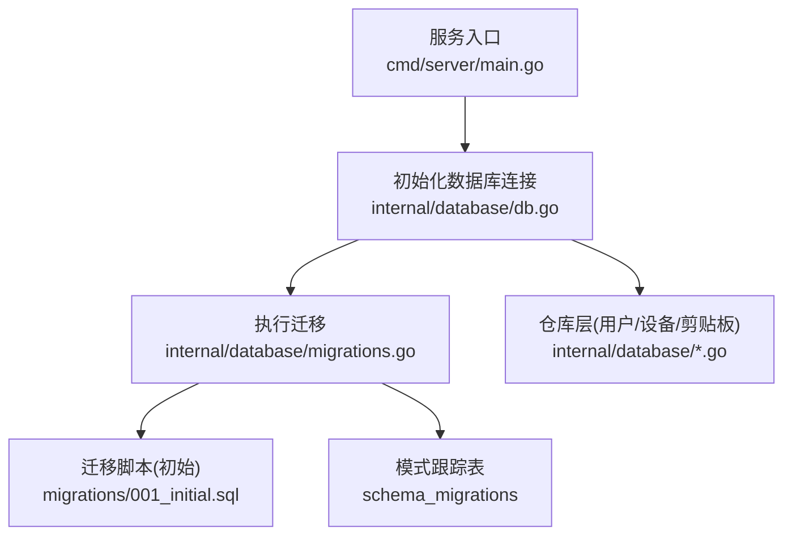
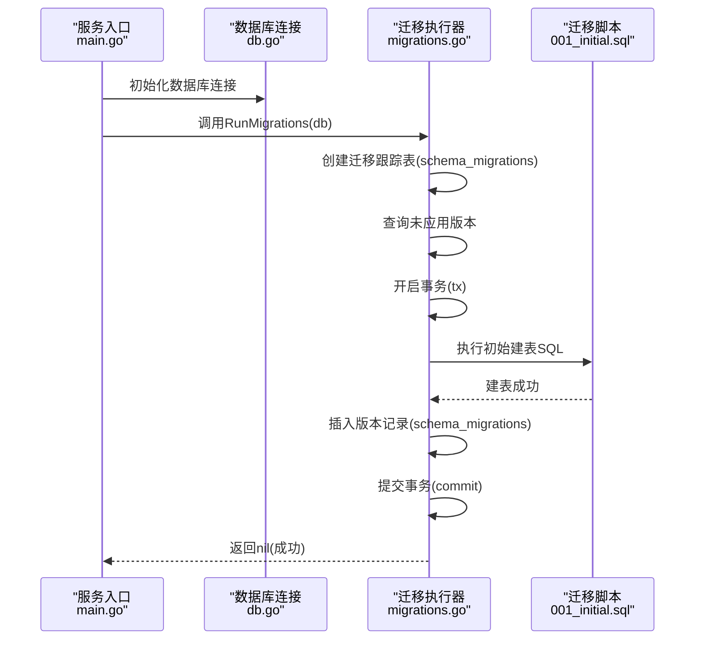
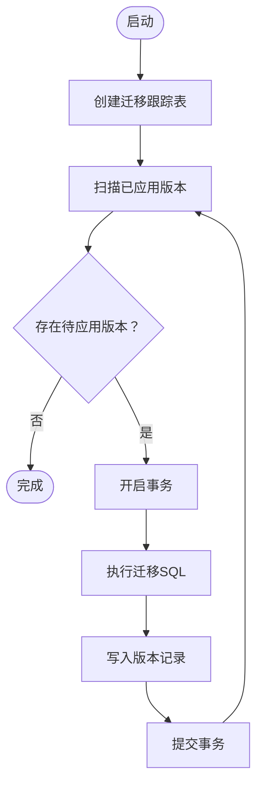
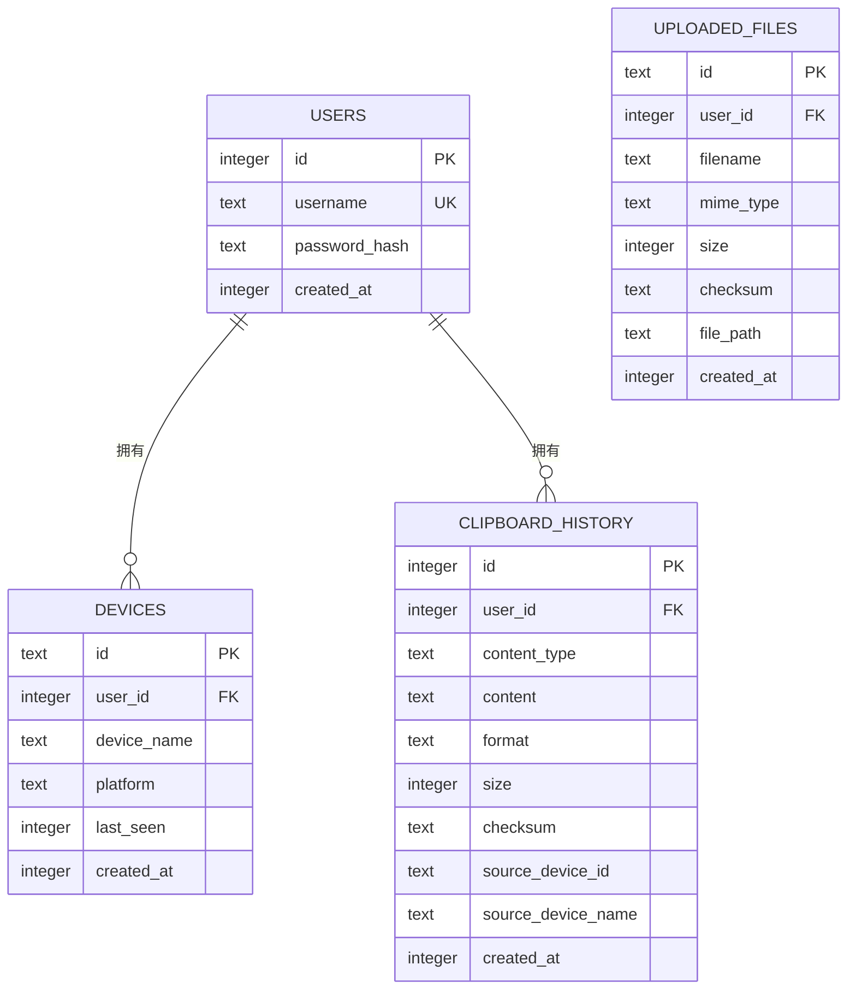
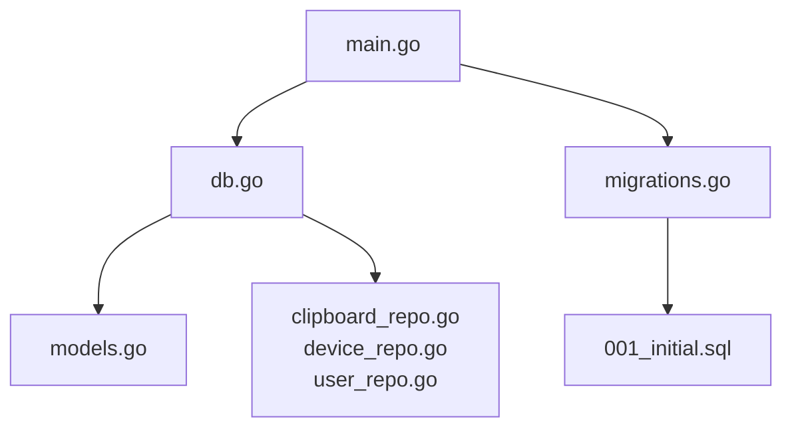

# 数据迁移策略

<cite>
**本文引用的文件**
- [clipSync-server/migrations/001_initial.sql](file://clipSync-server/migrations/001_initial.sql)
- [clipSync-server/internal/database/migrations.go](file://clipSync-server/internal/database/migrations.go)
- [clipSync-server/internal/database/db.go](file://clipSync-server/internal/database/db.go)
- [clipSync-server/internal/database/models.go](file://clipSync-server/internal/database/models.go)
- [clipSync-server/internal/database/clipboard_repo.go](file://clipSync-server/internal/database/clipboard_repo.go)
- [clipSync-server/internal/database/device_repo.go](file://clipSync-server/internal/database/device_repo.go)
- [clipSync-server/internal/database/user_repo.go](file://clipSync-server/internal/database/user_repo.go)
- [clipSync-server/cmd/server/main.go](file://clipSync-server/cmd/server/main.go)
- [clipSync-server/configs/config.yaml](file://clipSync-server/configs/config.yaml)
- [DEVELOPMENT_PLAN.md](file://DEVELOPMENT_PLAN.md)
- [scripts/test-protocol-compatibility.ps1](file://scripts/test-protocol-compatibility.ps1)
</cite>

## 目录
1. [简介](#简介)
2. [项目结构](#项目结构)
3. [核心组件](#核心组件)
4. [架构总览](#架构总览)
5. [详细组件分析](#详细组件分析)
6. [依赖分析](#依赖分析)
7. [性能考量](#性能考量)
8. [故障排查指南](#故障排查指南)
9. [结论](#结论)
10. [附录](#附录)

## 简介
本文件面向ClipSync服务端的数据库迁移策略与版本管理，系统化阐述以下内容：
- 数据库版本管理机制与迁移脚本编写规范
- 初始数据库结构与后续演进路径
- 向后兼容性保证与数据完整性检查
- 迁移失败回滚策略与数据恢复方案
- 自动化迁移测试与验证流程
- 生产环境迁移步骤与风险控制措施
- 数据备份、验证与清理的完整流程
- 迁移过程中的停机时间与性能影响评估

## 项目结构
ClipSync服务端采用SQLite作为本地存储，通过启动时执行迁移脚本确保数据库模式一致。迁移逻辑由服务入口在启动阶段调用，迁移状态通过独立表进行跟踪。

图表来源
- [clipSync-server/cmd/server/main.go:43-54](file://clipSync-server/cmd/server/main.go#L43-L54)
- [clipSync-server/internal/database/db.go:17-56](file://clipSync-server/internal/database/db.go#L17-L56)
- [clipSync-server/internal/database/migrations.go:8-114](file://clipSync-server/internal/database/migrations.go#L8-L114)
- [clipSync-server/migrations/001_initial.sql:1-55](file://clipSync-server/migrations/001_initial.sql#L1-L55)

章节来源
- [clipSync-server/cmd/server/main.go:43-54](file://clipSync-server/cmd/server/main.go#L43-L54)
- [clipSync-server/internal/database/db.go:17-56](file://clipSync-server/internal/database/db.go#L17-L56)
- [clipSync-server/internal/database/migrations.go:8-114](file://clipSync-server/internal/database/migrations.go#L8-L114)
- [clipSync-server/migrations/001_initial.sql:1-55](file://clipSync-server/migrations/001_initial.sql#L1-L55)

## 核心组件
- 数据库连接与配置：负责打开SQLite连接、启用WAL模式、设置同步级别与缓存参数，并进行健康检查。
- 迁移执行器：创建迁移跟踪表、按顺序执行未应用的迁移、在事务中执行SQL并记录版本。
- 模型定义：用户、设备、剪贴板历史、上传文件等实体的数据结构。
- 仓库层：封装用户、设备、剪贴板历史的CRUD操作，含去重校验与历史上限控制。
- 配置：定义数据库路径、JWT密钥、文件存储目录、历史条数限制等运行参数。

章节来源
- [clipSync-server/internal/database/db.go:17-56](file://clipSync-server/internal/database/db.go#L17-L56)
- [clipSync-server/internal/database/migrations.go:8-114](file://clipSync-server/internal/database/migrations.go#L8-L114)
- [clipSync-server/internal/database/models.go:3-46](file://clipSync-server/internal/database/models.go#L3-L46)
- [clipSync-server/internal/database/clipboard_repo.go:20-140](file://clipSync-server/internal/database/clipboard_repo.go#L20-L140)
- [clipSync-server/internal/database/device_repo.go:21-126](file://clipSync-server/internal/database/device_repo.go#L21-L126)
- [clipSync-server/internal/database/user_repo.go:21-91](file://clipSync-server/internal/database/user_repo.go#L21-L91)
- [clipSync-server/configs/config.yaml:1-29](file://clipSync-server/configs/config.yaml#L1-L29)

## 架构总览
迁移流程在服务启动时自动执行，确保数据库模式与代码一致。迁移以事务方式执行，失败即回滚；迁移状态通过独立表记录，避免重复执行。

图表来源
- [clipSync-server/cmd/server/main.go:43-54](file://clipSync-server/cmd/server/main.go#L43-L54)
- [clipSync-server/internal/database/migrations.go:8-114](file://clipSync-server/internal/database/migrations.go#L8-L114)
- [clipSync-server/migrations/001_initial.sql:1-55](file://clipSync-server/migrations/001_initial.sql#L1-L55)

## 详细组件分析

### 数据库版本管理机制
- 迁移跟踪表：每次启动时创建版本跟踪表，记录已应用的迁移版本号与应用时间。
- 版本顺序：当前仅包含初始版本1，后续新增迁移时应按递增顺序编号。
- 幂等性：通过查询跟踪表判断是否已应用，避免重复执行。
- 事务语义：每个迁移在独立事务中执行，失败自动回滚，保证原子性。

图表来源
- [clipSync-server/internal/database/migrations.go:82-110](file://clipSync-server/internal/database/migrations.go#L82-L110)

章节来源
- [clipSync-server/internal/database/migrations.go:8-114](file://clipSync-server/internal/database/migrations.go#L8-L114)

### 迁移脚本编写规范
- 文件命名：使用四位前缀加下划线的版本号，如001_initial.sql，便于排序与识别。
- 内容组织：每个迁移文件包含完整的DDL与索引创建，必要时包含注释说明。
- 可回滚：建议为复杂变更提供对应的降级SQL（down脚本），以便回滚。
- 事务边界：单个迁移内的多条SQL在一个事务中执行，失败整体回滚。
- 兼容性：新字段默认值、外键约束需考虑现有数据的兼容性。

章节来源
- [clipSync-server/migrations/001_initial.sql:1-55](file://clipSync-server/migrations/001_initial.sql#L1-L55)
- [DEVELOPMENT_PLAN.md:407-410](file://DEVELOPMENT_PLAN.md#L407-L410)

### 初始数据库结构与演进路径
- 初始版本包含四张核心表：users、devices、clipboard_history、uploaded_files。
- 关键索引：devices.user_id、clipboard_history.user_id、clipboard_history.checksum、clipboard_history.created_at、uploaded_files.user_id。
- 外键约束：devices.user_id与users.id、clipboard_history.user_id与users.id均设置级联删除。
- 演进路径：后续版本可在此基础上添加索引、列或表，但需保持向后兼容。

图表来源
- [clipSync-server/migrations/001_initial.sql:4-55](file://clipSync-server/migrations/001_initial.sql#L4-L55)

章节来源
- [clipSync-server/migrations/001_initial.sql:4-55](file://clipSync-server/migrations/001_initial.sql#L4-L55)

### 向后兼容性保证与数据完整性检查
- 时间戳格式：所有时间字段统一为Unix毫秒，便于跨平台一致性。
- 去重校验：剪贴板历史按checksum进行去重，避免重复同步。
- 历史上限：通过仓库层限制每用户的剪贴板历史数量，超出部分自动清理。
- 外键约束：删除用户时级联删除其设备与剪贴板历史，保证引用完整性。
- 索引优化：为高频查询字段建立索引，提升读取性能。

章节来源
- [clipSync-server/internal/database/clipboard_repo.go:128-140](file://clipSync-server/internal/database/clipboard_repo.go#L128-L140)
- [clipSync-server/internal/database/clipboard_repo.go:39-50](file://clipSync-server/internal/database/clipboard_repo.go#L39-L50)
- [clipSync-server/migrations/001_initial.sql:12-40](file://clipSync-server/migrations/001_initial.sql#L12-L40)

### 迁移失败回滚策略与数据恢复方案
- 回滚策略：单次迁移失败会触发事务回滚，不会污染数据库；重启后再次尝试可继续执行。
- 数据恢复：若迁移后出现异常，可基于备份文件恢复到迁移前状态；生产环境建议在迁移前进行全量备份。
- 降级方案：对于高风险变更，建议提供down脚本或分步迁移，先添加默认值列，再填充数据，最后删除旧字段。

章节来源
- [clipSync-server/internal/database/migrations.go:91-109](file://clipSync-server/internal/database/migrations.go#L91-L109)

### 自动化迁移测试与验证流程
- 单元测试：针对迁移执行器的错误场景（如跟踪表创建失败、SQL执行失败）进行断言。
- 集成测试：启动一个临时数据库，执行迁移后验证表结构、索引与约束是否存在。
- 兼容性测试：通过协议兼容性脚本验证消息类型、字段命名与错误码的一致性，间接确认模型映射正确。
- 性能回归：在迁移前后对比查询性能，确保索引与查询计划未退化。

章节来源
- [scripts/test-protocol-compatibility.ps1:52-164](file://scripts/test-protocol-compatibility.ps1#L52-L164)
- [DEVELOPMENT_PLAN.md:716-797](file://DEVELOPMENT_PLAN.md#L716-L797)

### 生产环境迁移步骤与风险控制措施
- 步骤
  1) 准备：生成数据库备份，记录当前版本与配置。
  2) 预检查：在非高峰时段验证迁移脚本与配置。
  3) 执行：部署新版本，启动服务自动执行迁移。
  4) 验证：检查迁移日志、表结构与关键查询性能。
  5) 回滚：若发现异常，立即停止服务并从备份恢复。
- 风险控制
  - 仅在维护窗口执行迁移
  - 使用只读副本或离线迁移
  - 严格遵循幂等与事务原则
  - 预留回滚脚本与数据恢复流程

章节来源
- [clipSync-server/cmd/server/main.go:21-54](file://clipSync-server/cmd/server/main.go#L21-L54)
- [clipSync-server/configs/config.yaml:9-10](file://clipSync-server/configs/config.yaml#L9-L10)

### 数据备份、验证与清理的完整流程
- 备份
  - SQLite支持直接复制数据库文件；建议在迁移前进行全量备份。
  - 对于大表，可考虑导出关键数据与结构。
- 验证
  - 结构验证：检查表、索引、约束是否存在。
  - 数据验证：抽样比对关键统计指标（如用户数、设备数、剪贴板条目数）。
  - 功能验证：执行典型查询与业务流程（登录、同步、历史拉取）。
- 清理
  - 迁移完成后清理临时文件与旧备份（保留最近N次备份）。
  - 监控数据库大小与性能指标，及时处理异常增长。

章节来源
- [clipSync-server/internal/database/db.go:17-56](file://clipSync-server/internal/database/db.go#L17-L56)

### 迁移过程中的停机时间与性能影响
- 停机时间：迁移通常在启动时完成，实际停机时间取决于数据库大小与服务器性能；SQLite在WAL模式下可减少锁争用。
- 性能影响：WAL模式与索引可提升并发读取；历史上限控制可避免表膨胀导致的性能下降。
- 优化建议：在迁移前评估索引数量与查询模式，必要时分批执行大型DDL。

章节来源
- [clipSync-server/internal/database/db.go:33-49](file://clipSync-server/internal/database/db.go#L33-L49)
- [clipSync-server/internal/database/clipboard_repo.go:39-50](file://clipSync-server/internal/database/clipboard_repo.go#L39-L50)

## 依赖分析
迁移执行器依赖数据库连接与迁移脚本；服务入口在启动时负责顺序调用；仓库层依赖数据库连接与模型定义。

图表来源
- [clipSync-server/cmd/server/main.go:43-54](file://clipSync-server/cmd/server/main.go#L43-L54)
- [clipSync-server/internal/database/migrations.go:8-114](file://clipSync-server/internal/database/migrations.go#L8-L114)
- [clipSync-server/migrations/001_initial.sql:1-55](file://clipSync-server/migrations/001_initial.sql#L1-L55)
- [clipSync-server/internal/database/db.go:17-56](file://clipSync-server/internal/database/db.go#L17-L56)
- [clipSync-server/internal/database/models.go:3-46](file://clipSync-server/internal/database/models.go#L3-L46)
- [clipSync-server/internal/database/clipboard_repo.go:20-140](file://clipSync-server/internal/database/clipboard_repo.go#L20-L140)
- [clipSync-server/internal/database/device_repo.go:21-126](file://clipSync-server/internal/database/device_repo.go#L21-L126)
- [clipSync-server/internal/database/user_repo.go:21-91](file://clipSync-server/internal/database/user_repo.go#L21-L91)

章节来源
- [clipSync-server/cmd/server/main.go:43-54](file://clipSync-server/cmd/server/main.go#L43-L54)
- [clipSync-server/internal/database/migrations.go:8-114](file://clipSync-server/internal/database/migrations.go#L8-L114)
- [clipSync-server/migrations/001_initial.sql:1-55](file://clipSync-server/migrations/001_initial.sql#L1-L55)
- [clipSync-server/internal/database/db.go:17-56](file://clipSync-server/internal/database/db.go#L17-L56)
- [clipSync-server/internal/database/models.go:3-46](file://clipSync-server/internal/database/models.go#L3-L46)
- [clipSync-server/internal/database/clipboard_repo.go:20-140](file://clipSync-server/internal/database/clipboard_repo.go#L20-L140)
- [clipSync-server/internal/database/device_repo.go:21-126](file://clipSync-server/internal/database/device_repo.go#L21-L126)
- [clipSync-server/internal/database/user_repo.go:21-91](file://clipSync-server/internal/database/user_repo.go#L21-L91)

## 性能考量
- 连接池与并发：设置最大连接数与空闲连接数，适配2核2G服务器的资源限制。
- WAL模式：提升并发读取能力，降低写入阻塞概率。
- 同步级别与缓存：调整同步级别与缓存大小以平衡可靠性与性能。
- 查询优化：为高频查询字段建立索引，避免全表扫描；通过历史上限控制表规模。

章节来源
- [clipSync-server/internal/database/db.go:29-49](file://clipSync-server/internal/database/db.go#L29-L49)
- [clipSync-server/migrations/001_initial.sql:22-55](file://clipSync-server/migrations/001_initial.sql#L22-L55)
- [clipSync-server/internal/database/clipboard_repo.go:39-50](file://clipSync-server/internal/database/clipboard_repo.go#L39-L50)

## 故障排查指南
- 迁移失败
  - 症状：启动时报错，迁移未完成。
  - 排查：查看迁移跟踪表是否已有版本记录；检查事务回滚原因；确认SQL语法与权限。
- 表结构不一致
  - 症状：查询报错或索引缺失。
  - 排查：确认迁移脚本是否完整执行；核对目标版本与当前版本。
- 性能异常
  - 症状：查询缓慢或CPU占用高。
  - 排查：检查索引使用情况；确认历史上限配置；评估WAL模式下的写入压力。
- 数据不一致
  - 症状：去重失效或历史丢失。
  - 排查：核对checksum计算与存储；检查级联删除策略；验证仓库层的历史清理逻辑。

章节来源
- [clipSync-server/internal/database/migrations.go:91-109](file://clipSync-server/internal/database/migrations.go#L91-L109)
- [clipSync-server/internal/database/clipboard_repo.go:128-140](file://clipSync-server/internal/database/clipboard_repo.go#L128-L140)
- [clipSync-server/migrations/001_initial.sql:12-40](file://clipSync-server/migrations/001_initial.sql#L12-L40)

## 结论
ClipSync服务端采用轻量级的SQLite与自定义迁移机制，通过事务与版本跟踪确保迁移的原子性与幂等性。结合索引与历史上限控制，可在保证性能的同时维持数据完整性。建议在生产环境中遵循严格的备份与回滚流程，并在维护窗口内执行迁移，以最小化对用户的影响。

## 附录
- 配置项参考
  - 数据库路径：用于指定SQLite文件位置
  - JWT密钥与过期时间：用于认证令牌生成与校验
  - 文件存储目录与最大文件大小：用于文件上传下载
  - 剪贴板历史条数限制：用于控制历史规模
  - 心跳超时：用于检测客户端连接状态

章节来源
- [clipSync-server/configs/config.yaml:9-29](file://clipSync-server/configs/config.yaml#L9-L29)