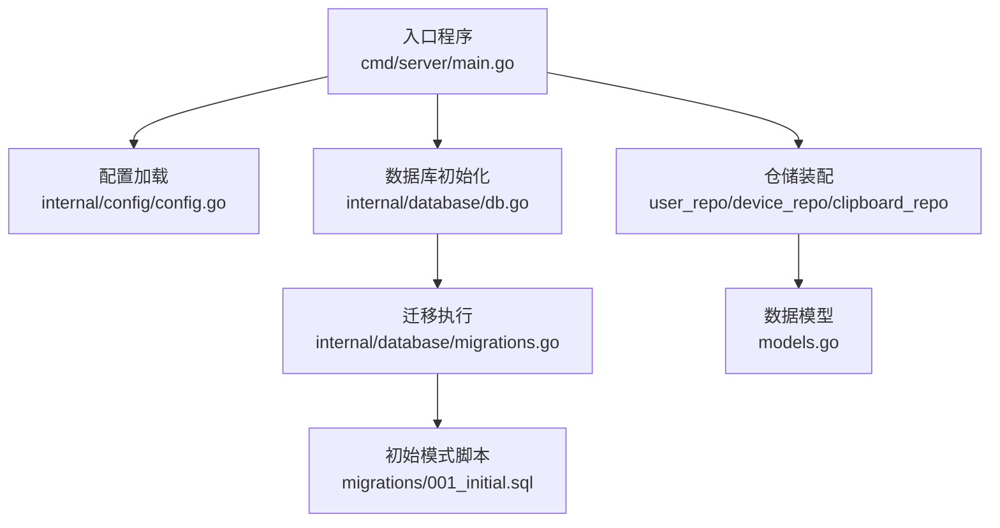
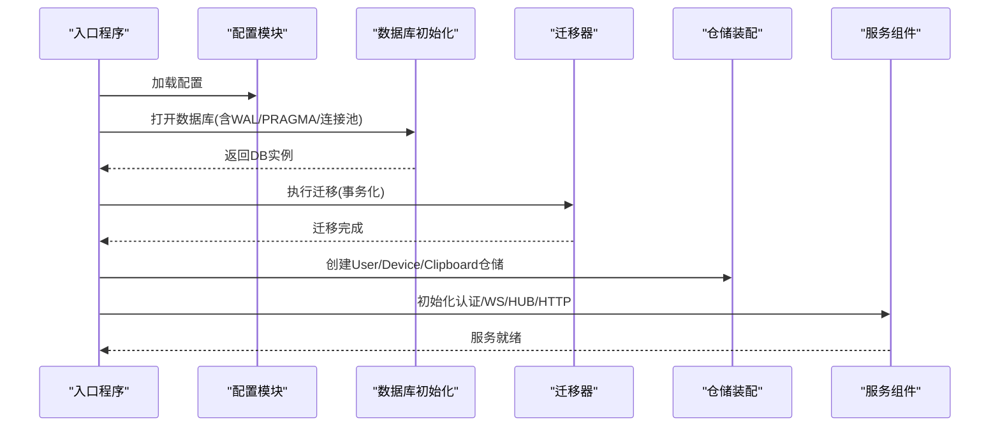
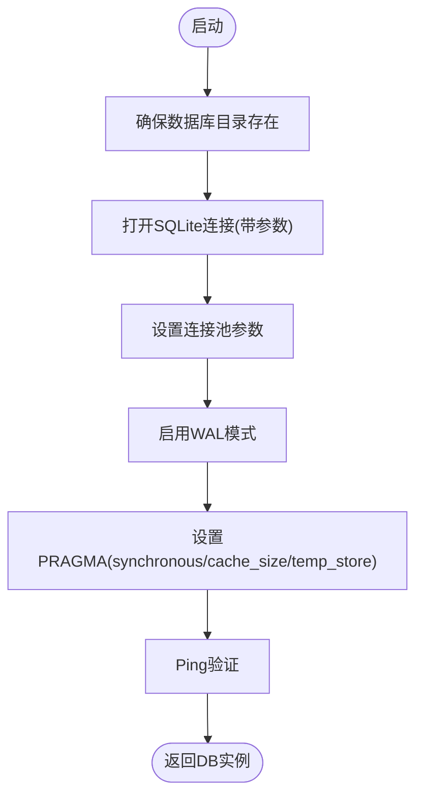
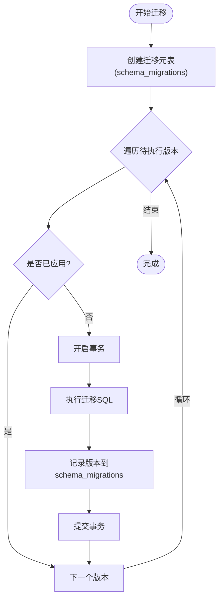
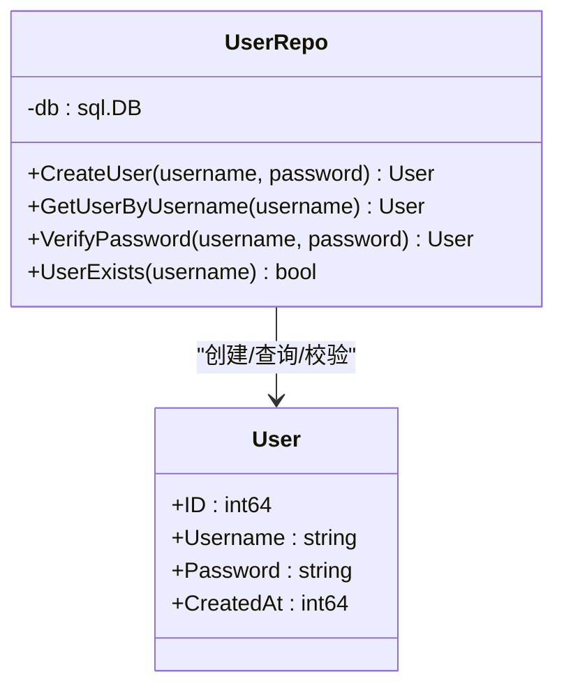
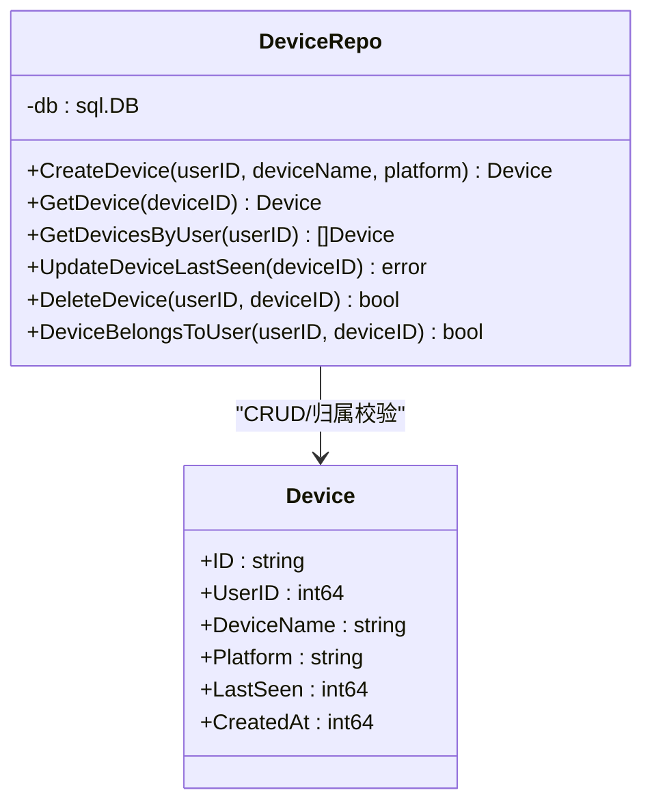
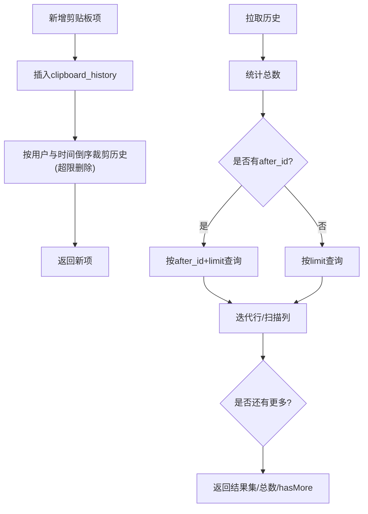
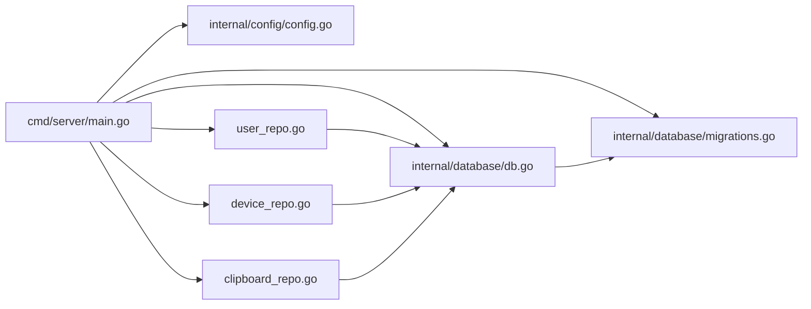
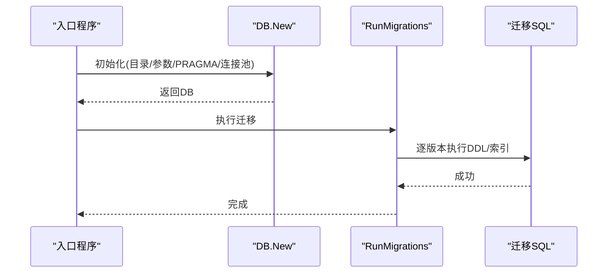

# 服务器数据库

<cite>
**本文引用的文件**
- [clipSync-server/cmd/server/main.go](file://clipSync-server/cmd/server/main.go)
- [clipSync-server/internal/database/db.go](file://clipSync-server/internal/database/db.go)
- [clipSync-server/internal/database/migrations.go](file://clipSync-server/internal/database/migrations.go)
- [clipSync-server/migrations/001_initial.sql](file://clipSync-server/migrations/001_initial.sql)
- [clipSync-server/internal/database/models.go](file://clipSync-server/internal/database/models.go)
- [clipSync-server/internal/database/user_repo.go](file://clipSync-server/internal/database/user_repo.go)
- [clipSync-server/internal/database/device_repo.go](file://clipSync-server/internal/database/device_repo.go)
- [clipSync-server/internal/database/clipboard_repo.go](file://clipSync-server/internal/database/clipboard_repo.go)
- [clipSync-server/internal/config/config.go](file://clipSync-server/internal/config/config.go)
- [clipSync-server/configs/config.yaml](file://clipSync-server/configs/config.yaml)
</cite>

## 目录
1. [简介](#简介)
2. [项目结构](#项目结构)
3. [核心组件](#核心组件)
4. [架构总览](#架构总览)
5. [详细组件分析](#详细组件分析)
6. [依赖关系分析](#依赖关系分析)
7. [性能考量](#性能考量)
8. [故障排查指南](#故障排查指南)
9. [结论](#结论)
10. [附录](#附录)

## 简介
本文件面向ClipSync服务器端SQLite数据库，系统性阐述数据库初始化、连接与事务管理、迁移与版本升级、用户与设备注册、剪贴板历史与文件存储的数据操作流程，并给出SQL查询优化、索引策略、并发控制与锁机制、备份与恢复方案、性能监控与瓶颈分析以及数据一致性与ACID特性保障。

## 项目结构
服务器端数据库相关代码集中在内部包“internal/database”，配合配置模块“internal/config”与入口程序“cmd/server/main.go”。关键文件职责如下：
- 初始化与连接：db.go
- 迁移与版本控制：migrations.go、migrations/001_initial.sql
- 数据模型：models.go
- 仓储层（用户、设备、剪贴板）：user_repo.go、device_repo.go、clipboard_repo.go
- 配置加载与默认值：config.go、configs/config.yaml
- 启动流程与仓库装配：cmd/server/main.go

**图示来源**
- [clipSync-server/cmd/server/main.go:43-54](file://clipSync-server/cmd/server/main.go#L43-L54)
- [clipSync-server/internal/database/db.go:17-56](file://clipSync-server/internal/database/db.go#L17-L56)
- [clipSync-server/internal/database/migrations.go:8-114](file://clipSync-server/internal/database/migrations.go#L8-L114)
- [clipSync-server/migrations/001_initial.sql:1-55](file://clipSync-server/migrations/001_initial.sql#L1-L55)
- [clipSync-server/internal/database/models.go:1-46](file://clipSync-server/internal/database/models.go#L1-L46)

**章节来源**
- [clipSync-server/cmd/server/main.go:43-54](file://clipSync-server/cmd/server/main.go#L43-L54)
- [clipSync-server/internal/database/db.go:17-56](file://clipSync-server/internal/database/db.go#L17-L56)
- [clipSync-server/internal/database/migrations.go:8-114](file://clipSync-server/internal/database/migrations.go#L8-L114)
- [clipSync-server/migrations/001_initial.sql:1-55](file://clipSync-server/migrations/001_initial.sql#L1-L55)
- [clipSync-server/internal/database/models.go:1-46](file://clipSync-server/internal/database/models.go#L1-L46)

## 核心组件
- 数据库连接封装：DB结构体包装标准库连接，提供New与Close方法；在初始化时启用WAL、设置同步级别、缓存大小与临时存储于内存，并配置连接池。
- 迁移管理：RunMigrations负责创建迁移跟踪表、按序执行未应用的迁移，并以事务包裹每条迁移SQL，确保原子性。
- 仓储层：
  - 用户仓储：创建用户、按用户名查询、校验密码、检查用户名是否存在。
  - 设备仓储：注册设备、按ID/用户查询、更新最近活跃时间、删除设备、校验归属。
  - 剪贴板仓储：新增历史项、分页/增量拉取历史、查询最新项、去重校验。
- 模型定义：User、Device、ClipboardEntry、UploadedFile等实体字段与业务含义。
- 配置：默认端口、数据库路径、JWT密钥与过期、文件存储目录、最大文件大小、剪贴板历史限制、心跳超时等。

**章节来源**
- [clipSync-server/internal/database/db.go:12-62](file://clipSync-server/internal/database/db.go#L12-L62)
- [clipSync-server/internal/database/migrations.go:8-114](file://clipSync-server/internal/database/migrations.go#L8-L114)
- [clipSync-server/internal/database/user_repo.go:11-91](file://clipSync-server/internal/database/user_repo.go#L11-L91)
- [clipSync-server/internal/database/device_repo.go:11-126](file://clipSync-server/internal/database/device_repo.go#L11-L126)
- [clipSync-server/internal/database/clipboard_repo.go:9-140](file://clipSync-server/internal/database/clipboard_repo.go#L9-L140)
- [clipSync-server/internal/database/models.go:3-46](file://clipSync-server/internal/database/models.go#L3-L46)
- [clipSync-server/internal/config/config.go:10-72](file://clipSync-server/internal/config/config.go#L10-L72)
- [clipSync-server/configs/config.yaml:1-29](file://clipSync-server/configs/config.yaml#L1-L29)

## 架构总览
下图展示从启动到数据库初始化、迁移、仓储装配与服务运行的整体流程。

**图示来源**
- [clipSync-server/cmd/server/main.go:31-69](file://clipSync-server/cmd/server/main.go#L31-L69)
- [clipSync-server/internal/database/db.go:17-56](file://clipSync-server/internal/database/db.go#L17-L56)
- [clipSync-server/internal/database/migrations.go:8-114](file://clipSync-server/internal/database/migrations.go#L8-L114)

## 详细组件分析

### 数据库初始化与连接管理
- 目录与路径：初始化前确保数据库目录存在，避免首次启动失败。
- 连接参数：通过SQLite驱动参数启用WAL、设置忙等待超时、外键约束。
- 连接池：最大打开连接数、空闲连接数适配2核2G服务器场景。
- PRAGMA优化：
  - WAL模式提升并发读写能力。
  - synchronous设为NORMAL在可靠性与性能间折中。
  - cache_size设置为-2000（KB），增大缓存。
  - temp_store=MEMORY，减少磁盘临时文件。
- Ping验证：启动阶段进行连通性检测。

**图示来源**
- [clipSync-server/internal/database/db.go:17-56](file://clipSync-server/internal/database/db.go#L17-L56)

**章节来源**
- [clipSync-server/internal/database/db.go:17-56](file://clipSync-server/internal/database/db.go#L17-L56)

### 迁移策略与版本升级机制
- 迁移跟踪：使用schema_migrations表记录已应用版本，避免重复执行。
- 版本顺序：当前仅定义版本1，按序执行。
- 事务化：每条迁移在独立事务中执行，失败回滚，成功记录版本。
- 初始模式：迁移脚本创建users、devices、clipboard_history、uploaded_files表及必要索引。

**图示来源**
- [clipSync-server/internal/database/migrations.go:8-114](file://clipSync-server/internal/database/migrations.go#L8-L114)
- [clipSync-server/migrations/001_initial.sql:1-55](file://clipSync-server/migrations/001_initial.sql#L1-L55)

**章节来源**
- [clipSync-server/internal/database/migrations.go:8-114](file://clipSync-server/internal/database/migrations.go#L8-L114)
- [clipSync-server/migrations/001_initial.sql:1-55](file://clipSync-server/migrations/001_initial.sql#L1-L55)

### 用户管理（用户仓储）
- 密码哈希：使用bcrypt对明文密码生成哈希后入库。
- 查询与校验：按用户名查询用户；校验密码时先取用户再比对哈希。
- 存在性检查：用于注册前的用户名冲突检测。

**图示来源**
- [clipSync-server/internal/database/user_repo.go:11-91](file://clipSync-server/internal/database/user_repo.go#L11-L91)
- [clipSync-server/internal/database/models.go:3-9](file://clipSync-server/internal/database/models.go#L3-L9)

**章节来源**
- [clipSync-server/internal/database/user_repo.go:21-80](file://clipSync-server/internal/database/user_repo.go#L21-L80)
- [clipSync-server/internal/database/models.go:3-9](file://clipSync-server/internal/database/models.go#L3-L9)

### 设备注册与管理（设备仓储）
- 设备ID生成：随机字节转十六进制，前缀“dev-”。
- 注册与查询：插入设备信息；按ID查询；按用户查询并按最近活跃降序。
- 归属校验：防止越权访问其他用户设备。
- 删除与活跃更新：支持删除与last_seen更新。

**图示来源**
- [clipSync-server/internal/database/device_repo.go:11-126](file://clipSync-server/internal/database/device_repo.go#L11-L126)
- [clipSync-server/internal/database/models.go:11-19](file://clipSync-server/internal/database/models.go#L11-L19)

**章节来源**
- [clipSync-server/internal/database/device_repo.go:21-106](file://clipSync-server/internal/database/device_repo.go#L21-L106)
- [clipSync-server/internal/database/models.go:11-19](file://clipSync-server/internal/database/models.go#L11-L19)

### 剪贴板数据与历史（剪贴板仓储）
- 新增历史：插入clipboard_history，同时维护历史上限，超出部分按时间倒序删除多余项。
- 分页/增量拉取：支持limit与after_id参数，计算hasMore标记。
- 最新项查询：按时间倒序取第一条。
- 去重校验：基于checksum与用户维度检查重复。

**图示来源**
- [clipSync-server/internal/database/clipboard_repo.go:20-110](file://clipSync-server/internal/database/clipboard_repo.go#L20-L110)

**章节来源**
- [clipSync-server/internal/database/clipboard_repo.go:20-140](file://clipSync-server/internal/database/clipboard_repo.go#L20-L140)

### 文件存储（上传下载）
- 文件上传：HTTP处理器接收文件，写入文件存储目录，记录uploaded_files元数据（含校验和、路径、大小、类型）。
- 文件下载：根据file_id定位文件路径并返回。
- 与数据库交互：仅写入/读取元数据，不存储文件内容本身。

说明：文件存储逻辑由HTTP上传处理器实现，数据库侧对应uploaded_files表与索引。

**章节来源**
- [clipSync-server/internal/database/models.go:35-45](file://clipSync-server/internal/database/models.go#L35-L45)

### 数据模型与索引策略
- 实体模型：users、devices、clipboard_history、uploaded_files。
- 索引策略：
  - devices(user_id)
  - clipboard_history(user_id)
  - clipboard_history(user_id, checksum)
  - clipboard_history(user_id, created_at DESC)
  - uploaded_files(user_id)

这些索引分别服务于：
- 设备列表按用户查询
- 剪贴板历史按用户查询与去重
- 剪贴板历史按时间倒序分页
- 文件按用户查询

**章节来源**
- [clipSync-server/internal/database/models.go:3-45](file://clipSync-server/internal/database/models.go#L3-L45)
- [clipSync-server/migrations/001_initial.sql:22-54](file://clipSync-server/migrations/001_initial.sql#L22-L54)
- [clipSync-server/internal/database/migrations.go:45-77](file://clipSync-server/internal/database/migrations.go#L45-L77)

## 依赖关系分析
- 入口程序依赖配置模块、数据库模块与各服务模块。
- 数据库模块内部依赖：db.go提供连接，migrations.go负责迁移，各repo封装具体CRUD。
- 配置模块提供默认值与生产安全警告。

**图示来源**
- [clipSync-server/cmd/server/main.go:31-69](file://clipSync-server/cmd/server/main.go#L31-L69)
- [clipSync-server/internal/database/db.go:17-56](file://clipSync-server/internal/database/db.go#L17-L56)
- [clipSync-server/internal/database/migrations.go:8-114](file://clipSync-server/internal/database/migrations.go#L8-L114)
- [clipSync-server/internal/database/user_repo.go:16-18](file://clipSync-server/internal/database/user_repo.go#L16-L18)
- [clipSync-server/internal/database/device_repo.go:16-18](file://clipSync-server/internal/database/device_repo.go#L16-L18)
- [clipSync-server/internal/database/clipboard_repo.go:16-17](file://clipSync-server/internal/database/clipboard_repo.go#L16-L17)

**章节来源**
- [clipSync-server/cmd/server/main.go:31-69](file://clipSync-server/cmd/server/main.go#L31-L69)

## 性能考量
- 并发与锁：
  - WAL模式提升并发读取能力，降低写入阻塞概率。
  - busy_timeout设置为5000ms，缓解锁竞争导致的短暂等待。
  - 连接池：最大4个打开连接、2个空闲，适合低并发场景。
- PRAGMA调优：
  - synchronous=NORMAL在可靠性与吞吐之间平衡。
  - cache_size=-2000增大缓存，减少磁盘IO。
  - temp_store=MEMORY减少临时文件写盘。
- 查询优化：
  - 使用覆盖索引与合适的选择性列（如user_id、checksum、created_at）。
  - 分页查询结合after_id可避免深度偏移。
- 历史裁剪：
  - 剪贴板历史按上限自动清理，避免无限增长导致查询变慢。
- I/O与存储：
  - 文件存储与数据库分离，上传仅写入元数据，降低数据库压力。

**章节来源**
- [clipSync-server/internal/database/db.go:24-49](file://clipSync-server/internal/database/db.go#L24-L49)
- [clipSync-server/internal/database/clipboard_repo.go:39-50](file://clipSync-server/internal/database/clipboard_repo.go#L39-L50)
- [clipSync-server/migrations/001_initial.sql:38-40](file://clipSync-server/migrations/001_initial.sql#L38-L40)

## 故障排查指南
- 迁移失败：
  - 现象：执行迁移时报错或中断。
  - 排查：确认schema_migrations表存在、事务开启与提交成功、SQL语法正确。
  - 处理：修复迁移SQL后重新启动，确保未应用版本被正确记录。
- 连接失败：
  - 现象：数据库无法打开或Ping失败。
  - 排查：检查db_path目录权限、SQLite驱动可用性、参数拼写。
  - 处理：修正路径与权限，确保WAL与外键参数有效。
- 并发冲突：
  - 现象：写入频繁时出现锁等待或超时。
  - 排查：检查busy_timeout与连接池配置。
  - 处理：适当提高busy_timeout或增加连接数（受资源限制）。
- 历史异常增长：
  - 现象：剪贴板查询变慢。
  - 排查：确认历史上限配置与裁剪逻辑正常。
  - 处理：调整clipboard_history_limit或清理旧数据。

**章节来源**
- [clipSync-server/internal/database/migrations.go:91-110](file://clipSync-server/internal/database/migrations.go#L91-L110)
- [clipSync-server/internal/database/db.go:51-53](file://clipSync-server/internal/database/db.go#L51-L53)
- [clipSync-server/internal/database/clipboard_repo.go:39-50](file://clipSync-server/internal/database/clipboard_repo.go#L39-L50)

## 结论
本数据库设计围绕SQLite在单机部署场景下的易用性与可靠性展开：通过WAL与PRAGMA优化提升并发与性能；以迁移跟踪确保Schema演进可控；以仓储层封装CRUD并提供业务语义；以索引与历史裁剪保障查询效率。整体方案简洁可靠，适合ClipSync的轻量级服务需求。

## 附录

### 数据库初始化与迁移时序

**图示来源**
- [clipSync-server/cmd/server/main.go:43-54](file://clipSync-server/cmd/server/main.go#L43-L54)
- [clipSync-server/internal/database/db.go:17-56](file://clipSync-server/internal/database/db.go#L17-L56)
- [clipSync-server/internal/database/migrations.go:82-110](file://clipSync-server/internal/database/migrations.go#L82-L110)

### 配置要点与默认值
- 关键配置项：ws_port、http_port、db_path、jwt_secret、jwt_expiry_hours、file_storage_path、max_file_size_mb、clipboard_history_limit、heartbeat_timeout_seconds。
- 默认值参考：配置模块DefaultConfig与YAML文件。

**章节来源**
- [clipSync-server/internal/config/config.go:23-36](file://clipSync-server/internal/config/config.go#L23-L36)
- [clipSync-server/configs/config.yaml:1-29](file://clipSync-server/configs/config.yaml#L1-L29)