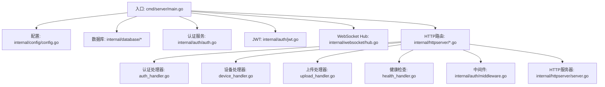
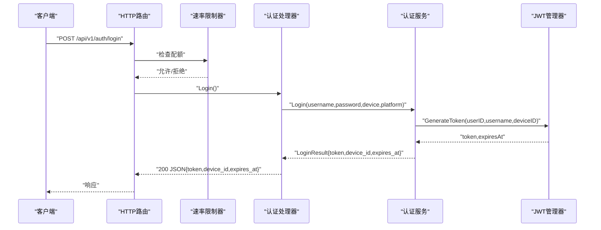
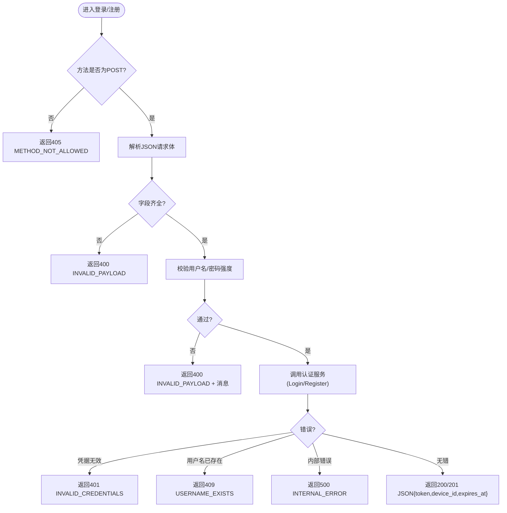
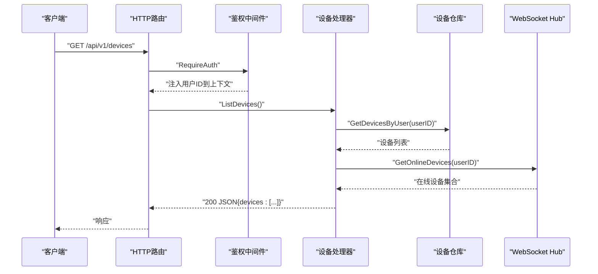
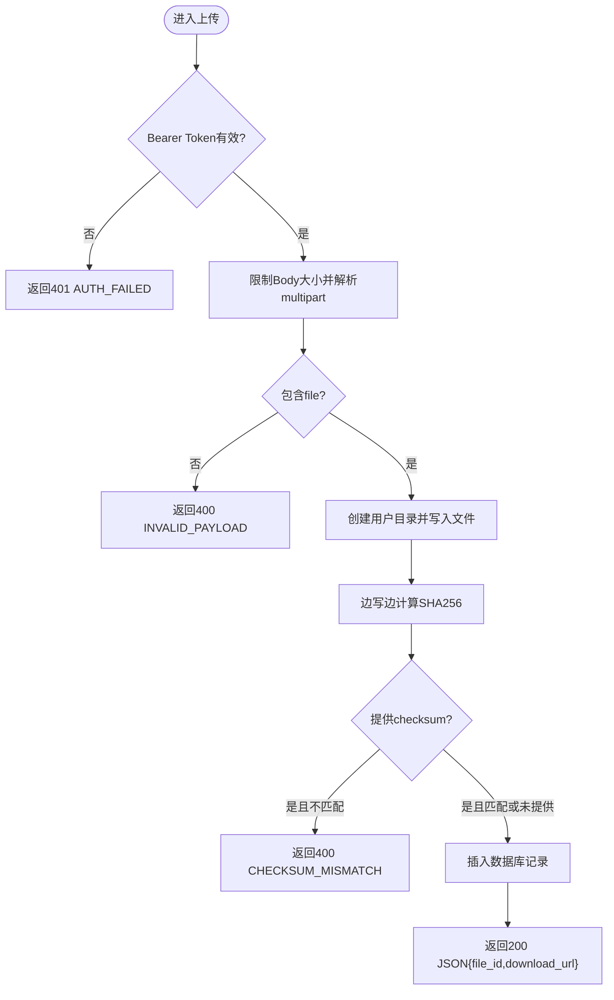
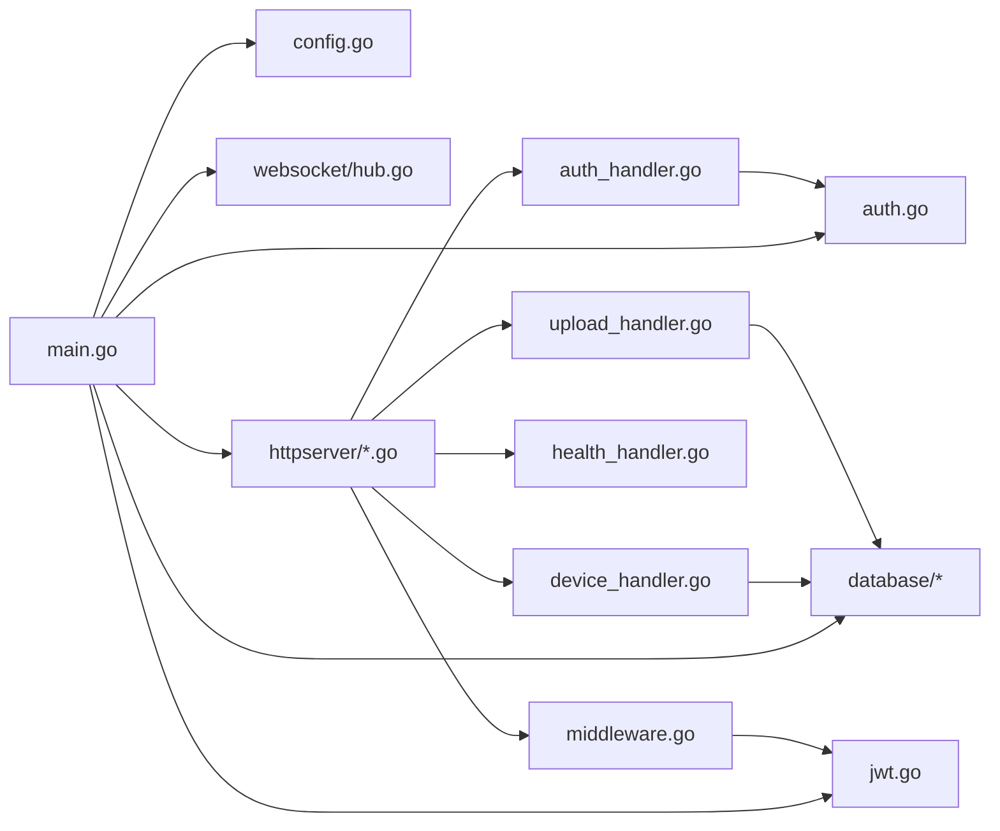

# HTTP API开发

<cite>
**本文引用的文件**
- [main.go](file://clipSync-server/cmd/server/main.go)
- [server.go](file://clipSync-server/internal/httpserver/server.go)
- [middleware.go](file://clipSync-server/internal/auth/middleware.go)
- [auth_handler.go](file://clipSync-server/internal/httpserver/auth_handler.go)
- [device_handler.go](file://clipSync-server/internal/httpserver/device_handler.go)
- [upload_handler.go](file://clipSync-server/internal/httpserver/upload_handler.go)
- [health_handler.go](file://clipSync-server/internal/httpserver/health_handler.go)
- [auth.go](file://clipSync-server/internal/auth/auth.go)
- [jwt.go](file://clipSync-server/internal/auth/jwt.go)
- [config.go](file://clipSync-server/internal/config/config.go)
- [http-api.schema.json](file://protocol/http-api.schema.json)
- [DEVELOPMENT_PLAN.md](file://DEVELOPMENT_PLAN.md)
</cite>

## 目录
1. [简介](#简介)
2. [项目结构](#项目结构)
3. [核心组件](#核心组件)
4. [架构总览](#架构总览)
5. [详细组件分析](#详细组件分析)
6. [依赖关系分析](#依赖关系分析)
7. [性能考虑](#性能考虑)
8. [故障排查指南](#故障排查指南)
9. [结论](#结论)
10. [附录](#附录)

## 简介
本文件面向HTTP API开发，系统性梳理服务端路由设计、处理器实现与中间件机制，覆盖认证API、设备管理API、文件上传下载API与健康检查API。文档结合实际代码路径，给出请求处理流程、响应格式、错误处理与状态码管理，并记录API版本控制、参数校验、数据序列化与安全防护措施；同时解释中间件使用模式、认证流程与权限控制机制，并提供性能优化、限流策略与监控指标建议。

## 项目结构
后端采用Go语言实现，入口在命令行程序中完成配置加载、数据库初始化、迁移执行、仓库层注入、WebSocket Hub启动、HTTP路由注册与中间件装配，随后分别启动HTTP与WebSocket两个独立服务。

图表来源
- [main.go:21-146](file://clipSync-server/cmd/server/main.go#L21-L146)
- [config.go:1-72](file://clipSync-server/internal/config/config.go#L1-L72)
- [auth.go:1-137](file://clipSync-server/internal/auth/auth.go#L1-L137)
- [jwt.go:1-76](file://clipSync-server/internal/auth/jwt.go#L1-L76)
- [auth_handler.go:1-215](file://clipSync-server/internal/httpserver/auth_handler.go#L1-L215)
- [device_handler.go:1-137](file://clipSync-server/internal/httpserver/device_handler.go#L1-L137)
- [upload_handler.go:1-221](file://clipSync-server/internal/httpserver/upload_handler.go#L1-L221)
- [health_handler.go:1-55](file://clipSync-server/internal/httpserver/health_handler.go#L1-L55)
- [middleware.go:1-111](file://clipSync-server/internal/auth/middleware.go#L1-L111)
- [server.go:1-50](file://clipSync-server/internal/httpserver/server.go#L1-L50)

章节来源
- [main.go:21-146](file://clipSync-server/cmd/server/main.go#L21-L146)
- [DEVELOPMENT_PLAN.md:364-422](file://DEVELOPMENT_PLAN.md#L364-L422)

## 核心组件
- 配置模块：负责从YAML加载配置、提供默认值与生产安全校验（如JWT密钥提示）。
- 认证模块：封装用户/设备业务逻辑与JWT生成/校验。
- 中间件：统一鉴权拦截，提取上下文中的用户/设备信息。
- HTTP处理器：按功能拆分，分别处理认证、设备、文件、健康检查。
- HTTP服务器：封装net/http的Server配置与优雅关停。
- WebSocket Hub：与HTTP API协同，提供实时同步能力。

章节来源
- [config.go:1-72](file://clipSync-server/internal/config/config.go#L1-L72)
- [auth.go:1-137](file://clipSync-server/internal/auth/auth.go#L1-L137)
- [jwt.go:1-76](file://clipSync-server/internal/auth/jwt.go#L1-L76)
- [middleware.go:1-111](file://clipSync-server/internal/auth/middleware.go#L1-L111)
- [server.go:1-50](file://clipSync-server/internal/httpserver/server.go#L1-L50)

## 架构总览
HTTP服务通过ServeMux注册路由，对认证相关接口启用速率限制，对需要鉴权的接口通过RequireAuth中间件注入用户/设备上下文。认证成功后返回JWT，客户端在后续请求头携带Authorization: Bearer <token>。

图表来源
- [main.go:74-84](file://clipSync-server/cmd/server/main.go#L74-L84)
- [auth_handler.go:63-109](file://clipSync-server/internal/httpserver/auth_handler.go#L63-L109)
- [auth.go:67-116](file://clipSync-server/internal/auth/auth.go#L67-L116)
- [jwt.go:32-55](file://clipSync-server/internal/auth/jwt.go#L32-L55)

## 详细组件分析

### 路由与中间件机制
- 路由注册：在入口中构建ServeMux，为各API挂载处理函数。
- 速率限制：对认证端点设置每分钟若干次的限流，防止暴力破解与滥用。
- 鉴权中间件：RequireAuth从Authorization头解析Bearer Token，校验后将用户ID、用户名、设备ID写入请求上下文，供后续处理器读取。

章节来源
- [main.go:74-84](file://clipSync-server/cmd/server/main.go#L74-L84)
- [main.go:77-78](file://clipSync-server/cmd/server/main.go#L77-L78)
- [middleware.go:32-61](file://clipSync-server/internal/auth/middleware.go#L32-L61)

### 认证API
- 登录/注册/刷新均要求POST方法，请求体为JSON，包含用户名、密码、设备名、平台等字段。
- 参数校验：长度、字符集等基础规则；注册时对用户名唯一性进行检查。
- 错误处理：针对无效凭据、用户名已存在、内部错误返回不同状态码与错误码。
- 响应格式：统一JSON，包含success字段与业务数据；登录/注册返回token、device_id、expires_at；刷新返回新token与过期时间戳。

图表来源
- [auth_handler.go:63-175](file://clipSync-server/internal/httpserver/auth_handler.go#L63-L175)
- [auth.go:32-65](file://clipSync-server/internal/auth/auth.go#L32-L65)
- [auth.go:67-116](file://clipSync-server/internal/auth/auth.go#L67-L116)

章节来源
- [auth_handler.go:1-215](file://clipSync-server/internal/httpserver/auth_handler.go#L1-L215)
- [auth.go:1-137](file://clipSync-server/internal/auth/auth.go#L1-L137)
- [jwt.go:1-76](file://clipSync-server/internal/auth/jwt.go#L1-L76)

### 设备管理API
- 列表查询：GET /api/v1/devices，需携带有效Bearer Token；返回设备列表，包含在线状态标记。
- 删除设备：DELETE /api/v1/devices/{device_id}，删除后若该设备在线则断开连接。
- 权限控制：通过中间件从上下文读取用户ID，确保仅能操作当前用户下的设备。

图表来源
- [main.go:90-93](file://clipSync-server/cmd/server/main.go#L90-L93)
- [device_handler.go:25-82](file://clipSync-server/internal/httpserver/device_handler.go#L25-L82)
- [middleware.go:32-61](file://clipSync-server/internal/auth/middleware.go#L32-L61)

章节来源
- [device_handler.go:1-137](file://clipSync-server/internal/httpserver/device_handler.go#L1-L137)

### 文件上传下载API
- 上传：POST /api/v1/upload，multipart/form-data，支持可选checksum校验；服务端计算SHA256并与客户端一致则接受，否则拒绝；保存到用户专属目录并记录元数据。
- 下载：GET /api/v1/download/{file_id}，校验路径片段安全性，确认文件属于当前用户后返回文件内容。
- 安全与性能：限制请求体大小、防路径穿越、并发写入与哈希计算并行、失败回滚清理临时文件。

图表来源
- [main.go:95-98](file://clipSync-server/cmd/server/main.go#L95-L98)
- [upload_handler.go:36-150](file://clipSync-server/internal/httpserver/upload_handler.go#L36-L150)

章节来源
- [upload_handler.go:1-221](file://clipSync-server/internal/httpserver/upload_handler.go#L1-L221)

### 健康检查API
- GET /api/v1/health：返回服务状态、版本、运行时长、连接的WebSocket客户端数量以及数据库连通性状态。

章节来源
- [health_handler.go:1-55](file://clipSync-server/internal/httpserver/health_handler.go#L1-L55)
- [main.go:86-88](file://clipSync-server/cmd/server/main.go#L86-L88)

### 数据模型与序列化
- 统一响应结构：所有处理器以JSON输出，包含success字段与业务数据；错误时返回success:false与error码。
- 请求体结构：遵循协议规范的JSON Schema，字段类型、长度、枚举值均有约束。
- 序列化工具：使用标准库encoding/json进行编解码。

章节来源
- [auth_handler.go:210-215](file://clipSync-server/internal/httpserver/auth_handler.go#L210-L215)
- [http-api.schema.json:1-293](file://protocol/http-api.schema.json#L1-L293)

### API版本控制
- 版本前缀：所有HTTP端点均采用/api/v1前缀，便于未来演进与向后兼容。
- 升级策略：新增端点时沿用相同前缀，变更现有端点时提供新版本端点并标注弃用策略。

章节来源
- [main.go:80-89](file://clipSync-server/cmd/server/main.go#L80-L89)
- [DEVELOPMENT_PLAN.md:182-329](file://DEVELOPMENT_PLAN.md#L182-L329)

### 参数验证与错误码
- 输入校验：用户名长度、密码强度、必填字段、平台枚举值等。
- 错误码映射：HTTP状态码与业务错误码一一对应，便于客户端统一处理。
- 典型错误：INVALID_PAYLOAD、INVALID_CREDENTIALS、USERNAME_EXISTS、CONTENT_TOO_LARGE、DEVICE_NOT_FOUND、FILE_NOT_FOUND、ACCESS_DENIED、INTERNAL_ERROR等。

章节来源
- [auth_handler.go:29-61](file://clipSync-server/internal/httpserver/auth_handler.go#L29-L61)
- [auth_handler.go:87-101](file://clipSync-server/internal/httpserver/auth_handler.go#L87-L101)
- [auth_handler.go:135-151](file://clipSync-server/internal/httpserver/auth_handler.go#L135-L151)
- [upload_handler.go:55-61](file://clipSync-server/internal/httpserver/upload_handler.go#L55-L61)
- [upload_handler.go:115-123](file://clipSync-server/internal/httpserver/upload_handler.go#L115-L123)
- [http-api.schema.json:280-292](file://protocol/http-api.schema.json#L280-L292)

### 安全防护措施
- 认证与授权：基于Bearer Token的JWT认证，中间件统一拦截校验。
- 速率限制：对认证端点实施IP维度的限流，缓解暴力破解与DDoS。
- 路径与输入安全：下载接口严格校验file_id，防止路径穿越；上传接口限制最大尺寸并进行checksum校验。
- 配置安全：默认配置包含敏感提示，生产环境必须修改密钥与有效期。

章节来源
- [middleware.go:32-61](file://clipSync-server/internal/auth/middleware.go#L32-L61)
- [main.go:77-78](file://clipSync-server/cmd/server/main.go#L77-L78)
- [upload_handler.go:175-182](file://clipSync-server/internal/httpserver/upload_handler.go#L175-L182)
- [config.go:57-71](file://clipSync-server/internal/config/config.go#L57-L71)

## 依赖关系分析
- 入口依赖配置、数据库、认证服务、WebSocket Hub与HTTP处理器。
- 处理器依赖仓库层与中间件；认证处理器依赖认证服务；上传处理器依赖数据库与文件系统。
- 中间件依赖JWT管理器；JWT管理器依赖第三方JWT库。

图表来源
- [main.go:21-146](file://clipSync-server/cmd/server/main.go#L21-L146)
- [auth_handler.go:1-215](file://clipSync-server/internal/httpserver/auth_handler.go#L1-L215)
- [device_handler.go:1-137](file://clipSync-server/internal/httpserver/device_handler.go#L1-L137)
- [upload_handler.go:1-221](file://clipSync-server/internal/httpserver/upload_handler.go#L1-L221)
- [health_handler.go:1-55](file://clipSync-server/internal/httpserver/health_handler.go#L1-L55)
- [middleware.go:1-111](file://clipSync-server/internal/auth/middleware.go#L1-L111)
- [auth.go:1-137](file://clipSync-server/internal/auth/auth.go#L1-L137)
- [jwt.go:1-76](file://clipSync-server/internal/auth/jwt.go#L1-L76)

章节来源
- [main.go:21-146](file://clipSync-server/cmd/server/main.go#L21-L146)

## 性能考虑
- 服务器超时：HTTP服务器设置合理的Read/Write/Idle超时，避免资源泄漏。
- 速率限制：对认证端点实施限流，保护后端免受高频请求冲击。
- 上传优化：边写边哈希、限制请求体大小、失败回滚清理，降低IO与存储压力。
- 并发与连接：WebSocket与HTTP分离端口，互不影响；HTTP端口可利用多核优化（结合部署环境）。
- 监控指标：健康检查端点暴露连接数、数据库状态、运行时长，便于运维观测。

章节来源
- [server.go:27-41](file://clipSync-server/internal/httpserver/server.go#L27-L41)
- [main.go:77-78](file://clipSync-server/cmd/server/main.go#L77-L78)
- [upload_handler.go:88-111](file://clipSync-server/internal/httpserver/upload_handler.go#L88-L111)
- [health_handler.go:28-54](file://clipSync-server/internal/httpserver/health_handler.go#L28-L54)

## 故障排查指南
- 认证失败：检查Authorization头格式与Bearer前缀；确认JWT未过期；核对用户名/密码。
- 上传失败：确认文件大小未超过限制；检查checksum是否匹配；查看数据库写入是否成功。
- 设备不存在：确认设备ID正确且属于当前用户；检查删除后是否触发断连。
- 下载失败：确认file_id合法且未包含路径遍历字符；确认文件确实属于当前用户。
- 健康检查异常：关注数据库Ping结果与连接数变化。

章节来源
- [auth_handler.go:87-101](file://clipSync-server/internal/httpserver/auth_handler.go#L87-L101)
- [upload_handler.go:115-123](file://clipSync-server/internal/httpserver/upload_handler.go#L115-L123)
- [device_handler.go:115-128](file://clipSync-server/internal/httpserver/device_handler.go#L115-L128)
- [upload_handler.go:175-182](file://clipSync-server/internal/httpserver/upload_handler.go#L175-L182)
- [health_handler.go:37-45](file://clipSync-server/internal/httpserver/health_handler.go#L37-L45)

## 结论
本HTTP API以清晰的路由分层、严格的参数校验与统一的错误码体系为基础，结合JWT认证与速率限制，提供了认证、设备管理、文件传输与健康检查等核心能力。配合WebSocket Hub，形成完整的跨平台剪贴板同步方案。建议在生产环境中强化密钥管理、引入更细粒度的限流与熔断策略，并持续完善监控与日志体系。

## 附录
- 协议契约参考：详见协议规范文件，包含端点定义、请求/响应结构与错误码映射。
- 开发计划参考：包含端到端集成里程碑与并行开发策略，便于团队协作与质量保障。

章节来源
- [http-api.schema.json:1-293](file://protocol/http-api.schema.json#L1-L293)
- [DEVELOPMENT_PLAN.md:716-797](file://DEVELOPMENT_PLAN.md#L716-L797)