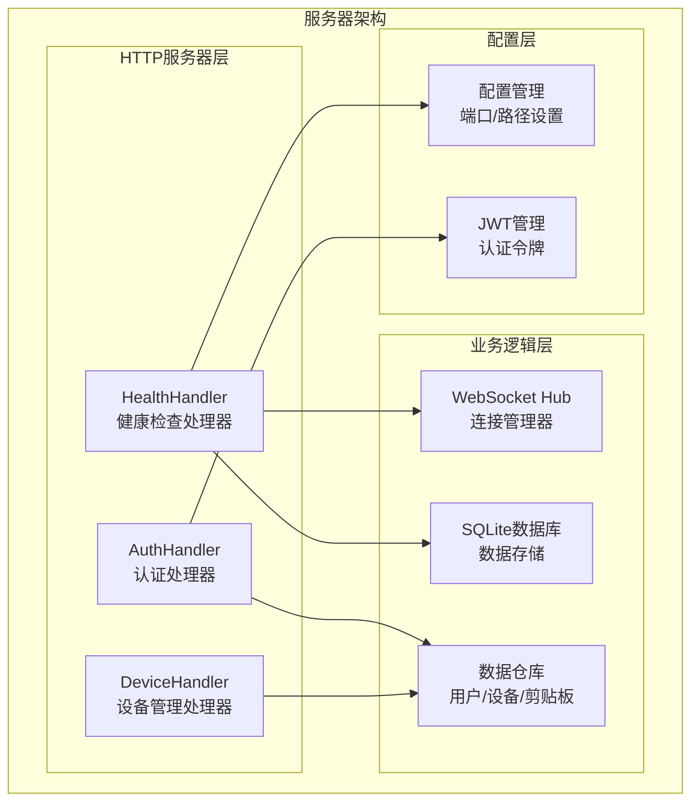
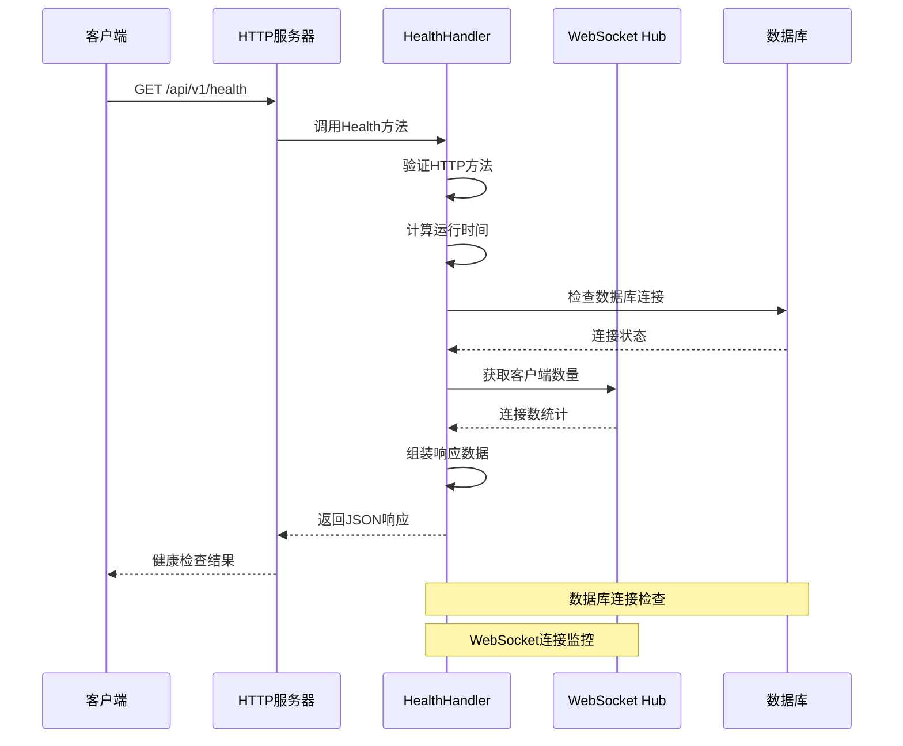
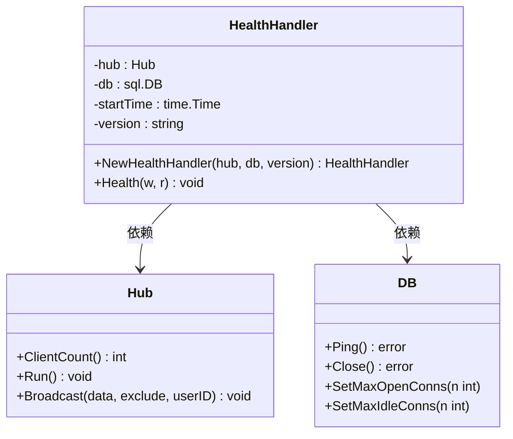
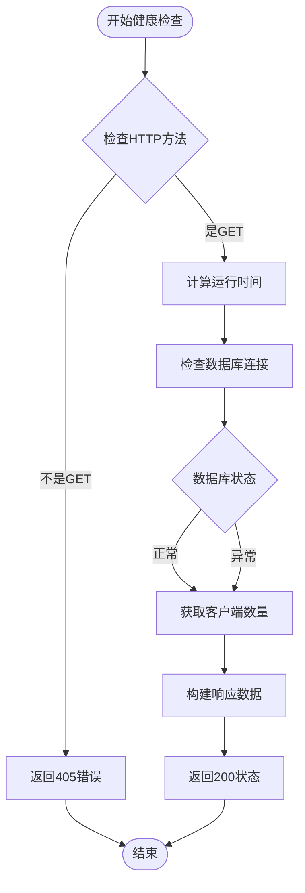
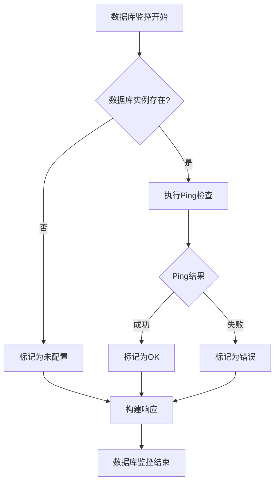
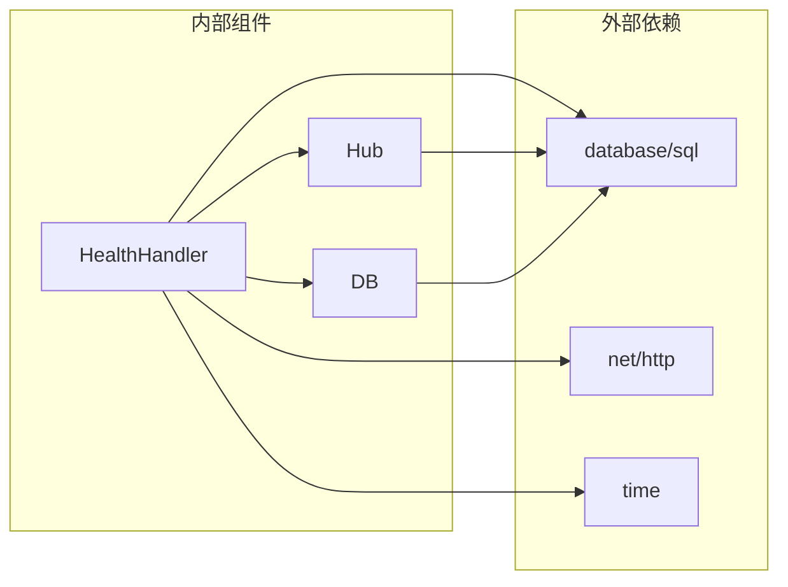

# 健康检查API

<cite>
**本文档引用的文件**
- [health_handler.go](file://clipSync-server/internal/httpserver/health_handler.go)
- [main.go](file://clipSync-server/cmd/server/main.go)
- [db.go](file://clipSync-server/internal/database/db.go)
- [hub.go](file://clipSync-server/internal/websocket/hub.go)
- [config.go](file://clipSync-server/internal/config/config.go)
- [config.yaml](file://clipSync-server/configs/config.yaml)
- [server.go](file://clipSync-server/internal/httpserver/server.go)
- [client.go](file://clipSync-server/internal/websocket/client.go)
- [http-api.schema.json](file://protocol/http-api.schema.json)
</cite>

## 目录
1. [简介](#简介)
2. [项目结构](#项目结构)
3. [核心组件](#核心组件)
4. [架构概览](#架构概览)
5. [详细组件分析](#详细组件分析)
6. [依赖关系分析](#依赖关系分析)
7. [性能考虑](#性能考虑)
8. [故障排查指南](#故障排查指南)
9. [结论](#结论)

## 简介

健康检查API是ClipSync服务器的重要监控组件，用于实时监控服务器状态、性能指标和系统健康状况。该API提供了一个简洁的HTTP接口，能够快速评估服务器的运行状态，包括数据库连接状态、WebSocket连接池监控和服务器运行时信息。

本API特别设计用于容器编排系统（如Kubernetes）的存活探针和就绪探针，确保服务在启动完成且功能正常后才对外提供服务。通过统一的健康检查接口，运维团队可以轻松监控ClipSync服务器的运行状态，及时发现和解决潜在问题。

## 项目结构

ClipSync服务器采用模块化架构设计，健康检查功能位于HTTP服务器层，与业务逻辑分离，确保监控功能的独立性和可靠性。

**图表来源**
- [health_handler.go:10-26](file://clipSync-server/internal/httpserver/health_handler.go#L10-L26)
- [main.go:67-69](file://clipSync-server/cmd/server/main.go#L67-L69)
- [config.go:10-21](file://clipSync-server/internal/config/config.go#L10-L21)

**章节来源**
- [main.go:74-88](file://clipSync-server/cmd/server/main.go#L74-L88)
- [health_handler.go:1-55](file://clipSync-server/internal/httpserver/health_handler.go#L1-L55)

## 核心组件

健康检查API由多个核心组件协同工作，每个组件负责特定的监控职责：

### HealthHandler 结构体
HealthHandler是健康检查的主要处理器，负责协调各个监控组件并生成统一的健康报告。

### 监控指标类型
- **服务器状态指标**：版本信息、运行时间、HTTP服务器状态
- **数据库连接指标**：连接可用性、连接池状态
- **WebSocket连接指标**：当前连接数、在线设备数
- **系统资源指标**：内存使用、CPU负载

### 响应格式规范
健康检查API返回标准化的JSON响应，包含以下关键字段：
- `status`: 健康状态标识（"ok"表示正常）
- `version`: 服务器版本号
- `uptime`: 服务器运行时间（秒）
- `connected_clients`: 当前WebSocket连接数
- `database`: 数据库连接状态描述

**章节来源**
- [health_handler.go:10-53](file://clipSync-server/internal/httpserver/health_handler.go#L10-L53)
- [http-api.schema.json:125-142](file://protocol/http-api.schema.json#L125-L142)

## 架构概览

健康检查API采用分层架构设计，确保监控功能的独立性和可靠性。

**图表来源**
- [health_handler.go:28-53](file://clipSync-server/internal/httpserver/health_handler.go#L28-L53)
- [main.go:86-88](file://clipSync-server/cmd/server/main.go#L86-L88)

### 系统集成点
- **HTTP路由集成**：注册到"/api/v1/health"路径
- **WebSocket集成**：监控连接池状态
- **数据库集成**：验证连接可用性
- **配置集成**：读取服务器版本信息

**章节来源**
- [main.go:86-88](file://clipSync-server/cmd/server/main.go#L86-L88)
- [server.go:26-41](file://clipSync-server/internal/httpserver/server.go#L26-L41)

## 详细组件分析

### HealthHandler 类设计

**图表来源**
- [health_handler.go:11-26](file://clipSync-server/internal/httpserver/health_handler.go#L11-L26)
- [hub.go:137-141](file://clipSync-server/internal/websocket/hub.go#L137-L141)
- [db.go:13-15](file://clipSync-server/internal/database/db.go#L13-L15)

### 健康检查流程

**图表来源**
- [health_handler.go:29-53](file://clipSync-server/internal/httpserver/health_handler.go#L29-L53)

### 数据库连接监控

系统对数据库连接进行专门的监控，包括连接池状态和连接可用性检查。

**图表来源**
- [health_handler.go:37-45](file://clipSync-server/internal/httpserver/health_handler.go#L37-L45)
- [db.go:51-53](file://clipSync-server/internal/database/db.go#L51-L53)

### WebSocket连接池监控

WebSocket Hub提供实时的连接池监控功能，包括连接数统计和连接状态跟踪。

**章节来源**
- [hub.go:136-153](file://clipSync-server/internal/websocket/hub.go#L136-L153)
- [client.go:13-31](file://clipSync-server/internal/websocket/client.go#L13-L31)

## 依赖关系分析

健康检查API的依赖关系相对简单，主要依赖于WebSocket Hub和数据库连接。

**图表来源**
- [health_handler.go:3-8](file://clipSync-server/internal/httpserver/health_handler.go#L3-L8)
- [hub.go:3-16](file://clipSync-server/internal/websocket/hub.go#L3-L16)
- [db.go:3-10](file://clipSync-server/internal/database/db.go#L3-L10)

### 关键依赖特性
- **轻量级依赖**：仅依赖标准库，减少外部依赖风险
- **无循环依赖**：健康检查不依赖其他业务处理器
- **线程安全**：WebSocket Hub提供并发安全的连接数访问

**章节来源**
- [health_handler.go:1-55](file://clipSync-server/internal/httpserver/health_handler.go#L1-L55)
- [hub.go:136-141](file://clipSync-server/internal/websocket/hub.go#L136-L141)

## 性能考虑

健康检查API设计时充分考虑了性能影响，确保监控操作不会对服务器性能造成显著影响。

### 性能优化策略
- **最小化检查开销**：只执行必要的状态检查
- **避免阻塞操作**：使用非阻塞的连接池检查
- **缓存最近状态**：复用已计算的时间信息
- **快速响应**：确保健康检查在毫秒级别内完成

### 内存使用优化
- **零分配设计**：尽量避免在热路径上分配新对象
- **字符串常量**：使用预定义的字符串常量
- **时间计算**：使用单次计算而非重复计算

### 并发处理
- **读写分离**：使用RWMutex确保高并发下的读取性能
- **原子操作**：对计数器使用原子操作保证一致性
- **通道通信**：利用Go通道实现高效的异步通信

**章节来源**
- [db.go:29-50](file://clipSync-server/internal/database/db.go#L29-L50)
- [hub.go:136-153](file://clipSync-server/internal/websocket/hub.go#L136-L153)

## 故障排查指南

### 常见健康检查问题及解决方案

#### 1. 数据库连接失败
**症状**：`database`字段显示错误信息
**可能原因**：
- 数据库文件损坏
- 权限不足
- 存储空间不足
- SQLite版本不兼容

**解决方案**：
- 检查数据库文件权限和磁盘空间
- 验证数据库文件完整性
- 查看服务器日志获取详细错误信息

#### 2. WebSocket连接异常
**症状**：`connected_clients`显示异常值
**可能原因**：
- 连接泄漏
- 心跳超时
- 网络连接问题

**解决方案**：
- 检查WebSocket服务器配置
- 监控连接池状态
- 分析客户端连接模式

#### 3. 健康检查响应缓慢
**症状**：健康检查响应时间过长
**可能原因**：
- 数据库查询阻塞
- 系统资源紧张
- 网络延迟

**解决方案**：
- 优化数据库查询
- 监控系统资源使用
- 检查网络连接质量

### 监控仪表板建议

#### 关键监控指标
- **健康状态**：实时显示服务器健康状态
- **连接数趋势**：WebSocket连接数变化趋势
- **数据库响应时间**：数据库Ping响应时间
- **错误率**：健康检查失败率
- **资源使用率**：CPU、内存、磁盘使用情况

#### 告警阈值建议
- **健康检查失败**：连续3次失败触发告警
- **连接数异常**：超过阈值的异常波动
- **数据库响应时间**：超过阈值的延迟
- **系统资源**：CPU或内存使用率过高

### 故障自动恢复策略

#### 自动重启机制
- **进程监控**：检测服务器崩溃并自动重启
- **数据库重连**：数据库断开后自动重连
- **连接池重建**：连接池异常时重建连接池

#### 降级策略
- **只读模式**：数据库不可用时进入只读模式
- **连接限制**：过度连接时拒绝新连接
- **功能禁用**：部分功能不可用时优雅降级

**章节来源**
- [config.yaml:1-29](file://clipSync-server/configs/config.yaml#L1-L29)
- [config.go:57-71](file://clipSync-server/internal/config/config.go#L57-L71)

## 结论

ClipSync服务器的健康检查API是一个设计精良的监控组件，具有以下特点：

### 设计优势
- **简洁高效**：最小化的实现确保高性能
- **全面监控**：覆盖服务器、数据库、WebSocket等关键组件
- **标准化输出**：符合RESTful API设计原则
- **易于集成**：支持容器编排系统的健康检查需求

### 实际应用价值
- **运维自动化**：支持CI/CD流水线中的部署验证
- **故障预警**：提前发现系统异常，减少停机时间
- **性能监控**：提供实时的系统性能指标
- **容量规划**：帮助评估系统负载和扩展需求

### 扩展建议
- **指标丰富化**：添加更多系统指标如内存使用、磁盘空间等
- **自定义检查**：允许配置特定的业务逻辑检查
- **历史数据分析**：提供健康检查历史数据的分析功能
- **多环境支持**：支持不同部署环境的差异化配置

健康检查API为ClipSync服务器提供了可靠的监控基础，是确保系统稳定运行的重要保障。