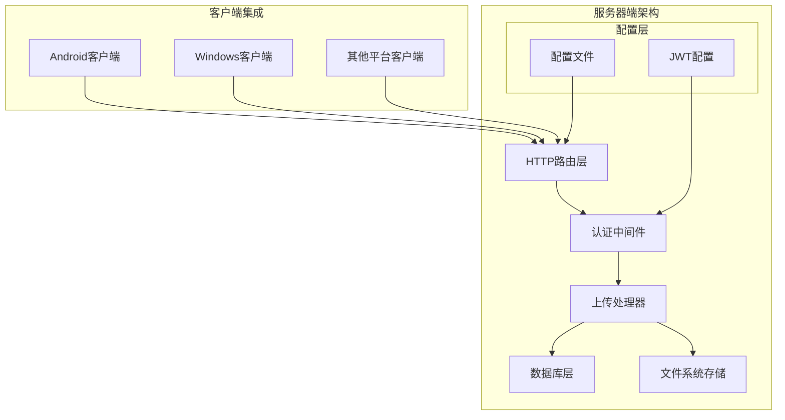
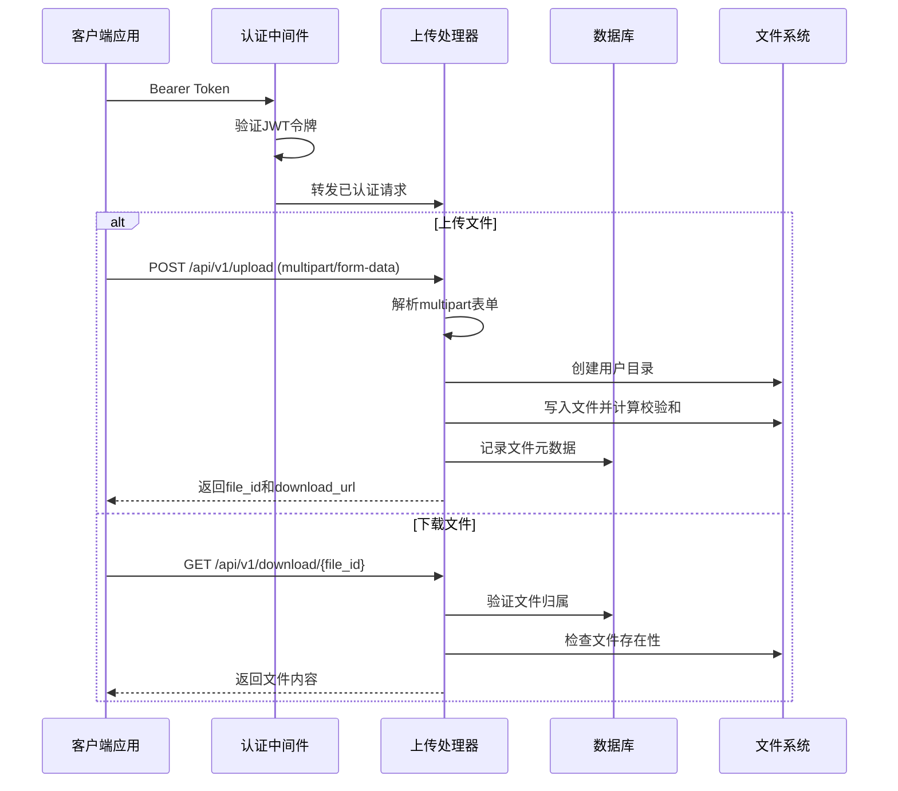
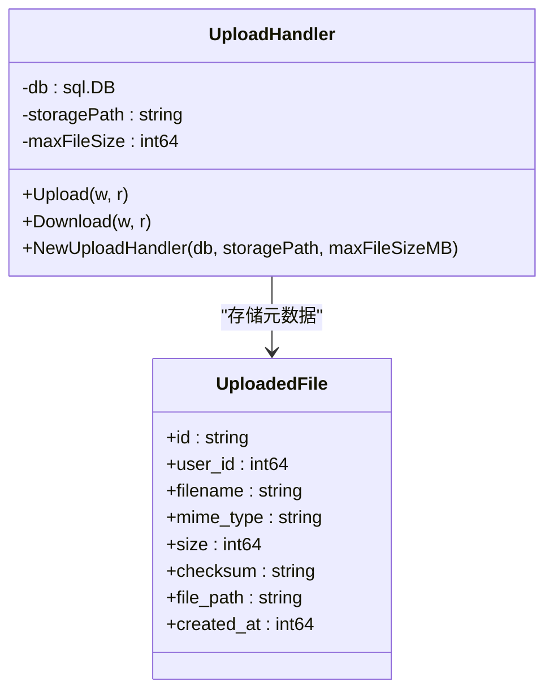
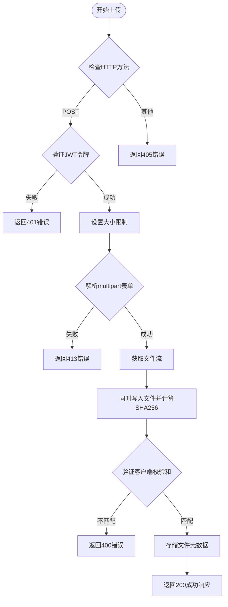
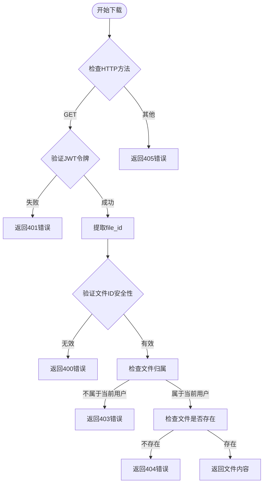
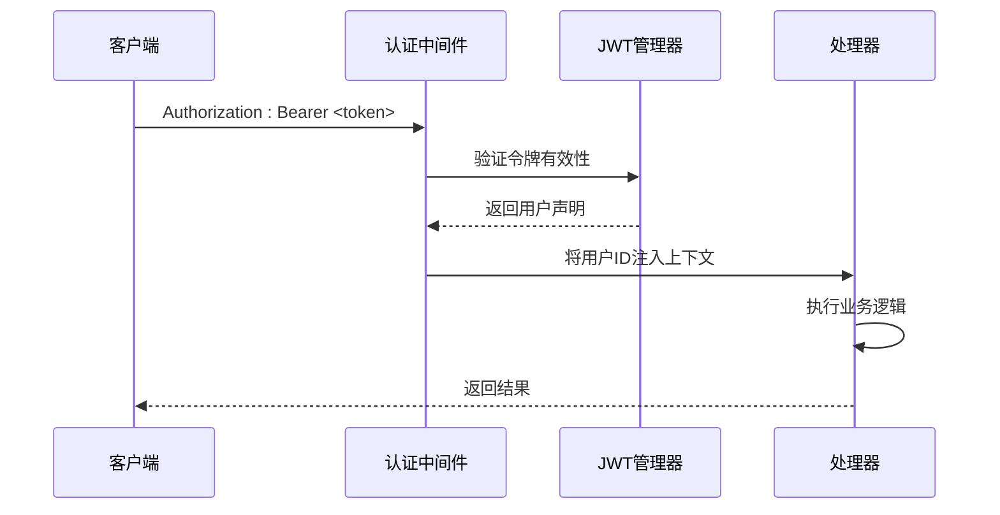
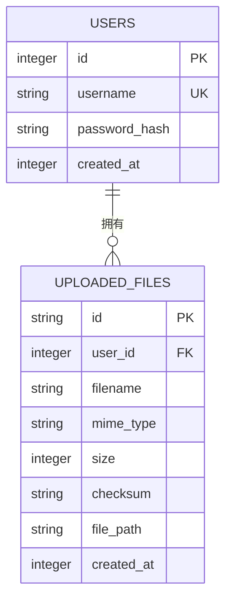
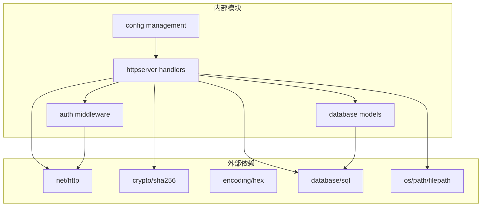

# 文件上传API

<cite>
**本文档引用的文件**
- [upload_handler.go](file://clipSync-server/internal/httpserver/upload_handler.go)
- [main.go](file://clipSync-server/cmd/server/main.go)
- [config.yaml](file://clipSync-server/configs/config.yaml)
- [models.go](file://clipSync-server/internal/database/models.go)
- [migrations.go](file://clipSync-server/internal/database/migrations.go)
- [middleware.go](file://clipSync-server/internal/auth/middleware.go)
- [http-api.schema.json](file://protocol/http-api.schema.json)
- [ApiClient.kt](file://clipSync-android/app/src/main/java/com/clipsync/app/network/ApiClient.kt)
</cite>

## 目录
1. [简介](#简介)
2. [项目结构](#项目结构)
3. [核心组件](#核心组件)
4. [架构概览](#架构概览)
5. [详细组件分析](#详细组件分析)
6. [依赖关系分析](#依赖关系分析)
7. [性能考虑](#性能考虑)
8. [故障排除指南](#故障排除指南)
9. [结论](#结论)
10. [附录](#附录)

## 简介
本文档详细说明了ClipSync服务器的文件上传API实现，包括POST /api/v1/upload和GET /api/v1/download/{file_id}两个核心接口。该API支持多部分表单数据上传、文件大小限制、校验和验证、用户隔离存储等特性，并与剪贴板同步功能紧密集成。

## 项目结构
文件上传功能位于服务器端的HTTP服务器模块中，采用分层架构设计：



**图表来源**
- [main.go:95-98](file://clipSync-server/cmd/server/main.go#L95-L98)
- [upload_handler.go:19-34](file://clipSync-server/internal/httpserver/upload_handler.go#L19-L34)

**章节来源**
- [main.go:95-98](file://clipSync-server/cmd/server/main.go#L95-L98)
- [config.yaml:18-22](file://clipSync-server/configs/config.yaml#L18-L22)

## 核心组件
文件上传API由以下核心组件构成：

### 1. 上传处理器 (UploadHandler)
负责处理文件上传和下载请求，实现安全的文件存储和访问控制。

### 2. 认证中间件
确保所有文件操作都经过有效的JWT令牌验证。

### 3. 数据库模型
定义文件元数据存储结构，包括文件ID、用户关联、校验和等信息。

### 4. 配置管理
通过YAML配置文件管理存储路径、文件大小限制等参数。

**章节来源**
- [upload_handler.go:19-34](file://clipSync-server/internal/httpserver/upload_handler.go#L19-L34)
- [models.go:35-45](file://clipSync-server/internal/database/models.go#L35-L45)
- [config.yaml:18-22](file://clipSync-server/configs/config.yaml#L18-L22)

## 架构概览
文件上传系统的整体架构如下：



**图表来源**
- [upload_handler.go:36-150](file://clipSync-server/internal/httpserver/upload_handler.go#L36-L150)
- [upload_handler.go:152-214](file://clipSync-server/internal/httpserver/upload_handler.go#L152-L214)

## 详细组件分析

### 上传处理器 (UploadHandler)
上传处理器是文件上传功能的核心实现，包含以下关键特性：

#### 数据结构设计


**图表来源**
- [upload_handler.go:20-24](file://clipSync-server/internal/httpserver/upload_handler.go#L20-L24)
- [models.go:35-45](file://clipSync-server/internal/database/models.go#L35-L45)

#### 上传流程详解


**图表来源**
- [upload_handler.go:36-150](file://clipSync-server/internal/httpserver/upload_handler.go#L36-L150)

#### 下载流程详解


**图表来源**
- [upload_handler.go:152-214](file://clipSync-server/internal/httpserver/upload_handler.go#L152-L214)

**章节来源**
- [upload_handler.go:36-220](file://clipSync-server/internal/httpserver/upload_handler.go#L36-L220)

### 认证与授权机制
系统采用JWT令牌进行身份验证，确保只有合法用户才能访问文件上传和下载功能：



**图表来源**
- [middleware.go:32-61](file://clipSync-server/internal/auth/middleware.go#L32-L61)

**章节来源**
- [middleware.go:32-61](file://clipSync-server/internal/auth/middleware.go#L32-L61)

### 数据库设计
文件元数据存储在SQLite数据库中，采用用户隔离的存储策略：



**图表来源**
- [migrations.go:65-77](file://clipSync-server/internal/database/migrations.go#L65-L77)

**章节来源**
- [migrations.go:65-77](file://clipSync-server/internal/database/migrations.go#L65-L77)
- [models.go:35-45](file://clipSync-server/internal/database/models.go#L35-L45)

## 依赖关系分析

### 组件依赖图


**图表来源**
- [upload_handler.go:3-17](file://clipSync-server/internal/httpserver/upload_handler.go#L3-L17)
- [main.go:3-16](file://clipSync-server/cmd/server/main.go#L3-L16)

### 关键依赖关系
- **认证依赖**: 上传处理器依赖认证中间件进行JWT验证
- **存储依赖**: 使用标准库的文件系统操作进行本地存储
- **数据库依赖**: 通过SQL接口管理文件元数据
- **配置依赖**: 从YAML配置文件读取运行时参数

**章节来源**
- [upload_handler.go:3-17](file://clipSync-server/internal/httpserver/upload_handler.go#L3-L17)
- [main.go:3-16](file://clipSync-server/cmd/server/main.go#L3-L16)

## 性能考虑
文件上传API在设计时充分考虑了性能和可扩展性：

### 存储策略优化
- **用户隔离**: 每个用户拥有独立的存储目录，避免文件冲突
- **流式处理**: 使用io.Copy进行内存友好的大文件传输
- **并发安全**: 通过文件锁和原子操作保证数据一致性

### 安全性保障
- **路径遍历防护**: 严格验证文件ID，防止目录遍历攻击
- **大小限制**: 通过MaxBytesReader限制请求体大小
- **校验和验证**: 双重校验确保文件完整性

### 错误恢复机制
- **事务回滚**: 数据库操作在失败时自动回滚
- **文件清理**: 异常情况下自动删除临时文件
- **幂等性**: 支持重复上传但不产生重复记录

## 故障排除指南

### 常见错误及解决方案

#### 1. 认证失败 (401 Unauthorized)
**症状**: 返回AUTH_FAILED或TOKEN_EXPIRED错误
**原因**: 
- 缺少Authorization头
- JWT令牌格式不正确
- 令牌已过期或无效

**解决方案**:
- 确保请求包含正确的Bearer Token格式
- 检查令牌有效期
- 重新登录获取新令牌

#### 2. 文件过大 (413 Request Entity Too Large)
**症状**: 返回CONTENT_TOO_LARGE错误
**原因**: 文件大小超过配置限制
**解决方案**:
- 检查配置文件中的max_file_size_mb设置
- 分割大文件或调整配置

#### 3. 文件不存在 (404 Not Found)
**症状**: 返回FILE_NOT_FOUND错误
**原因**:
- 文件ID无效或已被删除
- 用户无权访问该文件

**解决方案**:
- 验证文件ID的正确性
- 确认文件仍在服务器上

#### 4. 校验和不匹配 (400 Bad Request)
**症状**: 返回CHECKSUM_MISMATCH错误
**原因**: 上传过程中文件损坏或被篡改
**解决方案**:
- 重新上传文件
- 检查网络连接稳定性

**章节来源**
- [upload_handler.go:43-50](file://clipSync-server/internal/httpserver/upload_handler.go#L43-L50)
- [upload_handler.go:55-61](file://clipSync-server/internal/httpserver/upload_handler.go#L55-L61)
- [upload_handler.go:115-123](file://clipSync-server/internal/httpserver/upload_handler.go#L115-L123)

## 结论
ClipSync的文件上传API实现了安全、可靠且高效的文件传输功能。通过JWT认证、文件大小限制、校验和验证和用户隔离存储等机制，确保了系统的安全性、稳定性和可扩展性。该API与剪贴板同步功能无缝集成，为用户提供了一致的跨设备体验。

## 附录

### API规范详情

#### POST /api/v1/upload
**请求格式**:
- 方法: POST
- 头部: Authorization: Bearer <token>
- 内容类型: multipart/form-data
- 表单字段:
  - file: 二进制文件内容
  - checksum: SHA256校验和（可选）

**响应格式**:
```json
{
  "success": true,
  "file_id": "string",
  "download_url": "string"
}
```

#### GET /api/v1/download/{file_id}
**请求格式**:
- 方法: GET
- 头部: Authorization: Bearer <token>
- 路径参数: file_id

**响应格式**:
- 成功: 文件二进制内容
- 失败: JSON错误对象

**章节来源**
- [http-api.schema.json:211-278](file://protocol/http-api.schema.json#L211-L278)

### 配置参数说明
- **file_storage_path**: 文件存储根目录，默认./data/files
- **max_file_size_mb**: 最大文件大小限制，默认5MB
- **jwt_expiry_hours**: JWT令牌有效期，默认720小时

**章节来源**
- [config.yaml:18-22](file://clipSync-server/configs/config.yaml#L18-L22)