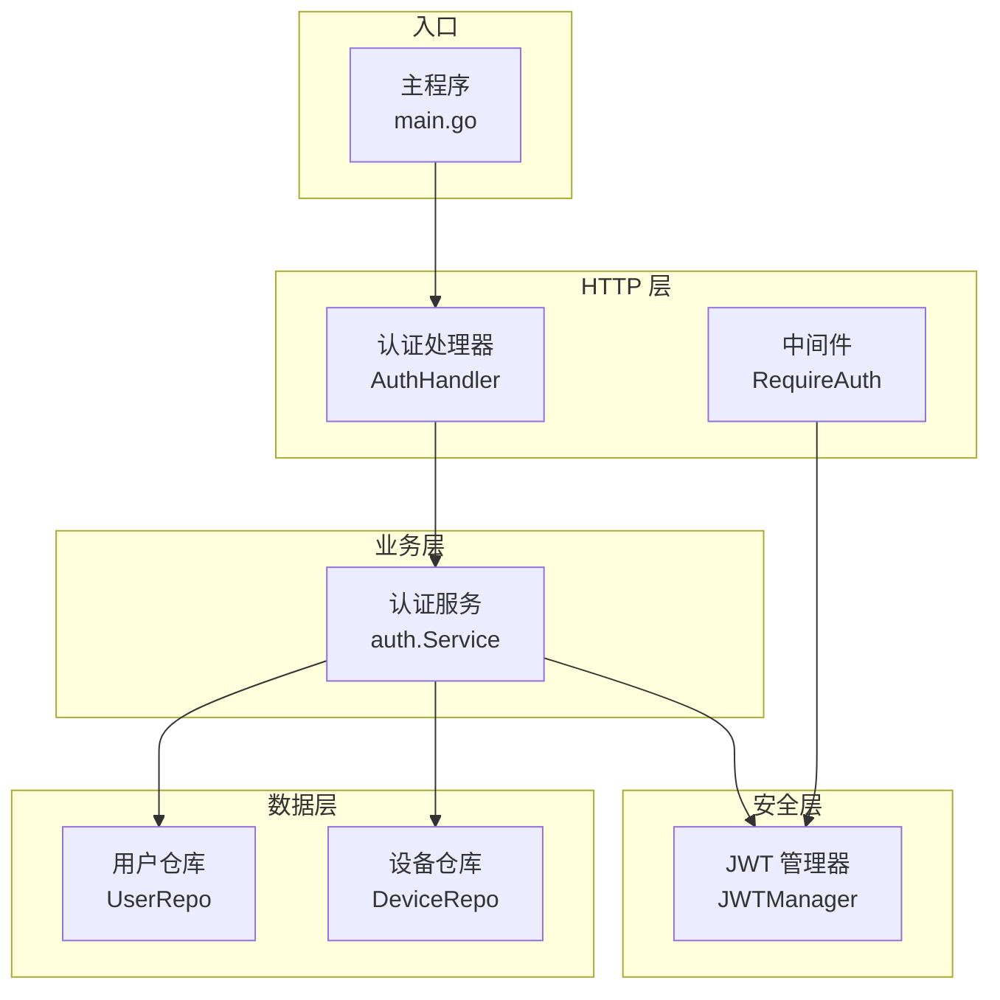
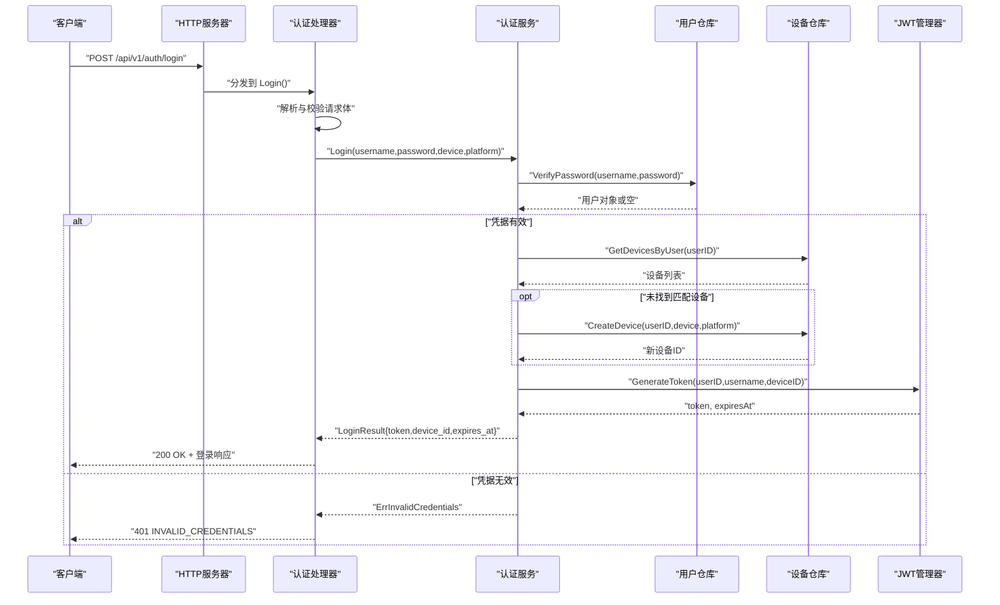
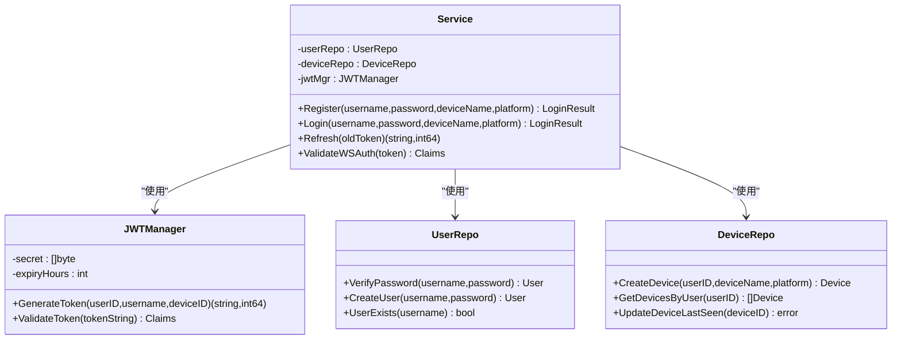
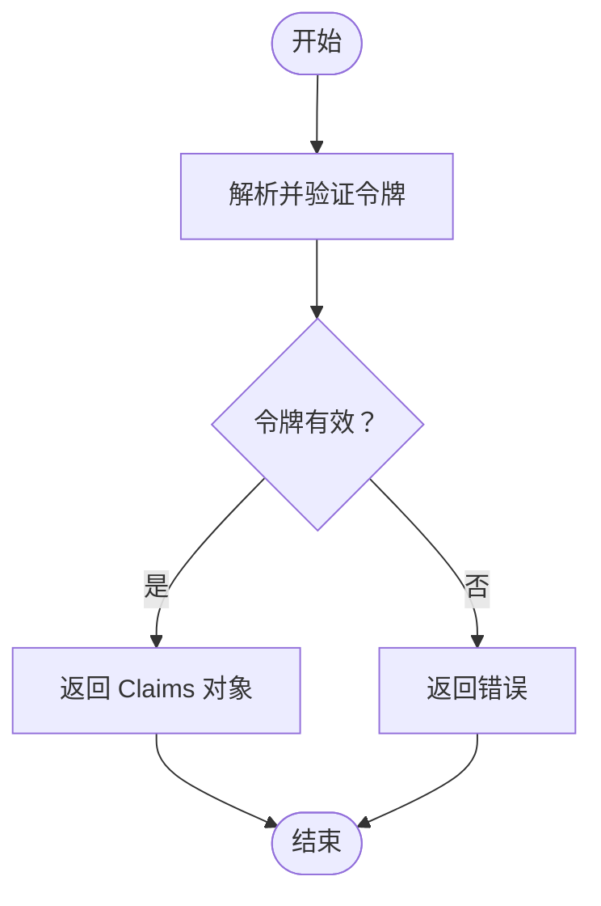
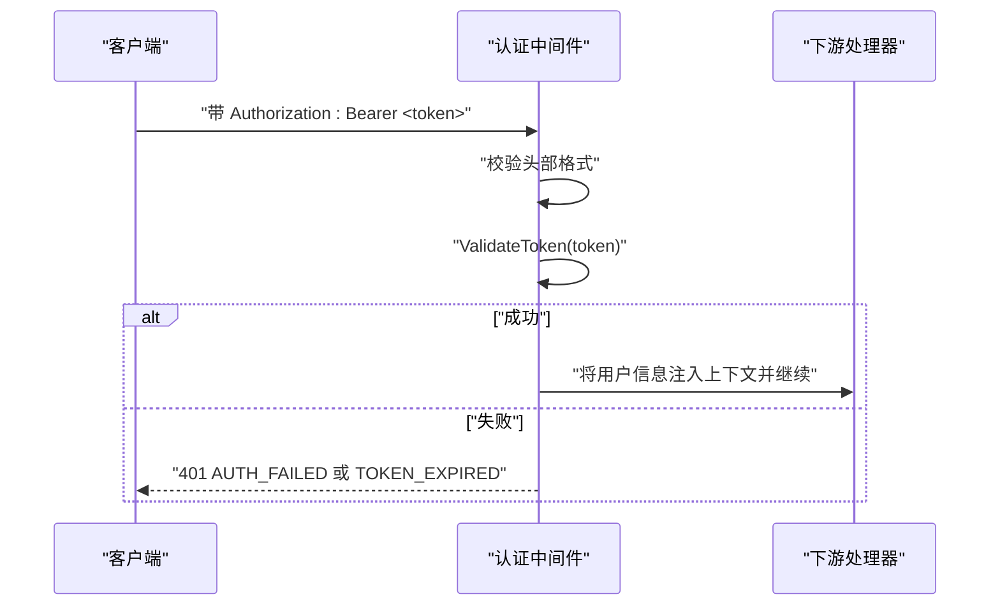
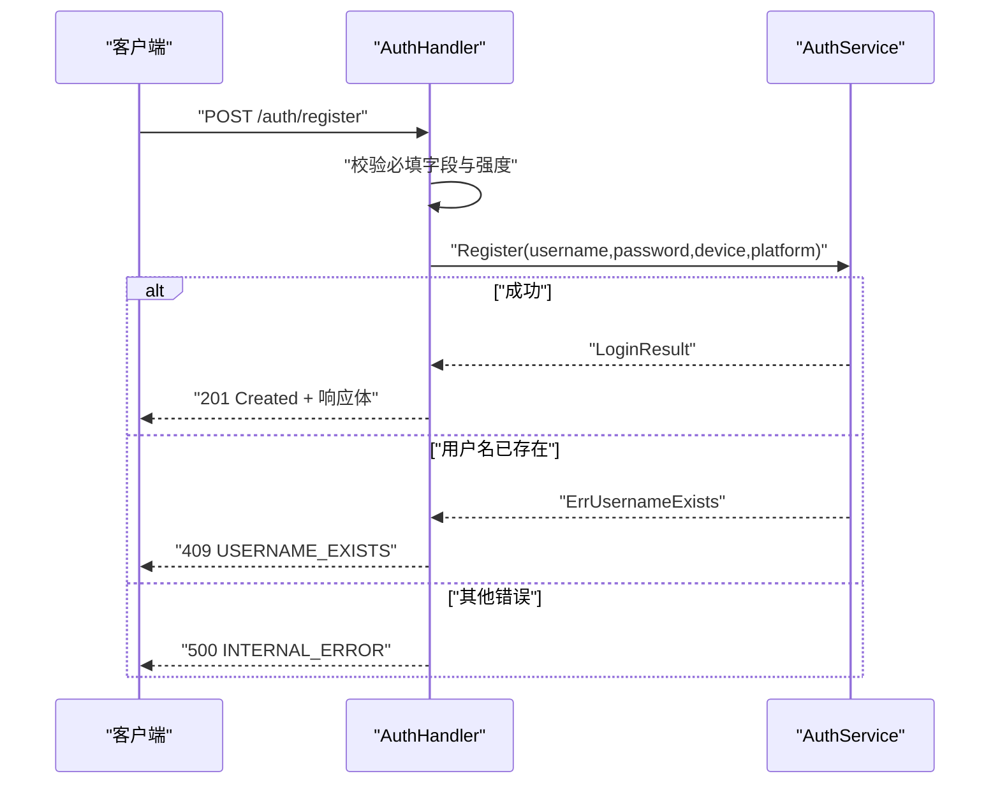
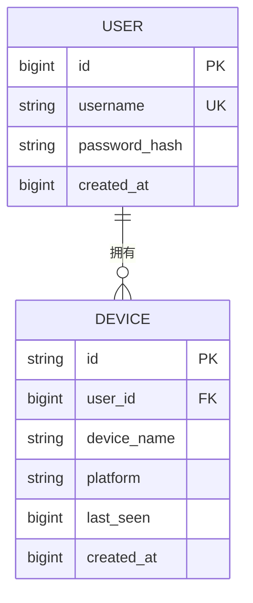
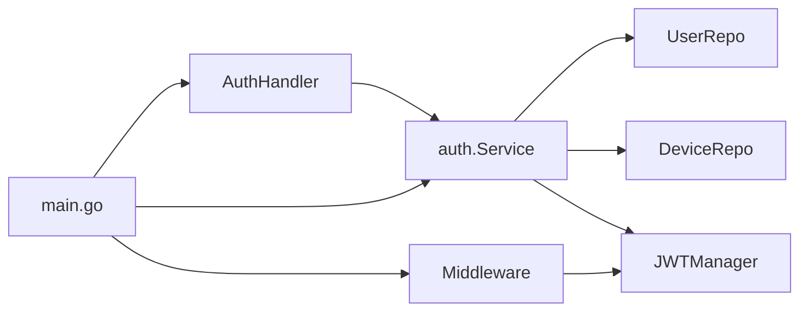

# 认证API

<cite>
**本文档引用的文件**
- [auth.go](file://clipSync-server/internal/auth/auth.go)
- [jwt.go](file://clipSync-server/internal/auth/jwt.go)
- [middleware.go](file://clipSync-server/internal/auth/middleware.go)
- [errors.go](file://clipSync-server/internal/auth/errors.go)
- [auth_handler.go](file://clipSync-server/internal/httpserver/auth_handler.go)
- [server.go](file://clipSync-server/internal/httpserver/server.go)
- [main.go](file://clipSync-server/cmd/server/main.go)
- [models.go](file://clipSync-server/internal/database/models.go)
- [user_repo.go](file://clipSync-server/internal/database/user_repo.go)
- [device_repo.go](file://clipSync-server/internal/database/device_repo.go)
- [http-api.schema.json](file://protocol/http-api.schema.json)
</cite>

## 目录
1. [简介](#简介)
2. [项目结构](#项目结构)
3. [核心组件](#核心组件)
4. [架构总览](#架构总览)
5. [详细组件分析](#详细组件分析)
6. [依赖关系分析](#依赖关系分析)
7. [性能考虑](#性能考虑)
8. [故障排除指南](#故障排除指南)
9. [结论](#结论)
10. [附录](#附录)

## 简介
本文件为 ClipSync 服务端认证API的权威技术文档，覆盖用户登录、注册与令牌刷新的完整HTTP接口实现。内容包括：
- 接口定义：POST /api/v1/auth/login、POST /api/v1/auth/register、POST /api/v1/auth/refresh 的请求格式、响应结构与错误码
- 数据模型：LoginRequest 结构体字段与约束
- 安全机制：JWT 令牌生成与验证、认证中间件、令牌过期处理
- 平台兼容：设备注册与平台枚举（windows/android/macos/ios）
- 错误处理：统一的错误响应格式与业务错误类型

## 项目结构
认证相关代码主要分布在以下模块：
- 认证服务层：负责业务逻辑（登录、注册、刷新）
- JWT 管理器：负责令牌签发与校验
- HTTP 处理器：负责路由、参数校验、响应封装
- 中间件：负责在受保护路由中提取并校验令牌
- 数据访问层：用户与设备的数据库操作
- 配置与启动：从配置加载密钥、设置路由与限流策略

图表来源
- [main.go:71-84](file://clipSync-server/cmd/server/main.go#L71-L84)
- [auth_handler.go:16-19](file://clipSync-server/internal/httpserver/auth_handler.go#L16-L19)
- [auth.go:15-22](file://clipSync-server/internal/auth/auth.go#L15-L22)
- [jwt.go:24-30](file://clipSync-server/internal/auth/jwt.go#L24-L30)
- [user_repo.go:16-19](file://clipSync-server/internal/database/user_repo.go#L16-L19)
- [device_repo.go:16-19](file://clipSync-server/internal/database/device_repo.go#L16-L19)

章节来源
- [main.go:71-84](file://clipSync-server/cmd/server/main.go#L71-L84)
- [auth_handler.go:16-19](file://clipSync-server/internal/httpserver/auth_handler.go#L16-L19)
- [auth.go:15-22](file://clipSync-server/internal/auth/auth.go#L15-L22)
- [jwt.go:24-30](file://clipSync-server/internal/auth/jwt.go#L24-L30)
- [user_repo.go:16-19](file://clipSync-server/internal/database/user_repo.go#L16-L19)
- [device_repo.go:16-19](file://clipSync-server/internal/database/device_repo.go#L16-L19)

## 核心组件
- 认证服务 Service：封装登录、注册、刷新等业务逻辑，并协调用户仓库、设备仓库与JWT管理器
- JWT 管理器 JWTManager：基于 HS256 签名生成与验证令牌，携带用户ID、用户名、设备ID及标准声明
- 认证中间件 Middleware：拦截受保护路由，校验 Authorization Bearer 令牌并将用户上下文注入请求
- 认证处理器 AuthHandler：实现三个认证HTTP端点，负责请求解析、参数校验、调用服务层并返回标准化响应
- 数据仓库 UserRepo/DeviceRepo：提供用户密码校验、设备注册与查询等持久化能力
- 主程序 main：初始化配置、数据库、JWT、服务与中间件，构建路由并启用限流

章节来源
- [auth.go:8-22](file://clipSync-server/internal/auth/auth.go#L8-L22)
- [jwt.go:18-30](file://clipSync-server/internal/auth/jwt.go#L18-L30)
- [middleware.go:22-30](file://clipSync-server/internal/auth/middleware.go#L22-L30)
- [auth_handler.go:11-19](file://clipSync-server/internal/httpserver/auth_handler.go#L11-L19)
- [user_repo.go:11-19](file://clipSync-server/internal/database/user_repo.go#L11-L19)
- [device_repo.go:11-19](file://clipSync-server/internal/database/device_repo.go#L11-L19)
- [main.go:61-65](file://clipSync-server/cmd/server/main.go#L61-L65)

## 架构总览
下图展示了认证API的端到端交互流程，包括请求进入、参数校验、业务处理、令牌发放与响应返回。

图表来源
- [auth_handler.go:63-109](file://clipSync-server/internal/httpserver/auth_handler.go#L63-L109)
- [auth.go:67-116](file://clipSync-server/internal/auth/auth.go#L67-L116)
- [user_repo.go:65-80](file://clipSync-server/internal/database/user_repo.go#L65-L80)
- [device_repo.go:60-90](file://clipSync-server/internal/database/device_repo.go#L60-L90)
- [jwt.go:32-55](file://clipSync-server/internal/auth/jwt.go#L32-L55)

## 详细组件分析

### 认证服务 Service
- 职责
  - 登录：校验密码、查找或创建设备、生成JWT
  - 注册：检查用户名唯一性、创建用户与设备、生成JWT
  - 刷新：验证旧令牌并签发新令牌
- 关键方法
  - Register(username, password, deviceName, platform) -> LoginResult
  - Login(username, password, deviceName, platform) -> LoginResult
  - Refresh(oldToken) -> (token, expiresAt)
- 返回结构 LoginResult 包含 token、device_id、expires_at

图表来源
- [auth.go:8-22](file://clipSync-server/internal/auth/auth.go#L8-L22)
- [jwt.go:18-30](file://clipSync-server/internal/auth/jwt.go#L18-L30)
- [user_repo.go:11-19](file://clipSync-server/internal/database/user_repo.go#L11-L19)
- [device_repo.go:11-19](file://clipSync-server/internal/database/device_repo.go#L11-L19)

章节来源
- [auth.go:24-65](file://clipSync-server/internal/auth/auth.go#L24-L65)
- [auth.go:67-116](file://clipSync-server/internal/auth/auth.go#L67-L116)
- [auth.go:118-131](file://clipSync-server/internal/auth/auth.go#L118-L131)

### JWT 管理器 JWTManager
- Claims 结构：包含 user_id、username、device_id 以及标准声明（过期时间、签发时间、发行方）
- GenerateToken：以 HS256 签名，设置过期时间与发行时间，返回签名字符串与到期时间戳（毫秒）
- ValidateToken：校验签名方法与密钥，解析并返回 Claims；失败时返回错误

图表来源
- [jwt.go:57-75](file://clipSync-server/internal/auth/jwt.go#L57-L75)

章节来源
- [jwt.go:10-16](file://clipSync-server/internal/auth/jwt.go#L10-L16)
- [jwt.go:32-55](file://clipSync-server/internal/auth/jwt.go#L32-L55)
- [jwt.go:57-75](file://clipSync-server/internal/auth/jwt.go#L57-L75)

### 认证中间件 Middleware
- RequireAuth：从 Authorization 请求头提取 Bearer 令牌，校验格式与有效性，将用户信息写入请求上下文
- 提供工具函数从上下文中读取 user_id、username、device_id

图表来源
- [middleware.go:32-61](file://clipSync-server/internal/auth/middleware.go#L32-L61)

章节来源
- [middleware.go:10-20](file://clipSync-server/internal/auth/middleware.go#L10-L20)
- [middleware.go:32-61](file://clipSync-server/internal/auth/middleware.go#L32-L61)
- [middleware.go:63-100](file://clipSync-server/internal/auth/middleware.go#L63-L100)

### 认证处理器 AuthHandler
- LoginRequest：包含 username、password、device_name、platform 四个字段
- Login：解析请求体，调用服务层登录，返回 token、device_id、expires_at
- Register：额外进行用户名与密码强度校验，返回 201/409/400/500
- Refresh：要求 Bearer 头部，调用服务层刷新，返回新 token 与到期时间

图表来源
- [auth_handler.go:111-175](file://clipSync-server/internal/httpserver/auth_handler.go#L111-L175)

章节来源
- [auth_handler.go:21-27](file://clipSync-server/internal/httpserver/auth_handler.go#L21-L27)
- [auth_handler.go:63-109](file://clipSync-server/internal/httpserver/auth_handler.go#L63-L109)
- [auth_handler.go:111-175](file://clipSync-server/internal/httpserver/auth_handler.go#L111-L175)
- [auth_handler.go:177-208](file://clipSync-server/internal/httpserver/auth_handler.go#L177-L208)

### 数据模型与仓库
- User/Device/ClipboardEntry/UploadedFile：定义用户、设备、剪贴板条目与上传文件的数据结构
- UserRepo：提供 CreateUser、VerifyPassword、UserExists 等方法
- DeviceRepo：提供 CreateDevice、GetDevicesByUser、UpdateDeviceLastSeen、DeleteDevice 等方法

图表来源
- [models.go:3-19](file://clipSync-server/internal/database/models.go#L3-L19)
- [user_repo.go:21-47](file://clipSync-server/internal/database/user_repo.go#L21-L47)
- [device_repo.go:21-42](file://clipSync-server/internal/database/device_repo.go#L21-L42)

章节来源
- [models.go:3-19](file://clipSync-server/internal/database/models.go#L3-L19)
- [user_repo.go:21-80](file://clipSync-server/internal/database/user_repo.go#L21-L80)
- [device_repo.go:21-90](file://clipSync-server/internal/database/device_repo.go#L21-L90)

## 依赖关系分析
- 认证处理器依赖认证服务
- 认证服务依赖用户仓库、设备仓库与JWT管理器
- 认证中间件依赖JWT管理器
- 主程序负责装配各组件并注册路由

图表来源
- [auth_handler.go:16-19](file://clipSync-server/internal/httpserver/auth_handler.go#L16-L19)
- [auth.go:15-22](file://clipSync-server/internal/auth/auth.go#L15-L22)
- [jwt.go:24-30](file://clipSync-server/internal/auth/jwt.go#L24-L30)
- [middleware.go:27-30](file://clipSync-server/internal/auth/middleware.go#L27-L30)
- [main.go:61-72](file://clipSync-server/cmd/server/main.go#L61-L72)

章节来源
- [auth_handler.go:16-19](file://clipSync-server/internal/httpserver/auth_handler.go#L16-L19)
- [auth.go:15-22](file://clipSync-server/internal/auth/auth.go#L15-L22)
- [jwt.go:24-30](file://clipSync-server/internal/auth/jwt.go#L24-L30)
- [middleware.go:27-30](file://clipSync-server/internal/auth/middleware.go#L27-L30)
- [main.go:61-72](file://clipSync-server/cmd/server/main.go#L61-L72)

## 性能考虑
- 限流策略：认证端点采用每IP每分钟10次的速率限制，防止暴力破解与滥用
- 连接超时：HTTP服务器设置合理的 ReadTimeout/WriteTimeout/IdleTimeout，避免资源占用
- 密钥与过期：JWT 使用 HS256 签名，过期时间可配置，建议结合刷新机制降低单次长有效期风险
- 数据库索引：按用户名查询用户、按用户查询设备等常用查询需确保索引命中

## 故障排除指南
- 400 INVALID_PAYLOAD
  - 触发场景：请求体解析失败、缺少必填字段、用户名/密码不满足强度要求
  - 处理建议：检查请求体 JSON 格式与字段长度/范围
- 401 INVALID_CREDENTIALS
  - 触发场景：登录时用户名或密码错误
  - 处理建议：确认凭据正确性，检查大小写与特殊字符
- 401 AUTH_FAILED
  - 触发场景：刷新令牌时缺少或格式不正确的 Authorization 头
  - 处理建议：确保使用 Bearer <token> 格式
- 401 TOKEN_EXPIRED
  - 触发场景：刷新令牌时旧令牌无效或已过期
  - 处理建议：重新登录获取新令牌
- 409 USERNAME_EXISTS
  - 触发场景：注册时用户名已被占用
  - 处理建议：更换用户名或执行登录
- 500 INTERNAL_ERROR
  - 触发场景：服务内部异常（数据库/加密/签名等）
  - 处理建议：查看服务日志定位具体错误

章节来源
- [auth_handler.go:63-109](file://clipSync-server/internal/httpserver/auth_handler.go#L63-L109)
- [auth_handler.go:111-175](file://clipSync-server/internal/httpserver/auth_handler.go#L111-L175)
- [auth_handler.go:177-208](file://clipSync-server/internal/httpserver/auth_handler.go#L177-L208)
- [errors.go:7-11](file://clipSync-server/internal/auth/errors.go#L7-L11)

## 结论
本认证API通过清晰的分层设计实现了登录、注册与令牌刷新的核心功能，配合JWT与中间件提供了基础的安全保障。建议在生产环境中进一步强化：
- 引入更严格的密码策略与账户锁定机制
- 启用 HTTPS 与安全传输
- 审计与监控异常登录行为
- 对敏感操作增加二次验证

## 附录

### 接口规范与示例

- POST /api/v1/auth/login
  - 请求体字段
    - username: string（3-50字符）
    - password: string（至少8位，包含字母与数字）
    - device_name: string（1-100字符）
    - platform: 枚举值 ["windows","android","macos","ios"]
  - 成功响应
    - 200 OK
    - 字段：success=true、token、device_id、expires_at（Unix毫秒）
  - 错误响应
    - 401 INVALID_CREDENTIALS
    - 400 INVALID_PAYLOAD
    - 500 INTERNAL_ERROR

- POST /api/v1/auth/register
  - 请求体字段
    - username/password/device_name/platform 同上
  - 成功响应
    - 201 Created
    - 字段：success=true、token、device_id、expires_at
  - 错误响应
    - 409 USERNAME_EXISTS
    - 400 INVALID_PAYLOAD
    - 500 INTERNAL_ERROR

- POST /api/v1/auth/refresh
  - 请求头
    - Authorization: Bearer <token>
  - 成功响应
    - 200 OK
    - 字段：success=true、token、expires_at
  - 错误响应
    - 401 AUTH_FAILED（缺少或格式错误的Authorization头）
    - 401 TOKEN_EXPIRED（旧令牌无效）

章节来源
- [http-api.schema.json:8-49](file://protocol/http-api.schema.json#L8-L49)
- [http-api.schema.json:50-90](file://protocol/http-api.schema.json#L50-L90)
- [http-api.schema.json:92-124](file://protocol/http-api.schema.json#L92-L124)

### LoginRequest 数据结构
- 字段
  - username: string
  - password: string
  - device_name: string
  - platform: string（枚举 windows/android/macos/ios）

章节来源
- [auth_handler.go:21-27](file://clipSync-server/internal/httpserver/auth_handler.go#L21-L27)

### JWT 令牌生成与验证机制
- Claims 内容
  - user_id、username、device_id
  - RegisteredClaims：ExpiresAt、IssuedAt、Issuer
- 签名算法：HS256
- 过期时间：由配置决定（小时），返回 expires_at 为 Unix 毫秒

章节来源
- [jwt.go:10-16](file://clipSync-server/internal/auth/jwt.go#L10-L16)
- [jwt.go:32-55](file://clipSync-server/internal/auth/jwt.go#L32-L55)
- [jwt.go:57-75](file://clipSync-server/internal/auth/jwt.go#L57-L75)

### 认证中间件与令牌过期处理
- 中间件职责
  - 校验 Authorization 头格式
  - 验证令牌有效性并注入用户上下文
- 令牌过期
  - 通过刷新接口获取新令牌
  - 旧令牌将被判定为 TOKEN_EXPIRED

章节来源
- [middleware.go:32-61](file://clipSync-server/internal/auth/middleware.go#L32-L61)
- [auth.go:118-131](file://clipSync-server/internal/auth/auth.go#L118-L131)

### 用户名密码验证与设备注册流程
- 用户名验证
  - 长度3-32字符
- 密码验证
  - 至少8位，必须同时包含字母与数字
- 设备注册
  - 首次登录若无匹配设备则创建
  - 后续登录会更新设备最近活跃时间

章节来源
- [auth_handler.go:29-61](file://clipSync-server/internal/httpserver/auth_handler.go#L29-L61)
- [auth.go:67-116](file://clipSync-server/internal/auth/auth.go#L67-L116)
- [device_repo.go:82-90](file://clipSync-server/internal/database/device_repo.go#L82-L90)

### 平台兼容性处理
- platform 枚举支持：windows、android、macos、ios
- 同一用户可在不同平台上注册多个设备
- 设备去重依据：同一用户下的 device_name 与 platform 组合

章节来源
- [http-api.schema.json:14-20](file://protocol/http-api.schema.json#L14-L20)
- [auth_handler.go:21-27](file://clipSync-server/internal/httpserver/auth_handler.go#L21-L27)
- [auth.go:67-116](file://clipSync-server/internal/auth/auth.go#L67-L116)