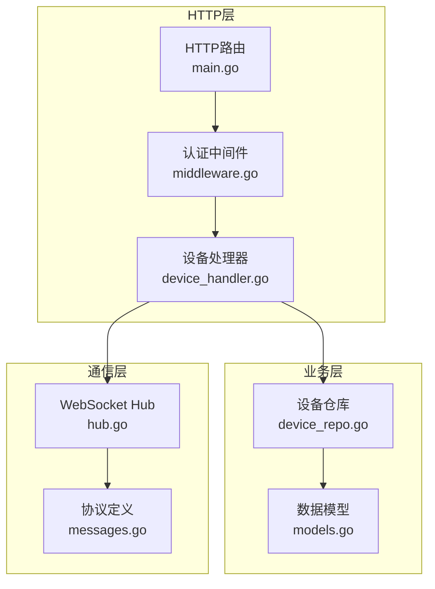
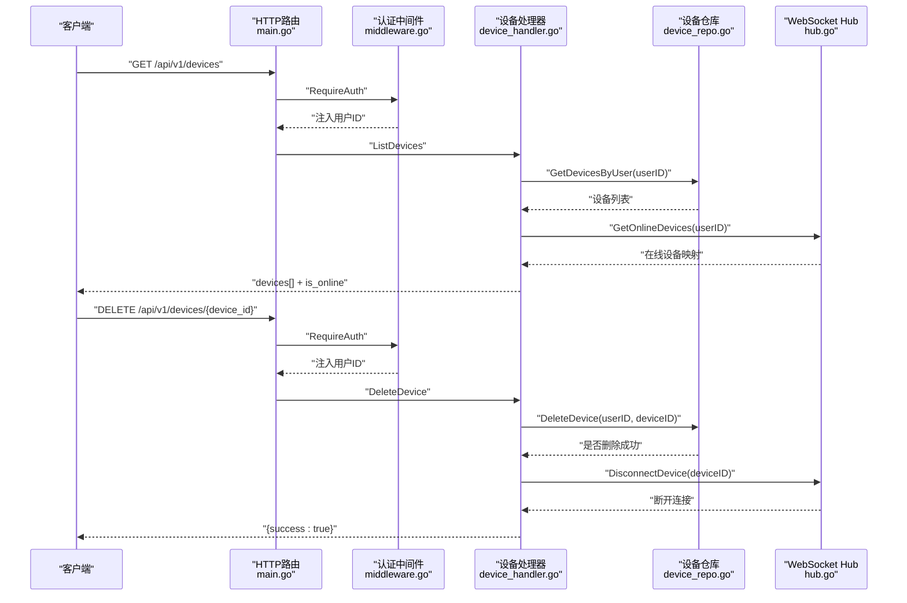
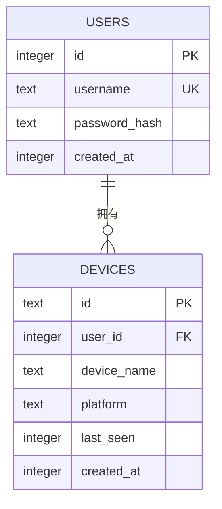
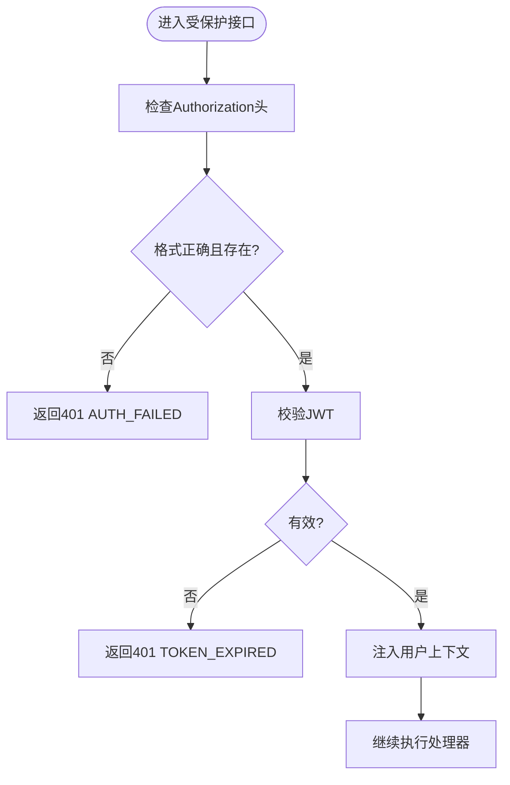
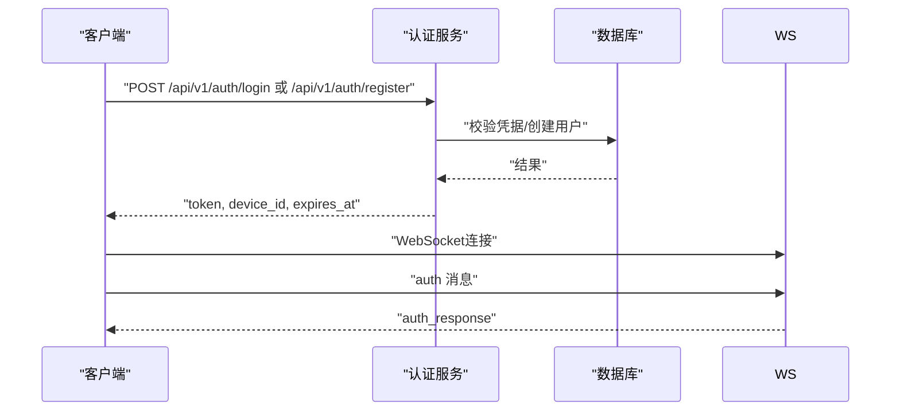
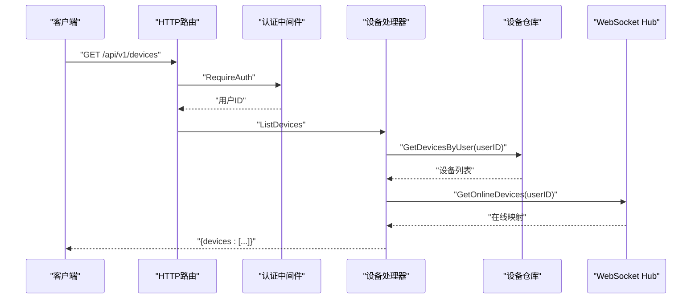
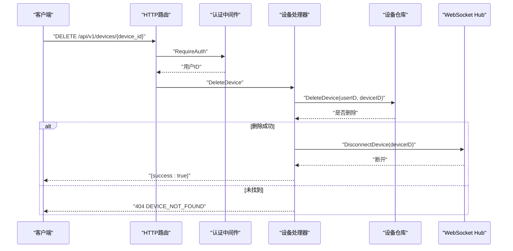
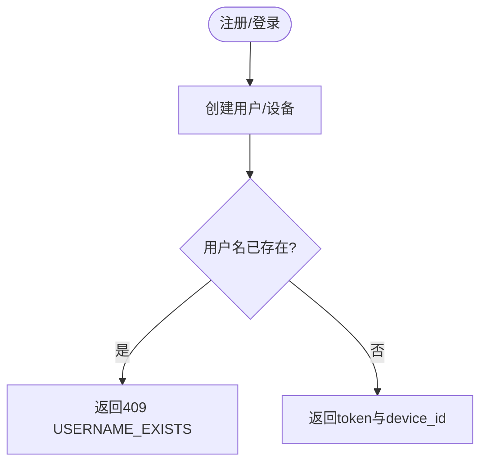
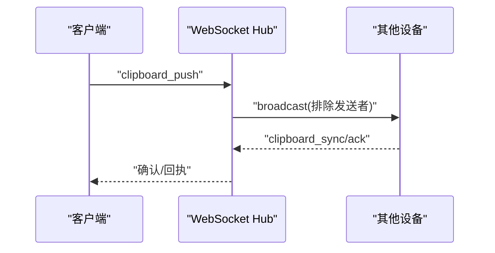
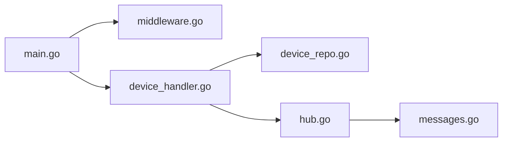

# 设备管理API

<cite>
**本文档引用的文件**
- [clipSync-server/cmd/server/main.go](file://clipSync-server/cmd/server/main.go)
- [clipSync-server/internal/httpserver/device_handler.go](file://clipSync-server/internal/httpserver/device_handler.go)
- [clipSync-server/internal/database/device_repo.go](file://clipSync-server/internal/database/device_repo.go)
- [clipSync-server/internal/database/models.go](file://clipSync-server/internal/database/models.go)
- [clipSync-server/internal/websocket/hub.go](file://clipSync-server/internal/websocket/hub.go)
- [clipSync-server/internal/auth/middleware.go](file://clipSync-server/internal/auth/middleware.go)
- [clipSync-server/migrations/001_initial.sql](file://clipSync-server/migrations/001_initial.sql)
- [protocol/http-api.schema.json](file://protocol/http-api.schema.json)
- [clipSync-server/pkg/protocol/messages.go](file://clipSync-server/pkg/protocol/messages.go)
- [clipSync-android/app/src/main/java/com/clipsync/app/network/Protocol.kt](file://clipSync-android/app/src/main/java/com/clipsync/app/network/Protocol.kt)
</cite>

## 目录
1. [简介](#简介)
2. [项目结构](#项目结构)
3. [核心组件](#核心组件)
4. [架构总览](#架构总览)
5. [详细组件分析](#详细组件分析)
6. [依赖关系分析](#依赖关系分析)
7. [性能考虑](#性能考虑)
8. [故障排除指南](#故障排除指南)
9. [结论](#结论)

## 简介
本文件面向设备管理API，系统性阐述设备注册、查询、更新和注销的HTTP接口实现，涵盖数据模型、状态管理、权限验证、设备唯一标识生成、设备名称冲突处理以及设备离线检测机制，并解释设备与用户绑定关系及多设备同步机制。文档基于实际代码库进行分析，提供精确的接口定义、响应结构与错误码说明。

## 项目结构
后端服务采用分层架构：HTTP路由在入口处配置，认证中间件统一拦截校验；设备相关业务逻辑由设备仓库（DeviceRepo）封装数据库操作；WebSocket Hub负责在线状态维护与广播；协议定义在独立包中，确保前后端一致性。

**图表来源**
- [clipSync-server/cmd/server/main.go:74-98](file://clipSync-server/cmd/server/main.go#L74-L98)
- [clipSync-server/internal/httpserver/device_handler.go:11-23](file://clipSync-server/internal/httpserver/device_handler.go#L11-L23)
- [clipSync-server/internal/auth/middleware.go:22-61](file://clipSync-server/internal/auth/middleware.go#L22-L61)
- [clipSync-server/internal/database/device_repo.go:11-19](file://clipSync-server/internal/database/device_repo.go#L11-L19)
- [clipSync-server/internal/websocket/hub.go:18-58](file://clipSync-server/internal/websocket/hub.go#L18-L58)
- [clipSync-server/pkg/protocol/messages.go:5-132](file://clipSync-server/pkg/protocol/messages.go#L5-L132)

**章节来源**
- [clipSync-server/cmd/server/main.go:74-98](file://clipSync-server/cmd/server/main.go#L74-L98)
- [clipSync-server/internal/httpserver/device_handler.go:11-23](file://clipSync-server/internal/httpserver/device_handler.go#L11-L23)
- [clipSync-server/internal/auth/middleware.go:22-61](file://clipSync-server/internal/auth/middleware.go#L22-L61)
- [clipSync-server/internal/database/device_repo.go:11-19](file://clipSync-server/internal/database/device_repo.go#L11-L19)
- [clipSync-server/internal/websocket/hub.go:18-58](file://clipSync-server/internal/websocket/hub.go#L18-L58)
- [clipSync-server/pkg/protocol/messages.go:5-132](file://clipSync-server/pkg/protocol/messages.go#L5-L132)

## 核心组件
- 设备处理器（DeviceHandler）：实现设备列表查询与设备注销的HTTP接口，负责调用仓库与WebSocket Hub。
- 设备仓库（DeviceRepo）：封装SQLite数据库的设备CRUD与状态更新操作，生成设备唯一ID。
- 认证中间件（Middleware）：解析Authorization头，校验JWT并注入用户上下文。
- WebSocket Hub：维护在线设备集合，支持按用户广播与断开指定设备连接。
- 数据模型（models.go）：定义设备实体字段，包括设备ID、用户ID、平台、时间戳等。
- 协议定义（messages.go）：统一WebSocket消息类型与负载结构，支撑设备列表与注销消息。

**章节来源**
- [clipSync-server/internal/httpserver/device_handler.go:11-23](file://clipSync-server/internal/httpserver/device_handler.go#L11-L23)
- [clipSync-server/internal/database/device_repo.go:11-19](file://clipSync-server/internal/database/device_repo.go#L11-L19)
- [clipSync-server/internal/auth/middleware.go:22-61](file://clipSync-server/internal/auth/middleware.go#L22-L61)
- [clipSync-server/internal/websocket/hub.go:18-58](file://clipSync-server/internal/websocket/hub.go#L18-L58)
- [clipSync-server/internal/database/models.go:11-19](file://clipSync-server/internal/database/models.go#L11-L19)
- [clipSync-server/pkg/protocol/messages.go:81-99](file://clipSync-server/pkg/protocol/messages.go#L81-L99)

## 架构总览
设备管理API通过HTTP路由暴露REST接口，所有受保护接口均需携带Bearer Token；设备状态由WebSocket Hub实时维护，HTTP响应中返回设备在线状态。设备注销会同时从数据库删除并断开WebSocket连接。

**图表来源**
- [clipSync-server/cmd/server/main.go:90-93](file://clipSync-server/cmd/server/main.go#L90-L93)
- [clipSync-server/internal/auth/middleware.go:32-61](file://clipSync-server/internal/auth/middleware.go#L32-L61)
- [clipSync-server/internal/httpserver/device_handler.go:25-82](file://clipSync-server/internal/httpserver/device_handler.go#L25-L82)
- [clipSync-server/internal/httpserver/device_handler.go:84-136](file://clipSync-server/internal/httpserver/device_handler.go#L84-L136)
- [clipSync-server/internal/database/device_repo.go:60-106](file://clipSync-server/internal/database/device_repo.go#L60-L106)
- [clipSync-server/internal/websocket/hub.go:155-179](file://clipSync-server/internal/websocket/hub.go#L155-L179)

## 详细组件分析

### 设备数据模型与表结构
- 设备实体包含：设备ID（字符串前缀+十六进制）、用户ID、设备名称、平台、最后在线时间、创建时间。
- 数据库表devices具备外键约束，删除用户时级联删除其设备；索引提升查询效率。
- 设备唯一ID生成策略：随机字节转十六进制并加前缀，保证全局唯一性。

**图表来源**
- [clipSync-server/migrations/001_initial.sql:4-22](file://clipSync-server/migrations/001_initial.sql#L4-L22)
- [clipSync-server/internal/database/models.go:11-19](file://clipSync-server/internal/database/models.go#L11-L19)

**章节来源**
- [clipSync-server/migrations/001_initial.sql:12-22](file://clipSync-server/migrations/001_initial.sql#L12-L22)
- [clipSync-server/internal/database/models.go:11-19](file://clipSync-server/internal/database/models.go#L11-L19)
- [clipSync-server/internal/database/device_repo.go:121-125](file://clipSync-server/internal/database/device_repo.go#L121-L125)

### 权限验证与上下文注入
- 路由层使用认证中间件拦截受保护路径，要求Authorization头为Bearer Token。
- 中间件校验JWT有效性，失败时返回相应错误码；成功则将用户ID、用户名、设备ID写入请求上下文供后续处理器使用。

**图表来源**
- [clipSync-server/internal/auth/middleware.go:32-61](file://clipSync-server/internal/auth/middleware.go#L32-L61)

**章节来源**
- [clipSync-server/internal/auth/middleware.go:32-61](file://clipSync-server/internal/auth/middleware.go#L32-L61)
- [clipSync-server/cmd/server/main.go:90-93](file://clipSync-server/cmd/server/main.go#L90-L93)

### 设备注册（登录/注册流程）
- 登录/注册成功后返回令牌与设备ID，客户端随后建立WebSocket连接并发送认证消息完成鉴权。
- 注册流程中用户名冲突由认证服务处理，返回特定错误码。

**图表来源**
- [protocol/http-api.schema.json:8-49](file://protocol/http-api.schema.json#L8-L49)
- [protocol/http-api.schema.json:50-91](file://protocol/http-api.schema.json#L50-L91)

**章节来源**
- [protocol/http-api.schema.json:8-49](file://protocol/http-api.schema.json#L8-L49)
- [protocol/http-api.schema.json:50-91](file://protocol/http-api.schema.json#L50-L91)

### 设备列表查询（GET /api/v1/devices）
- 请求：需要Bearer Token。
- 处理：根据上下文中的用户ID查询该用户的所有设备；随后查询WebSocket Hub获取在线设备映射，填充响应字段。
- 响应：devices数组，每项包含设备ID、名称、平台、最后在线时间、是否在线、创建时间。

**图表来源**
- [clipSync-server/internal/httpserver/device_handler.go:25-82](file://clipSync-server/internal/httpserver/device_handler.go#L25-L82)
- [clipSync-server/internal/database/device_repo.go:60-80](file://clipSync-server/internal/database/device_repo.go#L60-L80)
- [clipSync-server/internal/websocket/hub.go:168-179](file://clipSync-server/internal/websocket/hub.go#L168-L179)
- [protocol/http-api.schema.json:144-177](file://protocol/http-api.schema.json#L144-L177)

**章节来源**
- [clipSync-server/internal/httpserver/device_handler.go:25-82](file://clipSync-server/internal/httpserver/device_handler.go#L25-L82)
- [clipSync-server/internal/database/device_repo.go:60-80](file://clipSync-server/internal/database/device_repo.go#L60-L80)
- [clipSync-server/internal/websocket/hub.go:168-179](file://clipSync-server/internal/websocket/hub.go#L168-L179)
- [protocol/http-api.schema.json:144-177](file://protocol/http-api.schema.json#L144-L177)

### 设备注销（DELETE /api/v1/devices/{device_id}）
- 请求：需要Bearer Token，路径参数device_id。
- 处理：校验用户对设备的所有权，删除数据库记录；若设备当前在线，则断开其WebSocket连接。
- 响应：成功返回success字段为true；未找到设备返回404 DEVICE_NOT_FOUND。

**图表来源**
- [clipSync-server/internal/httpserver/device_handler.go:84-136](file://clipSync-server/internal/httpserver/device_handler.go#L84-L136)
- [clipSync-server/internal/database/device_repo.go:92-106](file://clipSync-server/internal/database/device_repo.go#L92-L106)
- [clipSync-server/internal/websocket/hub.go:155-166](file://clipSync-server/internal/websocket/hub.go#L155-L166)
- [protocol/http-api.schema.json:178-210](file://protocol/http-api.schema.json#L178-L210)

**章节来源**
- [clipSync-server/internal/httpserver/device_handler.go:84-136](file://clipSync-server/internal/httpserver/device_handler.go#L84-L136)
- [clipSync-server/internal/database/device_repo.go:92-106](file://clipSync-server/internal/database/device_repo.go#L92-L106)
- [clipSync-server/internal/websocket/hub.go:155-166](file://clipSync-server/internal/websocket/hub.go#L155-L166)
- [protocol/http-api.schema.json:178-210](file://protocol/http-api.schema.json#L178-L210)

### 设备唯一标识生成与名称冲突处理
- 唯一ID：设备ID由随机字节生成并编码为十六进制，添加固定前缀，确保全局唯一。
- 名称冲突：注册阶段如用户名已存在，认证服务返回USERNAME_EXISTS错误码，HTTP状态409。

**图表来源**
- [clipSync-server/internal/database/device_repo.go:121-125](file://clipSync-server/internal/database/device_repo.go#L121-L125)
- [protocol/http-api.schema.json:79-90](file://protocol/http-api.schema.json#L79-L90)

**章节来源**
- [clipSync-server/internal/database/device_repo.go:121-125](file://clipSync-server/internal/database/device_repo.go#L121-L125)
- [protocol/http-api.schema.json:79-90](file://protocol/http-api.schema.json#L79-L90)

### 设备离线状态检测与多设备同步
- 在线状态：HTTP设备列表接口通过WebSocket Hub提供的在线映射判断is_online字段。
- 心跳机制：客户端定期发送心跳消息，服务器在超时时间内保持在线；超时未收到心跳将判定离线。
- 同步机制：设备间通过WebSocket广播剪贴板内容，客户端可拉取历史或推送新内容，实现跨设备同步。

**图表来源**
- [clipSync-server/internal/websocket/hub.go:114-121](file://clipSync-server/internal/websocket/hub.go#L114-L121)
- [clipSync-server/pkg/protocol/messages.go:33-53](file://clipSync-server/pkg/protocol/messages.go#L33-L53)
- [clipSync-android/app/src/main/java/com/clipsync/app/network/Protocol.kt:80-118](file://clipSync-android/app/src/main/java/com/clipsync/app/network/Protocol.kt#L80-L118)

**章节来源**
- [clipSync-server/internal/websocket/hub.go:114-121](file://clipSync-server/internal/websocket/hub.go#L114-L121)
- [clipSync-server/pkg/protocol/messages.go:33-53](file://clipSync-server/pkg/protocol/messages.go#L33-L53)
- [clipSync-android/app/src/main/java/com/clipsync/app/network/Protocol.kt:80-118](file://clipSync-android/app/src/main/java/com/clipsync/app/network/Protocol.kt#L80-L118)

## 依赖关系分析
- 路由到处理器：HTTP路由将受保护路径交由认证中间件与设备处理器处理。
- 处理器到仓库：设备处理器依赖设备仓库进行数据库操作。
- 处理器到Hub：设备处理器在查询在线状态与注销断开连接时调用Hub。
- Hub到协议：Hub使用协议定义的消息类型与负载结构进行通信。

**图表来源**
- [clipSync-server/cmd/server/main.go:74-98](file://clipSync-server/cmd/server/main.go#L74-L98)
- [clipSync-server/internal/httpserver/device_handler.go:11-23](file://clipSync-server/internal/httpserver/device_handler.go#L11-L23)
- [clipSync-server/internal/database/device_repo.go:11-19](file://clipSync-server/internal/database/device_repo.go#L11-L19)
- [clipSync-server/internal/websocket/hub.go:18-58](file://clipSync-server/internal/websocket/hub.go#L18-L58)
- [clipSync-server/pkg/protocol/messages.go:5-132](file://clipSync-server/pkg/protocol/messages.go#L5-L132)

**章节来源**
- [clipSync-server/cmd/server/main.go:74-98](file://clipSync-server/cmd/server/main.go#L74-L98)
- [clipSync-server/internal/httpserver/device_handler.go:11-23](file://clipSync-server/internal/httpserver/device_handler.go#L11-L23)
- [clipSync-server/internal/database/device_repo.go:11-19](file://clipSync-server/internal/database/device_repo.go#L11-L19)
- [clipSync-server/internal/websocket/hub.go:18-58](file://clipSync-server/internal/websocket/hub.go#L18-L58)
- [clipSync-server/pkg/protocol/messages.go:5-132](file://clipSync-server/pkg/protocol/messages.go#L5-L132)

## 性能考虑
- 数据库优化：SQLite启用WAL模式、调整同步级别与缓存大小，优化并发读取性能。
- 连接池：限制最大打开连接数与空闲连接数，降低资源竞争。
- 广播优化：Hub在广播时检查目标用户与排除发送者，避免无效传输；发送缓冲区满时主动断开以释放资源。
- 心跳超时：合理设置心跳超时阈值，平衡在线检测精度与网络波动影响。

**章节来源**
- [clipSync-server/internal/database/db.go:17-56](file://clipSync-server/internal/database/db.go#L17-L56)
- [clipSync-server/internal/websocket/hub.go:114-121](file://clipSync-server/internal/websocket/hub.go#L114-L121)

## 故障排除指南
- 401 AUTH_FAILED/TOKEN_EXPIRED：检查Authorization头格式与JWT有效期；确认中间件正确注入上下文。
- 404 DEVICE_NOT_FOUND：确认传入的device_id属于当前用户；检查删除前是否已被其他会话清理。
- 500 INTERNAL_ERROR：关注仓库层SQL执行异常与Hub广播阻塞；查看日志定位具体环节。
- 400 INVALID_PAYLOAD：核对DELETE路径参数与请求体格式；确认URL路径匹配。

**章节来源**
- [clipSync-server/internal/auth/middleware.go:32-61](file://clipSync-server/internal/auth/middleware.go#L32-L61)
- [clipSync-server/internal/httpserver/device_handler.go:84-136](file://clipSync-server/internal/httpserver/device_handler.go#L84-L136)
- [protocol/http-api.schema.json:280-291](file://protocol/http-api.schema.json#L280-L291)

## 结论
设备管理API通过清晰的分层设计与严格的权限控制，实现了设备的全生命周期管理。结合WebSocket Hub的在线状态维护与广播机制，系统能够高效地在多设备间同步剪贴板内容。建议在生产环境中持续监控心跳超时与数据库性能指标，确保高可用与低延迟。