# WebSocket Hub实现

<cite>
**本文档引用的文件**
- [hub.go](file://clipSync-server/internal/websocket/hub.go)
- [client.go](file://clipSync-server/internal/websocket/client.go)
- [handler.go](file://clipSync-server/internal/websocket/handler.go)
- [protocol.go](file://clipSync-server/internal/websocket/protocol.go)
- [messages.go](file://clipSync-server/pkg/protocol/messages.go)
- [main.go](file://clipSync-server/cmd/server/main.go)
- [config.go](file://clipSync-server/internal/config/config.go)
- [config.yaml](file://clipSync-server/configs/config.yaml)
- [db.go](file://clipSync-server/internal/database/db.go)
- [middleware.go](file://clipSync-server/internal/auth/middleware.go)
</cite>

## 目录
1. [简介](#简介)
2. [项目结构](#项目结构)
3. [核心组件](#核心组件)
4. [架构概览](#架构概览)
5. [详细组件分析](#详细组件分析)
6. [依赖关系分析](#依赖关系分析)
7. [性能考虑](#性能考虑)
8. [故障排除指南](#故障排除指南)
9. [结论](#结论)

## 简介

ClipSync是一个跨平台的剪贴板同步解决方案，本文件专注于其WebSocket Hub实现。该Hub负责管理所有WebSocket客户端连接、处理消息路由和广播机制，实现了高效的实时通信基础设施。

系统采用Go语言开发，使用gorilla/websocket库构建高性能的WebSocket服务器，支持多平台客户端（Windows WPF和Android Kotlin）之间的实时剪贴板同步。

## 项目结构

ClipSync服务器采用模块化架构设计，WebSocket Hub位于内部包中，与认证、数据库、HTTP服务器等组件协同工作：

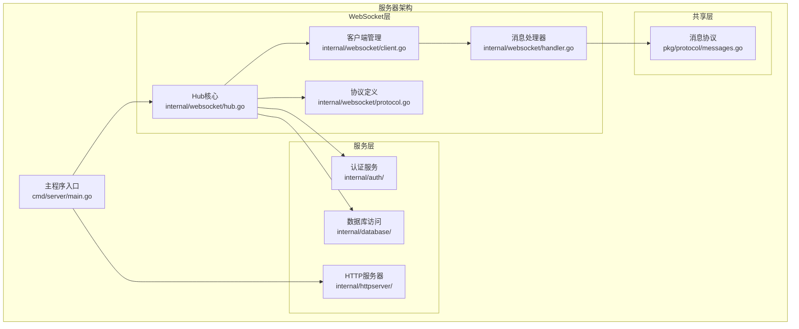

**图表来源**
- [main.go:1-146](file://clipSync-server/cmd/server/main.go#L1-L146)
- [hub.go:1-230](file://clipSync-server/internal/websocket/hub.go#L1-L230)

**章节来源**
- [main.go:1-146](file://clipSync-server/cmd/server/main.go#L1-L146)
- [config.go:1-72](file://clipSync-server/internal/config/config.go#L1-L72)

## 核心组件

### Hub核心架构

Hub是WebSocket连接管理的核心组件，负责维护客户端连接池、处理消息广播和连接生命周期管理：

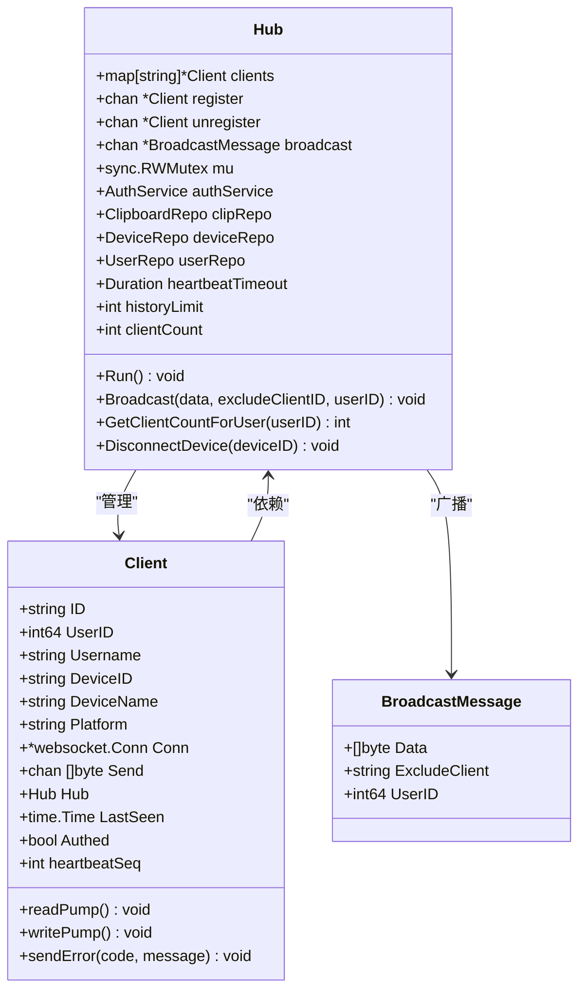

**图表来源**
- [hub.go:18-35](file://clipSync-server/internal/websocket/hub.go#L18-L35)
- [client.go:13-31](file://clipSync-server/internal/websocket/client.go#L13-L31)

### 消息协议体系

系统采用统一的消息协议格式，支持多种消息类型和负载结构：

| 消息类型 | 方向 | 描述 | 负载结构 |
|---------|------|------|----------|
| auth | C→S | 客户端认证 | AuthPayload |
| auth_response | S→C | 认证响应 | AuthResponsePayload |
| heartbeat | C→S | 心跳检测 | HeartbeatPayload |
| heartbeat_ack | S→C | 心跳确认 | HeartbeatPayload |
| clipboard_push | C→S | 剪贴板推送 | ClipboardPushPayload |
| clipboard_sync | S→C | 剪贴板同步 | ClipboardSyncPayload |
| clipboard_pull | C→S | 剪贴板拉取 | ClipboardPullPayload |
| clipboard_history | S→C | 历史记录 | ClipboardHistoryPayload |
| device_list | C→S | 设备列表请求 | 无负载 |
| device_list_response | S→C | 设备列表响应 | DeviceListPayload |
| device_unregister | C→S | 设备注销 | DeviceUnregisterPayload |
| error | S→C | 错误通知 | ErrorPayload |

**章节来源**
- [messages.go:1-132](file://clipSync-server/pkg/protocol/messages.go#L1-L132)
- [handler.go:10-31](file://clipSync-server/internal/websocket/handler.go#L10-L31)

## 架构概览

WebSocket Hub采用事件驱动的架构模式，通过select语句实现非阻塞的消息处理：

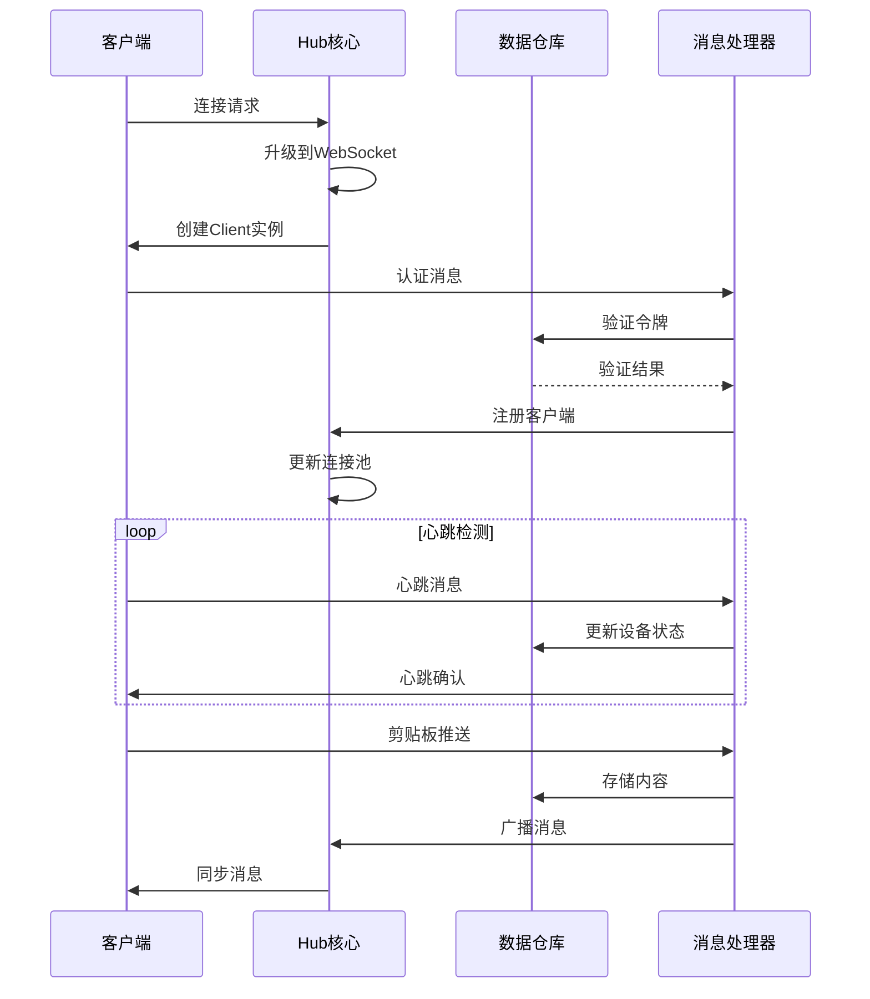

**图表来源**
- [hub.go:61-112](file://clipSync-server/internal/websocket/hub.go#L61-L112)
- [handler.go:33-110](file://clipSync-server/internal/websocket/handler.go#L33-L110)

## 详细组件分析

### Hub连接管理

Hub通过三个主要通道实现连接生命周期管理：

#### 连接注册流程

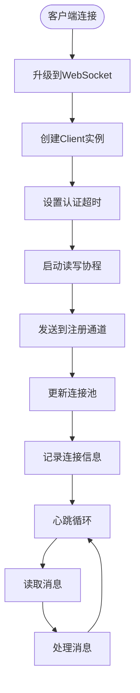

**图表来源**
- [hub.go:181-208](file://clipSync-server/internal/websocket/hub.go#L181-L208)
- [client.go:33-67](file://clipSync-server/internal/websocket/client.go#L33-L67)

#### 连接注销流程

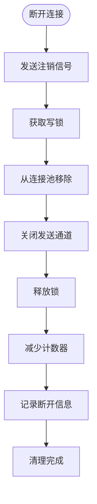

**图表来源**
- [hub.go:71-79](file://clipSync-server/internal/websocket/hub.go#L71-L79)

**章节来源**
- [hub.go:61-112](file://clipSync-server/internal/websocket/hub.go#L61-L112)

### 消息广播机制

Hub实现了高效的广播机制，支持按用户过滤和排除特定客户端：

#### 广播算法流程

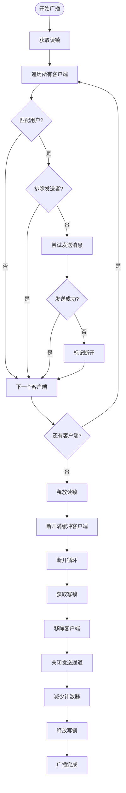

**图表来源**
- [hub.go:81-110](file://clipSync-server/internal/websocket/hub.go#L81-L110)

**章节来源**
- [hub.go:81-121](file://clipSync-server/internal/websocket/hub.go#L81-L121)

### 心跳检测与超时处理

系统实现了双重心跳机制，确保连接的稳定性和及时发现异常：

#### 心跳处理流程

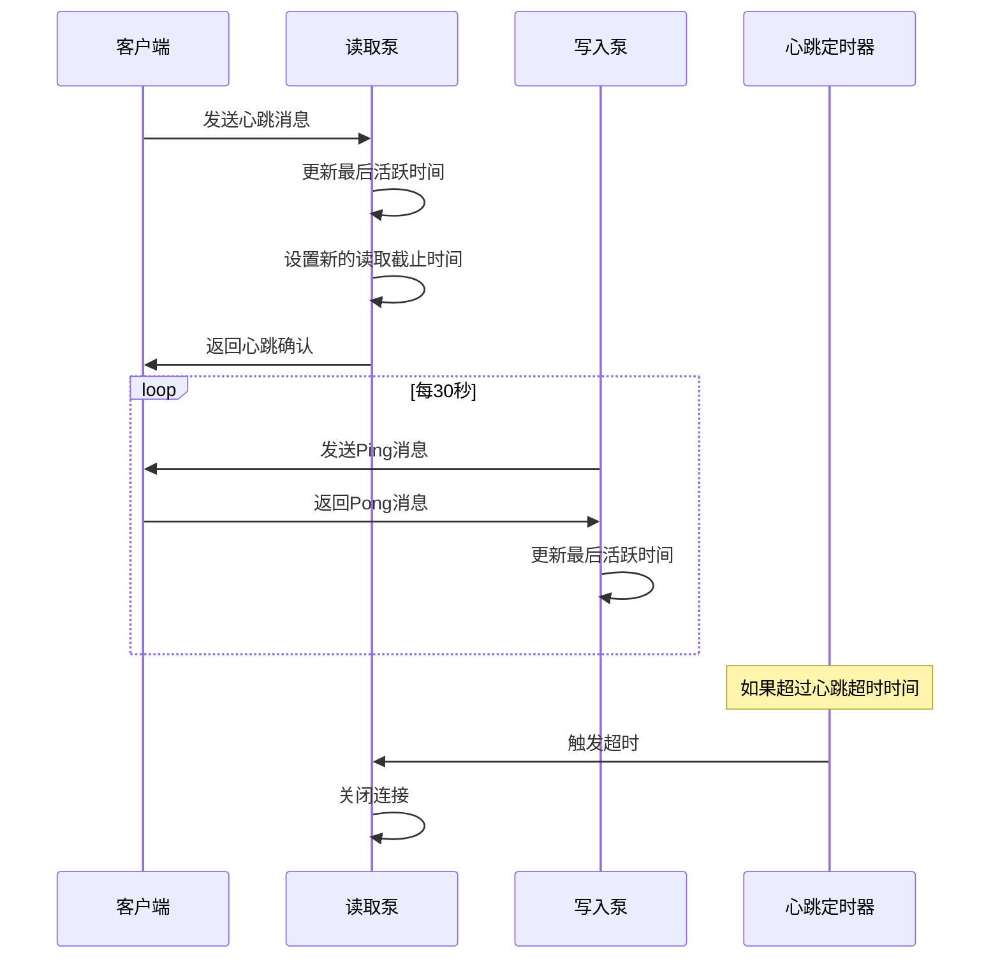

**图表来源**
- [client.go:33-67](file://clipSync-server/internal/websocket/client.go#L33-L67)
- [client.go:69-117](file://clipSync-server/internal/websocket/client.go#L69-L117)

**章节来源**
- [client.go:33-117](file://clipSync-server/internal/websocket/client.go#L33-L117)

### 消息处理管道

Hub根据消息类型调用相应的处理器，每个处理器负责特定业务逻辑：

#### 消息路由流程

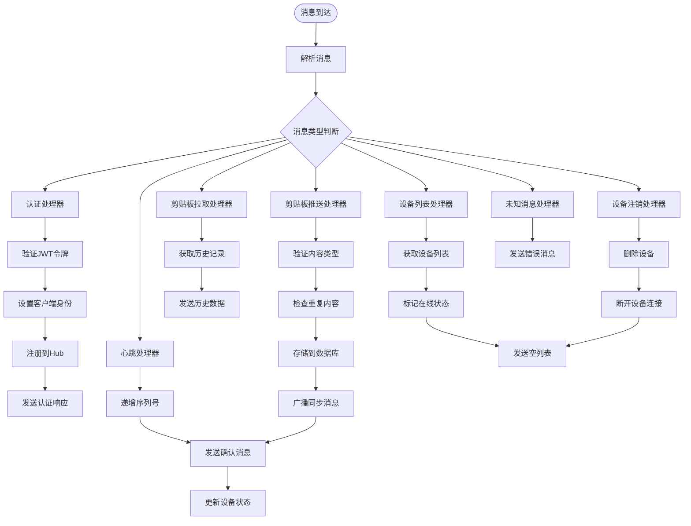

**图表来源**
- [handler.go:10-31](file://clipSync-server/internal/websocket/handler.go#L10-L31)
- [handler.go:33-110](file://clipSync-server/internal/websocket/handler.go#L33-L110)

**章节来源**
- [handler.go:10-392](file://clipSync-server/internal/websocket/handler.go#L10-L392)

## 依赖关系分析

### 组件依赖图

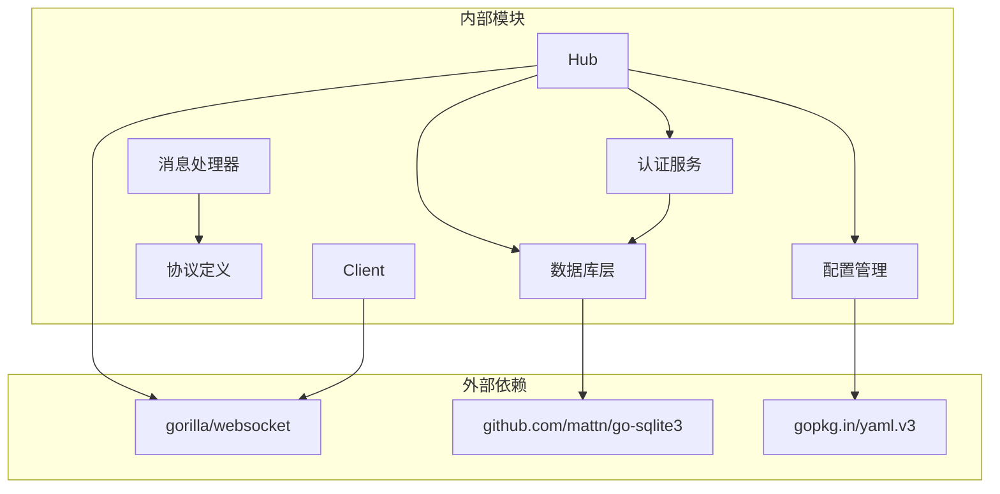

**图表来源**
- [hub.go:3-16](file://clipSync-server/internal/websocket/hub.go#L3-L16)
- [main.go:3-17](file://clipSync-server/cmd/server/main.go#L3-L17)

### 数据流依赖

系统采用分层架构，各层之间通过清晰的接口进行交互：

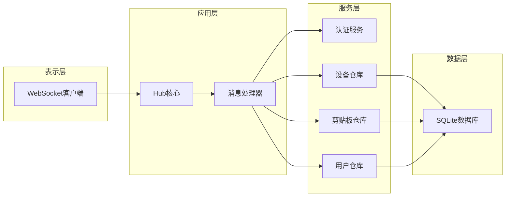

**图表来源**
- [main.go:56-68](file://clipSync-server/cmd/server/main.go#L56-L68)
- [hub.go:26-29](file://clipSync-server/internal/websocket/hub.go#L26-L29)

**章节来源**
- [main.go:56-109](file://clipSync-server/cmd/server/main.go#L56-L109)

## 性能考虑

### 并发安全机制

系统采用读写锁分离的设计，优化读多写少的场景：

| 组件 | 锁类型 | 使用场景 | 性能影响 |
|------|--------|----------|----------|
| 客户端连接池 | RWMutex | 读取客户端列表、统计连接数 | 读操作无阻塞，写操作独占 |
| 连接计数器 | RWMutex | 增减连接数量 | 读操作快速，写操作轻量 |
| 广播操作 | 先读锁后写锁 | 广播消息到多个客户端 | 避免死锁，提高并发性能 |

### 内存优化策略

#### 缓冲区管理

系统为每个客户端维护独立的发送缓冲区，采用固定大小的有缓冲通道：

- **客户端发送缓冲区**: 256个字节消息
- **广播通道缓冲区**: 256个广播消息
- **自动清理机制**: 当缓冲区满时自动断开客户端连接

#### 连接池优化

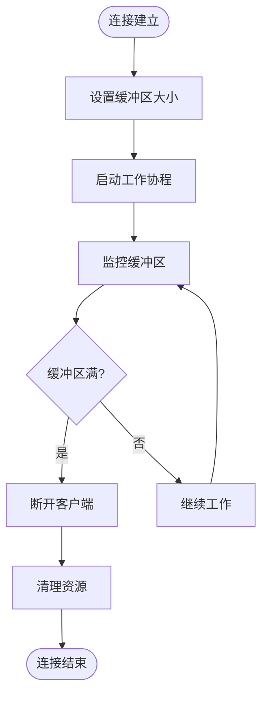

**图表来源**
- [hub.go:192](file://clipSync-server/internal/websocket/hub.go#L192)
- [client.go:78-104](file://clipSync-server/internal/websocket/client.go#L78-L104)

### 数据库性能优化

#### SQLite配置优化

系统针对2核2G服务器进行了专门的数据库优化：

- **连接池配置**: 最大4个连接，2个空闲连接
- **WAL模式**: 改善并发读取性能
- **缓存设置**: 2MB页面缓存，内存临时表
- **同步模式**: NORMAL模式平衡性能和安全性

**章节来源**
- [db.go:17-56](file://clipSync-server/internal/database/db.go#L17-L56)

### WebSocket性能特性

#### 连接参数优化

- **读写缓冲区**: 4096字节
- **消息大小限制**: 1MB（支持图片和文件）
- **认证超时**: 30秒（防止资源浪费）
- **心跳间隔**: 30秒（平衡保活和性能）

**章节来源**
- [protocol.go:10-18](file://clipSync-server/internal/websocket/protocol.go#L10-L18)
- [client.go:40](file://clipSync-server/internal/websocket/client.go#L40)

## 故障排除指南

### 常见错误类型及处理

#### 认证相关错误

| 错误代码 | 描述 | 处理建议 |
|----------|------|----------|
| AUTH_TIMEOUT | 客户端在30秒内未完成认证 | 检查客户端认证流程，网络延迟问题 |
| AUTH_FAILED | 令牌无效或过期 | 验证JWT密钥，检查令牌有效期 |
| TOKEN_EXPIRED | 认证头格式不正确 | 确认Bearer前缀，检查令牌格式 |

#### 消息处理错误

| 错误代码 | 描述 | 处理建议 |
|----------|------|----------|
| INVALID_PAYLOAD | 消息格式不正确 | 检查消息序列化，验证协议版本 |
| DUPLICATE_CONTENT | 内容重复 | 检查去重逻辑，验证校验和计算 |
| INTERNAL_ERROR | 服务器内部错误 | 查看数据库日志，检查资源可用性 |

#### 连接管理错误

| 错误代码 | 描述 | 处理建议 |
|----------|------|----------|
| RATE_LIMITED | 请求频率过高 | 实现指数退避重试，增加限流配置 |
| DEVICE_NOT_FOUND | 设备不存在 | 检查设备ID，验证用户权限 |
| CONTENT_TOO_LARGE | 内容超过大小限制 | 优化大文件传输，使用分块上传 |

### 调试和监控

#### 日志记录策略

系统在关键节点记录详细日志，便于问题诊断：

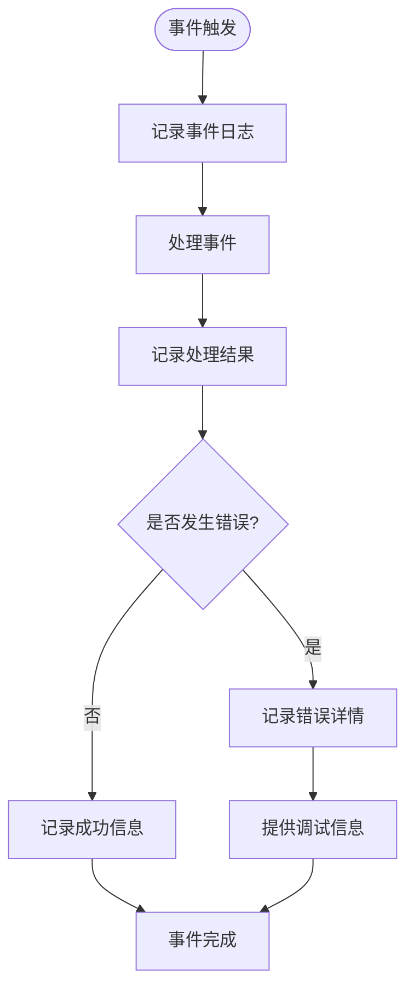

**图表来源**
- [hub.go:69](file://clipSync-server/internal/websocket/hub.go#L69)
- [client.go:51](file://clipSync-server/internal/websocket/client.go#L51)

**章节来源**
- [hub.go:216-229](file://clipSync-server/internal/websocket/hub.go#L216-L229)
- [handler.go:28-30](file://clipSync-server/internal/websocket/handler.go#L28-L30)

### 性能监控指标

#### 关键性能指标

| 指标名称 | 监控方法 | 告警阈值 |
|----------|----------|----------|
| 连接数 | Hub.ClientCount() | > 1000 |
| 广播延迟 | 消息发送时间 | > 100ms |
| 缓冲区满率 | 发送失败次数 | > 1% |
| 数据库连接数 | SQLite连接数 | > 80% |
| CPU使用率 | 系统监控 | > 80% |
| 内存使用 | 系统监控 | > 500MB |

**章节来源**
- [hub.go:136-153](file://clipSync-server/internal/websocket/hub.go#L136-L153)

## 结论

ClipSync的WebSocket Hub实现展现了优秀的并发设计和工程实践：

### 技术优势

1. **高效的并发模型**: 采用select语句和goroutine实现非阻塞处理
2. **完善的错误处理**: 全面的错误类型定义和优雅降级机制
3. **内存友好的设计**: 固定大小缓冲区和自动清理机制
4. **可扩展的架构**: 清晰的模块划分和接口设计

### 架构特点

- **事件驱动**: 基于通道的消息传递机制
- **分层设计**: 明确的职责分离和依赖控制
- **并发安全**: 适当的锁策略和原子操作
- **性能优化**: 针对特定硬件环境的数据库配置

### 应用价值

该实现为跨平台实时通信提供了可靠的基础设施，支持：
- 多平台剪贴板同步
- 实时状态通知
- 可扩展的消息协议
- 生产级别的稳定性保证

通过合理的配置和监控，该系统能够在2核2G的云服务器上稳定运行，满足中小规模应用的需求。