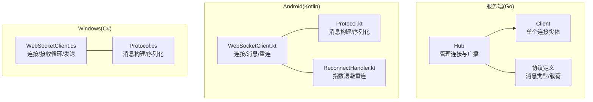
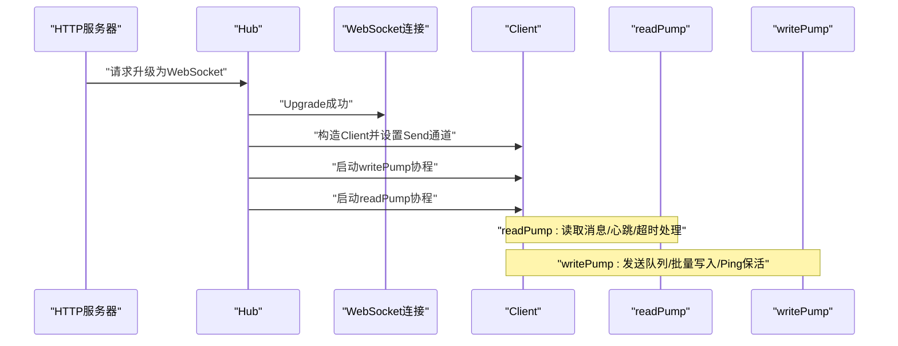
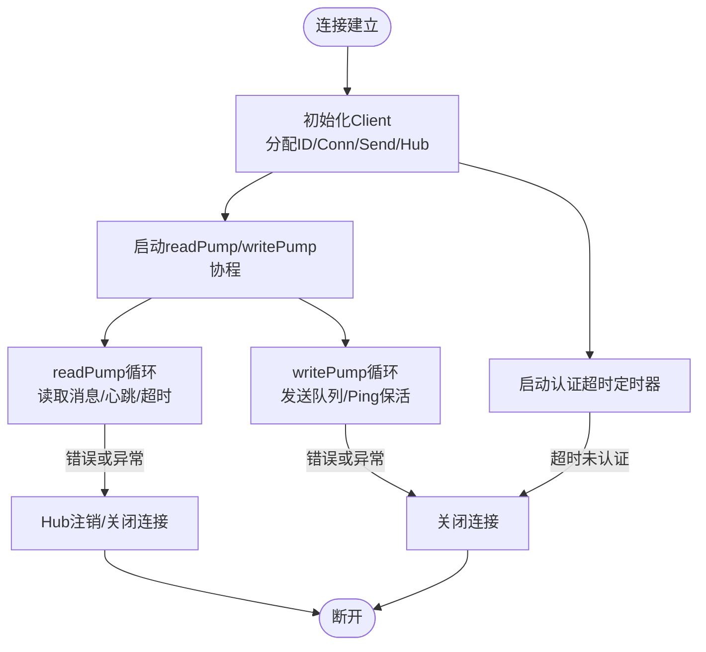
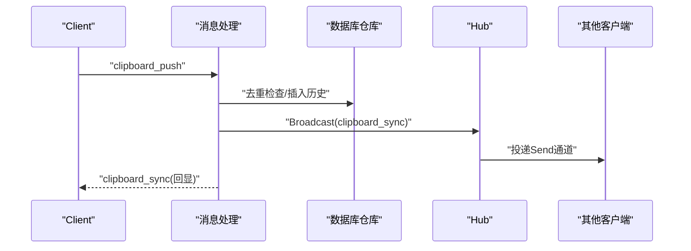
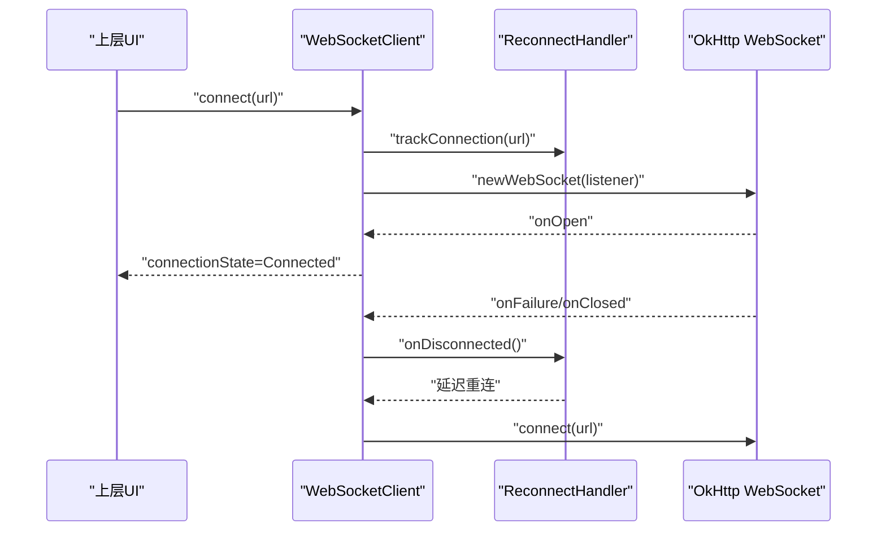
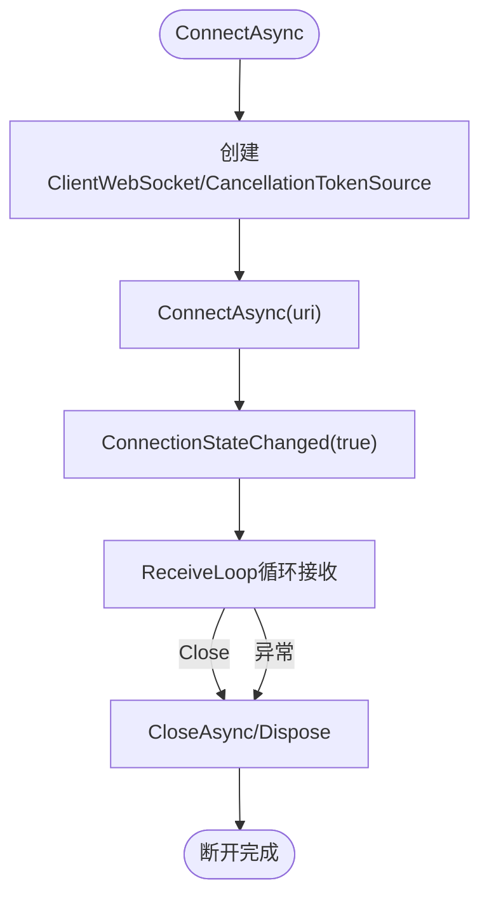
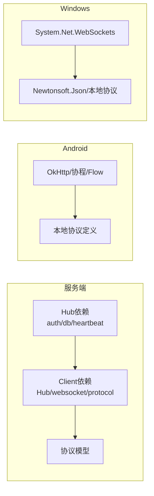

# 客户端生命周期

<cite>
**本文引用的文件**
- [clipSync-server/internal/websocket/client.go](file://clipSync-server/internal/websocket/client.go)
- [clipSync-server/internal/websocket/hub.go](file://clipSync-server/internal/websocket/hub.go)
- [clipSync-server/internal/websocket/handler.go](file://clipSync-server/internal/websocket/handler.go)
- [clipSync-server/internal/websocket/protocol.go](file://clipSync-server/internal/websocket/protocol.go)
- [clipSync-server/pkg/protocol/messages.go](file://clipSync-server/pkg/protocol/messages.go)
- [clipSync-server/cmd/server/main.go](file://clipSync-server/cmd/server/main.go)
- [clipSync-android/app/src/main/java/com/clipsync/app/network/WebSocketClient.kt](file://clipSync-android/app/src/main/java/com/clipsync/app/network/WebSocketClient.kt)
- [clipSync-android/app/src/main/java/com/clipsync/app/network/Protocol.kt](file://clipSync-android/app/src/main/java/com/clipsync/app/network/Protocol.kt)
- [clipSync-android/app/src/main/java/com/clipsync/app/network/ReconnectHandler.kt](file://clipSync-android/app/src/main/java/com/clipsync/app/network/ReconnectHandler.kt)
- [clipSync-windows/ClipSync.WPF/Network/WebSocketClient.cs](file://clipSync-windows/ClipSync.WPF/Network/WebSocketClient.cs)
- [clipSync-windows/ClipSync.WPF/Network/Protocol.cs](file://clipSync-windows/ClipSync.WPF/Network/Protocol.cs)
</cite>

## 目录
1. [简介](#简介)
2. [项目结构](#项目结构)
3. [核心组件](#核心组件)
4. [架构总览](#架构总览)
5. [详细组件分析](#详细组件分析)
6. [依赖关系分析](#依赖关系分析)
7. [性能考量](#性能考量)
8. [故障排查指南](#故障排查指南)
9. [结论](#结论)
10. [附录](#附录)

## 简介
本文件系统性阐述ClipSync项目的WebSocket客户端生命周期管理，覆盖从连接建立、认证、心跳保活、消息收发、广播分发，到断开与优雅关闭的完整流程。重点解析服务端readPump与writePump协程（Go）以及Android与Windows客户端的消息循环与重连机制，并给出并发控制、错误传播与资源释放策略，帮助开发者在不同平台实现稳定可靠的实时通信。

## 项目结构
本仓库包含三个平台的实现：
- 服务端：Go语言实现的WebSocket Hub与客户端管理
- Android：Kotlin实现的OkHttp WebSocket客户端
- Windows：C#实现的System.Net.WebSockets客户端

图表来源
- [clipSync-server/internal/websocket/hub.go:18-58](file://clipSync-server/internal/websocket/hub.go#L18-L58)
- [clipSync-server/internal/websocket/client.go:14-31](file://clipSync-server/internal/websocket/client.go#L14-L31)
- [clipSync-server/pkg/protocol/messages.go:5-132](file://clipSync-server/pkg/protocol/messages.go#L5-L132)
- [clipSync-android/app/src/main/java/com/clipsync/app/network/WebSocketClient.kt:26-145](file://clipSync-android/app/src/main/java/com/clipsync/app/network/WebSocketClient.kt#L26-L145)
- [clipSync-android/app/src/main/java/com/clipsync/app/network/Protocol.kt:20-263](file://clipSync-android/app/src/main/java/com/clipsync/app/network/Protocol.kt#L20-L263)
- [clipSync-android/app/src/main/java/com/clipsync/app/network/ReconnectHandler.kt:14-80](file://clipSync-android/app/src/main/java/com/clipsync/app/network/ReconnectHandler.kt#L14-L80)
- [clipSync-windows/ClipSync.WPF/Network/WebSocketClient.cs:10-146](file://clipSync-windows/ClipSync.WPF/Network/WebSocketClient.cs#L10-L146)
- [clipSync-windows/ClipSync.WPF/Network/Protocol.cs:8-167](file://clipSync-windows/ClipSync.WPF/Network/Protocol.cs#L8-L167)

章节来源
- [clipSync-server/cmd/server/main.go:67-125](file://clipSync-server/cmd/server/main.go#L67-L125)
- [clipSync-server/internal/websocket/hub.go:18-58](file://clipSync-server/internal/websocket/hub.go#L18-L58)

## 核心组件
- 服务端Hub：维护所有客户端连接、注册/注销、广播、计数统计与设备在线状态查询。
- 服务端Client：封装单个WebSocket连接，包含读写泵协程、认证定时器、心跳定时器、发送通道与互斥保护。
- 协议模型：统一的消息包结构与各消息类型的载荷定义。
- Android客户端：基于OkHttp的WebSocket客户端，提供连接状态流、消息流、重连与发送能力。
- Windows客户端：基于System.Net.WebSockets的WebSocket客户端，提供连接、接收循环、发送与资源释放。

章节来源
- [clipSync-server/internal/websocket/hub.go:18-58](file://clipSync-server/internal/websocket/hub.go#L18-L58)
- [clipSync-server/internal/websocket/client.go:14-31](file://clipSync-server/internal/websocket/client.go#L14-L31)
- [clipSync-server/pkg/protocol/messages.go:5-132](file://clipSync-server/pkg/protocol/messages.go#L5-L132)
- [clipSync-android/app/src/main/java/com/clipsync/app/network/WebSocketClient.kt:26-145](file://clipSync-android/app/src/main/java/com/clipsync/app/network/WebSocketClient.kt#L26-L145)
- [clipSync-windows/ClipSync.WPF/Network/WebSocketClient.cs:10-146](file://clipSync-windows/ClipSync.WPF/Network/WebSocketClient.cs#L10-L146)

## 架构总览
服务端通过HTTP升级为WebSocket，创建Client并启动readPump与writePump两个协程；客户端负责认证、心跳、消息收发与重连。Hub作为中心枢纽，负责广播与客户端生命周期管理。

图表来源
- [clipSync-server/internal/websocket/hub.go:181-208](file://clipSync-server/internal/websocket/hub.go#L181-L208)
- [clipSync-server/internal/websocket/client.go:33-117](file://clipSync-server/internal/websocket/client.go#L33-L117)

章节来源
- [clipSync-server/internal/websocket/hub.go:181-208](file://clipSync-server/internal/websocket/hub.go#L181-L208)
- [clipSync-server/internal/websocket/client.go:33-117](file://clipSync-server/internal/websocket/client.go#L33-L117)

## 详细组件分析

### 服务端Client生命周期与协程模型
- 初始化：Hub创建Client，分配唯一ID、WebSocket连接、发送通道与Hub引用。
- 认证超时：启动30秒认证超时定时器，未认证则发送错误并断开。
- readPump：设置读限制与读超时，注册Pong处理器刷新超时；解析消息后调用消息路由处理。
- writePump：周期性Ping保活；从Send通道读取消息，使用NextWriter批量写入；支持默认错误回传。
- 注销：readPump退出时触发Hub注销，关闭连接并关闭Send通道。

图表来源
- [clipSync-server/internal/websocket/hub.go:189-208](file://clipSync-server/internal/websocket/hub.go#L189-L208)
- [clipSync-server/internal/websocket/client.go:33-117](file://clipSync-server/internal/websocket/client.go#L33-L117)

章节来源
- [clipSync-server/internal/websocket/client.go:14-150](file://clipSync-server/internal/websocket/client.go#L14-L150)
- [clipSync-server/internal/websocket/handler.go:10-31](file://clipSync-server/internal/websocket/handler.go#L10-L31)

### 服务端消息处理与广播
- 消息路由：根据消息类型分派至认证、心跳、剪贴板推送/拉取、设备列表、设备注销等处理函数。
- 认证：校验JWT令牌，填充用户与设备信息，停止认证超时，向Hub注册并返回认证结果。
- 心跳：更新序列号并返回ACK，同时更新设备最后在线时间。
- 剪贴板推送：去重校验、入库存储、构造同步消息并广播给同用户其他设备，同时回显确认。
- 剪贴板拉取：按用户历史记录返回分页数据。
- 设备列表：返回用户设备清单并标记在线状态。
- 设备注销：删除设备并断开其已连接的其他实例。

图表来源
- [clipSync-server/internal/websocket/handler.go:142-234](file://clipSync-server/internal/websocket/handler.go#L142-L234)
- [clipSync-server/internal/websocket/hub.go:81-111](file://clipSync-server/internal/websocket/hub.go#L81-L111)

章节来源
- [clipSync-server/internal/websocket/handler.go:33-392](file://clipSync-server/internal/websocket/handler.go#L33-L392)

### 协议模型与消息类型
- 统一消息包：包含type、version、timestamp、可选device_id与payload。
- 常见消息类型：auth、auth_response、heartbeat、heartbeat_ack、clipboard_push、clipboard_sync、clipboard_pull、clipboard_history、device_list、device_list_response、device_unregister、error、ping、pong。
- 载荷定义：认证、心跳、剪贴板、设备、错误等专用载荷。

章节来源
- [clipSync-server/pkg/protocol/messages.go:5-132](file://clipSync-server/pkg/protocol/messages.go#L5-L132)

### Android客户端生命周期与重连
- 连接：创建OkHttpClient，配置ping间隔与超时，发起WebSocket连接，回调onOpen/onFailure/onClosed。
- 状态：使用StateFlow表示连接状态（Connected/Connecting/Disconnected/Error），通过ReconnectHandler进行指数退避重连。
- 消息：收到文本或二进制消息后转为字符串并通过SharedFlow发出；发送消息前检查连接状态。
- 断开：主动关闭时清理重连任务、关闭WebSocket并置空引用，确保状态回到Disconnected。

图表来源
- [clipSync-android/app/src/main/java/com/clipsync/app/network/WebSocketClient.kt:83-103](file://clipSync-android/app/src/main/java/com/clipsync/app/network/WebSocketClient.kt#L83-L103)
- [clipSync-android/app/src/main/java/com/clipsync/app/network/ReconnectHandler.kt:37-53](file://clipSync-android/app/src/main/java/com/clipsync/app/network/ReconnectHandler.kt#L37-L53)

章节来源
- [clipSync-android/app/src/main/java/com/clipsync/app/network/WebSocketClient.kt:26-145](file://clipSync-android/app/src/main/java/com/clipsync/app/network/WebSocketClient.kt#L26-L145)
- [clipSync-android/app/src/main/java/com/clipsync/app/network/ReconnectHandler.kt:14-80](file://clipSync-android/app/src/main/java/com/clipsync/app/network/ReconnectHandler.kt#L14-L80)

### Windows客户端生命周期与接收循环
- 连接：创建ClientWebSocket，异步ConnectAsync，触发连接状态事件；启动接收循环Task。
- 接收：循环接收消息片段，拼接完整消息，限制最大消息大小，处理Close消息并结束循环。
- 发送：UTF-8编码后发送Text消息；失败视为连接丢失。
- 断开：取消接收CancellationToken，正常关闭后Dispose资源，触发断开事件。

图表来源
- [clipSync-windows/ClipSync.WPF/Network/WebSocketClient.cs:22-62](file://clipSync-windows/ClipSync.WPF/Network/WebSocketClient.cs#L22-L62)
- [clipSync-windows/ClipSync.WPF/Network/WebSocketClient.cs:83-136](file://clipSync-windows/ClipSync.WPF/Network/WebSocketClient.cs#L83-L136)

章节来源
- [clipSync-windows/ClipSync.WPF/Network/WebSocketClient.cs:10-146](file://clipSync-windows/ClipSync.WPF/Network/WebSocketClient.cs#L10-L146)

## 依赖关系分析
- 服务端
  - Hub依赖认证服务、数据库仓库与心跳超时配置。
  - Client依赖Hub、gorilla/websocket与协议模型。
  - 协议模型独立于具体实现，被Hub与Client共同使用。
- 客户端
  - Android：依赖OkHttp、协程与Flow；协议定义在本地Kotlin模块。
  - Windows：依赖System.Net.WebSockets与Newtonsoft.Json；协议定义在本地C#类。

图表来源
- [clipSync-server/internal/websocket/hub.go:26-57](file://clipSync-server/internal/websocket/hub.go#L26-L57)
- [clipSync-server/internal/websocket/client.go:3-11](file://clipSync-server/internal/websocket/client.go#L3-L11)
- [clipSync-android/app/src/main/java/com/clipsync/app/network/WebSocketClient.kt:14-21](file://clipSync-android/app/src/main/java/com/clipsync/app/network/WebSocketClient.kt#L14-L21)
- [clipSync-windows/ClipSync.WPF/Network/WebSocketClient.cs:3-6](file://clipSync-windows/ClipSync.WPF/Network/WebSocketClient.cs#L3-L6)

章节来源
- [clipSync-server/internal/websocket/hub.go:26-57](file://clipSync-server/internal/websocket/hub.go#L26-L57)
- [clipSync-server/internal/websocket/client.go:3-11](file://clipSync-server/internal/websocket/client.go#L3-L11)
- [clipSync-android/app/src/main/java/com/clipsync/app/network/WebSocketClient.kt:14-21](file://clipSync-android/app/src/main/java/com/clipsync/app/network/WebSocketClient.kt#L14-L21)
- [clipSync-windows/ClipSync.WPF/Network/WebSocketClient.cs:3-6](file://clipSync-windows/ClipSync.WPF/Network/WebSocketClient.cs#L3-L6)

## 性能考量
- 服务端
  - 发送通道缓冲：Client的Send通道容量为256，Hub在广播时对满缓冲的客户端进行断开，避免内存膨胀。
  - 批量写入：writePump在一次NextWriter中尽可能写入剩余待发消息，减少系统调用次数。
  - 读超时与Pong：readPump设置读超时并在收到Pong时刷新，防止僵尸连接占用资源。
  - 心跳保活：writePump每30秒发送Ping，readPump响应Pong刷新超时，维持长连接活性。
- 客户端
  - Android：SharedFlow带缓冲，避免阻塞发送；ReconnectHandler指数退避，降低服务器压力。
  - Windows：限制最大消息大小，防止内存溢出；接收循环按片段拼接，避免一次性大块内存分配。

章节来源
- [clipSync-server/internal/websocket/hub.go:81-111](file://clipSync-server/internal/websocket/hub.go#L81-L111)
- [clipSync-server/internal/websocket/client.go:69-117](file://clipSync-server/internal/websocket/client.go#L69-L117)
- [clipSync-android/app/src/main/java/com/clipsync/app/network/WebSocketClient.kt:33-34](file://clipSync-android/app/src/main/java/com/clipsync/app/network/WebSocketClient.kt#L33-L34)
- [clipSync-android/app/src/main/java/com/clipsync/app/network/ReconnectHandler.kt:14-80](file://clipSync-android/app/src/main/java/com/clipsync/app/network/ReconnectHandler.kt#L14-L80)
- [clipSync-windows/ClipSync.WPF/Network/WebSocketClient.cs:15-15](file://clipSync-windows/ClipSync.WPF/Network/WebSocketClient.cs#L15-L15)

## 故障排查指南
- 服务端
  - 认证超时：若30秒内未收到认证消息，将发送错误并断开连接。
  - 读取错误：UnexpectedCloseError会记录日志；readPump退出触发注销与关闭。
  - 广播丢弃：当客户端Send通道满时，Hub会断开该客户端以保护系统稳定性。
  - 写入错误：writePump遇到错误直接返回并关闭连接。
- 客户端
  - Android：onFailure/onClosed会触发重连；检查连接状态与重连任务是否仍在运行。
  - Windows：接收循环捕获异常并最终触发断开事件；注意取消令牌与资源释放顺序。

章节来源
- [clipSync-server/internal/websocket/hub.go:197-204](file://clipSync-server/internal/websocket/hub.go#L197-L204)
- [clipSync-server/internal/websocket/client.go:47-66](file://clipSync-server/internal/websocket/client.go#L47-L66)
- [clipSync-server/internal/websocket/hub.go:94-109](file://clipSync-server/internal/websocket/hub.go#L94-L109)
- [clipSync-android/app/src/main/java/com/clipsync/app/network/WebSocketClient.kt:73-77](file://clipSync-android/app/src/main/java/com/clipsync/app/network/WebSocketClient.kt#L73-L77)
- [clipSync-windows/ClipSync.WPF/Network/WebSocketClient.cs:124-135](file://clipSync-windows/ClipSync.WPF/Network/WebSocketClient.cs#L124-L135)

## 结论
本项目在服务端采用Hub+Client的清晰架构，结合readPump/writePump协程实现高可靠的消息收发与保活；在客户端层面，Android与Windows分别提供了稳健的连接管理、消息流与重连策略。通过严格的超时与背压处理、批量写入与指数退避重连，系统在复杂网络环境下仍能保持稳定与高性能。

## 附录
- 服务端入口与端口配置：WebSocket服务器独立端口启动，HTTP与WS分离，便于运维与扩展。
- 协议版本：消息包包含version字段，便于未来演进与兼容性管理。

章节来源
- [clipSync-server/cmd/server/main.go:108-125](file://clipSync-server/cmd/server/main.go#L108-L125)
- [clipSync-server/pkg/protocol/messages.go:125-132](file://clipSync-server/pkg/protocol/messages.go#L125-L132)