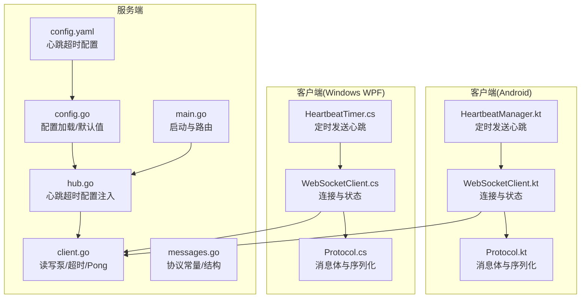
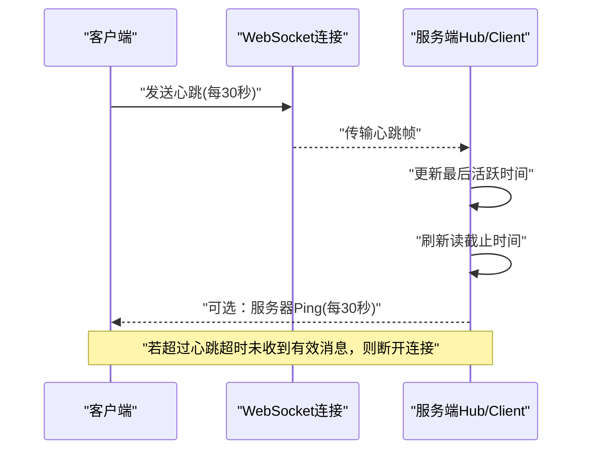
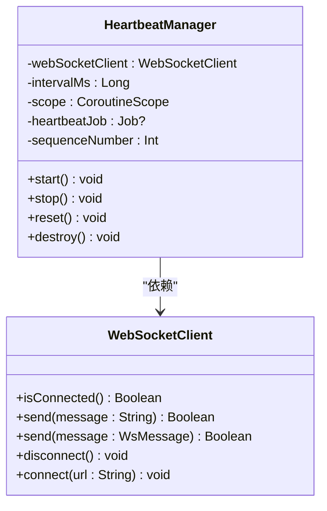
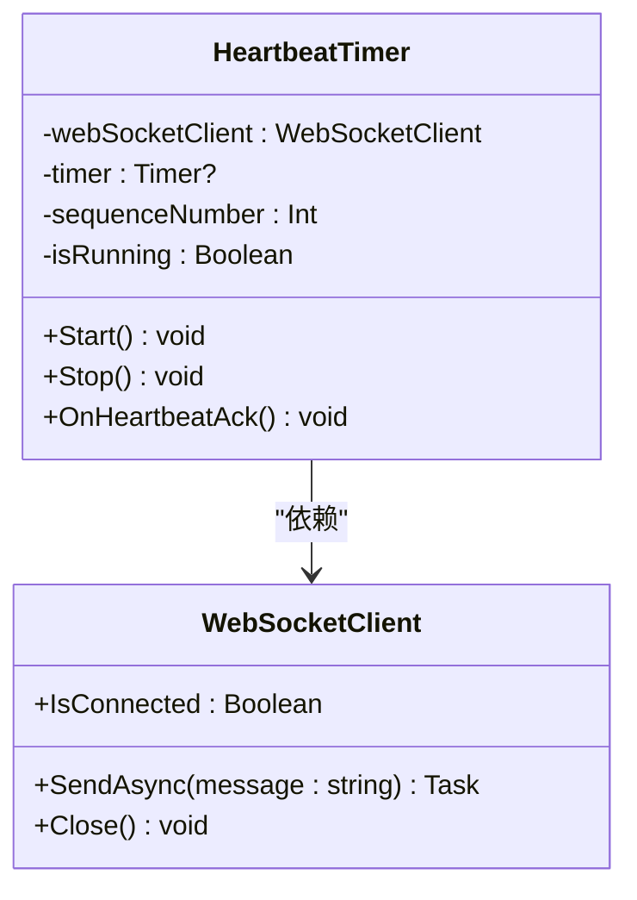
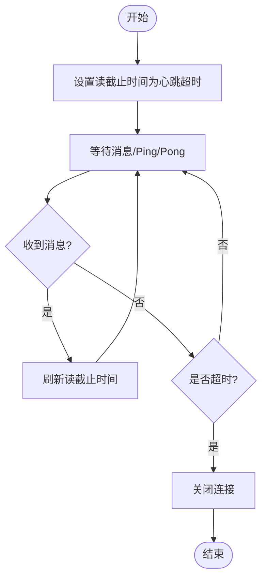
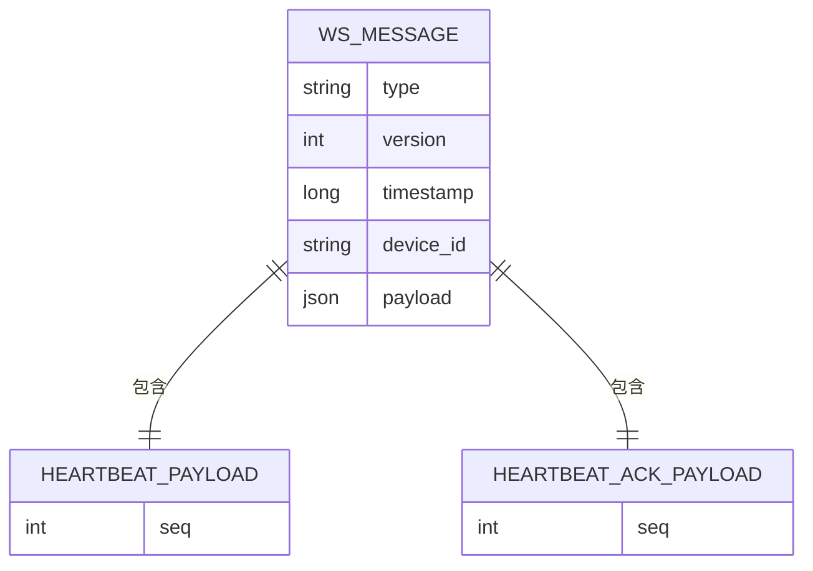
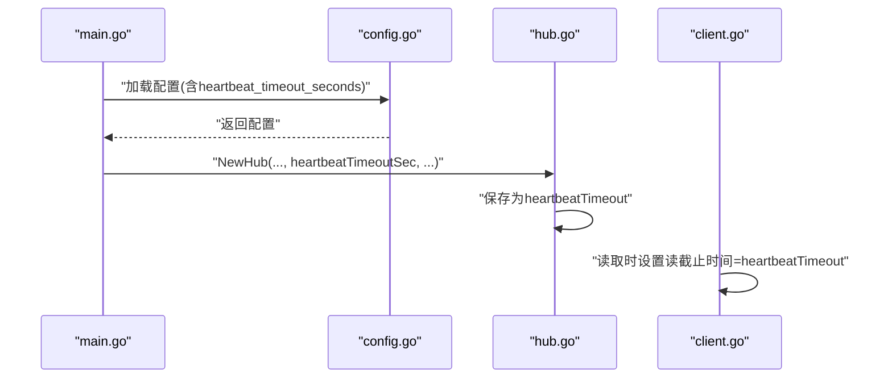
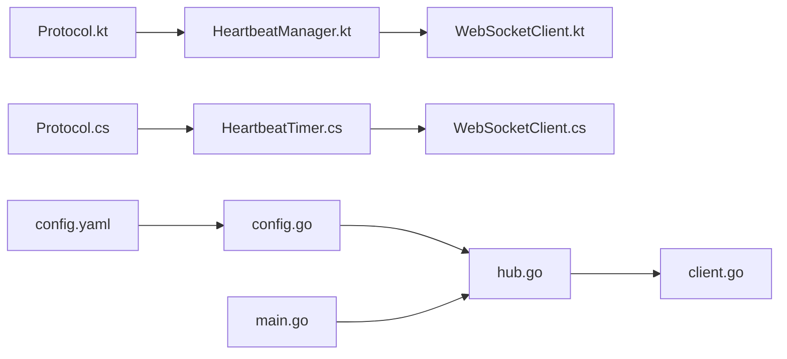

# 心跳检测

<cite>
**本文引用的文件**
- [HeartbeatManager.kt](file://clipSync-android/app/src/main/java/com/clipsync/app/network/HeartbeatManager.kt)
- [WebSocketClient.kt](file://clipSync-android/app/src/main/java/com/clipsync/app/network/WebSocketClient.kt)
- [Protocol.kt](file://clipSync-android/app/src/main/java/com/clipsync/app/network/Protocol.kt)
- [client.go](file://clipSync-server/internal/websocket/client.go)
- [hub.go](file://clipSync-server/internal/websocket/hub.go)
- [messages.go](file://clipSync-server/pkg/protocol/messages.go)
- [HeartbeatTimer.cs](file://clipSync-windows/ClipSync.WPF/Network/HeartbeatTimer.cs)
- [Protocol.cs](file://clipSync-windows/ClipSync.WPF/Network/Protocol.cs)
- [config.yaml](file://clipSync-server/configs/config.yaml)
- [config.go](file://clipSync-server/internal/config/config.go)
- [main.go](file://clipSync-server/cmd/server/main.go)
</cite>

## 目录
1. [简介](#简介)
2. [项目结构](#项目结构)
3. [核心组件](#核心组件)
4. [架构总览](#架构总览)
5. [详细组件分析](#详细组件分析)
6. [依赖关系分析](#依赖关系分析)
7. [性能考量](#性能考量)
8. [故障排查指南](#故障排查指南)
9. [结论](#结论)
10. [附录](#附录)

## 简介
本文件围绕 WebSocket 心跳检测进行系统化说明，覆盖心跳超时机制、活跃状态监控与连接健康检查；详解心跳定时器管理、最后活跃时间记录与超时断开处理；提供来自实际代码库的具体示例，包括心跳包格式、检测间隔设置与异常处理流程；记录心跳统计指标、性能监控与故障诊断方法，并解释网络波动处理、连接恢复与用户体验优化策略。

## 项目结构
本项目在服务端与客户端分别实现了心跳检测与协议支持：
- 客户端（Android）：使用协程定时发送心跳，封装消息体与序列化。
- 客户端（Windows WPF）：使用系统计时器发送心跳，封装消息体与序列化。
- 服务端：基于 Gorilla WebSocket 实现读写泵、读超时与 Pong 处理，结合心跳超时配置进行连接健康检查。

**图表来源**
- [HeartbeatManager.kt:16-75](file://clipSync-android/app/src/main/java/com/clipsync/app/network/HeartbeatManager.kt#L16-L75)
- [WebSocketClient.kt:26-145](file://clipSync-android/app/src/main/java/com/clipsync/app/network/WebSocketClient.kt#L26-L145)
- [Protocol.kt:20-263](file://clipSync-android/app/src/main/java/com/clipsync/app/network/Protocol.kt#L20-L263)
- [client.go:13-150](file://clipSync-server/internal/websocket/client.go#L13-L150)
- [hub.go:18-58](file://clipSync-server/internal/websocket/hub.go#L18-L58)
- [messages.go:5-132](file://clipSync-server/pkg/protocol/messages.go#L5-L132)
- [config.yaml:27-28](file://clipSync-server/configs/config.yaml#L27-L28)
- [config.go:10-72](file://clipSync-server/internal/config/config.go#L10-L72)
- [main.go:68-69](file://clipSync-server/cmd/server/main.go#L68-L69)

**章节来源**
- [HeartbeatManager.kt:16-75](file://clipSync-android/app/src/main/java/com/clipsync/app/network/HeartbeatManager.kt#L16-L75)
- [WebSocketClient.kt:26-145](file://clipSync-android/app/src/main/java/com/clipsync/app/network/WebSocketClient.kt#L26-L145)
- [Protocol.kt:20-263](file://clipSync-android/app/src/main/java/com/clipsync/app/network/Protocol.kt#L20-L263)
- [client.go:13-150](file://clipSync-server/internal/websocket/client.go#L13-L150)
- [hub.go:18-58](file://clipSync-server/internal/websocket/hub.go#L18-L58)
- [messages.go:5-132](file://clipSync-server/pkg/protocol/messages.go#L5-L132)
- [config.yaml:27-28](file://clipSync-server/configs/config.yaml#L27-L28)
- [config.go:10-72](file://clipSync-server/internal/config/config.go#L10-L72)
- [main.go:68-69](file://clipSync-server/cmd/server/main.go#L68-L69)

## 核心组件
- 客户端心跳管理（Android）
  - 定时器：每 30 秒发送一次心跳，使用协程调度与延迟控制。
  - 序列号：自增序号用于匹配请求与响应。
  - 发送失败日志：记录发送失败的心跳序号以便诊断。
  - 生命周期：支持启动、停止、重置与销毁。
- 客户端心跳管理（Windows WPF）
  - 定时器：每 30 秒发送一次心跳，使用系统计时器。
  - 序列号：自增序号用于匹配请求与响应。
  - 异步发送：通过 WebSocketClient 的异步发送接口发送心跳。
- 服务端心跳处理
  - 读超时：根据心跳超时配置设置读截止时间，收到消息后刷新。
  - Pong 处理：注册 Pong 处理函数，收到 Pong 后刷新读截止时间。
  - 写泵心跳：每 30 秒发送一次 Ping，作为服务器主动探测。
  - 超时断开：超过心跳超时未收到有效消息则断开连接。
- 协议与消息
  - Android：WsMessageBuilder.heartbeat 构造心跳消息，包含类型与序号。
  - Windows：Protocol.CreateHeartbeatMessage 构造心跳消息，包含类型与序号。
  - 服务端：messages.go 定义消息类型常量，如 heartbeat、heartbeat_ack、ping、pong。

**章节来源**
- [HeartbeatManager.kt:27-44](file://clipSync-android/app/src/main/java/com/clipsync/app/network/HeartbeatManager.kt#L27-L44)
- [HeartbeatTimer.cs:21-49](file://clipSync-windows/ClipSync.WPF/Network/HeartbeatTimer.cs#L21-L49)
- [client.go:34-67](file://clipSync-server/internal/websocket/client.go#L34-L67)
- [client.go:70-117](file://clipSync-server/internal/websocket/client.go#L70-L117)
- [Protocol.kt:220-225](file://clipSync-android/app/src/main/java/com/clipsync/app/network/Protocol.kt#L220-L225)
- [Protocol.cs:90-97](file://clipSync-windows/ClipSync.WPF/Network/Protocol.cs#L90-L97)
- [messages.go:108-123](file://clipSync-server/pkg/protocol/messages.go#L108-L123)

## 架构总览
下图展示了心跳检测在客户端与服务端之间的交互流程，包括心跳发送、读超时刷新与超时断开。

**图表来源**
- [client.go:40-67](file://clipSync-server/internal/websocket/client.go#L40-L67)
- [client.go:70-117](file://clipSync-server/internal/websocket/client.go#L70-L117)
- [config.yaml:27-28](file://clipSync-server/configs/config.yaml#L27-L28)

**章节来源**
- [client.go:34-67](file://clipSync-server/internal/websocket/client.go#L34-L67)
- [client.go:70-117](file://clipSync-server/internal/websocket/client.go#L70-L117)
- [config.yaml:27-28](file://clipSync-server/configs/config.yaml#L27-L28)

## 详细组件分析

### Android 心跳管理器
- 定时器管理
  - 使用协程 IO 调度器与延迟，循环等待心跳间隔。
  - 在每次心跳前检查连接状态，仅在已连接时发送。
- 序列号与日志
  - 每次发送前递增序列号，记录发送结果（成功/失败）。
- 生命周期
  - 支持停止与销毁，清理协程作用域与作业。

**图表来源**
- [HeartbeatManager.kt:16-75](file://clipSync-android/app/src/main/java/com/clipsync/app/network/HeartbeatManager.kt#L16-L75)
- [WebSocketClient.kt:26-145](file://clipSync-android/app/src/main/java/com/clipsync/app/network/WebSocketClient.kt#L26-L145)

**章节来源**
- [HeartbeatManager.kt:27-44](file://clipSync-android/app/src/main/java/com/clipsync/app/network/HeartbeatManager.kt#L27-L44)
- [HeartbeatManager.kt:50-69](file://clipSync-android/app/src/main/java/com/clipsync/app/network/HeartbeatManager.kt#L50-L69)

### Windows WPF 心跳计时器
- 定时器管理
  - 使用系统计时器，每 30 秒触发一次心跳发送。
  - 仅在连接状态下发送，避免无效发送。
- 序列号与异步发送
  - 自增序列号，调用 WebSocketClient 的异步发送接口。

**图表来源**
- [HeartbeatTimer.cs:7-51](file://clipSync-windows/ClipSync.WPF/Network/HeartbeatTimer.cs#L7-L51)
- [Protocol.cs:90-97](file://clipSync-windows/ClipSync.WPF/Network/Protocol.cs#L90-L97)

**章节来源**
- [HeartbeatTimer.cs:21-49](file://clipSync-windows/ClipSync.WPF/Network/HeartbeatTimer.cs#L21-L49)

### 服务端心跳处理与超时断开
- 读超时与 Pong 处理
  - 设置读限制与读截止时间，收到消息后刷新截止时间。
  - 注册 Pong 处理函数，收到 Pong 后刷新截止时间。
- 写泵心跳
  - 每 30 秒发送一次 Ping，作为服务器主动探测。
- 心跳超时断开
  - 若超过心跳超时未收到有效消息或 Pong，则断开连接。

**图表来源**
- [client.go:40-67](file://clipSync-server/internal/websocket/client.go#L40-L67)
- [client.go:70-117](file://clipSync-server/internal/websocket/client.go#L70-L117)

**章节来源**
- [client.go:34-67](file://clipSync-server/internal/websocket/client.go#L34-L67)
- [client.go:70-117](file://clipSync-server/internal/websocket/client.go#L70-L117)

### 心跳包格式与协议
- Android
  - 类型：heartbeat
  - 载荷字段：seq（整数）
  - 构造方式：WsMessageBuilder.heartbeat(seq)
- Windows WPF
  - 类型：heartbeat
  - 载荷字段：seq（整数）
  - 构造方式：Protocol.CreateHeartbeatMessage(seq)
- 服务端协议常量
  - 心跳类型：TypeHeartbeat
  - 心跳确认类型：TypeHeartbeatAck
  - 服务器 Ping：TypePing
  - 服务器 Pong：TypePong

**图表来源**
- [Protocol.kt:20-52](file://clipSync-android/app/src/main/java/com/clipsync/app/network/Protocol.kt#L20-L52)
- [Protocol.kt:70-78](file://clipSync-android/app/src/main/java/com/clipsync/app/network/Protocol.kt#L70-L78)
- [messages.go:5-132](file://clipSync-server/pkg/protocol/messages.go#L5-L132)

**章节来源**
- [Protocol.kt:220-225](file://clipSync-android/app/src/main/java/com/clipsync/app/network/Protocol.kt#L220-L225)
- [Protocol.cs:90-97](file://clipSync-windows/ClipSync.WPF/Network/Protocol.cs#L90-L97)
- [messages.go:108-123](file://clipSync-server/pkg/protocol/messages.go#L108-L123)

### 心跳超时配置与注入
- 配置项
  - 心跳超时秒数：heartbeat_timeout_seconds，默认 90 秒。
- 加载与默认值
  - 默认配置中 heartbeat_timeout_seconds = 90。
- 注入到 Hub
  - Hub 构造时接收 heartbeatTimeoutSec 并转换为 time.Duration。
- 启动入口
  - main.go 中从配置加载 heartbeat_timeout_seconds 并传入 Hub。

**图表来源**
- [config.yaml:27-28](file://clipSync-server/configs/config.yaml#L27-L28)
- [config.go:24-35](file://clipSync-server/internal/config/config.go#L24-L35)
- [hub.go:45-57](file://clipSync-server/internal/websocket/hub.go#L45-L57)
- [client.go:41](file://clipSync-server/internal/websocket/client.go#L41)
- [main.go:68](file://clipSync-server/cmd/server/main.go#L68)

**章节来源**
- [config.yaml:27-28](file://clipSync-server/configs/config.yaml#L27-L28)
- [config.go:24-35](file://clipSync-server/internal/config/config.go#L24-L35)
- [hub.go:45-57](file://clipSync-server/internal/websocket/hub.go#L45-L57)
- [client.go:41](file://clipSync-server/internal/websocket/client.go#L41)
- [main.go:68](file://clipSync-server/cmd/server/main.go#L68)

## 依赖关系分析
- 客户端依赖
  - Android：HeartbeatManager 依赖 WebSocketClient；WebSocketClient 依赖 OkHttp WebSocket 与连接状态流。
  - Windows：HeartbeatTimer 依赖 WebSocketClient 与 Protocol。
- 服务端依赖
  - Hub 依赖 auth、database、protocol；Client 依赖 gorilla/websocket 与协议。
- 协议一致性
  - 三端均使用统一的消息类型常量与载荷结构，确保兼容性。

**图表来源**
- [HeartbeatManager.kt:16-18](file://clipSync-android/app/src/main/java/com/clipsync/app/network/HeartbeatManager.kt#L16-L18)
- [WebSocketClient.kt:26-38](file://clipSync-android/app/src/main/java/com/clipsync/app/network/WebSocketClient.kt#L26-L38)
- [Protocol.kt:20-34](file://clipSync-android/app/src/main/java/com/clipsync/app/network/Protocol.kt#L20-L34)
- [HeartbeatTimer.cs:9-19](file://clipSync-windows/ClipSync.WPF/Network/HeartbeatTimer.cs#L9-L19)
- [Protocol.cs:60-97](file://clipSync-windows/ClipSync.WPF/Network/Protocol.cs#L60-L97)
- [hub.go:18-35](file://clipSync-server/internal/websocket/hub.go#L18-L35)
- [client.go:13-31](file://clipSync-server/internal/websocket/client.go#L13-L31)
- [config.go:10-21](file://clipSync-server/internal/config/config.go#L10-L21)
- [config.yaml:1-29](file://clipSync-server/configs/config.yaml#L1-29)
- [main.go:68](file://clipSync-server/cmd/server/main.go#L68)

**章节来源**
- [HeartbeatManager.kt:16-18](file://clipSync-android/app/src/main/java/com/clipsync/app/network/HeartbeatManager.kt#L16-L18)
- [WebSocketClient.kt:26-38](file://clipSync-android/app/src/main/java/com/clipsync/app/network/WebSocketClient.kt#L26-L38)
- [Protocol.kt:20-34](file://clipSync-android/app/src/main/java/com/clipsync/app/network/Protocol.kt#L20-L34)
- [HeartbeatTimer.cs:9-19](file://clipSync-windows/ClipSync.WPF/Network/HeartbeatTimer.cs#L9-L19)
- [Protocol.cs:60-97](file://clipSync-windows/ClipSync.WPF/Network/Protocol.cs#L60-L97)
- [hub.go:18-35](file://clipSync-server/internal/websocket/hub.go#L18-L35)
- [client.go:13-31](file://clipSync-server/internal/websocket/client.go#L13-L31)
- [config.go:10-21](file://clipSync-server/internal/config/config.go#L10-L21)
- [config.yaml:1-29](file://clipSync-server/configs/config.yaml#L1-29)
- [main.go:68](file://clipSync-server/cmd/server/main.go#L68)

## 性能考量
- 心跳间隔
  - 客户端与服务端均采用 30 秒间隔，平衡资源消耗与健康检测灵敏度。
- 读超时
  - 服务端心跳超时默认 90 秒，允许短暂网络抖动而不误判断开。
- 发送缓冲与背压
  - 服务端对发送缓冲区满的客户端进行断开处理，避免内存膨胀。
- 连接生命周期
  - 客户端在连接状态变化时调整心跳行为，减少无效发送。

[本节为通用性能建议，不直接分析具体文件]

## 故障排查指南
- 常见问题定位
  - 心跳发送失败：检查客户端连接状态与网络状况；查看发送日志与返回值。
  - 服务端未刷新截止时间：确认收到有效消息或 Pong；检查 Pong 处理逻辑。
  - 超时断开频繁：适当提高心跳超时配置；排查网络波动与中间设备限流。
- 日志与指标
  - 客户端：记录心跳发送与失败次数、序列号。
  - 服务端：记录读截止刷新、Ping 发送、断开原因。
- 修复建议
  - 降低心跳频率或提高超时阈值以适应弱网环境。
  - 对发送缓冲区满的客户端进行分级处理（丢弃旧消息或断开）。
  - 在应用前台/后台切换时动态调整心跳策略。

**章节来源**
- [HeartbeatManager.kt:37-41](file://clipSync-android/app/src/main/java/com/clipsync/app/network/HeartbeatManager.kt#L37-L41)
- [client.go:42-45](file://clipSync-server/internal/websocket/client.go#L42-L45)
- [client.go:106-115](file://clipSync-server/internal/websocket/client.go#L106-L115)

## 结论
本项目在三端实现了统一的心跳检测机制：客户端定时发送心跳，服务端通过读超时与 Pong 处理实现健康监控，并在超时后断开连接。配置文件集中管理心跳超时参数，确保部署一致性。通过日志与缓冲区管理，系统具备良好的可观测性与稳定性。针对网络波动与弱网场景，可通过调整心跳间隔与超时阈值优化用户体验。

[本节为总结性内容，不直接分析具体文件]

## 附录
- 心跳检测关键参数
  - 客户端心跳间隔：30 秒
  - 服务端心跳超时：90 秒（默认）
  - 心跳消息类型：heartbeat、heartbeat_ack、ping、pong
- 相关实现路径
  - 客户端心跳管理（Android）：[HeartbeatManager.kt](file://clipSync-android/app/src/main/java/com/clipsync/app/network/HeartbeatManager.kt)
  - 客户端心跳管理（Windows）：[HeartbeatTimer.cs](file://clipSync-windows/ClipSync.WPF/Network/HeartbeatTimer.cs)
  - 服务端心跳处理：[client.go](file://clipSync-server/internal/websocket/client.go)
  - 心跳超时配置：[config.yaml](file://clipSync-server/configs/config.yaml)
  - 配置加载与默认值：[config.go](file://clipSync-server/internal/config/config.go)
  - 启动入口与 Hub 注入：[main.go](file://clipSync-server/cmd/server/main.go)

[本节为参考索引，不直接分析具体文件]