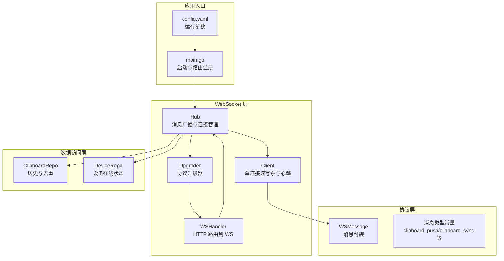
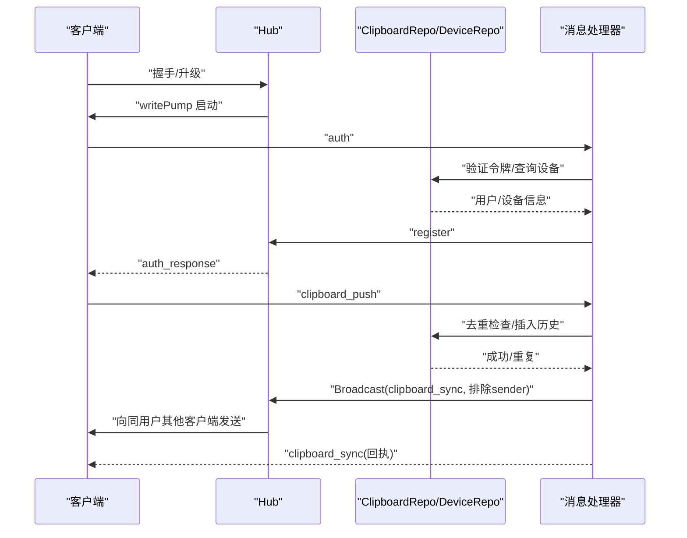
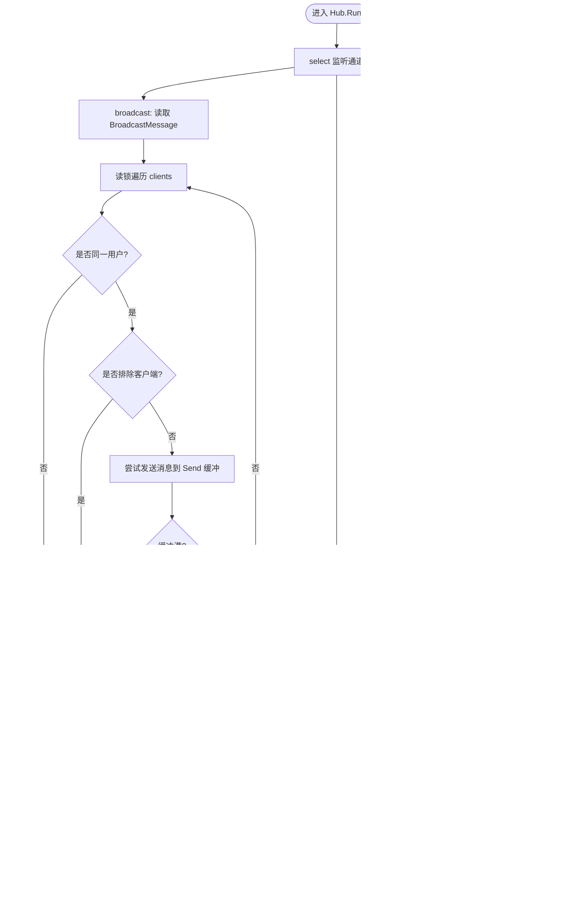
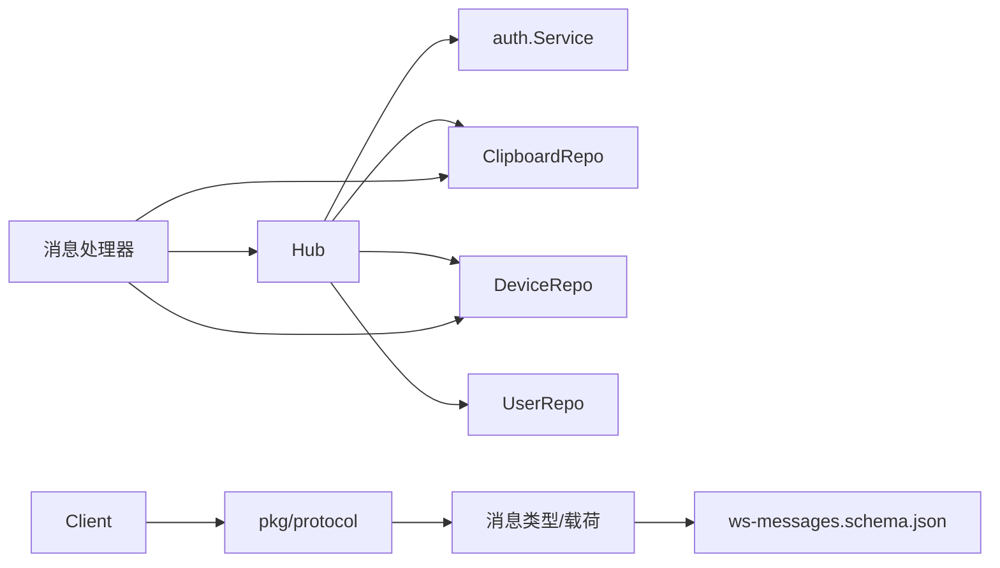
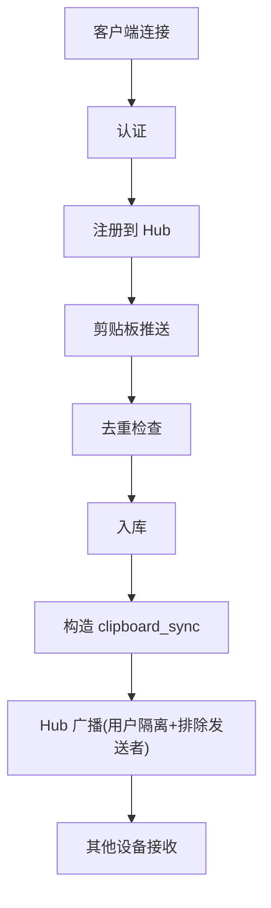

# 消息路由

<cite>
**本文引用的文件**
- [hub.go](file://clipSync-server/internal/websocket/hub.go)
- [client.go](file://clipSync-server/internal/websocket/client.go)
- [handler.go](file://clipSync-server/internal/websocket/handler.go)
- [protocol.go](file://clipSync-server/internal/websocket/protocol.go)
- [messages.go](file://clipSync-server/pkg/protocol/messages.go)
- [main.go](file://clipSync-server/cmd/server/main.go)
- [clipboard_repo.go](file://clipSync-server/internal/database/clipboard_repo.go)
- [device_repo.go](file://clipSync-server/internal/database/device_repo.go)
- [config.yaml](file://clipSync-server/configs/config.yaml)
- [config.go](file://clipSync-server/internal/config/config.go)
- [ws-messages.schema.json](file://protocol/ws-messages.schema.json)
</cite>

## 目录
1. [简介](#简介)
2. [项目结构](#项目结构)
3. [核心组件](#核心组件)
4. [架构总览](#架构总览)
5. [详细组件分析](#详细组件分析)
6. [依赖关系分析](#依赖关系分析)
7. [性能考量](#性能考量)
8. [故障排查指南](#故障排查指南)
9. [结论](#结论)
10. [附录](#附录)

## 简介
本文件围绕 WebSocket 消息路由系统进行深入文档化，重点解释 Hub 如何实现消息广播机制、用户隔离与客户端过滤；详细说明 BroadcastMessage 结构、消息分发策略与排除机制；并结合实际代码库中的具体示例，展示消息路由流程、用户权限控制与设备间通信。同时记录消息队列管理、缓冲区处理与发送失败重试机制，解释消息去重、顺序保证与性能优化策略。

## 项目结构
WebSocket 路由相关代码位于服务端 Go 工程中，主要分布在以下模块：
- 内部 WebSocket 层：Hub、Client、消息处理器、协议升级器
- 协议定义：统一的消息体结构与各消息类型载荷
- 数据访问层：剪贴板历史与设备信息仓库
- 配置与启动：服务器入口、配置加载与端口监听

图表来源
- [hub.go:18-58](file://clipSync-server/internal/websocket/hub.go#L18-L58)
- [client.go:13-31](file://clipSync-server/internal/websocket/client.go#L13-L31)
- [protocol.go:9-26](file://clipSync-server/internal/websocket/protocol.go#L9-L26)
- [messages.go:5-132](file://clipSync-server/pkg/protocol/messages.go#L5-L132)
- [main.go:67-125](file://clipSync-server/cmd/server/main.go#L67-L125)
- [config.yaml:1-29](file://clipSync-server/configs/config.yaml#L1-L29)

章节来源
- [main.go:67-125](file://clipSync-server/cmd/server/main.go#L67-L125)
- [hub.go:18-58](file://clipSync-server/internal/websocket/hub.go#L18-L58)
- [client.go:13-31](file://clipSync-server/internal/websocket/client.go#L13-L31)
- [protocol.go:9-26](file://clipSync-server/internal/websocket/protocol.go#L9-L26)
- [messages.go:5-132](file://clipSync-server/pkg/protocol/messages.go#L5-L132)
- [config.yaml:1-29](file://clipSync-server/configs/config.yaml#L1-L29)

## 核心组件
- Hub：维护所有已连接客户端、负责广播消息、注册/注销客户端、统计在线设备与客户端数量、处理设备断开等。
- Client：单个 WebSocket 连接的读写泵、心跳处理、错误消息发送、序列化消息发送。
- 消息处理器：根据消息类型分派到具体处理函数（认证、心跳、剪贴板推送/拉取、设备列表、设备注销）。
- 协议层：统一的 WSMessage 封装与各消息类型的载荷定义。
- 仓库层：剪贴板历史存储与去重、设备查询与在线状态更新。
- 启动与配置：从配置文件加载参数，初始化 Hub 并在独立端口启动 WebSocket 服务。

章节来源
- [hub.go:18-180](file://clipSync-server/internal/websocket/hub.go#L18-L180)
- [client.go:13-150](file://clipSync-server/internal/websocket/client.go#L13-L150)
- [handler.go:10-392](file://clipSync-server/internal/websocket/handler.go#L10-L392)
- [messages.go:5-132](file://clipSync-server/pkg/protocol/messages.go#L5-L132)
- [clipboard_repo.go:1-140](file://clipSync-server/internal/database/clipboard_repo.go#L1-L140)
- [device_repo.go:1-126](file://clipSync-server/internal/database/device_repo.go#L1-L126)
- [main.go:67-125](file://clipSync-server/cmd/server/main.go#L67-L125)
- [config.yaml:1-29](file://clipSync-server/configs/config.yaml#L1-L29)

## 架构总览
WebSocket 消息路由采用“Hub 中央广播 + 客户端读写泵”的模式。客户端通过认证后被注册到 Hub，随后 Hub 基于用户维度进行广播，并支持按客户端 ID 排除特定发送者，从而实现设备间同步与去重。

图表来源
- [hub.go:181-208](file://clipSync-server/internal/websocket/hub.go#L181-L208)
- [handler.go:33-110](file://clipSync-server/internal/websocket/handler.go#L33-L110)
- [handler.go:142-234](file://clipSync-server/internal/websocket/handler.go#L142-L234)
- [clipboard_repo.go:20-64](file://clipSync-server/internal/database/clipboard_repo.go#L20-L64)

## 详细组件分析

### Hub 组件分析
- 角色与职责
  - 维护客户端映射表、注册/注销通道、广播通道
  - 用户隔离：仅向同一用户广播
  - 排除机制：可按客户端 ID 排除发送者
  - 在线设备统计与设备断开
- 关键字段
  - clients：客户端映射
  - register/unregister/broadcast：三类异步通道
  - mu/countMu：读写锁保护 clients 与计数
  - heartbeatTimeout/historyLimit：心跳超时与历史限制
  - authService/clipRepo/deviceRepo/userRepo：服务与仓库依赖
- 广播流程
  - 读取广播通道消息
  - 仅向 UserID 匹配且 ID 不等于 ExcludeClient 的客户端发送
  - 发送缓冲满时收集待断开客户端，退出读锁后再批量断开
- 认证超时与连接生命周期
  - 客户端未在 30 秒内认证将被断开
  - 注册/注销时更新计数并打印日志

图表来源
- [hub.go:61-112](file://clipSync-server/internal/websocket/hub.go#L61-L112)
- [hub.go:81-110](file://clipSync-server/internal/websocket/hub.go#L81-L110)

章节来源
- [hub.go:18-180](file://clipSync-server/internal/websocket/hub.go#L18-L180)

### BroadcastMessage 结构与使用
- 字段
  - Data：要发送的完整消息字节
  - ExcludeClient：发送者客户端 ID，用于避免回环
  - UserID：目标用户 ID，用于用户隔离
- 使用场景
  - 剪贴板推送后，构建 clipboard_sync 消息并通过 Hub 广播给同用户其他设备
  - 处理器在广播前会将消息序列化为字节数组

章节来源
- [hub.go:37-42](file://clipSync-server/internal/websocket/hub.go#L37-L42)
- [handler.go:203-213](file://clipSync-server/internal/websocket/handler.go#L203-L213)

### 客户端读写泵与心跳
- 读泵 readPump
  - 设置读限制与心跳超时，处理 pong 更新读截止时间
  - 解析消息并调用 handleMessage 分派
  - 异常关闭时触发注销
- 写泵 writePump
  - 定期发送 Ping（心跳）
  - 批量写出 Send 缓冲中的消息，减少系统调用
  - 发送失败或异常时关闭连接
- 心跳与认证超时
  - 心跳超时由 Hub 配置决定
  - 认证超时固定为 30 秒，超时发送错误并断开

章节来源
- [client.go:33-117](file://clipSync-server/internal/websocket/client.go#L33-L117)
- [client.go:119-150](file://clipSync-server/internal/websocket/client.go#L119-L150)
- [hub.go:181-208](file://clipSync-server/internal/websocket/hub.go#L181-L208)

### 消息处理器与权限控制
- 消息类型分派
  - auth：校验令牌、设置客户端身份、注册到 Hub、返回认证结果
  - heartbeat：更新心跳序号与设备最后在线时间
  - clipboard_push：内容类型校验、去重检查、入库、构造 clipboard_sync 广播消息并回发确认
  - clipboard_pull：按用户拉取历史，返回历史列表
  - device_list/device_unregister：列出设备、注销设备并断开在线连接
- 权限控制
  - 未认证客户端对大多数消息类型会收到 AUTH_FAILED 错误
  - 设备注销会断开该设备的其他连接（除当前请求来源）

章节来源
- [handler.go:10-31](file://clipSync-server/internal/websocket/handler.go#L10-L31)
- [handler.go:33-110](file://clipSync-server/internal/websocket/handler.go#L33-L110)
- [handler.go:112-140](file://clipSync-server/internal/websocket/handler.go#L112-L140)
- [handler.go:142-234](file://clipSync-server/internal/websocket/handler.go#L142-L234)
- [handler.go:236-285](file://clipSync-server/internal/websocket/handler.go#L236-L285)
- [handler.go:287-339](file://clipSync-server/internal/websocket/handler.go#L287-L339)
- [handler.go:341-391](file://clipSync-server/internal/websocket/handler.go#L341-L391)

### 协议与消息模型
- WSMessage：统一消息封装，包含 type、version、timestamp、device_id、payload
- 消息类型常量：auth、auth_response、heartbeat、heartbeat_ack、clipboard_push、clipboard_sync、clipboard_pull、clipboard_history、device_list、device_list_response、device_unregister、error、ping、pong
- 载荷结构：AuthPayload、ClipboardPushPayload、ClipboardSyncPayload、ClipboardPullPayload、ClipboardHistoryPayload、DeviceInfo、DeviceListPayload、DeviceUnregisterPayload、ErrorPayload 等

章节来源
- [messages.go:5-132](file://clipSync-server/pkg/protocol/messages.go#L5-L132)
- [ws-messages.schema.json:8-261](file://protocol/ws-messages.schema.json#L8-L261)

### 数据库与仓库层
- ClipboardRepo
  - AddEntry：插入剪贴板历史并强制历史上限
  - GetHistory：按用户与 after_id 查询历史，支持分页
  - CheckDuplicateChecksum：基于 checksum 去重
- DeviceRepo
  - GetDevicesByUser：查询用户设备列表
  - UpdateDeviceLastSeen：更新设备最后在线时间
  - DeleteDevice：删除设备并断开在线连接

章节来源
- [clipboard_repo.go:20-140](file://clipSync-server/internal/database/clipboard_repo.go#L20-L140)
- [device_repo.go:60-126](file://clipSync-server/internal/database/device_repo.go#L60-L126)

### 启动与配置
- main.go
  - 加载配置、初始化数据库与迁移、构建仓库与认证服务
  - 初始化 Hub 并启动其主循环
  - 注册 HTTP 路由，WebSocket 路由指向 Hub.WSHandler
  - 分别启动 HTTP 与 WebSocket 服务器
- 配置项
  - ws_port、http_port、db_path、jwt_secret、jwt_expiry_hours、file_storage_path、max_file_size_mb、clipboard_history_limit、heartbeat_timeout_seconds

章节来源
- [main.go:21-146](file://clipSync-server/cmd/server/main.go#L21-L146)
- [config.go:10-72](file://clipSync-server/internal/config/config.go#L10-L72)
- [config.yaml:1-29](file://clipSync-server/configs/config.yaml#L1-L29)

## 依赖关系分析
- Hub 依赖
  - auth.Service：令牌验证
  - database.ClipboardRepo：历史存储与去重
  - database.DeviceRepo：设备查询与在线状态
  - database.UserRepo：用户信息（用于统计等）
- Client 依赖
  - pkg/protocol：消息结构
  - gorilla/websocket：底层连接
- Handler 依赖
  - Hub：注册/广播/统计
  - 各仓库：数据操作
- 协议与 JSON Schema
  - 消息类型与载荷约束
  - 服务端与客户端契约

图表来源
- [hub.go:26-29](file://clipSync-server/internal/websocket/hub.go#L26-L29)
- [client.go:3-11](file://clipSync-server/internal/websocket/client.go#L3-L11)
- [handler.go:3-8](file://clipSync-server/internal/websocket/handler.go#L3-L8)
- [messages.go:5-132](file://clipSync-server/pkg/protocol/messages.go#L5-L132)
- [ws-messages.schema.json:8-261](file://protocol/ws-messages.schema.json#L8-L261)

## 性能考量
- 广播与用户隔离
  - Hub 在广播时先做用户过滤，再做发送者排除，避免跨用户广播与回环
- 缓冲与背压
  - 客户端 Send 缓冲大小为 256，写泵批量写出以降低系统调用次数
  - 广播时检测发送缓冲是否已满，收集需要断开的客户端，退出读锁后再断开，避免死锁
- 历史与去重
  - 插入历史时强制历史上限，防止无限增长
  - 基于 checksum 去重，避免重复内容多次广播
- 心跳与超时
  - 客户端读超时与心跳超时配合，及时发现异常连接
  - 认证超时 30 秒，防止未认证连接占用资源
- 并发与锁
  - 读多写少场景下使用 RWMutex，广播路径尽量缩短持有写锁的时间

章节来源
- [hub.go:81-110](file://clipSync-server/internal/websocket/hub.go#L81-L110)
- [client.go:69-117](file://clipSync-server/internal/websocket/client.go#L69-L117)
- [clipboard_repo.go:39-50](file://clipSync-server/internal/database/clipboard_repo.go#L39-L50)
- [hub.go:181-208](file://clipSync-server/internal/websocket/hub.go#L181-L208)

## 故障排查指南
- 认证失败
  - 现象：收到 AUTH_FAILED 或 AUTH_TIMEOUT
  - 排查：确认令牌有效、平台/设备名参数正确；检查 Hub 的认证超时逻辑
- 消息解析错误
  - 现象：收到 INVALID_PAYLOAD
  - 排查：检查消息类型与载荷结构是否符合协议定义
- 设备断连
  - 现象：心跳超时或缓冲满导致断开
  - 排查：查看 Hub 日志；确认客户端写泵是否正常；检查网络状况
- 历史拉取异常
  - 现象：clipboard_history 返回 INTERNAL_ERROR
  - 排查：检查数据库连接与查询条件；确认 limit 与 after_id 参数
- 设备注销未生效
  - 现象：设备仍在线
  - 排查：确认设备归属校验与断开逻辑；检查 Hub 的 GetClientCountForUser 与断开流程

章节来源
- [handler.go:33-110](file://clipSync-server/internal/websocket/handler.go#L33-L110)
- [handler.go:142-234](file://clipSync-server/internal/websocket/handler.go#L142-L234)
- [handler.go:236-285](file://clipSync-server/internal/websocket/handler.go#L236-L285)
- [handler.go:341-391](file://clipSync-server/internal/websocket/handler.go#L341-L391)
- [hub.go:181-208](file://clipSync-server/internal/websocket/hub.go#L181-L208)

## 结论
本系统通过 Hub 实现了高效、可靠的 WebSocket 消息广播，结合用户隔离与客户端排除机制，确保设备间同步的准确性与安全性。借助去重与历史限制，系统在性能与一致性之间取得平衡。客户端读写泵与心跳机制提供了稳健的连接管理能力。整体设计清晰、模块职责明确，便于扩展与维护。

## 附录
- 消息路由流程图（概念性）

[此图为概念性流程示意，不直接对应具体源码文件，故不提供图表来源]