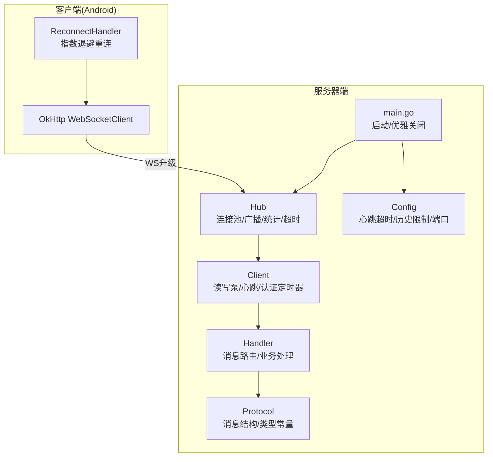
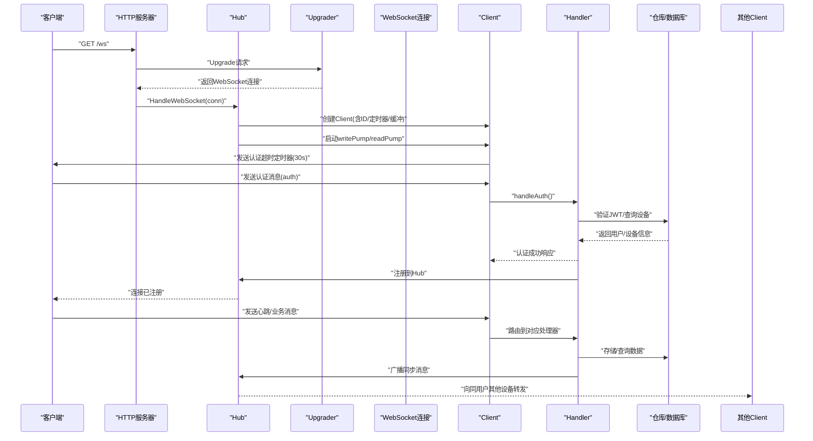
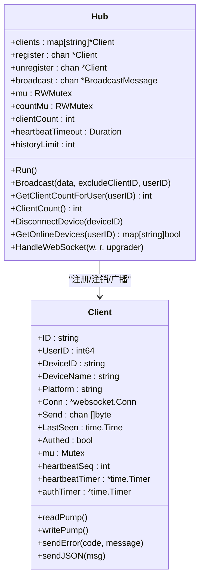
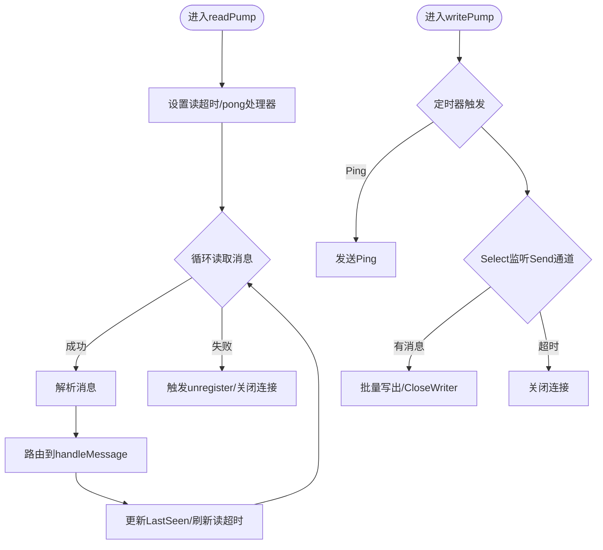
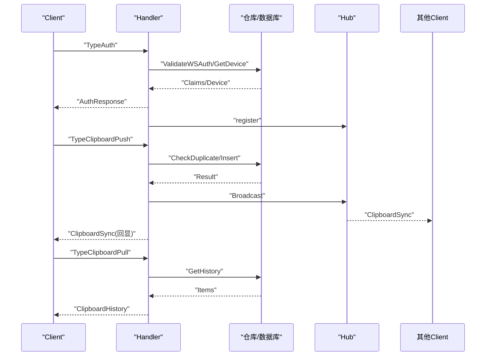
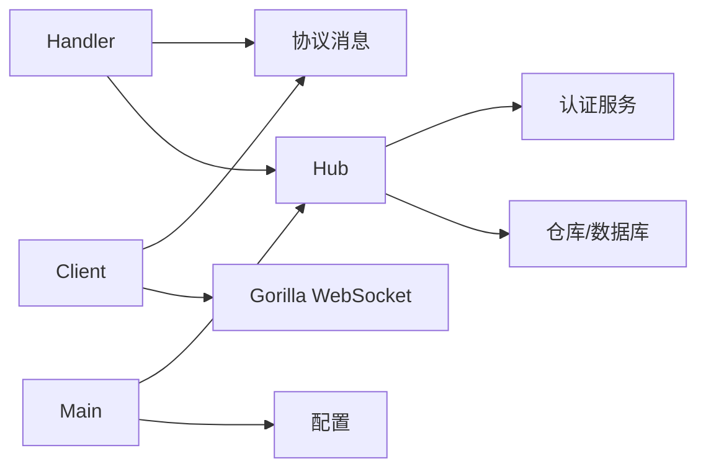

# 连接管理

<cite>
**本文引用的文件**
- [hub.go](file://clipSync-server/internal/websocket/hub.go)
- [client.go](file://clipSync-server/internal/websocket/client.go)
- [handler.go](file://clipSync-server/internal/websocket/handler.go)
- [protocol.go](file://clipSync-server/internal/websocket/protocol.go)
- [messages.go](file://clipSync-server/pkg/protocol/messages.go)
- [main.go](file://clipSync-server/cmd/server/main.go)
- [config.go](file://clipSync-server/internal/config/config.go)
- [WebSocketClient.kt](file://clipSync-android/app/src/main/java/com/clipsync/app/network/WebSocketClient.kt)
- [ReconnectHandler.kt](file://clipSync-android/app/src/main/java/com/clipsync/app/network/ReconnectHandler.kt)
</cite>

## 目录
1. [简介](#简介)
2. [项目结构](#项目结构)
3. [核心组件](#核心组件)
4. [架构总览](#架构总览)
5. [详细组件分析](#详细组件分析)
6. [依赖分析](#依赖分析)
7. [性能考量](#性能考量)
8. [故障排查指南](#故障排查指南)
9. [结论](#结论)
10. [附录](#附录)

## 简介
本文件聚焦于服务器端WebSocket连接管理，系统性阐述Hub如何维护客户端连接池、处理新连接注册与断开注销、客户端ID生成机制、连接超时与认证超时管理、连接生命周期与状态跟踪、内存管理与并发安全、资源清理与优雅关闭，以及连接失败处理与错误恢复策略。文档同时结合Android客户端实现，给出连接建立流程与消息交互的完整视图。

## 项目结构
服务器端WebSocket相关代码位于内部模块，采用“Hub + Client + Handler + 协议”的分层设计：
- Hub：全局连接池与广播调度中心，负责注册/注销、广播、统计与超时控制
- Client：单个WebSocket连接的读写泵、心跳与认证定时器、错误发送
- Handler：消息路由与业务处理（认证、心跳、剪贴板同步、设备列表等）
- 协议：统一的消息格式与类型常量
- 配置：心跳超时、历史限制、端口等参数
- 启动入口：初始化Hub并启动WebSocket服务

图表来源
- [hub.go:18-58](file://clipSync-server/internal/websocket/hub.go#L18-L58)
- [client.go:13-31](file://clipSync-server/internal/websocket/client.go#L13-L31)
- [handler.go:10-31](file://clipSync-server/internal/websocket/handler.go#L10-L31)
- [messages.go:5-132](file://clipSync-server/pkg/protocol/messages.go#L5-L132)
- [config.go:10-21](file://clipSync-server/internal/config/config.go#L10-L21)
- [main.go:67-125](file://clipSync-server/cmd/server/main.go#L67-L125)
- [WebSocketClient.kt:26-145](file://clipSync-android/app/src/main/java/com/clipsync/app/network/WebSocketClient.kt#L26-L145)
- [ReconnectHandler.kt:14-79](file://clipSync-android/app/src/main/java/com/clipsync/app/network/ReconnectHandler.kt#L14-L79)

章节来源
- [hub.go:18-58](file://clipSync-server/internal/websocket/hub.go#L18-L58)
- [client.go:13-31](file://clipSync-server/internal/websocket/client.go#L13-L31)
- [handler.go:10-31](file://clipSync-server/internal/websocket/handler.go#L10-L31)
- [messages.go:5-132](file://clipSync-server/pkg/protocol/messages.go#L5-L132)
- [config.go:10-21](file://clipSync-server/internal/config/config.go#L10-L21)
- [main.go:67-125](file://clipSync-server/cmd/server/main.go#L67-L125)

## 核心组件
- Hub
  - 维护连接池clients映射、注册/注销通道、广播通道
  - 提供广播、用户在线设备查询、按设备断开连接、客户端计数
  - 超时控制：心跳超时（基于配置）、认证超时（固定30秒）
- Client
  - 读泵：设置读限制、读超时、Pong处理器；解析消息并路由到Handler
  - 写泵：周期性Ping、批量写出Send缓冲区、异常时优雅关闭
  - 认证与心跳定时器：认证超时、心跳超时
- Handler
  - 消息路由：认证、心跳、剪贴板推送/拉取、设备列表、设备注销
  - 业务处理：校验令牌、更新设备信息、去重校验、数据库存取、广播同步
- 协议
  - 统一消息体、类型常量、时间戳工具
- 配置
  - 心跳超时秒数、历史限制、端口等
- 启动入口
  - 初始化Hub、启动HTTP与WebSocket服务、优雅关闭

章节来源
- [hub.go:18-166](file://clipSync-server/internal/websocket/hub.go#L18-L166)
- [client.go:33-150](file://clipSync-server/internal/websocket/client.go#L33-L150)
- [handler.go:10-392](file://clipSync-server/internal/websocket/handler.go#L10-L392)
- [messages.go:5-132](file://clipSync-server/pkg/protocol/messages.go#L5-L132)
- [config.go:10-36](file://clipSync-server/internal/config/config.go#L10-L36)
- [main.go:67-125](file://clipSync-server/cmd/server/main.go#L67-L125)

## 架构总览
下图展示从HTTP升级到WebSocket、认证、注册、消息处理与广播的全链路。

图表来源
- [protocol.go:20-26](file://clipSync-server/internal/websocket/protocol.go#L20-L26)
- [hub.go:181-208](file://clipSync-server/internal/websocket/hub.go#L181-L208)
- [client.go:33-67](file://clipSync-server/internal/websocket/client.go#L33-L67)
- [handler.go:33-110](file://clipSync-server/internal/websocket/handler.go#L33-L110)
- [messages.go:107-123](file://clipSync-server/pkg/protocol/messages.go#L107-L123)

## 详细组件分析

### Hub：连接池与广播中心
- 连接池
  - clients映射以客户端ID索引，支持并发读写锁保护
  - register/unregister通道用于注册/注销事件，Run循环中处理
  - 广播通道broadcast，按用户过滤与排除发送者，避免回环
- 客户端ID生成
  - 使用随机字节生成唯一ID，前缀标识WebSocket连接
- 超时与认证
  - 认证超时：客户端创建后启动30秒定时器，未认证则发送错误并断开
  - 心跳超时：读泵设置读超时，Pong处理器刷新读超时
- 广播与清理
  - 广播时检测发送缓冲是否满，满则标记断开，随后统一清理
  - 注销时关闭发送通道，释放资源
- 统计与查询
  - 客户端总数与按用户计数，查询在线设备集合

图表来源
- [hub.go:18-58](file://clipSync-server/internal/websocket/hub.go#L18-L58)
- [client.go:13-31](file://clipSync-server/internal/websocket/client.go#L13-L31)

章节来源
- [hub.go:18-166](file://clipSync-server/internal/websocket/hub.go#L18-L166)
- [hub.go:210-214](file://clipSync-server/internal/websocket/hub.go#L210-L214)

### Client：读写泵与超时控制
- 读泵
  - 设置读限制与读超时，Pong处理器刷新读超时
  - 解析消息并调用消息路由函数
- 写泵
  - 周期性Ping，批量写出Send缓冲区，异常时关闭连接
- 错误处理
  - 发送错误消息到客户端，避免阻塞
- 并发安全
  - 写入路径使用互斥锁保护底层写操作

图表来源
- [client.go:33-67](file://clipSync-server/internal/websocket/client.go#L33-L67)
- [client.go:69-117](file://clipSync-server/internal/websocket/client.go#L69-L117)

章节来源
- [client.go:33-117](file://clipSync-server/internal/websocket/client.go#L33-L117)

### Handler：消息路由与业务处理
- 认证
  - 校验JWT令牌，设置用户身份与设备信息，停止认证超时定时器，注册到Hub
- 心跳
  - 返回心跳确认，更新设备最近活跃时间
- 剪贴板推送
  - 校验内容类型与去重，入库并广播同步消息，回显确认
- 剪贴板拉取
  - 查询历史并返回
- 设备列表
  - 返回用户设备列表，并标注在线状态
- 设备注销
  - 删除设备并断开当前在线实例

图表来源
- [handler.go:33-110](file://clipSync-server/internal/websocket/handler.go#L33-L110)
- [handler.go:142-234](file://clipSync-server/internal/websocket/handler.go#L142-L234)
- [handler.go:236-285](file://clipSync-server/internal/websocket/handler.go#L236-L285)
- [handler.go:287-339](file://clipSync-server/internal/websocket/handler.go#L287-L339)
- [handler.go:341-391](file://clipSync-server/internal/websocket/handler.go#L341-L391)

章节来源
- [handler.go:10-392](file://clipSync-server/internal/websocket/handler.go#L10-L392)

### 协议与消息模型
- 统一消息体包含类型、版本、时间戳与可选设备ID与负载
- 类型常量覆盖认证、心跳、剪贴板推送/同步/拉取、设备列表、错误等
- 时间戳工具提供毫秒级时间

章节来源
- [messages.go:5-132](file://clipSync-server/pkg/protocol/messages.go#L5-L132)

### 启动与优雅关闭
- 初始化配置、数据库、仓库、JWT与认证服务
- 创建Hub并启动其主循环
- 启动HTTP与WebSocket服务，分别设置超时
- 信号监听，执行优雅关闭

章节来源
- [main.go:21-146](file://clipSync-server/cmd/server/main.go#L21-L146)

### Android客户端：连接建立与重连
- 使用OkHttp WebSocket，设置Ping间隔、连接/读超时
- 状态机：Connected/Connecting/Disconnected/Error
- 指数退避重连：1s→2s→…→60s上限
- 正常关闭与资源清理

章节来源
- [WebSocketClient.kt:26-145](file://clipSync-android/app/src/main/java/com/clipsync/app/network/WebSocketClient.kt#L26-L145)
- [ReconnectHandler.kt:14-79](file://clipSync-android/app/src/main/java/com/clipsync/app/network/ReconnectHandler.kt#L14-L79)

## 依赖分析
- Hub依赖认证服务与数据库仓库，用于令牌验证、设备与剪贴板数据访问
- Client依赖协议消息结构与Gorilla WebSocket库
- Handler依赖协议消息结构与Hub提供的仓库接口
- 启动入口依赖配置与HTTP服务器封装

图表来源
- [hub.go:26-29](file://clipSync-server/internal/websocket/hub.go#L26-L29)
- [client.go:3-11](file://clipSync-server/internal/websocket/client.go#L3-L11)
- [handler.go:3-8](file://clipSync-server/internal/websocket/handler.go#L3-L8)
- [main.go:61-69](file://clipSync-server/cmd/server/main.go#L61-L69)

章节来源
- [hub.go:26-29](file://clipSync-server/internal/websocket/hub.go#L26-L29)
- [client.go:3-11](file://clipSync-server/internal/websocket/client.go#L3-L11)
- [handler.go:3-8](file://clipSync-server/internal/websocket/handler.go#L3-L8)
- [main.go:61-69](file://clipSync-server/cmd/server/main.go#L61-L69)

## 性能考量
- 缓冲区大小
  - Hub广播通道容量为256，减少阻塞风险
  - Client发送通道容量为256，写泵支持批量写出，降低写放大
- 并发与锁
  - Hub使用读写锁分离读多写少场景；客户端写入使用互斥锁保护
- 超时策略
  - 读超时与Pong刷新防止僵尸连接；认证超时30秒避免资源占用
- 广播优化
  - 广播时先检查发送缓冲，满则延迟断开，避免阻塞主循环
- 心跳与Ping
  - 服务器定期Ping，客户端保持Ping间隔，维持连接活性

章节来源
- [hub.go:44-58](file://clipSync-server/internal/websocket/hub.go#L44-L58)
- [client.go:69-117](file://clipSync-server/internal/websocket/client.go#L69-L117)

## 故障排查指南
- 认证超时
  - 现象：连接建立后30秒内未发送认证消息被断开
  - 处理：确保客户端在连接后尽快发送认证消息
  - 参考：[hub.go:197-204](file://clipSync-server/internal/websocket/hub.go#L197-L204)
- 心跳超时
  - 现象：读超时触发或Pong未及时响应导致断开
  - 处理：检查网络质量、客户端是否正常发送心跳/Ping
  - 参考：[client.go:40-45](file://clipSync-server/internal/websocket/client.go#L40-L45)
- 广播阻塞
  - 现象：客户端发送缓冲满导致断开
  - 处理：增大缓冲容量或降低消息速率
  - 参考：[hub.go:91-109](file://clipSync-server/internal/websocket/hub.go#L91-L109)
- 重复内容
  - 现象：相同校验和的内容被拒绝
  - 处理：客户端应避免重复推送
  - 参考：[handler.go:162-172](file://clipSync-server/internal/websocket/handler.go#L162-L172)
- 设备注销
  - 现象：注销设备后其他设备仍可见在线
  - 处理：确认注销流程正确触发断开与清理
  - 参考：[handler.go:341-391](file://clipSync-server/internal/websocket/handler.go#L341-L391)
- 优雅关闭
  - 现象：服务重启或关闭时连接未正确释放
  - 处理：确保信号监听与超时关闭逻辑生效
  - 参考：[main.go:127-142](file://clipSync-server/cmd/server/main.go#L127-L142)

章节来源
- [hub.go:197-204](file://clipSync-server/internal/websocket/hub.go#L197-L204)
- [client.go:40-45](file://clipSync-server/internal/websocket/client.go#L40-L45)
- [hub.go:91-109](file://clipSync-server/internal/websocket/hub.go#L91-L109)
- [handler.go:162-172](file://clipSync-server/internal/websocket/handler.go#L162-L172)
- [handler.go:341-391](file://clipSync-server/internal/websocket/handler.go#L341-L391)
- [main.go:127-142](file://clipSync-server/cmd/server/main.go#L127-L142)

## 结论
该WebSocket连接管理方案通过Hub集中式连接池与广播、Client双泵模型与超时控制、Handler清晰的消息路由与业务处理，实现了高可用、低耦合的实时通信。配合Android客户端的指数退避重连与状态机，整体具备良好的容错与恢复能力。建议在生产环境调整跨域策略、强化认证与鉴权、监控连接数与广播队列长度，并根据业务规模调优缓冲区与超时参数。

## 附录
- 配置项
  - 心跳超时秒数：用于读超时与Pong刷新
  - 历史限制：剪贴板历史条目上限
  - 端口：WebSocket服务端口
- 关键流程参考
  - 连接建立与认证：[hub.go:181-208](file://clipSync-server/internal/websocket/hub.go#L181-L208)、[handler.go:33-110](file://clipSync-server/internal/websocket/handler.go#L33-L110)
  - 广播与去重：[handler.go:142-234](file://clipSync-server/internal/websocket/handler.go#L142-L234)
  - 在线设备查询：[handler.go:287-339](file://clipSync-server/internal/websocket/handler.go#L287-L339)
  - 优雅关闭：[main.go:127-142](file://clipSync-server/cmd/server/main.go#L127-L142)