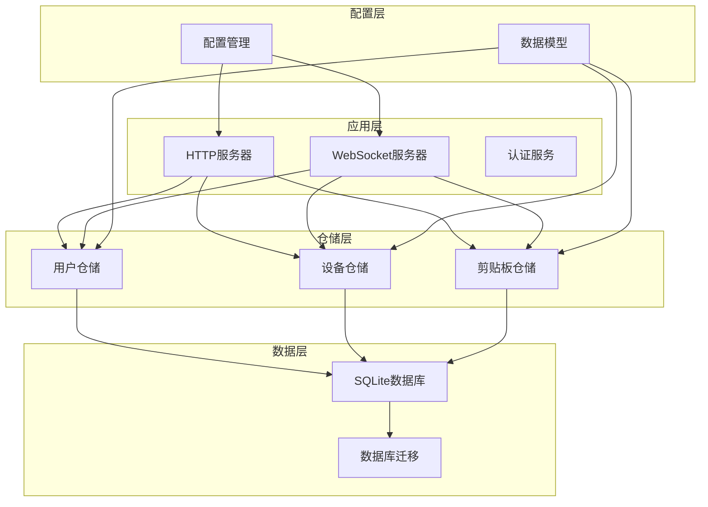
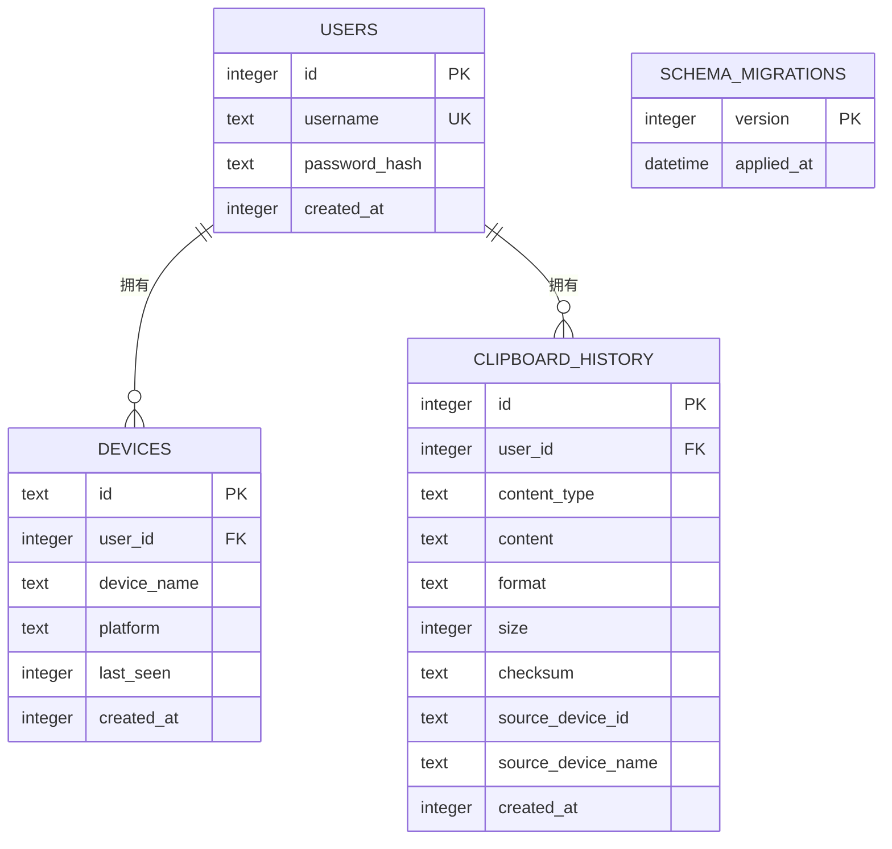
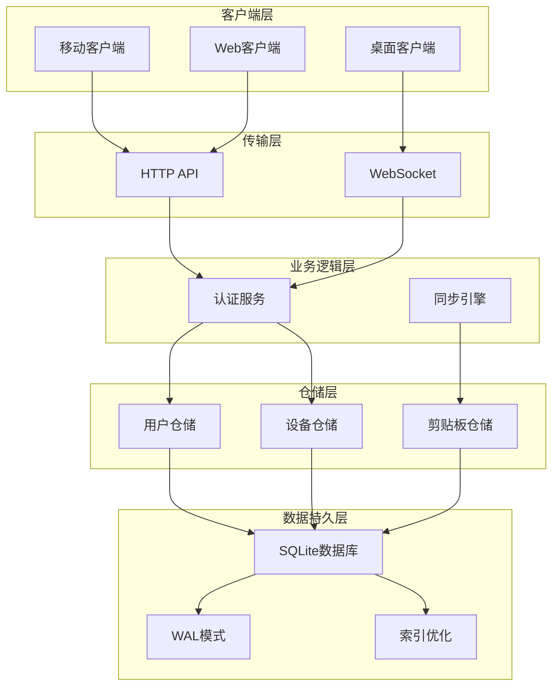
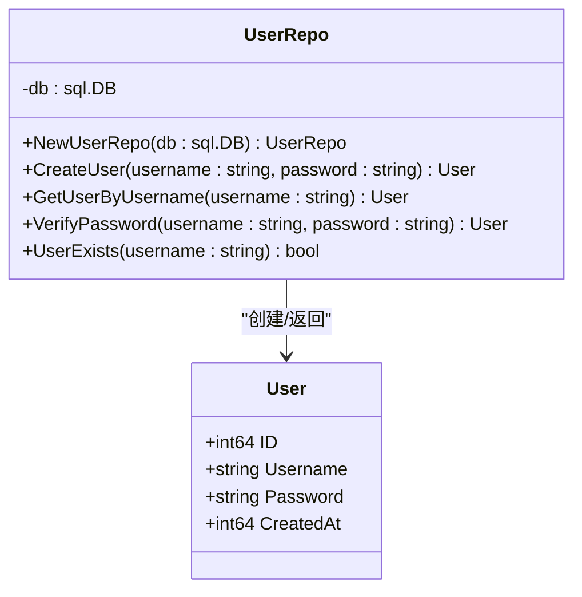
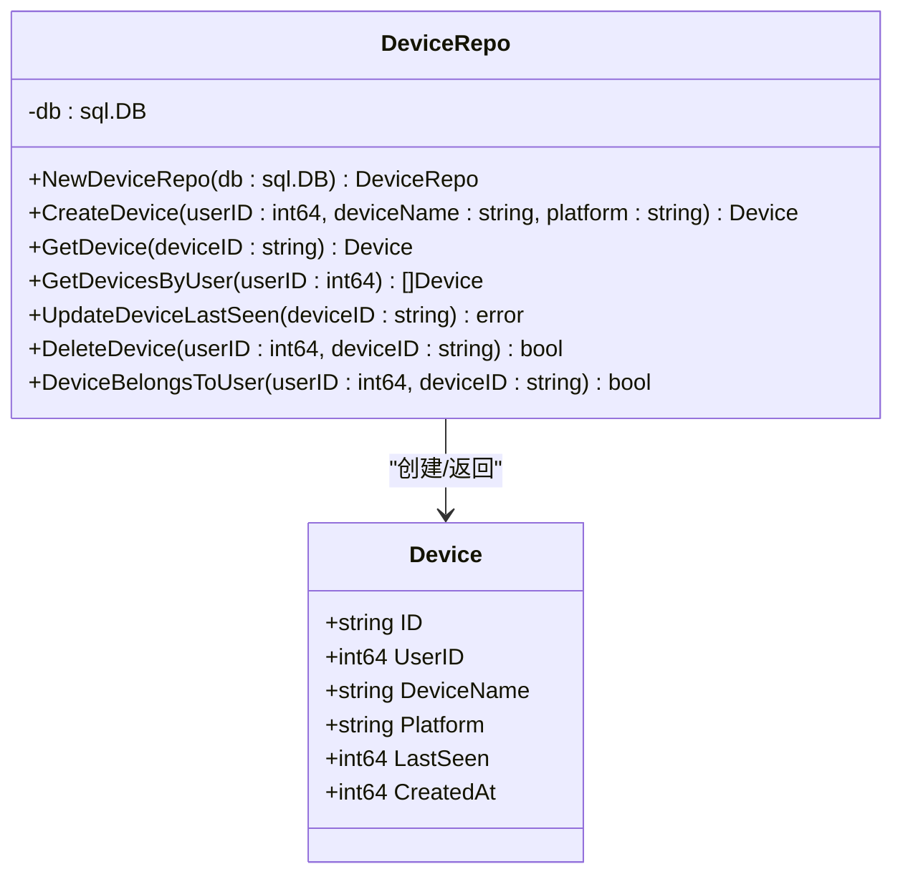
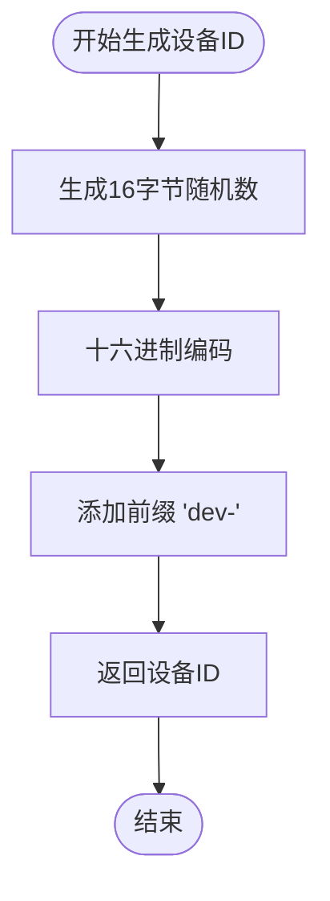
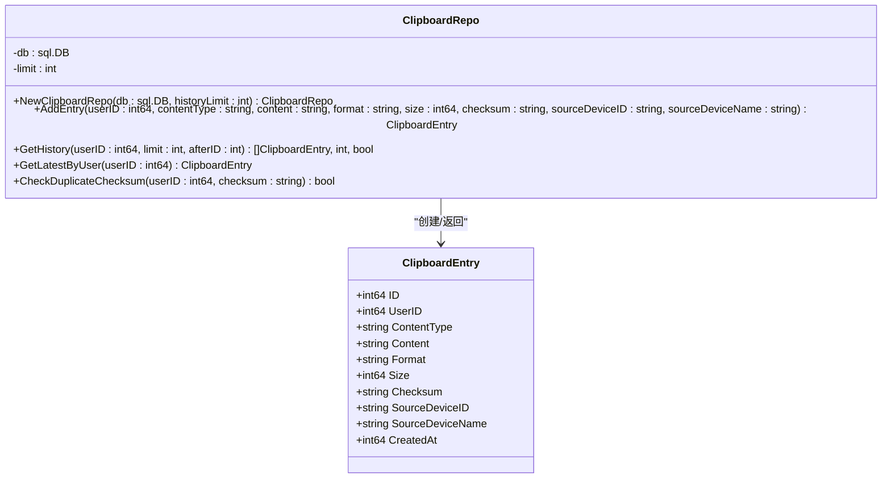
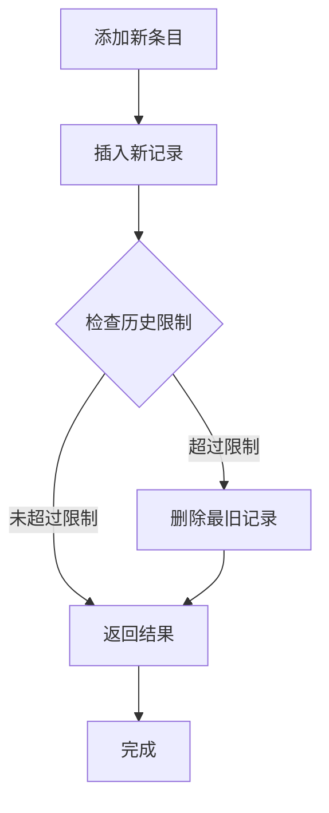
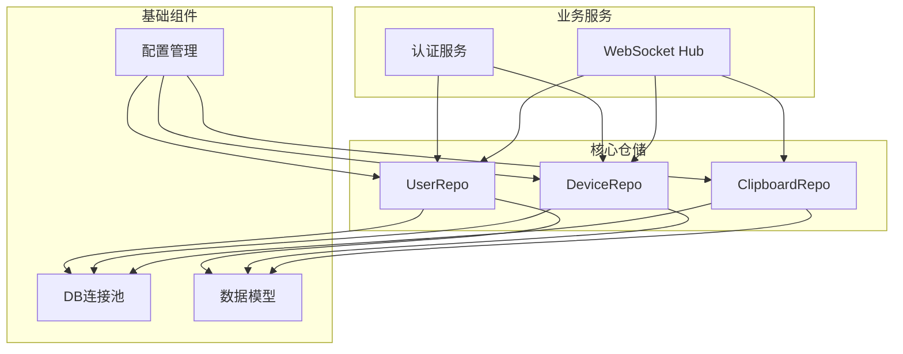
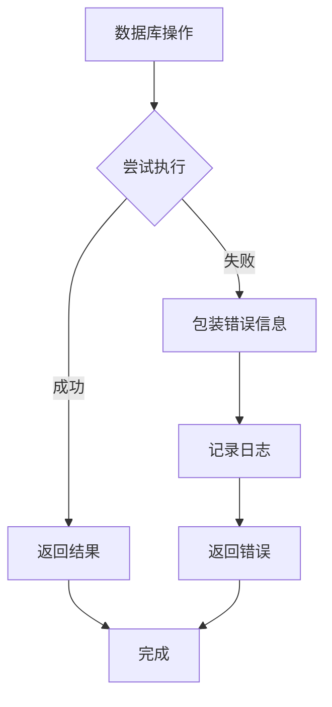

# 仓储模式实现

<cite>
**本文档引用的文件**
- [user_repo.go](file://clipSync-server/internal/database/user_repo.go)
- [device_repo.go](file://clipSync-server/internal/database/device_repo.go)
- [clipboard_repo.go](file://clipSync-server/internal/database/clipboard_repo.go)
- [models.go](file://clipSync-server/internal/database/models.go)
- [db.go](file://clipSync-server/internal/database/db.go)
- [migrations.go](file://clipSync-server/internal/database/migrations.go)
- [001_initial.sql](file://clipSync-server/migrations/001_initial.sql)
- [main.go](file://clipSync-server/cmd/server/main.go)
- [config.go](file://clipSync-server/internal/config/config.go)
- [auth.go](file://clipSync-server/internal/auth/auth.go)
- [hub.go](file://clipSync-server/internal/websocket/hub.go)
- [auth_handler.go](file://clipSync-server/internal/httpserver/auth_handler.go)
- [messages.go](file://clipSync-server/pkg/protocol/messages.go)
</cite>

## 目录
1. [简介](#简介)
2. [项目结构](#项目结构)
3. [核心组件](#核心组件)
4. [架构概览](#架构概览)
5. [详细组件分析](#详细组件分析)
6. [依赖关系分析](#依赖关系分析)
7. [性能考虑](#性能考虑)
8. [故障排除指南](#故障排除指南)
9. [结论](#结论)

## 简介

本文件详细阐述了ClipSync服务器端的仓储模式实现，重点分析用户仓储(UserRepo)、设备仓储(DeviceRepo)和剪贴板仓储(ClipboardRepo)的设计与实现。这些仓储组件采用SQLite作为持久化存储，实现了完整的数据访问层功能，包括CRUD操作、事务处理、错误处理和性能优化。

仓储模式的核心思想是将数据访问逻辑封装在专门的类中，为上层业务逻辑提供清晰的数据接口，同时隐藏底层数据库的具体实现细节。在ClipSync项目中，每个仓储类都专注于特定的实体操作，并通过统一的错误处理机制确保系统的稳定性和可靠性。

## 项目结构

ClipSync项目采用分层架构设计，仓储层位于应用层之下，负责与数据库进行交互。项目的整体结构如下：



**图表来源**
- [main.go:56-69](file://clipSync-server/cmd/server/main.go#L56-L69)
- [db.go:17-56](file://clipSync-server/internal/database/db.go#L17-L56)

**章节来源**
- [main.go:1-146](file://clipSync-server/cmd/server/main.go#L1-L146)
- [config.go:10-72](file://clipSync-server/internal/config/config.go#L10-L72)

## 核心组件

### 数据模型设计

系统使用简洁而高效的数据模型来表示核心实体：



**图表来源**
- [models.go:3-46](file://clipSync-server/internal/database/models.go#L3-L46)
- [001_initial.sql:4-55](file://clipSync-server/migrations/001_initial.sql#L4-L55)

### 仓储接口设计原则

每个仓储类都遵循以下设计原则：
- **单一职责**：每个仓储专注于特定实体的所有数据操作
- **依赖注入**：通过构造函数接收数据库连接，便于测试和配置
- **错误处理**：统一的错误包装机制，提供上下文信息
- **类型安全**：明确的参数类型和返回值类型
- **性能优化**：合理的索引策略和查询优化

**章节来源**
- [models.go:1-46](file://clipSync-server/internal/database/models.go#L1-L46)

## 架构概览

ClipSync的仓储架构采用了分层设计，确保了良好的关注点分离：



**图表来源**
- [main.go:75-125](file://clipSync-server/cmd/server/main.go#L75-L125)
- [hub.go:44-58](file://clipSync-server/internal/websocket/hub.go#L44-L58)

## 详细组件分析

### 用户仓储 (UserRepo)

用户仓储负责用户账户的完整生命周期管理，包括注册、登录验证和用户信息查询。

#### 核心方法定义



**图表来源**
- [user_repo.go:11-91](file://clipSync-server/internal/database/user_repo.go#L11-L91)
- [models.go:3-9](file://clipSync-server/internal/database/models.go#L3-L9)

#### 方法详细说明

**CreateUser方法**
- **功能**：创建新用户账户，自动进行密码哈希处理
- **参数**：用户名、明文密码
- **返回值**：用户对象（包含ID、用户名、创建时间）
- **复杂度**：O(1)
- **错误处理**：密码哈希失败、数据库插入失败

**GetUserByUsername方法**
- **功能**：根据用户名检索用户信息
- **参数**：用户名
- **返回值**：用户对象或nil（未找到时）
- **复杂度**：O(1) - 基于唯一索引
- **错误处理**：数据库查询异常

**VerifyPassword方法**
- **功能**：验证用户凭据
- **参数**：用户名、明文密码
- **返回值**：用户对象或nil（验证失败）
- **复杂度**：O(1)
- **错误处理**：用户不存在、密码不匹配

**UserExists方法**
- **功能**：检查用户名是否已存在
- **参数**：用户名
- **返回值**：布尔值
- **复杂度**：O(1)
- **错误处理**：数据库查询异常

#### SQL查询示例

```sql
-- 创建用户
INSERT INTO users (username, password_hash, created_at) 
VALUES (?, ?, ?);

-- 按用户名查询
SELECT id, username, password_hash, created_at 
FROM users WHERE username = ?;

-- 检查用户名是否存在
SELECT COUNT(*) FROM users WHERE username = ?;
```

**章节来源**
- [user_repo.go:21-91](file://clipSync-server/internal/database/user_repo.go#L21-L91)

### 设备仓储 (DeviceRepo)

设备仓储管理用户的所有设备注册和状态跟踪，支持设备发现、更新和删除功能。

#### 核心方法定义



**图表来源**
- [device_repo.go:11-126](file://clipSync-server/internal/database/device_repo.go#L11-L126)
- [models.go:11-19](file://clipSync-server/internal/database/models.go#L11-L19)

#### 方法详细说明

**CreateDevice方法**
- **功能**：为用户注册新设备
- **参数**：用户ID、设备名称、平台信息
- **返回值**：设备对象（包含自动生成的设备ID）
- **复杂度**：O(1)
- **错误处理**：设备ID生成失败、数据库插入失败

**GetDevice方法**
- **功能**：按设备ID获取设备信息
- **参数**：设备ID
- **返回值**：设备对象或nil
- **复杂度**：O(1) - 基于主键索引
- **错误处理**：数据库查询异常

**GetDevicesByUser方法**
- **功能**：获取用户所有设备列表
- **参数**：用户ID
- **返回值**：设备数组（按最后活跃时间降序排列）
- **复杂度**：O(n) - n为设备数量
- **错误处理**：数据库查询异常

**UpdateDeviceLastSeen方法**
- **功能**：更新设备最后活跃时间
- **参数**：设备ID
- **返回值**：错误（无错误返回nil）
- **复杂度**：O(1)
- **错误处理**：数据库更新失败

**DeleteDevice方法**
- **功能**：删除用户设备
- **参数**：用户ID、设备ID
- **返回值**：布尔值（删除成功返回true）
- **复杂度**：O(1)
- **错误处理**：数据库删除失败

**DeviceBelongsToUser方法**
- **功能**：验证设备所有权
- **参数**：用户ID、设备ID
- **返回值**：布尔值
- **复杂度**：O(1)
- **错误处理**：数据库查询异常

#### 设备ID生成机制

设备ID采用随机生成策略，确保全局唯一性：



**图表来源**
- [device_repo.go:121-126](file://clipSync-server/internal/database/device_repo.go#L121-L126)

#### SQL查询示例

```sql
-- 注册设备
INSERT INTO devices (id, user_id, device_name, platform, last_seen, created_at) 
VALUES (?, ?, ?, ?, ?, ?);

-- 获取用户设备列表
SELECT id, user_id, device_name, platform, last_seen, created_at 
FROM devices WHERE user_id = ? 
ORDER BY last_seen DESC;

-- 更新最后活跃时间
UPDATE devices SET last_seen = ? WHERE id = ?;
```

**章节来源**
- [device_repo.go:21-126](file://clipSync-server/internal/database/device_repo.go#L21-L126)

### 剪贴板仓储 (ClipboardRepo)

剪贴板仓储管理用户的剪贴板历史记录，支持内容存储、历史查询和重复检测。

#### 核心方法定义



**图表来源**
- [clipboard_repo.go:9-140](file://clipSync-server/internal/database/clipboard_repo.go#L9-L140)
- [models.go:21-33](file://clipSync-server/internal/database/models.go#L21-L33)

#### 方法详细说明

**AddEntry方法**
- **功能**：存储新的剪贴板条目并强制执行历史限制
- **参数**：用户ID、内容类型、内容、格式、大小、校验和、源设备ID、源设备名称
- **返回值**：剪贴板条目对象
- **复杂度**：O(1) + 删除超限项的额外开销
- **错误处理**：插入失败、删除超限项失败

**GetHistory方法**
- **功能**：获取用户剪贴板历史记录
- **参数**：用户ID、限制数量、起始ID
- **返回值**：历史条目数组、总记录数、是否有更多数据
- **复杂度**：O(k) - k为返回的记录数
- **错误处理**：计数查询失败、历史查询失败

**GetLatestByUser方法**
- **功能**：获取用户最新的剪贴板条目
- **参数**：用户ID
- **返回值**：剪贴板条目对象或nil
- **复杂度**：O(1)
- **错误处理**：数据库查询异常

**CheckDuplicateChecksum方法**
- **功能**：检查重复的剪贴板内容
- **参数**：用户ID、校验和
- **返回值**：布尔值
- **复杂度**：O(1) - 基于复合索引
- **错误处理**：数据库查询异常

#### 历史记录管理机制

剪贴板仓储实现了智能的历史记录管理：



**图表来源**
- [clipboard_repo.go:39-50](file://clipSync-server/internal/database/clipboard_repo.go#L39-L50)

#### SQL查询示例

```sql
-- 添加剪贴板条目
INSERT INTO clipboard_history 
(user_id, content_type, content, format, size, checksum, source_device_id, source_device_name, created_at) 
VALUES (?, ?, ?, ?, ?, ?, ?, ?, ?);

-- 获取历史记录
SELECT id, user_id, content_type, content, format, size, checksum, source_device_id, source_device_name, created_at 
FROM clipboard_history WHERE user_id = ? AND id > ? 
ORDER BY created_at DESC LIMIT ?;

-- 检查重复校验和
SELECT COUNT(*) FROM clipboard_history 
WHERE user_id = ? AND checksum = ?;
```

**章节来源**
- [clipboard_repo.go:20-140](file://clipSync-server/internal/database/clipboard_repo.go#L20-L140)

## 依赖关系分析

### 组件耦合度分析



**图表来源**
- [main.go:56-69](file://clipSync-server/cmd/server/main.go#L56-L69)
- [auth.go:8-22](file://clipSync-server/internal/auth/auth.go#L8-L22)
- [hub.go:18-35](file://clipSync-server/internal/websocket/hub.go#L18-L35)

### 外部依赖关系

系统的主要外部依赖包括：
- **SQLite驱动**：用于数据库操作
- **bcrypt库**：用于密码哈希
- **gorilla/websocket**：用于WebSocket通信
- **YAML解析器**：用于配置文件解析

**章节来源**
- [main.go:3-17](file://clipSync-server/cmd/server/main.go#L3-L17)
- [user_repo.go:3-9](file://clipSync-server/internal/database/user_repo.go#L3-L9)

## 性能考虑

### 数据库优化策略

ClipSync采用了多种数据库优化技术来确保高性能：

#### 连接池配置
- 最大打开连接数：4个
- 最大空闲连接数：2个
- 针对2核2G服务器的优化配置

#### SQLite WAL模式
- 启用WAL模式提高并发读取性能
- 设置同步级别为NORMAL以平衡性能和安全性
- 配置缓存大小为2MB
- 使用内存临时存储

#### 索引优化
- 用户名唯一索引：快速用户查找
- 设备用户ID索引：设备列表查询优化
- 剪贴板用户ID索引：历史记录查询优化
- 剪贴板校验和复合索引：重复检测优化
- 剪贴板创建时间索引：排序和分页优化

#### 查询优化技巧

**分页查询优化**
```sql
-- 使用LIMIT和OFFSET进行分页
SELECT id, user_id, content_type, content, format, size, checksum, source_device_id, source_device_name, created_at 
FROM clipboard_history WHERE user_id = ? AND id > ? 
ORDER BY created_at DESC LIMIT ?;
```

**批量操作优化**
- 使用事务处理批量数据操作
- 合理使用预编译语句减少解析开销
- 避免N+1查询问题

**内存管理**
- 及时关闭数据库游标和连接
- 使用defer语句确保资源释放
- 控制单次查询返回的数据量

### 错误处理最佳实践

系统实现了多层次的错误处理机制：



**章节来源**
- [db.go:17-56](file://clipSync-server/internal/database/db.go#L17-L56)
- [migrations.go:91-110](file://clipSync-server/internal/database/migrations.go#L91-L110)

## 故障排除指南

### 常见问题诊断

#### 数据库连接问题
**症状**：应用启动时数据库连接失败
**可能原因**：
- 数据库文件路径权限不足
- SQLite驱动未正确安装
- 数据库文件损坏

**解决方案**：
- 检查数据库目录权限
- 验证SQLite驱动版本兼容性
- 使用VACUUM命令修复数据库

#### 迁移失败问题
**症状**：应用启动时报迁移错误
**可能原因**：
- 数据库版本不兼容
- 迁移脚本执行失败
- 权限不足导致表创建失败

**解决方案**：
- 检查schema_migrations表状态
- 手动执行迁移脚本
- 验证数据库用户权限

#### 性能问题
**症状**：查询响应缓慢
**可能原因**：
- 缺少必要的索引
- 查询语句未使用索引
- 连接池配置不当

**解决方案**：
- 分析查询执行计划
- 添加缺失的索引
- 调整连接池参数

### 日志分析

系统提供了详细的日志输出，便于问题诊断：

**关键日志类型**：
- 启动和停止日志
- 认证和授权日志
- 数据库操作日志
- WebSocket连接日志

**章节来源**
- [main.go:21-54](file://clipSync-server/cmd/server/main.go#L21-L54)
- [hub.go:68-79](file://clipSync-server/internal/websocket/hub.go#L68-L79)

## 结论

ClipSync项目的仓储模式实现展现了现代Go应用开发的最佳实践。通过精心设计的仓储层，系统实现了：

**架构优势**：
- 清晰的关注点分离
- 良好的可测试性
- 强类型的安全性
- 优雅的错误处理

**性能优化**：
- SQLite WAL模式提升并发性能
- 合理的索引策略
- 连接池优化
- 查询缓存机制

**扩展性考虑**：
- 模块化的仓储设计
- 易于添加新的仓储类
- 支持多种数据库后端
- 灵活的配置管理

该实现为类似的数据同步应用提供了优秀的参考模板，展示了如何在保证性能的同时维护代码的可读性和可维护性。