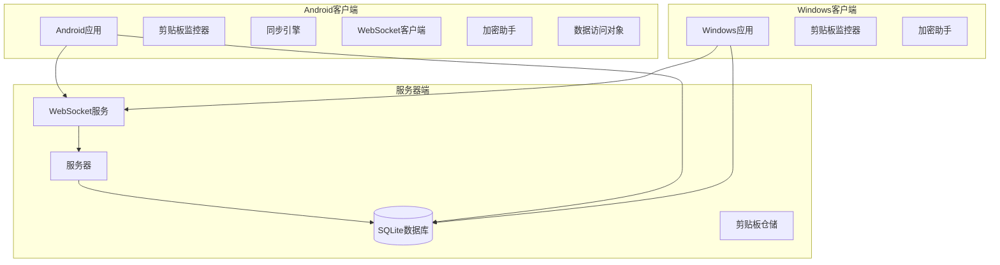
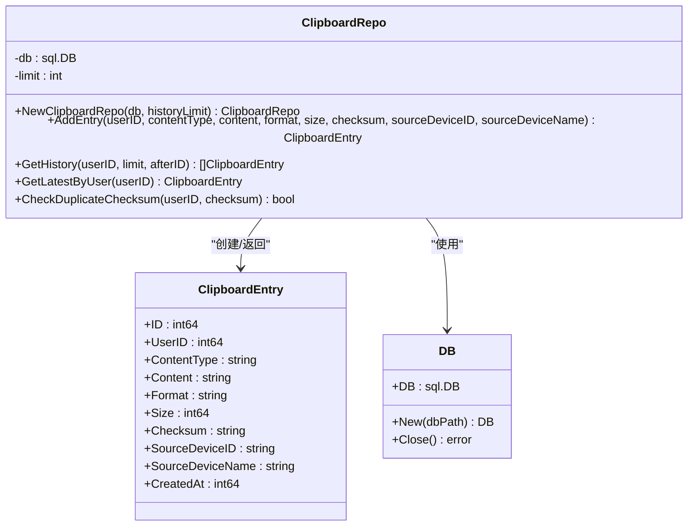
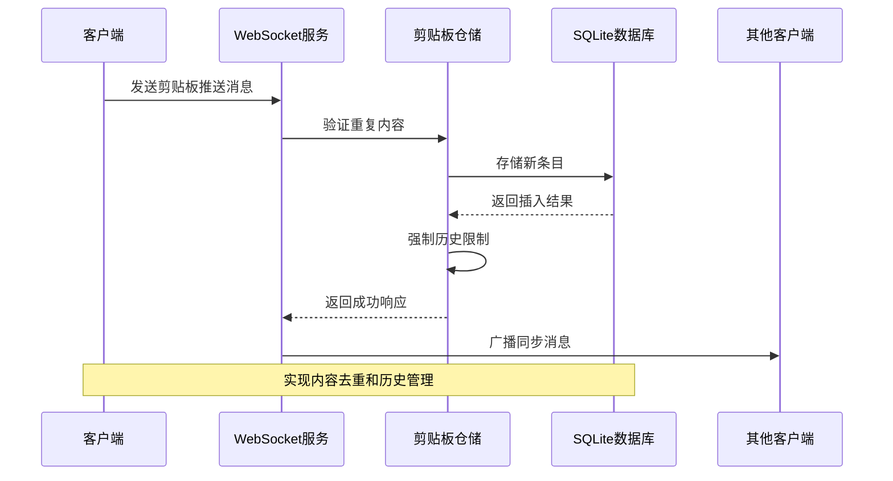
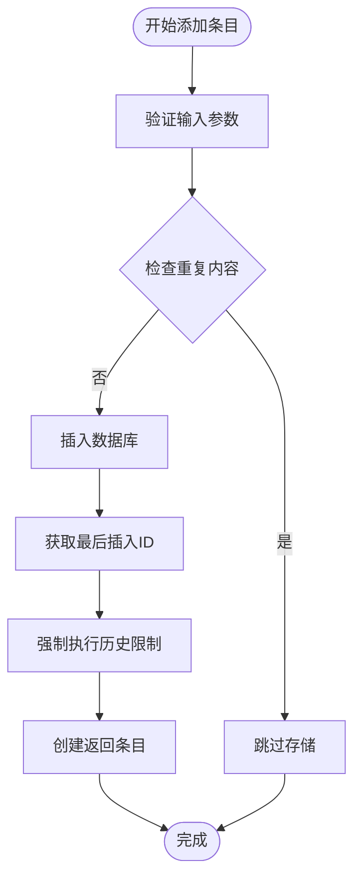
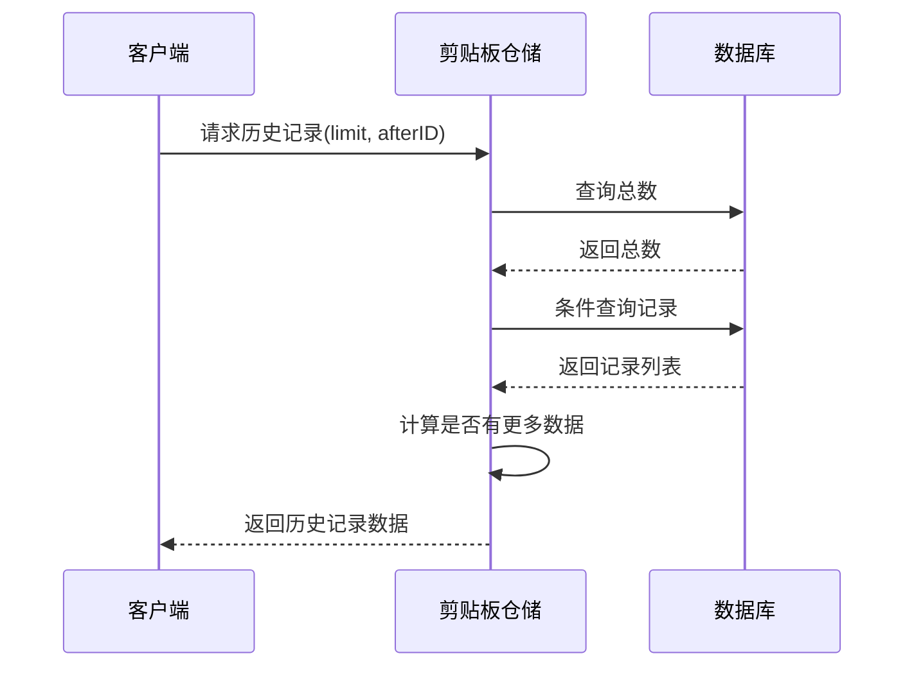
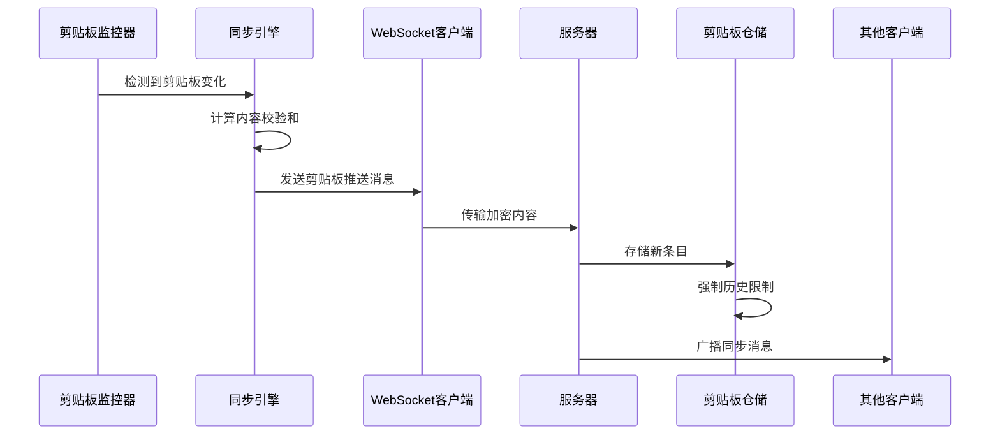
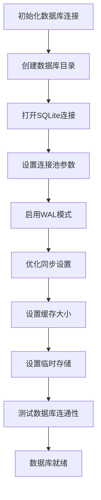
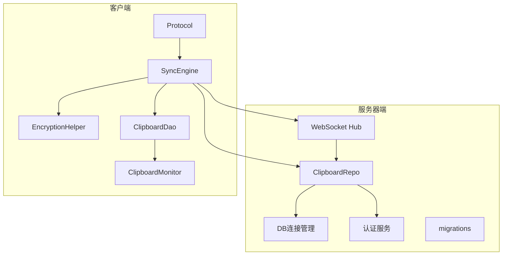

# 剪贴板仓储实现

<cite>
**本文档引用的文件**
- [clipboard_repo.go](file://clipSync-server/internal/database/clipboard_repo.go)
- [models.go](file://clipSync-server/internal/database/models.go)
- [db.go](file://clipSync-server/internal/database/db.go)
- [migrations.go](file://clipSync-server/internal/database/migrations.go)
- [SyncEngine.kt](file://clipSync-android/app/src/main/java/com/clipsync/app/core/SyncEngine.kt)
- [ClipboardMonitor.kt](file://clipSync-android/app/src/main/java/com/clipsync/app/core/ClipboardMonitor.kt)
- [EncryptionHelper.kt](file://clipSync-android/app/src/main/java/com/clipsync/app/core/EncryptionHelper.kt)
- [ClipboardDao.kt](file://clipSync-android/app/src/main/java/com/clipsync/app/data/ClipboardDao.kt)
- [ClipboardEntity.kt](file://clipSync-android/app/src/main/java/com/clipsync/app/data/entities/ClipboardEntity.kt)
- [Protocol.kt](file://clipSync-android/app/src/main/java/com/clipsync/app/network/Protocol.kt)
- [WebSocketClient.kt](file://clipSync-android/app/src/main/java/com/clipsync/app/network/WebSocketClient.kt)
- [ClipboardMonitor.cs](file://clipSync-windows/ClipSync.WPF/Core/ClipboardMonitor.cs)
- [EncryptionHelper.cs](file://clipSync-windows/ClipSync.WPF/Core/EncryptionHelper.cs)
- [client.go](file://clipSync-server/internal/websocket/client.go)
- [hub.go](file://clipSync-server/internal/websocket/hub.go)
- [aes.go](file://clipSync-server/internal/encryption/aes.go)
</cite>

## 目录
1. [简介](#简介)
2. [项目结构](#项目结构)
3. [核心组件](#核心组件)
4. [架构概览](#架构概览)
5. [详细组件分析](#详细组件分析)
6. [依赖关系分析](#依赖关系分析)
7. [性能考虑](#性能考虑)
8. [故障排除指南](#故障排除指南)
9. [结论](#结论)

## 简介

ClipSync是一个跨平台的剪贴板同步系统，支持Android、Windows和服务器端之间的实时剪贴板内容同步。本文档专注于服务器端的剪贴板仓储实现，详细解释ClipboardRepo结构体的设计和实现，包括剪贴板内容存储、检索、删除和历史记录管理等核心功能。

该系统采用SQLite作为本地存储，通过WebSocket实现实时通信，并使用AES-256-CBC加密确保数据安全。系统支持多种内容类型（文本、图片、文件），并提供完整的历史记录管理和去重机制。

## 项目结构

ClipSync项目采用多平台架构设计，主要包含以下组件：

**图表来源**
- [clipboard_repo.go:1-140](file://clipSync-server/internal/database/clipboard_repo.go#L1-140)
- [db.go:1-62](file://clipSync-server/internal/database/db.go#L1-62)

**章节来源**
- [clipboard_repo.go:1-140](file://clipSync-server/internal/database/clipboard_repo.go#L1-140)
- [db.go:1-62](file://clipSync-server/internal/database/db.go#L1-62)

## 核心组件

### ClipboardRepo结构体

ClipboardRepo是服务器端剪贴板数据的核心仓储类，负责所有与剪贴板历史相关的数据库操作。

**图表来源**
- [clipboard_repo.go:10-13](file://clipSync-server/internal/database/clipboard_repo.go#L10-13)
- [models.go:21-33](file://clipSync-server/internal/database/models.go#L21-33)
- [db.go:12-15](file://clipSync-server/internal/database/db.go#L12-15)

### 数据模型设计

系统使用标准化的数据模型来表示剪贴板条目：

| 字段名 | 类型 | 描述 | 约束 |
|--------|------|------|------|
| id | INTEGER | 主键，自增 | PRIMARY KEY |
| user_id | INTEGER | 用户ID | NOT NULL, FOREIGN KEY |
| content_type | TEXT | 内容类型 | NOT NULL, ENUM(text/image/file) |
| content | TEXT | 剪贴板内容 | NOT NULL |
| format | TEXT | MIME格式 | DEFAULT 'text/plain' |
| size | INTEGER | 内容大小(字节) | DEFAULT 0 |
| checksum | TEXT | 内容校验和 | NOT NULL |
| source_device_id | TEXT | 源设备ID | NOT NULL |
| source_device_name | TEXT | 源设备名称 | NOT NULL |
| created_at | INTEGER | 创建时间戳 | DEFAULT current_timestamp |

**章节来源**
- [models.go:21-33](file://clipSync-server/internal/database/models.go#L21-33)
- [migrations.go:47-63](file://clipSync-server/internal/database/migrations.go#L47-63)

## 架构概览

ClipSync采用分层架构设计，实现了完整的剪贴板同步生态系统：

**图表来源**
- [clipboard_repo.go:20-64](file://clipSync-server/internal/database/clipboard_repo.go#L20-64)
- [client.go:34-67](file://clipSync-server/internal/websocket/client.go#L34-67)

系统架构的关键特点：

1. **去重机制**：通过SHA-256校验和防止重复内容存储
2. **历史限制**：自动清理超出限制的历史记录
3. **实时同步**：基于WebSocket的双向通信
4. **数据完整性**：SQLite事务保证操作原子性
5. **跨平台兼容**：统一的消息格式和加密标准

## 详细组件分析

### 剪贴板仓储核心功能

#### 添加剪贴板条目

AddEntry方法实现了完整的剪贴板条目存储流程：

**图表来源**
- [clipboard_repo.go:20-64](file://clipSync-server/internal/database/clipboard_repo.go#L20-64)

#### 历史记录查询

GetHistory方法提供了灵活的历史记录查询功能：

**图表来源**
- [clipboard_repo.go:66-110](file://clipSync-server/internal/database/clipboard_repo.go#L66-110)

#### 内容去重检查

CheckDuplicateChecksum方法实现了高效的重复内容检测：

**章节来源**
- [clipboard_repo.go:128-139](file://clipSync-server/internal/database/clipboard_repo.go#L128-139)

### 加密与数据完整性

#### 跨平台加密标准

ClipSync实现了统一的加密标准，确保不同平台间的数据兼容性：

| 特性 | Android实现 | Windows实现 | 服务器实现 |
|------|-------------|-------------|------------|
| 加密算法 | AES-256-CBC | AES-256-CBC | AES-256-CBC |
| 密钥派生 | PBKDF2-SHA256 | PBKDF2-SHA256 | PBKDF2-SHA3-256 |
| 迭代次数 | 10,000 | 10,000 | 10,000 |
| 填充方式 | PKCS#7 | PKCS#7 | PKCS#7 |
| 格式 | base64(salt):base64(IV+ciphertext) | base64(salt):base64(IV+ciphertext) | base64(salt):base64(IV+ciphertext) |

#### 校验和计算

系统使用SHA-256算法生成内容校验和，用于：
- 防止重复内容存储
- 检测内容完整性
- 实现跨设备同步去重

**章节来源**
- [EncryptionHelper.kt:107-111](file://clipSync-android/app/src/main/java/com/clipsync/app/core/EncryptionHelper.kt#L107-111)
- [EncryptionHelper.cs:105-117](file://clipSync-windows/ClipSync.WPF/Core/EncryptionHelper.cs#L105-117)
- [aes.go:16-20](file://clipSync-server/internal/encryption/aes.go#L16-20)

### 同步引擎集成

#### Android端同步流程

**图表来源**
- [SyncEngine.kt:72-123](file://clipSync-android/app/src/main/java/com/clipsync/app/core/SyncEngine.kt#L72-123)
- [ClipboardMonitor.kt:79-93](file://clipSync-android/app/src/main/java/com/clipsync/app/core/ClipboardMonitor.kt#L79-93)

#### Windows端同步流程

Windows客户端实现了类似的同步机制，但针对WPF框架进行了优化：

**章节来源**
- [SyncEngine.kt:128-160](file://clipSync-android/app/src/main/java/com/clipsync/app/core/SyncEngine.kt#L128-160)
- [ClipboardMonitor.cs:58-87](file://clipSync-windows/ClipSync.WPF/Core/ClipboardMonitor.cs#L58-87)

### 数据库连接管理

#### SQLite配置优化

服务器端使用专门的SQLite连接管理器，优化了并发读取性能：

**图表来源**
- [db.go:17-55](file://clipSync-server/internal/database/db.go#L17-55)

**章节来源**
- [db.go:17-55](file://clipSync-server/internal/database/db.go#L17-55)

## 依赖关系分析

### 组件依赖图

**图表来源**
- [clipboard_repo.go:1-18](file://clipSync-server/internal/database/clipboard_repo.go#L1-18)
- [hub.go:44-58](file://clipSync-server/internal/websocket/hub.go#L44-58)

### 数据流依赖

系统中的关键数据流包括：

1. **写入路径**：客户端 → WebSocket → 服务器 → 数据库
2. **读取路径**：客户端请求 → 服务器查询 → 数据库返回 → WebSocket响应
3. **广播路径**：服务器 → WebSocket → 所有在线客户端

**章节来源**
- [hub.go:114-121](file://clipSync-server/internal/websocket/hub.go#L114-121)
- [client.go:34-67](file://clipSync-server/internal/websocket/client.go#L34-67)

## 性能考虑

### 数据库性能优化

1. **索引策略**：为用户ID、校验和和创建时间建立复合索引
2. **连接池管理**：限制最大连接数，优化空闲连接数量
3. **WAL模式**：提高并发读取性能
4. **缓存配置**：调整缓存大小和临时存储位置

### 内存管理

1. **批量操作**：使用批量插入减少数据库往返
2. **流式处理**：大文件内容使用流式处理避免内存溢出
3. **连接复用**：复用数据库连接减少开销

### 网络优化

1. **心跳机制**：定期发送心跳保持连接活跃
2. **消息缓冲**：使用缓冲通道提高消息处理效率
3. **错误恢复**：实现自动重连机制

## 故障排除指南

### 常见问题及解决方案

#### 数据库连接问题

**症状**：应用启动时无法连接数据库
**原因**：数据库文件权限或路径问题
**解决**：检查数据库目录权限，确保应用程序有写入权限

#### 同步延迟问题

**症状**：剪贴板内容同步存在延迟
**原因**：网络延迟或WebSocket连接不稳定
**解决**：检查网络连接质量，重启WebSocket客户端

#### 内容重复问题

**症状**：历史记录中出现重复内容
**原因**：校验和计算错误或去重逻辑失效
**解决**：重新计算校验和，检查去重逻辑

#### 加密解密失败

**症状**：内容无法正确解密
**原因**：密码不匹配或加密格式错误
**解决**：确认使用正确的密码，检查加密格式兼容性

**章节来源**
- [db.go:18-55](file://clipSync-server/internal/database/db.go#L18-55)
- [clipboard_repo.go:128-139](file://clipSync-server/internal/database/clipboard_repo.go#L128-139)

## 结论

ClipSync的剪贴板仓储实现展现了现代分布式系统的最佳实践：

1. **架构设计**：清晰的分层架构和职责分离
2. **数据完整性**：完善的去重机制和校验和验证
3. **性能优化**：针对SQLite和WebSocket的专门优化
4. **跨平台兼容**：统一的协议和加密标准
5. **可扩展性**：模块化的组件设计便于功能扩展

该实现为跨平台剪贴板同步提供了一个可靠、高效且安全的解决方案，适用于各种应用场景，从个人使用到企业级部署都能满足需求。