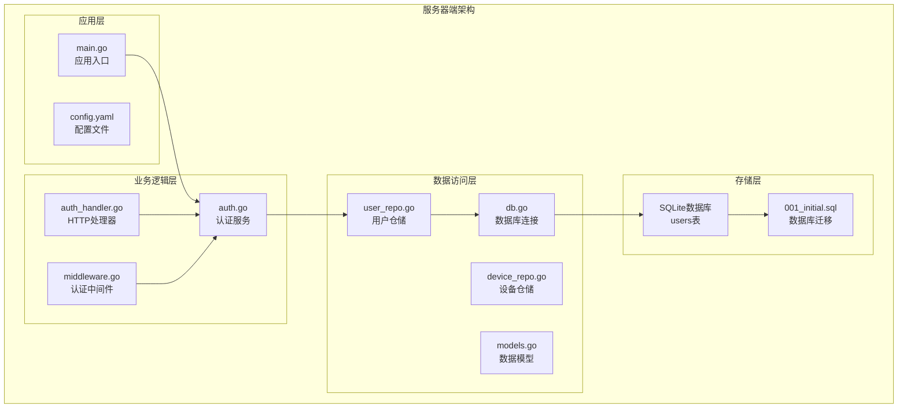
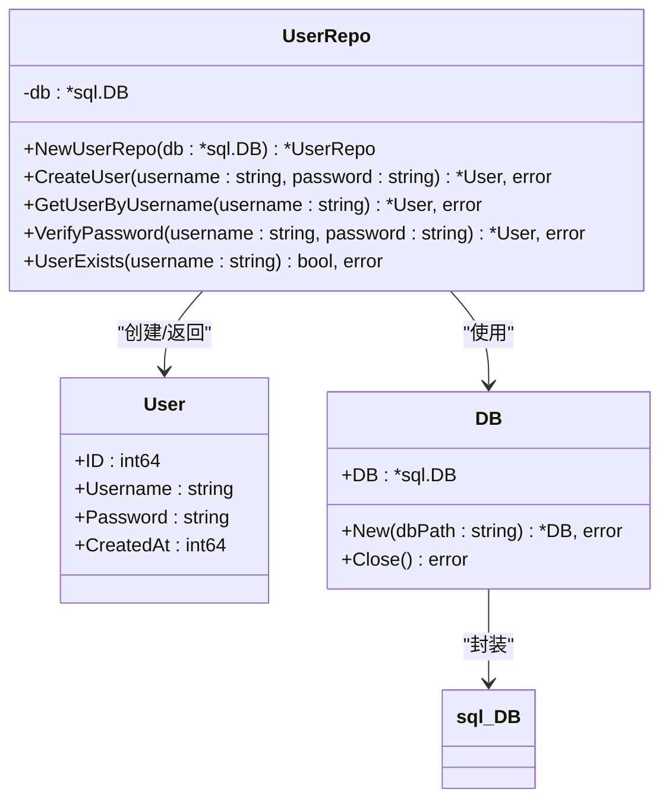
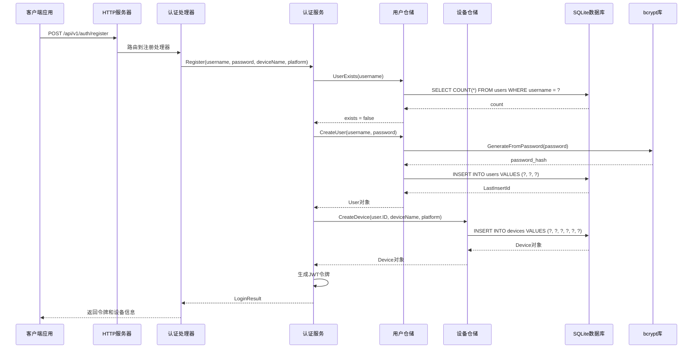
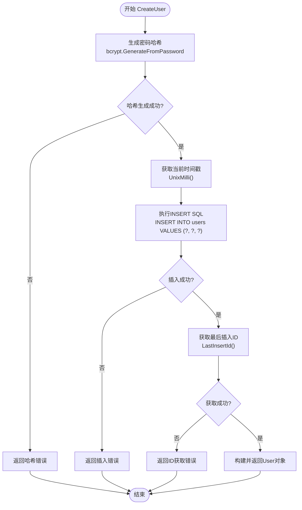
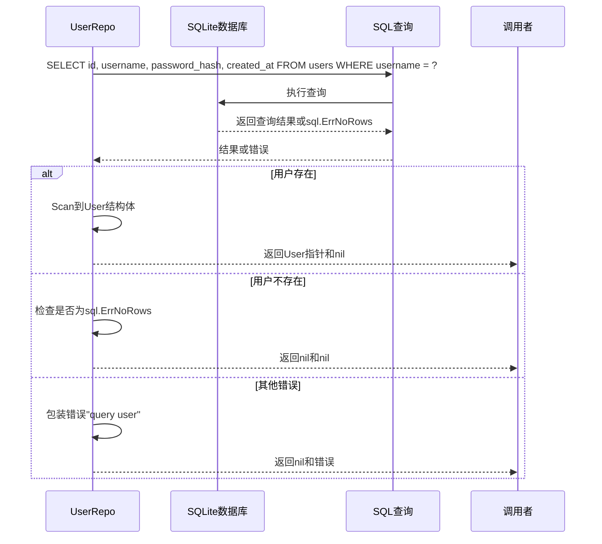
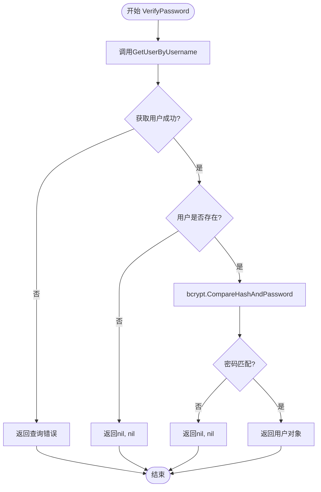
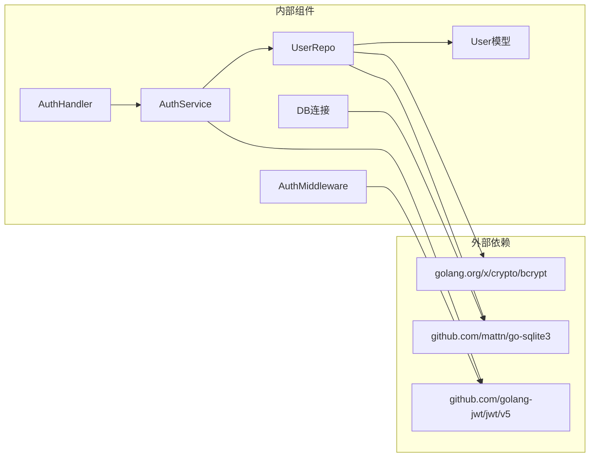
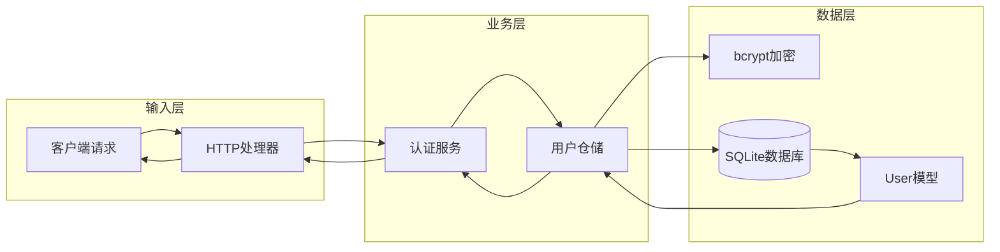

# 用户仓储实现

<cite>
**本文档引用的文件**
- [user_repo.go](file://clipSync-server/internal/database/user_repo.go)
- [models.go](file://clipSync-server/internal/database/models.go)
- [db.go](file://clipSync-server/internal/database/db.go)
- [001_initial.sql](file://clipSync-server/migrations/001_initial.sql)
- [main.go](file://clipSync-server/cmd/server/main.go)
- [auth.go](file://clipSync-server/internal/auth/auth.go)
- [auth_handler.go](file://clipSync-server/internal/httpserver/auth_handler.go)
- [jwt.go](file://clipSync-server/internal/auth/jwt.go)
- [errors.go](file://clipSync-server/internal/auth/errors.go)
- [middleware.go](file://clipSync-server/internal/auth/middleware.go)
- [config.yaml](file://clipSync-server/configs/config.yaml)
</cite>

## 目录
1. [简介](#简介)
2. [项目结构](#项目结构)
3. [核心组件](#核心组件)
4. [架构概览](#架构概览)
5. [详细组件分析](#详细组件分析)
6. [依赖关系分析](#依赖关系分析)
7. [性能考虑](#性能考虑)
8. [故障排除指南](#故障排除指南)
9. [结论](#结论)

## 简介

本文档深入分析了ClipSync服务器中的用户仓储实现（UserRepo）。UserRepo是负责用户相关数据库操作的核心组件，实现了用户创建、用户查询、密码验证和用户存在性检查等关键功能。该实现采用SQLite作为存储后端，使用bcrypt进行密码哈希处理，并通过JWT实现安全的身份验证。

## 项目结构

ClipSync是一个跨平台的剪贴板同步解决方案，包含Android、Windows和服务器端三个主要部分。用户仓储实现位于服务器端的数据库层：

**图表来源**
- [main.go:21-70](file://clipSync-server/cmd/server/main.go#L21-L70)
- [user_repo.go:11-19](file://clipSync-server/internal/database/user_repo.go#L11-L19)
- [db.go:12-56](file://clipSync-server/internal/database/db.go#L12-L56)

**章节来源**
- [main.go:1-146](file://clipSync-server/cmd/server/main.go#L1-L146)
- [config.yaml:1-29](file://clipSync-server/configs/config.yaml#L1-L29)

## 核心组件

### UserRepo结构体设计

UserRepo是用户仓储的核心实现，负责所有与用户相关的数据库操作：

**图表来源**
- [user_repo.go:11-19](file://clipSync-server/internal/database/user_repo.go#L11-L19)
- [models.go:3-9](file://clipSync-server/internal/database/models.go#L3-L9)
- [db.go:12-15](file://clipSync-server/internal/database/db.go#L12-L15)

### 数据模型定义

用户模型采用简洁的设计，包含必要的标识符和元数据：

| 字段名 | 类型 | 描述 | 约束 |
|--------|------|------|------|
| ID | int64 | 用户唯一标识符 | 主键，自增 |
| Username | string | 用户名 | 唯一，非空 |
| Password | string | bcrypt哈希后的密码 | 非空 |
| CreatedAt | int64 | 创建时间戳（毫秒） | 非空，默认当前时间 |

**章节来源**
- [models.go:3-9](file://clipSync-server/internal/database/models.go#L3-L9)
- [001_initial.sql:5-10](file://clipSync-server/migrations/001_initial.sql#L5-L10)

## 架构概览

用户仓储在整个系统架构中的位置和交互关系如下：

**图表来源**
- [auth_handler.go:111-175](file://clipSync-server/internal/httpserver/auth_handler.go#L111-L175)
- [auth.go:32-65](file://clipSync-server/internal/auth/auth.go#L32-L65)
- [user_repo.go:21-47](file://clipSync-server/internal/database/user_repo.go#L21-L47)

## 详细组件分析

### CreateUser方法实现

CreateUser方法负责创建新用户，包含密码哈希处理和数据库插入操作：

**图表来源**
- [user_repo.go:21-47](file://clipSync-server/internal/database/user_repo.go#L21-L47)

**方法签名**: `CreateUser(username string, password string) (*User, error)`

**参数规范**:
- `username`: 用户名字符串，必须非空且唯一
- `password`: 明文密码字符串，将自动进行bcrypt哈希处理

**返回值**:
- 成功时返回指向User结构体的指针和nil错误
- 失败时返回nil和包装后的错误

**错误处理机制**:
- 密码哈希失败：返回"hash password"错误
- 数据库插入失败：返回"insert user"错误  
- 获取最后插入ID失败：返回"get last insert id"错误

**章节来源**
- [user_repo.go:21-47](file://clipSync-server/internal/database/user_repo.go#L21-L47)
- [models.go:3-9](file://clipSync-server/internal/database/models.go#L3-L9)

### GetUserByUsername方法实现

GetUserByUsername方法用于根据用户名检索用户信息：

**图表来源**
- [user_repo.go:49-63](file://clipSync-server/internal/database/user_repo.go#L49-L63)

**方法签名**: `GetUserByUsername(username string) (*User, error)`

**参数规范**:
- `username`: 要查询的用户名字符串

**返回值**:
- 找到用户：返回User指针和nil
- 用户不存在：返回nil和nil
- 查询错误：返回nil和包装后的错误

**错误处理机制**:
- 正常的"未找到记录"情况：返回nil, nil
- 其他SQL错误：返回"query user"错误

**章节来源**
- [user_repo.go:49-63](file://clipSync-server/internal/database/user_repo.go#L49-L63)

### VerifyPassword方法实现

VerifyPassword方法实现了密码验证功能，结合了用户查询和密码比较：

**图表来源**
- [user_repo.go:65-80](file://clipSync-server/internal/database/user_repo.go#L65-L80)

**方法签名**: `VerifyPassword(username string, password string) (*User, error)`

**参数规范**:
- `username`: 用户名字符串
- `password`: 待验证的明文密码

**返回值**:
- 验证成功：返回User指针和nil
- 验证失败或用户不存在：返回nil和nil
- 发生错误：返回nil和包装后的错误

**错误处理机制**:
- 用户查询错误：直接返回错误
- 用户不存在：返回nil, nil
- 密码不匹配：返回nil, nil
- bcrypt比较错误：返回nil, nil

**章节来源**
- [user_repo.go:65-80](file://clipSync-server/internal/database/user_repo.go#L65-L80)

### UserExists方法实现

UserExists方法提供了高效的用户存在性检查功能：

**方法签名**: `UserExists(username string) (bool, error)`

**实现特点**:
- 使用COUNT(*)查询优化性能
- 直接返回布尔值而非User对象
- 错误处理与查询方法保持一致

**参数规范**:
- `username`: 要检查的用户名字符串

**返回值**:
- 存在：返回true和nil
- 不存在：返回false和nil
- 查询错误：返回false和包装后的错误

**章节来源**
- [user_repo.go:82-90](file://clipSync-server/internal/database/user_repo.go#L82-L90)

## 依赖关系分析

### 组件耦合度分析

**图表来源**
- [user_repo.go:3-9](file://clipSync-server/internal/database/user_repo.go#L3-L9)
- [auth.go:3-6](file://clipSync-server/internal/auth/auth.go#L3-L6)
- [db.go:3-10](file://clipSync-server/internal/database/db.go#L3-L10)

### 数据流分析

用户仓储的数据流遵循标准的CRUD模式，同时集成了密码学和认证功能：

**图表来源**
- [auth_handler.go:63-109](file://clipSync-server/internal/httpserver/auth_handler.go#L63-L109)
- [auth.go:67-116](file://clipSync-server/internal/auth/auth.go#L67-L116)
- [user_repo.go:21-80](file://clipSync-server/internal/database/user_repo.go#L21-L80)

**章节来源**
- [auth.go:15-22](file://clipSync-server/internal/auth/auth.go#L15-L22)
- [user_repo.go:16-19](file://clipSync-server/internal/database/user_repo.go#L16-L19)

## 性能考虑

### 数据库优化策略

1. **连接池配置**: 最大打开连接数4个，空闲连接2个，适合2核2G服务器配置
2. **WAL模式**: 启用写-ahead logging提高并发读取性能
3. **缓存优化**: 设置缓存大小为2MB，临时存储使用内存
4. **索引优化**: users表的username字段具有UNIQUE约束，提供快速查找

### 密码哈希性能

- 使用默认成本因子，平衡安全性与性能
- bcrypt哈希在用户创建时执行，避免重复计算
- 验证时仅进行哈希比较，复杂度O(1)

### 内存使用优化

- 查询结果使用单行扫描，避免大对象加载
- UserExists使用COUNT(*)减少数据传输
- 及时关闭数据库连接和资源

## 故障排除指南

### 常见错误类型及处理

| 错误类型 | 触发条件 | 处理建议 |
|----------|----------|----------|
| 哈希生成失败 | bcrypt.GenerateFromPassword错误 | 检查系统熵源和内存资源 |
| 数据库连接失败 | SQLite连接或Ping失败 | 检查数据库文件权限和路径 |
| 用户名冲突 | INSERT违反UNIQUE约束 | 提示用户选择其他用户名 |
| 密码验证失败 | bcrypt比较返回错误 | 提示用户检查用户名和密码 |
| 查询超时 | 数据库繁忙或锁等待 | 优化查询或增加连接池 |

### 调试技巧

1. **启用详细日志**: 在main.go中设置log.Lshortfile标志
2. **检查数据库状态**: 使用db.Ping()验证连接有效性
3. **监控连接池**: 观察最大连接数和活跃连接数
4. **验证迁移**: 确认users表结构正确创建

**章节来源**
- [db.go:58-62](file://clipSync-server/internal/database/db.go#L58-L62)
- [main.go:21-54](file://clipSync-server/cmd/server/main.go#L21-L54)

## 结论

UserRepo作为ClipSync服务器的核心组件，实现了安全、高效、可维护的用户管理功能。其设计特点包括：

1. **安全性**: 采用bcrypt进行密码哈希，防止明文存储
2. **可靠性**: 完善的错误处理和事务支持
3. **性能**: 优化的数据库配置和查询策略
4. **可扩展性**: 清晰的接口设计便于功能扩展

该实现为整个ClipSync系统的身份认证提供了坚实的基础，支持用户注册、登录验证和设备管理等核心功能。通过合理的架构设计和最佳实践，确保了系统的安全性和稳定性。