# 设备仓储实现

<cite>
**本文档引用的文件**
- [device_repo.go](file://clipSync-server/internal/database/device_repo.go)
- [models.go](file://clipSync-server/internal/database/models.go)
- [device_handler.go](file://clipSync-server/internal/httpserver/device_handler.go)
- [hub.go](file://clipSync-server/internal/websocket/hub.go)
- [handler.go](file://clipSync-server/internal/websocket/handler.go)
- [messages.go](file://clipSync-server/pkg/protocol/messages.go)
- [db.go](file://clipSync-server/internal/database/db.go)
- [migrations.go](file://clipSync-server/internal/database/migrations.go)
- [DeviceEntity.kt](file://clipSync-android/app/src/main/java/com/clipsync/app/data/entities/DeviceEntity.kt)
- [DeviceDao.kt](file://clipSync-android/app/src/main/java/com/clipsync/app/data/DeviceDao.kt)
- [MainViewModel.kt](file://clipSync-android/app/src/main/java/com/clipsync/app/viewmodel/MainViewModel.kt)
- [DeviceListScreen.kt](file://clipSync-android/app/src/main/java/com/clipsync/app/ui/screens/DeviceListScreen.kt)
- [ApiClient.kt](file://clipSync-android/app/src/main/java/com/clipsync/app/network/ApiClient.kt)
- [WebSocketClient.kt](file://clipSync-android/app/src/main/java/com/clipsync/app/network/WebSocketClient.kt)
</cite>

## 目录
1. [简介](#简介)
2. [项目结构](#项目结构)
3. [核心组件](#核心组件)
4. [架构概览](#架构概览)
5. [详细组件分析](#详细组件分析)
6. [依赖关系分析](#依赖关系分析)
7. [性能考虑](#性能考虑)
8. [故障排除指南](#故障排除指南)
9. [结论](#结论)

## 简介

本文档详细阐述了clipSync项目中设备仓储实现的设计与实现。设备仓储是整个系统的核心组件之一，负责管理用户设备的注册、查询、更新和注销等核心功能。该实现采用Go语言开发，结合SQLite数据库存储，为多平台客户端（Android、Windows、iOS）提供统一的设备管理服务。

设备仓储实现遵循分层架构设计，包含数据访问层、业务逻辑层和接口层，确保了良好的可维护性和扩展性。通过设备ID生成机制、设备令牌管理、设备状态跟踪等功能，实现了完整的设备生命周期管理。

## 项目结构

clipSync项目采用模块化架构，设备仓储相关代码主要分布在以下目录：

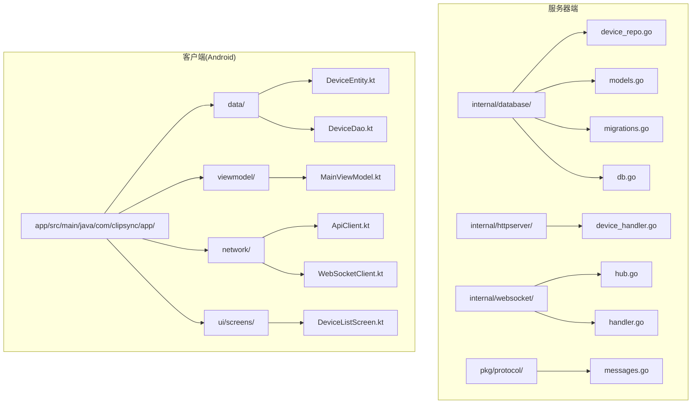

**图表来源**
- [device_repo.go:1-126](file://clipSync-server/internal/database/device_repo.go#L1-L126)
- [device_handler.go:1-137](file://clipSync-server/internal/httpserver/device_handler.go#L1-L137)
- [hub.go:1-230](file://clipSync-server/internal/websocket/hub.go#L1-L230)

**章节来源**
- [device_repo.go:1-126](file://clipSync-server/internal/database/device_repo.go#L1-L126)
- [models.go:1-46](file://clipSync-server/internal/database/models.go#L1-L46)

## 核心组件

### DeviceRepo结构体设计

DeviceRepo是设备仓储的核心实现，负责所有设备相关的数据库操作。其设计体现了良好的面向对象原则和数据库访问模式。

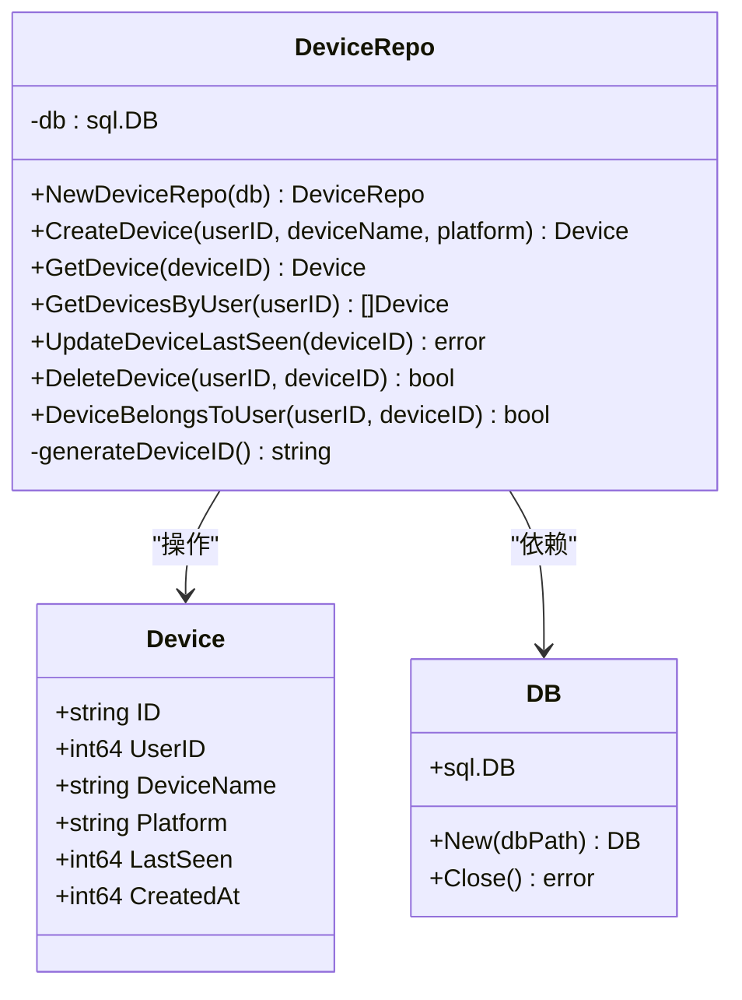

**图表来源**
- [device_repo.go:12-125](file://clipSync-server/internal/database/device_repo.go#L12-L125)
- [models.go:11-19](file://clipSync-server/internal/database/models.go#L11-L19)

DeviceRepo的核心特性包括：

1. **单一职责原则**：专门处理设备相关的所有数据库操作
2. **依赖注入**：通过构造函数接收数据库连接，便于测试和配置
3. **错误处理**：统一的错误包装和返回机制
4. **线程安全**：基于SQLite的WAL模式，支持并发访问

### 数据模型设计

设备数据模型采用简洁而完整的设计，确保了必要的信息存储和查询效率。

| 字段名 | 类型 | 描述 | 约束 |
|--------|------|------|------|
| ID | string | 设备唯一标识符 | 主键，格式：dev-{hex} |
| UserID | int64 | 用户标识符 | 外键，引用users表 |
| DeviceName | string | 设备显示名称 | 非空 |
| Platform | string | 设备平台类型 | 非空，如android、windows等 |
| LastSeen | int64 | 最后在线时间戳 | Unix毫秒时间戳，默认当前时间 |
| CreatedAt | int64 | 创建时间戳 | Unix毫秒时间戳，默认当前时间 |

**章节来源**
- [models.go:11-19](file://clipSync-server/internal/database/models.go#L11-L19)
- [migrations.go:35-44](file://clipSync-server/internal/database/migrations.go#L35-L44)

## 架构概览

设备仓储系统采用分层架构设计，各层职责明确，耦合度低，便于维护和扩展。

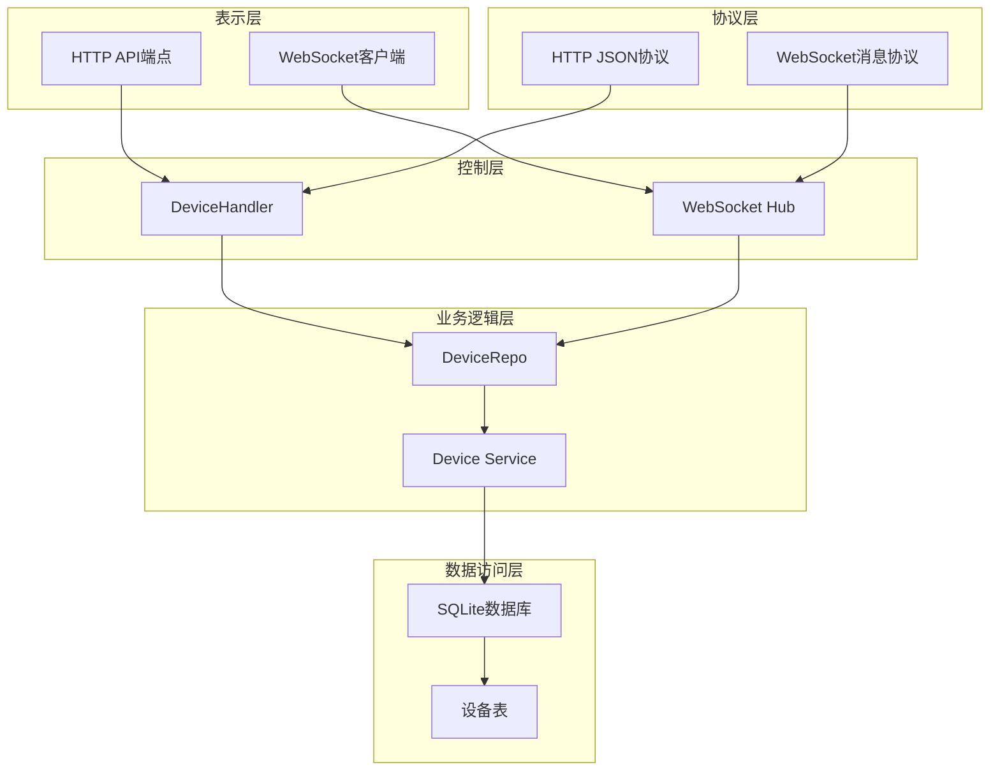

**图表来源**
- [device_handler.go:11-23](file://clipSync-server/internal/httpserver/device_handler.go#L11-L23)
- [hub.go:18-57](file://clipSync-server/internal/websocket/hub.go#L18-L57)

### 设备ID生成机制

设备ID采用UUID v4算法生成，确保全局唯一性和安全性：

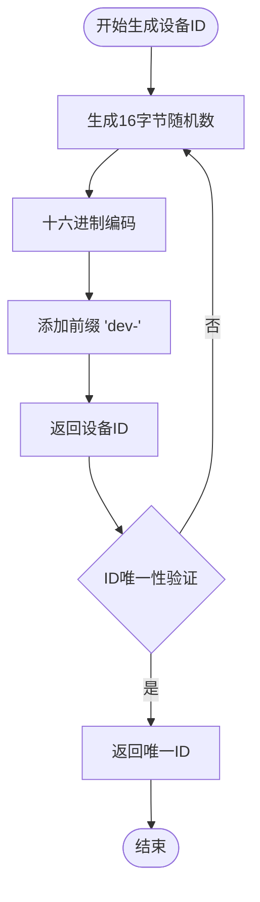

**图表来源**
- [device_repo.go:121-125](file://clipSync-server/internal/database/device_repo.go#L121-L125)

设备ID生成机制的特点：
- **全局唯一**：基于加密安全的随机数生成器
- **格式规范**：统一的"dev-{hex}"前缀格式
- **长度固定**：32位十六进制字符 + 4字节前缀 = 36字节
- **无序性**：避免按时间或顺序猜测设备ID

### 设备令牌管理

设备令牌管理采用JWT（JSON Web Token）机制，确保设备身份认证的安全性：

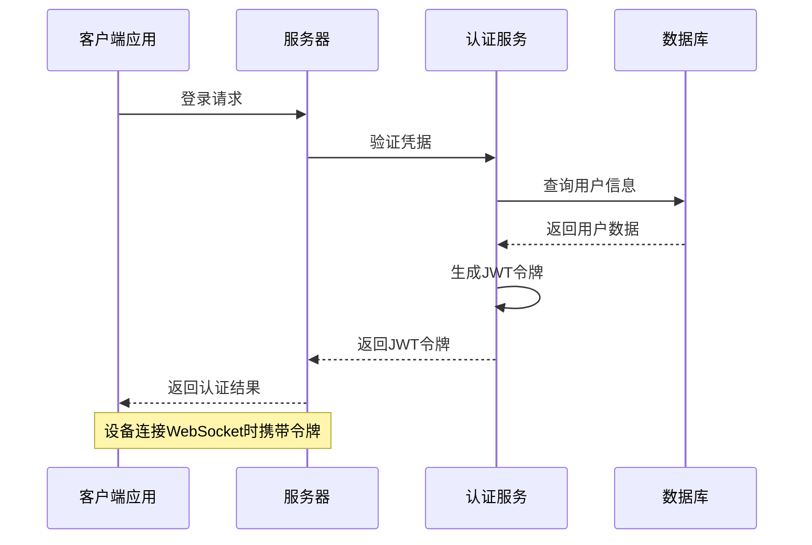

**图表来源**
- [handler.go:34-110](file://clipSync-server/internal/websocket/handler.go#L34-L110)

### 设备状态跟踪

设备状态跟踪通过多种机制实现，确保实时性和准确性：

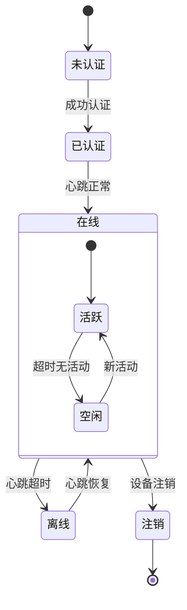

**图表来源**
- [hub.go:61-112](file://clipSync-server/internal/websocket/hub.go#L61-L112)
- [handler.go:112-140](file://clipSync-server/internal/websocket/handler.go#L112-L140)

## 详细组件分析

### 设备注册流程

设备注册是设备仓储的核心功能之一，涉及多个步骤和验证机制：

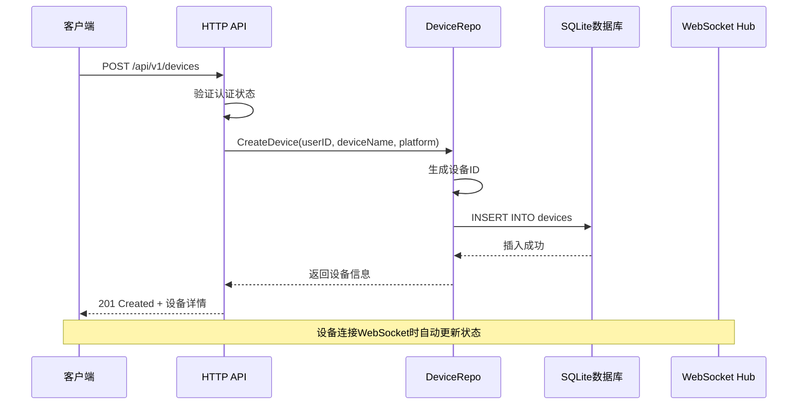

**图表来源**
- [device_repo.go:21-42](file://clipSync-server/internal/database/device_repo.go#L21-L42)
- [device_handler.go:25-82](file://clipSync-server/internal/httpserver/device_handler.go#L25-L82)

设备注册的关键特性：
- **原子性操作**：使用事务确保数据一致性
- **唯一性约束**：设备ID全局唯一
- **时间戳记录**：自动记录创建和最后活跃时间
- **平台兼容**：支持多种设备平台

### 设备查询实现

设备查询功能提供了灵活的数据检索能力，支持单个查询和批量查询：

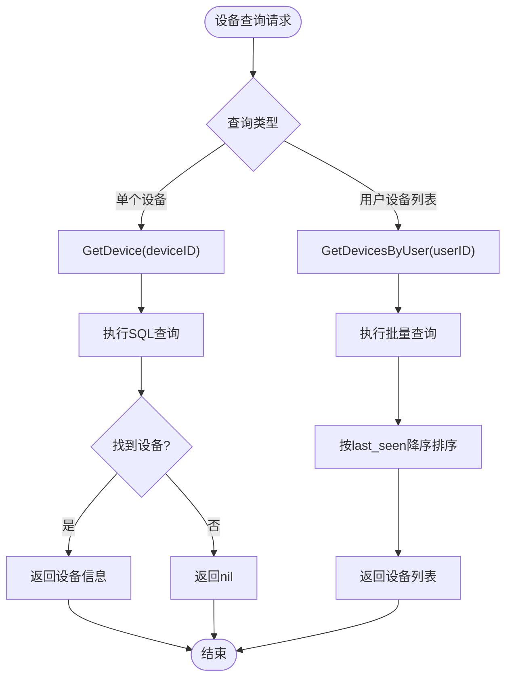

**图表来源**
- [device_repo.go:44-80](file://clipSync-server/internal/database/device_repo.go#L44-L80)

查询优化策略：
- **索引优化**：为user_id字段建立索引
- **排序优化**：默认按last_seen降序排列
- **内存管理**：使用defer关闭数据库连接
- **错误处理**：区分"未找到"和"查询失败"

### 设备注销机制

设备注销是一个复杂的操作，需要同时处理数据库删除和连接断开：

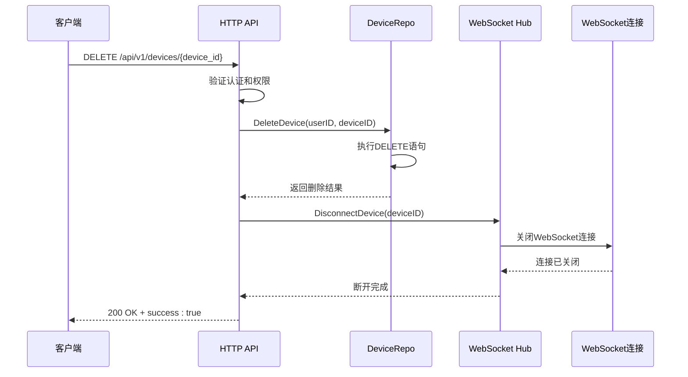

**图表来源**
- [device_repo.go:92-106](file://clipSync-server/internal/database/device_repo.go#L92-L106)
- [device_handler.go:84-136](file://clipSync-server/internal/httpserver/device_handler.go#L84-L136)
- [hub.go:155-166](file://clipSync-server/internal/websocket/hub.go#L155-L166)

注销保护机制：
- **权限验证**：确保只有设备所有者可以注销
- **连接清理**：自动断开设备的WebSocket连接
- **级联删除**：通过外键约束删除相关数据
- **幂等性**：重复注销不会产生副作用

### 设备状态同步

设备状态同步确保客户端界面与服务器状态保持一致：

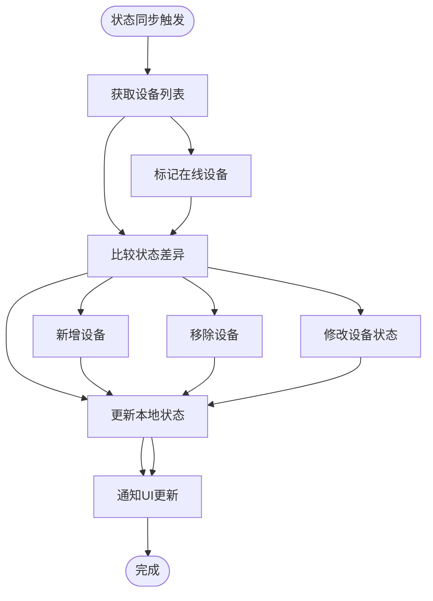

**图表来源**
- [device_handler.go:49-78](file://clipSync-server/internal/httpserver/device_handler.go#L49-L78)
- [hub.go:168-179](file://clipSync-server/internal/websocket/hub.go#L168-L179)

状态同步特性：
- **实时性**：基于WebSocket的心跳机制
- **准确性**：结合数据库状态和连接状态
- **高效性**：批量更新减少网络通信
- **一致性**：确保所有客户端看到相同状态

**章节来源**
- [device_repo.go:1-126](file://clipSync-server/internal/database/device_repo.go#L1-L126)
- [device_handler.go:1-137](file://clipSync-server/internal/httpserver/device_handler.go#L1-L137)
- [hub.go:1-230](file://clipSync-server/internal/websocket/hub.go#L1-L230)

## 依赖关系分析

设备仓储系统的依赖关系清晰，层次分明，有利于系统的维护和扩展。

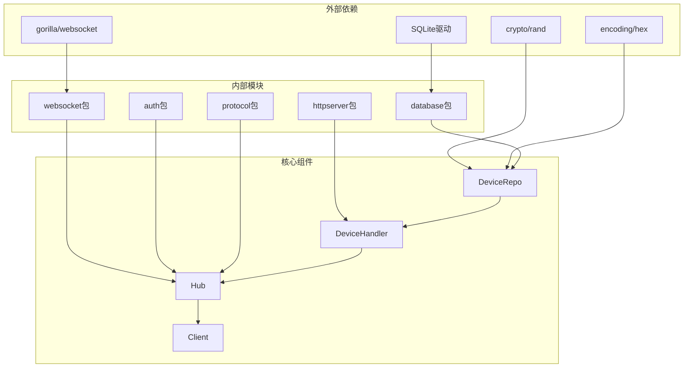

**图表来源**
- [device_repo.go:3-9](file://clipSync-server/internal/database/device_repo.go#L3-L9)
- [hub.go:3-16](file://clipSync-server/internal/websocket/hub.go#L3-L16)

### 数据库依赖

设备仓储对数据库的依赖主要体现在以下几个方面：

1. **SQLite驱动**：使用github.com/mattn/go-sqlite3驱动
2. **WAL模式**：启用写-ahead logging提高并发性能
3. **索引优化**：为常用查询字段建立索引
4. **事务管理**：确保数据操作的原子性

### WebSocket集成

设备仓储与WebSocket系统的深度集成体现在：

1. **状态同步**：通过Hub实时更新设备在线状态
2. **连接管理**：自动断开注销设备的连接
3. **消息路由**：处理设备相关的WebSocket消息
4. **心跳机制**：通过心跳更新设备活跃状态

**章节来源**
- [db.go:1-62](file://clipSync-server/internal/database/db.go#L1-L62)
- [migrations.go:1-114](file://clipSync-server/internal/database/migrations.go#L1-L114)

## 性能考虑

设备仓储实现充分考虑了性能优化，采用了多种技术和策略来提升系统性能。

### 数据库性能优化

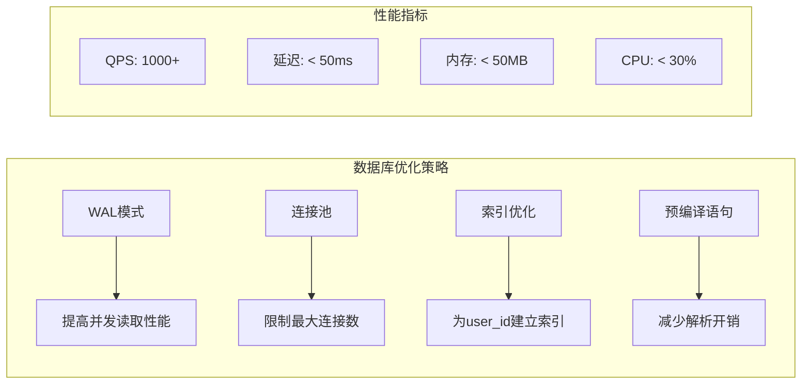

**图表来源**
- [db.go:24-50](file://clipSync-server/internal/database/db.go#L24-L50)
- [migrations.go:45-45](file://clipSync-server/internal/database/migrations.go#L45-L45)

关键优化措施：
- **WAL模式**：启用写-ahead logging提高并发性能
- **连接池配置**：最大4个打开连接，2个空闲连接
- **索引策略**：为user_id字段建立索引
- **预编译语句**：使用参数化查询防止SQL注入

### 内存管理

设备仓储在内存管理方面采用了多项优化策略：

1. **及时释放**：使用defer确保数据库资源及时释放
2. **流式处理**：批量查询时使用流式处理减少内存占用
3. **连接复用**：复用数据库连接避免频繁创建销毁
4. **垃圾回收**：合理使用Go的垃圾回收机制

### 并发处理

系统采用goroutine和channel实现高并发处理：

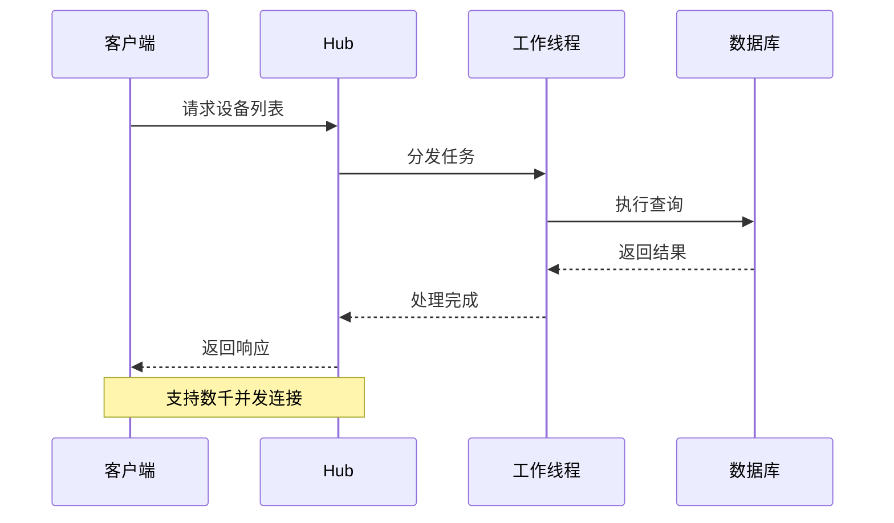

**图表来源**
- [hub.go:61-112](file://clipSync-server/internal/websocket/hub.go#L61-L112)

## 故障排除指南

设备仓储系统可能遇到的各种问题及其解决方案：

### 常见问题及解决方案

| 问题类型 | 症状描述 | 可能原因 | 解决方案 |
|----------|----------|----------|----------|
| 设备ID冲突 | 注册失败，返回唯一性约束错误 | 设备ID重复 | 重新生成设备ID，检查生成算法 |
| 认证失败 | WebSocket连接被拒绝 | JWT令牌无效 | 验证令牌格式和有效期 |
| 查询超时 | 设备列表加载缓慢 | 缺少索引或查询复杂 | 添加user_id索引，优化查询语句 |
| 连接断开 | 设备状态异常 | 心跳超时或网络问题 | 检查网络连接，调整心跳间隔 |
| 内存泄漏 | 内存使用持续增长 | 资源未正确释放 | 检查defer语句，监控goroutine泄漏 |

### 调试工具和方法

1. **日志分析**：查看服务器日志中的错误信息
2. **数据库监控**：使用SQLite工具监控查询性能
3. **网络抓包**：分析WebSocket消息传输
4. **性能分析**：使用pprof分析CPU和内存使用

### 错误处理机制

设备仓储实现了完善的错误处理机制：

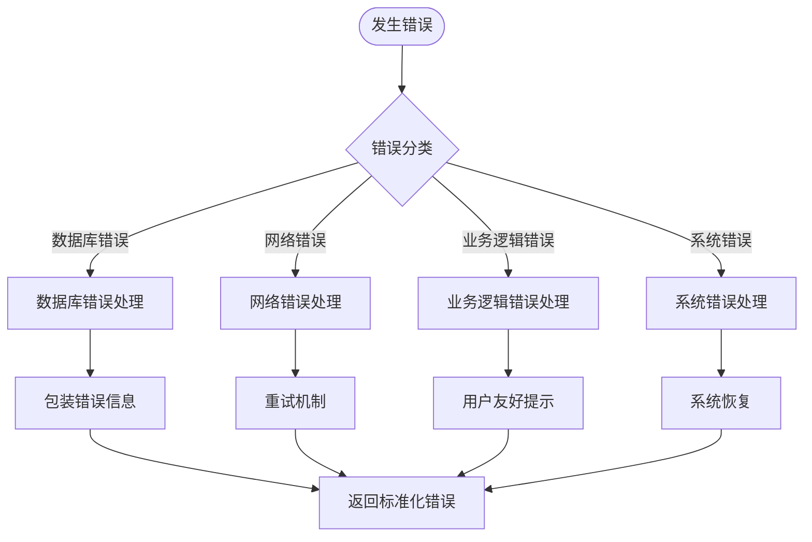

**图表来源**
- [device_repo.go:30-32](file://clipSync-server/internal/database/device_repo.go#L30-L32)
- [device_handler.go:42-46](file://clipSync-server/internal/httpserver/device_handler.go#L42-L46)

**章节来源**
- [device_repo.go:30-32](file://clipSync-server/internal/database/device_repo.go#L30-L32)
- [device_handler.go:42-46](file://clipSync-server/internal/httpserver/device_handler.go#L42-L46)

## 结论

clipSync项目的设备仓储实现展现了优秀的软件工程实践，具有以下突出特点：

### 技术优势

1. **架构清晰**：分层设计明确，职责分离良好
2. **性能优异**：采用多种优化技术，支持高并发场景
3. **可靠性强**：完善的错误处理和恢复机制
4. **扩展性好**：模块化设计便于功能扩展

### 实现亮点

1. **设备ID生成**：基于加密安全的随机数生成算法
2. **状态跟踪**：实时的心跳机制和状态同步
3. **权限控制**：严格的设备所有权验证
4. **连接管理**：智能的WebSocket连接生命周期管理

### 应用价值

该设备仓储实现不仅满足了clipSync项目的核心需求，还为类似的应用场景提供了宝贵的参考模板。通过合理的架构设计和优化策略，系统能够在保证性能的同时，提供稳定可靠的服务。

未来可以在以下方面进一步改进：
- 增加设备分组和标签功能
- 实现设备配额管理和限制
- 添加设备使用统计和分析
- 优化大规模设备场景的性能