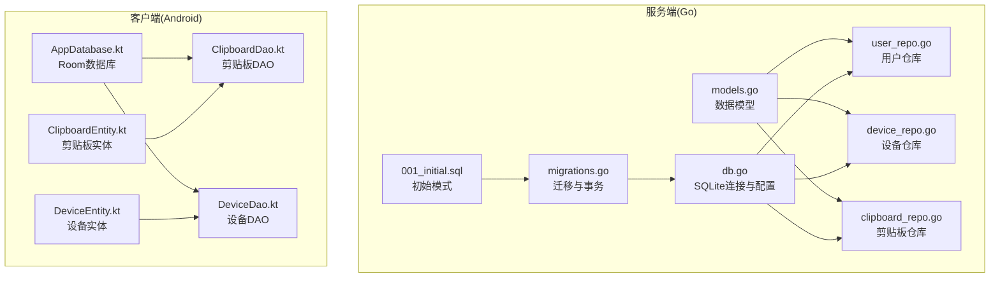
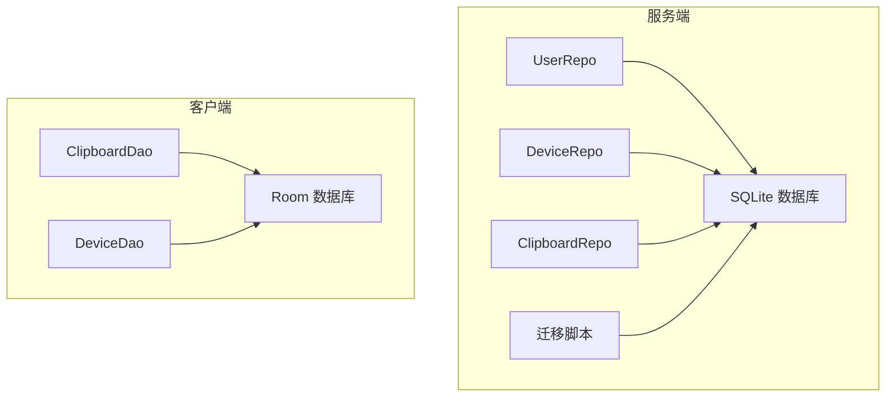
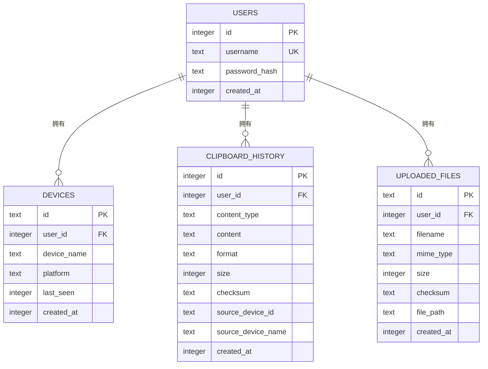
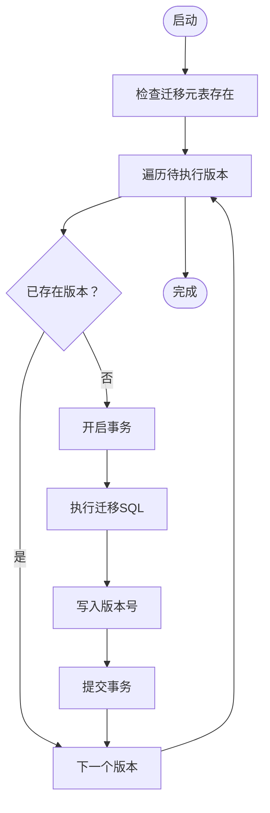
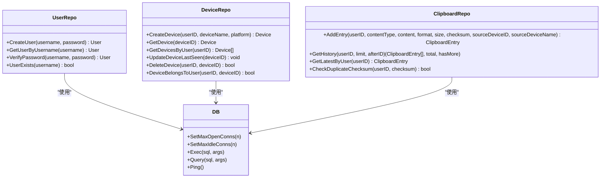
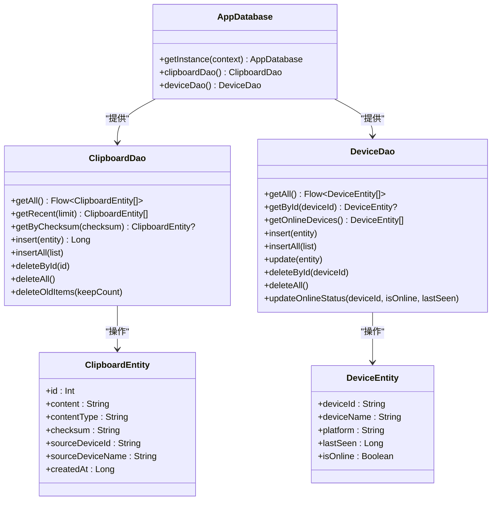
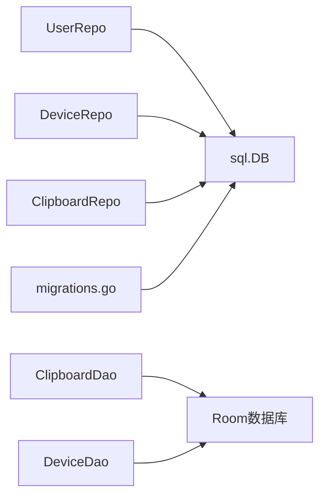

# 数据库系统

<cite>
**本文引用的文件**
- [models.go](file://clipSync-server/internal/database/models.go)
- [db.go](file://clipSync-server/internal/database/db.go)
- [migrations.go](file://clipSync-server/internal/database/migrations.go)
- [001_initial.sql](file://clipSync-server/migrations/001_initial.sql)
- [user_repo.go](file://clipSync-server/internal/database/user_repo.go)
- [device_repo.go](file://clipSync-server/internal/database/device_repo.go)
- [clipboard_repo.go](file://clipSync-server/internal/database/clipboard_repo.go)
- [AppDatabase.kt](file://clipSync-android/app/src/main/java/com/clipsync/app/data/AppDatabase.kt)
- [ClipboardDao.kt](file://clipSync-android/app/src/main/java/com/clipsync/app/data/ClipboardDao.kt)
- [DeviceDao.kt](file://clipSync-android/app/src/main/java/com/clipsync/app/data/DeviceDao.kt)
- [ClipboardEntity.kt](file://clipSync-android/app/src/main/java/com/clipsync/app/data/entities/ClipboardEntity.kt)
- [DeviceEntity.kt](file://clipSync-android/app/src/main/java/com/clipsync/app/data/entities/DeviceEntity.kt)
</cite>

## 目录
1. [简介](#简介)
2. [项目结构](#项目结构)
3. [核心组件](#核心组件)
4. [架构总览](#架构总览)
5. [详细组件分析](#详细组件分析)
6. [依赖关系分析](#依赖关系分析)
7. [性能考量](#性能考量)
8. [故障排查指南](#故障排查指南)
9. [结论](#结论)
10. [附录](#附录)

## 简介
本文件面向数据库系统，系统采用服务端 SQLite 与客户端 Room 的组合方案：服务端使用 Go 编写的 SQLite 数据库，配合迁移脚本与仓库层封装；客户端（Android）使用 Room 进行本地持久化。本文从数据库设计、表结构定义、关系映射、迁移策略入手，深入解释用户、设备、剪贴板内容等核心实体的数据模型与业务规则，并结合实际代码路径说明数据访问层实现、查询优化与事务管理，同时覆盖连接池配置、索引策略、性能调优、一致性保障、备份恢复与迁移兼容性。

## 项目结构
数据库相关代码主要分布在服务端 Go 工程与 Android 客户端工程中：
- 服务端 Go 工程（clipSync-server）
  - 数据模型定义：models.go
  - 数据库连接与配置：db.go
  - 迁移与索引：migrations.go、001_initial.sql
  - 仓库层（DAO 抽象）：user_repo.go、device_repo.go、clipboard_repo.go
- 客户端 Android 工程（clipSync-android）
  - Room 数据库与 DAO：AppDatabase.kt、ClipboardDao.kt、DeviceDao.kt
  - 实体类：ClipboardEntity.kt、DeviceEntity.kt

图表来源
- [models.go:1-46](file://clipSync-server/internal/database/models.go#L1-L46)
- [db.go:1-62](file://clipSync-server/internal/database/db.go#L1-L62)
- [migrations.go:1-114](file://clipSync-server/internal/database/migrations.go#L1-L114)
- [001_initial.sql:1-55](file://clipSync-server/migrations/001_initial.sql#L1-L55)
- [user_repo.go:1-91](file://clipSync-server/internal/database/user_repo.go#L1-L91)
- [device_repo.go:1-126](file://clipSync-server/internal/database/device_repo.go#L1-L126)
- [clipboard_repo.go:1-140](file://clipSync-server/internal/database/clipboard_repo.go#L1-L140)
- [AppDatabase.kt:1-41](file://clipSync-android/app/src/main/java/com/clipsync/app/data/AppDatabase.kt#L1-L41)
- [ClipboardDao.kt:1-50](file://clipSync-android/app/src/main/java/com/clipsync/app/data/ClipboardDao.kt#L1-L50)
- [DeviceDao.kt:1-44](file://clipSync-android/app/src/main/java/com/clipsync/app/data/DeviceDao.kt#L1-L44)
- [ClipboardEntity.kt:1-20](file://clipSync-android/app/src/main/java/com/clipsync/app/data/entities/ClipboardEntity.kt#L1-L20)
- [DeviceEntity.kt:1-18](file://clipSync-android/app/src/main/java/com/clipsync/app/data/entities/DeviceEntity.kt#L1-L18)

章节来源
- [models.go:1-46](file://clipSync-server/internal/database/models.go#L1-L46)
- [db.go:1-62](file://clipSync-server/internal/database/db.go#L1-L62)
- [migrations.go:1-114](file://clipSync-server/internal/database/migrations.go#L1-L114)
- [001_initial.sql:1-55](file://clipSync-server/migrations/001_initial.sql#L1-L55)
- [user_repo.go:1-91](file://clipSync-server/internal/database/user_repo.go#L1-L91)
- [device_repo.go:1-126](file://clipSync-server/internal/database/device_repo.go#L1-L126)
- [clipboard_repo.go:1-140](file://clipSync-server/internal/database/clipboard_repo.go#L1-L140)
- [AppDatabase.kt:1-41](file://clipSync-android/app/src/main/java/com/clipsync/app/data/AppDatabase.kt#L1-L41)
- [ClipboardDao.kt:1-50](file://clipSync-android/app/src/main/java/com/clipsync/app/data/ClipboardDao.kt#L1-L50)
- [DeviceDao.kt:1-44](file://clipSync-android/app/src/main/java/com/clipsync/app/data/DeviceDao.kt#L1-L44)
- [ClipboardEntity.kt:1-20](file://clipSync-android/app/src/main/java/com/clipsync/app/data/entities/ClipboardEntity.kt#L1-L20)
- [DeviceEntity.kt:1-18](file://clipSync-android/app/src/main/java/com/clipsync/app/data/entities/DeviceEntity.kt#L1-L18)

## 核心组件
- 服务端数据模型
  - 用户：用户名唯一、密码哈希存储、创建时间戳
  - 设备：主键设备ID、归属用户、设备名、平台、最近在线时间、创建时间
  - 剪贴板历史：内容类型、内容、格式、大小、校验和、来源设备信息、创建时间戳
  - 上传文件：文件ID、归属用户、文件名、MIME类型、大小、校验和、物理路径、创建时间戳
- 仓库层职责
  - 用户仓库：创建用户（密码哈希）、按用户名查询、验证密码、检查用户名是否存在
  - 设备仓库：注册设备（生成设备ID）、按ID/用户查询、更新最近在线时间、删除设备、所有权校验
  - 剪贴板仓库：插入历史项、分页/增量拉取、查询最新项、去重校验（基于校验和）
- 客户端 Room 组件
  - AppDatabase：声明实体与版本，提供 DAO 访问
  - ClipboardDao/DeviceDao：定义查询、插入、更新、删除、去重策略
  - ClipboardEntity/DeviceEntity：表映射与字段定义

章节来源
- [models.go:3-45](file://clipSync-server/internal/database/models.go#L3-L45)
- [user_repo.go:21-90](file://clipSync-server/internal/database/user_repo.go#L21-L90)
- [device_repo.go:21-125](file://clipSync-server/internal/database/device_repo.go#L21-L125)
- [clipboard_repo.go:20-139](file://clipSync-server/internal/database/clipboard_repo.go#L20-L139)
- [AppDatabase.kt:14-40](file://clipSync-android/app/src/main/java/com/clipsync/app/data/AppDatabase.kt#L14-L40)
- [ClipboardDao.kt:14-48](file://clipSync-android/app/src/main/java/com/clipsync/app/data/ClipboardDao.kt#L14-L48)
- [DeviceDao.kt:14-42](file://clipSync-android/app/src/main/java/com/clipsync/app/data/DeviceDao.kt#L14-L42)
- [ClipboardEntity.kt:9-19](file://clipSync-android/app/src/main/java/com/clipsync/app/data/entities/ClipboardEntity.kt#L9-L19)
- [DeviceEntity.kt:9-17](file://clipSync-android/app/src/main/java/com/clipsync/app/data/entities/DeviceEntity.kt#L9-L17)

## 架构总览
服务端通过 SQLite 存储用户、设备、剪贴板历史与上传文件；仓库层封装 SQL 操作，迁移脚本确保模式演进与索引建立；客户端使用 Room 本地存储剪贴板与设备信息，二者通过服务端 API 同步。

图表来源
- [db.go:12-15](file://clipSync-server/internal/database/db.go#L12-L15)
- [migrations.go:8-113](file://clipSync-server/internal/database/migrations.go#L8-L113)
- [user_repo.go:11-19](file://clipSync-server/internal/database/user_repo.go#L11-L19)
- [device_repo.go:11-18](file://clipSync-server/internal/database/device_repo.go#L11-L18)
- [clipboard_repo.go:9-17](file://clipSync-server/internal/database/clipboard_repo.go#L9-L17)
- [AppDatabase.kt:14-22](file://clipSync-android/app/src/main/java/com/clipsync/app/data/AppDatabase.kt#L14-L22)
- [ClipboardDao.kt:14-29](file://clipSync-android/app/src/main/java/com/clipsync/app/data/ClipboardDao.kt#L14-L29)
- [DeviceDao.kt:14-33](file://clipSync-android/app/src/main/java/com/clipsync/app/data/DeviceDao.kt#L14-L33)

## 详细组件分析

### 数据模型与关系映射
- 实体与字段
  - 用户：id、username（唯一）、password_hash、created_at
  - 设备：id（主键）、user_id（外键，级联删除）、device_name、platform、last_seen、created_at
  - 剪贴板历史：id（自增主键）、user_id（外键，级联删除）、content_type、content、format、size、checksum、source_device_id、source_device_name、created_at
  - 上传文件：id（主键）、user_id（外键，级联删除）、filename、mime_type、size、checksum、file_path、created_at
- 关系与约束
  - 设备与用户：一对多，删除用户时级联删除设备
  - 剪贴板历史与用户：一对多，删除用户时级联删除剪贴板历史
  - 上传文件与用户：一对多，删除用户时级联删除上传文件
- 约束与默认值
  - username 唯一
  - 字段默认值使用时间戳（毫秒）

图表来源
- [001_initial.sql:4-54](file://clipSync-server/migrations/001_initial.sql#L4-L54)
- [models.go:3-45](file://clipSync-server/internal/database/models.go#L3-L45)

章节来源
- [001_initial.sql:4-54](file://clipSync-server/migrations/001_initial.sql#L4-L54)
- [models.go:3-45](file://clipSync-server/internal/database/models.go#L3-L45)

### 迁移策略与版本控制
- 迁移跟踪表：schema_migrations（version 主键，applied_at 时间戳）
- 初始迁移（版本 1）：创建 users、devices、clipboard_history、uploaded_files 表及必要索引
- 迁移执行流程：逐版本检查是否已应用，未应用则在事务内执行 SQL 并写入版本号
- 索引策略
  - devices(user_id)
  - clipboard_history(user_id)
  - clipboard_history(user_id, checksum)
  - clipboard_history(user_id, created_at DESC)
  - uploaded_files(user_id)

图表来源
- [migrations.go:8-113](file://clipSync-server/internal/database/migrations.go#L8-L113)
- [001_initial.sql:1-55](file://clipSync-server/migrations/001_initial.sql#L1-L55)

章节来源
- [migrations.go:8-113](file://clipSync-server/internal/database/migrations.go#L8-L113)
- [001_initial.sql:1-55](file://clipSync-server/migrations/001_initial.sql#L1-L55)

### 服务端数据访问层（仓库层）
- 用户仓库
  - 创建用户：生成哈希、插入 users，返回新用户对象
  - 查询用户：按用户名查询，支持不存在返回空
  - 验证密码：先查用户再比对哈希
  - 用户存在性：COUNT 查询
- 设备仓库
  - 注册设备：生成设备ID（前缀+随机十六进制），插入 devices
  - 查询设备：按ID或用户ID查询，支持排序
  - 更新最近在线：更新 last_seen
  - 删除设备：按ID与用户ID删除，返回受影响行数
  - 所有权校验：COUNT 校验
- 剪贴板仓库
  - 插入历史：插入 clipboard_history，随后按限制删除多余条目
  - 分页/增量：统计总数，按 created_at DESC 查询，支持 after_id 增量
  - 最新项：LIMIT 1 查询
  - 去重：按 user_id + checksum 查询重复

图表来源
- [user_repo.go:11-90](file://clipSync-server/internal/database/user_repo.go#L11-L90)
- [device_repo.go:11-125](file://clipSync-server/internal/database/device_repo.go#L11-L125)
- [clipboard_repo.go:9-139](file://clipSync-server/internal/database/clipboard_repo.go#L9-L139)
- [db.go:12-15](file://clipSync-server/internal/database/db.go#L12-L15)

章节来源
- [user_repo.go:21-90](file://clipSync-server/internal/database/user_repo.go#L21-L90)
- [device_repo.go:21-125](file://clipSync-server/internal/database/device_repo.go#L21-L125)
- [clipboard_repo.go:20-139](file://clipSync-server/internal/database/clipboard_repo.go#L20-L139)

### 客户端数据访问层（Room）
- AppDatabase：声明实体集合与版本，提供 DAO 访问方法
- ClipboardDao
  - 查询全部/最近：Flow/LIMIT
  - 去重查询：按 checksum
  - 插入：REPLACE 冲突策略
  - 清理旧项：保留最近 N 条
- DeviceDao
  - 查询全部/按ID/在线设备
  - 插入/批量插入：REPLACE
  - 更新：按主键更新
  - 删除：按ID或清空
  - 在线状态更新：isOnline + lastSeen

图表来源
- [AppDatabase.kt:14-40](file://clipSync-android/app/src/main/java/com/clipsync/app/data/AppDatabase.kt#L14-L40)
- [ClipboardDao.kt:14-48](file://clipSync-android/app/src/main/java/com/clipsync/app/data/ClipboardDao.kt#L14-L48)
- [DeviceDao.kt:14-42](file://clipSync-android/app/src/main/java/com/clipsync/app/data/DeviceDao.kt#L14-L42)
- [ClipboardEntity.kt:9-19](file://clipSync-android/app/src/main/java/com/clipsync/app/data/entities/ClipboardEntity.kt#L9-L19)
- [DeviceEntity.kt:9-17](file://clipSync-android/app/src/main/java/com/clipsync/app/data/entities/DeviceEntity.kt#L9-L17)

章节来源
- [AppDatabase.kt:14-40](file://clipSync-android/app/src/main/java/com/clipsync/app/data/AppDatabase.kt#L14-L40)
- [ClipboardDao.kt:14-48](file://clipSync-android/app/src/main/java/com/clipsync/app/data/ClipboardDao.kt#L14-L48)
- [DeviceDao.kt:14-42](file://clipSync-android/app/src/main/java/com/clipsync/app/data/DeviceDao.kt#L14-L42)
- [ClipboardEntity.kt:9-19](file://clipSync-android/app/src/main/java/com/clipsync/app/data/entities/ClipboardEntity.kt#L9-L19)
- [DeviceEntity.kt:9-17](file://clipSync-android/app/src/main/java/com/clipsync/app/data/entities/DeviceEntity.kt#L9-L17)

### 查询优化与事务管理
- 服务端
  - 连接池：最大打开连接数、最大空闲连接数
  - WAL 模式：提升并发读性能
  - 同步级别：NORMAL 提升写入吞吐
  - 缓存与临时存储：cache_size、temp_store=MEMORY
  - 事务：迁移与历史清理均使用显式事务，失败回滚
- 客户端
  - Room 使用 REPLACE 冲突策略，避免重复插入
  - 通过 LIMIT 与排序优化分页与增量加载
  - Flow 支持响应式数据流

章节来源
- [db.go:17-55](file://clipSync-server/internal/database/db.go#L17-L55)
- [migrations.go:92-109](file://clipSync-server/internal/database/migrations.go#L92-L109)
- [clipboard_repo.go:39-50](file://clipSync-server/internal/database/clipboard_repo.go#L39-L50)
- [ClipboardDao.kt:25-29](file://clipSync-android/app/src/main/java/com/clipsync/app/data/ClipboardDao.kt#L25-L29)

### 业务规则与约束
- 用户
  - 用户名唯一
  - 密码以哈希形式存储
- 设备
  - 设备ID全局唯一（前缀+随机十六进制）
  - 设备归属用户，删除用户时级联删除设备
- 剪贴板
  - 去重：同一用户下相同 checksum 视为重复
  - 历史上限：超过限制自动清理最旧条目
  - 分页/增量：支持 after_id 增量拉取
- 文件
  - 上传文件记录元数据与物理路径，删除用户时级联删除

章节来源
- [001_initial.sql:20-21](file://clipSync-server/migrations/001_initial.sql#L20-L21)
- [001_initial.sql:36-37](file://clipSync-server/migrations/001_initial.sql#L36-L37)
- [001_initial.sql:52-53](file://clipSync-server/migrations/001_initial.sql#L52-L53)
- [clipboard_repo.go:128-139](file://clipSync-server/internal/database/clipboard_repo.go#L128-L139)
- [clipboard_repo.go:39-50](file://clipSync-server/internal/database/clipboard_repo.go#L39-L50)

## 依赖关系分析
- 服务端
  - 仓库层依赖数据库连接（sql.DB）
  - 迁移脚本依赖 schema_migrations 元表
  - 索引服务于查询与去重
- 客户端
  - DAO 依赖 Room 数据库
  - 实体映射到表结构

图表来源
- [user_repo.go:12-14](file://clipSync-server/internal/database/user_repo.go#L12-L14)
- [device_repo.go:12-14](file://clipSync-server/internal/database/device_repo.go#L12-L14)
- [clipboard_repo.go:10-12](file://clipSync-server/internal/database/clipboard_repo.go#L10-L12)
- [db.go:12-15](file://clipSync-server/internal/database/db.go#L12-L15)
- [migrations.go:8-18](file://clipSync-server/internal/database/migrations.go#L8-L18)
- [ClipboardDao.kt:14-29](file://clipSync-android/app/src/main/java/com/clipsync/app/data/ClipboardDao.kt#L14-L29)
- [DeviceDao.kt:14-33](file://clipSync-android/app/src/main/java/com/clipsync/app/data/DeviceDao.kt#L14-L33)

章节来源
- [user_repo.go:12-14](file://clipSync-server/internal/database/user_repo.go#L12-L14)
- [device_repo.go:12-14](file://clipSync-server/internal/database/device_repo.go#L12-L14)
- [clipboard_repo.go:10-12](file://clipSync-server/internal/database/clipboard_repo.go#L10-L12)
- [db.go:12-15](file://clipSync-server/internal/database/db.go#L12-L15)
- [migrations.go:8-18](file://clipSync-server/internal/database/migrations.go#L8-L18)
- [ClipboardDao.kt:14-29](file://clipSync-android/app/src/main/java/com/clipsync/app/data/ClipboardDao.kt#L14-L29)
- [DeviceDao.kt:14-33](file://clipSync-android/app/src/main/java/com/clipsync/app/data/DeviceDao.kt#L14-L33)

## 性能考量
- 连接池与并发
  - 服务端：最大打开连接数与空闲连接数适配 2 核 2G 服务器
  - WAL 模式提升并发读能力
  - 同步级别 NORMAL 平衡安全与性能
- 索引策略
  - devices(user_id)：按用户查询设备
  - clipboard_history(user_id)：按用户查询剪贴板
  - clipboard_history(user_id, checksum)：去重查询
  - clipboard_history(user_id, created_at DESC)：分页/增量查询
  - uploaded_files(user_id)：按用户查询上传文件
- 查询优化
  - 服务端：分页/增量查询，限制返回数量
  - 客户端：LIMIT 与排序，Flow 响应式更新
- 存储优化
  - cache_size 与 temp_store=MEMORY 减少磁盘 IO

章节来源
- [db.go:29-49](file://clipSync-server/internal/database/db.go#L29-L49)
- [001_initial.sql:22-22](file://clipSync-server/migrations/001_initial.sql#L22-L22)
- [001_initial.sql:38-40](file://clipSync-server/migrations/001_initial.sql#L38-L40)
- [001_initial.sql:54-54](file://clipSync-server/migrations/001_initial.sql#L54-L54)
- [clipboard_repo.go:67-110](file://clipSync-server/internal/database/clipboard_repo.go#L67-L110)
- [ClipboardDao.kt:16-20](file://clipSync-android/app/src/main/java/com/clipsync/app/data/ClipboardDao.kt#L16-L20)

## 故障排查指南
- 迁移失败
  - 症状：应用启动时报错
  - 排查：确认 schema_migrations 是否存在、版本是否正确、事务是否成功提交
  - 参考路径：[migrations.go:8-113](file://clipSync-server/internal/database/migrations.go#L8-L113)
- 连接失败
  - 症状：数据库无法 Ping 或打开
  - 排查：检查数据库目录权限、WAL 参数、外键开关
  - 参考路径：[db.go:17-55](file://clipSync-server/internal/database/db.go#L17-L55)
- 查询异常
  - 症状：分页/去重结果异常
  - 排查：确认索引是否存在、参数 limit/after_id 是否合理
  - 参考路径：[clipboard_repo.go:67-110](file://clipSync-server/internal/database/clipboard_repo.go#L67-L110)
- 重复数据
  - 症状：剪贴板重复
  - 排查：确认 checksum 去重逻辑、REPLACE 冲突策略
  - 参考路径：[clipboard_repo.go:128-139](file://clipSync-server/internal/database/clipboard_repo.go#L128-L139)、[ClipboardDao.kt:25-29](file://clipSync-android/app/src/main/java/com/clipsync/app/data/ClipboardDao.kt#L25-L29)

章节来源
- [migrations.go:82-110](file://clipSync-server/internal/database/migrations.go#L82-L110)
- [db.go:17-55](file://clipSync-server/internal/database/db.go#L17-L55)
- [clipboard_repo.go:67-110](file://clipSync-server/internal/database/clipboard_repo.go#L67-L110)
- [ClipboardDao.kt:25-29](file://clipSync-android/app/src/main/java/com/clipsync/app/data/ClipboardDao.kt#L25-L29)

## 结论
该数据库系统采用服务端 SQLite 与客户端 Room 的混合架构：服务端通过迁移脚本与仓库层保证模式演进与数据一致性，客户端通过 Room 提供本地持久化与响应式更新。通过合理的索引、连接池与事务管理，系统在小规模部署场景下具备良好的性能与可维护性。后续可在迁移脚本中引入版本号递增与回滚策略，完善备份与恢复流程，并持续评估历史容量与查询模式以优化索引与缓存配置。

## 附录
- 备份与恢复建议
  - 服务端：定期复制 SQLite 数据库文件；启用 WAL 模式后可进行热备份
  - 客户端：Room 数据库位于应用私有目录，可通过系统备份策略处理
- 迁移兼容性
  - 新增列：使用 DEFAULT 值与非空约束谨慎处理
  - 删除列：先迁移数据，再重建表或使用 ALTER TABLE
  - 索引变更：在事务中执行，避免长时间锁表