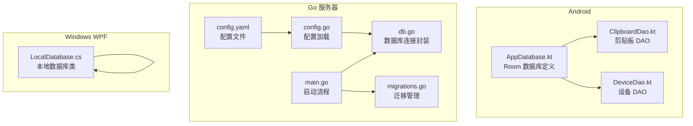
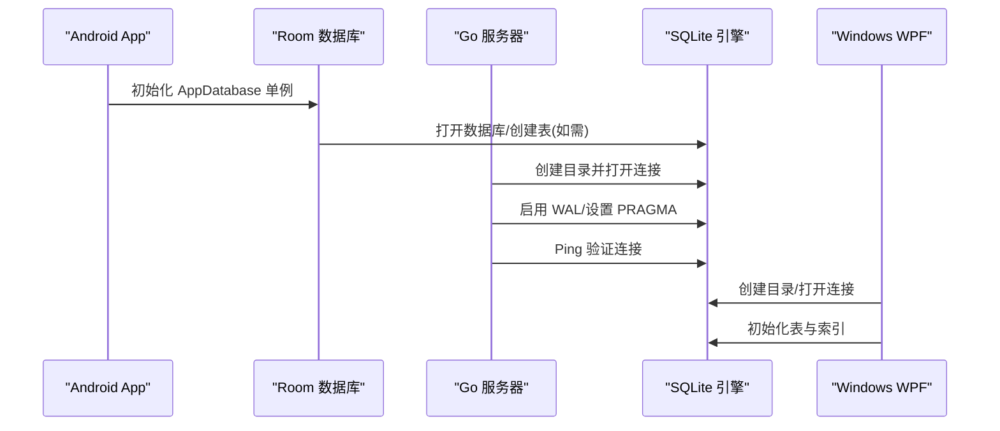
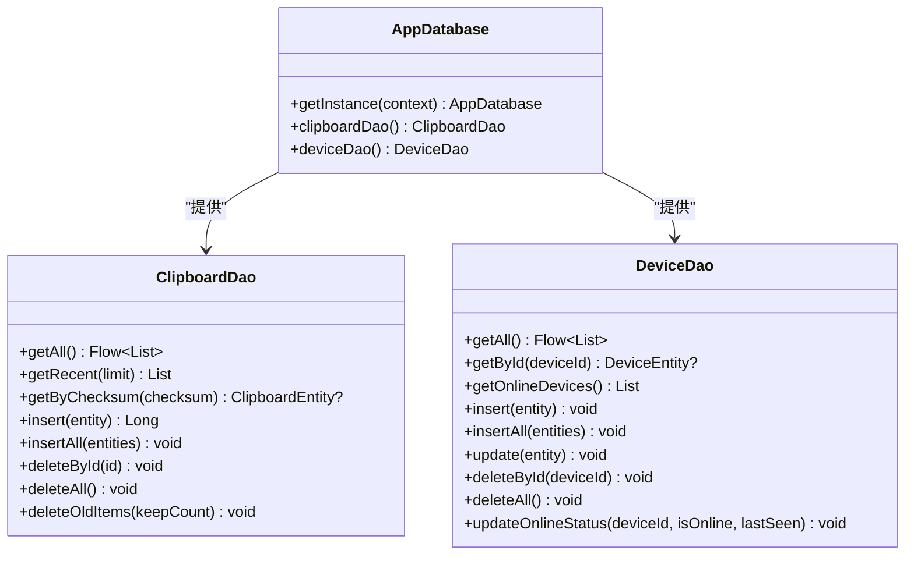
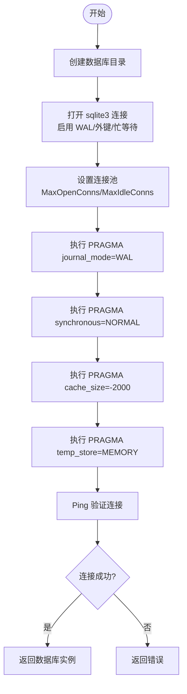
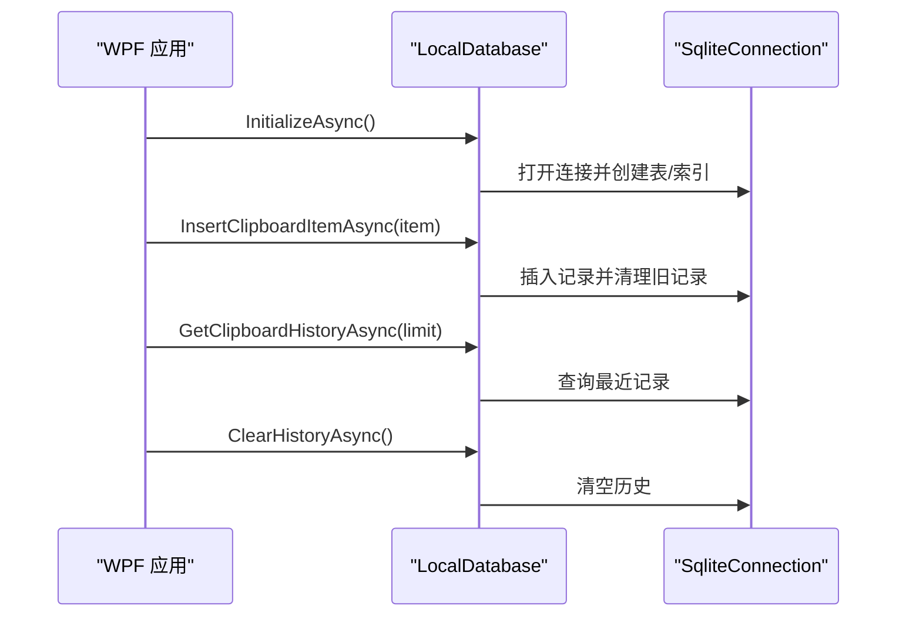
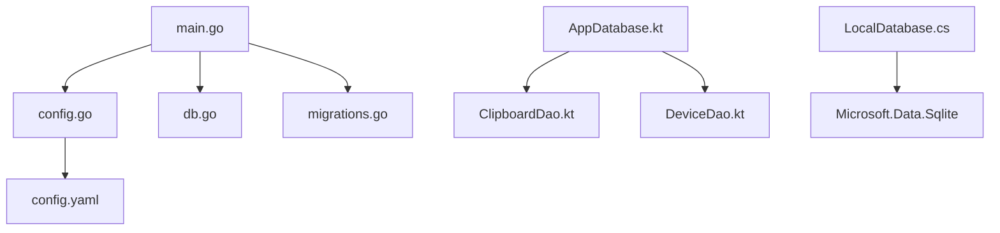

# 数据库配置

<cite>
**本文档引用的文件**
- [AppDatabase.kt](file://clipSync-android/app/src/main/java/com/clipsync/app/data/AppDatabase.kt)
- [ClipboardDao.kt](file://clipSync-android/app/src/main/java/com/clipsync/app/data/ClipboardDao.kt)
- [DeviceDao.kt](file://clipSync-android/app/src/main/java/com/clipsync/app/data/DeviceDao.kt)
- [db.go](file://clipSync-server/internal/database/db.go)
- [migrations.go](file://clipSync-server/internal/database/migrations.go)
- [config.go](file://clipSync-server/internal/config/config.go)
- [config.yaml](file://clipSync-server/configs/config.yaml)
- [main.go](file://clipSync-server/cmd/server/main.go)
- [LocalDatabase.cs](file://clipSync-windows/ClipSync.WPF/Storage/LocalDatabase.cs)
</cite>

## 目录
1. [简介](#简介)
2. [项目结构](#项目结构)
3. [核心组件](#核心组件)
4. [架构总览](#架构总览)
5. [详细组件分析](#详细组件分析)
6. [依赖关系分析](#依赖关系分析)
7. [性能考虑](#性能考虑)
8. [故障排除指南](#故障排除指南)
9. [结论](#结论)

## 简介
本文件面向数据库配置与优化，系统性阐述三端（Android、Windows WPF、Go 服务器）中 SQLite 的初始化流程、连接池配置、WAL 模式、同步级别、缓存大小与临时存储策略，并覆盖数据库路径管理、目录权限、连接验证机制。同时提供针对不同硬件配置的优化建议与常见问题排查方案，帮助在资源受限或高并发场景下获得稳定且高性能的数据库表现。

## 项目结构
本项目包含三个平台的本地数据库实现：
- Android：基于 Room 的数据库定义与 DAO 接口
- Windows WPF：基于 Microsoft.Data.Sqlite 的本地数据库类
- Go 服务器：基于 go-sqlite3 的数据库连接封装与迁移

**图表来源**
- [AppDatabase.kt:14-40](file://clipSync-android/app/src/main/java/com/clipsync/app/data/AppDatabase.kt#L14-L40)
- [ClipboardDao.kt:13-49](file://clipSync-android/app/src/main/java/com/clipsync/app/data/ClipboardDao.kt#L13-L49)
- [DeviceDao.kt:14-43](file://clipSync-android/app/src/main/java/com/clipsync/app/data/DeviceDao.kt#L14-L43)
- [config.go:10-71](file://clipSync-server/internal/config/config.go#L10-L71)
- [db.go:17-56](file://clipSync-server/internal/database/db.go#L17-L56)
- [migrations.go:8-113](file://clipSync-server/internal/database/migrations.go#L8-L113)
- [main.go:21-54](file://clipSync-server/cmd/server/main.go#L21-L54)
- [config.yaml:1-29](file://clipSync-server/configs/config.yaml#L1-L29)
- [LocalDatabase.cs:9-24](file://clipSync-windows/ClipSync.WPF/Storage/LocalDatabase.cs#L9-L24)

**章节来源**
- [AppDatabase.kt:14-40](file://clipSync-android/app/src/main/java/com/clipsync/app/data/AppDatabase.kt#L14-L40)
- [db.go:17-56](file://clipSync-server/internal/database/db.go#L17-L56)
- [LocalDatabase.cs:9-24](file://clipSync-windows/ClipSync.WPF/Storage/LocalDatabase.cs#L9-L24)

## 核心组件
- Android Room 数据库：通过注解定义实体与版本，提供单例数据库实例与 DAO 访问接口。
- Go 服务器数据库：封装 sqlite3 连接，启用 WAL、设置连接池、执行 PRAGMA 优化、Ping 验证。
- Windows WPF 本地数据库：自动创建应用数据目录与数据库文件，初始化表结构与索引，提供历史记录增删查操作。

**章节来源**
- [AppDatabase.kt:14-40](file://clipSync-android/app/src/main/java/com/clipsync/app/data/AppDatabase.kt#L14-L40)
- [db.go:17-56](file://clipSync-server/internal/database/db.go#L17-L56)
- [LocalDatabase.cs:26-58](file://clipSync-windows/ClipSync.WPF/Storage/LocalDatabase.cs#L26-L58)

## 架构总览
三端数据库初始化与使用的关键流程如下：

**图表来源**
- [AppDatabase.kt:30-38](file://clipSync-android/app/src/main/java/com/clipsync/app/data/AppDatabase.kt#L30-L38)
- [db.go:18-55](file://clipSync-server/internal/database/db.go#L18-L55)
- [LocalDatabase.cs:26-58](file://clipSync-windows/ClipSync.WPF/Storage/LocalDatabase.cs#L26-L58)

## 详细组件分析

### Android Room 数据库配置
- 数据库定义：通过注解声明实体集合、版本号与导出策略。
- 单例实例：线程安全的延迟初始化，避免重复构建。
- DAO 接口：提供查询、插入、删除等常用操作，支持流式查询与限制返回条数。

**图表来源**
- [AppDatabase.kt:14-40](file://clipSync-android/app/src/main/java/com/clipsync/app/data/AppDatabase.kt#L14-L40)
- [ClipboardDao.kt:13-49](file://clipSync-android/app/src/main/java/com/clipsync/app/data/ClipboardDao.kt#L13-L49)
- [DeviceDao.kt:14-43](file://clipSync-android/app/src/main/java/com/clipsync/app/data/DeviceDao.kt#L14-L43)

**章节来源**
- [AppDatabase.kt:14-40](file://clipSync-android/app/src/main/java/com/clipsync/app/data/AppDatabase.kt#L14-L40)
- [ClipboardDao.kt:13-49](file://clipSync-android/app/src/main/java/com/clipsync/app/data/ClipboardDao.kt#L13-L49)
- [DeviceDao.kt:14-43](file://clipSync-android/app/src/main/java/com/clipsync/app/data/DeviceDao.kt#L14-L43)

### Go 服务器数据库初始化与优化
- 路径与权限：确保数据库目录存在，使用系统默认权限创建。
- 连接字符串：启用 WAL、设置忙等待超时、开启外键约束。
- 连接池：最大打开连接数与空闲连接数适配低配服务器。
- PRAGMA 优化：启用 WAL、设置同步级别、缓存大小、临时存储到内存。
- 连接验证：Ping 成功后才返回可用连接。

**图表来源**
- [db.go:18-55](file://clipSync-server/internal/database/db.go#L18-L55)

**章节来源**
- [db.go:17-56](file://clipSync-server/internal/database/db.go#L17-L56)

### Windows WPF 本地数据库
- 路径管理：使用用户应用数据目录创建 ClipSync 子目录与数据库文件。
- 初始化：首次访问时创建表与索引，保证后续读写可用。
- 历史限制：插入新项时仅保留最近 N 条记录，防止无限增长。
- 查询与清理：提供历史查询与清空功能。

**图表来源**
- [LocalDatabase.cs:26-137](file://clipSync-windows/ClipSync.WPF/Storage/LocalDatabase.cs#L26-L137)

**章节来源**
- [LocalDatabase.cs:15-24](file://clipSync-windows/ClipSync.WPF/Storage/LocalDatabase.cs#L15-L24)
- [LocalDatabase.cs:26-58](file://clipSync-windows/ClipSync.WPF/Storage/LocalDatabase.cs#L26-L58)
- [LocalDatabase.cs:98-137](file://clipSync-windows/ClipSync.WPF/Storage/LocalDatabase.cs#L98-L137)

## 依赖关系分析
- Android：AppDatabase 依赖 Room 运行时；DAO 依赖数据库表结构。
- Go：main 负责加载配置、初始化数据库与迁移；db 封装连接与 PRAGMA；migrations 管理表结构演进。
- Windows：LocalDatabase 直接依赖 Microsoft.Data.Sqlite。

**图表来源**
- [main.go:21-54](file://clipSync-server/cmd/server/main.go#L21-L54)
- [config.go:10-71](file://clipSync-server/internal/config/config.go#L10-L71)
- [db.go:17-56](file://clipSync-server/internal/database/db.go#L17-L56)
- [migrations.go:8-113](file://clipSync-server/internal/database/migrations.go#L8-L113)
- [config.yaml:1-29](file://clipSync-server/configs/config.yaml#L1-29)
- [AppDatabase.kt:14-40](file://clipSync-android/app/src/main/java/com/clipsync/app/data/AppDatabase.kt#L14-L40)
- [ClipboardDao.kt:13-49](file://clipSync-android/app/src/main/java/com/clipsync/app/data/ClipboardDao.kt#L13-L49)
- [DeviceDao.kt:14-43](file://clipSync-android/app/src/main/java/com/clipsync/app/data/DeviceDao.kt#L14-L43)
- [LocalDatabase.cs:9-24](file://clipSync-windows/ClipSync.WPF/Storage/LocalDatabase.cs#L9-L24)

**章节来源**
- [main.go:21-54](file://clipSync-server/cmd/server/main.go#L21-L54)
- [config.go:10-71](file://clipSync-server/internal/config/config.go#L10-L71)
- [db.go:17-56](file://clipSync-server/internal/database/db.go#L17-L56)
- [migrations.go:8-113](file://clipSync-server/internal/database/migrations.go#L8-L113)
- [config.yaml:1-29](file://clipSync-server/configs/config.yaml#L1-29)
- [AppDatabase.kt:14-40](file://clipSync-android/app/src/main/java/com/clipsync/app/data/AppDatabase.kt#L14-L40)
- [ClipboardDao.kt:13-49](file://clipSync-android/app/src/main/java/com/clipsync/app/data/ClipboardDao.kt#L13-L49)
- [DeviceDao.kt:14-43](file://clipSync-android/app/src/main/java/com/clipsync/app/data/DeviceDao.kt#L14-L43)
- [LocalDatabase.cs:9-24](file://clipSync-windows/ClipSync.WPF/Storage/LocalDatabase.cs#L9-L24)

## 性能考虑
以下参数与设置来自现有实现，适用于不同硬件配置的优化建议：

- WAL 模式
  - 作用：允许多读取器与单写入器并发，减少锁竞争，提升吞吐量。
  - 实现：在连接字符串中启用，并在运行时再次执行 PRAGMA 确保生效。
  - 适用：多客户端/服务端并发读取场景。

- 同步级别
  - 当前设置：NORMAL（折中一致性与性能）。
  - 其他可选：FULL（更强一致性）、EXTRA（额外校验）、OFF（极致性能但风险更高）。
  - 建议：根据业务对一致性的要求选择；NORMAL 已适合大多数场景。

- 缓存大小
  - 当前设置：-2000（以页为单位，负值表示 KiB，约 2MB）。
  - 建议：根据可用内存与工作集大小调整；内存充足时可适度增大以提升命中率。

- 临时存储
  - 当前设置：MEMORY（临时表与排序使用内存）。
  - 建议：在内存紧张时切换为 FILE；在高并发排序场景下 MEMORY 更优。

- 连接池
  - 当前设置：最大打开连接 4，空闲 2。
  - 建议：CPU 核心数越多，可适当增加 MaxOpenConns；注意 SQLite 的并发写入限制。

- 忙等待超时
  - 当前设置：5000ms。
  - 建议：根据网络与磁盘延迟调整，避免过短导致频繁超时。

- 目录权限
  - 当前设置：0755（目录创建）。
  - 建议：确保进程对数据库目录具有读写权限；生产环境建议最小权限原则。

- 历史限制
  - Android：DAO 支持按条数清理旧记录。
  - Windows：插入时仅保留最近 N 条。
  - 建议：结合业务需求设置上限，定期清理，避免无限增长。

**章节来源**
- [db.go:24-49](file://clipSync-server/internal/database/db.go#L24-L49)
- [ClipboardDao.kt:37-48](file://clipSync-android/app/src/main/java/com/clipsync/app/data/ClipboardDao.kt#L37-L48)
- [LocalDatabase.cs:85-95](file://clipSync-windows/ClipSync.WPF/Storage/LocalDatabase.cs#L85-L95)

## 故障排除指南
- 数据库目录无法创建
  - 现象：启动时报错提示无法创建目录。
  - 排查：确认运行账户对目标路径有写权限；检查路径是否被占用。
  - 参考：目录创建逻辑与权限设置。

- 连接失败或超时
  - 现象：打开数据库或执行 PRAGMA 失败。
  - 排查：检查数据库文件是否存在且可读写；确认磁盘空间充足；查看 busy_timeout 设置是否合理。
  - 参考：连接字符串与 PRAGMA 设置。

- 连接验证失败
  - 现象：Ping 返回错误。
  - 排查：确认数据库文件未损坏；检查 WAL 文件状态；尝试重启服务。
  - 参考：Ping 验证步骤。

- 并发写入冲突
  - 现象：写入阻塞或失败。
  - 排查：确认已启用 WAL；检查连接池配置；避免在同一事务中长时间持有锁。
  - 参考：WAL 启用与连接池设置。

- 内存不足
  - 现象：排序或临时表操作失败。
  - 排查：降低 cache_size 或切换 temp_store=FILE；监控系统内存使用。
  - 参考：cache_size 与 temp_store 设置。

- 历史记录过多
  - 现象：查询变慢或占用空间过大。
  - 排查：确认历史限制策略是否生效；检查清理逻辑。
  - 参考：Android DAO 与 Windows 插入清理逻辑。

**章节来源**
- [db.go:18-55](file://clipSync-server/internal/database/db.go#L18-L55)
- [LocalDatabase.cs:26-58](file://clipSync-windows/ClipSync.WPF/Storage/LocalDatabase.cs#L26-L58)
- [ClipboardDao.kt:37-48](file://clipSync-android/app/src/main/java/com/clipsync/app/data/ClipboardDao.kt#L37-L48)

## 结论
本项目在三端均实现了 SQLite 的稳健初始化与优化配置：Android 使用 Room 简化 ORM 与 DAO；Go 服务器通过连接字符串与 PRAGMA 实现 WAL、同步级别、缓存与临时存储的精细控制，并配合连接池与目录权限管理；Windows WPF 则提供了轻量级本地数据库类，具备自动初始化与历史限制能力。结合本文提供的性能参数与故障排除建议，可在不同硬件环境下获得稳定且高效的数据库表现。