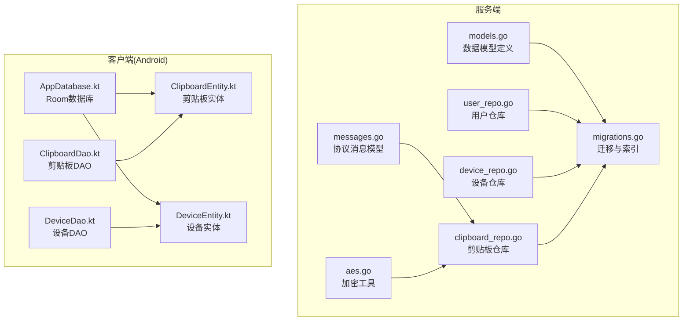
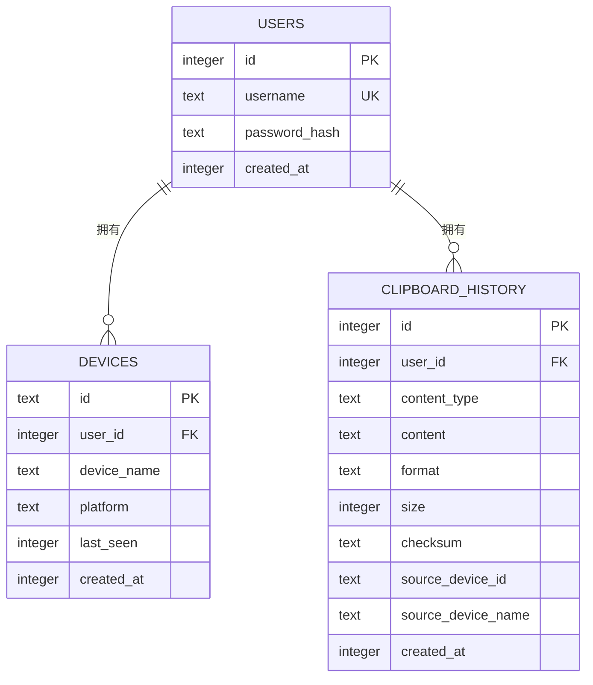
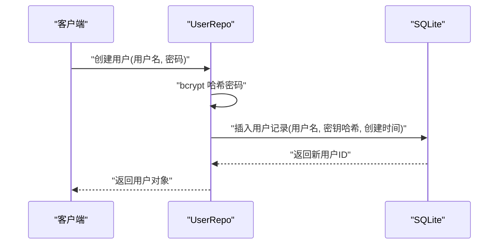
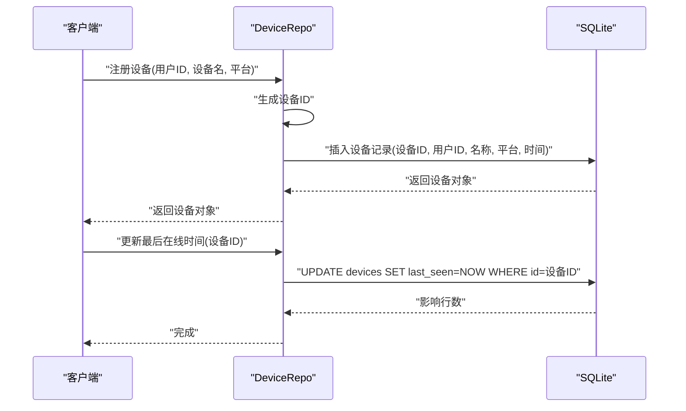
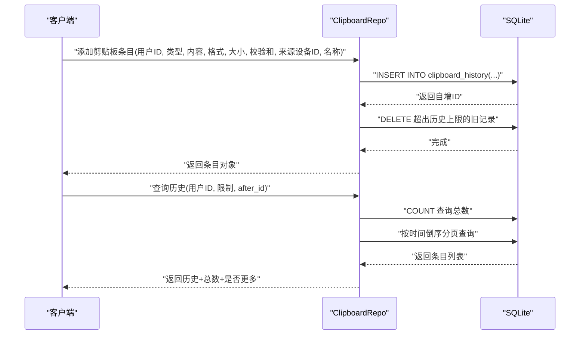
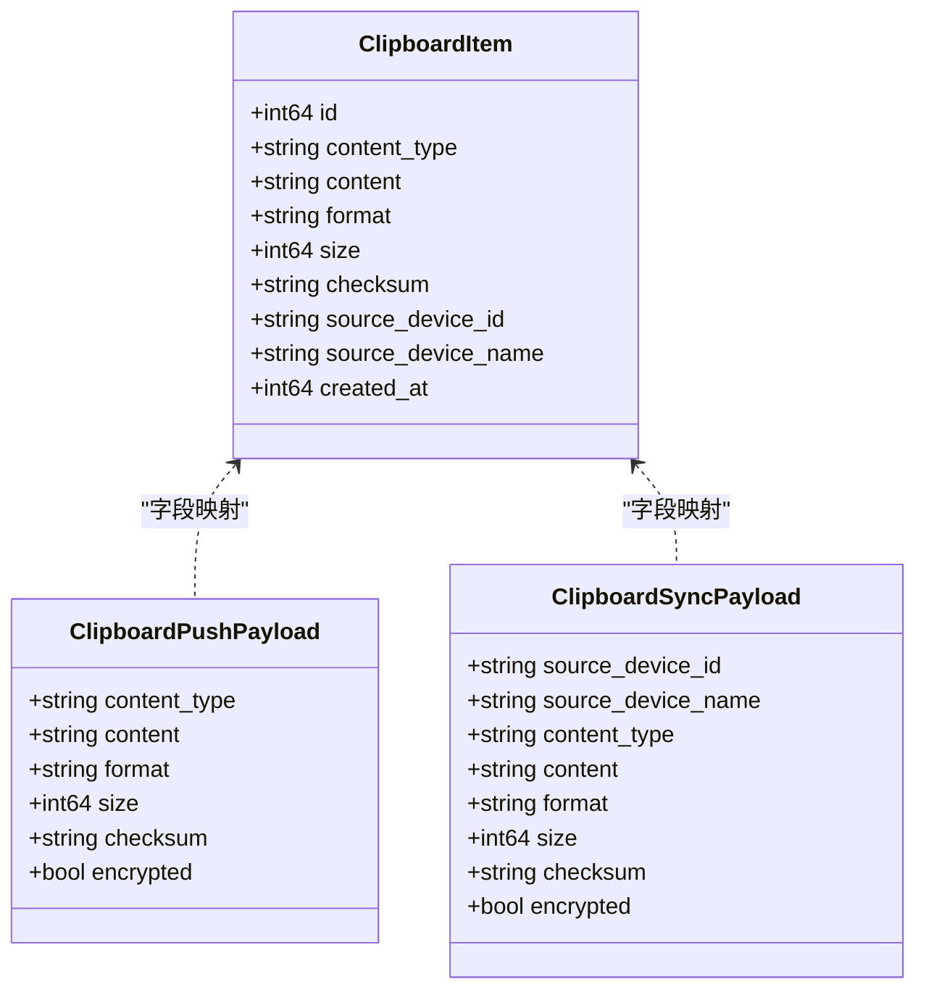
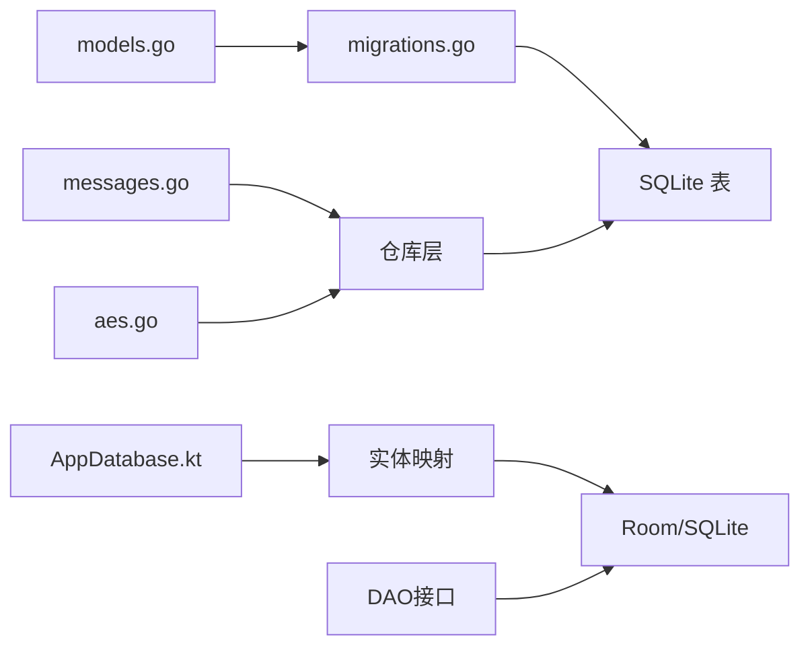

# 数据模型设计

<cite>
**本文档引用的文件**
- [models.go](file://clipSync-server/internal/database/models.go)
- [migrations.go](file://clipSync-server/internal/database/migrations.go)
- [001_initial.sql](file://clipSync-server/migrations/001_initial.sql)
- [user_repo.go](file://clipSync-server/internal/database/user_repo.go)
- [device_repo.go](file://clipSync-server/internal/database/device_repo.go)
- [clipboard_repo.go](file://clipSync-server/internal/database/clipboard_repo.go)
- [messages.go](file://clipSync-server/pkg/protocol/messages.go)
- [AppDatabase.kt](file://clipSync-android/app/src/main/java/com/clipsync/app/data/AppDatabase.kt)
- [ClipboardEntity.kt](file://clipSync-android/app/src/main/java/com/clipsync/app/data/entities/ClipboardEntity.kt)
- [DeviceEntity.kt](file://clipSync-android/app/src/main/java/com/clipsync/app/data/entities/DeviceEntity.kt)
- [ClipboardDao.kt](file://clipSync-android/app/src/main/java/com/clipsync/app/data/ClipboardDao.kt)
- [DeviceDao.kt](file://clipSync-android/app/src/main/java/com/clipsync/app/data/DeviceDao.kt)
- [config.yaml](file://clipSync-server/configs/config.yaml)
- [aes.go](file://clipSync-server/internal/encryption/aes.go)
</cite>

## 目录
1. [简介](#简介)
2. [项目结构](#项目结构)
3. [核心组件](#核心组件)
4. [架构总览](#架构总览)
5. [详细组件分析](#详细组件分析)
6. [依赖分析](#依赖分析)
7. [性能考虑](#性能考虑)
8. [故障排除指南](#故障排除指南)
9. [结论](#结论)
10. [附录](#附录)

## 简介
本文件系统性梳理 ClipSync 的数据模型设计，重点覆盖用户(User)、设备(Device)与剪贴板内容(ClipboardItem/ClipboardEntry)三类核心实体。文档从数据结构定义、字段约束与业务含义、实体关系图、字段映射、数据验证规则、默认值与索引策略等方面进行深入说明，并结合服务端与客户端实现展示模型在业务逻辑中的作用与约束关系。

## 项目结构
数据模型相关代码主要分布在服务端 Go 语言实现与 Android 客户端 Kotlin 实现中：
- 服务端：通过结构体定义数据模型，配合迁移脚本创建数据库表，仓库层封装 CRUD 操作。
- 客户端：Android 使用 Room 映射本地 SQLite 表，实体与 DAO 对应服务端模型。

**图表来源**
- [models.go:1-46](file://clipSync-server/internal/database/models.go#L1-L46)
- [migrations.go:1-114](file://clipSync-server/internal/database/migrations.go#L1-L114)
- [user_repo.go:1-91](file://clipSync-server/internal/database/user_repo.go#L1-L91)
- [device_repo.go:1-126](file://clipSync-server/internal/database/device_repo.go#L1-L126)
- [clipboard_repo.go:1-140](file://clipSync-server/internal/database/clipboard_repo.go#L1-L140)
- [messages.go:1-132](file://clipSync-server/pkg/protocol/messages.go#L1-L132)
- [AppDatabase.kt:1-41](file://clipSync-android/app/src/main/java/com/clipsync/app/data/AppDatabase.kt#L1-L41)
- [ClipboardEntity.kt:1-20](file://clipSync-android/app/src/main/java/com/clipsync/app/data/entities/ClipboardEntity.kt#L1-L20)
- [DeviceEntity.kt:1-18](file://clipSync-android/app/src/main/java/com/clipsync/app/data/entities/DeviceEntity.kt#L1-L18)
- [ClipboardDao.kt:1-50](file://clipSync-android/app/src/main/java/com/clipsync/app/data/ClipboardDao.kt#L1-L50)
- [DeviceDao.kt:1-44](file://clipSync-android/app/src/main/java/com/clipsync/app/data/DeviceDao.kt#L1-L44)

**章节来源**
- [models.go:1-46](file://clipSync-server/internal/database/models.go#L1-L46)
- [migrations.go:1-114](file://clipSync-server/internal/database/migrations.go#L1-L114)
- [001_initial.sql:1-55](file://clipSync-server/migrations/001_initial.sql#L1-L55)
- [AppDatabase.kt:1-41](file://clipSync-android/app/src/main/java/com/clipsync/app/data/AppDatabase.kt#L1-L41)

## 核心组件
本节对三类核心实体进行逐项解析，包括字段定义、数据类型、约束条件、默认值及业务含义。

- 用户(User)
  - 字段与类型
    - id: 整数型，主键，自增
    - username: 文本型，唯一
    - password: 文本型，存储 bcrypt 哈希
    - created_at: 整数型，Unix 毫秒时间戳
  - 约束与默认值
    - username 非空且唯一
    - created_at 默认为当前时间（毫秒）
  - 业务含义
    - 标识系统中的注册用户；密码以哈希形式存储，确保安全

- 设备(Device)
  - 字段与类型
    - id: 文本型，主键，字符串标识
    - user_id: 整数型，外键关联用户
    - device_name: 文本型
    - platform: 文本型
    - last_seen: 整数型，Unix 毫秒时间戳
    - created_at: 整数型，Unix 毫秒时间戳
  - 约束与默认值
    - 外键 user_id 引用 users(id)，级联删除
    - last_seen、created_at 默认为当前时间（毫秒）
  - 业务含义
    - 记录用户已注册的设备信息；用于在线状态与设备列表管理

- 剪贴板条目(ClipboardEntry/ClipboardItem)
  - 字段与类型
    - id: 整数型，主键，自增
    - user_id: 整数型，外键关联用户
    - content_type: 文本型
    - content: 文本型
    - format: 文本型，默认值为文本格式
    - size: 整数型，默认值为 0
    - checksum: 文本型
    - source_device_id: 文本型
    - source_device_name: 文本型
    - created_at: 整数型，Unix 毫秒时间戳
  - 约束与默认值
    - 外键 user_id 引用 users(id)，级联删除
    - format 默认值为文本格式
    - size 默认值为 0
    - created_at 默认为当前时间（毫秒）
  - 业务含义
    - 存储用户的剪贴板历史；通过校验和去重，支持跨设备同步

**章节来源**
- [models.go:3-33](file://clipSync-server/internal/database/models.go#L3-L33)
- [001_initial.sql:4-54](file://clipSync-server/migrations/001_initial.sql#L4-L54)
- [messages.go:61-79](file://clipSync-server/pkg/protocol/messages.go#L61-L79)

## 架构总览
下图展示服务端与客户端之间的数据模型映射关系，以及关键操作流程（用户注册、设备登记、剪贴板推送/拉取）。

**图表来源**
- [models.go:3-33](file://clipSync-server/internal/database/models.go#L3-L33)
- [001_initial.sql:4-54](file://clipSync-server/migrations/001_initial.sql#L4-L54)

## 详细组件分析

### 用户(User)模型
- 数据结构
  - 服务端：结构体字段与类型定义见数据模型文件
  - 客户端：未直接映射用户实体，用户凭据由认证流程管理
- 约束与默认值
  - username 唯一；created_at 默认当前时间
- 业务逻辑
  - 注册时生成 bcrypt 哈希；登录时比对哈希
- 关键实现参考
  - 用户仓库创建与查询、密码哈希与校验

**图表来源**
- [user_repo.go:21-47](file://clipSync-server/internal/database/user_repo.go#L21-L47)

**章节来源**
- [user_repo.go:1-91](file://clipSync-server/internal/database/user_repo.go#L1-L91)
- [models.go:3-9](file://clipSync-server/internal/database/models.go#L3-L9)

### 设备(Device)模型
- 数据结构
  - 服务端：结构体字段与类型定义见数据模型文件
  - 客户端：Room 实体映射 devices 表，包含在线状态与平台信息
- 约束与默认值
  - 主键 id 为字符串；last_seen/created_at 默认当前时间；外键 user_id 级联删除
- 业务逻辑
  - 设备注册后更新最后在线时间；设备列表按最近在线排序
- 关键实现参考
  - 设备仓库创建、查询、更新在线状态、删除与归属校验

**图表来源**
- [device_repo.go:21-90](file://clipSync-server/internal/database/device_repo.go#L21-L90)

**章节来源**
- [device_repo.go:1-126](file://clipSync-server/internal/database/device_repo.go#L1-L126)
- [DeviceEntity.kt:9-17](file://clipSync-android/app/src/main/java/com/clipsync/app/data/entities/DeviceEntity.kt#L9-L17)
- [DeviceDao.kt:14-43](file://clipSync-android/app/src/main/java/com/clipsync/app/data/DeviceDao.kt#L14-L43)

### 剪贴板内容(ClipboardItem/ClipboardEntry)模型
- 数据结构
  - 服务端：结构体字段与类型定义见数据模型文件
  - 客户端：Room 实体映射 clipboard_history 表，包含内容、格式、校验和与来源设备信息
- 约束与默认值
  - format 默认文本；size 默认 0；外键 user_id 级联删除；多列索引优化查询
- 业务逻辑
  - 推送剪贴板时检查校验和去重；拉取历史时支持分页与增量加载；服务端限制历史数量
- 关键实现参考
  - 剪贴板仓库插入、查询、去重检查与历史上限控制

**图表来源**
- [clipboard_repo.go:20-110](file://clipSync-server/internal/database/clipboard_repo.go#L20-L110)

**章节来源**
- [clipboard_repo.go:1-140](file://clipSync-server/internal/database/clipboard_repo.go#L1-L140)
- [ClipboardEntity.kt:9-19](file://clipSync-android/app/src/main/java/com/clipsync/app/data/entities/ClipboardEntity.kt#L9-L19)
- [ClipboardDao.kt:13-48](file://clipSync-android/app/src/main/java/com/clipsync/app/data/ClipboardDao.kt#L13-L48)
- [config.yaml:24-25](file://clipSync-server/configs/config.yaml#L24-L25)

### 协议消息与数据映射
- 协议消息模型
  - WebSocket 消息包络与各类负载结构（认证、心跳、剪贴板推送/同步/拉取、设备列表等）
- 数据映射
  - 服务端剪贴板条目与协议剪贴板项字段一一对应，便于序列化传输
- 关键实现参考
  - 协议常量、版本与时钟函数

**图表来源**
- [messages.go:61-79](file://clipSync-server/pkg/protocol/messages.go#L61-L79)
- [messages.go:33-53](file://clipSync-server/pkg/protocol/messages.go#L33-L53)

**章节来源**
- [messages.go:1-132](file://clipSync-server/pkg/protocol/messages.go#L1-L132)

## 依赖分析
- 服务端依赖
  - 数据模型依赖迁移脚本创建表与索引
  - 仓库层依赖数据库连接与事务
  - 加密模块用于敏感内容处理
- 客户端依赖
  - Room 将实体映射到本地 SQLite 表
  - DAO 提供查询与写入接口

**图表来源**
- [models.go:1-46](file://clipSync-server/internal/database/models.go#L1-L46)
- [migrations.go:1-114](file://clipSync-server/internal/database/migrations.go#L1-L114)
- [messages.go:1-132](file://clipSync-server/pkg/protocol/messages.go#L1-L132)
- [aes.go:1-135](file://clipSync-server/internal/encryption/aes.go#L1-L135)
- [AppDatabase.kt:1-41](file://clipSync-android/app/src/main/java/com/clipsync/app/data/AppDatabase.kt#L1-L41)

**章节来源**
- [migrations.go:1-114](file://clipSync-server/internal/database/migrations.go#L1-L114)
- [AppDatabase.kt:1-41](file://clipSync-android/app/src/main/java/com/clipsync/app/data/AppDatabase.kt#L1-L41)

## 性能考虑
- 索引策略
  - 设备表：按 user_id 建立索引，加速用户设备查询
  - 剪贴板历史表：按 user_id、checksum、created_at 建立复合索引，提升去重与分页查询效率
- 历史上限
  - 服务端限制每用户最大历史条目数量，避免无限增长导致查询与存储压力
- 默认值与时间戳
  - 所有新增记录均设置默认时间戳，减少应用层重复计算
- 加密成本
  - 加密/解密涉及 PBKDF2 与 AES 运算，建议在必要时才启用，避免对高频写入造成延迟

**章节来源**
- [001_initial.sql:22-40](file://clipSync-server/migrations/001_initial.sql#L22-L40)
- [config.yaml:24-25](file://clipSync-server/configs/config.yaml#L24-L25)
- [aes.go:16-20](file://clipSync-server/internal/encryption/aes.go#L16-L20)

## 故障排除指南
- 常见问题与定位
  - 用户名冲突：注册时检查用户名是否存在
  - 设备不存在或不属于用户：查询前先校验归属
  - 重复剪贴板内容：根据校验和去重，避免重复入库
  - 历史溢出：超出上限后自动清理最旧条目
- 错误处理
  - 仓库层对数据库错误进行包装，便于上层统一处理
  - 登录时密码校验失败返回空结果，避免泄露信息
- 建议排查步骤
  - 检查迁移是否成功执行
  - 核对索引是否存在，确认查询计划
  - 校验时间戳格式（毫秒）一致性
  - 确认加密参数与格式符合预期

**章节来源**
- [user_repo.go:82-90](file://clipSync-server/internal/database/user_repo.go#L82-L90)
- [device_repo.go:108-119](file://clipSync-server/internal/database/device_repo.go#L108-L119)
- [clipboard_repo.go:128-139](file://clipSync-server/internal/database/clipboard_repo.go#L128-L139)

## 结论
本数据模型围绕用户、设备与剪贴板三大核心实体构建，采用服务端与客户端一致的字段映射与约束策略，辅以索引与历史上限控制，确保跨设备同步的可靠性与性能。通过仓库层与协议消息的清晰分离，系统在可维护性与扩展性方面具备良好基础。

## 附录

### 字段映射与约束对照表
- 用户(User)
  - 字段: id, username, password, created_at
  - 约束: username 唯一, created_at 默认当前时间
  - 参考: [models.go:3-9](file://clipSync-server/internal/database/models.go#L3-L9), [001_initial.sql:4-10](file://clipSync-server/migrations/001_initial.sql#L4-L10)

- 设备(Device)
  - 字段: id, user_id, device_name, platform, last_seen, created_at
  - 约束: 外键 user_id 级联删除, last_seen/created_at 默认当前时间
  - 参考: [models.go:11-19](file://clipSync-server/internal/database/models.go#L11-L19), [001_initial.sql:12-22](file://clipSync-server/migrations/001_initial.sql#L12-L22)

- 剪贴板历史(ClipboardEntry)
  - 字段: id, user_id, content_type, content, format, size, checksum, source_device_id, source_device_name, created_at
  - 约束: format 默认文本, size 默认 0, 外键 user_id 级联删除
  - 参考: [models.go:21-33](file://clipSync-server/internal/database/models.go#L21-L33), [001_initial.sql:24-40](file://clipSync-server/migrations/001_initial.sql#L24-L40)

- 协议消息与实体映射
  - ClipboardItem 与 ClipboardPushPayload/ClipboardSyncPayload 字段一一对应
  - 参考: [messages.go:61-79](file://clipSync-server/pkg/protocol/messages.go#L61-L79), [messages.go:33-53](file://clipSync-server/pkg/protocol/messages.go#L33-L53)

### 数据验证规则与默认值
- 验证规则
  - 用户名唯一性校验
  - 设备归属校验
  - 剪贴板校验和去重
- 默认值
  - 时间戳默认当前时间（毫秒）
  - format 默认文本
  - size 默认 0
- 参考: [user_repo.go:82-90](file://clipSync-server/internal/database/user_repo.go#L82-L90), [device_repo.go:108-119](file://clipSync-server/internal/database/device_repo.go#L108-L119), [clipboard_repo.go:128-139](file://clipSync-server/internal/database/clipboard_repo.go#L128-L139), [001_initial.sql:28-35](file://clipSync-server/migrations/001_initial.sql#L28-L35)

### 索引策略
- 设备表索引: user_id
- 剪贴板历史表索引: user_id, checksum, created_at(降序)
- 文件上传表索引: user_id
- 参考: [001_initial.sql:22-40](file://clipSync-server/migrations/001_initial.sql#L22-L40), [migrations.go:45-63](file://clipSync-server/internal/database/migrations.go#L45-L63)

### 使用场景与最佳实践
- 场景一: 新用户注册
  - 步骤: 生成哈希 -> 插入用户 -> 返回用户对象
  - 参考: [user_repo.go:21-47](file://clipSync-server/internal/database/user_repo.go#L21-L47)
- 场景二: 设备上线
  - 步骤: 生成设备ID -> 插入设备 -> 更新最后在线时间
  - 参考: [device_repo.go:21-42](file://clipSync-server/internal/database/device_repo.go#L21-L42), [device_repo.go:82-90](file://clipSync-server/internal/database/device_repo.go#L82-L90)
- 场景三: 剪贴板同步
  - 步骤: 校验和去重 -> 插入历史 -> 分页查询 -> 控制历史上限
  - 参考: [clipboard_repo.go:20-64](file://clipSync-server/internal/database/clipboard_repo.go#L20-L64), [clipboard_repo.go:66-110](file://clipSync-server/internal/database/clipboard_repo.go#L66-L110), [config.yaml:24-25](file://clipSync-server/configs/config.yaml#L24-L25)