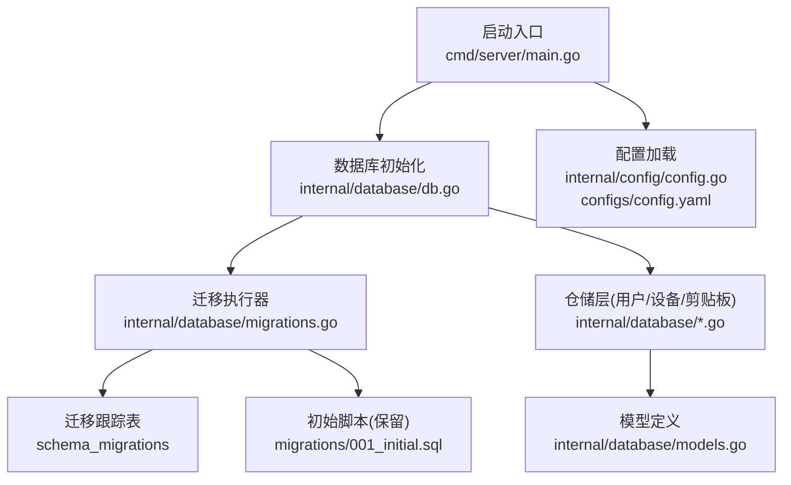
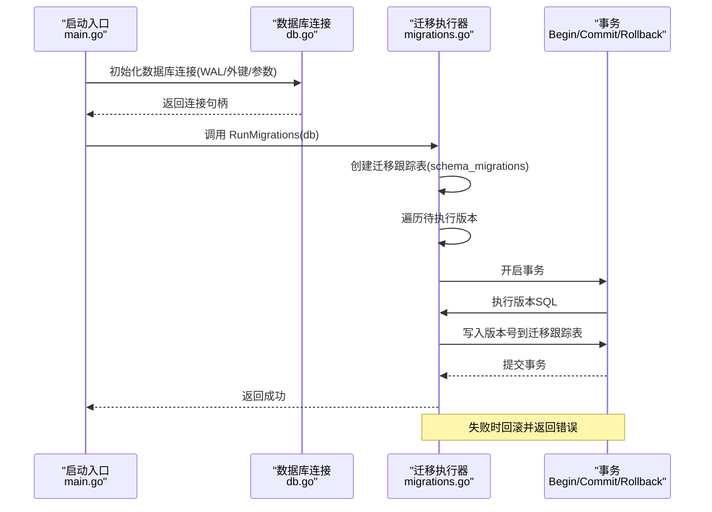
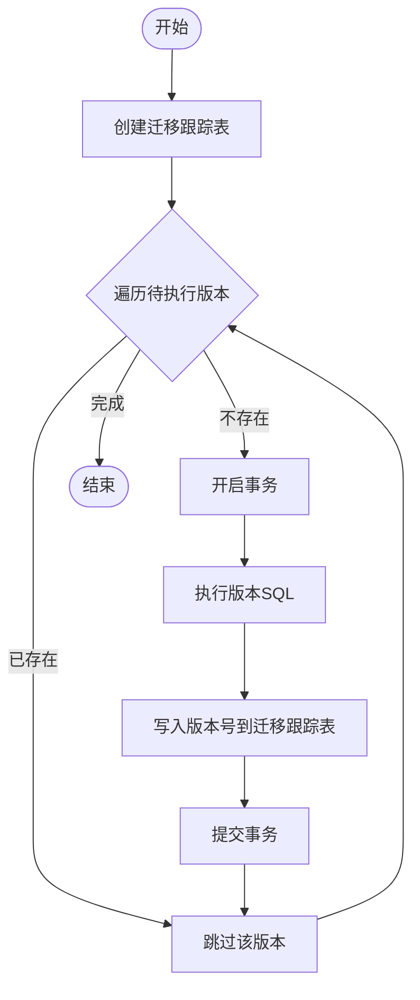
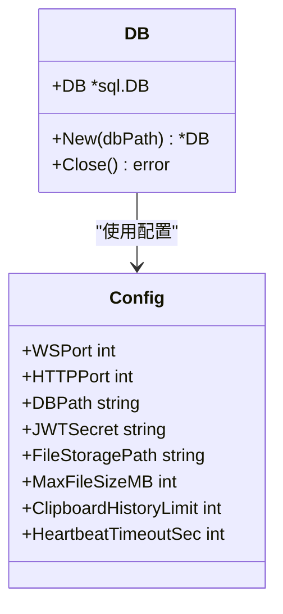
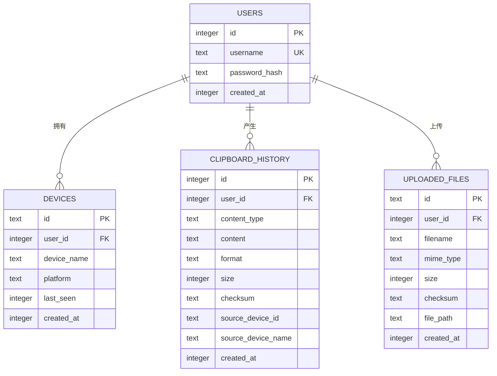
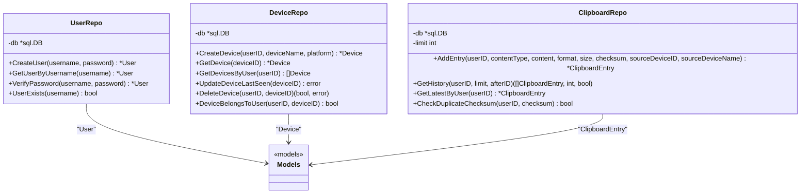
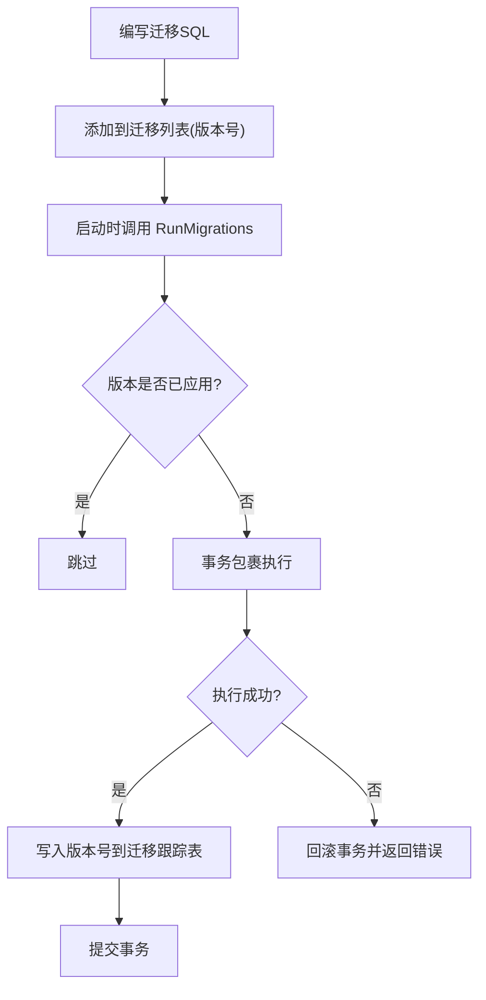
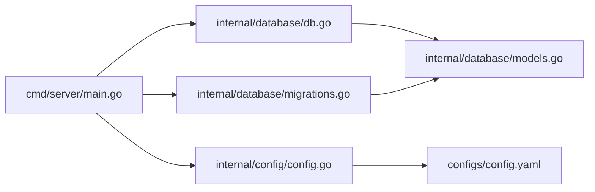

# 迁移管理

<cite>
**本文引用的文件**
- [clipSync-server/cmd/server/main.go](file://clipSync-server/cmd/server/main.go)
- [clipSync-server/internal/database/db.go](file://clipSync-server/internal/database/db.go)
- [clipSync-server/internal/database/migrations.go](file://clipSync-server/internal/database/migrations.go)
- [clipSync-server/internal/database/models.go](file://clipSync-server/internal/database/models.go)
- [clipSync-server/internal/database/user_repo.go](file://clipSync-server/internal/database/user_repo.go)
- [clipSync-server/internal/database/device_repo.go](file://clipSync-server/internal/database/device_repo.go)
- [clipSync-server/internal/database/clipboard_repo.go](file://clipSync-server/internal/database/clipboard_repo.go)
- [clipSync-server/configs/config.yaml](file://clipSync-server/configs/config.yaml)
- [clipSync-server/internal/config/config.go](file://clipSync-server/internal/config/config.go)
- [clipSync-server/migrations/001_initial.sql](file://clipSync-server/migrations/001_initial.sql)
</cite>

## 目录
1. [简介](#简介)
2. [项目结构](#项目结构)
3. [核心组件](#核心组件)
4. [架构总览](#架构总览)
5. [详细组件分析](#详细组件分析)
6. [依赖关系分析](#依赖关系分析)
7. [性能考量](#性能考量)
8. [故障排查指南](#故障排查指南)
9. [结论](#结论)
10. [附录](#附录)

## 简介
本文件系统化阐述服务器端数据库迁移管理的设计与实现，覆盖版本控制策略、迁移脚本编写规范、执行流程、初始数据库结构创建、表结构变更与数据迁移策略、回滚机制与版本兼容性处理、数据完整性保障、错误处理与恢复策略，并提供最佳实践与常见问题解决方案。目标是帮助开发者在不破坏现有数据的前提下安全地演进数据库模式。

## 项目结构
服务器端迁移管理位于 Go 后端模块中，核心入口在服务启动时调用迁移函数；数据库连接与 WAL 模式优化在独立包中；迁移跟踪表用于记录已应用版本；模型定义与仓储层负责数据访问与业务逻辑。

图示来源
- [clipSync-server/cmd/server/main.go:43-54](file://clipSync-server/cmd/server/main.go#L43-L54)
- [clipSync-server/internal/database/db.go:17-55](file://clipSync-server/internal/database/db.go#L17-L55)
- [clipSync-server/internal/database/migrations.go:8-113](file://clipSync-server/internal/database/migrations.go#L8-L113)
- [clipSync-server/migrations/001_initial.sql:1-55](file://clipSync-server/migrations/001_initial.sql#L1-L55)
- [clipSync-server/internal/config/config.go:38-55](file://clipSync-server/internal/config/config.go#L38-L55)
- [clipSync-server/configs/config.yaml:1-29](file://clipSync-server/configs/config.yaml#L1-L29)

章节来源
- [clipSync-server/cmd/server/main.go:43-54](file://clipSync-server/cmd/server/main.go#L43-L54)
- [clipSync-server/internal/database/db.go:17-55](file://clipSync-server/internal/database/db.go#L17-L55)
- [clipSync-server/internal/database/migrations.go:8-113](file://clipSync-server/internal/database/migrations.go#L8-L113)
- [clipSync-server/migrations/001_initial.sql:1-55](file://clipSync-server/migrations/001_initial.sql#L1-L55)
- [clipSync-server/internal/config/config.go:38-55](file://clipSync-server/internal/config/config.go#L38-L55)
- [clipSync-server/configs/config.yaml:1-29](file://clipSync-server/configs/config.yaml#L1-L29)

## 核心组件
- 数据库连接与优化：封装 SQLite 连接，启用 WAL 模式、外键约束、同步级别调整、缓存与临时存储设置，并进行健康检查。
- 迁移执行器：维护迁移跟踪表，按版本顺序执行 SQL，事务包裹每个迁移，失败自动回滚并返回错误。
- 初始脚本：提供可读性强的初始建模 SQL（含索引），作为参考与审计依据。
- 配置系统：从 YAML 加载配置，支持默认值与生产安全校验（如 JWT 密钥提示）。
- 仓储层与模型：定义用户、设备、剪贴板条目、上传文件等模型，以及对应的增删改查操作。

章节来源
- [clipSync-server/internal/database/db.go:17-55](file://clipSync-server/internal/database/db.go#L17-L55)
- [clipSync-server/internal/database/migrations.go:8-113](file://clipSync-server/internal/database/migrations.go#L8-L113)
- [clipSync-server/migrations/001_initial.sql:1-55](file://clipSync-server/migrations/001_initial.sql#L1-L55)
- [clipSync-server/internal/config/config.go:38-71](file://clipSync-server/internal/config/config.go#L38-L71)
- [clipSync-server/configs/config.yaml:1-29](file://clipSync-server/configs/config.yaml#L1-L29)
- [clipSync-server/internal/database/models.go:3-45](file://clipSync-server/internal/database/models.go#L3-L45)

## 架构总览
下图展示了启动阶段的迁移执行序列，强调事务性、幂等性与错误回滚路径。

图示来源
- [clipSync-server/cmd/server/main.go:43-54](file://clipSync-server/cmd/server/main.go#L43-L54)
- [clipSync-server/internal/database/db.go:17-55](file://clipSync-server/internal/database/db.go#L17-L55)
- [clipSync-server/internal/database/migrations.go:82-110](file://clipSync-server/internal/database/migrations.go#L82-L110)

## 详细组件分析

### 组件A：迁移执行器（RunMigrations）
- 版本控制策略
  - 使用 schema_migrations 表记录已应用版本，避免重复执行。
  - 迁移以版本号顺序执行，当前实现仅包含版本 1。
- 执行流程
  - 先确保迁移跟踪表存在。
  - 对每个版本：查询是否已存在，若不存在则开启事务执行 SQL 并写入版本号，最后提交。
  - 任一步骤失败均回滚，返回错误。
- 回滚机制
  - 当前实现未内置 down 脚本，回滚需手动实现或通过备份恢复。
- 版本兼容性
  - 新增版本时，保持旧版本 SQL 不变，新增版本 SQL 作为新条目加入列表。

图示来源
- [clipSync-server/internal/database/migrations.go:82-110](file://clipSync-server/internal/database/migrations.go#L82-L110)

章节来源
- [clipSync-server/internal/database/migrations.go:8-113](file://clipSync-server/internal/database/migrations.go#L8-L113)

### 组件B：数据库连接与优化（SQLite）
- 连接参数
  - WAL 模式提升并发读取性能。
  - 外键约束开启，保证参照完整性。
  - 同步级别、缓存大小、临时存储内存化等参数优化。
- 连接池
  - 最大打开连接数、空闲连接数限制，适配 2 核 2G 服务器场景。
- 健康检查
  - Ping 成功后才认为连接可用。

图示来源
- [clipSync-server/internal/database/db.go:12-55](file://clipSync-server/internal/database/db.go#L12-L55)
- [clipSync-server/internal/config/config.go:10-21](file://clipSync-server/internal/config/config.go#L10-L21)
- [clipSync-server/configs/config.yaml:3-28](file://clipSync-server/configs/config.yaml#L3-L28)

章节来源
- [clipSync-server/internal/database/db.go:17-55](file://clipSync-server/internal/database/db.go#L17-L55)
- [clipSync-server/internal/config/config.go:38-71](file://clipSync-server/internal/config/config.go#L38-L71)
- [clipSync-server/configs/config.yaml:1-29](file://clipSync-server/configs/config.yaml#L1-L29)

### 组件C：初始数据库结构（users/devices/clipboard_history/uploaded_files）
- 结构要点
  - 用户表：唯一用户名、密码哈希、时间戳。
  - 设备表：主键设备 ID、用户外键、平台、最近活跃时间、创建时间、级联删除。
  - 剪贴板历史表：内容类型、格式、大小、校验和、来源设备信息、时间戳、外键级联删除。
  - 上传文件表：文件元数据、校验和、物理路径、时间戳、外键级联删除。
- 索引设计
  - 设备按 user_id 建索引。
  - 剪贴板按 user_id、checksum、created_at 建索引，支持去重与高效查询。
  - 文件按 user_id 建索引。
- 时间字段
  - 使用毫秒级 Unix 时间戳，便于跨语言处理。

图示来源
- [clipSync-server/migrations/001_initial.sql:4-55](file://clipSync-server/migrations/001_initial.sql#L4-L55)
- [clipSync-server/internal/database/migrations.go:26-78](file://clipSync-server/internal/database/migrations.go#L26-L78)

章节来源
- [clipSync-server/migrations/001_initial.sql:1-55](file://clipSync-server/migrations/001_initial.sql#L1-L55)
- [clipSync-server/internal/database/migrations.go:20-80](file://clipSync-server/internal/database/migrations.go#L20-L80)

### 组件D：仓储层与数据访问（用户/设备/剪贴板）
- 用户仓储
  - 创建用户时生成密码哈希，插入数据库并返回用户信息。
  - 支持按用户名查询、验证密码、检测用户名是否存在。
- 设备仓储
  - 注册设备时生成唯一设备 ID，插入数据库并返回设备信息。
  - 支持按 ID 查询、按用户查询、更新最近活跃时间、删除设备、校验所有权。
- 剪贴板仓储
  - 插入剪贴板条目，强制历史上限（超过限制删除最旧条目）。
  - 支持分页查询历史、查询最新条目、基于校验和去重检查。

图示来源
- [clipSync-server/internal/database/user_repo.go:21-90](file://clipSync-server/internal/database/user_repo.go#L21-L90)
- [clipSync-server/internal/database/device_repo.go:21-125](file://clipSync-server/internal/database/device_repo.go#L21-L125)
- [clipSync-server/internal/database/clipboard_repo.go:20-140](file://clipSync-server/internal/database/clipboard_repo.go#L20-L140)
- [clipSync-server/internal/database/models.go:3-45](file://clipSync-server/internal/database/models.go#L3-L45)

章节来源
- [clipSync-server/internal/database/user_repo.go:21-90](file://clipSync-server/internal/database/user_repo.go#L21-L90)
- [clipSync-server/internal/database/device_repo.go:21-125](file://clipSync-server/internal/database/device_repo.go#L21-L125)
- [clipSync-server/internal/database/clipboard_repo.go:20-140](file://clipSync-server/internal/database/clipboard_repo.go#L20-L140)
- [clipSync-server/internal/database/models.go:3-45](file://clipSync-server/internal/database/models.go#L3-L45)

### 组件E：迁移脚本编写规范与执行流程
- 规范
  - 使用幂等语句（如 IF NOT EXISTS）。
  - 明确版本号与注释，便于审计。
  - 为关键列建立必要索引，兼顾查询与写入性能。
  - 外键约束与级联删除策略明确，避免孤儿数据。
- 执行流程
  - 启动时先创建迁移跟踪表，再逐版本执行，失败即回滚。
  - 历史版本不可修改，新增版本以新版本号追加。

图示来源
- [clipSync-server/internal/database/migrations.go:82-110](file://clipSync-server/internal/database/migrations.go#L82-L110)

章节来源
- [clipSync-server/internal/database/migrations.go:8-113](file://clipSync-server/internal/database/migrations.go#L8-L113)

## 依赖关系分析
- 启动入口依赖数据库初始化与迁移执行器。
- 迁移执行器依赖数据库连接与迁移跟踪表。
- 仓储层依赖数据库连接与模型定义。
- 配置系统为数据库路径、JWT、文件存储、历史限制等提供运行时参数。

图示来源
- [clipSync-server/cmd/server/main.go:43-54](file://clipSync-server/cmd/server/main.go#L43-L54)
- [clipSync-server/internal/database/db.go:17-55](file://clipSync-server/internal/database/db.go#L17-L55)
- [clipSync-server/internal/database/migrations.go:8-113](file://clipSync-server/internal/database/migrations.go#L8-L113)
- [clipSync-server/internal/database/models.go:3-45](file://clipSync-server/internal/database/models.go#L3-L45)
- [clipSync-server/internal/config/config.go:38-55](file://clipSync-server/internal/config/config.go#L38-L55)
- [clipSync-server/configs/config.yaml:1-29](file://clipSync-server/configs/config.yaml#L1-L29)

章节来源
- [clipSync-server/cmd/server/main.go:43-54](file://clipSync-server/cmd/server/main.go#L43-L54)
- [clipSync-server/internal/database/db.go:17-55](file://clipSync-server/internal/database/db.go#L17-L55)
- [clipSync-server/internal/database/migrations.go:8-113](file://clipSync-server/internal/database/migrations.go#L8-L113)
- [clipSync-server/internal/database/models.go:3-45](file://clipSync-server/internal/database/models.go#L3-L45)
- [clipSync-server/internal/config/config.go:38-55](file://clipSync-server/internal/config/config.go#L38-L55)
- [clipSync-server/configs/config.yaml:1-29](file://clipSync-server/configs/config.yaml#L1-L29)

## 性能考量
- WAL 模式：提升并发读取吞吐，适合多客户端同时访问。
- 连接池：限制最大打开连接数与空闲连接数，降低资源占用。
- 索引设计：针对高频查询列建立索引，平衡写入与读取性能。
- 历史上限：剪贴板历史按用户限制数量，避免无限增长导致性能退化。
- 参数优化：同步级别、缓存大小、临时存储内存化，适配小规模服务器。

章节来源
- [clipSync-server/internal/database/db.go:29-49](file://clipSync-server/internal/database/db.go#L29-L49)
- [clipSync-server/internal/database/clipboard_repo.go:39-50](file://clipSync-server/internal/database/clipboard_repo.go#L39-L50)
- [clipSync-server/migrations/001_initial.sql:38-40](file://clipSync-server/migrations/001_initial.sql#L38-L40)

## 故障排查指南
- 迁移失败
  - 症状：启动时报错，无法继续。
  - 排查：查看具体版本号与错误信息；确认事务包裹内的 SQL 是否幂等；检查外键约束与索引冲突。
  - 处理：修复 SQL 后重新启动；若涉及数据修复，建议备份后在测试环境验证。
- 迁移跟踪异常
  - 症状：迁移重复执行或未执行。
  - 排查：检查 schema_migrations 表记录；确认版本号是否正确。
  - 处理：清理异常记录或补充缺失记录后重启。
- 数据库连接失败
  - 症状：无法打开数据库或连接超时。
  - 排查：确认数据库路径存在且可写；检查权限；验证 WAL 模式与外键设置。
  - 处理：修正路径与权限；调整 _busy_timeout 参数；确保数据库目录存在。
- 历史上限与性能
  - 症状：查询缓慢或磁盘占用上升。
  - 排查：确认历史上限配置；检查索引是否生效。
  - 处理：适当提高历史上限或优化查询；定期监控磁盘与内存使用。

章节来源
- [clipSync-server/internal/database/migrations.go:91-110](file://clipSync-server/internal/database/migrations.go#L91-L110)
- [clipSync-server/internal/database/db.go:17-55](file://clipSync-server/internal/database/db.go#L17-L55)
- [clipSync-server/internal/database/clipboard_repo.go:39-50](file://clipSync-server/internal/database/clipboard_repo.go#L39-L50)

## 结论
本项目的迁移管理采用“内嵌迁移 + 事务包裹 + 迁移跟踪表”的轻量方案，具备幂等性与可回溯性。当前仅包含初始版本，后续演进应遵循“不可修改旧版本、新增版本号”的原则，并在每次变更前做好备份与测试。通过 WAL 模式、索引与历史上限等手段，系统在小规模部署场景下具备良好的性能与稳定性。

## 附录
- 迁移脚本语法规范
  - 使用幂等语句（如 IF NOT EXISTS）。
  - 明确版本号与注释，便于审计。
  - 为关键列建立必要索引。
  - 外键约束与级联删除策略明确。
- 回滚机制与版本兼容性
  - 当前未内置 down 脚本，回滚需手动实现或通过备份恢复。
  - 新增版本以新版本号追加，旧版本 SQL 不得修改。
- 数据完整性保证
  - 外键约束与级联删除防止孤儿数据。
  - 剪贴板校验和去重避免重复同步。
  - 事务包裹确保单版本迁移原子性。
- 错误处理与恢复策略
  - 迁移失败自动回滚并返回错误，避免半成品状态。
  - 建议在生产环境执行迁移前进行备份与灰度验证。
- 最佳实践
  - 在开发环境充分测试迁移脚本。
  - 小步快跑，每次只增加一个版本。
  - 记录每次迁移的变更点与影响范围。
  - 生产环境务必更改默认密钥与参数。