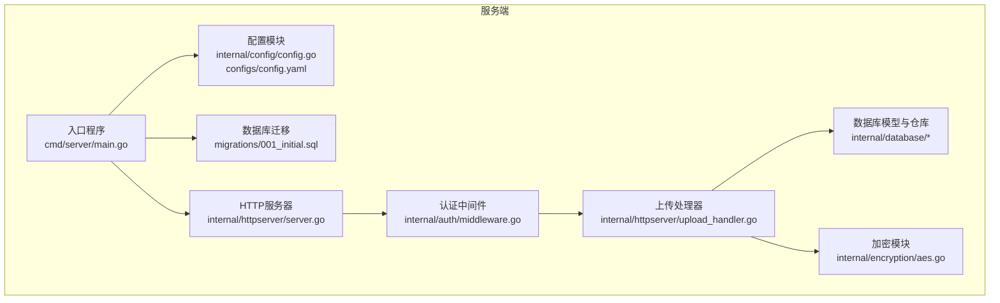
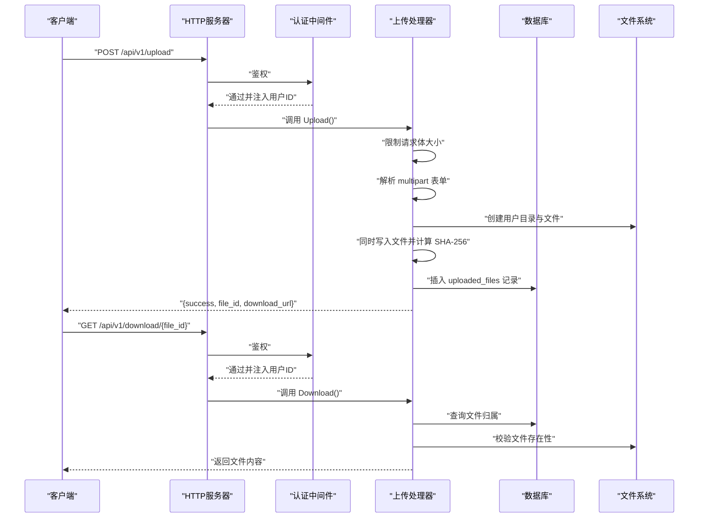
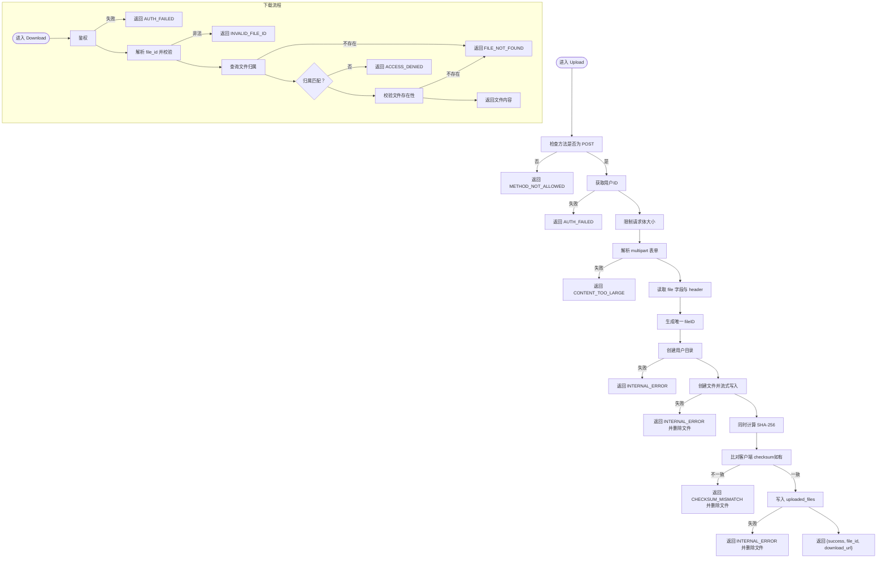
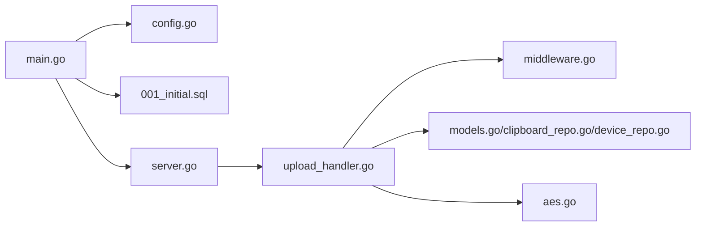
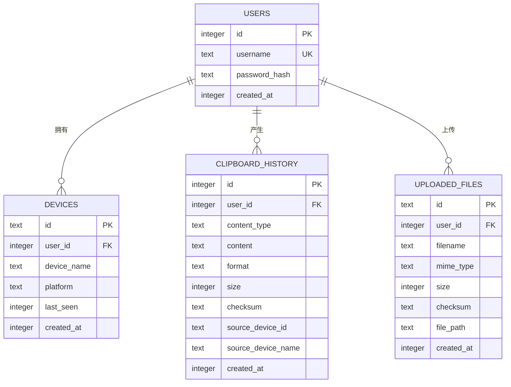

# 文件上传系统

<cite>
**本文引用的文件**
- [clipSync-server/cmd/server/main.go](file://clipSync-server/cmd/server/main.go)
- [clipSync-server/internal/config/config.go](file://clipSync-server/internal/config/config.go)
- [clipSync-server/configs/config.yaml](file://clipSync-server/configs/config.yaml)
- [clipSync-server/migrations/001_initial.sql](file://clipSync-server/migrations/001_initial.sql)
- [clipSync-server/internal/httpserver/upload_handler.go](file://clipSync-server/internal/httpserver/upload_handler.go)
- [clipSync-server/internal/httpserver/server.go](file://clipSync-server/internal/httpserver/server.go)
- [clipSync-server/internal/auth/middleware.go](file://clipSync-server/internal/auth/middleware.go)
- [clipSync-server/internal/database/models.go](file://clipSync-server/internal/database/models.go)
- [clipSync-server/internal/database/clipboard_repo.go](file://clipSync-server/internal/database/clipboard_repo.go)
- [clipSync-server/internal/database/device_repo.go](file://clipSync-server/internal/database/device_repo.go)
- [clipSync-server/internal/encryption/aes.go](file://clipSync-server/internal/encryption/aes.go)
- [clipSync-android/app/src/main/java/com/clipsync/app/network/Protocol.kt](file://clipSync-android/app/src/main/java/com/clipsync/app/network/Protocol.kt)
- [clipSync-windows/ClipSync.WPF/Network/Protocol.cs](file://clipSync-windows/ClipSync.WPF/Network/Protocol.cs)
</cite>

## 目录
1. [简介](#简介)
2. [项目结构](#项目结构)
3. [核心组件](#核心组件)
4. [架构总览](#架构总览)
5. [详细组件分析](#详细组件分析)
6. [依赖分析](#依赖分析)
7. [性能考虑](#性能考虑)
8. [故障排查指南](#故障排查指南)
9. [结论](#结论)
10. [附录](#附录)

## 简介
本文件上传系统由服务端与多端客户端组成，提供基于 HTTP 的文件上传与下载能力，结合用户认证、文件完整性校验与访问控制，确保数据在传输与存储过程中的安全性与一致性。系统支持：
- 文件上传：接收 multipart/form-data，计算 SHA-256 校验，持久化到磁盘与数据库
- 文件下载：按用户隔离的目录结构访问，进行权限与存在性校验
- 安全机制：JWT 认证中间件、请求体大小限制、路径遍历防护、校验和比对
- 存储策略：用户子目录隔离、SQLite 元数据管理、索引优化
- 大文件与并发：通过流式写入与单文件处理实现，未内置断点续传
- 配置管理：集中于 YAML 配置，支持运行时加载与默认值校验

## 项目结构
服务端采用分层设计：入口程序负责初始化配置、数据库迁移、路由注册；HTTP 层提供认证、设备管理、上传下载接口；数据库层负责模型与仓库；加密模块提供跨平台兼容的对称加密。

图表来源
- [clipSync-server/cmd/server/main.go:1-146](file://clipSync-server/cmd/server/main.go#L1-L146)
- [clipSync-server/internal/config/config.go:1-72](file://clipSync-server/internal/config/config.go#L1-L72)
- [clipSync-server/configs/config.yaml:1-29](file://clipSync-server/configs/config.yaml#L1-L29)
- [clipSync-server/internal/httpserver/server.go:1-50](file://clipSync-server/internal/httpserver/server.go#L1-L50)
- [clipSync-server/internal/httpserver/upload_handler.go:1-221](file://clipSync-server/internal/httpserver/upload_handler.go#L1-L221)
- [clipSync-server/internal/auth/middleware.go:1-111](file://clipSync-server/internal/auth/middleware.go#L1-L111)
- [clipSync-server/internal/database/models.go:1-46](file://clipSync-server/internal/database/models.go#L1-L46)
- [clipSync-server/migrations/001_initial.sql:1-55](file://clipSync-server/migrations/001_initial.sql#L1-L55)

章节来源
- [clipSync-server/cmd/server/main.go:1-146](file://clipSync-server/cmd/server/main.go#L1-L146)
- [clipSync-server/internal/config/config.go:1-72](file://clipSync-server/internal/config/config.go#L1-L72)
- [clipSync-server/configs/config.yaml:1-29](file://clipSync-server/configs/config.yaml#L1-L29)
- [clipSync-server/migrations/001_initial.sql:1-55](file://clipSync-server/migrations/001_initial.sql#L1-L55)

## 核心组件
- 配置模块：加载 YAML 配置，提供默认值与生产安全警告
- HTTP 服务器：统一超时设置与优雅关闭
- 上传处理器：实现上传与下载，含大小限制、校验和、路径隔离与访问控制
- 认证中间件：从 Authorization 头解析 Bearer Token，注入用户上下文
- 数据库层：模型定义与仓库操作（用户、设备、剪贴板历史、已上传文件）
- 加密模块：AES-256-CBC 与 PBKDF2，兼容跨平台格式

章节来源
- [clipSync-server/internal/config/config.go:1-72](file://clipSync-server/internal/config/config.go#L1-L72)
- [clipSync-server/internal/httpserver/server.go:1-50](file://clipSync-server/internal/httpserver/server.go#L1-L50)
- [clipSync-server/internal/httpserver/upload_handler.go:19-221](file://clipSync-server/internal/httpserver/upload_handler.go#L19-L221)
- [clipSync-server/internal/auth/middleware.go:22-111](file://clipSync-server/internal/auth/middleware.go#L22-L111)
- [clipSync-server/internal/database/models.go:3-46](file://clipSync-server/internal/database/models.go#L3-L46)
- [clipSync-server/internal/encryption/aes.go:16-135](file://clipSync-server/internal/encryption/aes.go#L16-L135)

## 架构总览
服务端启动后加载配置与执行数据库迁移，随后注册认证与上传下载路由。上传请求经认证中间件后进入上传处理器，下载请求同样需要认证并进行用户归属与路径校验。

图表来源
- [clipSync-server/cmd/server/main.go:74-99](file://clipSync-server/cmd/server/main.go#L74-L99)
- [clipSync-server/internal/httpserver/upload_handler.go:36-214](file://clipSync-server/internal/httpserver/upload_handler.go#L36-L214)
- [clipSync-server/internal/auth/middleware.go:32-61](file://clipSync-server/internal/auth/middleware.go#L32-L61)

## 详细组件分析

### 上传处理器（UploadHandler）
职责与流程
- 上传：限制请求体大小、解析表单、提取文件与校验和、生成唯一文件ID、创建用户专属目录、流式写入并计算 SHA-256、写入数据库、返回下载链接
- 下载：鉴权、校验 file_id 合法性（防止路径穿越）、查询数据库确认归属、拼接用户目录下的文件路径、校验文件存在性后直接返回文件

关键特性
- 请求体大小限制：使用 MaxBytesReader 与 ParseMultipartForm 的双重限制
- 完整性校验：客户端可提供 checksum，服务端同时计算并比对
- 用户隔离：以 user_id 为子目录名，避免跨用户访问
- 路径安全：严格校验 file_id 不含路径遍历字符
- 错误处理：失败时删除临时文件，返回结构化错误码

图表来源
- [clipSync-server/internal/httpserver/upload_handler.go:36-214](file://clipSync-server/internal/httpserver/upload_handler.go#L36-L214)

章节来源
- [clipSync-server/internal/httpserver/upload_handler.go:19-221](file://clipSync-server/internal/httpserver/upload_handler.go#L19-L221)

### 认证中间件（Middleware）
- 从 Authorization 头提取 Bearer Token
- 使用 JWTManager 校验并解析令牌
- 将用户信息注入请求上下文，供后续处理器使用
- 提供 GetUserID 等便捷函数

章节来源
- [clipSync-server/internal/auth/middleware.go:22-111](file://clipSync-server/internal/auth/middleware.go#L22-L111)

### 配置与数据库
- 配置项：HTTP/WS 端口、数据库路径、JWT 密钥与过期时间、文件存储路径、最大文件大小、剪贴板历史上限、心跳超时等
- 数据库模式：users、devices、clipboard_history、uploaded_files，包含必要的外键与索引
- 运行时加载：支持环境变量覆盖配置文件路径

章节来源
- [clipSync-server/internal/config/config.go:10-72](file://clipSync-server/internal/config/config.go#L10-L72)
- [clipSync-server/configs/config.yaml:1-29](file://clipSync-server/configs/config.yaml#L1-29)
- [clipSync-server/migrations/001_initial.sql:4-55](file://clipSync-server/migrations/001_initial.sql#L4-L55)

### 数据模型与仓库
- 模型：User、Device、ClipboardEntry、UploadedFile
- 仓库：ClipboardRepo 支持历史上限裁剪与重复校验；DeviceRepo 支持设备 CRUD 与归属校验
- 上传文件模型：包含 id、user_id、filename、mime_type、size、checksum、file_path、created_at

章节来源
- [clipSync-server/internal/database/models.go:3-46](file://clipSync-server/internal/database/models.go#L3-L46)
- [clipSync-server/internal/database/clipboard_repo.go:20-140](file://clipSync-server/internal/database/clipboard_repo.go#L20-L140)
- [clipSync-server/internal/database/device_repo.go:21-126](file://clipSync-server/internal/database/device_repo.go#L21-L126)

### 加密模块（AES-256-CBC）
- 加密输出格式：base64(salt):base64(IV + ciphertext)，兼容所有客户端
- 解密输入格式：同上，内部解析盐、IV 与密文并解密
- 使用 PBKDF2+SHA3-256 派生密钥，迭代次数固定

章节来源
- [clipSync-server/internal/encryption/aes.go:22-135](file://clipSync-server/internal/encryption/aes.go#L22-L135)

### 客户端协议（Android 与 Windows）
- Android：定义了 WebSocket 消息类型、错误码与 HTTP API 数据类
- Windows：定义了消息序列化/反序列化与剪贴板推送消息的构造逻辑，支持可选加密

章节来源
- [clipSync-android/app/src/main/java/com/clipsync/app/network/Protocol.kt:171-263](file://clipSync-android/app/src/main/java/com/clipsync/app/network/Protocol.kt#L171-L263)
- [clipSync-windows/ClipSync.WPF/Network/Protocol.cs:79-141](file://clipSync-windows/ClipSync.WPF/Network/Protocol.cs#L79-L141)

## 依赖分析
- 入口程序负责装配各组件并注册路由
- 上传处理器依赖认证中间件、数据库连接与文件系统
- 认证中间件依赖 JWT 管理器
- 数据库层依赖 SQLite 与迁移脚本
- 加密模块独立，可被客户端复用

图表来源
- [clipSync-server/cmd/server/main.go:31-106](file://clipSync-server/cmd/server/main.go#L31-L106)
- [clipSync-server/internal/httpserver/upload_handler.go:19-34](file://clipSync-server/internal/httpserver/upload_handler.go#L19-L34)
- [clipSync-server/internal/auth/middleware.go:22-30](file://clipSync-server/internal/auth/middleware.go#L22-L30)
- [clipSync-server/internal/database/models.go:3-46](file://clipSync-server/internal/database/models.go#L3-L46)
- [clipSync-server/migrations/001_initial.sql:42-55](file://clipSync-server/migrations/001_initial.sql#L42-L55)

章节来源
- [clipSync-server/cmd/server/main.go:1-146](file://clipSync-server/cmd/server/main.go#L1-L146)
- [clipSync-server/internal/httpserver/upload_handler.go:1-221](file://clipSync-server/internal/httpserver/upload_handler.go#L1-L221)
- [clipSync-server/internal/auth/middleware.go:1-111](file://clipSync-server/internal/auth/middleware.go#L1-L111)
- [clipSync-server/internal/database/models.go:1-46](file://clipSync-server/internal/database/models.go#L1-L46)
- [clipSync-server/migrations/001_initial.sql:1-55](file://clipSync-server/migrations/001_initial.sql#L1-L55)

## 性能考虑
- 流式写入：上传时使用 io.Copy 将数据同时写入文件与哈希器，避免额外内存占用
- 单文件处理：当前实现按单文件处理，未内置断点续传或分片合并
- 索引优化：uploaded_files 与 clipboard_history 均有用户维度索引，提升查询效率
- 并发上传：未见显式的并发上传队列或限速策略，建议在网关或应用层增加速率限制
- 存储路径：用户子目录隔离，减少目录内文件数量，有利于文件系统性能

章节来源
- [clipSync-server/internal/httpserver/upload_handler.go:88-111](file://clipSync-server/internal/httpserver/upload_handler.go#L88-L111)
- [clipSync-server/migrations/001_initial.sql:38-55](file://clipSync-server/migrations/001_initial.sql#L38-L55)

## 故障排查指南
常见错误与定位
- AUTH_FAILED：缺少或无效的 Authorization 头，或令牌过期
- METHOD_NOT_ALLOWED：请求方法不正确
- CONTENT_TOO_LARGE：请求体超过 max_file_size_mb 限制
- INVALID_PAYLOAD：multipart 表单中缺少 file 字段
- CHECKSUM_MISMATCH：客户端与服务端计算的 SHA-256 不一致
- INVALID_FILE_ID：file_id 包含路径穿越字符
- FILE_NOT_FOUND：数据库记录或文件系统中找不到目标文件
- ACCESS_DENIED：文件不属于当前用户
- INTERNAL_ERROR：文件创建、写入或数据库插入失败

排查步骤
- 检查配置文件与环境变量是否正确加载
- 确认 JWT 令牌有效且未过期
- 核对上传请求是否为 multipart/form-data，且包含 file 字段
- 对比客户端提供的 checksum 与服务端计算结果
- 确认 file_id 合法且文件存在于用户目录下
- 查看服务器日志与数据库状态

章节来源
- [clipSync-server/internal/httpserver/upload_handler.go:36-214](file://clipSync-server/internal/httpserver/upload_handler.go#L36-L214)
- [clipSync-server/internal/auth/middleware.go:32-61](file://clipSync-server/internal/auth/middleware.go#L32-L61)
- [clipSync-server/internal/config/config.go:57-71](file://clipSync-server/internal/config/config.go#L57-L71)

## 结论
该文件上传系统以简洁可靠为核心设计原则：通过 JWT 认证、请求体大小限制、路径安全校验与 SHA-256 校验，保障了上传与下载的安全性；通过用户目录隔离与数据库元数据管理，实现了清晰的存储策略与访问控制。当前未实现断点续传与并发限速，建议在生产环境中结合网关策略与监控体系进一步增强稳定性与安全性。

## 附录

### 配置项说明
- ws_port：WebSocket 服务端口
- http_port：HTTP API 服务端口
- db_path：SQLite 数据库存储路径
- jwt_secret：JWT 密钥（生产必须修改）
- jwt_expiry_hours：JWT 过期小时数
- file_storage_path：文件存储根目录
- max_file_size_mb：最大文件大小（MB）
- clipboard_history_limit：剪贴板历史条目上限
- heartbeat_timeout_seconds：心跳超时秒数

章节来源
- [clipSync-server/configs/config.yaml:1-29](file://clipSync-server/configs/config.yaml#L1-L29)
- [clipSync-server/internal/config/config.go:10-36](file://clipSync-server/internal/config/config.go#L10-L36)

### 数据模型图

图表来源
- [clipSync-server/migrations/001_initial.sql:4-55](file://clipSync-server/migrations/001_initial.sql#L4-L55)
- [clipSync-server/internal/database/models.go:3-46](file://clipSync-server/internal/database/models.go#L3-L46)