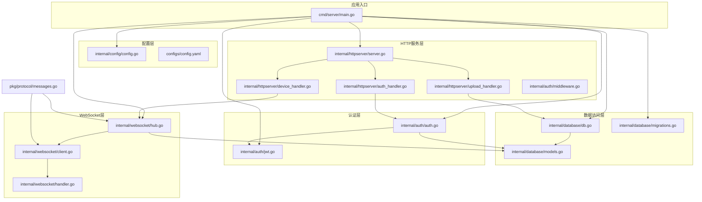
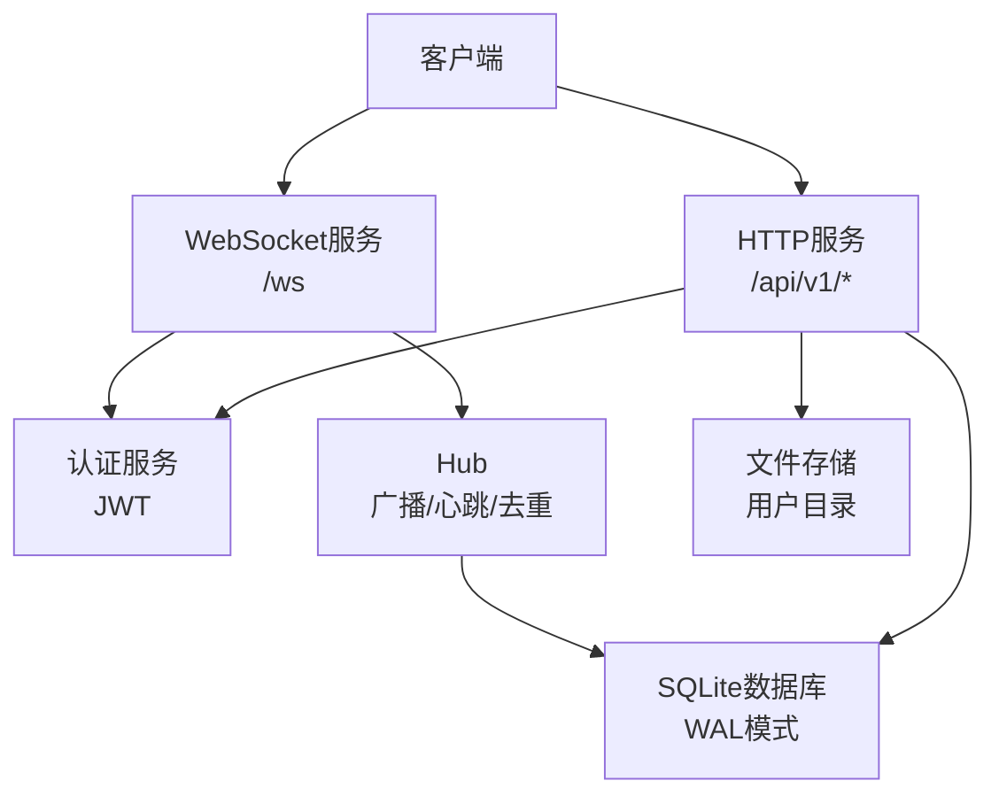
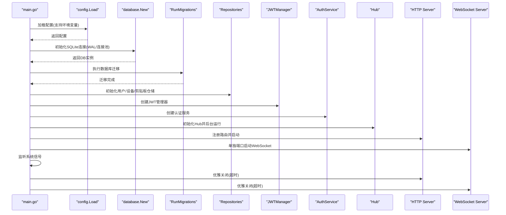
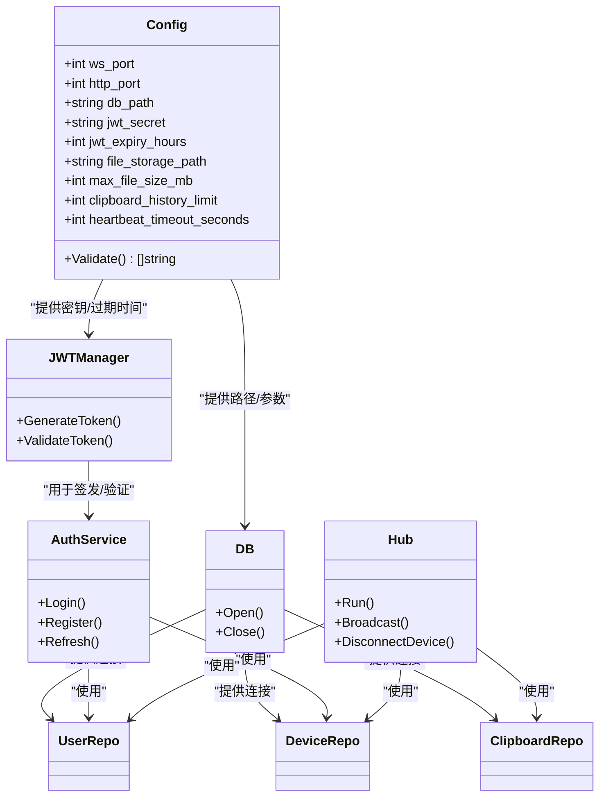
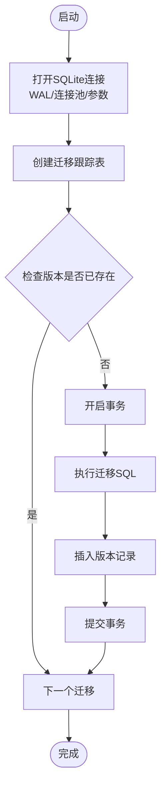
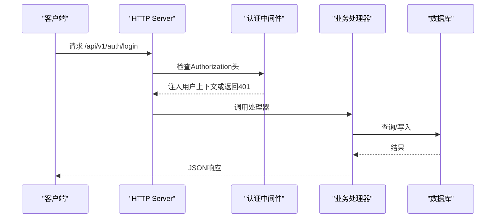
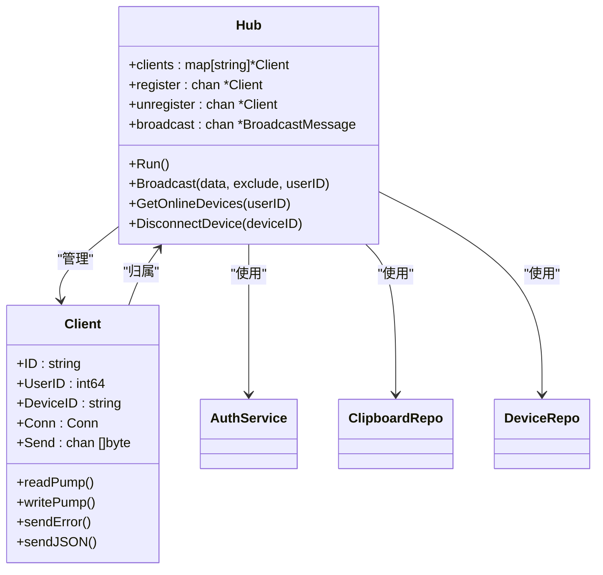
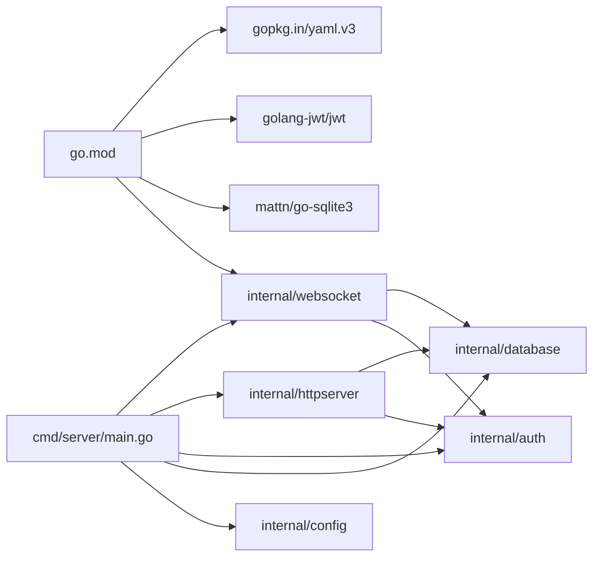

# 服务器架构设计

<cite>
**本文档引用的文件**
- [main.go](file://clipSync-server/cmd/server/main.go)
- [config.go](file://clipSync-server/internal/config/config.go)
- [config.yaml](file://clipSync-server/configs/config.yaml)
- [db.go](file://clipSync-server/internal/database/db.go)
- [migrations.go](file://clipSync-server/internal/database/migrations.go)
- [models.go](file://clipSync-server/internal/database/models.go)
- [server.go](file://clipSync-server/internal/httpserver/server.go)
- [auth_handler.go](file://clipSync-server/internal/httpserver/auth_handler.go)
- [device_handler.go](file://clipSync-server/internal/httpserver/device_handler.go)
- [upload_handler.go](file://clipSync-server/internal/httpserver/upload_handler.go)
- [middleware.go](file://clipSync-server/internal/auth/middleware.go)
- [auth.go](file://clipSync-server/internal/auth/auth.go)
- [jwt.go](file://clipSync-server/internal/auth/jwt.go)
- [hub.go](file://clipSync-server/internal/websocket/hub.go)
- [client.go](file://clipSync-server/internal/websocket/client.go)
- [handler.go](file://clipSync-server/internal/websocket/handler.go)
- [messages.go](file://clipSync-server/pkg/protocol/messages.go)
- [go.mod](file://clipSync-server/go.mod)
</cite>

## 目录
1. [简介](#简介)
2. [项目结构](#项目结构)
3. [核心组件](#核心组件)
4. [架构总览](#架构总览)
5. [详细组件分析](#详细组件分析)
6. [依赖关系分析](#依赖关系分析)
7. [性能考虑](#性能考虑)
8. [故障排除指南](#故障排除指南)
9. [结论](#结论)

## 简介
本文件面向ClipSync服务器架构设计，系统性阐述其整体架构、模块组织、启动流程与组件初始化过程。重点覆盖以下方面：
- 配置加载与校验（含默认值与生产安全警告）
- 数据库初始化与迁移
- 路由构建与中间件集成
- 多服务实例（HTTP与WebSocket）分离部署与优雅关闭
- 依赖注入与模块间通信模式
- WebSocket与HTTP服务的分离架构设计及其技术考量
- 性能优化策略与最佳实践

## 项目结构
服务器采用Go语言实现，遵循分层与按功能域划分的模块化组织方式：
- cmd/server：应用入口，负责启动序列、信号处理与优雅关闭
- internal/*：核心业务模块
  - config：配置加载与校验
  - database：数据库连接、迁移与仓储层
  - httpserver：HTTP服务封装、路由与处理器
  - auth：认证服务、JWT管理与中间件
  - websocket：WebSocket Hub、客户端管理与消息处理
- pkg/protocol：跨协议的消息定义
- configs：运行时配置文件
- go.mod：依赖声明

图表来源
- [main.go:21-146](file://clipSync-server/cmd/server/main.go#L21-L146)
- [config.go:38-72](file://clipSync-server/internal/config/config.go#L38-L72)
- [db.go:17-62](file://clipSync-server/internal/database/db.go#L17-L62)
- [migrations.go:8-114](file://clipSync-server/internal/database/migrations.go#L8-L114)
- [server.go:18-50](file://clipSync-server/internal/httpserver/server.go#L18-L50)
- [auth_handler.go:16-215](file://clipSync-server/internal/httpserver/auth_handler.go#L16-L215)
- [device_handler.go:17-137](file://clipSync-server/internal/httpserver/device_handler.go#L17-L137)
- [upload_handler.go:26-221](file://clipSync-server/internal/httpserver/upload_handler.go#L26-L221)
- [middleware.go:27-111](file://clipSync-server/internal/auth/middleware.go#L27-L111)
- [auth.go:15-137](file://clipSync-server/internal/auth/auth.go#L15-L137)
- [jwt.go](file://clipSync-server/internal/auth/jwt.go)
- [hub.go:44-230](file://clipSync-server/internal/websocket/hub.go#L44-L230)
- [client.go:13-150](file://clipSync-server/internal/websocket/client.go#L13-L150)
- [handler.go:10-392](file://clipSync-server/internal/websocket/handler.go#L10-L392)
- [messages.go:5-132](file://clipSync-server/pkg/protocol/messages.go#L5-L132)

章节来源
- [main.go:21-146](file://clipSync-server/cmd/server/main.go#L21-L146)
- [config.go:10-72](file://clipSync-server/internal/config/config.go#L10-L72)
- [go.mod:1-14](file://clipSync-server/go.mod#L1-L14)

## 核心组件
本节从架构视角梳理关键组件及其职责边界与交互关系。

- 配置管理
  - 负责从YAML文件加载配置，提供默认值，并进行生产安全校验（如JWT密钥提示）
  - 支持通过环境变量覆盖配置路径
- 数据库层
  - 封装SQLite连接，启用WAL模式、连接池与若干性能参数
  - 提供迁移执行，确保表结构与索引一致性
- 认证与授权
  - JWT生成与验证，基于用户、设备与平台信息签发令牌
  - HTTP中间件拦截请求，解析Authorization头，提取上下文信息
- HTTP服务
  - 封装标准HTTP服务器，支持优雅关闭
  - 提供认证、设备管理、文件上传下载等接口
- WebSocket服务
  - Hub集中管理客户端连接，实现广播、心跳、去重与断线处理
  - 客户端读写泵循环，处理消息编解码与心跳保活

章节来源
- [config.go:38-72](file://clipSync-server/internal/config/config.go#L38-L72)
- [db.go:17-62](file://clipSync-server/internal/database/db.go#L17-L62)
- [migrations.go:8-114](file://clipSync-server/internal/database/migrations.go#L8-L114)
- [middleware.go:27-111](file://clipSync-server/internal/auth/middleware.go#L27-L111)
- [auth.go:15-137](file://clipSync-server/internal/auth/auth.go#L15-L137)
- [server.go:18-50](file://clipSync-server/internal/httpserver/server.go#L18-L50)
- [hub.go:44-230](file://clipSync-server/internal/websocket/hub.go#L44-L230)
- [client.go:13-150](file://clipSync-server/internal/websocket/client.go#L13-L150)

## 架构总览
服务器采用“HTTP服务 + WebSocket服务”的双栈分离架构：
- HTTP服务：处理认证、设备管理、文件上传下载等请求
- WebSocket服务：处理实时剪贴板同步、心跳与设备状态广播
- 两者共享数据库与认证服务，通过Hub在WebSocket侧进行用户级广播

图表来源
- [main.go:100-125](file://clipSync-server/cmd/server/main.go#L100-L125)
- [hub.go:44-230](file://clipSync-server/internal/websocket/hub.go#L44-L230)
- [db.go:17-62](file://clipSync-server/internal/database/db.go#L17-L62)

## 详细组件分析

### 启动流程与组件初始化
- 日志初始化与版本输出
- 配置加载与校验（默认值与安全警告）
- 数据库初始化与迁移
- 仓储层初始化（用户、设备、剪贴板）
- 认证服务与JWT管理器初始化
- WebSocket Hub初始化与后台运行
- HTTP中间件与路由注册
- HTTP与WebSocket服务分别启动
- 信号监听与优雅关闭

图表来源
- [main.go:21-146](file://clipSync-server/cmd/server/main.go#L21-L146)
- [config.go:38-72](file://clipSync-server/internal/config/config.go#L38-L72)
- [db.go:17-62](file://clipSync-server/internal/database/db.go#L17-L62)
- [migrations.go:8-114](file://clipSync-server/internal/database/migrations.go#L8-L114)
- [hub.go:60-112](file://clipSync-server/internal/websocket/hub.go#L60-L112)
- [server.go:26-49](file://clipSync-server/internal/httpserver/server.go#L26-L49)

章节来源
- [main.go:21-146](file://clipSync-server/cmd/server/main.go#L21-L146)

### 配置管理与依赖注入
- 配置结构体包含端口、数据库路径、JWT密钥、文件存储路径、文件大小限制、历史条数限制、心跳超时等
- 默认配置提供合理的开发与测试值；生产环境需修改JWT密钥与相关阈值
- 依赖注入通过构造函数传递（仓储、JWT、认证服务、Hub），形成清晰的依赖链

图表来源
- [config.go:10-72](file://clipSync-server/internal/config/config.go#L10-L72)
- [db.go:12-62](file://clipSync-server/internal/database/db.go#L12-L62)
- [auth.go:8-22](file://clipSync-server/internal/auth/auth.go#L8-L22)
- [jwt.go](file://clipSync-server/internal/auth/jwt.go)
- [hub.go:18-58](file://clipSync-server/internal/websocket/hub.go#L18-L58)

章节来源
- [config.go:10-72](file://clipSync-server/internal/config/config.go#L10-L72)
- [auth.go:8-22](file://clipSync-server/internal/auth/auth.go#L8-L22)

### 数据库与迁移
- SQLite连接启用WAL模式以提升并发读取性能，设置连接池上限与空闲连接数
- 迁移脚本包含用户、设备、剪贴板历史、已上传文件等表的创建与索引
- 迁移采用事务执行并记录版本，避免重复执行

图表来源
- [db.go:17-62](file://clipSync-server/internal/database/db.go#L17-L62)
- [migrations.go:8-114](file://clipSync-server/internal/database/migrations.go#L8-L114)

章节来源
- [db.go:17-62](file://clipSync-server/internal/database/db.go#L17-L62)
- [migrations.go:8-114](file://clipSync-server/internal/database/migrations.go#L8-L114)

### HTTP服务与路由
- HTTP服务封装标准库Server，设置读写超时与空闲超时，支持优雅关闭
- 路由注册包括认证（登录/注册/刷新）、健康检查、设备列表、删除设备、上传/下载
- 认证中间件拦截受保护路由，从Authorization头解析Bearer Token并注入用户上下文

图表来源
- [server.go:26-49](file://clipSync-server/internal/httpserver/server.go#L26-L49)
- [middleware.go:32-61](file://clipSync-server/internal/auth/middleware.go#L32-L61)
- [auth_handler.go:63-109](file://clipSync-server/internal/httpserver/auth_handler.go#L63-L109)

章节来源
- [server.go:18-50](file://clipSync-server/internal/httpserver/server.go#L18-L50)
- [auth_handler.go:16-215](file://clipSync-server/internal/httpserver/auth_handler.go#L16-L215)
- [device_handler.go:17-137](file://clipSync-server/internal/httpserver/device_handler.go#L17-L137)
- [upload_handler.go:26-221](file://clipSync-server/internal/httpserver/upload_handler.go#L26-L221)
- [middleware.go:27-111](file://clipSync-server/internal/auth/middleware.go#L27-L111)

### WebSocket服务与Hub
- Hub集中管理客户端连接，维护注册/注销/广播通道，支持心跳超时与发送缓冲区满的断连策略
- 客户端读泵负责消息解析与心跳处理，写泵负责批量发送与定期Ping
- 消息类型覆盖认证、心跳、剪贴板推送/拉取、设备列表、注销等

图表来源
- [hub.go:18-154](file://clipSync-server/internal/websocket/hub.go#L18-L154)
- [client.go:13-150](file://clipSync-server/internal/websocket/client.go#L13-L150)
- [handler.go:10-392](file://clipSync-server/internal/websocket/handler.go#L10-L392)

章节来源
- [hub.go:18-230](file://clipSync-server/internal/websocket/hub.go#L18-L230)
- [client.go:13-150](file://clipSync-server/internal/websocket/client.go#L13-L150)
- [handler.go:10-392](file://clipSync-server/internal/websocket/handler.go#L10-L392)

### 协议与消息模型
- 统一的WebSocket消息结构包含类型、版本、时间戳与负载
- 支持认证、心跳、剪贴板推送/同步/拉取、设备列表、错误等消息类型
- 时间戳统一使用Unix毫秒，便于跨端对齐

章节来源
- [messages.go:5-132](file://clipSync-server/pkg/protocol/messages.go#L5-L132)

## 依赖关系分析
- 外部依赖：gorilla/websocket、mattn/go-sqlite3、golang-jwt/jwt、golang.org/x/crypto、gopkg.in/yaml.v3
- 内部模块耦合：HTTP层依赖认证中间件与仓储；WebSocket层依赖Hub与认证服务；二者共享数据库与协议定义
- 循环依赖避免：通过接口与构造函数注入降低耦合

图表来源
- [go.mod:5-11](file://clipSync-server/go.mod#L5-L11)
- [main.go:3-17](file://clipSync-server/cmd/server/main.go#L3-L17)

章节来源
- [go.mod:1-14](file://clipSync-server/go.mod#L1-L14)
- [main.go:3-17](file://clipSync-server/cmd/server/main.go#L3-L17)

## 性能考虑
- 数据库层面
  - WAL模式提升并发读取吞吐
  - 连接池限制最大连接数与空闲连接数，避免资源争用
  - 调整synchronous、cache_size、temp_store等参数优化I/O
- WebSocket层面
  - 发送缓冲区限制与满缓冲断连策略防止内存膨胀
  - 心跳超时与Ping/Pong保活，及时清理异常连接
  - 广播时使用RWMutex保护客户端集合，减少锁竞争
- HTTP层面
  - 读写超时与空闲超时避免慢连接占用资源
  - 速率限制应用于认证端点，缓解暴力破解风险
- 文件上传
  - 限制请求体大小与多部分表单解析，防止单请求过大
  - 并行计算校验和与落盘，提高吞吐同时保证一致性

章节来源
- [db.go:29-50](file://clipSync-server/internal/database/db.go#L29-L50)
- [hub.go:60-112](file://clipSync-server/internal/websocket/hub.go#L60-L112)
- [client.go:69-117](file://clipSync-server/internal/websocket/client.go#L69-L117)
- [server.go:26-41](file://clipSync-server/internal/httpserver/server.go#L26-L41)
- [auth_handler.go:77-101](file://clipSync-server/internal/httpserver/auth_handler.go#L77-L101)
- [upload_handler.go:52-150](file://clipSync-server/internal/httpserver/upload_handler.go#L52-L150)

## 故障排除指南
- 配置问题
  - JWT密钥未修改：生产环境会触发安全警告，建议立即更换
  - 端口冲突：确认ws_port与http_port未被占用
- 数据库问题
  - 迁移失败：检查数据库权限与磁盘空间；查看具体错误定位迁移语句
  - 连接异常：确认SQLite驱动可用与数据库文件可读写
- WebSocket问题
  - 认证超时：客户端应在规定时间内完成认证，否则自动断开
  - 心跳超时：客户端需定期发送心跳或接收服务器Ping
  - 广播失败：检查Hub广播通道容量与客户端发送缓冲区
- HTTP问题
  - 401未认证：确认Authorization头格式与Token有效性
  - 413请求实体过大：调整max_file_size_mb或减小上传文件
  - 设备删除无效：确认设备ID归属当前用户且存在

章节来源
- [config.go:57-71](file://clipSync-server/internal/config/config.go#L57-L71)
- [migrations.go:8-114](file://clipSync-server/internal/database/migrations.go#L8-L114)
- [hub.go:182-208](file://clipSync-server/internal/websocket/hub.go#L182-L208)
- [client.go:33-67](file://clipSync-server/internal/websocket/client.go#L33-L67)
- [auth_handler.go:32-101](file://clipSync-server/internal/httpserver/auth_handler.go#L32-L101)
- [upload_handler.go:52-150](file://clipSync-server/internal/httpserver/upload_handler.go#L52-L150)

## 结论
ClipSync服务器采用清晰的分层与模块化设计，通过配置驱动、依赖注入与Hub广播模式实现了HTTP与WebSocket的高效协同。启动流程严谨，包含配置校验、数据库初始化与迁移、路由注册与优雅关闭；WebSocket与HTTP分离架构满足实时同步与REST API的差异化需求。结合数据库参数调优、连接池控制与速率限制等策略，可在资源受限环境下保持稳定与高性能。