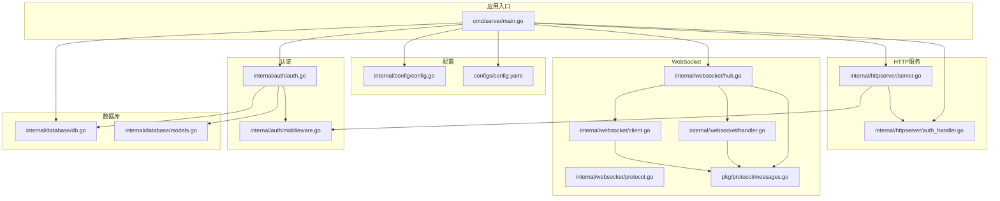
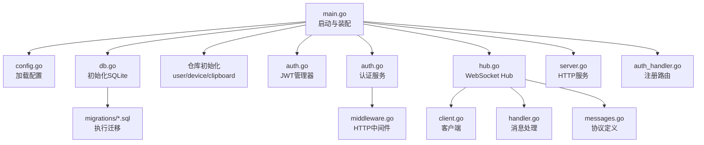
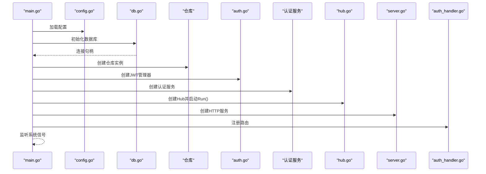
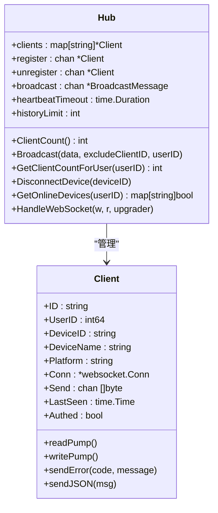
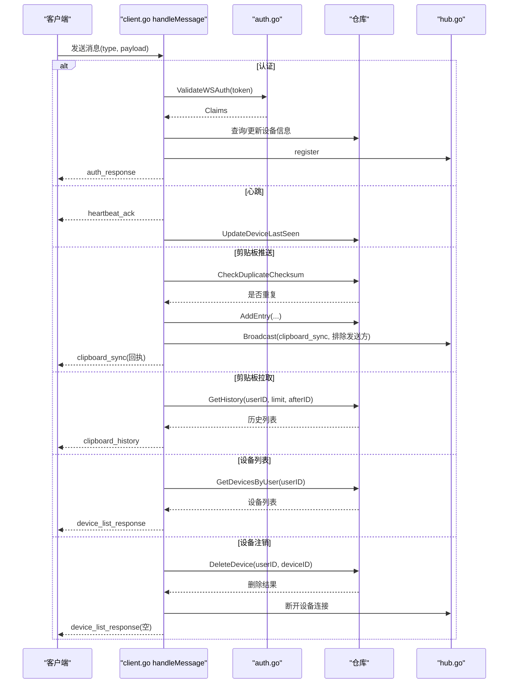
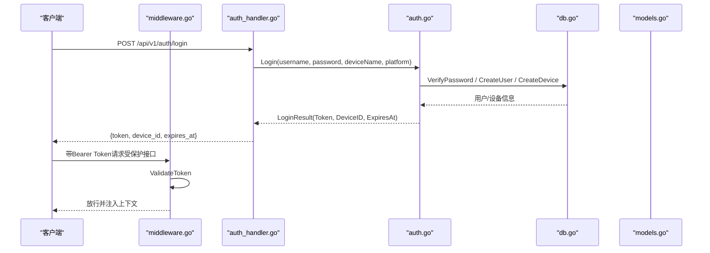
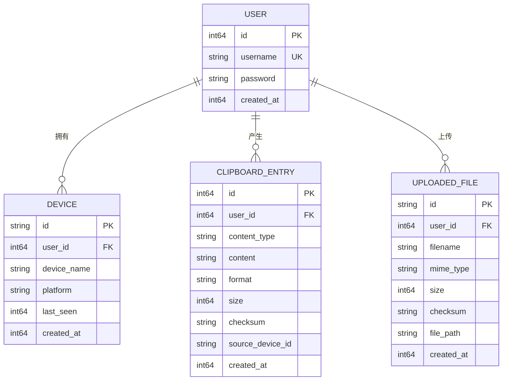
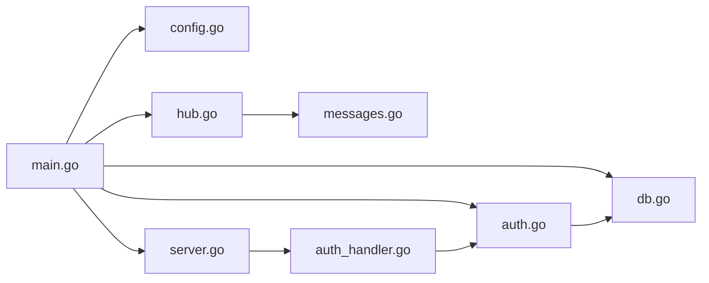

# 服务器端开发

<cite>
**本文引用的文件**
- [main.go](file://clipSync-server/cmd/server/main.go)
- [config.go](file://clipSync-server/internal/config/config.go)
- [config.yaml](file://clipSync-server/configs/config.yaml)
- [hub.go](file://clipSync-server/internal/websocket/hub.go)
- [client.go](file://clipSync-server/internal/websocket/client.go)
- [handler.go](file://clipSync-server/internal/websocket/handler.go)
- [protocol.go](file://clipSync-server/internal/websocket/protocol.go)
- [messages.go](file://clipSync-server/pkg/protocol/messages.go)
- [auth.go](file://clipSync-server/internal/auth/auth.go)
- [middleware.go](file://clipSync-server/internal/auth/middleware.go)
- [models.go](file://clipSync-server/internal/database/models.go)
- [db.go](file://clipSync-server/internal/database/db.go)
- [server.go](file://clipSync-server/internal/httpserver/server.go)
- [auth_handler.go](file://clipSync-server/internal/httpserver/auth_handler.go)
- [go.mod](file://clipSync-server/go.mod)
</cite>

## 目录
1. [简介](#简介)
2. [项目结构](#项目结构)
3. [核心组件](#核心组件)
4. [架构总览](#架构总览)
5. [详细组件分析](#详细组件分析)
6. [依赖分析](#依赖分析)
7. [性能考虑](#性能考虑)
8. [故障排查指南](#故障排查指南)
9. [结论](#结论)
10. [附录](#附录)

## 简介
本文件面向Go服务器端开发，围绕ClipSync服务器的架构与实现进行系统化说明。重点覆盖以下方面：
- 服务器启动流程与控制流
- WebSocket Hub的连接管理、消息路由与心跳机制
- HTTP API（认证、设备管理、文件上传下载、健康检查）的设计与实现
- 数据库模型与迁移策略
- 认证与授权体系（JWT、中间件）
- 错误处理、超时与优雅停机
- 配置项、参数与返回值规范
- 常见问题与解决方案

目标是帮助初学者快速理解整体设计与关键流程，同时为有经验的开发者提供深入的技术细节与最佳实践建议。

## 项目结构
服务器端位于clipSync-server目录，采用按职责分层的组织方式：
- cmd/server：应用入口，负责加载配置、初始化数据库与服务、构建路由、启动HTTP与WebSocket服务以及优雅停机
- internal/config：配置加载与默认值
- internal/auth：认证业务逻辑、JWT管理与HTTP中间件
- internal/database：SQLite封装、数据模型、仓库层与迁移
- internal/httpserver：HTTP服务封装、路由与处理器
- internal/websocket：WebSocket Hub、客户端、消息协议与处理器
- pkg/protocol：跨语言/跨端的消息协议定义
- configs：运行时配置文件
- migrations：数据库迁移脚本
- scripts：辅助脚本（如模拟器）

图表来源
- [main.go:19-129](file://clipSync-server/cmd/server/main.go#L19-L129)
- [config.go:39-55](file://clipSync-server/internal/config/config.go#L39-L55)
- [server.go:17-48](file://clipSync-server/internal/httpserver/server.go#L17-L48)
- [hub.go:44-58](file://clipSync-server/internal/websocket/hub.go#L44-L58)
- [client.go:13-31](file://clipSync-server/internal/websocket/client.go#L13-L31)
- [handler.go:10-31](file://clipSync-server/internal/websocket/handler.go#L10-L31)
- [protocol.go:9-26](file://clipSync-server/internal/websocket/protocol.go#L9-L26)
- [messages.go:5-131](file://clipSync-server/pkg/protocol/messages.go#L5-L131)
- [auth.go:8-22](file://clipSync-server/internal/auth/auth.go#L8-L22)
- [middleware.go:22-61](file://clipSync-server/internal/auth/middleware.go#L22-L61)
- [db.go:12-56](file://clipSync-server/internal/database/db.go#L12-L56)
- [models.go:3-45](file://clipSync-server/internal/database/models.go#L3-L45)

章节来源
- [main.go:19-129](file://clipSync-server/cmd/server/main.go#L19-L129)
- [config.go:39-55](file://clipSync-server/internal/config/config.go#L39-L55)
- [config.yaml:1-29](file://clipSync-server/configs/config.yaml#L1-L29)

## 核心组件
- 应用入口与启动流程：加载配置、初始化数据库与迁移、构建仓库、初始化认证服务与JWT管理器、启动WebSocket Hub、注册HTTP路由、分别启动HTTP与WebSocket服务、监听系统信号实现优雅停机
- WebSocket Hub：集中管理客户端连接、广播消息、统计在线设备与客户端数量、处理设备断开与离线清理
- 客户端与消息处理：读写泵循环、心跳与超时、消息类型分发、错误响应与重复内容检测
- HTTP API：认证（登录/注册/刷新）、健康检查、设备列表与注销、文件上传下载
- 认证系统：JWT生成与校验、HTTP中间件注入用户上下文、WebSocket认证
- 数据库：SQLite封装、WAL模式、连接池优化、数据模型与迁移

章节来源
- [main.go:19-129](file://clipSync-server/cmd/server/main.go#L19-L129)
- [hub.go:18-153](file://clipSync-server/internal/websocket/hub.go#L18-L153)
- [client.go:33-150](file://clipSync-server/internal/websocket/client.go#L33-L150)
- [handler.go:10-392](file://clipSync-server/internal/websocket/handler.go#L10-L392)
- [auth_handler.go:62-207](file://clipSync-server/internal/httpserver/auth_handler.go#L62-L207)
- [auth.go:8-137](file://clipSync-server/internal/auth/auth.go#L8-L137)
- [middleware.go:22-111](file://clipSync-server/internal/auth/middleware.go#L22-L111)
- [db.go:12-56](file://clipSync-server/internal/database/db.go#L12-L56)
- [models.go:3-45](file://clipSync-server/internal/database/models.go#L3-L45)

## 架构总览
下图展示了从应用入口到各子系统的交互关系，包括配置加载、数据库初始化、认证服务、WebSocket Hub与HTTP路由的装配过程。

图表来源
- [main.go:23-98](file://clipSync-server/cmd/server/main.go#L23-L98)
- [config.go:39-55](file://clipSync-server/internal/config/config.go#L39-L55)
- [db.go:17-56](file://clipSync-server/internal/database/db.go#L17-L56)
- [auth.go:15-22](file://clipSync-server/internal/auth/auth.go#L15-L22)
- [hub.go:44-58](file://clipSync-server/internal/websocket/hub.go#L44-L58)
- [server.go:17-48](file://clipSync-server/internal/httpserver/server.go#L17-L48)
- [auth_handler.go:62-207](file://clipSync-server/internal/httpserver/auth_handler.go#L62-L207)

## 详细组件分析

### 启动流程与控制流
- 加载配置：支持通过环境变量覆盖配置文件路径；若配置文件不存在则使用默认值
- 初始化数据库：创建目录、打开SQLite连接、启用WAL模式、设置连接池、执行迁移
- 构建仓库：用户、设备、剪贴板仓库
- 认证初始化：JWT管理器与认证服务
- WebSocket Hub：初始化心跳超时与历史限制，启动Hub主循环
- HTTP路由：注册认证、健康检查、设备、上传下载接口，使用限流中间件保护认证端点
- 分别启动HTTP与WebSocket服务，监听系统信号实现优雅停机

图表来源
- [main.go:23-129](file://clipSync-server/cmd/server/main.go#L23-L129)
- [config.go:39-55](file://clipSync-server/internal/config/config.go#L39-L55)
- [db.go:17-56](file://clipSync-server/internal/database/db.go#L17-L56)
- [auth.go:15-22](file://clipSync-server/internal/auth/auth.go#L15-L22)
- [hub.go:61-112](file://clipSync-server/internal/websocket/hub.go#L61-L112)
- [server.go:25-48](file://clipSync-server/internal/httpserver/server.go#L25-L48)
- [auth_handler.go:62-207](file://clipSync-server/internal/httpserver/auth_handler.go#L62-L207)

章节来源
- [main.go:19-129](file://clipSync-server/cmd/server/main.go#L19-L129)

### WebSocket Hub与连接管理
- Hub结构：维护客户端映射、注册/注销/广播通道、认证超时、心跳超时、历史条数限制、全局计数
- 主循环：处理注册、注销、广播；广播时对发送缓冲区满的客户端进行断开清理
- 广播策略：按用户维度过滤，可排除特定客户端
- 设备断连：根据设备ID查找并关闭连接
- 在线设备查询：基于Hub内部客户端映射统计在线状态

图表来源
- [hub.go:18-153](file://clipSync-server/internal/websocket/hub.go#L18-L153)
- [client.go:13-150](file://clipSync-server/internal/websocket/client.go#L13-L150)

章节来源
- [hub.go:18-153](file://clipSync-server/internal/websocket/hub.go#L18-L153)
- [client.go:33-150](file://clipSync-server/internal/websocket/client.go#L33-L150)

### 消息路由与处理流程
- 消息类型：认证、心跳、剪贴板推送/同步、剪贴板拉取/历史、设备列表、设备注销、错误、Ping/Pong
- 路由分发：根据消息类型调用对应处理函数
- 认证流程：校验JWT、填充客户端身份、更新设备最后在线时间、注册到Hub
- 心跳流程：返回心跳确认、更新设备最后在线时间
- 剪贴板推送：去重校验、入库、构造同步消息并广播给同用户其他设备，同时回执给发送方
- 剪贴板拉取：按用户历史限制与游标查询，返回历史列表与分页标记
- 设备列表：返回用户所有设备并标注在线状态
- 设备注销：删除设备并断开当前在线连接

图表来源
- [handler.go:10-392](file://clipSync-server/internal/websocket/handler.go#L10-L392)
- [auth.go:133-137](file://clipSync-server/internal/auth/auth.go#L133-L137)
- [hub.go:114-121](file://clipSync-server/internal/websocket/hub.go#L114-L121)

章节来源
- [handler.go:10-392](file://clipSync-server/internal/websocket/handler.go#L10-L392)

### HTTP API与认证系统
- 认证端点
  - 登录：校验用户名/密码与设备平台，创建或复用设备，签发JWT
  - 注册：校验用户名与密码强度，创建用户与设备，签发JWT
  - 刷新：校验旧令牌并签发新令牌
- 中间件
  - Bearer Token校验，注入用户上下文（用户ID、用户名、设备ID）
- 设备管理
  - 列表：返回用户设备清单与在线状态
  - 注销：删除设备并断开在线连接
- 文件上传下载
  - 上传：鉴权后保存文件并返回访问信息
  - 下载：鉴权后提供文件流
- 健康检查
  - 返回服务版本与Hub状态

图表来源
- [auth_handler.go:62-207](file://clipSync-server/internal/httpserver/auth_handler.go#L62-L207)
- [auth.go:32-116](file://clipSync-server/internal/auth/auth.go#L32-L116)
- [middleware.go:32-61](file://clipSync-server/internal/auth/middleware.go#L32-L61)

章节来源
- [auth_handler.go:62-207](file://clipSync-server/internal/httpserver/auth_handler.go#L62-L207)
- [auth.go:32-116](file://clipSync-server/internal/auth/auth.go#L32-L116)
- [middleware.go:32-61](file://clipSync-server/internal/auth/middleware.go#L32-L61)

### 数据库设计与迁移
- 数据模型
  - 用户：ID、用户名、密码（bcrypt）、创建时间
  - 设备：ID、用户ID、设备名、平台、最后在线时间、创建时间
  - 剪贴板条目：ID、用户ID、内容类型、内容、格式、大小、校验和、来源设备、创建时间
  - 已上传文件：ID、用户ID、文件名、MIME类型、大小、校验和、存储路径、创建时间
- SQLite封装
  - WAL模式提升并发读性能
  - 连接池：最大打开连接数、空闲连接数
  - 参数优化：同步级别、缓存大小、临时存储位置
- 迁移
  - 使用SQL脚本初始化表结构与索引

图表来源
- [models.go:3-45](file://clipSync-server/internal/database/models.go#L3-L45)

章节来源
- [db.go:17-56](file://clipSync-server/internal/database/db.go#L17-L56)
- [models.go:3-45](file://clipSync-server/internal/database/models.go#L3-L45)

### 协议与消息定义
- 消息结构：统一的Envelope包含类型、版本、时间戳与负载
- 类型常量：认证、心跳、剪贴板推送/同步、拉取/历史、设备列表/响应、设备注销、错误、Ping/Pong
- 负载结构：认证、心跳、剪贴板推送/同步、拉取、历史、设备列表、错误等

章节来源
- [messages.go:5-131](file://clipSync-server/pkg/protocol/messages.go#L5-L131)

## 依赖分析
- 外部依赖
  - gorilla/websocket：WebSocket升级与收发
  - golang-jwt/jwt/v5：JWT生成与验证
  - mattn/go-sqlite3：SQLite驱动
  - golang.org/x/crypto：加密工具
  - gopkg.in/yaml.v3：YAML解析
- 内部模块耦合
  - main.go依赖配置、数据库、认证、WebSocket与HTTP模块
  - WebSocket Hub依赖认证服务、仓库与协议
  - HTTP处理器依赖认证服务与中间件
  - 认证服务依赖仓库与JWT管理器

图表来源
- [go.mod:5-11](file://clipSync-server/go.mod#L5-L11)
- [main.go:3-15](file://clipSync-server/cmd/server/main.go#L3-L15)
- [auth.go:3-6](file://clipSync-server/internal/auth/auth.go#L3-L6)
- [hub.go:3-16](file://clipSync-server/internal/websocket/hub.go#L3-L16)
- [server.go:3-8](file://clipSync-server/internal/httpserver/server.go#L3-L8)
- [auth_handler.go:3-8](file://clipSync-server/internal/httpserver/auth_handler.go#L3-L8)

章节来源
- [go.mod:5-11](file://clipSync-server/go.mod#L5-L11)

## 性能考虑
- 数据库
  - WAL模式提升并发读写性能
  - 连接池限制在低资源服务器上避免过度竞争
  - 关键查询建立索引（建议在迁移脚本中显式声明）
- WebSocket
  - 客户端发送缓冲区大小适中，避免内存膨胀
  - 广播时对阻塞发送的客户端进行断开清理，防止连锁反应
  - 心跳超时与Pong处理确保长连接存活与异常检测
- HTTP
  - 读写超时与空闲超时防止资源泄漏
  - 认证端点限流降低暴力尝试风险
- 缓存与热点
  - 可在Hub层增加设备在线状态缓存以减少遍历成本（建议）

[本节为通用指导，不直接分析具体文件]

## 故障排查指南
- WebSocket升级失败
  - 检查网络与防火墙；查看日志中的升级错误
  - 确认客户端是否遵循协议版本与消息格式
- 认证超时
  - 客户端应在30秒内完成认证；检查Token有效性与签名
- 心跳异常导致断开
  - 客户端需定期发送心跳；检查服务端心跳超时配置
- 广播失败或客户端断开
  - Hub会自动清理发送缓冲区满的客户端；检查客户端消费速度
- 数据库无法打开或迁移失败
  - 检查数据库路径权限、WAL模式启用与连接参数
- HTTP 401/403
  - 确认Authorization头格式与Token有效；检查中间件是否正确注入上下文
- 文件上传失败
  - 检查文件大小限制、存储路径权限与磁盘空间

章节来源
- [hub.go:182-208](file://clipSync-server/internal/websocket/hub.go#L182-L208)
- [client.go:33-67](file://clipSync-server/internal/websocket/client.go#L33-L67)
- [db.go:17-56](file://clipSync-server/internal/database/db.go#L17-L56)
- [auth_handler.go:62-207](file://clipSync-server/internal/httpserver/auth_handler.go#L62-L207)

## 结论
该服务器端实现以清晰的分层架构与模块化设计为核心，结合轻量级的SQLite与成熟的第三方库，提供了稳定可靠的实时剪贴板同步能力。WebSocket Hub负责高并发连接与消息广播，HTTP API提供认证与设备/文件管理，认证系统通过JWT与中间件保障安全。通过合理的超时与限流策略，系统在可用性与性能之间取得平衡。建议在生产环境中进一步完善监控、日志与缓存策略，并严格管理配置与密钥。

[本节为总结性内容，不直接分析具体文件]

## 附录

### 配置项与默认值
- 端口与路径
  - ws_port：WebSocket服务端口，默认8080
  - http_port：HTTP API服务端口，默认8081
  - db_path：SQLite数据库文件路径，默认./data/clipsync.db
  - file_storage_path：文件存储目录，默认./data/files
- 安全与策略
  - jwt_secret：JWT密钥（生产环境必须修改）
  - jwt_expiry_hours：JWT过期小时数，默认720（30天）
  - max_file_size_mb：文件上传最大大小（MB），默认5
  - clipboard_history_limit：每个用户的剪贴板历史条数上限，默认50
  - heartbeat_timeout_seconds：心跳超时（秒），默认90

章节来源
- [config.go:23-36](file://clipSync-server/internal/config/config.go#L23-L36)
- [config.yaml:1-29](file://clipSync-server/configs/config.yaml#L1-L29)

### 关键接口与返回值
- 认证接口
  - 登录/注册：返回token、device_id、expires_at
  - 刷新：返回新的token与expires_at
- 设备接口
  - 列表：返回设备数组（含在线状态）
  - 注销：无返回体或空数组
- 剪贴板接口
  - 推送：成功后广播clipboard_sync并回执
  - 拉取：返回历史列表与总数、是否有更多
- 健康检查
  - 返回服务版本与Hub状态

章节来源
- [auth_handler.go:62-207](file://clipSync-server/internal/httpserver/auth_handler.go#L62-L207)
- [handler.go:142-285](file://clipSync-server/internal/websocket/handler.go#L142-L285)
- [messages.go:21-79](file://clipSync-server/pkg/protocol/messages.go#L21-L79)