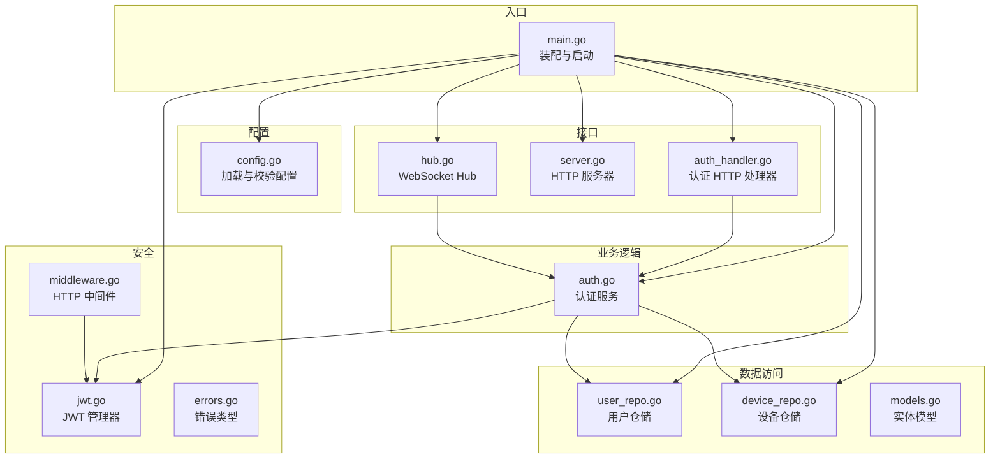
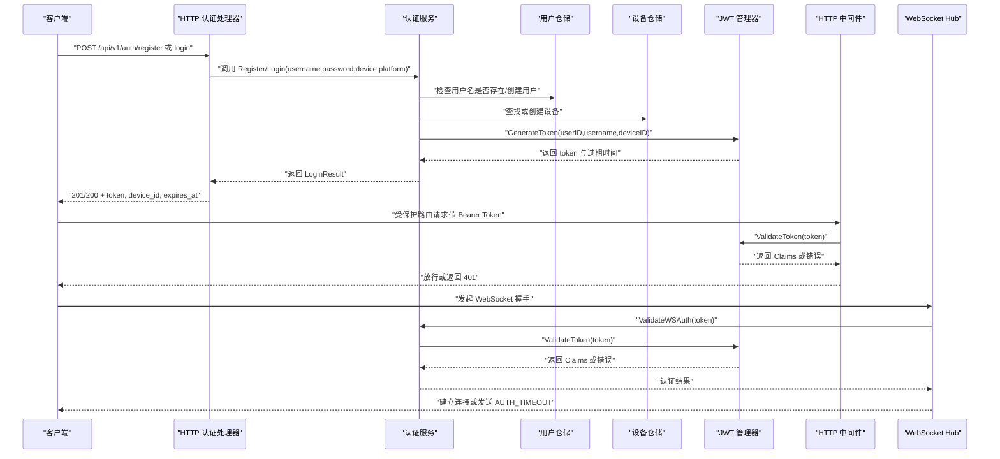
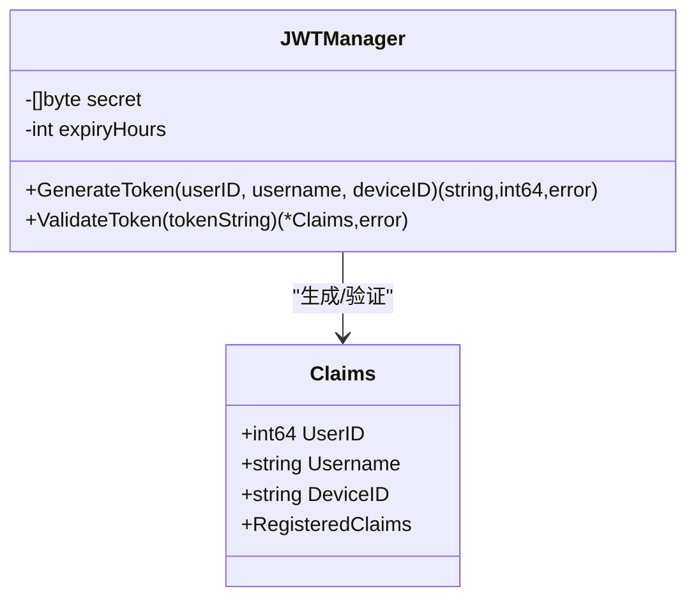
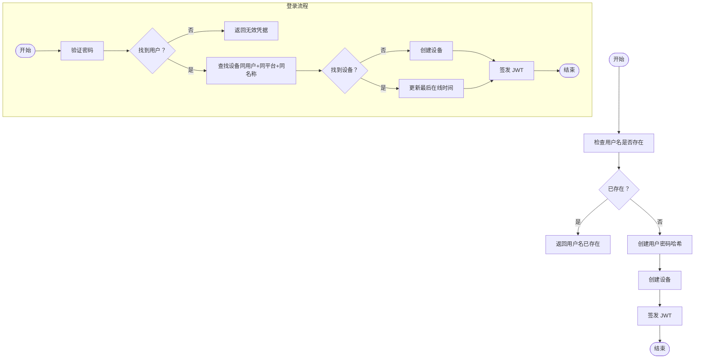
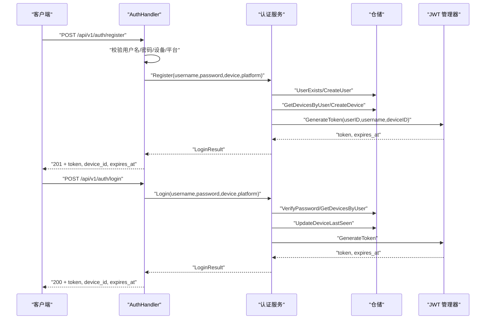
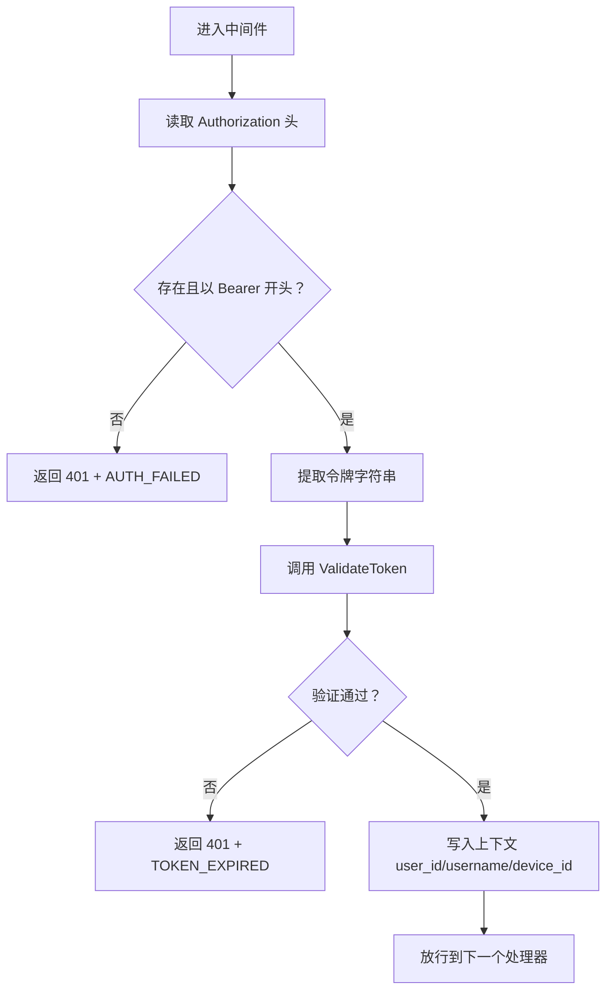
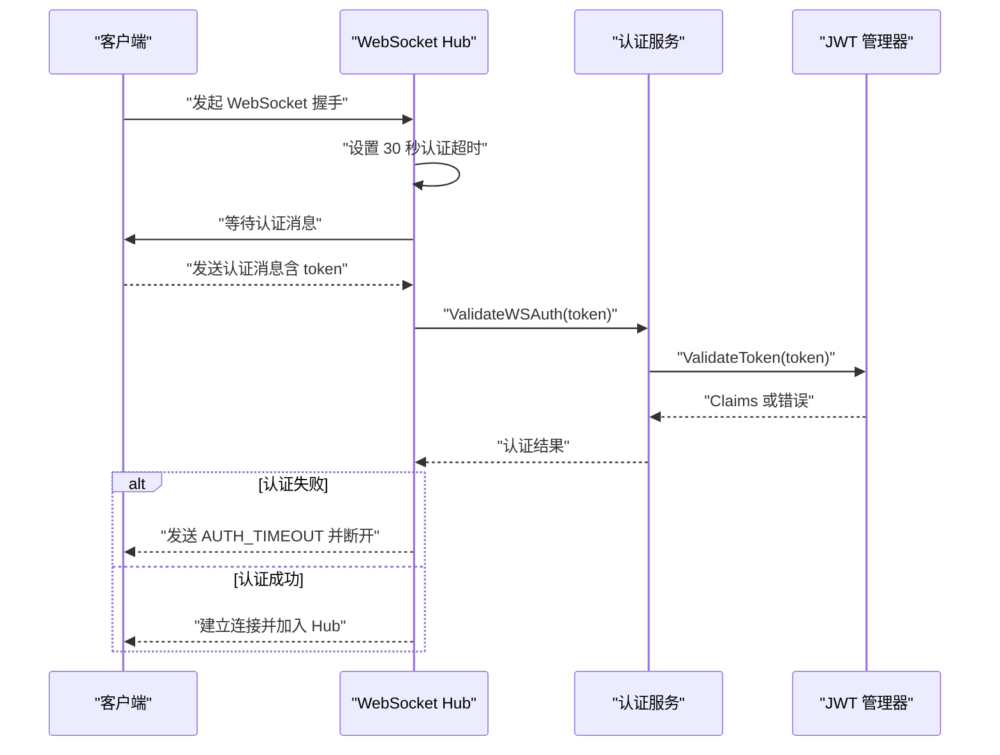
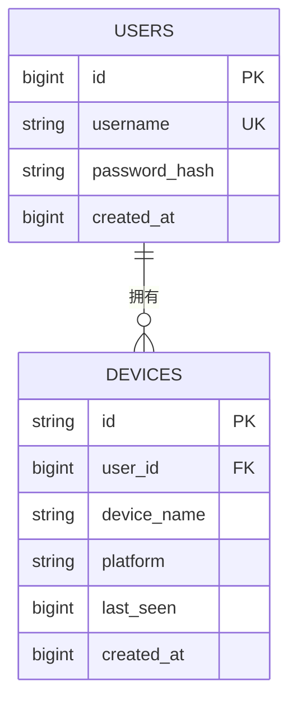
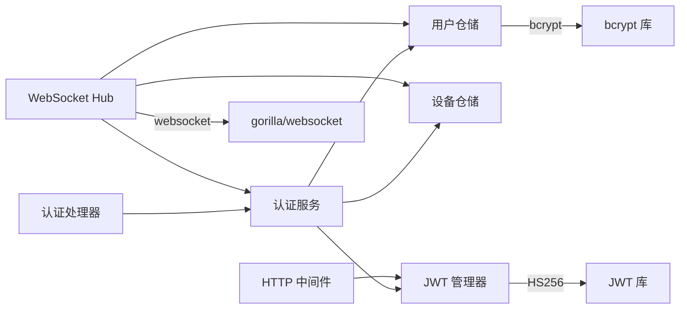

# 认证系统

<cite>
**本文引用的文件**
- [auth.go](file://clipSync-server/internal/auth/auth.go)
- [jwt.go](file://clipSync-server/internal/auth/jwt.go)
- [middleware.go](file://clipSync-server/internal/auth/middleware.go)
- [errors.go](file://clipSync-server/internal/auth/errors.go)
- [auth_handler.go](file://clipSync-server/internal/httpserver/auth_handler.go)
- [server.go](file://clipSync-server/internal/httpserver/server.go)
- [main.go](file://clipSync-server/cmd/server/main.go)
- [config.go](file://clipSync-server/internal/config/config.go)
- [user_repo.go](file://clipSync-server/internal/database/user_repo.go)
- [device_repo.go](file://clipSync-server/internal/database/device_repo.go)
- [models.go](file://clipSync-server/internal/database/models.go)
- [hub.go](file://clipSync-server/internal/websocket/hub.go)
</cite>

## 目录
1. [简介](#简介)
2. [项目结构](#项目结构)
3. [核心组件](#核心组件)
4. [架构总览](#架构总览)
5. [详细组件分析](#详细组件分析)
6. [依赖关系分析](#依赖关系分析)
7. [性能考虑](#性能考虑)
8. [故障排查指南](#故障排查指南)
9. [结论](#结论)
10. [附录](#附录)

## 简介
本文件面向认证系统的技术与非技术读者，系统性阐述基于 JWT 的认证机制、用户身份验证与授权流程，覆盖注册、登录、令牌刷新与注销的完整生命周期，并结合实际代码路径说明 JWT 令牌生成、验证、过期处理与中间件实现。同时记录密钥管理、安全策略与会话控制机制，解释认证中间件的工作原理、权限检查与错误处理，以及安全漏洞防护、令牌劫持防范与会话管理最佳实践。

## 项目结构
认证系统位于服务端 Go 代码中，采用分层设计：
- 配置层：加载并校验运行时配置（含 JWT 密钥与过期时间）
- 数据访问层：用户与设备仓库，负责密码哈希与设备信息持久化
- 业务逻辑层：认证服务，封装注册、登录、刷新等业务流程
- 安全层：JWT 管理器与 HTTP 中间件，提供令牌签发与校验
- 接口层：HTTP 处理器，暴露 /auth/* 接口；WebSocket Hub 在握手阶段进行认证
- 入口：主程序装配各组件并启动 HTTP 与 WebSocket 服务

图表来源
- [main.go:61-72](file://clipSync-server/cmd/server/main.go#L61-L72)
- [config.go:38-55](file://clipSync-server/internal/config/config.go#L38-L55)
- [user_repo.go:21-47](file://clipSync-server/internal/database/user_repo.go#L21-L47)
- [device_repo.go:21-42](file://clipSync-server/internal/database/device_repo.go#L21-L42)
- [auth.go:15-22](file://clipSync-server/internal/auth/auth.go#L15-L22)
- [jwt.go:24-30](file://clipSync-server/internal/auth/jwt.go#L24-L30)
- [middleware.go:27-30](file://clipSync-server/internal/auth/middleware.go#L27-L30)
- [auth_handler.go:16-19](file://clipSync-server/internal/httpserver/auth_handler.go#L16-L19)
- [server.go:18-24](file://clipSync-server/internal/httpserver/server.go#L18-L24)
- [hub.go:44-57](file://clipSync-server/internal/websocket/hub.go#L44-L57)

章节来源
- [main.go:21-146](file://clipSync-server/cmd/server/main.go#L21-L146)
- [config.go:10-72](file://clipSync-server/internal/config/config.go#L10-L72)

## 核心组件
- JWT 管理器：负责签发与验证 JWT，携带用户标识、设备标识与标准声明
- 认证服务：封装注册、登录、刷新等业务流程，协调仓储与 JWT 管理器
- HTTP 认证处理器：提供 /api/v1/auth/* 接口，执行输入校验与业务调用
- HTTP 认证中间件：拦截请求，解析 Authorization 头，校验令牌并将上下文注入
- 用户与设备仓储：负责用户密码哈希、用户名唯一性、设备注册与最后在线时间更新
- WebSocket Hub：在握手阶段对客户端进行认证，限制未认证连接时长

章节来源
- [jwt.go:18-76](file://clipSync-server/internal/auth/jwt.go#L18-L76)
- [auth.go:8-22](file://clipSync-server/internal/auth/auth.go#L8-L22)
- [auth_handler.go:11-215](file://clipSync-server/internal/httpserver/auth_handler.go#L11-L215)
- [middleware.go:22-111](file://clipSync-server/internal/auth/middleware.go#L22-L111)
- [user_repo.go:21-91](file://clipSync-server/internal/database/user_repo.go#L21-L91)
- [device_repo.go:21-126](file://clipSync-server/internal/database/device_repo.go#L21-L126)
- [hub.go:181-208](file://clipSync-server/internal/websocket/hub.go#L181-L208)

## 架构总览
下图展示了认证系统的关键交互：客户端通过 HTTP 发起注册/登录/刷新请求，服务端使用认证处理器与认证服务完成业务处理，JWT 管理器签发或验证令牌；受保护的 HTTP 路由通过中间件强制要求有效令牌；WebSocket 握手阶段由 Hub 进行认证并设置超时。

图表来源
- [auth_handler.go:63-175](file://clipSync-server/internal/httpserver/auth_handler.go#L63-L175)
- [auth.go:31-116](file://clipSync-server/internal/auth/auth.go#L31-L116)
- [jwt.go:32-55](file://clipSync-server/internal/auth/jwt.go#L32-L55)
- [middleware.go:32-61](file://clipSync-server/internal/auth/middleware.go#L32-L61)
- [hub.go:181-208](file://clipSync-server/internal/websocket/hub.go#L181-L208)

## 详细组件分析

### JWT 管理器（JWTManager）
- 职责：签发与验证 JWT，设置过期时间与发行者，使用 HS256 签名
- 关键点：
  - Claims 包含用户 ID、用户名、设备 ID 与标准声明（过期、签发、发行者）
  - GenerateToken 基于配置的过期小时数计算过期时间并签名
  - ValidateToken 校验签名方法与密钥，解析并返回 Claims
- 复杂度：签发与验证均为 O(1)，内存占用小，性能稳定

图表来源
- [jwt.go:10-76](file://clipSync-server/internal/auth/jwt.go#L10-L76)

章节来源
- [jwt.go:18-76](file://clipSync-server/internal/auth/jwt.go#L18-L76)

### 认证服务（Service）
- 职责：封装业务流程，协调仓储与 JWT 管理器
- 注册流程：检查用户名唯一性、创建用户、创建设备、签发令牌
- 登录流程：验证凭据、查找或创建设备、更新最后在线时间、签发令牌
- 刷新流程：验证旧令牌、重新签发新令牌
- WebSocket 认证：供 Hub 在握手阶段调用

图表来源
- [auth.go:31-116](file://clipSync-server/internal/auth/auth.go#L31-L116)
- [user_repo.go:21-47](file://clipSync-server/internal/database/user_repo.go#L21-L47)
- [device_repo.go:21-42](file://clipSync-server/internal/database/device_repo.go#L21-L42)
- [jwt.go:32-55](file://clipSync-server/internal/auth/jwt.go#L32-L55)

章节来源
- [auth.go:8-137](file://clipSync-server/internal/auth/auth.go#L8-L137)

### HTTP 认证处理器（AuthHandler）
- 提供 /api/v1/auth/login、/api/v1/auth/register、/api/v1/auth/refresh
- 输入校验：必填字段、用户名长度、密码强度（至少 8 位、包含字母与数字）
- 错误处理：针对无效凭据、用户名冲突、内部错误返回相应状态码与错误码
- 返回内容：成功时返回 token、device_id、expires_at

图表来源
- [auth_handler.go:63-175](file://clipSync-server/internal/httpserver/auth_handler.go#L63-L175)
- [auth.go:31-116](file://clipSync-server/internal/auth/auth.go#L31-L116)
- [user_repo.go:65-80](file://clipSync-server/internal/database/user_repo.go#L65-L80)
- [device_repo.go:60-90](file://clipSync-server/internal/database/device_repo.go#L60-L90)
- [jwt.go:32-55](file://clipSync-server/internal/auth/jwt.go#L32-L55)

章节来源
- [auth_handler.go:11-215](file://clipSync-server/internal/httpserver/auth_handler.go#L11-L215)

### HTTP 认证中间件（RequireAuth）
- 功能：从 Authorization 头提取 Bearer 令牌，调用 JWT 管理器验证
- 上下文注入：将用户 ID、用户名、设备 ID 写入请求上下文，供后续处理器使用
- 错误处理：缺失头、格式不正确、令牌无效或过期均返回 401

图表来源
- [middleware.go:32-61](file://clipSync-server/internal/auth/middleware.go#L32-L61)
- [jwt.go:57-75](file://clipSync-server/internal/auth/jwt.go#L57-L75)

章节来源
- [middleware.go:22-111](file://clipSync-server/internal/auth/middleware.go#L22-L111)

### WebSocket 认证（Hub）
- 握手阶段：Hub 在升级连接后设置 30 秒认证超时，若未在时限内完成认证则断开
- 认证调用：Hub 调用认证服务的 WebSocket 认证方法，后者委托 JWT 管理器验证
- 会话控制：认证成功后客户端加入 Hub，支持广播与离线检测

图表来源
- [hub.go:181-208](file://clipSync-server/internal/websocket/hub.go#L181-L208)
- [auth.go:133-136](file://clipSync-server/internal/auth/auth.go#L133-L136)
- [jwt.go:57-75](file://clipSync-server/internal/auth/jwt.go#L57-L75)

章节来源
- [hub.go:18-230](file://clipSync-server/internal/websocket/hub.go#L18-L230)

### 数据模型与仓储
- 用户模型：包含用户名、密码哈希、创建时间
- 设备模型：包含设备 ID、用户 ID、设备名称、平台、最后在线时间、创建时间
- 仓储职责：
  - 用户仓储：创建用户（密码哈希）、按用户名查询、验证密码、检查用户名是否存在
  - 设备仓储：创建设备（随机生成设备 ID）、按 ID 查询、按用户查询、更新最后在线时间、删除设备、校验设备归属

图表来源
- [models.go:3-19](file://clipSync-server/internal/database/models.go#L3-L19)
- [user_repo.go:21-91](file://clipSync-server/internal/database/user_repo.go#L21-L91)
- [device_repo.go:21-126](file://clipSync-server/internal/database/device_repo.go#L21-L126)

章节来源
- [models.go:1-46](file://clipSync-server/internal/database/models.go#L1-L46)
- [user_repo.go:11-91](file://clipSync-server/internal/database/user_repo.go#L11-L91)
- [device_repo.go:11-126](file://clipSync-server/internal/database/device_repo.go#L11-L126)

## 依赖关系分析
- 组件耦合：
  - 认证服务依赖用户仓储、设备仓储与 JWT 管理器
  - HTTP 认证处理器依赖认证服务
  - HTTP 中间件依赖 JWT 管理器
  - WebSocket Hub 依赖认证服务与仓储
- 外部依赖：
  - JWT 库用于签名与验证
  - bcrypt 用于密码哈希
  - gorilla/websocket 用于 WebSocket 升级与通信
- 潜在循环依赖：未发现循环导入；模块边界清晰

图表来源
- [auth.go:8-22](file://clipSync-server/internal/auth/auth.go#L8-L22)
- [auth_handler.go:12-19](file://clipSync-server/internal/httpserver/auth_handler.go#L12-L19)
- [middleware.go:23-30](file://clipSync-server/internal/auth/middleware.go#L23-L30)
- [hub.go:18-35](file://clipSync-server/internal/websocket/hub.go#L18-L35)
- [jwt.go:3-8](file://clipSync-server/internal/auth/jwt.go#L3-L8)
- [user_repo.go:3-9](file://clipSync-server/internal/database/user_repo.go#L3-L9)

章节来源
- [auth.go:8-22](file://clipSync-server/internal/auth/auth.go#L8-L22)
- [auth_handler.go:12-19](file://clipSync-server/internal/httpserver/auth_handler.go#L12-L19)
- [middleware.go:23-30](file://clipSync-server/internal/auth/middleware.go#L23-L30)
- [hub.go:18-35](file://clipSync-server/internal/websocket/hub.go#L18-L35)

## 性能考虑
- JWT 签发与验证：O(1) 时间复杂度，HS256 签名开销低，适合高并发场景
- 密码哈希：bcrypt 默认成本适中，创建用户与登录验证均在毫秒级
- 数据库操作：用户与设备查询为单表简单查询，索引建议：
  - users.username 唯一索引（已由 UK 约束保证）
  - devices.user_id、devices.id 索引以优化查询与更新
- 中间件链路：仅一次令牌解析与一次上下文写入，开销极小
- WebSocket：Hub 使用通道与锁保护，广播按用户过滤，避免全量广播

[本节为通用性能讨论，无需特定文件来源]

## 故障排查指南
- 常见错误与定位
  - 401 AUTH_FAILED：缺少 Authorization 头或格式不正确
  - 401 TOKEN_EXPIRED：令牌无效或过期
  - 401 INVALID_CREDENTIALS：用户名或密码错误
  - 409 USERNAME_EXISTS：注册时用户名已被占用
  - 500 INTERNAL_ERROR：服务器内部错误
- 定位步骤
  - 检查请求头是否为 Bearer 格式
  - 校验 JWT 密钥与过期时间配置
  - 查看数据库中用户与设备记录是否正确
  - 观察日志输出（HTTP 与 WebSocket）
- 建议
  - 对外暴露的错误码统一，便于前端处理
  - 在生产环境替换默认 JWT 密钥与缩短过期时间

章节来源
- [middleware.go:32-61](file://clipSync-server/internal/auth/middleware.go#L32-L61)
- [auth_handler.go:87-101](file://clipSync-server/internal/httpserver/auth_handler.go#L87-L101)
- [auth_handler.go:153-167](file://clipSync-server/internal/httpserver/auth_handler.go#L153-L167)
- [errors.go:7-11](file://clipSync-server/internal/auth/errors.go#L7-L11)

## 结论
该认证系统以 JWT 为核心，结合严格的输入校验、密码哈希与设备维度的令牌绑定，提供了完整的注册、登录、刷新与会话控制能力。HTTP 中间件与 WebSocket Hub 分别在 REST 与实时通信场景下实施统一的认证策略。通过合理的配置与安全实践，系统在功能完整性与安全性之间取得平衡。

[本节为总结性内容，无需特定文件来源]

## 附录

### 配置项与安全建议
- JWT 密钥与过期时间：通过配置文件加载，生产环境必须替换默认密钥与合理设置过期时间
- 安全建议：
  - 使用 HTTPS 传输，避免明文泄露
  - 限制令牌过期时间，启用短期令牌与刷新机制
  - 强制密码强度与最小长度
  - 对敏感接口启用速率限制
  - WebSocket 握手阶段设置认证超时

章节来源
- [config.go:10-72](file://clipSync-server/internal/config/config.go#L10-L72)
- [main.go:38-42](file://clipSync-server/cmd/server/main.go#L38-L42)

### API 定义（摘要）
- POST /api/v1/auth/register
  - 请求体：username, password, device_name, platform
  - 成功：201 + token, device_id, expires_at
  - 失败：400 INVALID_PAYLOAD，409 USERNAME_EXISTS，500 INTERNAL_ERROR
- POST /api/v1/auth/login
  - 请求体：username, password, device_name, platform
  - 成功：200 + token, device_id, expires_at
  - 失败：400 INVALID_PAYLOAD，401 INVALID_CREDENTIALS，500 INTERNAL_ERROR
- POST /api/v1/auth/refresh
  - 请求头：Authorization: Bearer <token>
  - 成功：200 + token, expires_at
  - 失败：400 AUTH_FAILED，401 TOKEN_EXPIRED

章节来源
- [auth_handler.go:63-208](file://clipSync-server/internal/httpserver/auth_handler.go#L63-L208)