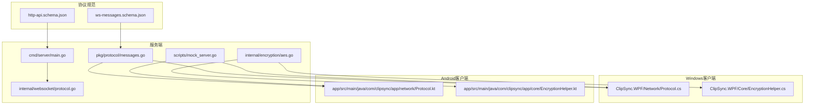
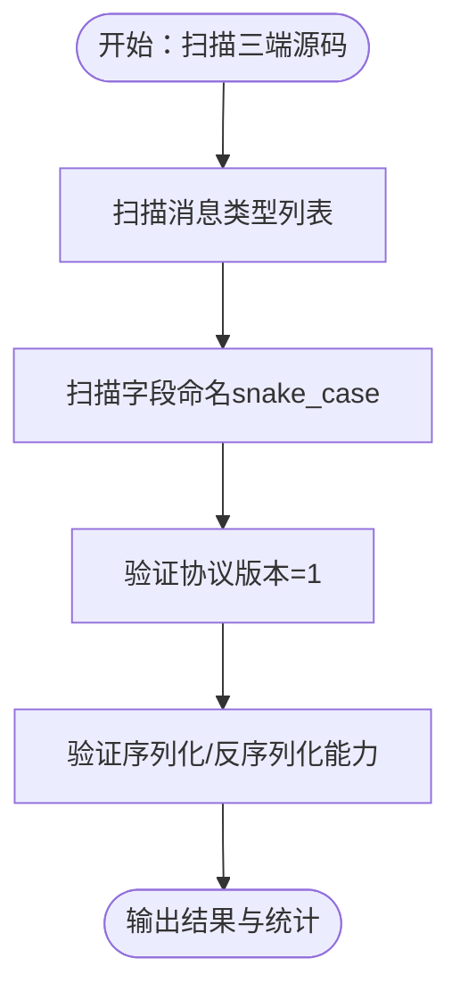
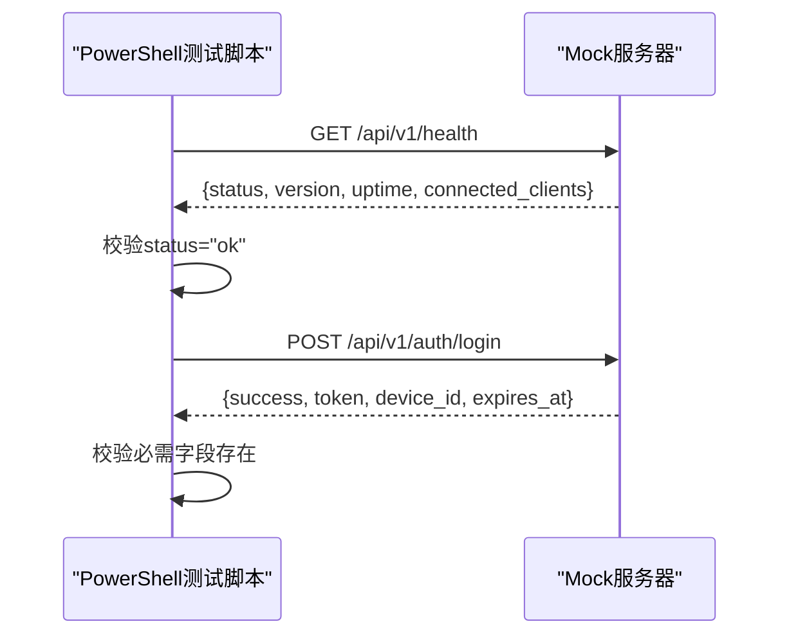
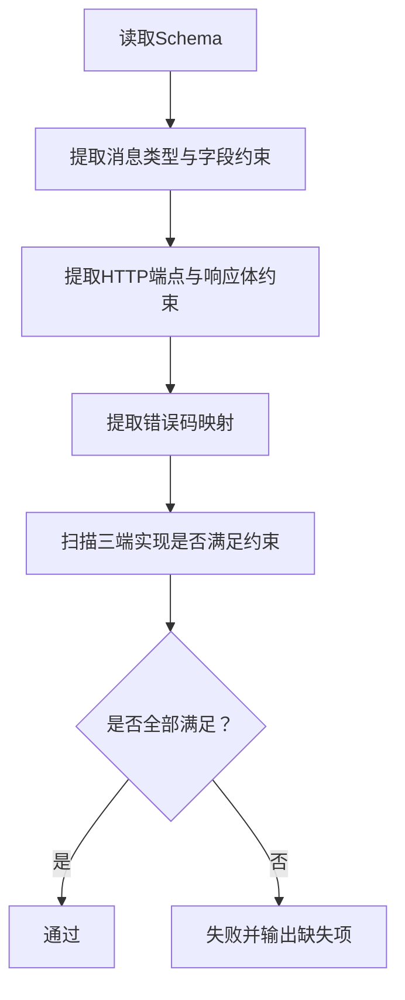
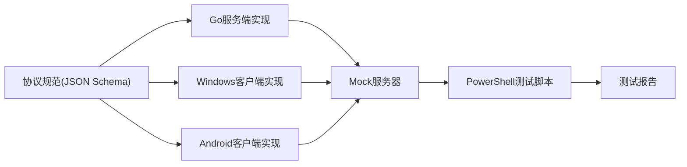

# 协议兼容性测试

<cite>
**本文引用的文件**
- [ws-messages.schema.json](file://protocol/ws-messages.schema.json)
- [http-api.schema.json](file://protocol/http-api.schema.json)
- [test-protocol-compatibility.ps1](file://scripts/test-protocol-compatibility.ps1)
- [DEVELOPMENT_PLAN.md](file://DEVELOPMENT_PLAN.md)
- [InstallationLog.txt](file://InstallationLog.txt)
- [messages.go](file://clipSync-server/pkg/protocol/messages.go)
- [Protocol.cs](file://clipSync-windows/ClipSync.WPF/Network/Protocol.cs)
- [Protocol.kt](file://clipSync-android/app/src/main/java/com/clipsync/app/network/Protocol.kt)
- [protocol.go](file://clipSync-server/internal/websocket/protocol.go)
- [mock_server.go](file://clipSync-server/scripts/mock_server.go)
- [main.go](file://clipSync-server/cmd/server/main.go)
- [aes.go](file://clipSync-server/internal/encryption/aes.go)
- [EncryptionHelper.cs](file://clipSync-windows/ClipSync.WPF/Core/EncryptionHelper.cs)
- [EncryptionHelper.kt](file://clipSync-android/app/core/EncryptionHelper.kt)
</cite>

## 目录
1. [简介](#简介)
2. [项目结构](#项目结构)
3. [核心组件](#核心组件)
4. [架构总览](#架构总览)
5. [详细组件分析](#详细组件分析)
6. [依赖关系分析](#依赖关系分析)
7. [性能考量](#性能考量)
8. [故障排查指南](#故障排查指南)
9. [结论](#结论)
10. [附录](#附录)

## 简介
本文件面向ClipSync协议兼容性测试，系统化阐述跨平台协议一致性验证方法，覆盖：
- WebSocket消息协议测试与数据格式验证
- HTTP API协议测试与响应契约校验
- PowerShell脚本测试工具的使用（协议版本检查、消息格式验证、向后兼容性测试）
- 协议规范文件（JSON Schema）的作用与测试流程（schema验证、消息序列化测试、错误消息处理）
- 具体测试脚本示例与测试结果分析
- 协议变更管理、版本升级测试、兼容性矩阵等关键要素

目标是帮助开发者在多端并行开发中确保协议一致性，降低集成风险，提升质量与效率。

## 项目结构
项目采用“共享协议规范 + 多端实现”的架构设计，通过统一的JSON Schema定义协议契约，并由Go服务端、Windows客户端、Android客户端分别实现。



图表来源
- [main.go:1-146](file://clipSync-server/cmd/server/main.go#L1-L146)
- [messages.go:1-132](file://clipSync-server/pkg/protocol/messages.go#L1-L132)
- [protocol.go:1-27](file://clipSync-server/internal/websocket/protocol.go#L1-L27)
- [aes.go:1-135](file://clipSync-server/internal/encryption/aes.go#L1-L135)
- [mock_server.go:1-664](file://clipSync-server/scripts/mock_server.go#L1-L664)
- [Protocol.cs:1-167](file://clipSync-windows/ClipSync.WPF/Network/Protocol.cs#L1-L167)
- [EncryptionHelper.cs:1-134](file://clipSync-windows/ClipSync.WPF/Core/EncryptionHelper.cs#L1-L134)
- [Protocol.kt:1-263](file://clipSync-android/app/src/main/java/com/clipsync/app/network/Protocol.kt#L1-L263)
- [EncryptionHelper.kt:1-157](file://clipSync-android/app/core/EncryptionHelper.kt#L1-L157)

章节来源
- [DEVELOPMENT_PLAN.md:1-929](file://DEVELOPMENT_PLAN.md#L1-L929)

## 核心组件
- 协议规范文件：提供WebSocket消息与HTTP API的完整契约定义，包含字段类型、必填项、枚举值、错误码映射等。
- 服务端实现：基于Go实现协议消息结构、WebSocket路由、HTTP路由、加密工具与模拟服务器。
- 客户端实现：Windows（C#）与Android（Kotlin）分别实现消息序列化/反序列化、加密工具与协议常量。
- 测试脚本：PowerShell脚本对三端实现进行一致性扫描、版本检查、端点匹配、心跳与加密支持验证，并对健康与登录端点进行连通性测试。

章节来源
- [ws-messages.schema.json:1-261](file://protocol/ws-messages.schema.json#L1-L261)
- [http-api.schema.json:1-293](file://protocol/http-api.schema.json#L1-L293)
- [test-protocol-compatibility.ps1:1-207](file://scripts/test-protocol-compatibility.ps1#L1-L207)
- [messages.go:1-132](file://clipSync-server/pkg/protocol/messages.go#L1-L132)
- [Protocol.cs:1-167](file://clipSync-windows/ClipSync.WPF/Network/Protocol.cs#L1-L167)
- [Protocol.kt:1-263](file://clipSync-android/app/src/main/java/com/clipsync/app/network/Protocol.kt#L1-L263)

## 架构总览
下图展示协议兼容性测试的整体流程：从协议规范出发，通过测试脚本扫描三端实现，结合模拟服务器进行端到端验证。

```mermaid
sequenceDiagram
participant PS as "PowerShell测试脚本"
participant Schema as "JSON Schema规范"
participant Go as "Go服务端"
participant Win as "Windows客户端"
participant And as "Android客户端"
participant Mock as "Mock服务器"
PS->>Schema : 读取并解析协议规范
PS->>Go : 扫描Go源码中的消息类型/字段/版本
PS->>Win : 扫描C#源码中的消息类型/字段/版本
PS->>And : 扫描Kotlin源码中的消息类型/字段/版本
PS->>PS : 验证HTTP端点存在性
PS->>PS : 验证协议版本=1
PS->>PS : 验证心跳配置与加密支持
PS->>Mock : 调用健康检查与登录接口
Mock-->>PS : 返回健康状态与令牌
PS-->>PS : 输出测试结果与统计
```

图表来源
- [test-protocol-compatibility.ps1:1-207](file://scripts/test-protocol-compatibility.ps1#L1-L207)
- [mock_server.go:1-664](file://clipSync-server/scripts/mock_server.go#L1-L664)

## 详细组件分析

### WebSocket消息协议测试
- 消息类型一致性：脚本扫描Go、Windows、Android三方源码，确保所有消息类型均被实现且名称一致（如auth、auth_response、heartbeat、clipboard_push等）。
- 字段命名一致性：强制使用snake_case（如device_id、content_type），脚本逐字段核对。
- 版本与时间戳：统一使用version=1与毫秒级时间戳。
- 序列化/反序列化：Windows与Android分别使用Newtonsoft.Json与Kotlinx.serialization，脚本不直接执行，但通过字段与类型名一致性保证可互操作。



图表来源
- [test-protocol-compatibility.ps1:52-92](file://scripts/test-protocol-compatibility.ps1#L52-L92)
- [messages.go:107-126](file://clipSync-server/pkg/protocol/messages.go#L107-L126)
- [Protocol.cs:8-36](file://clipSync-windows/ClipSync.WPF/Network/Protocol.cs#L8-L36)
- [Protocol.kt:20-34](file://clipSync-android/app/src/main/java/com/clipsync/app/network/Protocol.kt#L20-L34)

章节来源
- [test-protocol-compatibility.ps1:52-92](file://scripts/test-protocol-compatibility.ps1#L52-L92)
- [ws-messages.schema.json:1-261](file://protocol/ws-messages.schema.json#L1-L261)
- [messages.go:1-132](file://clipSync-server/pkg/protocol/messages.go#L1-L132)
- [Protocol.cs:1-167](file://clipSync-windows/ClipSync.WPF/Network/Protocol.cs#L1-L167)
- [Protocol.kt:1-263](file://clipSync-android/app/src/main/java/com/clipsync/app/network/Protocol.kt#L1-L263)

### HTTP API协议测试
- 端点覆盖：脚本验证/login、/register、/refresh、/health、/devices等端点在三端均存在。
- 响应契约：基于http-api.schema.json校验请求体字段、必填项、枚举值与错误码映射。
- 连通性测试：脚本直接调用本地Mock服务器的健康检查与登录接口，验证返回字段与状态。



图表来源
- [test-protocol-compatibility.ps1:166-191](file://scripts/test-protocol-compatibility.ps1#L166-L191)
- [http-api.schema.json:1-293](file://protocol/http-api.schema.json#L1-L293)
- [mock_server.go:460-582](file://clipSync-server/scripts/mock_server.go#L460-L582)

章节来源
- [test-protocol-compatibility.ps1:94-120](file://scripts/test-protocol-compatibility.ps1#L94-L120)
- [http-api.schema.json:1-293](file://protocol/http-api.schema.json#L1-L293)
- [mock_server.go:460-582](file://clipSync-server/scripts/mock_server.go#L460-L582)

### 数据格式验证与错误处理
- JSON Schema验证：ws-messages.schema.json与http-api.schema.json定义了严格的字段类型、必填项与枚举值，用于静态验证与自动化测试。
- 错误码一致性：脚本扫描Go与Schema中的错误码集合，确保三端实现与规范一致。
- 模拟错误注入：Mock服务器支持可配置的错误注入率，用于验证客户端的错误处理与重试逻辑。



图表来源
- [ws-messages.schema.json:1-261](file://protocol/ws-messages.schema.json#L1-L261)
- [http-api.schema.json:1-293](file://protocol/http-api.schema.json#L1-L293)
- [test-protocol-compatibility.ps1:146-164](file://scripts/test-protocol-compatibility.ps1#L146-L164)
- [mock_server.go:169-190](file://clipSync-server/scripts/mock_server.go#L169-L190)

章节来源
- [ws-messages.schema.json:1-261](file://protocol/ws-messages.schema.json#L1-L261)
- [http-api.schema.json:1-293](file://protocol/http-api.schema.json#L1-L293)
- [test-protocol-compatibility.ps1:146-164](file://scripts/test-protocol-compatibility.ps1#L146-L164)
- [mock_server.go:169-190](file://clipSync-server/scripts/mock_server.go#L169-L190)

### PowerShell脚本测试工具详解
- 功能概览
  - 统一编码：设置控制台与文件编码为UTF-8，避免乱码。
  - 源码扫描：递归读取三端源码，统计消息类型、字段、端点、版本、心跳与加密支持。
  - 协议版本检查：验证Go、Windows、Android中的协议版本均为1。
  - 心跳配置检查：验证心跳监控与30秒间隔的存在性。
  - 加密支持检查：验证三端均实现AES-256加密。
  - 错误码一致性：验证错误码在Go与Schema中均存在。
  - Mock服务器连通性：调用本地Mock服务器的健康检查与登录接口，验证返回字段。
- 使用步骤
  - 在仓库根目录运行脚本，确保Mock服务器已启动或服务端正常运行。
  - 查看输出中的“Passed/Failed”统计，定位问题模块。
  - 对于失败项，根据提示信息在对应源码中补充缺失的消息类型、字段或端点。

章节来源
- [test-protocol-compatibility.ps1:1-207](file://scripts/test-protocol-compatibility.ps1#L1-L207)

### 协议规范文件的作用与测试流程
- ws-messages.schema.json
  - 定义消息封装体（type、version、timestamp、device_id、payload）与各消息类型的payload结构。
  - 使用oneOf与$ref组织消息类型分支，确保每种type仅匹配对应payload。
  - 提供枚举值与数值范围约束，保障序列化一致性。
- http-api.schema.json
  - 定义HTTP端点、请求体字段、响应体结构与错误码映射。
  - 明确Content-Type与Authorization头要求，便于客户端正确构造请求。
- 测试流程
  - 静态扫描：脚本扫描三端源码，比对消息类型、字段命名、端点路径与版本号。
  - 运行时验证：脚本调用Mock服务器端点，验证响应字段与状态码。
  - 错误场景：通过Mock服务器的错误注入功能，验证客户端的错误处理与恢复策略。

章节来源
- [ws-messages.schema.json:1-261](file://protocol/ws-messages.schema.json#L1-L261)
- [http-api.schema.json:1-293](file://protocol/http-api.schema.json#L1-L293)
- [test-protocol-compatibility.ps1:166-191](file://scripts/test-protocol-compatibility.ps1#L166-L191)

### 具体测试脚本示例与结果分析
- 示例1：消息类型扫描
  - 输入：三端源码文本
  - 步骤：遍历消息类型列表，逐个检查在Go、Windows、Android中的存在性
  - 结果：输出每个类型的“通过/失败”，失败时标注缺失端
- 示例2：字段命名一致性
  - 输入：字段列表（如device_id、content_type等）
  - 步骤：逐字段在三端源码中查找
  - 结果：输出字段一致性报告
- 示例3：HTTP端点存在性
  - 输入：端点路径数组
  - 步骤：在三端源码中正则匹配端点
  - 结果：输出端点存在性报告
- 示例4：Mock服务器连通性
  - 输入：本地Mock服务器地址
  - 步骤：调用健康检查与登录接口
  - 结果：校验返回字段并输出测试摘要

章节来源
- [test-protocol-compatibility.ps1:52-191](file://scripts/test-protocol-compatibility.ps1#L52-L191)

### 协议变更管理、版本升级测试、兼容性矩阵
- 变更管理
  - 协议变更需同步更新ws-messages.schema.json与http-api.schema.json。
  - 三端实现需按规范调整消息结构、字段命名与端点路径。
  - 通过PowerShell脚本进行回归测试，确保向后兼容性。
- 版本升级测试
  - 升级version字段后，脚本需验证三端均更新为新版本。
  - 新增消息类型时，需在三端同时添加实现，并通过字段扫描与端点扫描验证。
- 兼容性矩阵
  - 建议维护一张三端（Go/Windows/Android）对消息类型、字段、端点、版本、加密支持的矩阵表，定期更新以跟踪差异。

章节来源
- [DEVELOPMENT_PLAN.md:716-797](file://DEVELOPMENT_PLAN.md#L716-L797)
- [test-protocol-compatibility.ps1:122-164](file://scripts/test-protocol-compatibility.ps1#L122-L164)

## 依赖关系分析
- 协议规范驱动三端实现：ws-messages.schema.json与http-api.schema.json是唯一事实来源。
- 服务端依赖：Go服务端实现消息结构、WebSocket路由、HTTP路由与加密工具；Mock服务器用于端到端测试。
- 客户端依赖：Windows与Android分别实现消息序列化与加密工具，遵循统一字段命名与版本约定。
- 测试脚本依赖：PowerShell脚本依赖三端源码与Mock服务器，输出统一的测试报告。



图表来源
- [ws-messages.schema.json:1-261](file://protocol/ws-messages.schema.json#L1-L261)
- [http-api.schema.json:1-293](file://protocol/http-api.schema.json#L1-L293)
- [mock_server.go:1-664](file://clipSync-server/scripts/mock_server.go#L1-L664)
- [test-protocol-compatibility.ps1:1-207](file://scripts/test-protocol-compatibility.ps1#L1-L207)

章节来源
- [ws-messages.schema.json:1-261](file://protocol/ws-messages.schema.json#L1-L261)
- [http-api.schema.json:1-293](file://protocol/http-api.schema.json#L1-L293)
- [mock_server.go:1-664](file://clipSync-server/scripts/mock_server.go#L1-L664)
- [test-protocol-compatibility.ps1:1-207](file://scripts/test-protocol-compatibility.ps1#L1-L207)

## 性能考量
- Mock服务器的延迟与错误注入参数可用于评估客户端在网络抖动与异常情况下的稳定性。
- 三端实现的序列化/反序列化开销应保持一致，避免某端成为瓶颈。
- WebSocket心跳间隔（30秒）与自动重连策略需在多端保持一致，以减少连接中断带来的影响。

## 故障排查指南
- 编码问题：确保脚本与源码均使用UTF-8编码，避免中文字符显示异常。
- 端口冲突：Mock服务器默认端口为8080（WS）与8081（HTTP），若冲突请修改脚本中的调用地址。
- 权限与依赖：运行Mock服务器前确保已安装Go环境与必要的依赖库。
- 日志与错误：关注Mock服务器日志输出，定位认证失败、无效负载、内容过大等错误场景。

章节来源
- [InstallationLog.txt:1-8](file://InstallationLog.txt#L1-L8)
- [mock_server.go:600-664](file://clipSync-server/scripts/mock_server.go#L600-L664)

## 结论
通过统一的协议规范与PowerShell测试脚本，ClipSync实现了跨平台协议一致性验证。该方案能够：
- 在早期发现协议不一致问题，降低后期集成成本
- 通过Mock服务器进行端到端验证，提升测试效率
- 为协议变更与版本升级提供可追溯的兼容性矩阵

建议持续维护测试脚本与协议规范，形成自动化回归测试流水线，保障多端并行开发的质量与稳定性。

## 附录
- 开发计划要点：项目采用“接口优先”的并行开发模式，通过Mock服务器与协议规范实现零依赖并行推进。
- 安装日志：仓库中包含一次安装过程的日志片段，可作为环境准备参考。

章节来源
- [DEVELOPMENT_PLAN.md:583-714](file://DEVELOPMENT_PLAN.md#L583-L714)
- [InstallationLog.txt:1-8](file://InstallationLog.txt#L1-L8)