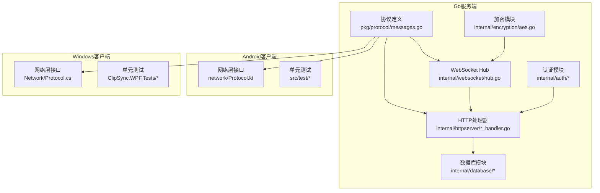
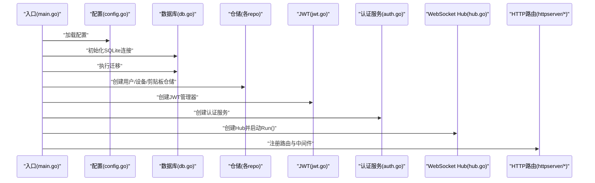
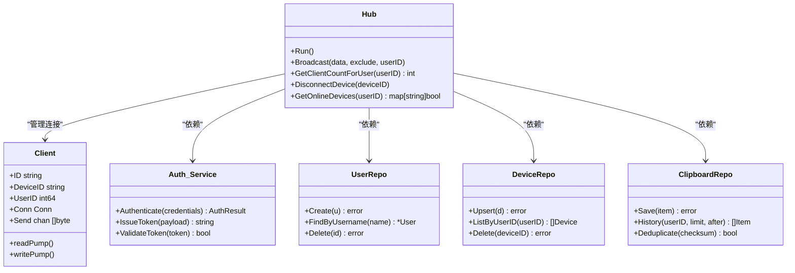
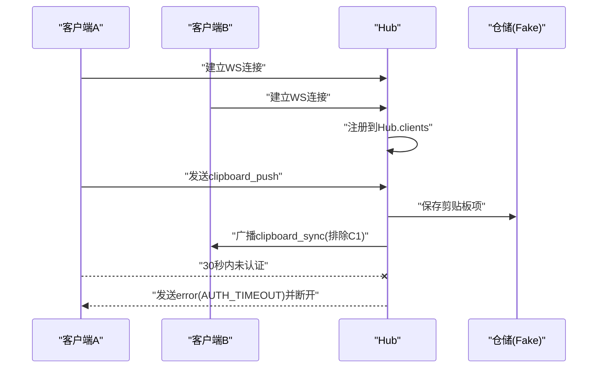
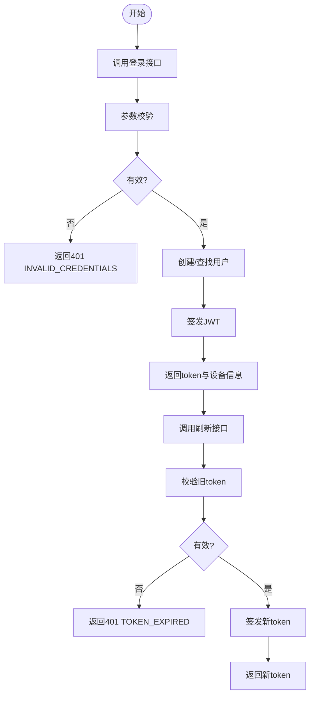
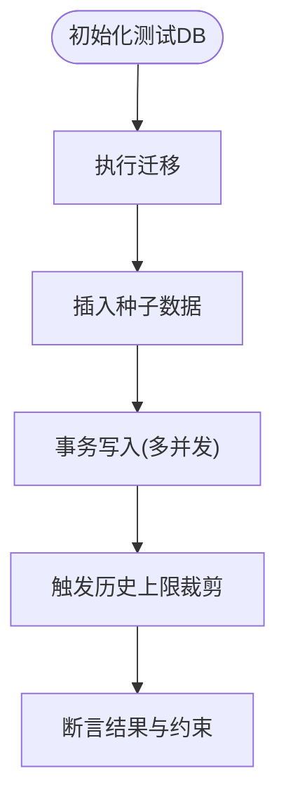
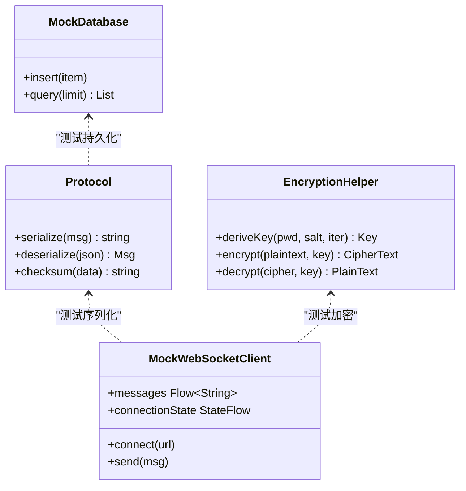
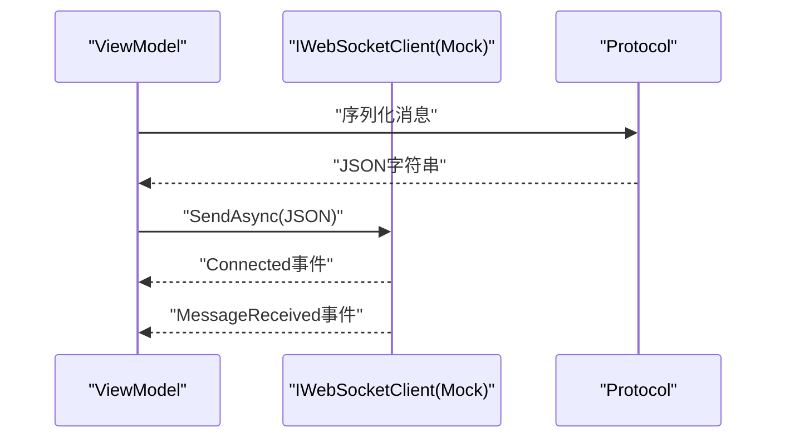
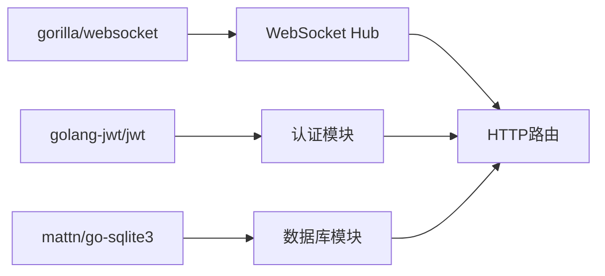

# 单元测试

<cite>
**本文引用的文件**
- [DEVELOPMENT_PLAN.md](file://DEVELOPMENT_PLAN.md)
- [go.mod](file://clipSync-server/go.mod)
- [main.go](file://clipSync-server/cmd/server/main.go)
- [hub.go](file://clipSync-server/internal/websocket/hub.go)
- [mock_server.go](file://clipSync-server/scripts/mock_server.go)
- [messages.go](file://clipSync-server/pkg/protocol/messages.go)
- [auth_handler.go](file://clipSync-server/internal/httpserver/auth_handler.go)
- [device_handler.go](file://clipSync-server/internal/httpserver/device_handler.go)
- [health_handler.go](file://clipSync-server/internal/httpserver/health_handler.go)
- [upload_handler.go](file://clipSync-server/internal/httpserver/upload_handler.go)
- [jwt.go](file://clipSync-server/internal/auth/jwt.go)
- [middleware.go](file://clipSync-server/internal/auth/middleware.go)
- [db.go](file://clipSync-server/internal/database/db.go)
- [migrations.go](file://clipSync-server/internal/database/migrations.go)
- [models.go](file://clipSync-server/internal/database/models.go)
- [clipboard_repo.go](file://clipSync-server/internal/database/clipboard_repo.go)
- [device_repo.go](file://clipSync-server/internal/database/device_repo.go)
- [user_repo.go](file://clipSync-server/internal/database/user_repo.go)
- [aes.go](file://clipSync-server/internal/encryption/aes.go)
- [Protocol.kt](file://clipSync-android/app/src/main/java/com/clipsync/app/network/Protocol.kt)
- [EncryptionTest.kt](file://clipSync-android/app/src/test/java/com/clipsync/app/EncryptionTest.kt)
- [ProtocolTest.kt](file://clipSync-android/app/src/test/java/com/clipsync/app/ProtocolTest.kt)
- [ClipboardMonitorTests.cs](file://clipSync-windows/ClipSync.WPF.Tests/ClipboardMonitorTests.cs)
- [ProtocolTests.cs](file://clipSync-windows/ClipSync.WPF.Tests/ProtocolTests.cs)
</cite>

## 目录
1. [引言](#引言)
2. [项目结构](#项目结构)
3. [核心组件](#核心组件)
4. [架构总览](#架构总览)
5. [详细组件分析](#详细组件分析)
6. [依赖关系分析](#依赖关系分析)
7. [性能考量](#性能考量)
8. [故障排查指南](#故障排查指南)
9. [结论](#结论)
10. [附录](#附录)

## 引言
本文件面向ClipSync项目的单元测试实践，覆盖Go服务端、Windows WPF客户端与Android Kotlin客户端的测试策略与实现要点。重点包括：
- 测试框架与测试组织方式
- 各平台测试用例设计原则
- Go服务端：WebSocket Hub测试、认证系统测试、数据库操作测试
- 客户端：依赖注入测试、异步操作测试、UI组件测试
- Mock对象与测试数据准备
- 覆盖率目标与常见问题及解决方案

## 项目结构
从测试视角看，项目采用“协议先行”的分层结构：
- 共享协议定义位于Go服务端的pkg/protocol，确保跨平台消息格式一致
- 服务端内部按功能域划分（auth、database、httpserver、websocket、encryption），便于针对模块进行单元测试
- 客户端通过接口抽象网络与存储，支持在测试中注入Mock实现

图表来源
- [messages.go](file://clipSync-server/pkg/protocol/messages.go)
- [hub.go](file://clipSync-server/internal/websocket/hub.go)
- [auth_handler.go](file://clipSync-server/internal/httpserver/auth_handler.go)
- [device_handler.go](file://clipSync-server/internal/httpserver/device_handler.go)
- [health_handler.go](file://clipSync-server/internal/httpserver/health_handler.go)
- [upload_handler.go](file://clipSync-server/internal/httpserver/upload_handler.go)
- [db.go](file://clipSync-server/internal/database/db.go)
- [aes.go](file://clipSync-server/internal/encryption/aes.go)
- [Protocol.kt](file://clipSync-android/app/src/main/java/com/clipsync/app/network/Protocol.kt)
- [ProtocolTests.cs](file://clipSync-windows/ClipSync.WPF.Tests/ProtocolTests.cs)

章节来源
- [DEVELOPMENT_PLAN.md](file://DEVELOPMENT_PLAN.md)
- [messages.go](file://clipSync-server/pkg/protocol/messages.go)
- [hub.go](file://clipSync-server/internal/websocket/hub.go)

## 核心组件
- 协议与消息模型：统一的消息类型、载荷与校验规则，确保跨平台一致性
- 认证与中间件：JWT签发、刷新与鉴权中间件，HTTP端点保护
- 数据库与仓储：SQLite/WAL模式、迁移脚本、用户/设备/剪贴板仓储
- WebSocket Hub：连接管理、广播、心跳超时、离线清理
- 加密工具：AES-256-CBC派生与加解密辅助
- 客户端接口抽象：网络层、存储层以接口形式暴露，便于依赖注入替换

章节来源
- [DEVELOPMENT_PLAN.md](file://DEVELOPMENT_PLAN.md)
- [jwt.go](file://clipSync-server/internal/auth/jwt.go)
- [middleware.go](file://clipSync-server/internal/auth/middleware.go)
- [db.go](file://clipSync-server/internal/database/db.go)
- [migrations.go](file://clipSync-server/internal/database/migrations.go)
- [models.go](file://clipSync-server/internal/database/models.go)
- [clipboard_repo.go](file://clipSync-server/internal/database/clipboard_repo.go)
- [device_repo.go](file://clipSync-server/internal/database/device_repo.go)
- [user_repo.go](file://clipSync-server/internal/database/user_repo.go)
- [hub.go](file://clipSync-server/internal/websocket/hub.go)
- [aes.go](file://clipSync-server/internal/encryption/aes.go)

## 架构总览
下图展示服务端启动流程与关键依赖注入点，便于理解测试中的Mock注入位置。

图表来源
- [main.go](file://clipSync-server/cmd/server/main.go)
- [db.go](file://clipSync-server/internal/database/db.go)
- [migrations.go](file://clipSync-server/internal/database/migrations.go)
- [jwt.go](file://clipSync-server/internal/auth/jwt.go)
- [hub.go](file://clipSync-server/internal/websocket/hub.go)

## 详细组件分析

### Go服务端单元测试策略
- 测试框架：Go标准库testing包，结合表驱动测试与子测试
- Mock对象：
  - 使用接口隔离（如仓储接口）注入内存实现或Fake
  - 使用HTTP/WS Mock Server进行集成测试
- 覆盖率目标：建议核心模块（认证、仓储、Hub）达到80%以上
- 关键测试场景：
  - 认证：登录/注册/刷新令牌的边界条件与错误码
  - WebSocket Hub：连接注册/注销、广播、心跳超时、缓冲区满处理
  - 数据库：迁移、事务、并发写入、历史条目上限
  - HTTP端点：鉴权中间件、限流、错误响应
  - 加密：派生、加解密、完整性校验

图表来源
- [hub.go](file://clipSync-server/internal/websocket/hub.go)
- [user_repo.go](file://clipSync-server/internal/database/user_repo.go)
- [device_repo.go](file://clipSync-server/internal/database/device_repo.go)
- [clipboard_repo.go](file://clipSync-server/internal/database/clipboard_repo.go)

章节来源
- [hub.go](file://clipSync-server/internal/websocket/hub.go)
- [main.go](file://clipSync-server/cmd/server/main.go)
- [auth_handler.go](file://clipSync-server/internal/httpserver/auth_handler.go)
- [device_handler.go](file://clipSync-server/internal/httpserver/device_handler.go)
- [health_handler.go](file://clipSync-server/internal/httpserver/health_handler.go)
- [upload_handler.go](file://clipSync-server/internal/httpserver/upload_handler.go)
- [jwt.go](file://clipSync-server/internal/auth/jwt.go)
- [middleware.go](file://clipSync-server/internal/auth/middleware.go)
- [db.go](file://clipSync-server/internal/database/db.go)
- [migrations.go](file://clipSync-server/internal/database/migrations.go)
- [models.go](file://clipSync-server/internal/database/models.go)
- [clipboard_repo.go](file://clipSync-server/internal/database/clipboard_repo.go)
- [device_repo.go](file://clipSync-server/internal/database/device_repo.go)
- [user_repo.go](file://clipSync-server/internal/database/user_repo.go)
- [aes.go](file://clipSync-server/internal/encryption/aes.go)

### WebSocket Hub测试
- 目标：验证Hub对客户端生命周期、广播、去重与异常处理的行为
- 测试要点：
  - 注册/注销：多客户端并发注册与注销，统计总数变化
  - 广播：同一用户内除发送者外全部收到；跨用户不广播
  - 缓冲区满：默认256通道，观察丢弃与断开行为
  - 心跳超时：未在30秒内认证，应发送错误并断开
  - 在线设备查询：按用户聚合在线设备集合
- Mock策略：使用Fake Client（可注入Send通道）、Fake仓储（返回固定结果）

图表来源
- [hub.go](file://clipSync-server/internal/websocket/hub.go)

章节来源
- [hub.go](file://clipSync-server/internal/websocket/hub.go)

### 认证系统测试
- 目标：验证JWT签发、刷新、中间件拦截与错误码
- 测试要点：
  - 登录/注册：用户名存在性、密码强度、设备名与平台合法性
  - 刷新：过期令牌、无效令牌、速率限制
  - 中间件：缺失/无效令牌、错误响应码
- Mock策略：Fake用户仓储返回指定状态；JWT管理器可控时间戳

图表来源
- [auth_handler.go](file://clipSync-server/internal/httpserver/auth_handler.go)
- [jwt.go](file://clipSync-server/internal/auth/jwt.go)
- [middleware.go](file://clipSync-server/internal/auth/middleware.go)

章节来源
- [auth_handler.go](file://clipSync-server/internal/httpserver/auth_handler.go)
- [jwt.go](file://clipSync-server/internal/auth/jwt.go)
- [middleware.go](file://clipSync-server/internal/auth/middleware.go)

### 数据库操作测试
- 目标：验证迁移、事务、并发写入与历史上限
- 测试要点：
  - 迁移：初始schema、版本升级/降级
  - 用户/设备/剪贴板：增删改查、唯一约束、外键一致性
  - 历史上限：超过限制后自动裁剪
- Mock策略：使用内存SQLite或独立测试数据库；并发写入模拟高负载

图表来源
- [db.go](file://clipSync-server/internal/database/db.go)
- [migrations.go](file://clipSync-server/internal/database/migrations.go)
- [models.go](file://clipSync-server/internal/database/models.go)
- [clipboard_repo.go](file://clipSync-server/internal/database/clipboard_repo.go)
- [device_repo.go](file://clipSync-server/internal/database/device_repo.go)
- [user_repo.go](file://clipSync-server/internal/database/user_repo.go)

章节来源
- [db.go](file://clipSync-server/internal/database/db.go)
- [migrations.go](file://clipSync-server/internal/database/migrations.go)
- [models.go](file://clipSync-server/internal/database/models.go)
- [clipboard_repo.go](file://clipSync-server/internal/database/clipboard_repo.go)
- [device_repo.go](file://clipSync-server/internal/database/device_repo.go)
- [user_repo.go](file://clipSync-server/internal/database/user_repo.go)

### Android客户端单元测试策略
- 接口优先：网络层与协议序列化均以接口暴露，测试中注入Mock实现
- 测试类型：
  - 协议测试：消息序列化/反序列化、校验和计算一致性
  - 加密测试：派生、加解密、错误输入处理
  - 依赖注入测试：Hilt/Dagger提供@Development/@Production绑定
  - 异步操作测试：协程挂起函数、超时与取消
- Mock对象：
  - WebSocketClient接口：可注入Mock实现，控制连接/发送/消息流
  - 数据库接口：Room DAO/Fake实现
- 覆盖率目标：协议与加密模块≥90%，网络层≥80%

图表来源
- [Protocol.kt](file://clipSync-android/app/src/main/java/com/clipsync/app/network/Protocol.kt)
- [EncryptionTest.kt](file://clipSync-android/app/src/test/java/com/clipsync/app/EncryptionTest.kt)
- [ProtocolTest.kt](file://clipSync-android/app/src/test/java/com/clipsync/app/ProtocolTest.kt)

章节来源
- [Protocol.kt](file://clipSync-android/app/src/main/java/com/clipsync/app/network/Protocol.kt)
- [EncryptionTest.kt](file://clipSync-android/app/src/test/java/com/clipsync/app/EncryptionTest.kt)
- [ProtocolTest.kt](file://clipSync-android/app/src/test/java/com/clipsync/app/ProtocolTest.kt)

### Windows WPF客户端单元测试策略
- 接口优先：网络层与协议序列化以接口暴露，测试中注入Mock实现
- 测试类型：
  - 协议测试：消息序列化/反序列化、校验和计算一致性
  - 依赖注入测试：使用SimpleInjector或内置容器注册@Development/@Production实现
  - 异步操作测试：Task/async/await、超时与取消
  - UI组件测试：ViewModel逻辑与命令绑定，避免直接UI渲染
- Mock对象：
  - IWebSocketClient接口：可注入Mock实现，控制连接/发送/事件
  - IHttpClient接口：返回预设响应，模拟HTTP API
- 覆盖率目标：协议与加密模块≥90%，网络层≥80%

图表来源
- [ProtocolTests.cs](file://clipSync-windows/ClipSync.WPF.Tests/ProtocolTests.cs)
- [ClipboardMonitorTests.cs](file://clipSync-windows/ClipSync.WPF.Tests/ClipboardMonitorTests.cs)

章节来源
- [ProtocolTests.cs](file://clipSync-windows/ClipSync.WPF.Tests/ProtocolTests.cs)
- [ClipboardMonitorTests.cs](file://clipSync-windows/ClipSync.WPF.Tests/ClipboardMonitorTests.cs)

## 依赖关系分析
- 外部依赖：Go服务端使用gorilla/websocket、mattn/go-sqlite3、golang-jwt等
- 内部耦合：Hub依赖认证服务与仓储；HTTP路由依赖中间件与处理器；客户端依赖协议与接口抽象
- 循环依赖：当前结构清晰，未见循环导入

图表来源
- [go.mod](file://clipSync-server/go.mod)
- [hub.go](file://clipSync-server/internal/websocket/hub.go)
- [db.go](file://clipSync-server/internal/database/db.go)
- [jwt.go](file://clipSync-server/internal/auth/jwt.go)

章节来源
- [go.mod](file://clipSync-server/go.mod)
- [hub.go](file://clipSync-server/internal/websocket/hub.go)
- [db.go](file://clipSync-server/internal/database/db.go)
- [jwt.go](file://clipSync-server/internal/auth/jwt.go)

## 性能考量
- 测试并发：Hub广播与数据库写入需在高并发下验证稳定性
- 资源释放：确保测试结束后关闭连接与数据库句柄
- Mock延迟：为真实网络行为建模，设置合理延迟与错误注入
- 覆盖率工具：使用go test -cover与覆盖率报告工具

## 故障排查指南
- 认证失败
  - 症状：登录/刷新返回401
  - 排查：检查JWT密钥、过期时间、速率限制
- WebSocket无法认证
  - 症状：30秒后被断开
  - 排查：确认握手消息类型与载荷正确
- 广播未达
  - 症状：目标客户端未收到消息
  - 排查：核对用户ID、排除发送者ID、检查缓冲区
- 数据库迁移失败
  - 症状：启动时报错
  - 排查：确认迁移SQL语法与权限
- 客户端Mock未生效
  - 症状：测试仍使用真实网络
  - 排查：确认DI容器绑定与作用域

章节来源
- [DEVELOPMENT_PLAN.md](file://DEVELOPMENT_PLAN.md)
- [hub.go](file://clipSync-server/internal/websocket/hub.go)
- [auth_handler.go](file://clipSync-server/internal/httpserver/auth_handler.go)
- [migrations.go](file://clipSync-server/internal/database/migrations.go)

## 结论
通过“协议先行、接口抽象、Mock注入”的测试策略，ClipSync可在三个平台上实现高内聚、低耦合的单元测试体系。建议优先完善认证、Hub与协议相关测试，逐步扩展到数据库与UI组件，持续提升覆盖率与稳定性。

## 附录
- 测试覆盖率目标（建议）
  - 认证与中间件：≥90%
  - WebSocket Hub：≥85%
  - 数据库仓储：≥80%
  - 协议与加密：≥90%
  - 客户端网络层：≥80%
- Mock服务器
  - 用途：本地快速验证协议与端到端流程
  - 启动方式：参考脚本路径与参数
- 测试数据准备
  - 使用协议规范生成消息样本，确保跨平台一致性
  - 为加密测试准备固定盐值与密钥，保证可重复性

章节来源
- [DEVELOPMENT_PLAN.md](file://DEVELOPMENT_PLAN.md)
- [mock_server.go](file://clipSync-server/scripts/mock_server.go)
- [messages.go](file://clipSync-server/pkg/protocol/messages.go)