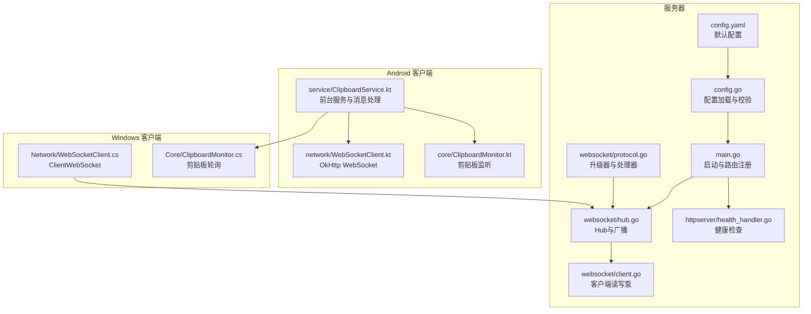
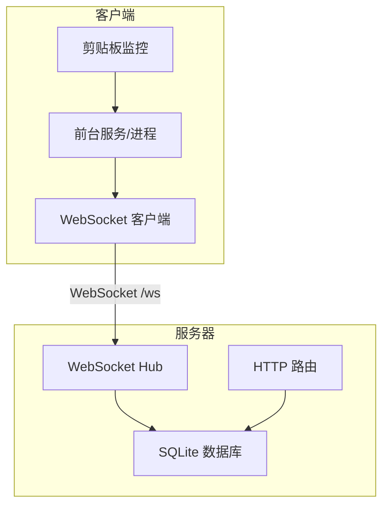
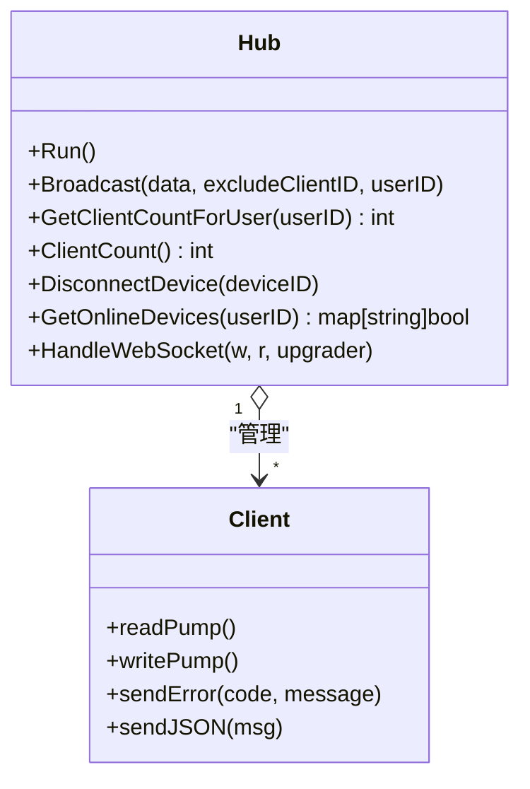
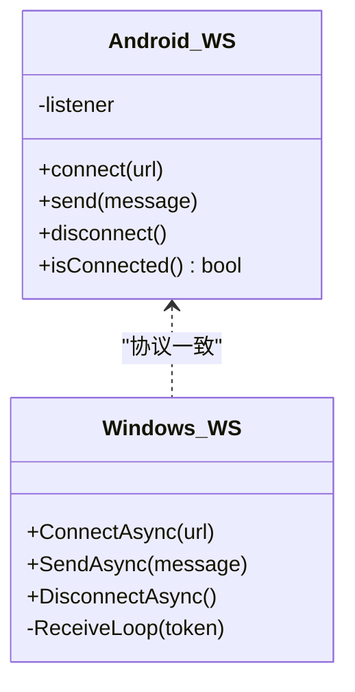
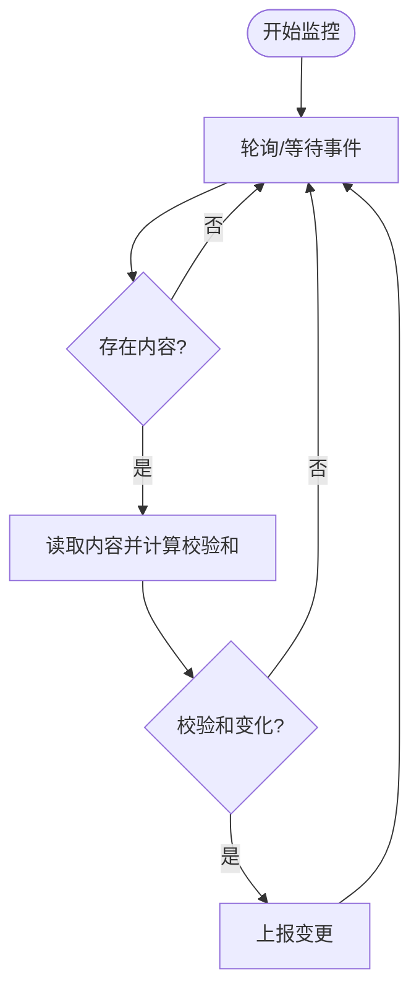
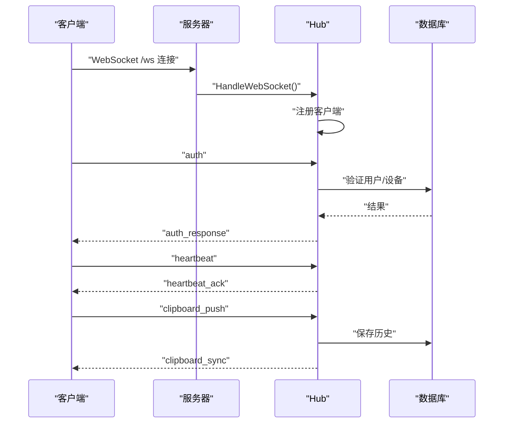
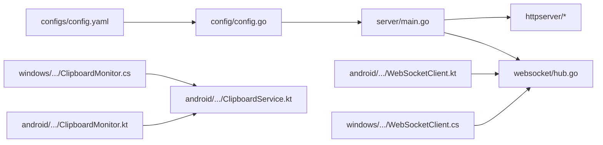

# 性能测试

<cite>
**本文引用的文件**
- [clipSync-server/cmd/server/main.go](file://clipSync-server/cmd/server/main.go)
- [clipSync-server/internal/websocket/hub.go](file://clipSync-server/internal/websocket/hub.go)
- [clipSync-server/internal/websocket/client.go](file://clipSync-server/internal/websocket/client.go)
- [clipSync-server/internal/websocket/protocol.go](file://clipSync-server/internal/websocket/protocol.go)
- [clipSync-server/internal/config/config.go](file://clipSync-server/internal/config/config.go)
- [clipSync-server/configs/config.yaml](file://clipSync-server/configs/config.yaml)
- [clipSync-server/internal/httpserver/health_handler.go](file://clipSync-server/internal/httpserver/health_handler.go)
- [clipSync-android/app/src/main/java/com/clipsync/app/network/WebSocketClient.kt](file://clipSync-android/app/src/main/java/com/clipsync/app/network/WebSocketClient.kt)
- [clipSync-android/app/src/main/java/com/clipsync/app/service/ClipboardService.kt](file://clipSync-android/app/src/main/java/com/clipsync/app/service/ClipboardService.kt)
- [clipSync-android/app/src/main/java/com/clipsync/app/core/ClipboardMonitor.kt](file://clipSync-android/app/src/main/java/com/clipsync/app/core/ClipboardMonitor.kt)
- [clipSync-windows/ClipSync.WPF/Network/WebSocketClient.cs](file://clipSync-windows/ClipSync.WPF/Network/WebSocketClient.cs)
- [clipSync-windows/ClipSync.WPF/Core/ClipboardMonitor.cs](file://clipSync-windows/ClipSync.WPF/Core/ClipboardMonitor.cs)
- [protocol/ws-messages.schema.json](file://protocol/ws-messages.schema.json)
- [protocol/http-api.schema.json](file://protocol/http-api.schema.json)
</cite>

## 目录
1. [简介](#简介)
2. [项目结构](#项目结构)
3. [核心组件](#核心组件)
4. [架构总览](#架构总览)
5. [详细组件分析](#详细组件分析)
6. [依赖分析](#依赖分析)
7. [性能考虑](#性能考虑)
8. [故障排查指南](#故障排查指南)
9. [结论](#结论)
10. [附录](#附录)

## 简介
本文件面向ClipSync项目的性能测试，系统性阐述性能基准设计与实现，覆盖以下方面：
- WebSocket连接性能测试：连接建立、心跳保活、消息收发吞吐、背压处理与断线重连
- 剪贴板监控性能测试：Android与Windows平台的监控开销、事件去抖与重复过滤
- 内存使用测试：服务端Hub与客户端OkHttp/ClientWebSocket缓冲区、消息队列容量
- CPU占用率测试：服务端goroutine数量与选择器循环、客户端协程与轮询频率
- 平台性能策略：服务器端负载测试（并发连接、广播吞吐）、客户端响应时间测试（从剪贴板变更到同步完成）、并发连接测试
- 指标定义、工具使用、瓶颈识别方法、优化建议、资源监控与回归测试

## 项目结构
ClipSync由三部分组成：Go语言编写的服务器、Android应用与WPF桌面应用。服务器负责认证、设备管理、剪贴板历史与WebSocket广播；客户端负责剪贴板监控与实时同步。

**图表来源**
- [clipSync-server/cmd/server/main.go:21-145](file://clipSync-server/cmd/server/main.go#L21-L145)
- [clipSync-server/internal/websocket/hub.go:18-230](file://clipSync-server/internal/websocket/hub.go#L18-L230)
- [clipSync-server/internal/websocket/client.go:13-150](file://clipSync-server/internal/websocket/client.go#L13-L150)
- [clipSync-server/internal/websocket/protocol.go:9-27](file://clipSync-server/internal/websocket/protocol.go#L9-L27)
- [clipSync-server/internal/config/config.go:10-72](file://clipSync-server/internal/config/config.go#L10-L72)
- [clipSync-server/configs/config.yaml:1-29](file://clipSync-server/configs/config.yaml#L1-L29)
- [clipSync-server/internal/httpserver/health_handler.go:10-55](file://clipSync-server/internal/httpserver/health_handler.go#L10-L55)
- [clipSync-android/app/src/main/java/com/clipsync/app/network/WebSocketClient.kt:26-156](file://clipSync-android/app/src/main/java/com/clipsync/app/network/WebSocketClient.kt#L26-L156)
- [clipSync-android/app/src/main/java/com/clipsync/app/service/ClipboardService.kt:39-249](file://clipSync-android/app/src/main/java/com/clipsync/app/service/ClipboardService.kt#L39-L249)
- [clipSync-android/app/src/main/java/com/clipsync/app/core/ClipboardMonitor.kt:15-106](file://clipSync-android/app/src/main/java/com/clipsync/app/core/ClipboardMonitor.kt#L15-L106)
- [clipSync-windows/ClipSync.WPF/Network/WebSocketClient.cs:10-146](file://clipSync-windows/ClipSync.WPF/Network/WebSocketClient.cs#L10-L146)
- [clipSync-windows/ClipSync.WPF/Core/ClipboardMonitor.cs:26-174](file://clipSync-windows/ClipSync.WPF/Core/ClipboardMonitor.cs#L26-L174)

**章节来源**
- [clipSync-server/cmd/server/main.go:21-145](file://clipSync-server/cmd/server/main.go#L21-L145)
- [clipSync-server/internal/websocket/hub.go:18-230](file://clipSync-server/internal/websocket/hub.go#L18-L230)
- [clipSync-server/internal/websocket/client.go:13-150](file://clipSync-server/internal/websocket/client.go#L13-L150)
- [clipSync-server/internal/websocket/protocol.go:9-27](file://clipSync-server/internal/websocket/protocol.go#L9-L27)
- [clipSync-server/internal/config/config.go:10-72](file://clipSync-server/internal/config/config.go#L10-L72)
- [clipSync-server/configs/config.yaml:1-29](file://clipSync-server/configs/config.yaml#L1-L29)
- [clipSync-server/internal/httpserver/health_handler.go:10-55](file://clipSync-server/internal/httpserver/health_handler.go#L10-L55)
- [clipSync-android/app/src/main/java/com/clipsync/app/network/WebSocketClient.kt:26-156](file://clipSync-android/app/src/main/java/com/clipsync/app/network/WebSocketClient.kt#L26-L156)
- [clipSync-android/app/src/main/java/com/clipsync/app/service/ClipboardService.kt:39-249](file://clipSync-android/app/src/main/java/com/clipsync/app/service/ClipboardService.kt#L39-L249)
- [clipSync-android/app/src/main/java/com/clipsync/app/core/ClipboardMonitor.kt:15-106](file://clipSync-android/app/src/main/java/com/clipsync/app/core/ClipboardMonitor.kt#L15-L106)
- [clipSync-windows/ClipSync.WPF/Network/WebSocketClient.cs:10-146](file://clipSync-windows/ClipSync.WPF/Network/WebSocketClient.cs#L10-L146)
- [clipSync-windows/ClipSync.WPF/Core/ClipboardMonitor.cs:26-174](file://clipSync-windows/ClipSync.WPF/Core/ClipboardMonitor.cs#L26-L174)

## 核心组件
- 服务器入口与路由：负责加载配置、初始化数据库与迁移、构建HTTP与WebSocket路由、启动优雅关闭
- WebSocket Hub：维护客户端集合、注册/注销、广播、心跳超时与离线清理、在线设备查询
- 客户端WebSocket：Android使用OkHttp，Windows使用System.Net.WebSockets.ClientWebSocket；均支持连接状态、消息收发与断线重连
- 剪贴板监控：Android通过系统回调监听，Windows通过STA线程轮询检测变化并计算校验和避免重复推送
- 配置与健康检查：提供默认配置、生产安全警告、健康接口返回连接数与数据库状态

**章节来源**
- [clipSync-server/cmd/server/main.go:21-145](file://clipSync-server/cmd/server/main.go#L21-L145)
- [clipSync-server/internal/websocket/hub.go:18-230](file://clipSync-server/internal/websocket/hub.go#L18-L230)
- [clipSync-server/internal/websocket/client.go:13-150](file://clipSync-server/internal/websocket/client.go#L13-L150)
- [clipSync-server/internal/websocket/protocol.go:9-27](file://clipSync-server/internal/websocket/protocol.go#L9-L27)
- [clipSync-server/internal/config/config.go:10-72](file://clipSync-server/internal/config/config.go#L10-L72)
- [clipSync-server/configs/config.yaml:1-29](file://clipSync-server/configs/config.yaml#L1-L29)
- [clipSync-server/internal/httpserver/health_handler.go:10-55](file://clipSync-server/internal/httpserver/health_handler.go#L10-L55)
- [clipSync-android/app/src/main/java/com/clipsync/app/network/WebSocketClient.kt:26-156](file://clipSync-android/app/src/main/java/com/clipsync/app/network/WebSocketClient.kt#L26-L156)
- [clipSync-android/app/src/main/java/com/clipsync/app/service/ClipboardService.kt:39-249](file://clipSync-android/app/src/main/java/com/clipsync/app/service/ClipboardService.kt#L39-L249)
- [clipSync-android/app/src/main/java/com/clipsync/app/core/ClipboardMonitor.kt:15-106](file://clipSync-android/app/src/main/java/com/clipsync/app/core/ClipboardMonitor.kt#L15-L106)
- [clipSync-windows/ClipSync.WPF/Network/WebSocketClient.cs:10-146](file://clipSync-windows/ClipSync.WPF/Network/WebSocketClient.cs#L10-L146)
- [clipSync-windows/ClipSync.WPF/Core/ClipboardMonitor.cs:26-174](file://clipSync-windows/ClipSync.WPF/Core/ClipboardMonitor.cs#L26-L174)

## 架构总览
服务器通过独立的HTTP与WebSocket端口提供服务，WebSocket用于实时剪贴板同步，HTTP用于认证、设备管理与文件上传下载。客户端在前台服务中持续运行，监控剪贴板变化并通过WebSocket与服务器交互。

**图表来源**
- [clipSync-server/cmd/server/main.go:74-125](file://clipSync-server/cmd/server/main.go#L74-L125)
- [clipSync-server/internal/websocket/hub.go:18-230](file://clipSync-server/internal/websocket/hub.go#L18-L230)
- [clipSync-android/app/src/main/java/com/clipsync/app/service/ClipboardService.kt:39-249](file://clipSync-android/app/src/main/java/com/clipsync/app/service/ClipboardService.kt#L39-L249)
- [clipSync-windows/ClipSync.WPF/Network/WebSocketClient.cs:10-146](file://clipSync-windows/ClipSync.WPF/Network/WebSocketClient.cs#L10-L146)

## 详细组件分析

### 服务器WebSocket Hub与客户端读写泵
- Hub负责客户端注册/注销、广播、心跳超时与离线清理；广播通道有固定缓冲大小，避免阻塞主循环
- 客户端读泵设置读取上限与Pong处理，写泵周期性Ping并批量写出Send队列，减少系统调用次数
- 升级器与处理器分离，便于扩展与测试

**图表来源**
- [clipSync-server/internal/websocket/hub.go:18-230](file://clipSync-server/internal/websocket/hub.go#L18-L230)
- [clipSync-server/internal/websocket/client.go:13-150](file://clipSync-server/internal/websocket/client.go#L13-L150)

**章节来源**
- [clipSync-server/internal/websocket/hub.go:60-121](file://clipSync-server/internal/websocket/hub.go#L60-L121)
- [clipSync-server/internal/websocket/client.go:33-117](file://clipSync-server/internal/websocket/client.go#L33-L117)
- [clipSync-server/internal/websocket/protocol.go:20-27](file://clipSync-server/internal/websocket/protocol.go#L20-L27)

### 客户端WebSocket实现（Android与Windows）
- Android：OkHttp WebSocket，连接状态流与消息流，Ping间隔、连接/读超时可配置，断线重连处理器
- Windows：ClientWebSocket，接收循环分片组装消息，最大消息长度限制，异常捕获与连接状态事件

**图表来源**
- [clipSync-android/app/src/main/java/com/clipsync/app/network/WebSocketClient.kt:26-156](file://clipSync-android/app/src/main/java/com/clipsync/app/network/WebSocketClient.kt#L26-L156)
- [clipSync-windows/ClipSync.WPF/Network/WebSocketClient.cs:10-146](file://clipSync-windows/ClipSync.WPF/Network/WebSocketClient.cs#L10-L146)

**章节来源**
- [clipSync-android/app/src/main/java/com/clipsync/app/network/WebSocketClient.kt:83-134](file://clipSync-android/app/src/main/java/com/clipsync/app/network/WebSocketClient.kt#L83-L134)
- [clipSync-windows/ClipSync.WPF/Network/WebSocketClient.cs:22-81](file://clipSync-windows/ClipSync.WPF/Network/WebSocketClient.cs#L22-L81)

### 剪贴板监控（Android与Windows）
- Android：系统PrimaryClip变更回调，去回环（lastContent）避免本地写入触发自身监听
- Windows：STA线程轮询，检测文本或图像格式，计算校验和，避免重复推送

**图表来源**
- [clipSync-android/app/src/main/java/com/clipsync/app/core/ClipboardMonitor.kt:79-93](file://clipSync-android/app/src/main/java/com/clipsync/app/core/ClipboardMonitor.kt#L79-L93)
- [clipSync-windows/ClipSync.WPF/Core/ClipboardMonitor.cs:58-87](file://clipSync-windows/ClipSync.WPF/Core/ClipboardMonitor.cs#L58-L87)

**章节来源**
- [clipSync-android/app/src/main/java/com/clipsync/app/core/ClipboardMonitor.kt:31-44](file://clipSync-android/app/src/main/java/com/clipsync/app/core/ClipboardMonitor.kt#L31-L44)
- [clipSync-android/app/src/main/java/com/clipsync/app/core/ClipboardMonitor.kt:98-100](file://clipSync-android/app/src/main/java/com/clipsync/app/core/ClipboardMonitor.kt#L98-L100)
- [clipSync-windows/ClipSync.WPF/Core/ClipboardMonitor.cs:39-56](file://clipSync-windows/ClipSync.WPF/Core/ClipboardMonitor.cs#L39-L56)
- [clipSync-windows/ClipSync.WPF/Core/ClipboardMonitor.cs:155-158](file://clipSync-windows/ClipSync.WPF/Core/ClipboardMonitor.cs#L155-L158)

### 协议与健康检查
- WebSocket消息类型与字段定义见协议Schema，涵盖认证、心跳、剪贴板推送/同步、历史、设备列表与错误码
- HTTP健康接口返回版本、运行时长、连接客户端数与数据库状态

**图表来源**
- [protocol/ws-messages.schema.json:8-261](file://protocol/ws-messages.schema.json#L8-L261)
- [clipSync-server/internal/websocket/hub.go:181-208](file://clipSync-server/internal/websocket/hub.go#L181-L208)
- [clipSync-server/internal/httpserver/health_handler.go:28-54](file://clipSync-server/internal/httpserver/health_handler.go#L28-L54)

**章节来源**
- [protocol/ws-messages.schema.json:8-261](file://protocol/ws-messages.schema.json#L8-L261)
- [clipSync-server/internal/httpserver/health_handler.go:28-54](file://clipSync-server/internal/httpserver/health_handler.go#L28-L54)

## 依赖分析
- 服务器依赖：gorilla/websocket、gopkg.in/yaml.v3、SQLite驱动
- Android客户端依赖：OkHttp、Kotlin协程、Room（通过AppDatabase间接）
- Windows客户端依赖：System.Net.WebSockets、WPF

**图表来源**
- [clipSync-server/cmd/server/main.go:3-17](file://clipSync-server/cmd/server/main.go#L3-L17)
- [clipSync-server/internal/config/config.go:3-8](file://clipSync-server/internal/config/config.go#L3-L8)
- [clipSync-android/app/src/main/java/com/clipsync/app/network/WebSocketClient.kt:14-20](file://clipSync-android/app/src/main/java/com/clipsync/app/network/WebSocketClient.kt#L14-L20)
- [clipSync-windows/ClipSync.WPF/Network/WebSocketClient.cs:3-6](file://clipSync-windows/ClipSync.WPF/Network/WebSocketClient.cs#L3-L6)

**章节来源**
- [clipSync-server/cmd/server/main.go:3-17](file://clipSync-server/cmd/server/main.go#L3-L17)
- [clipSync-server/internal/config/config.go:3-8](file://clipSync-server/internal/config/config.go#L3-L8)
- [clipSync-android/app/src/main/java/com/clipsync/app/network/WebSocketClient.kt:14-20](file://clipSync-android/app/src/main/java/com/clipsync/app/network/WebSocketClient.kt#L14-L20)
- [clipSync-windows/ClipSync.WPF/Network/WebSocketClient.cs:3-6](file://clipSync-windows/ClipSync.WPF/Network/WebSocketClient.cs#L3-L6)

## 性能考虑

### WebSocket连接性能测试
- 连接建立：测量从发起连接到收到认证应答的时间，关注服务器升级器与客户端握手耗时
- 心跳保活：验证Ping/Pong周期与心跳超时配置，确保在高延迟网络下稳定
- 广播吞吐：以不同消息大小（文本/图片/文件）进行广播，记录每秒消息数与延迟
- 背压与丢弃：当客户端发送缓冲满时，Hub标记断开，需验证断线重连与消息丢失容忍度
- 断线重连：客户端在失败回调后触发重连，需评估重连间隔与指数退避策略

**章节来源**
- [clipSync-server/internal/websocket/client.go:40-45](file://clipSync-server/internal/websocket/client.go#L40-L45)
- [clipSync-server/internal/websocket/client.go:106-116](file://clipSync-server/internal/websocket/client.go#L106-L116)
- [clipSync-server/internal/websocket/hub.go:91-109](file://clipSync-server/internal/websocket/hub.go#L91-L109)
- [clipSync-android/app/src/main/java/com/clipsync/app/network/WebSocketClient.kt:46-78](file://clipSync-android/app/src/main/java/com/clipsync/app/network/WebSocketClient.kt#L46-L78)
- [clipSync-windows/ClipSync.WPF/Network/WebSocketClient.cs:30-38](file://clipSync-windows/ClipSync.WPF/Network/WebSocketClient.cs#L30-L38)

### 剪贴板监控性能测试
- Android：回调触发频率、去回环逻辑有效性、初始内容检查成本
- Windows：轮询间隔（当前500ms）、COM异常重试、图像编码开销、校验和计算
- 事件风暴：高频复制粘贴场景下的CPU与内存峰值

**章节来源**
- [clipSync-android/app/src/main/java/com/clipsync/app/core/ClipboardMonitor.kt:24-26](file://clipSync-android/app/src/main/java/com/clipsync/app/core/ClipboardMonitor.kt#L24-L26)
- [clipSync-android/app/src/main/java/com/clipsync/app/core/ClipboardMonitor.kt:79-93](file://clipSync-android/app/src/main/java/com/clipsync/app/core/ClipboardMonitor.kt#L79-L93)
- [clipSync-windows/ClipSync.WPF/Core/ClipboardMonitor.cs:58-87](file://clipSync-windows/ClipSync.WPF/Core/ClipboardMonitor.cs#L58-L87)
- [clipSync-windows/ClipSync.WPF/Core/ClipboardMonitor.cs:95-146](file://clipSync-windows/ClipSync.WPF/Core/ClipboardMonitor.cs#L95-L146)

### 内存使用测试
- 服务器：Hub客户端映射、广播通道缓冲、客户端Send通道容量；数据库连接池与事务
- 客户端：OkHttp缓冲区大小、消息流缓冲、ClientWebSocket接收缓冲与最大消息限制

**章节来源**
- [clipSync-server/internal/websocket/hub.go:45-57](file://clipSync-server/internal/websocket/hub.go#L45-L57)
- [clipSync-server/internal/websocket/client.go:192-195](file://clipSync-server/internal/websocket/client.go#L192-L195)
- [clipSync-android/app/src/main/java/com/clipsync/app/network/WebSocketClient.kt:33-34](file://clipSync-android/app/src/main/java/com/clipsync/app/network/WebSocketClient.kt#L33-L34)
- [clipSync-windows/ClipSync.WPF/Network/WebSocketClient.cs:15-15](file://clipSync-windows/ClipSync.WPF/Network/WebSocketClient.cs#L15-L15)

### CPU占用率测试
- 服务器：Hub主循环select、客户端读写泵循环、goroutine数量与GOMAXPROCS
- 客户端：协程调度、轮询线程优先级、消息解析与序列化开销

**章节来源**
- [clipSync-server/internal/websocket/hub.go:61-111](file://clipSync-server/internal/websocket/hub.go#L61-L111)
- [clipSync-android/app/src/main/java/com/clipsync/app/network/WebSocketClient.kt:28-28](file://clipSync-android/app/src/main/java/com/clipsync/app/network/WebSocketClient.kt#L28-L28)
- [clipSync-windows/ClipSync.WPF/Network/WebSocketClient.cs:26-27](file://clipSync-windows/ClipSync.WPF/Network/WebSocketClient.cs#L26-L27)

### 平台性能策略
- 服务器端负载测试：并发连接数（如1K/10K）、消息大小分布、广播延迟与丢包率
- 客户端响应时间测试：从剪贴板变更到远端同步完成的端到端延迟
- 并发连接测试：多设备同时在线，验证Hub广播与数据库写入性能

**章节来源**
- [clipSync-server/internal/websocket/hub.go:181-208](file://clipSync-server/internal/websocket/hub.go#L181-L208)
- [clipSync-server/internal/httpserver/health_handler.go:47-53](file://clipSync-server/internal/httpserver/health_handler.go#L47-L53)

### 指标定义
- 连接指标：连接成功率、平均连接时延、认证时延
- 吞吐指标：消息QPS、字节QPS、广播延迟
- 资源指标：CPU使用率、内存占用、goroutine/线程数
- 可靠性指标：断线率、重连次数、消息丢失率、错误码分布

**章节来源**
- [protocol/ws-messages.schema.json:8-261](file://protocol/ws-messages.schema.json#L8-L261)
- [protocol/http-api.schema.json:125-143](file://protocol/http-api.schema.json#L125-L143)

### 测试工具与方法
- 服务器：ab/curl/自定义压力测试脚本、pprof火焰图、Prometheus指标导出
- 客户端：adb shell dumpsys meminfo、Perfetto/Android Studio Profiler、dotTrace/Windbg
- 协议一致性：基于Schema的JSON校验与消息序列化/反序列化性能

**章节来源**
- [protocol/ws-messages.schema.json:8-261](file://protocol/ws-messages.schema.json#L8-L261)
- [protocol/http-api.schema.json:1-293](file://protocol/http-api.schema.json#L1-L293)

### 性能瓶颈识别
- 服务器：Hub广播路径是否成为热点；数据库写入是否阻塞；客户端Send通道是否频繁满
- 客户端：轮询频率过高导致CPU升高；消息解析与UI更新阻塞主线程

**章节来源**
- [clipSync-server/internal/websocket/hub.go:81-110](file://clipSync-server/internal/websocket/hub.go#L81-L110)
- [clipSync-windows/ClipSync.WPF/Core/ClipboardMonitor.cs:62-86](file://clipSync-windows/ClipSync.WPF/Core/ClipboardMonitor.cs#L62-L86)

### 优化建议
- 服务器：增大广播通道缓冲、优化消息序列化、引入连接数限流与分级队列
- 客户端：降低轮询间隔至合理值、批量合并剪贴板变更、启用压缩（如适用）

**章节来源**
- [clipSync-server/internal/websocket/hub.go:50-50](file://clipSync-server/internal/websocket/hub.go#L50-L50)
- [clipSync-windows/ClipSync.WPF/Core/ClipboardMonitor.cs:62-66](file://clipSync-windows/ClipSync.WPF/Core/ClipboardMonitor.cs#L62-L66)

### 资源监控与回归测试
- 健康检查接口提供连接客户端数与数据库状态，可用于自动化回归
- 建议在CI中执行短时压力测试与内存泄漏扫描

**章节来源**
- [clipSync-server/internal/httpserver/health_handler.go:28-54](file://clipSync-server/internal/httpserver/health_handler.go#L28-L54)

## 故障排查指南
- 认证超时：客户端未在30秒内完成认证会被断开，检查鉴权流程与网络延迟
- 心跳超时：客户端未按时发送心跳或服务器未及时Ping，检查Ping间隔与读超时
- 消息过大：客户端/服务器对消息大小有限制，避免超过上限
- 断线重连：确认重连策略与指数退避参数，避免雪崩式重连

**章节来源**
- [clipSync-server/internal/websocket/hub.go:197-204](file://clipSync-server/internal/websocket/hub.go#L197-L204)
- [clipSync-server/internal/websocket/client.go:106-116](file://clipSync-server/internal/websocket/client.go#L106-L116)
- [clipSync-windows/ClipSync.WPF/Network/WebSocketClient.cs:15-15](file://clipSync-windows/ClipSync.WPF/Network/WebSocketClient.cs#L15-L15)
- [clipSync-android/app/src/main/java/com/clipsync/app/network/WebSocketClient.kt:93-96](file://clipSync-android/app/src/main/java/com/clipsync/app/network/WebSocketClient.kt#L93-L96)

## 结论
本文从架构与代码层面梳理了ClipSync的性能关键点，给出了针对WebSocket连接、剪贴板监控、内存与CPU的测试策略与优化方向，并提供了平台差异化的实施建议。建议在持续集成中纳入回归测试与资源监控，确保性能稳定与可追踪。

## 附录

### 配置项与性能相关要点
- 服务器端口、心跳超时、历史条数限制、JWT过期等
- 客户端Ping间隔、连接/读超时、最大消息长度

**章节来源**
- [clipSync-server/configs/config.yaml:3-29](file://clipSync-server/configs/config.yaml#L3-L29)
- [clipSync-server/internal/config/config.go:10-72](file://clipSync-server/internal/config/config.go#L10-L72)
- [clipSync-android/app/src/main/java/com/clipsync/app/network/WebSocketClient.kt:92-96](file://clipSync-android/app/src/main/java/com/clipsync/app/network/WebSocketClient.kt#L92-L96)
- [clipSync-windows/ClipSync.WPF/Network/WebSocketClient.cs:26-27](file://clipSync-windows/ClipSync.WPF/Network/WebSocketClient.cs#L26-L27)