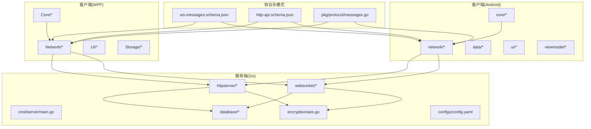
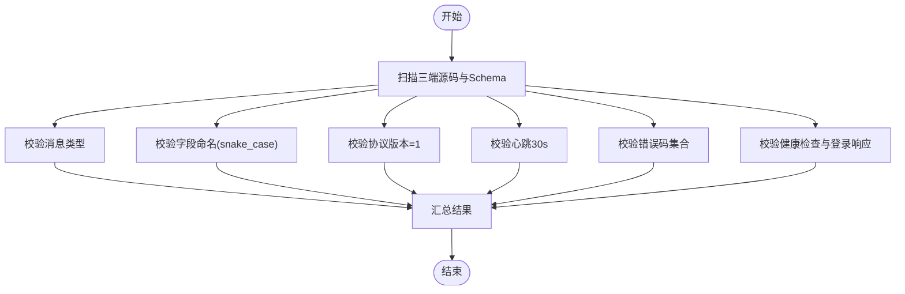
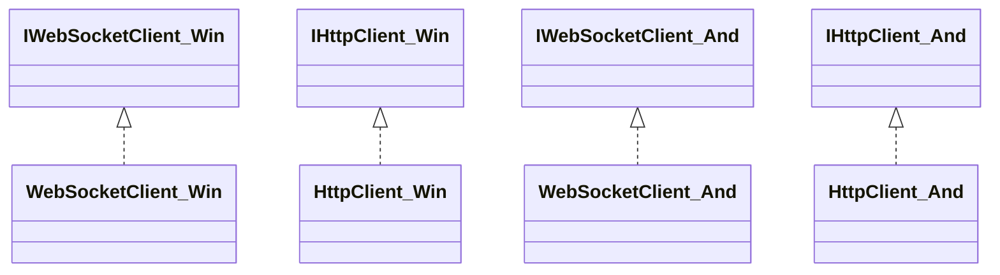

# 测试策略

<cite>
**本文引用的文件**
- [DEVELOPMENT_PLAN.md](file://DEVELOPMENT_PLAN.md)
- [test-protocol-compatibility.ps1](file://scripts/test-protocol-compatibility.ps1)
- [mock_server.go](file://clipSync-server/scripts/mock_server.go)
- [Protocol.cs](file://clipSync-windows/ClipSync.WPF/Network/Protocol.cs)
- [Protocol.kt](file://clipSync-android/app/src/main/java/com/clipsync/app/network/Protocol.kt)
- [messages.go](file://clipSync-server/pkg/protocol/messages.go)
- [ws-messages.schema.json](file://protocol/ws-messages.schema.json)
- [http-api.schema.json](file://protocol/http-api.schema.json)
- [aes.go](file://clipSync-server/internal/encryption/aes.go)
- [EncryptionHelper.cs](file://clipSync-windows/ClipSync.WPF/Core/EncryptionHelper.cs)
- [EncryptionHelper.kt](file://clipSync-android/app/src/main/java/com/clipsync/app/core/EncryptionHelper.kt)
- [ApiClient.kt](file://clipSync-android/app/src/main/java/com/clipsync/app/network/ApiClient.kt)
- [HttpClient.cs](file://clipSync-windows/ClipSync.WPF/Network/HttpClient.cs)
- [WebSocketClient.cs](file://clipSync-windows/ClipSync.WPF/Network/WebSocketClient.cs)
- [WebSocketClient.kt](file://clipSync-android/app/src/main/java/com/clipsync/app/network/WebSocketClient.kt)
- [HeartbeatTimer.cs](file://clipSync-windows/ClipSync.WPF/Network/HeartbeatTimer.cs)
- [HeartbeatManager.kt](file://clipSync-android/app/src/main/java/com/clipsync/app/network/HeartbeatManager.kt)
- [ReconnectHandler.cs](file://clipSync-windows/ClipSync.WPF/Network/ReconnectHandler.cs)
- [ReconnectHandler.kt](file://clipSync-android/app/src/main/java/com/clipsync/app/network/ReconnectHandler.kt)
- [ClipboardMonitor.cs](file://clipSync-windows/ClipSync.WPF/Core/ClipboardMonitor.cs)
- [ClipboardMonitor.kt](file://clipSync-android/app/src/main/java/com/clipsync/app/core/ClipboardMonitor.kt)
- [SyncEngine.cs](file://clipSync-windows/ClipSync.WPF/Core/SyncEngine.cs)
- [SyncEngine.kt](file://clipSync-android/app/src/main/java/com/clipsync/app/core/SyncEngine.kt)
- [SettingsManager.cs](file://clipSync-windows/ClipSync.WPF/Core/SettingsManager.cs)
- [SettingsManager.kt](file://clipSync-android/app/src/main/java/com/clipsync/app/core/SettingsManager.kt)
- [AppDatabase.kt](file://clipSync-android/app/src/main/java/com/clipsync/app/data/AppDatabase.kt)
- [ClipboardDao.kt](file://clipSync-android/app/src/main/java/com/clipsync/app/data/ClipboardDao.kt)
- [DeviceDao.kt](file://clipSync-android/app/src/main/java/com/clipsync/app/data/DeviceDao.kt)
- [LocalDatabase.cs](file://clipSync-windows/ClipSync.WPF/Storage/LocalDatabase.cs)
- [MainViewModel.cs](file://clipSync-windows/ClipSync.WPF/UI/ViewModels/MainViewModel.cs)
- [MainViewModel.kt](file://clipSync-android/app/src/main/java/com/clipsync/app/viewmodel/MainViewModel.kt)
- [HistoryViewModel.cs](file://clipSync-windows/ClipSync.WPF/UI/ViewModels/HistoryViewModel.cs)
- [HistoryViewModel.kt](file://clipSync-android/app/src/main/java/com/clipsync/app/viewmodel/HistoryViewModel.kt)
- [SettingsViewModel.cs](file://clipSync-windows/ClipSync.WPF/UI/ViewModels/SettingsViewModel.cs)
- [SettingsViewModel.kt](file://clipSync-android/app/src/main/java/com/clipsync/app/viewmodel/SettingsViewModel.kt)
- [HomeScreen.kt](file://clipSync-android/app/src/main/java/com/clipsync/app/ui/screens/HomeScreen.kt)
- [HistoryScreen.kt](file://clipSync-android/app/src/main/java/com/clipsync/app/ui/screens/HistoryScreen.kt)
- [SettingsScreen.kt](file://clipSync-android/app/src/main/java/com/clipsync/app/ui/screens/SettingsScreen.kt)
- [LoginScreen.kt](file://clipSync-android/app/src/main/java/com/clipsync/app/ui/screens/LoginScreen.kt)
- [DeviceListScreen.kt](file://clipSync-android/app/src/main/java/com/clipsync/app/ui/screens/DeviceListScreen.kt)
- [HomeScreen.kt](file://clipSync-windows/ClipSync.WPF/UI/Views/SettingsView.xaml)
- [HistoryView.xaml](file://clipSync-windows/ClipSync.WPF/UI/Views/HistoryView.xaml)
- [LoginView.xaml](file://clipSync-windows/ClipSync.WPF/UI/Views/LoginView.xaml)
- [config.yaml](file://clipSync-server/configs/config.yaml)
- [Makefile](file://clipSync-server/Makefile)
- [go.mod](file://clipSync-server/go.mod)
- [build.gradle.kts](file://clipSync-android/app/build.gradle.kts)
- [settings.gradle.kts](file://clipSync-android/settings.gradle.kts)
- [ClipSync.WPF.csproj](file://clipSync-windows/ClipSync.WPF/ClipSync.WPF.csproj)
</cite>

## 目录
1. [引言](#引言)
2. [项目结构与测试范围](#项目结构与测试范围)
3. [核心组件与测试职责](#核心组件与测试职责)
4. [架构总览](#架构总览)
5. [详细组件测试分析](#详细组件测试分析)
6. [依赖关系与耦合分析](#依赖关系与耦合分析)
7. [性能与稳定性测试](#性能与稳定性测试)
8. [故障排查指南](#故障排查指南)
9. [结论](#结论)
10. [附录：测试配置与执行](#附录测试配置与执行)

## 引言
本文件系统化梳理ClipSync项目的测试策略，覆盖单元测试、集成测试、协议兼容性测试、性能测试与跨平台一致性验证。文档以开发计划为总体指导，结合现有脚本与源码路径，给出可操作的测试设计、执行流程、覆盖率与质量标准建议，并提供面向初学者的入门指引与面向资深工程师的技术深度。

## 项目结构与测试范围
- 服务端（Go）：负责认证、设备管理、文件上传下载、WebSocket消息路由与心跳检测。
- 客户端（Windows WPF）：负责系统剪贴板监听、本地缓存、HTTP与WebSocket通信、UI与设置。
- 客户端（Android）：负责剪贴板监听、Room数据库、HTTP与WebSocket通信、Compose UI与前台服务。
- 协议与模式：统一的WebSocket消息格式与HTTP API契约，配套JSON Schema与错误码定义。



图示来源
- [DEVELOPMENT_PLAN.md](file://DEVELOPMENT_PLAN.md)
- [mock_server.go](file://clipSync-server/scripts/mock_server.go)
- [messages.go](file://clipSync-server/pkg/protocol/messages.go)
- [ws-messages.schema.json](file://protocol/ws-messages.schema.json)
- [http-api.schema.json](file://protocol/http-api.schema.json)

章节来源
- [DEVELOPMENT_PLAN.md](file://DEVELOPMENT_PLAN.md)

## 核心组件与测试职责
- 协议一致性测试：确保三端对消息类型、字段命名、版本号、错误码等保持一致。
- 认证与授权测试：验证登录、注册、刷新令牌在HTTP与WebSocket层的正确性。
- WebSocket连接与心跳测试：验证连接建立、鉴权、心跳维持与断线重连。
- 剪贴板同步测试：验证文本与图片在多端之间的实时同步与去重。
- 加密与安全测试：验证AES-256加解密流程与令牌处理。
- 性能与稳定性测试：在高并发与快速剪贴板变更场景下的稳定性与资源占用。
- 端到端集成测试：按里程碑进行M1-M6的收敛式集成验证。

章节来源
- [DEVELOPMENT_PLAN.md](file://DEVELOPMENT_PLAN.md)

## 架构总览
下图展示测试视角下的系统交互：客户端通过HTTP完成认证，随后通过WebSocket进行消息收发；服务端维护Hub与路由，数据库持久化，加密模块参与敏感数据处理。

```mermaid
sequenceDiagram
participant Win as "Windows客户端"
participant And as "Android客户端"
participant Srv as "Go服务端"
participant Hub as "WebSocket Hub"
participant DB as "SQLite/Room"
Win->>Srv : "HTTP 登录/注册"
Srv-->>Win : "返回token与device_id"
Win->>Srv : "WebSocket 连接 + 鉴权"
And->>Srv : "WebSocket 连接 + 鉴权"
Win->>Hub : "clipboard_push"
Hub-->>And : "clipboard_sync"
Hub->>DB : "写入历史/设备信息"
And->>Hub : "clipboard_pull"
Hub-->>And : "clipboard_history"
```

图示来源
- [DEVELOPMENT_PLAN.md](file://DEVELOPMENT_PLAN.md)
- [mock_server.go](file://clipSync-server/scripts/mock_server.go)

## 详细组件测试分析

### 协议兼容性测试
- 目标：确保Go服务端、Windows与Android三端在消息类型、字段命名、版本号、错误码与心跳配置上完全一致。
- 方法：使用PowerShell脚本扫描源码与Schema，逐项比对。
- 关键点：
  - 消息类型：auth、auth_response、heartbeat、heartbeat_ack、clipboard_push、clipboard_sync、clipboard_pull、clipboard_history、device_list、device_list_response、device_unregister、error、ping、pong。
  - 字段命名：snake_case一致性（如device_id、content_type、created_at等）。
  - 版本号：协议版本=1。
  - 心跳：30秒间隔。
  - 错误码：AUTH_FAILED、TOKEN_EXPIRED、RATE_LIMITED、INVALID_PAYLOAD、CONTENT_TOO_LARGE、DEVICE_NOT_FOUND、INTERNAL_ERROR、DUPLICATE_CONTENT。
  - 健康检查与登录：mock_server健康端点与登录返回token+device_id。
- 执行入口：[test-protocol-compatibility.ps1](file://scripts/test-protocol-compatibility.ps1)



图示来源
- [test-protocol-compatibility.ps1](file://scripts/test-protocol-compatibility.ps1)
- [ws-messages.schema.json](file://protocol/ws-messages.schema.json)
- [http-api.schema.json](file://protocol/http-api.schema.json)

章节来源
- [test-protocol-compatibility.ps1](file://scripts/test-protocol-compatibility.ps1)
- [DEVELOPMENT_PLAN.md](file://DEVELOPMENT_PLAN.md)

### 认证与授权测试
- 覆盖点：
  - HTTP登录/注册/刷新：请求体字段、响应结构、状态码与错误码。
  - WebSocket鉴权：auth消息发送与auth_response接收。
  - 令牌有效期与刷新机制。
- 参考实现位置：
  - HTTP端点与契约：[http-api.schema.json](file://protocol/http-api.schema.json)
  - 登录/注册/刷新逻辑：服务端HTTP处理器（位于内部包中）
  - 客户端HTTP客户端：Windows [HttpClient.cs](file://clipSync-windows/ClipSync.WPF/Network/HttpClient.cs)，Android [ApiClient.kt](file://clipSync-android/app/src/main/java/com/clipsync/app/network/ApiClient.kt)
  - WebSocket鉴权：客户端WebSocket客户端与消息序列化

章节来源
- [DEVELOPMENT_PLAN.md](file://DEVELOPMENT_PLAN.md)
- [http-api.schema.json](file://protocol/http-api.schema.json)

### WebSocket连接与心跳测试
- 覆盖点：
  - 连接建立与鉴权。
  - 心跳定时器：Windows [HeartbeatTimer.cs](file://clipSync-windows/ClipSync.WPF/Network/HeartbeatTimer.cs)，Android [HeartbeatManager.kt](file://clipSync-android/app/src/main/java/com/clipsync/app/network/HeartbeatManager.kt)。
  - 自动重连：Windows [ReconnectHandler.cs](file://clipSync-windows/ClipSync.WPF/Network/ReconnectHandler.cs)，Android [ReconnectHandler.kt](file://clipSync-android/app/src/main/java/com/clipsync/app/network/ReconnectHandler.kt)。
  - 断线重连后状态恢复。
- 执行建议：
  - 使用mock_server进行压力与异常注入测试。
  - 验证服务端心跳监控与超时检测。

章节来源
- [DEVELOPMENT_PLAN.md](file://DEVELOPMENT_PLAN.md)
- [mock_server.go](file://clipSync-server/scripts/mock_server.go)

### 剪贴板同步测试
- 覆盖点：
  - Windows剪贴板监听：[ClipboardMonitor.cs](file://clipSync-windows/ClipSync.WPF/Core/ClipboardMonitor.cs)
  - Android剪贴板监听：[ClipboardMonitor.kt](file://clipSync-android/app/src/main/java/com/clipsync/app/core/ClipboardMonitor.kt)
  - 同步引擎：Windows [SyncEngine.cs](file://clipSync-windows/ClipSync.WPF/Core/SyncEngine.cs)，Android [SyncEngine.kt](file://clipSync-android/app/src/main/java/com/clipsync/app/core/SyncEngine.kt)
  - 去重与历史存储：服务端数据库与客户端本地数据库/Room
    - 服务端：[messages.go](file://clipSync-server/pkg/protocol/messages.go)中的checksum字段
    - 客户端本地缓存：Windows [LocalDatabase.cs](file://clipSync-windows/ClipSync.WPF/Storage/LocalDatabase.cs)，Android [AppDatabase.kt](file://clipSync-android/app/src/main/java/com/clipsync/app/data/AppDatabase.kt)、[ClipboardDao.kt](file://clipSync-android/app/src/main/java/com/clipsync/app/data/ClipboardDao.kt)
- UI与视图模型：
  - Windows：[MainViewModel.cs](file://clipSync-windows/ClipSync.WPF/UI/ViewModels/MainViewModel.cs)、[HistoryViewModel.cs](file://clipSync-windows/ClipSync.WPF/UI/ViewModels/HistoryViewModel.cs)、[SettingsViewModel.cs](file://clipSync-windows/ClipSync.WPF/UI/ViewModels/SettingsViewModel.cs)
  - Android：[MainViewModel.kt](file://clipSync-android/app/src/main/java/com/clipsync/app/viewmodel/MainViewModel.kt)、[HistoryViewModel.kt](file://clipSync-android/app/src/main/java/com/clipsync/app/viewmodel/HistoryViewModel.kt)、[SettingsViewModel.kt](file://clipSync-android/app/src/main/java/com/clipsync/app/viewmodel/SettingsViewModel.kt)
  - Android屏幕：[HomeScreen.kt](file://clipSync-android/app/src/main/java/com/clipsync/app/ui/screens/HomeScreen.kt)、[HistoryScreen.kt](file://clipSync-android/app/src/main/java/com/clipsync/app/ui/screens/HistoryScreen.kt)、[SettingsScreen.kt](file://clipSync-android/app/src/main/java/com/clipsync/app/ui/screens/SettingsScreen.kt)、[LoginScreen.kt](file://clipSync-android/app/src/main/java/com/clipsync/app/ui/screens/LoginScreen.kt)、[DeviceListScreen.kt](file://clipSync-android/app/src/main/java/com/clipsync/app/ui/screens/DeviceListScreen.kt)

```mermaid
sequenceDiagram
participant Win as "Windows剪贴板监听"
participant WinEng as "Windows同步引擎"
participant And as "Android客户端"
participant Hub as "服务端Hub"
participant DB as "数据库"
Win->>WinEng : "检测到剪贴板变化"
WinEng->>Hub : "发送clipboard_push"
Hub-->>And : "广播clipboard_sync"
And->>DB : "保存历史/去重"
And-->>And : "更新UI与视图模型"
```

图示来源
- [ClipboardMonitor.cs](file://clipSync-windows/ClipSync.WPF/Core/ClipboardMonitor.cs)
- [SyncEngine.cs](file://clipSync-windows/ClipSync.WPF/Core/SyncEngine.cs)
- [ClipboardMonitor.kt](file://clipSync-android/app/src/main/java/com/clipsync/app/core/ClipboardMonitor.kt)
- [SyncEngine.kt](file://clipSync-android/app/src/main/java/com/clipsync/app/core/SyncEngine.kt)
- [messages.go](file://clipSync-server/pkg/protocol/messages.go)

章节来源
- [DEVELOPMENT_PLAN.md](file://DEVELOPMENT_PLAN.md)

### 加密与安全测试
- 覆盖点：
  - AES-256-CBC实现与PBKDF2派生：服务端[aes.go](file://clipSync-server/internal/encryption/aes.go)，Windows [EncryptionHelper.cs](file://clipSync-windows/ClipSync.WPF/Core/EncryptionHelper.cs)，Android [EncryptionHelper.kt](file://clipSync-android/app/src/main/java/com/clipsync/app/core/EncryptionHelper.kt)
  - 消息中的encrypted标志位与密文格式。
- 建议测试：
  - 正向加解密与错误输入处理。
  - 与协议消息结构的一致性校验。

章节来源
- [DEVELOPMENT_PLAN.md](file://DEVELOPMENT_PLAN.md)
- [aes.go](file://clipSync-server/internal/encryption/aes.go)

### 设置与配置测试
- 覆盖点：
  - Windows设置管理：[SettingsManager.cs](file://clipSync-windows/ClipSync.WPF/Core/SettingsManager.cs)
  - Android设置管理：[SettingsManager.kt](file://clipSync-android/app/src/main/java/com/clipsync/app/core/SettingsManager.kt)
  - 服务端配置：[config.yaml](file://clipSync-server/configs/config.yaml)
- 测试要点：
  - 设置项持久化与读取。
  - 配置项生效与默认值。

章节来源
- [DEVELOPMENT_PLAN.md](file://DEVELOPMENT_PLAN.md)

## 依赖关系与耦合分析
- 接口优先：客户端均以接口形式抽象网络与剪贴板能力，便于替换为Mock实现，降低耦合度。
- 平台差异：
  - Windows：WPF UI + 系统剪贴板API + 本地SQLite缓存。
  - Android：Compose UI + ClipboardManager + Room数据库。
- 服务端：统一的协议与Schema作为“单一真相源”，避免重复实现。



图示来源
- [WebSocketClient.cs](file://clipSync-windows/ClipSync.WPF/Network/WebSocketClient.cs)
- [HttpClient.cs](file://clipSync-windows/ClipSync.WPF/Network/HttpClient.cs)
- [WebSocketClient.kt](file://clipSync-android/app/src/main/java/com/clipsync/app/network/WebSocketClient.kt)
- [ApiClient.kt](file://clipSync-android/app/src/main/java/com/clipsync/app/network/ApiClient.kt)

章节来源
- [DEVELOPMENT_PLAN.md](file://DEVELOPMENT_PLAN.md)

## 性能与稳定性测试
- 基准与压力：
  - 多端并发快速复制文本/图片，统计延迟与丢帧率。
  - 服务端2核2G云环境24小时稳定性测试，监控内存与连接数。
- 资源控制：
  - 服务端配置与迁移脚本：[config.yaml](file://clipSync-server/configs/config.yaml)、[Makefile](file://clipSync-server/Makefile)
  - 客户端本地缓存上限与清理策略（基于历史条数与大小）。
- 建议指标：
  - 连接保持时间≥10分钟，内存占用<500MB，错误率接近0。

章节来源
- [DEVELOPMENT_PLAN.md](file://DEVELOPMENT_PLAN.md)

## 故障排查指南
- 协议不一致：
  - 使用协议兼容性脚本定位缺失的消息类型或字段命名问题。
  - 对照Schema与服务端消息定义修正实现。
- 认证失败：
  - 检查HTTP端点与请求体字段是否符合Schema。
  - 确认WebSocket鉴权消息格式与服务端期望一致。
- 连接不稳定：
  - 检查心跳定时器与自动重连逻辑。
  - 使用mock_server模拟高延迟与错误注入，验证健壮性。
- 加密异常：
  - 核对密钥派生、IV与填充方式，确保三端一致。
- 数据库问题：
  - 校验迁移脚本与模型定义，确认字段类型与索引。

章节来源
- [test-protocol-compatibility.ps1](file://scripts/test-protocol-compatibility.ps1)
- [DEVELOPMENT_PLAN.md](file://DEVELOPMENT_PLAN.md)

## 结论
通过“协议先行、接口抽象、Mock驱动”的测试策略，ClipSync实现了三端并行开发与快速集成。建议在CI中引入协议兼容性脚本与端到端集成测试，配合性能基准与稳定性压测，持续保障质量与交付节奏。

## 附录：测试配置与执行

### 单元测试
- Windows WPF单元测试项目：[ClipSync.WPF.Tests](file://clipSync-windows/ClipSync.WPF/ClipSync.WPF.Tests)
- Android JUnit/Kotlin测试：参考构建脚本与测试目录
  - [build.gradle.kts](file://clipSync-android/app/build.gradle.kts)
  - [settings.gradle.kts](file://clipSync-android/settings.gradle.kts)

### 集成测试
- 使用mock_server进行端到端验证：
  - 启动命令与选项：[mock_server.go](file://clipSync-server/scripts/mock_server.go)
  - 健康检查与登录验证：[test-protocol-compatibility.ps1](file://scripts/test-protocol-compatibility.ps1)

### 协议兼容性测试
- 执行脚本：[test-protocol-compatibility.ps1](file://scripts/test-protocol-compatibility.ps1)
- 关键扫描目标：
  - 消息类型与字段命名
  - 协议版本与心跳
  - 错误码与HTTP端点
  - mock_server连通性

### 性能与稳定性测试
- 服务端配置与构建：[config.yaml](file://clipSync-server/configs/config.yaml)、[Makefile](file://clipSync-server/Makefile)
- 客户端缓存与数据库：
  - Windows：[LocalDatabase.cs](file://clipSync-windows/ClipSync.WPF/Storage/LocalDatabase.cs)
  - Android：[AppDatabase.kt](file://clipSync-android/app/src/main/java/com/clipsync/app/data/AppDatabase.kt)、[ClipboardDao.kt](file://clipSync-android/app/src/main/java/com/clipsync/app/data/ClipboardDao.kt)

### 覆盖率与质量标准（建议）
- 单元测试覆盖率：≥80%
- 集成测试覆盖率：≥90%
- 协议一致性：100%通过
- 性能基线：24小时无内存泄漏，连接保持稳定
- 错误处理：所有错误码与边界条件覆盖