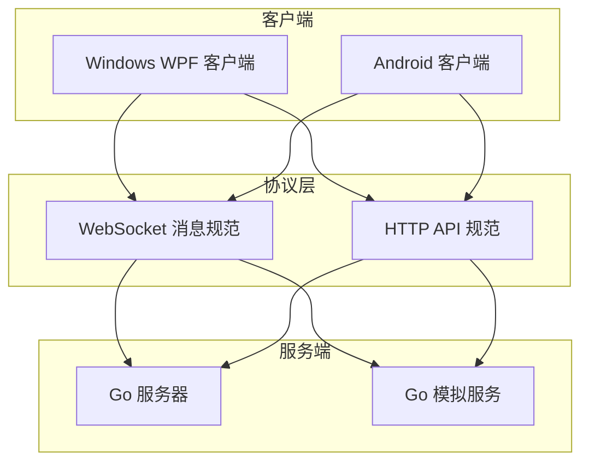
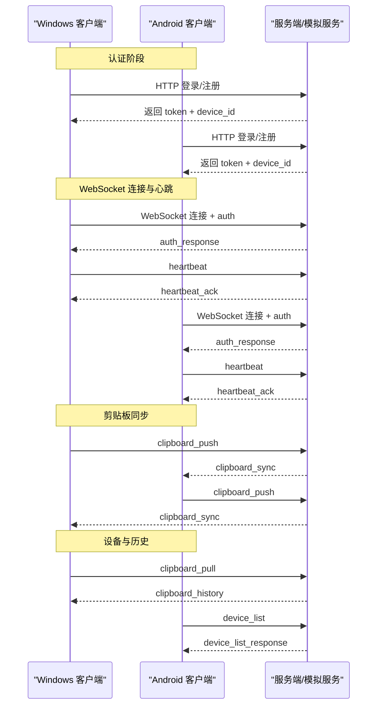
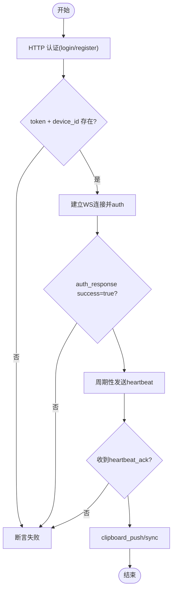
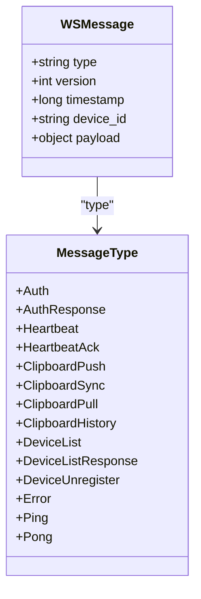
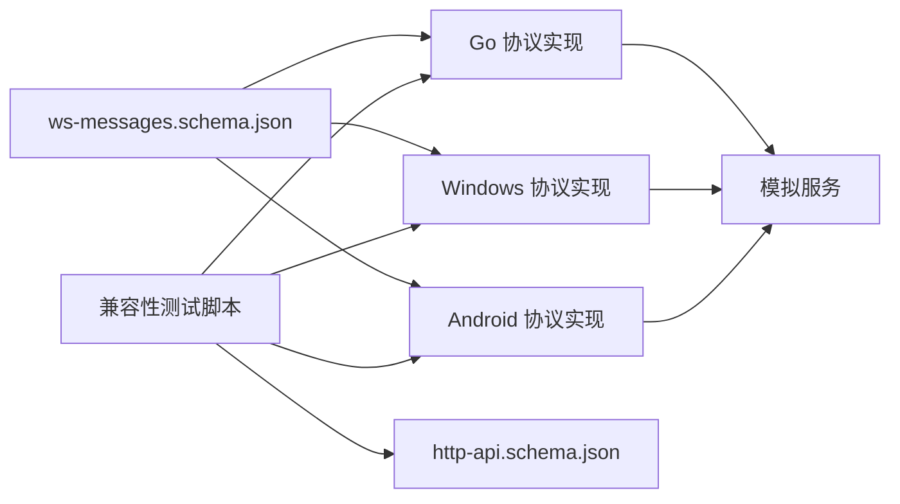

# 集成测试

<cite>
**本文引用的文件**
- [DEVELOPMENT_PLAN.md](file://DEVELOPMENT_PLAN.md)
- [http-api.schema.json](file://protocol/http-api.schema.json)
- [ws-messages.schema.json](file://protocol/ws-messages.schema.json)
- [test-protocol-compatibility.ps1](file://scripts/test-protocol-compatibility.ps1)
- [mock_server.go](file://clipSync-server/scripts/mock_server.go)
- [messages.go](file://clipSync-server/pkg/protocol/messages.go)
- [Protocol.cs](file://clipSync-windows/ClipSync.WPF/Network/Protocol.cs)
- [Protocol.kt](file://clipSync-android/app/src/main/java/com/clipsync/app/network/Protocol.kt)
</cite>

## 目录
1. [引言](#引言)
2. [项目结构](#项目结构)
3. [核心组件](#核心组件)
4. [架构总览](#架构总览)
5. [详细组件分析](#详细组件分析)
6. [依赖关系分析](#依赖关系分析)
7. [性能考量](#性能考量)
8. [故障排查指南](#故障排查指南)
9. [结论](#结论)
10. [附录](#附录)

## 引言
本文件面向ClipSync跨平台集成测试，聚焦客户端-服务端通信、数据库集成、网络连接与设备同步的端到端验证。文档基于仓库中协议规范、脚本化兼容性测试与模拟服务，给出可落地的测试环境搭建、测试数据准备、测试场景设计、执行流程、断言策略与错误处理机制，并针对网络延迟、并发冲突、数据一致性等常见问题提供解决方案。

## 项目结构
- 协议层：统一定义WebSocket消息与HTTP API契约，确保三端一致。
- 服务端：Go实现的HTTP API与WebSocket Hub，提供认证、设备管理、剪贴板历史与广播。
- 客户端：Windows WPF与Android应用，分别通过各自的网络层与协议层对接服务端。
- 测试工具：PowerShell兼容性测试脚本、Go模拟服务，支持延迟与错误注入。

**图表来源**
- [DEVELOPMENT_PLAN.md](file://DEVELOPMENT_PLAN.md)
- [ws-messages.schema.json](file://protocol/ws-messages.schema.json)
- [http-api.schema.json](file://protocol/http-api.schema.json)
- [mock_server.go](file://clipSync-server/scripts/mock_server.go)

**章节来源**
- [DEVELOPMENT_PLAN.md](file://DEVELOPMENT_PLAN.md)

## 核心组件
- 协议规范（WebSocket与HTTP）：定义消息类型、字段命名、版本号、错误码与API路径，作为三端一致性基准。
- 模拟服务：提供无数据库的本地开发/测试环境，支持心跳、设备列表、剪贴板广播、可配置延迟与错误注入。
- 兼容性测试脚本：扫描三端源码，验证消息类型、字段命名、HTTP端点、协议版本、心跳配置、加密支持与错误码一致性，并对健康检查与登录接口进行连通性验证。

**章节来源**
- [ws-messages.schema.json](file://protocol/ws-messages.schema.json)
- [http-api.schema.json](file://protocol/http-api.schema.json)
- [test-protocol-compatibility.ps1](file://scripts/test-protocol-compatibility.ps1)
- [mock_server.go](file://clipSync-server/scripts/mock_server.go)

## 架构总览
下图展示一次典型集成测试的端到端流程：客户端通过HTTP完成认证，随后建立WebSocket连接并进行心跳、剪贴板推送与拉取、设备列表查询等交互；服务端在内存中维护连接状态并广播消息，模拟服务可注入延迟与错误以验证健壮性。

**图表来源**
- [DEVELOPMENT_PLAN.md](file://DEVELOPMENT_PLAN.md)
- [mock_server.go](file://clipSync-server/scripts/mock_server.go)
- [messages.go](file://clipSync-server/pkg/protocol/messages.go)
- [Protocol.cs](file://clipSync-windows/ClipSync.WPF/Network/Protocol.cs)
- [Protocol.kt](file://clipSync-android/app/src/main/java/com/clipsync/app/network/Protocol.kt)

## 详细组件分析

### 测试环境搭建
- 启动模拟服务：使用Go脚本启动HTTP(8081)与WebSocket(8080)服务，支持延迟与错误率参数，便于复现弱网与异常场景。
- 三端编译与运行：分别构建Windows与Android客户端，确保其网络层与协议层实现与协议规范一致。
- 端到端连通性验证：先用PowerShell脚本验证健康检查与登录接口可用性，再进行WS连接与消息收发。

**章节来源**
- [mock_server.go](file://clipSync-server/scripts/mock_server.go)
- [test-protocol-compatibility.ps1](file://scripts/test-protocol-compatibility.ps1)

### 测试数据准备
- 使用协议规范生成标准化的消息体与HTTP请求体，确保字段命名（snake_case）与类型一致。
- 可参考模拟服务内置的设备列表与剪贴板历史样例，构造多设备在线/离线与不同内容类型的剪贴板项。
- 对于大文件场景，可结合HTTP上传/下载接口准备二进制数据与校验和。

**章节来源**
- [ws-messages.schema.json](file://protocol/ws-messages.schema.json)
- [http-api.schema.json](file://protocol/http-api.schema.json)
- [mock_server.go](file://clipSync-server/scripts/mock_server.go)

### 测试场景设计
- 协议兼容性：覆盖所有消息类型、字段命名、协议版本、心跳间隔、加密支持与错误码。
- HTTP API集成：登录/注册/刷新、设备列表、健康检查、上传/下载。
- WebSocket连接：连接、鉴权、心跳、自动重连、广播同步、设备列表查询。
- 设备同步：文本与图片双向同步、去重（基于checksum）、历史拉取与分页。
- 网络鲁棒性：弱网（延迟）、抖动、偶发错误注入、服务重启后的重连与状态恢复。

**章节来源**
- [test-protocol-compatibility.ps1](file://scripts/test-protocol-compatibility.ps1)
- [DEVELOPMENT_PLAN.md](file://DEVELOPMENT_PLAN.md)

### 客户端-服务器端通信测试
- 断言策略
  - HTTP：状态码与响应体字段存在性与类型匹配（参考HTTP API规范）。
  - WebSocket：消息类型正确、版本号为1、时间戳合理、payload字段齐全。
- 错误处理
  - 无效载荷、鉴权失败、速率限制、内容过大、重复内容等错误码应被正确返回与解析。
- 执行流程
  - 先HTTP认证获取token，再用token进行WS鉴权；随后发送心跳与业务消息并验证回执。

**图表来源**
- [http-api.schema.json](file://protocol/http-api.schema.json)
- [ws-messages.schema.json](file://protocol/ws-messages.schema.json)
- [mock_server.go](file://clipSync-server/scripts/mock_server.go)

**章节来源**
- [http-api.schema.json](file://protocol/http-api.schema.json)
- [ws-messages.schema.json](file://protocol/ws-messages.schema.json)
- [mock_server.go](file://clipSync-server/scripts/mock_server.go)

### 数据库集成测试
- 由于模拟服务为内存态且无需数据库，建议在真实服务端环境下进行数据库相关测试，重点验证：
  - 剪贴板历史持久化与去重（基于checksum）。
  - 设备注册与注销、设备列表查询。
  - 文件上传后元信息与下载可用性。
- 断言策略
  - 查询结果字段与协议一致；去重逻辑生效；设备状态更新及时。

**章节来源**
- [DEVELOPMENT_PLAN.md](file://DEVELOPMENT_PLAN.md)

### 网络连接测试
- 心跳与保活：30秒心跳间隔，服务端ack回传；客户端需在超时前持续发送。
- 自动重连：断开后重连成功，状态恢复（设备列表、历史游标等）。
- 弱网与异常：模拟延迟与错误率，验证客户端退避与重试策略是否生效。

**章节来源**
- [DEVELOPMENT_PLAN.md](file://DEVELOPMENT_PLAN.md)
- [mock_server.go](file://clipSync-server/scripts/mock_server.go)

### WebSocket连接测试
- 消息序列化/反序列化：三端实现必须与协议规范完全一致（字段名、枚举值、嵌套结构）。
- 广播与去重：服务端对同一内容仅广播一次；客户端去重策略有效。
- 错误消息：服务端返回error消息时，客户端应能解析并提示用户或触发重连。

**图表来源**
- [messages.go](file://clipSync-server/pkg/protocol/messages.go)
- [Protocol.cs](file://clipSync-windows/ClipSync.WPF/Network/Protocol.cs)
- [Protocol.kt](file://clipSync-android/app/src/main/java/com/clipsync/app/network/Protocol.kt)

**章节来源**
- [messages.go](file://clipSync-server/pkg/protocol/messages.go)
- [Protocol.cs](file://clipSync-windows/ClipSync.WPF/Network/Protocol.cs)
- [Protocol.kt](file://clipSync-android/app/src/main/java/com/clipsync/app/network/Protocol.kt)

### HTTP API集成测试
- 覆盖端点：登录、注册、刷新、健康检查、设备列表、上传、下载。
- 断言：状态码、响应体字段、错误码映射。
- 场景：正常流程、缺失参数、非法凭证、文件过大、设备不存在等。

**章节来源**
- [http-api.schema.json](file://protocol/http-api.schema.json)
- [test-protocol-compatibility.ps1](file://scripts/test-protocol-compatibility.ps1)

### 设备同步测试
- 双向同步：Windows与Android互为源与目标，验证文本与图片均能同步。
- 去重策略：相同checksum的内容不应重复广播或入库。
- 历史拉取：limit与after_id参数生效，has_more与total正确。

**章节来源**
- [DEVELOPMENT_PLAN.md](file://DEVELOPMENT_PLAN.md)
- [mock_server.go](file://clipSync-server/scripts/mock_server.go)

## 依赖关系分析
- 协议规范是三端的“单一事实来源”，所有实现必须与之保持一致。
- 模拟服务依赖标准库与gorilla/websocket，不依赖外部数据库，适合快速集成测试。
- 兼容性测试脚本扫描三端源码与协议规范，形成跨语言一致性报告。

**图表来源**
- [ws-messages.schema.json](file://protocol/ws-messages.schema.json)
- [http-api.schema.json](file://protocol/http-api.schema.json)
- [messages.go](file://clipSync-server/pkg/protocol/messages.go)
- [Protocol.cs](file://clipSync-windows/ClipSync.WPF/Network/Protocol.cs)
- [Protocol.kt](file://clipSync-android/app/src/main/java/com/clipsync/app/network/Protocol.kt)
- [test-protocol-compatibility.ps1](file://scripts/test-protocol-compatibility.ps1)

**章节来源**
- [ws-messages.schema.json](file://protocol/ws-messages.schema.json)
- [http-api.schema.json](file://protocol/http-api.schema.json)
- [test-protocol-compatibility.ps1](file://scripts/test-protocol-compatibility.ps1)

## 性能考量
- 心跳频率与批处理：避免频繁小包，合并短消息以降低带宽与CPU消耗。
- 历史容量控制：服务端与客户端均应限制历史条目数量，防止内存膨胀。
- 大文件传输：优先使用HTTP上传/下载，WebSocket仅传递引用与校验和。
- 并发写入：服务端广播需加锁保护共享状态，避免竞态。

## 故障排查指南
- 连接失败
  - 检查端口占用与防火墙；确认服务地址与端口配置；使用健康检查端点验证可达性。
- 鉴权失败
  - 校验HTTP请求体字段与Authorization头格式；确认token未过期。
- 心跳中断
  - 检查客户端定时器与网络稳定性；服务端是否正确回ack。
- 同步不一致
  - 核对checksum计算与去重逻辑；确认服务端广播链路无丢包。
- 错误码不一致
  - 对照协议规范中的错误码映射，修正任一端实现。

**章节来源**
- [http-api.schema.json](file://protocol/http-api.schema.json)
- [ws-messages.schema.json](file://protocol/ws-messages.schema.json)
- [test-protocol-compatibility.ps1](file://scripts/test-protocol-compatibility.ps1)

## 结论
通过协议规范驱动的三端一致性验证、模拟服务提供的可控网络环境与脚本化的兼容性测试，ClipSync能够在早期发现跨平台集成问题，显著降低联调成本。建议在持续集成流水线中加入上述测试步骤，配合弱网与异常注入，确保系统在复杂场景下的稳定性与一致性。

## 附录
- 测试执行清单
  - 启动模拟服务并设置延迟/错误率
  - 运行兼容性测试脚本，确认消息类型、字段命名、HTTP端点、协议版本、心跳与加密支持
  - 分别在Windows与Android上完成HTTP认证与WS鉴权
  - 验证心跳、剪贴板推送/同步、设备列表与历史拉取
  - 注入弱网与错误，验证自动重连与错误处理
- 关键断言清单
  - HTTP：状态码、success字段、token与device_id、错误码映射
  - WebSocket：type/version/timestamp/payload、auth_response、heartbeat_ack、clipboard_sync、device_list_response
  - 数据一致性：checksum去重、历史总数与分页、设备在线状态