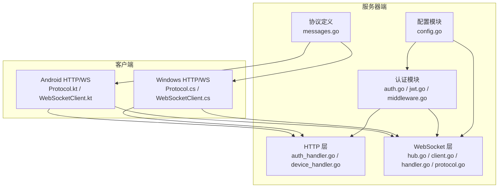
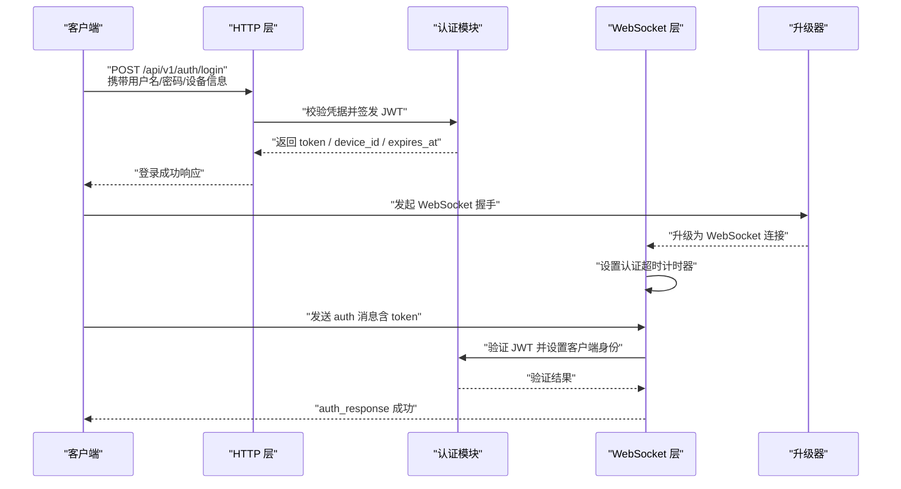
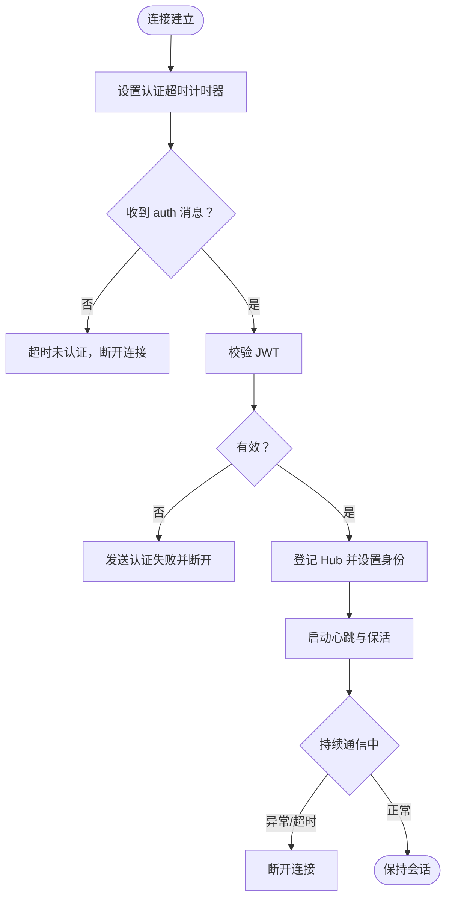
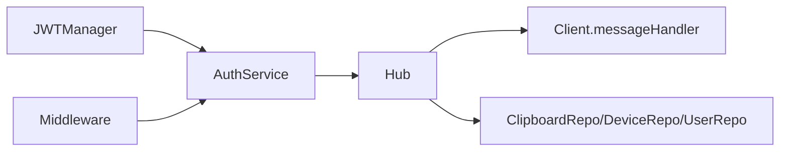

# 安全威胁模型

<cite>
**本文引用的文件**
- [clipSync-server 内部认证模块 auth.go](file://clipSync-server/internal/auth/auth.go)
- [clipSync-server 内部认证模块 jwt.go](file://clipSync-server/internal/auth/jwt.go)
- [clipSync-server HTTP 中间件 middleware.go](file://clipSync-server/internal/auth/middleware.go)
- [clipSync-server HTTP 认证处理器 auth_handler.go](file://clipSync-server/internal/httpserver/auth_handler.go)
- [clipSync-server 设备管理处理器 device_handler.go](file://clipSync-server/internal/httpserver/device_handler.go)
- [clipSync-server WebSocket Hub 实现 hub.go](file://clipSync-server/internal/websocket/hub.go)
- [clipSync-server WebSocket 客户端实现 client.go](file://clipSync-server/internal/websocket/client.go)
- [clipSync-server WebSocket 协议与升级器 protocol.go](file://clipSync-server/internal/websocket/protocol.go)
- [clipSync-server WebSocket 消息处理 handler.go](file://clipSync-server/internal/websocket/handler.go)
- [clipSync-server 配置加载 config.go](file://clipSync-server/internal/config/config.go)
- [clipSync-server 协议定义 messages.go](file://clipSync-server/pkg/protocol/messages.go)
- [clipSync-android 协议定义 Protocol.kt](file://clipSync-android/app/src/main/java/com/clipsync/app/network/Protocol.kt)
- [clipSync-android WebSocket 客户端 WebSocketClient.kt](file://clipSync-android/app/src/main/java/com/clipsync/app/network/WebSocketClient.kt)
- [clipSync-windows 协议定义 Protocol.cs](file://clipSync-windows/ClipSync.WPF/Network/Protocol.cs)
- [clipSync-windows WebSocket 客户端 WebSocketClient.cs](file://clipSync-windows/ClipSync.WPF/Network/WebSocketClient.cs)
</cite>

## 目录
1. [引言](#引言)
2. [项目结构](#项目结构)
3. [核心组件](#核心组件)
4. [架构总览](#架构总览)
5. [详细组件分析](#详细组件分析)
6. [依赖分析](#依赖分析)
7. [性能考量](#性能考量)
8. [故障排查指南](#故障排查指南)
9. [结论](#结论)
10. [附录](#附录)

## 引言
本文件针对 ClipSync 的安全威胁模型进行系统化梳理，覆盖服务器端与多端客户端在传输层、认证层、会话层与数据层可能面临的典型威胁，如中间人攻击、重放攻击、令牌劫持、连接劫持与异常行为等，并给出针对性的防护建议与响应流程。文档同时对 WebSocket 连接的安全考虑（握手验证、消息完整性、连接劫持防护）与服务器端的访问控制、速率限制、白名单策略与异常检测提出可落地的实践建议。

## 项目结构
ClipSync 采用前后端分离的分层架构：Go 编写的服务器负责认证、设备管理、剪贴板同步与 WebSocket 管理；Android 与 Windows 客户端通过 HTTP 与 WebSocket 与服务端交互。协议定义位于统一的协议包中，确保跨平台一致性。

**图表来源**
- [clipSync-server 内部认证模块 auth.go:1-137](file://clipSync-server/internal/auth/auth.go#L1-L137)
- [clipSync-server HTTP 认证处理器 auth_handler.go:1-215](file://clipSync-server/internal/httpserver/auth_handler.go#L1-L215)
- [clipSync-server 设备管理处理器 device_handler.go:1-137](file://clipSync-server/internal/httpserver/device_handler.go#L1-L137)
- [clipSync-server WebSocket Hub 实现 hub.go:1-230](file://clipSync-server/internal/websocket/hub.go#L1-L230)
- [clipSync-server WebSocket 客户端实现 client.go:1-150](file://clipSync-server/internal/websocket/client.go#L1-L150)
- [clipSync-server WebSocket 协议与升级器 protocol.go:1-27](file://clipSync-server/internal/websocket/protocol.go#L1-L27)
- [clipSync-server 配置加载 config.go:1-72](file://clipSync-server/internal/config/config.go#L1-L72)
- [clipSync-server 协议定义 messages.go:1-132](file://clipSync-server/pkg/protocol/messages.go#L1-L132)
- [clipSync-android 协议定义 Protocol.kt:1-263](file://clipSync-android/app/src/main/java/com/clipsync/app/network/Protocol.kt#L1-L263)
- [clipSync-android WebSocket 客户端 WebSocketClient.kt:1-156](file://clipSync-android/app/src/main/java/com/clipsync/app/network/WebSocketClient.kt#L1-L156)
- [clipSync-windows 协议定义 Protocol.cs:1-167](file://clipSync-windows/ClipSync.WPF/Network/Protocol.cs#L1-L167)
- [clipSync-windows WebSocket 客户端 WebSocketClient.cs:1-146](file://clipSync-windows/ClipSync.WPF/Network/WebSocketClient.cs#L1-L146)

**章节来源**
- [clipSync-server 内部认证模块 auth.go:1-137](file://clipSync-server/internal/auth/auth.go#L1-L137)
- [clipSync-server HTTP 认证处理器 auth_handler.go:1-215](file://clipSync-server/internal/httpserver/auth_handler.go#L1-L215)
- [clipSync-server 设备管理处理器 device_handler.go:1-137](file://clipSync-server/internal/httpserver/device_handler.go#L1-L137)
- [clipSync-server WebSocket Hub 实现 hub.go:1-230](file://clipSync-server/internal/websocket/hub.go#L1-L230)
- [clipSync-server 配置加载 config.go:1-72](file://clipSync-server/internal/config/config.go#L1-L72)

## 核心组件
- 认证与会话
  - JWT 签发与校验：用于 HTTP 与 WebSocket 的身份凭证。
  - HTTP 中间件：统一校验 Authorization 头与 Bearer Token。
  - 登录/注册/刷新接口：提供用户凭据与令牌生命周期管理。
- WebSocket 管理
  - Hub：维护连接、心跳、广播与设备在线状态。
  - Client：读写泵、超时与错误处理、消息路由。
  - 协议与升级器：消息类型、版本、握手策略。
- 配置与安全参数
  - JWT 密钥、过期时间、心跳超时、历史条数、最大文件大小等。
- 跨平台协议
  - 统一的消息类型、负载结构与序列化约定，保证各端一致行为。

**章节来源**
- [clipSync-server 内部认证模块 jwt.go:1-76](file://clipSync-server/internal/auth/jwt.go#L1-L76)
- [clipSync-server HTTP 中间件 middleware.go:1-111](file://clipSync-server/internal/auth/middleware.go#L1-L111)
- [clipSync-server HTTP 认证处理器 auth_handler.go:1-215](file://clipSync-server/internal/httpserver/auth_handler.go#L1-L215)
- [clipSync-server WebSocket Hub 实现 hub.go:1-230](file://clipSync-server/internal/websocket/hub.go#L1-L230)
- [clipSync-server WebSocket 客户端实现 client.go:1-150](file://clipSync-server/internal/websocket/client.go#L1-L150)
- [clipSync-server 配置加载 config.go:1-72](file://clipSync-server/internal/config/config.go#L1-L72)
- [clipSync-server 协议定义 messages.go:1-132](file://clipSync-server/pkg/protocol/messages.go#L1-L132)

## 架构总览
下图展示从客户端到服务器端的关键交互路径与安全控制点，包括 HTTP 认证、WebSocket 握手与消息处理。

**图表来源**
- [clipSync-server HTTP 认证处理器 auth_handler.go:63-109](file://clipSync-server/internal/httpserver/auth_handler.go#L63-L109)
- [clipSync-server 内部认证模块 auth.go:67-116](file://clipSync-server/internal/auth/auth.go#L67-L116)
- [clipSync-server 内部认证模块 jwt.go:32-55](file://clipSync-server/internal/auth/jwt.go#L32-L55)
- [clipSync-server WebSocket 协议与升级器 protocol.go:10-27](file://clipSync-server/internal/websocket/protocol.go#L10-L27)
- [clipSync-server WebSocket Hub 实现 hub.go:181-208](file://clipSync-server/internal/websocket/hub.go#L181-L208)
- [clipSync-server WebSocket 消息处理 handler.go:33-110](file://clipSync-server/internal/websocket/handler.go#L33-L110)

## 详细组件分析

### 认证与会话安全
- JWT 签发与校验
  - 使用对称签名算法，密钥由配置注入；支持自定义过期时间。
  - 服务器端对 JWT 的签名方法、过期时间与签发者进行严格校验。
- HTTP 中间件
  - 强制要求 Authorization 头且格式为 Bearer；校验失败直接拒绝。
  - 将用户标识注入上下文，供后续处理器使用。
- 登录/注册/刷新
  - 注册/登录时对用户名与密码强度进行基础校验；刷新接口基于已有效 JWT 生成新令牌。
- WebSocket 认证
  - 客户端必须在限定时间内完成认证，否则断开；认证成功后登记 Hub 并更新设备最后在线时间。

```mermaid
classDiagram
class JWTManager {
+GenerateToken(userID, username, deviceID) (string, int64)
+ValidateToken(tokenString) *Claims
}
class Claims {
+int64 UserID
+string Username
+string DeviceID
}
class AuthService {
+Register(username, password, deviceName, platform) *LoginResult
+Login(username, password, deviceName, platform) *LoginResult
+Refresh(oldToken) (string, int64)
+ValidateWSAuth(tokenString) *Claims
}
class Middleware {
+RequireAuth(next) http.HandlerFunc
}
JWTManager --> Claims : "生成/校验"
AuthService --> JWTManager : "依赖"
Middleware --> JWTManager : "依赖"
```

**图表来源**
- [clipSync-server 内部认证模块 jwt.go:10-76](file://clipSync-server/internal/auth/jwt.go#L10-L76)
- [clipSync-server 内部认证模块 auth.go:8-137](file://clipSync-server/internal/auth/auth.go#L8-L137)
- [clipSync-server HTTP 中间件 middleware.go:22-61](file://clipSync-server/internal/auth/middleware.go#L22-L61)

**章节来源**
- [clipSync-server 内部认证模块 jwt.go:1-76](file://clipSync-server/internal/auth/jwt.go#L1-L76)
- [clipSync-server 内部认证模块 auth.go:1-137](file://clipSync-server/internal/auth/auth.go#L1-L137)
- [clipSync-server HTTP 中间件 middleware.go:1-111](file://clipSync-server/internal/auth/middleware.go#L1-L111)
- [clipSync-server HTTP 认证处理器 auth_handler.go:1-215](file://clipSync-server/internal/httpserver/auth_handler.go#L1-L215)

### WebSocket 连接安全
- 握手与升级
  - 升级器默认允许任意来源，生产环境应收紧跨域策略。
- 认证与超时
  - 客户端需在 30 秒内完成认证，否则断开；认证成功后登记 Hub。
- 心跳与保活
  - 客户端与服务器均支持心跳；服务器设置读取截止时间，超时自动断开。
- 消息处理
  - 支持多种消息类型；对未知类型返回错误；对重复内容进行去重检查。
- 连接劫持防护
  - 基于 JWT 的强身份绑定；同一设备 ID 可被强制断开；Hub 维护用户维度的在线设备集合。

**图表来源**
- [clipSync-server WebSocket Hub 实现 hub.go:181-208](file://clipSync-server/internal/websocket/hub.go#L181-L208)
- [clipSync-server WebSocket 客户端实现 client.go:33-67](file://clipSync-server/internal/websocket/client.go#L33-L67)
- [clipSync-server WebSocket 消息处理 handler.go:33-110](file://clipSync-server/internal/websocket/handler.go#L33-L110)
- [clipSync-server WebSocket 协议与升级器 protocol.go:10-18](file://clipSync-server/internal/websocket/protocol.go#L10-L18)

**章节来源**
- [clipSync-server WebSocket Hub 实现 hub.go:1-230](file://clipSync-server/internal/websocket/hub.go#L1-L230)
- [clipSync-server WebSocket 客户端实现 client.go:1-150](file://clipSync-server/internal/websocket/client.go#L1-L150)
- [clipSync-server WebSocket 消息处理 handler.go:1-392](file://clipSync-server/internal/websocket/handler.go#L1-L392)
- [clipSync-server WebSocket 协议与升级器 protocol.go:1-27](file://clipSync-server/internal/websocket/protocol.go#L1-L27)

### 服务器端安全防护机制
- 请求频率限制
  - 当前代码未内置速率限制；建议在网关或中间件层引入基于 IP/用户/设备的限流策略。
- IP 白名单
  - 当前未实现；可在反向代理或服务器入口处配置访问控制列表。
- 异常行为检测
  - 建议结合 Hub 的在线设备统计、心跳异常、重复内容提交、异常消息类型等信号构建检测规则。
- 日志与审计
  - 建议记录登录/登出、认证失败、设备断开、重复内容、异常消息类型、连接超时等事件。

**章节来源**
- [clipSync-server 设备管理处理器 device_handler.go:1-137](file://clipSync-server/internal/httpserver/device_handler.go#L1-L137)
- [clipSync-server WebSocket Hub 实现 hub.go:1-230](file://clipSync-server/internal/websocket/hub.go#L1-L230)

### 协议与跨平台一致性
- 消息类型与负载
  - 统一的消息类型常量与负载结构，确保各端解析一致。
- 序列化与容错
  - 客户端对未知字段采取宽松解析策略，提升兼容性。
- 加密与完整性
  - 客户端可对敏感内容进行本地加密；服务器侧通过校验和与去重逻辑降低重复同步风险。

**章节来源**
- [clipSync-server 协议定义 messages.go:1-132](file://clipSync-server/pkg/protocol/messages.go#L1-L132)
- [clipSync-android 协议定义 Protocol.kt:1-263](file://clipSync-android/app/src/main/java/com/clipsync/app/network/Protocol.kt#L1-L263)
- [clipSync-windows 协议定义 Protocol.cs:1-167](file://clipSync-windows/ClipSync.WPF/Network/Protocol.cs#L1-L167)

## 依赖分析
- 组件耦合
  - Hub 依赖认证服务与数据库仓库，承担连接管理与广播职责。
  - Handler 依赖协议与 Hub，负责消息路由与业务处理。
  - 中间件依赖 JWT 管理器，提供统一鉴权入口。
- 外部依赖
  - WebSocket 库、JWT 库、配置解析库等。
- 循环依赖
  - 代码结构清晰，未发现循环导入。

**图表来源**
- [clipSync-server 内部认证模块 jwt.go:1-76](file://clipSync-server/internal/auth/jwt.go#L1-L76)
- [clipSync-server 内部认证模块 auth.go:1-137](file://clipSync-server/internal/auth/auth.go#L1-L137)
- [clipSync-server WebSocket Hub 实现 hub.go:1-230](file://clipSync-server/internal/websocket/hub.go#L1-L230)
- [clipSync-server WebSocket 消息处理 handler.go:1-392](file://clipSync-server/internal/websocket/handler.go#L1-L392)
- [clipSync-server HTTP 中间件 middleware.go:1-111](file://clipSync-server/internal/auth/middleware.go#L1-L111)

**章节来源**
- [clipSync-server 内部认证模块 auth.go:1-137](file://clipSync-server/internal/auth/auth.go#L1-L137)
- [clipSync-server WebSocket Hub 实现 hub.go:1-230](file://clipSync-server/internal/websocket/hub.go#L1-L230)
- [clipSync-server HTTP 中间件 middleware.go:1-111](file://clipSync-server/internal/auth/middleware.go#L1-L111)

## 性能考量
- 连接与广播
  - Hub 使用并发 map 与读写锁保护客户端集合；广播通道缓冲区可调。
- 心跳与保活
  - 服务器定时 Ping，客户端与服务器均设置读写截止时间，避免资源泄露。
- 消息大小与去重
  - 客户端与服务器均对消息大小进行限制；服务器对重复内容进行去重检查，减少无效广播。

**章节来源**
- [clipSync-server WebSocket Hub 实现 hub.go:1-230](file://clipSync-server/internal/websocket/hub.go#L1-L230)
- [clipSync-server WebSocket 客户端实现 client.go:1-150](file://clipSync-server/internal/websocket/client.go#L1-L150)
- [clipSync-server WebSocket 消息处理 handler.go:142-234](file://clipSync-server/internal/websocket/handler.go#L142-L234)

## 故障排查指南
- 认证失败
  - 检查 Authorization 头是否为 Bearer 格式；确认 JWT 未过期；核对用户名/密码与设备信息。
- WebSocket 无法认证
  - 确认在 30 秒内发送 auth 消息；检查 token 是否有效；查看服务器日志中的认证超时提示。
- 心跳异常
  - 客户端与服务器的心跳间隔不匹配可能导致连接中断；检查 ping/pong 与读截止时间。
- 重复内容
  - 服务器对重复内容进行去重；若出现误判，检查校验和生成逻辑与存储状态。
- 设备断开
  - 服务器支持按设备 ID 断开连接；确认设备 ID 与 Hub 中登记一致。

**章节来源**
- [clipSync-server HTTP 中间件 middleware.go:32-61](file://clipSync-server/internal/auth/middleware.go#L32-L61)
- [clipSync-server WebSocket Hub 实现 hub.go:181-208](file://clipSync-server/internal/websocket/hub.go#L181-L208)
- [clipSync-server WebSocket 消息处理 handler.go:112-140](file://clipSync-server/internal/websocket/handler.go#L112-L140)
- [clipSync-server 设备管理处理器 device_handler.go:130-136](file://clipSync-server/internal/httpserver/device_handler.go#L130-L136)

## 结论
ClipSync 在认证与会话层面具备完善的 JWT 机制与统一的协议定义，WebSocket 层面实现了认证超时、心跳保活与广播机制。当前代码未内置速率限制与 IP 白名单，建议在生产环境中补充这些能力，并完善日志与异常检测体系，以应对中间人攻击、重放攻击、令牌劫持与连接劫持等威胁。

## 附录

### 安全威胁与防护对照表
- 中间人攻击（MITM）
  - 攻击向量：在客户端与服务器之间拦截或篡改通信。
  - 影响范围：凭据泄露、消息篡改、会话劫持。
  - 防护措施：仅使用受信网络；强制 HTTPS/TLS；限制 WebSocket 升级器的跨域策略；对敏感内容进行本地加密。
- 重放攻击
  - 攻击向量：截获有效消息并在后续重放。
  - 影响范围：重复同步、资源滥用。
  - 防护措施：启用去重校验（校验和）；服务器端记录已接收内容；客户端在发送前计算并携带校验和。
- 令牌劫持
  - 攻击向量：窃取 JWT 后冒充用户。
  - 影响范围：未授权访问、设备注销失效。
  - 防护措施：缩短 JWT 过期时间；使用短周期刷新；服务器端强制设备维度的唯一会话；支持设备断开。
- 连接劫持
  - 攻击向量：在 WebSocket 握手后接管连接。
  - 影响范围：消息读写、设备状态篡改。
  - 防护措施：严格的认证超时；心跳保活；服务器端对异常消息类型与异常行为进行检测与阻断。

**章节来源**
- [clipSync-server 内部认证模块 jwt.go:1-76](file://clipSync-server/internal/auth/jwt.go#L1-L76)
- [clipSync-server WebSocket Hub 实现 hub.go:1-230](file://clipSync-server/internal/websocket/hub.go#L1-L230)
- [clipSync-server WebSocket 消息处理 handler.go:142-234](file://clipSync-server/internal/websocket/handler.go#L142-L234)

### 安全审计日志与监控指标建议
- 审计日志
  - 登录/登出、认证失败、设备断开、重复内容、异常消息类型、连接超时、设备注销。
- 监控指标
  - 活跃连接数、每用户连接数、认证成功率、消息类型分布、去重命中率、心跳丢失率、异常断开率。

**章节来源**
- [clipSync-server 设备管理处理器 device_handler.go:1-137](file://clipSync-server/internal/httpserver/device_handler.go#L1-L137)
- [clipSync-server WebSocket Hub 实现 hub.go:1-230](file://clipSync-server/internal/websocket/hub.go#L1-L230)

### 安全事件响应流程与应急处置方案
- 响应流程
  - 发现异常：立即隔离受影响设备/用户；回滚可疑变更；启用紧急告警。
  - 调查取证：收集日志、抓包、复现路径；定位攻击向量与影响范围。
  - 处置措施：撤销相关令牌、断开连接、封禁 IP、修复漏洞、发布补丁。
  - 复盘总结：完善策略、加强监控与演练。
- 应急处置
  - 短期内：缩短 JWT 过期时间、收紧跨域策略、开启速率限制与异常检测。
  - 长期：引入设备指纹、动态白名单、AI 异常检测、零信任网络架构。

[本节为通用指导，无需特定文件引用]