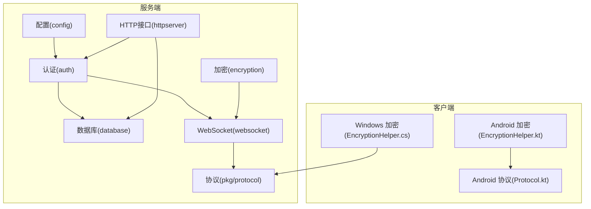
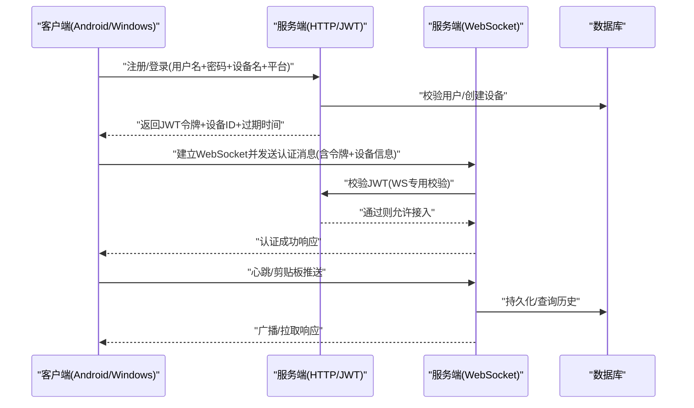
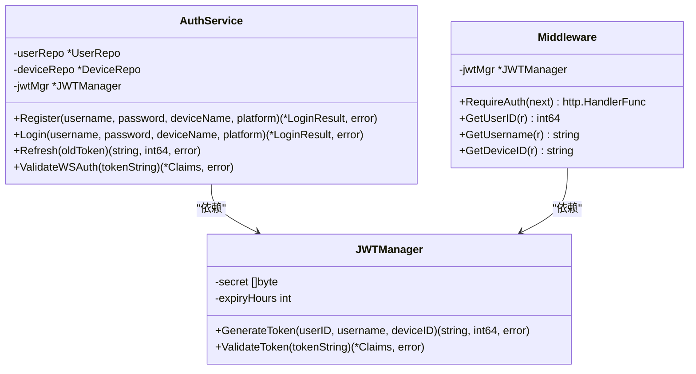
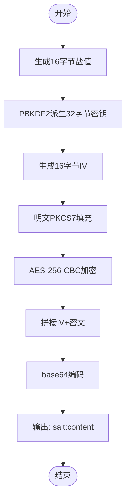
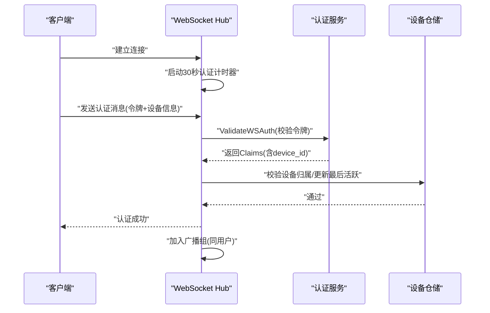
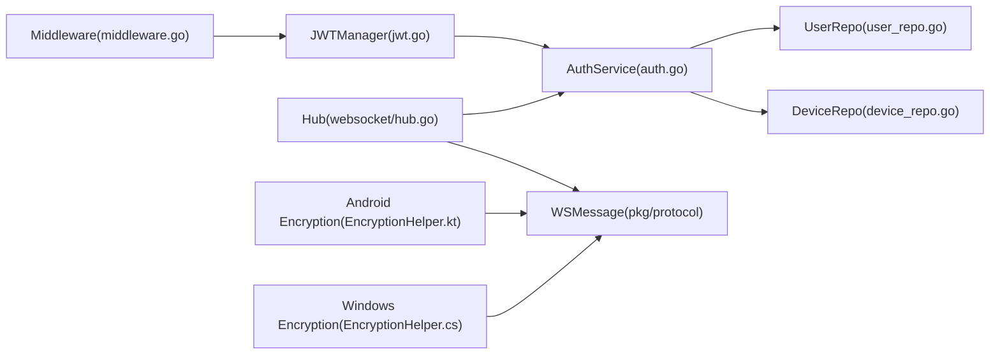

# 安全架构

<cite>
**本文引用的文件**
- [clipSync-server/internal/auth/jwt.go](file://clipSync-server/internal/auth/jwt.go)
- [clipSync-server/internal/auth/auth.go](file://clipSync-server/internal/auth/auth.go)
- [clipSync-server/internal/auth/middleware.go](file://clipSync-server/internal/auth/middleware.go)
- [clipSync-server/internal/encryption/aes.go](file://clipSync-server/internal/encryption/aes.go)
- [clipSync-server/internal/database/models.go](file://clipSync-server/internal/database/models.go)
- [clipSync-server/internal/database/device_repo.go](file://clipSync-server/internal/database/device_repo.go)
- [clipSync-server/internal/database/user_repo.go](file://clipSync-server/internal/database/user_repo.go)
- [clipSync-server/internal/websocket/protocol.go](file://clipSync-server/internal/websocket/protocol.go)
- [clipSync-server/internal/websocket/hub.go](file://clipSync-server/internal/websocket/hub.go)
- [clipSync-server/internal/websocket/client.go](file://clipSync-server/internal/websocket/client.go)
- [clipSync-server/internal/config/config.go](file://clipSync-server/internal/config/config.go)
- [clipSync-server/pkg/protocol/messages.go](file://clipSync-server/pkg/protocol/messages.go)
- [clipSync-android/app/src/main/java/com/clipsync/app/core/EncryptionHelper.kt](file://clipSync-android/app/src/main/java/com/clipsync/app/core/EncryptionHelper.kt)
- [clipSync-android/app/src/main/java/com/clipsync/app/network/Protocol.kt](file://clipSync-android/app/src/main/java/com/clipsync/app/network/Protocol.kt)
- [clipSync-windows/ClipSync.WPF/Core/EncryptionHelper.cs](file://clipSync-windows/ClipSync.WPF/Core/EncryptionHelper.cs)
</cite>

## 目录
1. [简介](#简介)
2. [项目结构](#项目结构)
3. [核心组件](#核心组件)
4. [架构总览](#架构总览)
5. [组件详细分析](#组件详细分析)
6. [依赖关系分析](#依赖关系分析)
7. [性能与安全权衡](#性能与安全权衡)
8. [故障排查指南](#故障排查指南)
9. [结论](#结论)
10. [附录：安全配置与最佳实践](#附录安全配置与最佳实践)

## 简介
本文件系统化梳理 ClipSync 的安全架构，覆盖以下方面：
- JWT 认证机制：令牌生成、验证与刷新策略
- AES-256 端到端加密：密钥派生、加解密流程与跨平台兼容性
- 设备认证、会话管理与权限控制
- 威胁模型与防护措施（中间人攻击、重放攻击等）
- 安全配置指南、最佳实践与审计/日志/异常检测建议

## 项目结构
从安全视角，项目分为服务端与多端客户端两大部分：
- 服务端（Go）：负责认证、授权、会话、消息广播、持久化与协议编解码
- 客户端（Android/Kotlin、Windows/C#）：负责本地加解密、协议编解码、网络通信与用户交互

图表来源
- [clipSync-server/internal/config/config.go:1-72](file://clipSync-server/internal/config/config.go#L1-L72)
- [clipSync-server/internal/auth/jwt.go:1-76](file://clipSync-server/internal/auth/jwt.go#L1-L76)
- [clipSync-server/internal/encryption/aes.go:1-135](file://clipSync-server/internal/encryption/aes.go#L1-L135)
- [clipSync-server/internal/database/models.go:1-46](file://clipSync-server/internal/database/models.go#L1-L46)
- [clipSync-server/internal/websocket/hub.go:1-230](file://clipSync-server/internal/websocket/hub.go#L1-L230)
- [clipSync-server/pkg/protocol/messages.go:1-132](file://clipSync-server/pkg/protocol/messages.go#L1-L132)
- [clipSync-android/app/src/main/java/com/clipsync/app/core/EncryptionHelper.kt:1-157](file://clipSync-android/app/src/main/java/com/clipsync/app/core/EncryptionHelper.kt#L1-L157)
- [clipSync-android/app/src/main/java/com/clipsync/app/network/Protocol.kt:1-263](file://clipSync-android/app/src/main/java/com/clipsync/app/network/Protocol.kt#L1-L263)
- [clipSync-windows/ClipSync.WPF/Core/EncryptionHelper.cs:1-134](file://clipSync-windows/ClipSync.WPF/Core/EncryptionHelper.cs#L1-L134)

章节来源
- [clipSync-server/internal/config/config.go:1-72](file://clipSync-server/internal/config/config.go#L1-L72)
- [clipSync-server/internal/auth/jwt.go:1-76](file://clipSync-server/internal/auth/jwt.go#L1-L76)
- [clipSync-server/internal/encryption/aes.go:1-135](file://clipSync-server/internal/encryption/aes.go#L1-L135)
- [clipSync-server/internal/database/models.go:1-46](file://clipSync-server/internal/database/models.go#L1-L46)
- [clipSync-server/internal/websocket/hub.go:1-230](file://clipSync-server/internal/websocket/hub.go#L1-L230)
- [clipSync-android/app/src/main/java/com/clipsync/app/core/EncryptionHelper.kt:1-157](file://clipSync-android/app/src/main/java/com/clipsync/app/core/EncryptionHelper.kt#L1-L157)
- [clipSync-windows/ClipSync.WPF/Core/EncryptionHelper.cs:1-134](file://clipSync-windows/ClipSync.WPF/Core/EncryptionHelper.cs#L1-L134)

## 核心组件
- JWT 管理器与认证服务：负责令牌签发、校验与刷新；结合设备维度进行会话绑定
- 中间件：统一拦截 HTTP 请求，提取并校验 Bearer 令牌，注入上下文
- 加密模块：服务端与客户端均采用 PBKDF2+AES-256-CBC+PKCS7，确保跨平台一致性
- 数据层：用户、设备、剪贴板条目模型与仓储操作
- WebSocket Hub：连接管理、心跳、广播、鉴权超时与错误处理
- 协议层：统一的消息类型、载荷结构与错误码

章节来源
- [clipSync-server/internal/auth/jwt.go:1-76](file://clipSync-server/internal/auth/jwt.go#L1-L76)
- [clipSync-server/internal/auth/auth.go:1-137](file://clipSync-server/internal/auth/auth.go#L1-L137)
- [clipSync-server/internal/auth/middleware.go:1-111](file://clipSync-server/internal/auth/middleware.go#L1-L111)
- [clipSync-server/internal/encryption/aes.go:1-135](file://clipSync-server/internal/encryption/aes.go#L1-L135)
- [clipSync-server/internal/database/models.go:1-46](file://clipSync-server/internal/database/models.go#L1-L46)
- [clipSync-server/internal/websocket/hub.go:1-230](file://clipSync-server/internal/websocket/hub.go#L1-L230)
- [clipSync-server/pkg/protocol/messages.go:1-132](file://clipSync-server/pkg/protocol/messages.go#L1-L132)

## 架构总览
下图展示服务端与客户端在认证、加密与消息同步上的整体交互。

图表来源
- [clipSync-server/internal/auth/auth.go:31-136](file://clipSync-server/internal/auth/auth.go#L31-L136)
- [clipSync-server/internal/auth/middleware.go:32-61](file://clipSync-server/internal/auth/middleware.go#L32-L61)
- [clipSync-server/internal/websocket/hub.go:181-208](file://clipSync-server/internal/websocket/hub.go#L181-L208)
- [clipSync-server/internal/database/device_repo.go:21-42](file://clipSync-server/internal/database/device_repo.go#L21-L42)

## 组件详细分析

### JWT 认证与会话管理
- 令牌结构：包含用户ID、用户名、设备ID以及标准声明（签发时间、过期时间），签发者固定为服务端标识
- 生成策略：基于配置的密钥与过期小时数生成 HS256 签名令牌
- 验证策略：严格校验签名算法与密钥，解析后检查有效性
- 刷新策略：使用有效旧令牌重新签发新令牌，不引入服务器状态
- WebSocket 鉴权：独立的 WS 校验函数用于握手阶段的令牌验证
- HTTP 中间件：要求 Authorization: Bearer 头，校验失败返回标准化错误

图表来源
- [clipSync-server/internal/auth/jwt.go:10-75](file://clipSync-server/internal/auth/jwt.go#L10-L75)
- [clipSync-server/internal/auth/auth.go:8-136](file://clipSync-server/internal/auth/auth.go#L8-L136)
- [clipSync-server/internal/auth/middleware.go:22-100](file://clipSync-server/internal/auth/middleware.go#L22-L100)

章节来源
- [clipSync-server/internal/auth/jwt.go:18-75](file://clipSync-server/internal/auth/jwt.go#L18-L75)
- [clipSync-server/internal/auth/auth.go:31-136](file://clipSync-server/internal/auth/auth.go#L31-L136)
- [clipSync-server/internal/auth/middleware.go:22-111](file://clipSync-server/internal/auth/middleware.go#L22-L111)

### AES-256 端到端加密
- 密钥派生：PBKDF2-SHA3-256（或 SHA2-256，客户端/服务端一致），迭代次数 10000，派生长度 32 字节
- 初始化向量：每次随机生成 16 字节，与密文拼接存储
- 填充：PKCS7
- 载荷格式：base64(salt):base64(IV + ciphertext)，保证跨平台一致性
- 客户端实现：Android 与 Windows 均遵循相同格式与参数，服务端亦可互操作

图表来源
- [clipSync-server/internal/encryption/aes.go:22-58](file://clipSync-server/internal/encryption/aes.go#L22-L58)
- [clipSync-android/app/src/main/java/com/clipsync/app/core/EncryptionHelper.kt:51-102](file://clipSync-android/app/src/main/java/com/clipsync/app/core/EncryptionHelper.kt#L51-L102)
- [clipSync-windows/ClipSync.WPF/Core/EncryptionHelper.cs:30-55](file://clipSync-windows/ClipSync.WPF/Core/EncryptionHelper.cs#L30-L55)

章节来源
- [clipSync-server/internal/encryption/aes.go:22-134](file://clipSync-server/internal/encryption/aes.go#L22-L134)
- [clipSync-android/app/src/main/java/com/clipsync/app/core/EncryptionHelper.kt:13-102](file://clipSync-android/app/src/main/java/com/clipsync/app/core/EncryptionHelper.kt#L13-L102)
- [clipSync-windows/ClipSync.WPF/Core/EncryptionHelper.cs:18-103](file://clipSync-windows/ClipSync.WPF/Core/EncryptionHelper.cs#L18-L103)

### 设备认证、会话与权限控制
- 设备注册：首次登录或未匹配到同名/平台设备时创建设备记录，并更新“最近活跃”
- 设备归属：仓储提供所有权校验，避免越权访问
- 会话边界：JWT 包含 device_id，服务端据此区分会话与广播范围
- WebSocket 连接：30 秒内必须完成认证，否则断开；心跳超时按配置控制
- 权限控制：同一用户下的设备可见在线状态与历史；广播仅对同用户生效

图表来源
- [clipSync-server/internal/websocket/hub.go:181-208](file://clipSync-server/internal/websocket/hub.go#L181-L208)
- [clipSync-server/internal/auth/auth.go:67-116](file://clipSync-server/internal/auth/auth.go#L67-L116)
- [clipSync-server/internal/database/device_repo.go:82-119](file://clipSync-server/internal/database/device_repo.go#L82-L119)

章节来源
- [clipSync-server/internal/websocket/hub.go:18-153](file://clipSync-server/internal/websocket/hub.go#L18-L153)
- [clipSync-server/internal/auth/auth.go:67-116](file://clipSync-server/internal/auth/auth.go#L67-L116)
- [clipSync-server/internal/database/device_repo.go:21-119](file://clipSync-server/internal/database/device_repo.go#L21-L119)

### 协议与错误处理
- 消息类型：认证、心跳、剪贴板推送/同步/拉取、设备列表、错误等
- 错误码：标准化错误码，便于客户端统一处理
- 心跳与超时：读写死线、Pong 处理、定时 Ping，防止僵尸连接
- 广播策略：按用户维度广播，排除发送方

章节来源
- [clipSync-server/pkg/protocol/messages.go:5-132](file://clipSync-server/pkg/protocol/messages.go#L5-L132)
- [clipSync-server/internal/websocket/client.go:33-117](file://clipSync-server/internal/websocket/client.go#L33-L117)
- [clipSync-android/app/src/main/java/com/clipsync/app/network/Protocol.kt:18-169](file://clipSync-android/app/src/main/java/com/clipsync/app/network/Protocol.kt#L18-L169)

## 依赖关系分析
- 认证服务依赖用户与设备仓储，以及 JWT 管理器
- HTTP 中间件依赖 JWT 管理器，注入用户/设备上下文
- WebSocket Hub 依赖认证服务、仓储与协议定义
- 客户端加密与协议与服务端保持格式一致，确保端到端安全

图表来源
- [clipSync-server/internal/auth/jwt.go:19-30](file://clipSync-server/internal/auth/jwt.go#L19-L30)
- [clipSync-server/internal/auth/auth.go:9-22](file://clipSync-server/internal/auth/auth.go#L9-L22)
- [clipSync-server/internal/auth/middleware.go:23-29](file://clipSync-server/internal/auth/middleware.go#L23-L29)
- [clipSync-server/internal/websocket/hub.go:19-57](file://clipSync-server/internal/websocket/hub.go#L19-L57)
- [clipSync-server/pkg/protocol/messages.go:5-132](file://clipSync-server/pkg/protocol/messages.go#L5-L132)
- [clipSync-android/app/src/main/java/com/clipsync/app/core/EncryptionHelper.kt:22-41](file://clipSync-android/app/src/main/java/com/clipsync/app/core/EncryptionHelper.kt#L22-L41)
- [clipSync-windows/ClipSync.WPF/Core/EncryptionHelper.cs:18-30](file://clipSync-windows/ClipSync.WPF/Core/EncryptionHelper.cs#L18-L30)

章节来源
- [clipSync-server/internal/auth/jwt.go:19-30](file://clipSync-server/internal/auth/jwt.go#L19-L30)
- [clipSync-server/internal/auth/auth.go:9-22](file://clipSync-server/internal/auth/auth.go#L9-L22)
- [clipSync-server/internal/auth/middleware.go:23-29](file://clipSync-server/internal/auth/middleware.go#L23-L29)
- [clipSync-server/internal/websocket/hub.go:19-57](file://clipSync-server/internal/websocket/hub.go#L19-L57)
- [clipSync-server/pkg/protocol/messages.go:5-132](file://clipSync-server/pkg/protocol/messages.go#L5-L132)
- [clipSync-android/app/src/main/java/com/clipsync/app/core/EncryptionHelper.kt:22-41](file://clipSync-android/app/src/main/java/com/clipsync/app/core/EncryptionHelper.kt#L22-L41)
- [clipSync-windows/ClipSync.WPF/Core/EncryptionHelper.cs:18-30](file://clipSync-windows/ClipSync.WPF/Core/EncryptionHelper.cs#L18-L30)

## 性能与安全权衡
- JWT 过期时间：默认 720 小时（30 天），建议根据风险评估缩短
- 心跳超时：默认 90 秒，平衡保活与资源占用
- 广播缓冲与背压：Hub 对发送队列满的客户端进行断连，避免内存膨胀
- 加密成本：PBKDF2 迭代 10000 次，兼顾安全性与性能；可按硬件能力调整

章节来源
- [clipSync-server/internal/config/config.go:24-36](file://clipSync-server/internal/config/config.go#L24-L36)
- [clipSync-server/internal/websocket/hub.go:61-112](file://clipSync-server/internal/websocket/hub.go#L61-L112)
- [clipSync-server/internal/encryption/aes.go:16-20](file://clipSync-server/internal/encryption/aes.go#L16-L20)

## 故障排查指南
- 认证失败
  - 检查 Authorization 头是否为 Bearer 格式
  - 校验 JWT 是否过期或签名算法不符
  - 确认设备是否存在且属于当前用户
- WebSocket 无法认证
  - 确认握手阶段在 30 秒内发送认证消息
  - 校验令牌是否被服务端正确校验
- 加解密异常
  - 确认加密格式为 “salt:content”，且 base64 解码无误
  - 校验盐长度与 IV 长度是否符合预期
- 心跳超时
  - 检查客户端是否定期发送心跳或接收 Pong
  - 调整心跳超时配置以适配网络环境

章节来源
- [clipSync-server/internal/auth/middleware.go:32-61](file://clipSync-server/internal/auth/middleware.go#L32-L61)
- [clipSync-server/internal/websocket/hub.go:197-208](file://clipSync-server/internal/websocket/hub.go#L197-L208)
- [clipSync-server/internal/websocket/client.go:40-45](file://clipSync-server/internal/websocket/client.go#L40-L45)
- [clipSync-server/internal/encryption/aes.go:62-106](file://clipSync-server/internal/encryption/aes.go#L62-L106)

## 结论
ClipSync 的安全设计以“端到端加密 + 强认证”为核心，服务端通过 JWT 与设备维度实现会话与权限控制，客户端在本地完成加解密，确保内容机密性。WebSocket 层提供心跳与超时保护，数据库层保障用户与设备数据完整性。建议在生产中强化配置与密钥管理，缩短令牌有效期，并启用 TLS 与更严格的跨域策略。

## 附录：安全配置与最佳实践

### 安全配置清单
- JWT 密钥与过期时间：务必替换默认密钥；令牌有效期建议不超过 30 天
- 心跳超时与历史限制：根据网络质量与业务需求调整
- 跨域策略：WebSocket 默认允许所有来源，生产需限制来源
- 文件大小与存储路径：限制最大文件大小，隔离存储目录

章节来源
- [clipSync-server/internal/config/config.go:29-35](file://clipSync-server/internal/config/config.go#L29-L35)
- [clipSync-server/internal/websocket/protocol.go:14-17](file://clipSync-server/internal/websocket/protocol.go#L14-L17)

### 最佳实践
- 传输层安全
  - 强制使用 TLS（HTTPS/WebSocket Secure）
  - 证书校验与 HSTS
- 密钥与配置
  - 使用环境变量或密钥管理服务管理 JWT 密钥
  - 不将密钥硬编码在代码或配置文件中
- 令牌策略
  - 缩短令牌有效期，配合短期刷新策略
  - 在高风险场景引入“一次性令牌”或动态挑战
- 加密与密钥材料
  - 采用用户自定义口令而非默认口令
  - 口令变更时提示用户重新加密本地历史
- 日志与审计
  - 记录认证事件（成功/失败）、设备上线/离线、异常断开
  - 保留足够上下文（用户ID、设备ID、时间戳、IP/UA）
- 异常检测
  - 监控异常登录（不同地区/设备频繁切换）
  - 检测高频请求、异常消息大小与类型
  - 对重复内容与异常序列号进行告警

### 威胁模型与缓解
- 中间人攻击（MITM）
  - 仅在 TLS 下运行；校验证书链与主机名
- 重放攻击
  - 使用短期令牌与服务器端计时器；在消息中引入时间戳与序列号
- 会话劫持
  - 严格绑定设备ID；限制并发会话数量；支持设备注销
- 明文泄露
  - 仅在客户端本地进行加解密；服务端不接触明文
- 拒绝服务
  - 限制消息大小与速率；心跳超时与背压处理