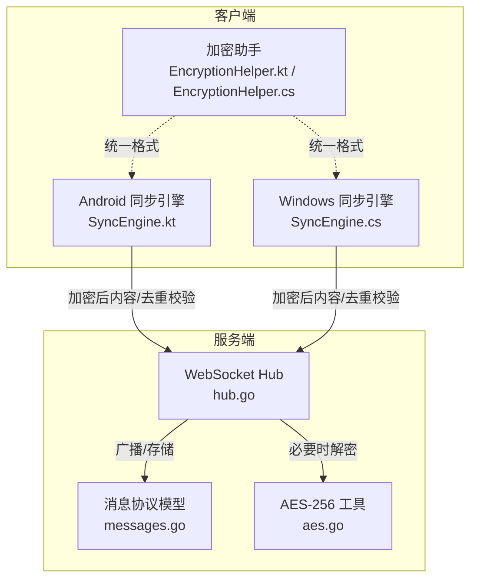
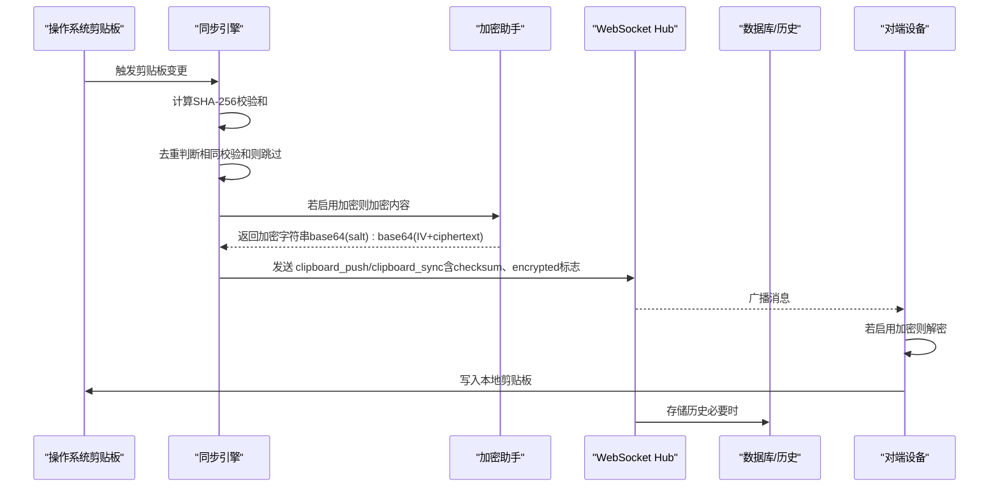
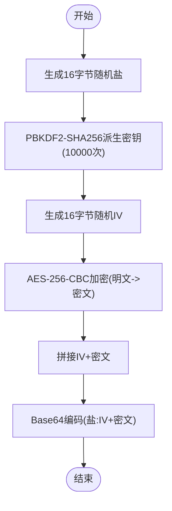
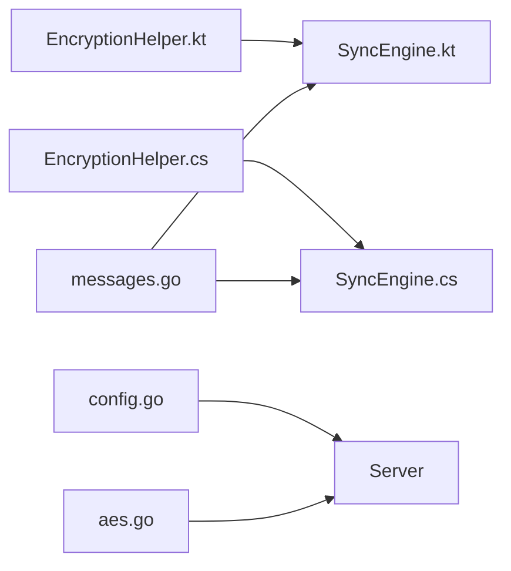

# 端到端加密

<cite>
**本文引用的文件列表**
- [EncryptionHelper.kt](file://clipSync-android/app/src/main/java/com/clipsync/app/core/EncryptionHelper.kt)
- [EncryptionHelper.cs](file://clipSync-windows/ClipSync.WPF/Core/EncryptionHelper.cs)
- [aes.go](file://clipSync-server/internal/encryption/aes.go)
- [SyncEngine.kt](file://clipSync-android/app/src/main/java/com/clipsync/app/core/SyncEngine.kt)
- [SyncEngine.cs](file://clipSync-windows/ClipSync.WPF/Core/SyncEngine.cs)
- [messages.go](file://clipSync-server/pkg/protocol/messages.go)
- [Protocol.kt](file://clipSync-android/app/src/main/java/com/clipsync/app/network/Protocol.kt)
- [SettingsManager.kt](file://clipSync-android/app/src/main/java/com/clipsync/app/core/SettingsManager.kt)
- [SettingsManager.cs](file://clipSync-windows/ClipSync.WPF/Core/SettingsManager.cs)
- [config.go](file://clipSync-server/internal/config/config.go)
- [DEVELOPMENT_PLAN.md](file://DEVELOPMENT_PLAN.md)
</cite>

## 目录
1. [简介](#简介)
2. [项目结构与职责](#项目结构与职责)
3. [核心组件](#核心组件)
4. [架构总览](#架构总览)
5. [详细组件分析](#详细组件分析)
6. [依赖关系分析](#依赖关系分析)
7. [性能考量](#性能考量)
8. [故障排查指南](#故障排查指南)
9. [结论](#结论)
10. [附录：配置参数与最佳实践](#附录配置参数与最佳实践)

## 简介
本文件针对 ClipSync 的端到端加密系统进行深入技术文档化，覆盖以下目标：
- 深入解析 AES-256-CBC 加密算法在三端（Android、Windows、Server）的实现与一致性
- 明确密钥派生、随机盐与初始化向量（IV）的使用策略
- 说明剪贴板内容在传输过程中的加密/解密流程、数据格式转换与完整性校验
- 记录跨平台加密实现的一致性保证与兼容性
- 提供加密配置参数、性能优化建议与安全最佳实践

## 项目结构与职责
- Android 客户端：负责本地剪贴板监听、消息构建、按需加密、去重与历史持久化
- Windows 客户端：负责本地剪贴板监听、消息构建、按需加密、去重与历史持久化
- 服务器：负责 WebSocket 连接管理、消息广播、历史存储与文件上传下载（可选）

图表来源
- [SyncEngine.kt:72-123](file://clipSync-android/app/src/main/java/com/clipsync/app/core/SyncEngine.kt#L72-L123)
- [SyncEngine.cs:95-125](file://clipSync-windows/ClipSync.WPF/Core/SyncEngine.cs#L95-L125)
- [EncryptionHelper.kt:51-65](file://clipSync-android/app/src/main/java/com/clipsync/app/core/EncryptionHelper.kt#L51-L65)
- [EncryptionHelper.cs:30-54](file://clipSync-windows/ClipSync.WPF/Core/EncryptionHelper.cs#L30-L54)
- [messages.go:34-53](file://clipSync-server/pkg/protocol/messages.go#L34-L53)
- [aes.go:25-57](file://clipSync-server/internal/encryption/aes.go#L25-L57)

章节来源
- [SyncEngine.kt:1-250](file://clipSync-android/app/src/main/java/com/clipsync/app/core/SyncEngine.kt#L1-L250)
- [SyncEngine.cs:1-422](file://clipSync-windows/ClipSync.WPF/Core/SyncEngine.cs#L1-L422)
- [EncryptionHelper.kt:1-157](file://clipSync-android/app/src/main/java/com/clipsync/app/core/EncryptionHelper.kt#L1-L157)
- [EncryptionHelper.cs:1-134](file://clipSync-windows/ClipSync.WPF/Core/EncryptionHelper.cs#L1-L134)
- [messages.go:1-132](file://clipSync-server/pkg/protocol/messages.go#L1-L132)
- [aes.go:1-135](file://clipSync-server/internal/encryption/aes.go#L1-L135)

## 核心组件
- 加密助手（三端一致）
  - 统一采用 AES-256-CBC，PBKDF2-SHA256 密钥派生，10000 次迭代，16 字节盐与 16 字节 IV，PKCS#7 填充
  - 输出格式：base64(salt):base64(IV + ciphertext)，确保三端互操作
- 同步引擎（两端）
  - 负责本地剪贴板变更检测、去重（基于 SHA-256 校验和）、按需加密、消息封装与发送
  - 接收来自服务器的同步消息，按需解密并写入本地剪贴板
- 协议模型（服务端）
  - 定义 clipboard_push/clipboard_sync 等消息体，支持 content_type、checksum、encrypted 等字段
- 配置与设置（两端）
  - 支持开启/关闭同步与加密，并持久化设备标识与服务器地址等

章节来源
- [EncryptionHelper.kt:13-31](file://clipSync-android/app/src/main/java/com/clipsync/app/core/EncryptionHelper.kt#L13-L31)
- [EncryptionHelper.cs:8-17](file://clipSync/windows/ClipSync.WPF/Core/EncryptionHelper.cs#L8-L17)
- [aes.go:16-20](file://clipSync-server/internal/encryption/aes.go#L16-L20)
- [SyncEngine.kt:86-104](file://clipSync-android/app/src/main/java/com/clipsync/app/core/SyncEngine.kt#L86-L104)
- [SyncEngine.cs:108-115](file://clipSync-windows/ClipSync.WPF/Core/SyncEngine.cs#L108-L115)
- [messages.go:34-53](file://clipSync-server/pkg/protocol/messages.go#L34-L53)
- [SettingsManager.kt:142-154](file://clipSync-android/app/src/main/java/com/clipsync/app/core/SettingsManager.kt#L142-L154)
- [SettingsManager.cs:34-38](file://clipSync-windows/ClipSync.WPF/Core/SettingsManager.cs#L34-L38)

## 架构总览
下图展示从剪贴板变更到远端同步再到回注本地剪贴板的完整端到端加密流程。

图表来源
- [SyncEngine.kt:86-123](file://clipSync-android/app/src/main/java/com/clipsync/app/core/SyncEngine.kt#L86-L123)
- [SyncEngine.cs:108-115](file://clipSync-windows/ClipSync.WPF/Core/SyncEngine.cs#L108-L115)
- [EncryptionHelper.kt:51-65](file://clipSync-android/app/src/main/java/com/clipsync/app/core/EncryptionHelper.kt#L51-L65)
- [EncryptionHelper.cs:30-54](file://clipSync-windows/ClipSync.WPF/Core/EncryptionHelper.cs#L30-L54)
- [messages.go:34-53](file://clipSync-server/pkg/protocol/messages.go#L34-L53)

## 详细组件分析

### 加密助手（三端一致）
- 算法与参数
  - AES-256-CBC，PBKDF2-SHA256，10000 次迭代，32 字节密钥
  - 盐与 IV：各 16 字节，均随机生成
  - 填充：PKCS#7
- 数据格式
  - 输出：base64(salt):base64(IV + ciphertext)
  - 输入：明文字符串（UTF-8），输出为统一字符串
- 校验和
  - 使用 SHA-256 计算内容校验和，用于去重与完整性提示

图表来源
- [EncryptionHelper.kt:51-65](file://clipSync-android/app/src/main/java/com/clipsync/app/core/EncryptionHelper.kt#L51-L65)
- [EncryptionHelper.cs:30-54](file://clipSync-windows/ClipSync.WPF/Core/EncryptionHelper.cs#L30-L54)
- [aes.go:25-57](file://clipSync-server/internal/encryption/aes.go#L25-L57)

章节来源
- [EncryptionHelper.kt:13-31](file://clipSync-android/app/src/main/java/com/clipsync/app/core/EncryptionHelper.kt#L13-L31)
- [EncryptionHelper.cs:8-17](file://clipSync-windows/ClipSync.WPF/Core/EncryptionHelper.cs#L8-L17)
- [aes.go:16-20](file://clipSync-server/internal/encryption/aes.go#L16-L20)

### 同步引擎（两端）
- 去重策略
  - 发送前计算 SHA-256 校验和，若与上次相同则跳过，避免重复同步
- 加密开关
  - 通过设置管理器控制是否启用加密；启用时对内容进行加密，否则直接发送
- 消息封装
  - 构造 clipboard_push/clipboard_sync 消息，包含 content_type、checksum、size 等字段
  - 对于服务端广播，可能携带 encrypted 标志位
- 解密与回注
  - 接收来自服务器的消息，若标记为加密且本地启用加密，则解密后再写入本地剪贴板

```mermaid
sequenceDiagram
participant SE as "同步引擎"
participant EH as "加密助手"
participant WS as "WebSocket"
participant DB as "本地历史"
SE->>SE : 计算SHA-256校验和
SE->>SE : 去重判断
SE->>EH : 加密(可选)
EH-->>SE : 返回加密字符串
SE->>WS : 发送clipboard_push/clipboard_sync
WS-->>SE : 接收clipboard_sync
SE->>EH : 解密(可选)
EH-->>SE : 返回明文
SE->>DB : 保存历史项
```

图表来源
- [SyncEngine.kt:86-123](file://clipSync-android/app/src/main/java/com/clipsync/app/core/SyncEngine.kt#L86-L123)
- [SyncEngine.cs:188-267](file://clipSync-windows/ClipSync.WPF/Core/SyncEngine.cs#L188-L267)

章节来源
- [SyncEngine.kt:72-160](file://clipSync-android/app/src/main/java/com/clipsync/app/core/SyncEngine.kt#L72-L160)
- [SyncEngine.cs:95-267](file://clipSync-windows/ClipSync.WPF/Core/SyncEngine.cs#L95-L267)

### 协议模型（服务端）
- clipboard_push/clipboard_sync
  - content_type：text/image/file
  - content：文本或 Base64 编码的二进制
  - format：MIME 类型或 "text/plain"
  - size：字节数
  - checksum：SHA-256 校验和
  - encrypted：是否已加密（布尔）
- 设备与历史
  - 设备列表、历史条目等通过相应消息类型传输

章节来源
- [messages.go:34-79](file://clipSync-server/pkg/protocol/messages.go#L34-L79)

### 设置与配置（两端）
- Android
  - 使用 DataStore Preferences 持久化，包含 sync_enabled、encryption_enabled 等键
- Windows
  - 使用 JSON 文件持久化，包含 encryption_enabled、encryption_password 等键
- 服务器
  - 通过 YAML 配置文件加载运行参数，如端口、JWT 密钥、历史限制等

章节来源
- [SettingsManager.kt:142-154](file://clipSync-android/app/src/main/java/com/clipsync/app/core/SettingsManager.kt#L142-L154)
- [SettingsManager.cs:34-38](file://clipSync-windows/ClipSync.WPF/Core/SettingsManager.cs#L34-L38)
- [config.go:10-36](file://clipSync-server/internal/config/config.go#L10-L36)

## 依赖关系分析
- 三端加密实现依赖相同的算法参数与数据格式，确保互操作性
- 同步引擎依赖加密助手与协议模型，同时受设置管理器影响
- 服务器端依赖加密工具（在需要时解密）与协议模型

图表来源
- [EncryptionHelper.kt:1-157](file://clipSync-android/app/src/main/java/com/clipsync/app/core/EncryptionHelper.kt#L1-L157)
- [EncryptionHelper.cs:1-134](file://clipSync-windows/ClipSync.WPF/Core/EncryptionHelper.cs#L1-L134)
- [SyncEngine.kt:1-250](file://clipSync-android/app/src/main/java/com/clipsync/app/core/SyncEngine.kt#L1-L250)
- [SyncEngine.cs:1-422](file://clipSync-windows/ClipSync.WPF/Core/SyncEngine.cs#L1-L422)
- [messages.go:1-132](file://clipSync-server/pkg/protocol/messages.go#L1-L132)
- [aes.go:1-135](file://clipSync-server/internal/encryption/aes.go#L1-L135)
- [config.go:1-72](file://clipSync-server/internal/config/config.go#L1-L72)

## 性能考量
- 加密成本
  - PBKDF2 10000 次迭代在移动端与桌面端均可接受，但频繁触发时应避免重复计算
  - 建议仅对敏感内容启用加密，非敏感文本可不加密以降低 CPU 开销
- 去重
  - 基于 SHA-256 的去重可显著减少网络流量与服务器压力
- 批处理与限流
  - 在高频率剪贴板变更场景下，可考虑合并短时间内的多次推送
- 存储与历史
  - 限制本地历史数量（例如 50 条），避免无限增长导致 IO 压力

## 故障排查指南
- 加密失败
  - 检查密码是否一致（三端必须相同）
  - 确认输入格式为 base64(salt):base64(IV + ciphertext)
  - 查看日志中关于“无效盐大小”“解码失败”“填充错误”等信息
- 去重未生效
  - 确认两端均启用了去重逻辑
  - 检查校验和计算是否正确
- 同步循环
  - 确保接收端会跳过来自自身设备的消息（echo 防止）
- 服务器广播异常
  - 检查 WebSocket Hub 的广播逻辑与客户端连接状态
- 配置问题
  - 确认服务器端 JWT 密钥与历史限制等配置合理

章节来源
- [EncryptionHelper.kt:72-102](file://clipSync-android/app/src/main/java/com/clipsync/app/core/EncryptionHelper.kt#L72-L102)
- [EncryptionHelper.cs:62-103](file://clipSync-windows/ClipSync.WPF/Core/EncryptionHelper.cs#L62-L103)
- [aes.go:62-106](file://clipSync-server/internal/encryption/aes.go#L62-L106)
- [SyncEngine.kt:136-141](file://clipSync-android/app/src/main/java/com/clipsync/app/core/SyncEngine.kt#L136-L141)
- [SyncEngine.cs:200-208](file://clipSync-windows/ClipSync.WPF/Core/SyncEngine.cs#L200-L208)

## 结论
ClipSync 的端到端加密方案通过统一的 AES-256-CBC 参数与数据格式，在 Android、Windows 与服务端之间实现了高度一致的加密能力。结合去重与可选加密策略，系统在保障隐私的同时兼顾了性能与可用性。建议在生产环境中进一步强化密钥管理与安全配置，并持续监控与优化性能表现。

## 附录：配置参数与最佳实践

### 加密参数
- 算法：AES-256-CBC
- 密钥派生：PBKDF2-SHA256，10000 次迭代，32 字节密钥
- 盐与 IV：各 16 字节，随机生成
- 填充：PKCS#7
- 输出格式：base64(salt):base64(IV + ciphertext)

章节来源
- [EncryptionHelper.kt:13-31](file://clipSync-android/app/src/main/java/com/clipsync/app/core/EncryptionHelper.kt#L13-L31)
- [EncryptionHelper.cs:8-17](file://clipSync-windows/ClipSync.WPF/Core/EncryptionHelper.cs#L8-L17)
- [aes.go:16-20](file://clipSync-server/internal/encryption/aes.go#L16-L20)

### 跨平台一致性
- 三端均采用相同的算法参数与数据格式，确保互操作
- 协议模型在服务端定义，两端严格遵循

章节来源
- [messages.go:34-53](file://clipSync-server/pkg/protocol/messages.go#L34-L53)
- [DEVELOPMENT_PLAN.md:330-348](file://DEVELOPMENT_PLAN.md#L330-L348)

### 安全最佳实践
- 密钥管理
  - 密码应在用户设置中由用户输入并妥善保存，避免硬编码
  - 建议提供“记忆密码”选项与“忘记密码”流程
- 传输安全
  - 建议使用 WSS（WebSocket Secure）与 HTTPS
- 日志与审计
  - 避免记录明文内容与密钥材料
- 错误处理
  - 解密失败时不应回退为明文显示，应提示用户并记录错误

章节来源
- [SettingsManager.kt:142-154](file://clipSync-android/app/src/main/java/com/clipsync/app/core/SettingsManager.kt#L142-L154)
- [SettingsManager.cs:34-38](file://clipSync-windows/ClipSync.WPF/Core/SettingsManager.cs#L34-L38)
- [config.go:57-71](file://clipSync-server/internal/config/config.go#L57-L71)

### 性能优化建议
- 仅对敏感内容启用加密
- 合理设置去重窗口与历史上限
- 在高并发场景下评估服务器资源与连接数限制

章节来源
- [SyncEngine.kt:86-91](file://clipSync-android/app/src/main/java/com/clipsync/app/core/SyncEngine.kt#L86-L91)
- [SyncEngine.cs:108-115](file://clipSync-windows/ClipSync.WPF/Core/SyncEngine.cs#L108-L115)
- [config.go:19-20](file://clipSync-server/internal/config/config.go#L19-L20)