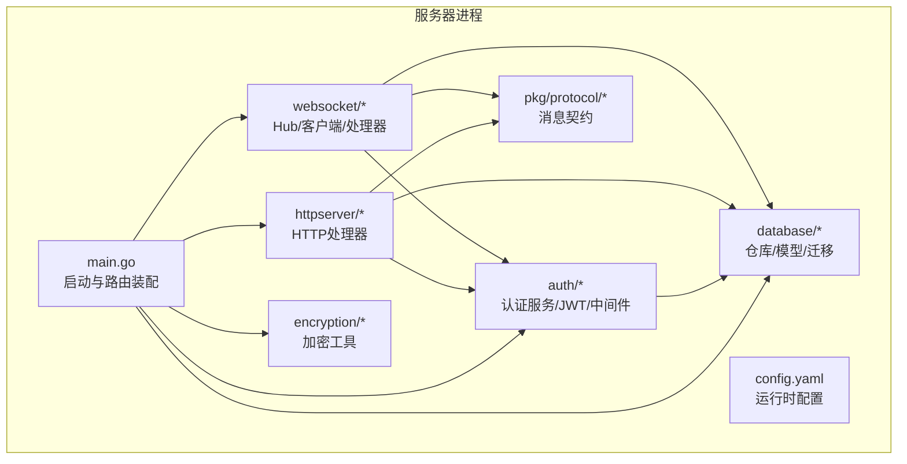
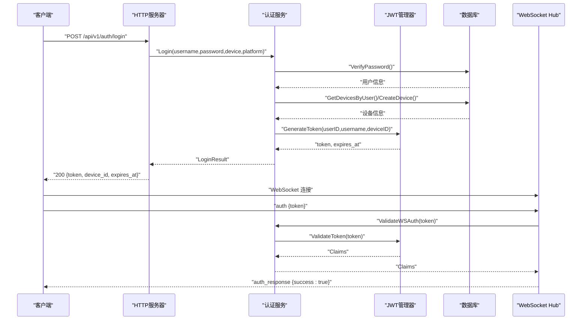
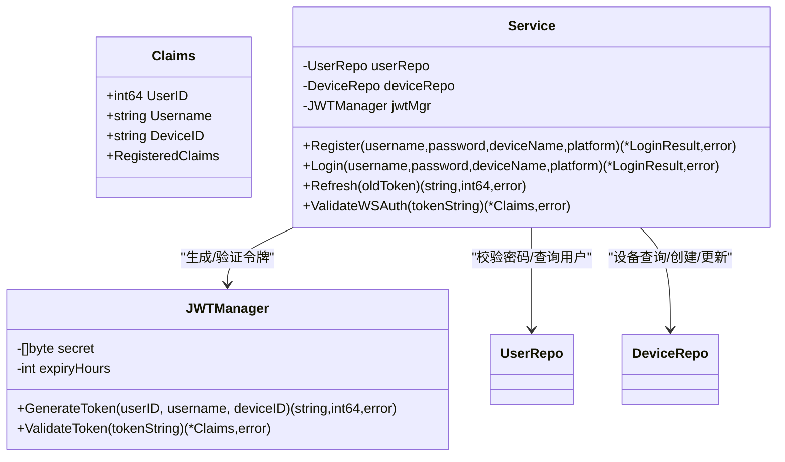
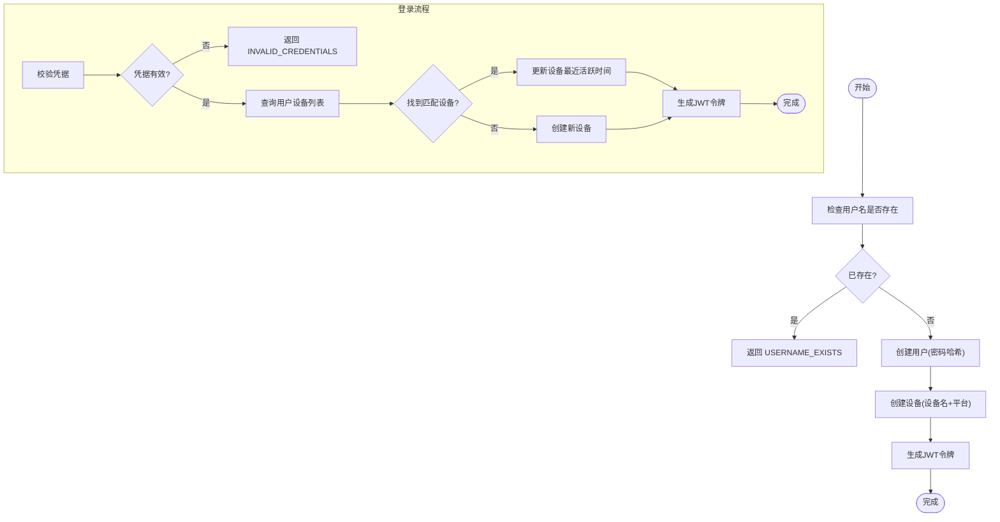
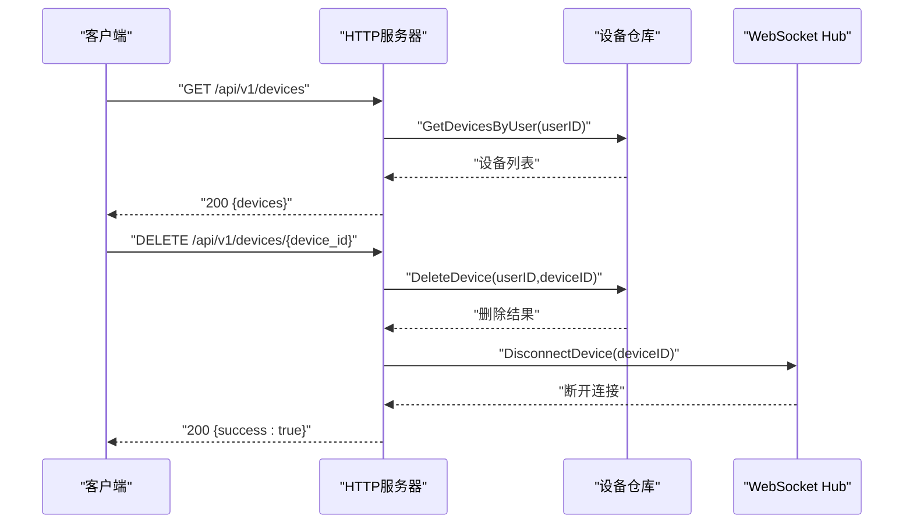
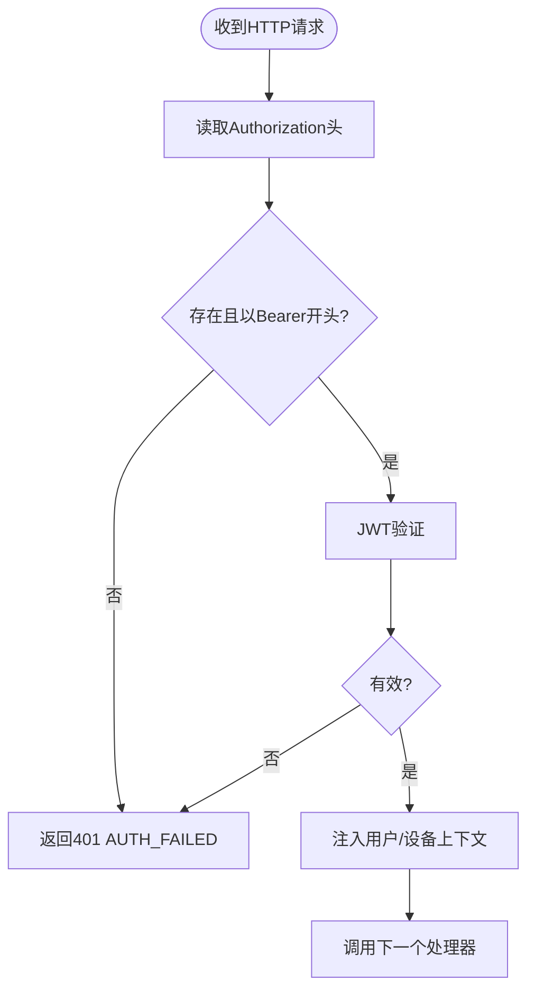
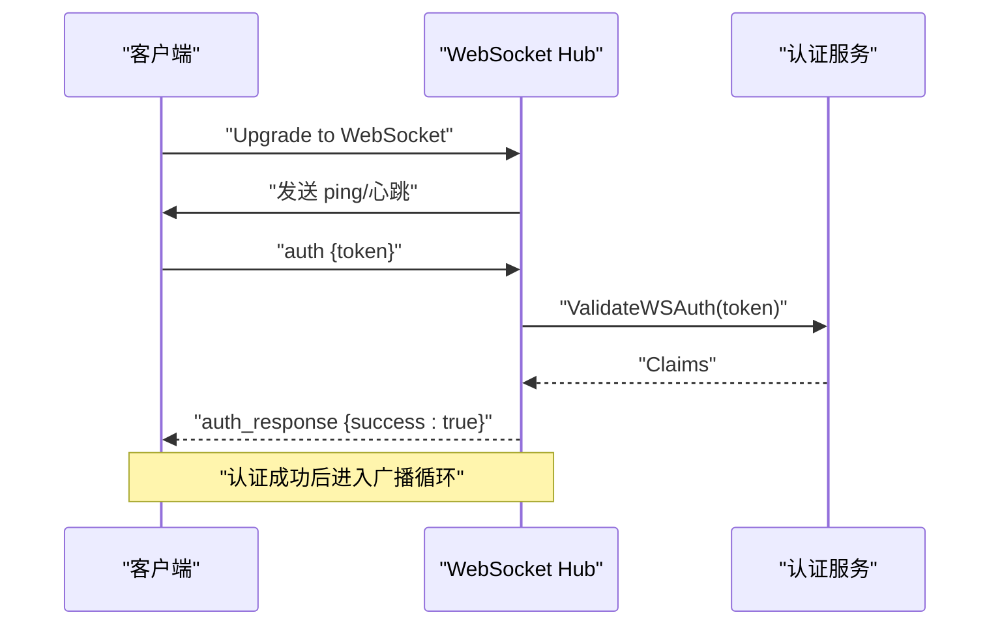
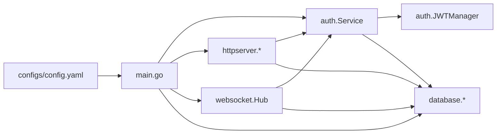
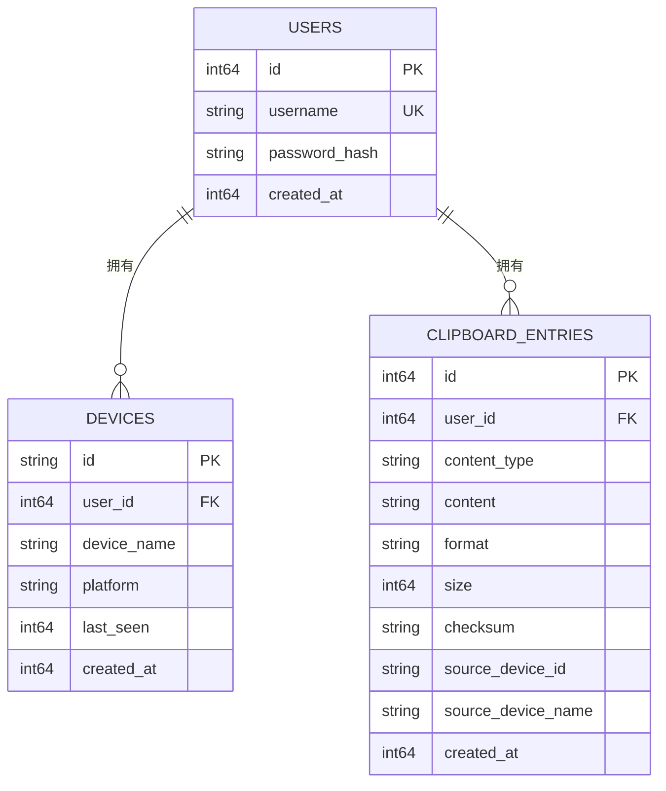

# 认证系统

<cite>
**本文引用的文件**
- [clipSync-server/internal/auth/auth.go](file://clipSync-server/internal/auth/auth.go)
- [clipSync-server/internal/auth/jwt.go](file://clipSync-server/internal/auth/jwt.go)
- [clipSync-server/internal/auth/middleware.go](file://clipSync-server/internal/auth/middleware.go)
- [clipSync-server/internal/auth/errors.go](file://clipSync-server/internal/auth/errors.go)
- [clipSync-server/internal/httpserver/auth_handler.go](file://clipSync-server/internal/httpserver/auth_handler.go)
- [clipSync-server/internal/database/models.go](file://clipSync-server/internal/database/models.go)
- [clipSync-server/internal/database/user_repo.go](file://clipSync-server/internal/database/user_repo.go)
- [clipSync-server/internal/database/device_repo.go](file://clipSync-server/internal/database/device_repo.go)
- [clipSync-server/cmd/server/main.go](file://clipSync-server/cmd/server/main.go)
- [clipSync-server/configs/config.yaml](file://clipSync-server/configs/config.yaml)
- [clipSync-server/pkg/protocol/messages.go](file://clipSync-server/pkg/protocol/messages.go)
- [clipSync-server/internal/websocket/hub.go](file://clipSync-server/internal/websocket/hub.go)
- [clipSync-server/internal/httpserver/server.go](file://clipSync-server/internal/httpserver/server.go)
- [clipSync-server/internal/httpserver/device_handler.go](file://clipSync-server/internal/httpserver/device_handler.go)
- [clipSync-server/internal/httpserver/upload_handler.go](file://clipSync-server/internal/httpserver/upload_handler.go)
- [clipSync-server/internal/httpserver/health_handler.go](file://clipSync-server/internal/httpserver/health_handler.go)
- [clipSync-server/internal/database/clipboard_repo.go](file://clipSync-server/internal/database/clipboard_repo.go)
- [clipSync-server/internal/database/migrations.go](file://clipSync-server/internal/database/migrations.go)
- [clipSync-server/internal/database/db.go](file://clipSync-server/internal/database/db.go)
- [clipSync-server/internal/encryption/aes.go](file://clipSync-server/internal/encryption/aes.go)
- [clipSync-server/internal/config/config.go](file://clipSync-server/internal/config/config.go)
- [clipSync-server/internal/websocket/client.go](file://clipSync-server/internal/websocket/client.go)
- [clipSync-server/internal/websocket/handler.go](file://clipSync-server/internal/websocket/handler.go)
- [clipSync-server/internal/websocket/protocol.go](file://clipSync-server/internal/websocket/protocol.go)
- [clipSync-server/scripts/mock_server.go](file://clipSync-server/scripts/mock_server.go)
- [DEVELOPMENT_PLAN.md](file://DEVELOPMENT_PLAN.md)
- [clipSync-android/app/src/main/java/com/clipsync/app/network/ApiClient.kt](file://clipSync-android/app/src/main/java/com/clipsync/app/network/ApiClient.kt)
- [clipSync-android/app/src/main/java/com/clipsync/app/ui/screens/LoginScreen.kt](file://clipSync-android/app/src/main/java/com/clipsync/app/ui/screens/LoginScreen.kt)
- [clipSync-windows/ClipSync.WPF/Core/SettingsManager.cs](file://clipSync-windows/ClipSync.WPF/Core/SettingsManager.cs)
- [clipSync-windows/ClipSync.WPF/UI/Views/LoginView.xaml.cs](file://clipSync-windows/ClipSync.WPF/UI/Views/LoginView.xaml.cs)
</cite>

## 目录
1. [简介](#简介)
2. [项目结构](#项目结构)
3. [核心组件](#核心组件)
4. [架构总览](#架构总览)
5. [详细组件分析](#详细组件分析)
6. [依赖分析](#依赖分析)
7. [性能考虑](#性能考虑)
8. [故障排查指南](#故障排查指南)
9. [结论](#结论)
10. [附录](#附录)

## 简介
本文件为 ClipSync 认证系统的权威技术文档，覆盖 JWT 认证机制的设计与实现、用户注册与登录流程、设备管理机制、认证中间件、配置与安全参数、以及常见问题排查。文档以代码为依据，结合协议规范与客户端实现，帮助开发者快速理解并正确集成与扩展认证能力。

## 项目结构
后端采用分层架构：入口程序负责初始化配置、数据库、路由与服务；认证子系统包含服务层、JWT 管理器与 HTTP 中间件；数据库层提供用户、设备与剪贴板数据访问；HTTP 层提供认证、设备管理、上传下载等接口；WebSocket 层负责实时连接与消息广播；协议包定义了 WebSocket 与 HTTP 的消息契约。

**图表来源**
- [clipSync-server/cmd/server/main.go:1-146](file://clipSync-server/cmd/server/main.go#L1-L146)
- [clipSync-server/internal/auth/auth.go:1-137](file://clipSync-server/internal/auth/auth.go#L1-L137)
- [clipSync-server/internal/httpserver/auth_handler.go:1-215](file://clipSync-server/internal/httpserver/auth_handler.go#L1-L215)
- [clipSync-server/internal/websocket/hub.go:1-200](file://clipSync-server/internal/websocket/hub.go#L1-L200)
- [clipSync-server/internal/database/models.go:1-46](file://clipSync-server/internal/database/models.go#L1-L46)
- [clipSync-server/pkg/protocol/messages.go:1-132](file://clipSync-server/pkg/protocol/messages.go#L1-L132)

**章节来源**
- [clipSync-server/cmd/server/main.go:1-146](file://clipSync-server/cmd/server/main.go#L1-L146)
- [DEVELOPMENT_PLAN.md:365-422](file://DEVELOPMENT_PLAN.md#L365-L422)

## 核心组件
- 认证服务 Service：封装注册、登录、刷新逻辑，协调用户仓库、设备仓库与 JWT 管理器。
- JWT 管理器 JWTManager：生成与校验 JWT，携带用户ID、用户名、设备ID与标准声明。
- 认证中间件 Middleware：拦截 HTTP 请求，解析 Authorization 头中的 Bearer Token 并注入上下文。
- 数据库仓库：UserRepo、DeviceRepo、ClipboardRepo 提供用户、设备与剪贴板数据访问。
- HTTP 处理器：AuthHandler、DeviceHandler、UploadHandler、HealthHandler 实现具体业务接口。
- WebSocket Hub：管理连接、广播消息、心跳检测与设备在线状态。
- 协议定义：统一 WebSocket 与 HTTP 的消息结构与错误码。

**章节来源**
- [clipSync-server/internal/auth/auth.go:8-137](file://clipSync-server/internal/auth/auth.go#L8-L137)
- [clipSync-server/internal/auth/jwt.go:10-76](file://clipSync-server/internal/auth/jwt.go#L10-L76)
- [clipSync-server/internal/auth/middleware.go:22-111](file://clipSync-server/internal/auth/middleware.go#L22-L111)
- [clipSync-server/internal/database/user_repo.go:11-91](file://clipSync-server/internal/database/user_repo.go#L11-L91)
- [clipSync-server/internal/database/device_repo.go:11-126](file://clipSync-server/internal/database/device_repo.go#L11-L126)
- [clipSync-server/internal/httpserver/auth_handler.go:11-215](file://clipSync-server/internal/httpserver/auth_handler.go#L11-L215)
- [clipSync-server/internal/websocket/hub.go:18-200](file://clipSync-server/internal/websocket/hub.go#L18-L200)
- [clipSync-server/pkg/protocol/messages.go:5-132](file://clipSync-server/pkg/protocol/messages.go#L5-L132)

## 架构总览
下图展示认证从客户端到服务端的关键交互路径：HTTP 登录/注册/刷新与 WebSocket 认证。

**图表来源**
- [clipSync-server/internal/httpserver/auth_handler.go:63-109](file://clipSync-server/internal/httpserver/auth_handler.go#L63-L109)
- [clipSync-server/internal/auth/auth.go:67-116](file://clipSync-server/internal/auth/auth.go#L67-L116)
- [clipSync-server/internal/auth/jwt.go:32-55](file://clipSync-server/internal/auth/jwt.go#L32-L55)
- [clipSync-server/internal/websocket/hub.go:181-200](file://clipSync-server/internal/websocket/hub.go#L181-L200)

## 详细组件分析

### JWT 认证机制
- Claims 结构：包含用户ID、用户名、设备ID与标准声明（过期时间、签发时间、发行者）。
- 令牌生成：基于 HS256 签名，设置过期时间（由配置决定），返回签名字符串与到期时间毫秒值。
- 令牌验证：校验签名方法、密钥与有效性，返回 Claims 或错误。
- 刷新策略：使用旧令牌解析出用户与设备信息，重新签发新令牌。

**图表来源**
- [clipSync-server/internal/auth/jwt.go:10-76](file://clipSync-server/internal/auth/jwt.go#L10-L76)
- [clipSync-server/internal/auth/auth.go:8-137](file://clipSync-server/internal/auth/auth.go#L8-L137)

**章节来源**
- [clipSync-server/internal/auth/jwt.go:18-76](file://clipSync-server/internal/auth/jwt.go#L18-L76)
- [clipSync-server/internal/auth/auth.go:118-136](file://clipSync-server/internal/auth/auth.go#L118-L136)

### 用户注册与登录流程
- 注册：校验用户名唯一性，创建用户（密码哈希存储），创建设备，签发令牌。
- 登录：校验凭据，查找或创建设备（按设备名与平台匹配），更新设备最近活跃时间，签发令牌。
- 凭据验证：用户名长度与字符范围校验，密码强度校验（长度、字母、数字）。
- 设备绑定：同一用户下按设备名与平台进行设备识别，若不存在则新建。

**图表来源**
- [clipSync-server/internal/auth/auth.go:31-116](file://clipSync-server/internal/auth/auth.go#L31-L116)
- [clipSync-server/internal/httpserver/auth_handler.go:29-175](file://clipSync-server/internal/httpserver/auth_handler.go#L29-L175)
- [clipSync-server/internal/database/user_repo.go:21-80](file://clipSync-server/internal/database/user_repo.go#L21-L80)
- [clipSync-server/internal/database/device_repo.go:21-90](file://clipSync-server/internal/database/device_repo.go#L21-L90)

**章节来源**
- [clipSync-server/internal/auth/auth.go:31-116](file://clipSync-server/internal/auth/auth.go#L31-L116)
- [clipSync-server/internal/httpserver/auth_handler.go:63-175](file://clipSync-server/internal/httpserver/auth_handler.go#L63-L175)
- [clipSync-server/internal/database/user_repo.go:21-80](file://clipSync-server/internal/database/user_repo.go#L21-L80)
- [clipSync-server/internal/database/device_repo.go:21-90](file://clipSync-server/internal/database/device_repo.go#L21-L90)

### 设备管理机制
- 设备注册：首次登录或未找到匹配设备时创建设备，生成唯一设备ID。
- 设备识别：通过用户ID+设备名+平台进行匹配，支持更新设备最近活跃时间。
- 设备列表：按用户列出设备，包含设备名、平台、最近活跃时间与是否在线。
- 设备注销：删除指定设备，断开其所有连接（如存在）。

**图表来源**
- [clipSync-server/internal/httpserver/device_handler.go](file://clipSync-server/internal/httpserver/device_handler.go)
- [clipSync-server/internal/database/device_repo.go:60-126](file://clipSync-server/internal/database/device_repo.go#L60-L126)
- [clipSync-server/internal/websocket/hub.go:155-179](file://clipSync-server/internal/websocket/hub.go#L155-L179)

**章节来源**
- [clipSync-server/internal/database/device_repo.go:60-126](file://clipSync-server/internal/database/device_repo.go#L60-L126)
- [clipSync-server/internal/websocket/hub.go:155-179](file://clipSync-server/internal/websocket/hub.go#L155-L179)

### 认证中间件与权限检查
- 中间件职责：从 Authorization 头提取 Bearer Token，调用 JWT 验证，失败返回 401。
- 上下文注入：成功后将用户ID、用户名、设备ID写入请求上下文，供后续处理器使用。
- 使用方式：在需要鉴权的 HTTP 路由上包裹 RequireAuth。

**图表来源**
- [clipSync-server/internal/auth/middleware.go:32-61](file://clipSync-server/internal/auth/middleware.go#L32-L61)

**章节来源**
- [clipSync-server/internal/auth/middleware.go:22-111](file://clipSync-server/internal/auth/middleware.go#L22-L111)

### WebSocket 认证与会话维护
- 连接升级：HTTP 升级为 WebSocket 后，分配客户端ID与发送通道。
- 认证超时：未在 30 秒内完成认证则断开连接。
- 在线状态：Hub 维护在线设备映射，心跳超时检测离线设备。
- 设备断连：注销设备时主动关闭对应连接。

**图表来源**
- [clipSync-server/internal/websocket/hub.go:181-200](file://clipSync-server/internal/websocket/hub.go#L181-L200)
- [clipSync-server/internal/auth/auth.go:133-136](file://clipSync-server/internal/auth/auth.go#L133-L136)

**章节来源**
- [clipSync-server/internal/websocket/hub.go:18-200](file://clipSync-server/internal/websocket/hub.go#L18-L200)
- [clipSync-server/internal/auth/auth.go:133-136](file://clipSync-server/internal/auth/auth.go#L133-L136)

### 客户端集成要点
- Android：ApiClient 封装登录、注册、刷新、设备列表与注销等 HTTP 接口，并在需要鉴权的请求中添加 Authorization 头。
- Windows：SettingsManager 持久化保存 token 与 device_id，LoginView 触发登录/注册事件。
- 协议：WebSocket auth 消息包含 token，服务端据此完成认证。

**章节来源**
- [clipSync-android/app/src/main/java/com/clipsync/app/network/ApiClient.kt:14-142](file://clipSync-android/app/src/main/java/com/clipsync/app/network/ApiClient.kt#L14-L142)
- [clipSync-android/app/src/main/java/com/clipsync/app/ui/screens/LoginScreen.kt:1-291](file://clipSync-android/app/src/main/java/com/clipsync/app/ui/screens/LoginScreen.kt#L1-L291)
- [clipSync-windows/ClipSync.WPF/Core/SettingsManager.cs:44-102](file://clipSync-windows/ClipSync.WPF/Core/SettingsManager.cs#L44-L102)
- [clipSync-windows/ClipSync.WPF/UI/Views/LoginView.xaml.cs:1-71](file://clipSync-windows/ClipSync.WPF/UI/Views/LoginView.xaml.cs#L1-L71)
- [clipSync-server/pkg/protocol/messages.go:14-26](file://clipSync-server/pkg/protocol/messages.go#L14-L26)

## 依赖分析
- 入口程序 main.go 负责加载配置、初始化数据库与迁移、构建路由、启动 HTTP 与 WebSocket 服务。
- 认证中间件依赖 JWT 管理器；HTTP 处理器依赖认证服务；WebSocket Hub 依赖认证服务与仓库。
- 数据库层通过 UserRepo、DeviceRepo、ClipboardRepo 提供数据访问；配置文件提供 JWT 密钥与过期时间等参数。

**图表来源**
- [clipSync-server/cmd/server/main.go:61-100](file://clipSync-server/cmd/server/main.go#L61-L100)
- [clipSync-server/internal/auth/auth.go:8-22](file://clipSync-server/internal/auth/auth.go#L8-L22)
- [clipSync-server/internal/auth/jwt.go:18-30](file://clipSync-server/internal/auth/jwt.go#L18-L30)
- [clipSync-server/configs/config.yaml:12-28](file://clipSync-server/configs/config.yaml#L12-L28)

**章节来源**
- [clipSync-server/cmd/server/main.go:61-100](file://clipSync-server/cmd/server/main.go#L61-L100)
- [clipSync-server/configs/config.yaml:12-28](file://clipSync-server/configs/config.yaml#L12-L28)

## 性能考虑
- JWT 过期时间：默认 30 天（可配置），建议生产环境根据风险评估调整。
- 数据库 WAL 模式：SQLite 开启 WAL 可提升并发读写性能。
- 心跳与连接：WebSocket 心跳间隔与超时可配置，避免无效连接占用资源。
- 速率限制：认证端点启用限流（每分钟每IP 10次），防止暴力破解与滥用。
- 广播与缓冲：Hub 对消息广播使用带缓冲通道，注意客户端发送队列满导致的断连处理。

[本节为通用指导，不直接分析具体文件]

## 故障排查指南
- 常见错误码
  - AUTH_FAILED：缺少或格式错误的 Authorization 头。
  - TOKEN_EXPIRED：令牌无效或已过期。
  - INVALID_CREDENTIALS：用户名或密码错误。
  - USERNAME_EXISTS：注册时用户名已被占用。
  - RATE_LIMITED：超过速率限制。
- 常见问题定位
  - 令牌无法解析：确认 JWT 密钥一致、签名算法为 HS256、未篡改令牌。
  - 登录成功但 WebSocket 认证失败：检查客户端是否携带正确的 Bearer 令牌。
  - 设备无法列出或注销失败：确认 Authorization 头中携带的 token 属于当前用户。
  - 速率限制触发：降低请求频率或调整限流配置。
- 日志与诊断
  - 服务端日志包含认证与连接状态信息，便于定位问题。
  - 可使用脚本 mock_server.go 进行端到端测试与压力验证。

**章节来源**
- [DEVELOPMENT_PLAN.md:350-362](file://DEVELOPMENT_PLAN.md#L350-L362)
- [clipSync-server/internal/auth/middleware.go:32-61](file://clipSync-server/internal/auth/middleware.go#L32-L61)
- [clipSync-server/internal/httpserver/auth_handler.go:87-108](file://clipSync-server/internal/httpserver/auth_handler.go#L87-L108)
- [clipSync-server/scripts/mock_server.go](file://clipSync-server/scripts/mock_server.go)

## 结论
ClipSync 的认证体系以 JWT 为核心，结合严格的凭据校验、设备绑定与会话维护，在 HTTP 与 WebSocket 场景下提供一致的安全保障。通过清晰的分层设计与完善的协议契约，系统具备良好的可扩展性与跨平台兼容性。建议在生产环境中妥善保管 JWT 密钥、合理设置过期时间与心跳超时，并持续监控与优化性能与安全性。

[本节为总结性内容，不直接分析具体文件]

## 附录

### 认证配置与安全参数
- 配置项
  - ws_port/http_port：WebSocket 与 HTTP 端口
  - db_path：SQLite 路径
  - jwt_secret：JWT 密钥（务必修改）
  - jwt_expiry_hours：令牌过期小时数（默认 720=30天）
  - file_storage_path/max_file_size_mb：文件上传目录与大小限制
  - clipboard_history_limit：剪贴板历史条目上限
  - heartbeat_timeout_seconds：心跳超时（秒）

**章节来源**
- [clipSync-server/configs/config.yaml:1-29](file://clipSync-server/configs/config.yaml#L1-L29)

### 数据模型概览

**图表来源**
- [clipSync-server/internal/database/models.go:3-46](file://clipSync-server/internal/database/models.go#L3-L46)