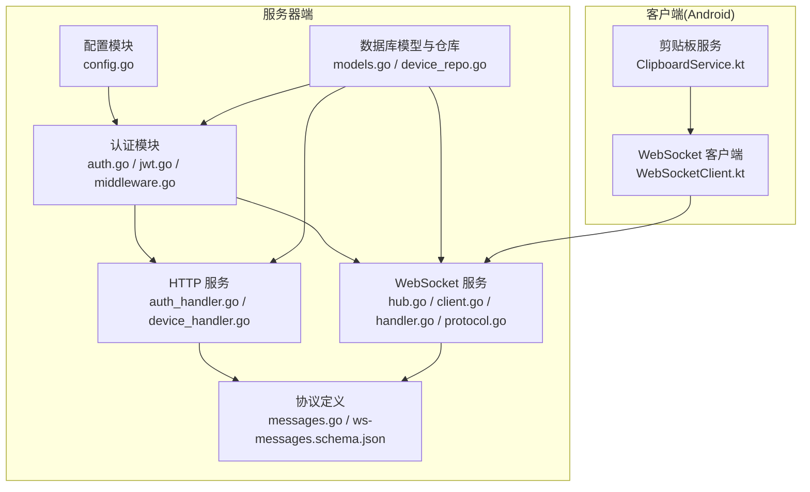
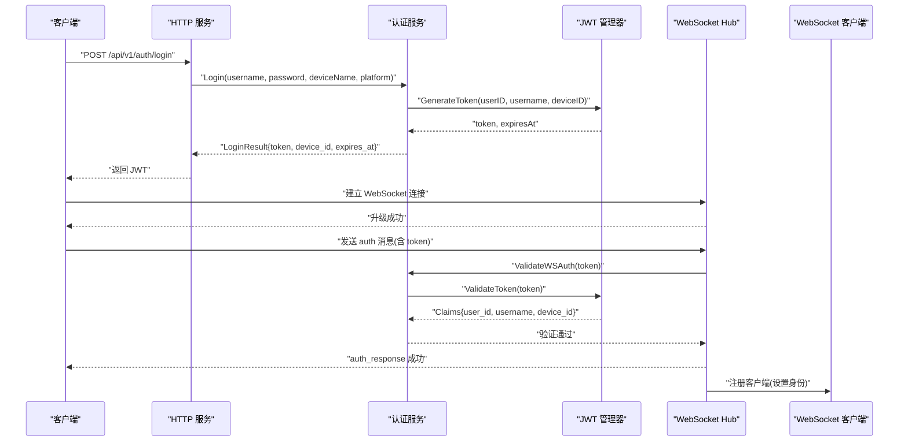
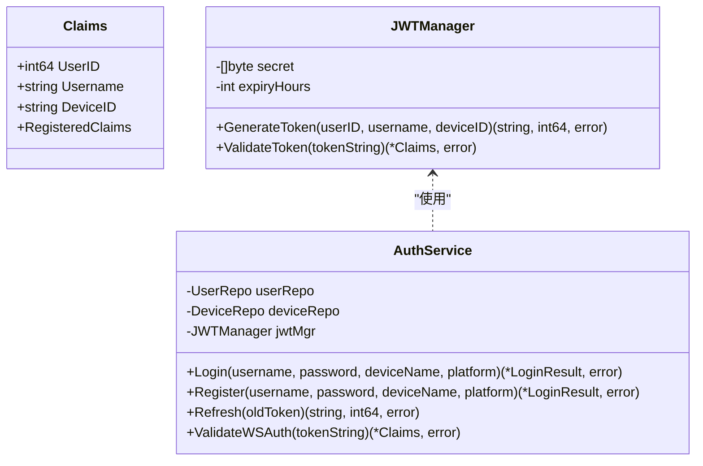
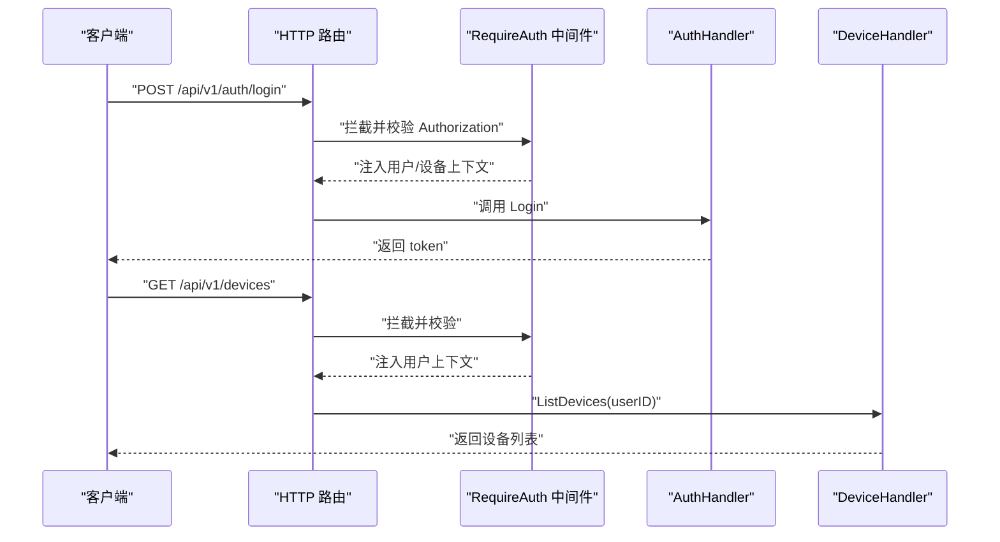
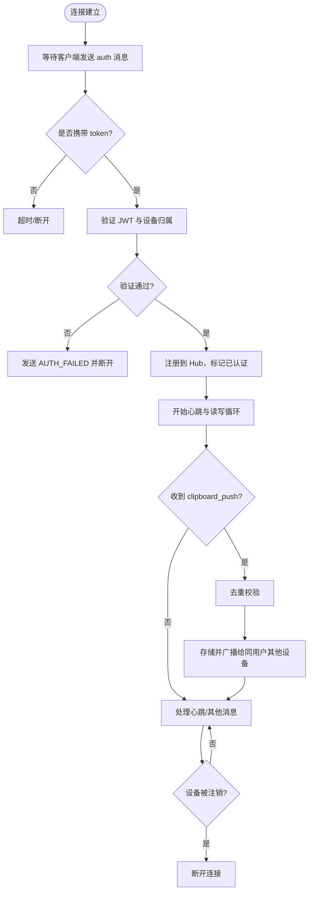
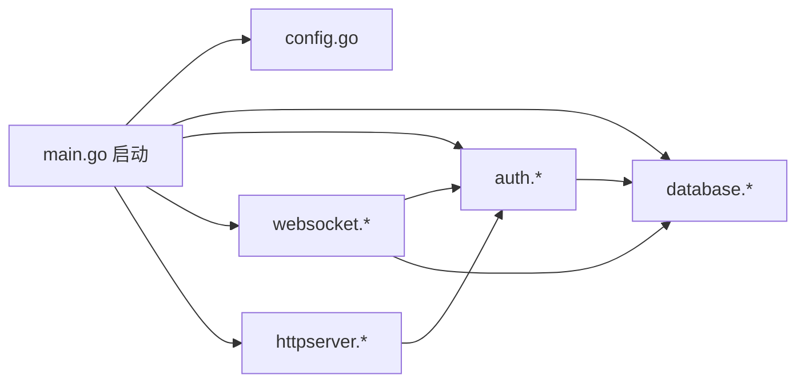

# 访问控制

<cite>
**本文引用的文件**
- [clipSync-server/cmd/server/main.go](file://clipSync-server/cmd/server/main.go)
- [clipSync-server/internal/config/config.go](file://clipSync-server/internal/config/config.go)
- [clipSync-server/internal/auth/auth.go](file://clipSync-server/internal/auth/auth.go)
- [clipSync-server/internal/auth/jwt.go](file://clipSync-server/internal/auth/jwt.go)
- [clipSync-server/internal/auth/middleware.go](file://clipSync-server/internal/auth/middleware.go)
- [clipSync-server/internal/database/models.go](file://clipSync-server/internal/database/models.go)
- [clipSync-server/internal/database/device_repo.go](file://clipSync-server/internal/database/device_repo.go)
- [clipSync-server/internal/httpserver/auth_handler.go](file://clipSync-server/internal/httpserver/auth_handler.go)
- [clipSync-server/internal/httpserver/device_handler.go](file://clipSync-server/internal/httpserver/device_handler.go)
- [clipSync-server/internal/websocket/hub.go](file://clipSync-server/internal/websocket/hub.go)
- [clipSync-server/internal/websocket/client.go](file://clipSync-server/internal/websocket/client.go)
- [clipSync-server/internal/websocket/handler.go](file://clipSync-server/internal/websocket/handler.go)
- [clipSync-server/internal/websocket/protocol.go](file://clipSync-server/internal/websocket/protocol.go)
- [clipSync-server/pkg/protocol/messages.go](file://clipSync-server/pkg/protocol/messages.go)
- [protocol/ws-messages.schema.json](file://protocol/ws-messages.schema.json)
- [clipSync-android/app/src/main/java/com/clipsync/app/service/ClipboardService.kt](file://clipSync-android/app/src/main/java/com/clipsync/app/service/ClipboardService.kt)
- [clipSync-android/app/src/main/java/com/clipsync/app/network/WebSocketClient.kt](file://clipSync-android/app/src/main/java/com/clipsync/app/network/WebSocketClient.kt)
</cite>

## 目录
1. [简介](#简介)
2. [项目结构](#项目结构)
3. [核心组件](#核心组件)
4. [架构总览](#架构总览)
5. [详细组件分析](#详细组件分析)
6. [依赖分析](#依赖分析)
7. [性能考虑](#性能考虑)
8. [故障排查指南](#故障排查指南)
9. [结论](#结论)
10. [附录](#附录)

## 简介
本文件针对 ClipSync 的访问控制系统进行系统化技术文档整理，重点覆盖以下方面：
- 基于 JWT 的身份认证与授权：用户身份确认、设备维度权限校验、令牌签发与刷新。
- WebSocket 连接访问控制：令牌验证、设备白名单（通过设备归属校验）、会话生命周期管理、心跳与超时处理。
- HTTP API 权限控制：路由级中间件拦截、资源访问限制、错误响应格式统一。
- 设备注销与权限撤销：离线设备清理、设备删除后的会话断开、权限回收策略。
- 配置指南与调试方法：安全配置建议、日志与告警、异常访问监控与防护。
- 权限绕过检测与异常访问监控：请求/消息类型校验、重复内容检测、速率限制与错误码规范。

## 项目结构
服务器端采用分层架构，按职责划分为配置、认证、数据库、HTTP 服务、WebSocket 服务与协议定义等模块；客户端（Android）负责持久化服务、心跳与消息编排。

图表来源
- [clipSync-server/cmd/server/main.go:74-125](file://clipSync-server/cmd/server/main.go#L74-L125)
- [clipSync-server/internal/config/config.go:10-36](file://clipSync-server/internal/config/config.go#L10-L36)
- [clipSync-server/internal/auth/auth.go:8-22](file://clipSync-server/internal/auth/auth.go#L8-L22)
- [clipSync-server/internal/database/models.go:3-46](file://clipSync-server/internal/database/models.go#L3-L46)
- [clipSync-server/internal/httpserver/auth_handler.go:11-19](file://clipSync-server/internal/httpserver/auth_handler.go#L11-L19)
- [clipSync-server/internal/websocket/hub.go:18-35](file://clipSync-server/internal/websocket/hub.go#L18-L35)
- [clipSync-server/pkg/protocol/messages.go:5-132](file://clipSync-server/pkg/protocol/messages.go#L5-L132)
- [clipSync-android/app/src/main/java/com/clipsync/app/service/ClipboardService.kt:39-82](file://clipSync-android/app/src/main/java/com/clipsync/app/service/ClipboardService.kt#L39-L82)
- [clipSync-android/app/src/main/java/com/clipsync/app/network/WebSocketClient.kt:26-103](file://clipSync-android/app/src/main/java/com/clipsync/app/network/WebSocketClient.kt#L26-L103)

章节来源
- [clipSync-server/cmd/server/main.go:74-125](file://clipSync-server/cmd/server/main.go#L74-L125)
- [clipSync-server/internal/config/config.go:10-36](file://clipSync-server/internal/config/config.go#L10-L36)

## 核心组件
- JWT 管理器：生成与验证 JWT，携带用户 ID、用户名、设备 ID 以及标准声明。
- 认证服务：登录/注册/刷新流程，设备创建与最后在线时间更新。
- HTTP 中间件：统一拦截 Authorization 头，解析 Bearer Token 并注入上下文。
- WebSocket Hub：连接管理、广播、心跳、超时、设备断连。
- 设备仓库：设备注册、查询、删除、归属校验、最后在线时间维护。
- 协议定义：消息类型、负载结构、错误码与版本号。

章节来源
- [clipSync-server/internal/auth/jwt.go:10-76](file://clipSync-server/internal/auth/jwt.go#L10-L76)
- [clipSync-server/internal/auth/auth.go:24-137](file://clipSync-server/internal/auth/auth.go#L24-L137)
- [clipSync-server/internal/auth/middleware.go:22-111](file://clipSync-server/internal/auth/middleware.go#L22-L111)
- [clipSync-server/internal/websocket/hub.go:18-230](file://clipSync-server/internal/websocket/hub.go#L18-L230)
- [clipSync-server/internal/database/device_repo.go:11-126](file://clipSync-server/internal/database/device_repo.go#L11-L126)
- [clipSync-server/pkg/protocol/messages.go:5-132](file://clipSync-server/pkg/protocol/messages.go#L5-L132)

## 架构总览
下图展示从客户端到服务器的访问控制路径：HTTP 登录/注册获取 JWT，随后在 WebSocket 握手后进行二次认证，再进入会话生命周期管理。

图表来源
- [clipSync-server/internal/httpserver/auth_handler.go:63-109](file://clipSync-server/internal/httpserver/auth_handler.go#L63-L109)
- [clipSync-server/internal/auth/auth.go:67-116](file://clipSync-server/internal/auth/auth.go#L67-L116)
- [clipSync-server/internal/auth/jwt.go:32-55](file://clipSync-server/internal/auth/jwt.go#L32-L55)
- [clipSync-server/internal/websocket/handler.go:33-110](file://clipSync-server/internal/websocket/handler.go#L33-L110)
- [clipSync-server/internal/websocket/hub.go:181-208](file://clipSync-server/internal/websocket/hub.go#L181-L208)

## 详细组件分析

### JWT 令牌与身份认证
- Claims 结构包含用户 ID、用户名、设备 ID 与标准声明，用于区分不同设备的会话。
- 生成令牌时设置签发时间与过期时间，支持刷新流程。
- 验证流程严格校验签名算法与过期状态，失败时返回明确错误码。

图表来源
- [clipSync-server/internal/auth/jwt.go:10-76](file://clipSync-server/internal/auth/jwt.go#L10-L76)
- [clipSync-server/internal/auth/auth.go:8-22](file://clipSync-server/internal/auth/auth.go#L8-L22)

章节来源
- [clipSync-server/internal/auth/jwt.go:32-75](file://clipSync-server/internal/auth/jwt.go#L32-L75)
- [clipSync-server/internal/auth/auth.go:31-137](file://clipSync-server/internal/auth/auth.go#L31-L137)

### HTTP API 权限控制
- 路由级中间件 RequireAuth：要求 Authorization 头且格式为 Bearer，解析并校验 JWT，将用户/设备信息注入上下文。
- 设备管理接口：列出设备、删除设备均依赖上下文中的用户 ID 进行资源归属校验。
- 错误响应统一为 JSON，包含 success、error 与 message 字段，便于前端处理。

图表来源
- [clipSync-server/internal/auth/middleware.go:32-61](file://clipSync-server/internal/auth/middleware.go#L32-L61)
- [clipSync-server/internal/httpserver/auth_handler.go:63-109](file://clipSync-server/internal/httpserver/auth_handler.go#L63-L109)
- [clipSync-server/internal/httpserver/device_handler.go:25-82](file://clipSync-server/internal/httpserver/device_handler.go#L25-L82)

章节来源
- [clipSync-server/internal/auth/middleware.go:32-111](file://clipSync-server/internal/auth/middleware.go#L32-L111)
- [clipSync-server/internal/httpserver/auth_handler.go:63-215](file://clipSync-server/internal/httpserver/auth_handler.go#L63-L215)
- [clipSync-server/internal/httpserver/device_handler.go:25-137](file://clipSync-server/internal/httpserver/device_handler.go#L25-L137)

### WebSocket 访问控制与会话管理
- 握手阶段：升级成功后，客户端需在限定时间内完成认证（默认 30 秒），否则断开。
- 认证流程：客户端发送 auth 消息，服务端验证 JWT 并设置客户端身份，随后注册到 Hub。
- 心跳与超时：读取超时由心跳周期决定，pong 到期会重置 deadline；定期 ping 用于检测死连接。
- 广播与过滤：仅向同一用户下的其他设备广播剪贴板同步消息。
- 设备注销：删除设备后，若该设备仍在线则主动断开其连接。

图表来源
- [clipSync-server/internal/websocket/hub.go:181-230](file://clipSync-server/internal/websocket/hub.go#L181-L230)
- [clipSync-server/internal/websocket/handler.go:33-110](file://clipSync-server/internal/websocket/handler.go#L33-L110)
- [clipSync-server/internal/websocket/client.go:33-117](file://clipSync-server/internal/websocket/client.go#L33-L117)
- [clipSync-server/internal/database/device_repo.go:92-119](file://clipSync-server/internal/database/device_repo.go#L92-L119)

章节来源
- [clipSync-server/internal/websocket/hub.go:181-230](file://clipSync-server/internal/websocket/hub.go#L181-L230)
- [clipSync-server/internal/websocket/handler.go:33-392](file://clipSync-server/internal/websocket/handler.go#L33-L392)
- [clipSync-server/internal/websocket/client.go:33-150](file://clipSync-server/internal/websocket/client.go#L33-L150)
- [clipSync-server/internal/database/device_repo.go:92-119](file://clipSync-server/internal/database/device_repo.go#L92-L119)

### 设备注销与权限撤销
- 删除设备：HTTP 接口根据用户上下文删除指定设备，返回成功后主动断开该设备的在线连接。
- 在线清理：Hub 维护在线设备映射，删除后立即移除对应连接。
- 权限回收：设备注销后，该设备无法再次通过旧令牌接入，新消息不再广播至该设备。

章节来源
- [clipSync-server/internal/httpserver/device_handler.go:84-137](file://clipSync-server/internal/httpserver/device_handler.go#L84-L137)
- [clipSync-server/internal/websocket/hub.go:155-166](file://clipSync-server/internal/websocket/hub.go#L155-L166)

### 协议与消息类型
- 消息封装：所有消息包含 type、version、timestamp、payload，并可选 device_id。
- 关键类型：auth、auth_response、heartbeat、heartbeat_ack、clipboard_push、clipboard_sync、clipboard_pull、clipboard_history、device_list、device_list_response、device_unregister、error、ping、pong。
- 错误码：AUTH_FAILED、TOKEN_EXPIRED、INVALID_PAYLOAD、DEVICE_NOT_FOUND、INTERNAL_ERROR、DUPLICATE_CONTENT 等。

章节来源
- [clipSync-server/pkg/protocol/messages.go:5-132](file://clipSync-server/pkg/protocol/messages.go#L5-L132)
- [protocol/ws-messages.schema.json:88-261](file://protocol/ws-messages.schema.json#L88-L261)

## 依赖分析
- 服务器启动：加载配置、初始化数据库与迁移、构建认证服务与 WebSocket Hub、注册 HTTP 路由与中间件。
- 认证链路：HTTP 登录/注册依赖认证服务与 JWT 管理器；WebSocket 认证依赖认证服务与 JWT 管理器。
- 数据一致性：设备仓库提供设备归属校验与最后在线时间更新，保障会话与权限边界清晰。

图表来源
- [clipSync-server/cmd/server/main.go:31-69](file://clipSync-server/cmd/server/main.go#L31-L69)
- [clipSync-server/internal/config/config.go:38-55](file://clipSync-server/internal/config/config.go#L38-L55)

章节来源
- [clipSync-server/cmd/server/main.go:31-69](file://clipSync-server/cmd/server/main.go#L31-L69)

## 性能考虑
- 会话并发：Hub 使用读写锁保护客户端集合，广播时对每个目标设备选择性发送，避免阻塞。
- 发送缓冲：客户端写泵具备固定大小缓冲队列，溢出时触发断连，防止内存膨胀。
- 心跳与超时：合理的读写超时与 ping 机制降低僵尸连接占用。
- 历史与去重：剪贴板历史限制与内容校验减少冗余数据传输与存储压力。

## 故障排查指南
- HTTP 认证失败
  - 现象：返回 AUTH_FAILED 或 INVALID_CREDENTIALS。
  - 排查：确认 Authorization 头格式为 Bearer；检查用户名/密码强度；核对设备名与平台参数。
- WebSocket 认证失败
  - 现象：收到 AUTH_FAILED 或 AUTH_TIMEOUT。
  - 排查：确保在 30 秒内发送 auth 消息；确认 token 未过期；检查服务端日志中“认证”输出。
- 设备注销无效
  - 现象：设备仍在线或可接收消息。
  - 排查：确认 HTTP 删除接口返回成功；检查 Hub 是否执行了 DisconnectDevice；核对设备 ID 与归属。
- 重复内容与去重
  - 现象：收到 DUPLICATE_CONTENT。
  - 排查：确认客户端是否正确计算并传递 checksum；服务端重复校验逻辑正常。
- 错误码对照
  - AUTH_FAILED：认证失败。
  - TOKEN_EXPIRED：令牌过期。
  - INVALID_PAYLOAD：消息/请求体格式不合法。
  - DEVICE_NOT_FOUND：设备不存在。
  - INTERNAL_ERROR：服务器内部错误。
  - DUPLICATE_CONTENT：内容重复。

章节来源
- [clipSync-server/internal/auth/middleware.go:32-61](file://clipSync-server/internal/auth/middleware.go#L32-L61)
- [clipSync-server/internal/websocket/handler.go:33-110](file://clipSync-server/internal/websocket/handler.go#L33-L110)
- [clipSync-server/internal/websocket/hub.go:155-166](file://clipSync-server/internal/websocket/hub.go#L155-L166)
- [protocol/ws-messages.schema.json:235-258](file://protocol/ws-messages.schema.json#L235-L258)

## 结论
ClipSync 的访问控制以 JWT 为核心，结合 HTTP 中间件与 WebSocket 会话管理，实现了用户与设备维度的细粒度权限控制。通过严格的令牌验证、设备归属校验、会话生命周期管理与错误码规范，系统在保证易用性的同时提升了安全性与可运维性。建议在生产环境强化配置安全（如更换默认密钥、缩短过期时间、限制跨域策略）并完善监控与审计日志。

## 附录

### 访问控制配置指南
- 关键配置项
  - JWT 密钥与过期时长：确保密钥唯一且安全，过期时长适中。
  - WebSocket/HTTP 端口与心跳超时：根据网络环境调整。
  - 文件存储路径与最大文件大小：限制上传风险。
  - 剪贴板历史条数：平衡性能与用户体验。
- 安全建议
  - 强制 HTTPS 与跨域限制。
  - 限制 WebSocket Origin 或在反向代理层控制。
  - 对敏感接口启用速率限制与 IP 黑名单。
  - 定期轮换 JWT 密钥并通知客户端更新。

章节来源
- [clipSync-server/internal/config/config.go:10-72](file://clipSync-server/internal/config/config.go#L10-L72)
- [clipSync-server/cmd/server/main.go:77-84](file://clipSync-server/cmd/server/main.go#L77-L84)

### 调试方法
- 日志定位
  - 服务器启动与配置加载日志。
  - WebSocket 连接、认证、断开与错误日志。
  - HTTP 请求与响应状态码。
- 客户端调试
  - Android 服务中打印消息类型与 payload，确认 auth_response、heartbeat_ack、clipboard_sync 等关键消息。
  - WebSocket 客户端状态变化（连接/断开/失败）与重连策略。

章节来源
- [clipSync-server/cmd/server/main.go:21-54](file://clipSync-server/cmd/server/main.go#L21-L54)
- [clipSync-server/internal/websocket/hub.go:61-80](file://clipSync-server/internal/websocket/hub.go#L61-L80)
- [clipSync-android/app/src/main/java/com/clipsync/app/service/ClipboardService.kt:146-210](file://clipSync-android/app/src/main/java/com/clipsync/app/service/ClipboardService.kt#L146-L210)
- [clipSync-android/app/src/main/java/com/clipsync/app/network/WebSocketClient.kt:46-78](file://clipSync-android/app/src/main/java/com/clipsync/app/network/WebSocketClient.kt#L46-L78)