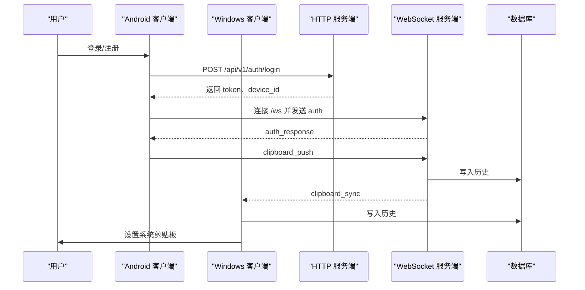
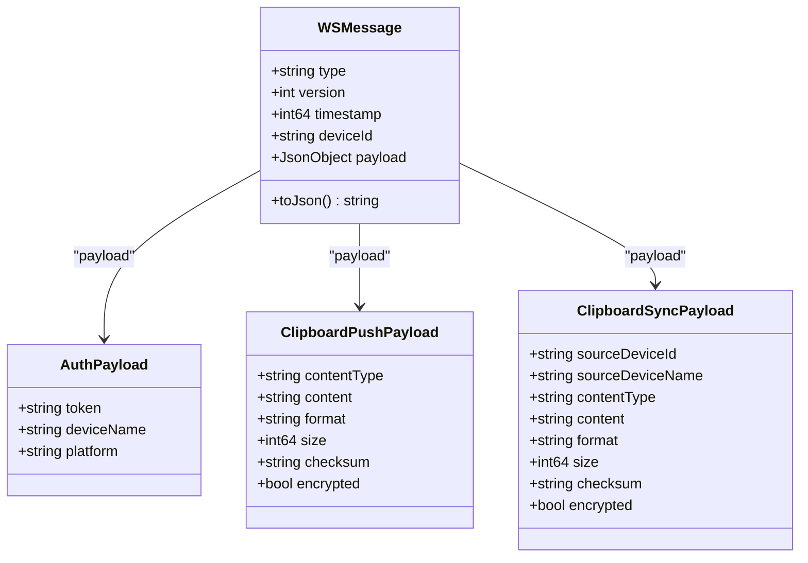
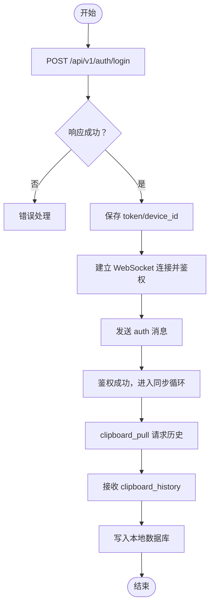
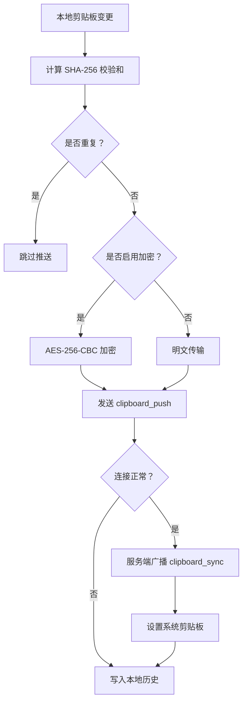
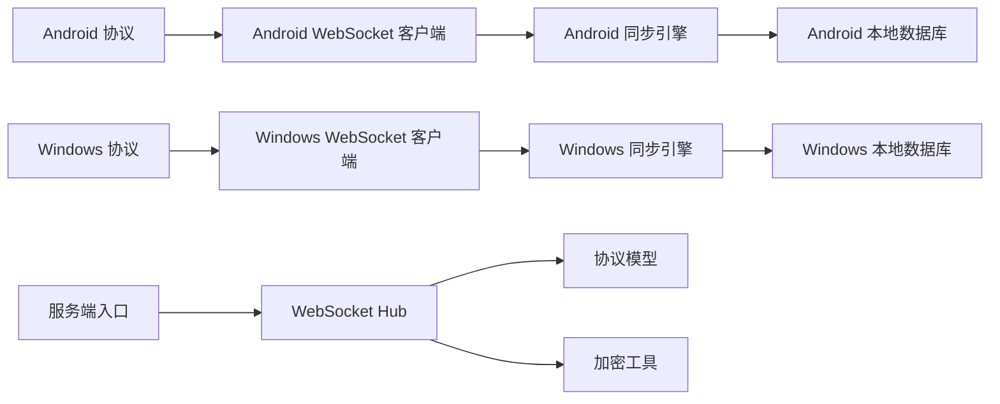

# 数据流设计

<cite>
**本文引用的文件**
- [main.go](file://clipSync-server/cmd/server/main.go)
- [messages.go](file://clipSync-server/pkg/protocol/messages.go)
- [hub.go](file://clipSync-server/internal/websocket/hub.go)
- [protocol.go](file://clipSync-server/internal/websocket/protocol.go)
- [ws-messages.schema.json](file://protocol/ws-messages.schema.json)
- [http-api.schema.json](file://protocol/http-api.schema.json)
- [WebSocketClient.kt](file://clipSync-android/app/src/main/java/com/clipsync/app/network/WebSocketClient.kt)
- [Protocol.kt](file://clipSync-android/app/src/main/java/com/clipsync/app/network/Protocol.kt)
- [SyncEngine.kt](file://clipSync-android/app/src/main/java/com/clipsync/app/core/SyncEngine.kt)
- [AppDatabase.kt](file://clipSync-android/app/src/main/java/com/clipsync/app/data/AppDatabase.kt)
- [EncryptionHelper.kt](file://clipSync-android/app/src/main/java/com/clipsync/app/core/EncryptionHelper.kt)
- [SyncEngine.cs](file://clipSync-windows/ClipSync.WPF/Core/SyncEngine.cs)
- [aes.go](file://clipSync-server/internal/encryption/aes.go)
- [DEVELOPMENT_PLAN.md](file://DEVELOPMENT_PLAN.md)
</cite>

## 目录
1. [简介](#简介)
2. [项目结构](#项目结构)
3. [核心组件](#核心组件)
4. [架构总览](#架构总览)
5. [详细组件分析](#详细组件分析)
6. [依赖关系分析](#依赖关系分析)
7. [性能考虑](#性能考虑)
8. [故障排查指南](#故障排查指南)
9. [结论](#结论)
10. [附录](#附录)

## 简介
本文件系统性阐述 ClipSync 的数据流设计，覆盖从剪贴板变化到跨设备同步的完整链路，包括：
- WebSocket 消息的序列化、传输与反序列化
- HTTP API 的数据交换模式与状态管理
- 离线缓存与断线重连的一致性保障
- 典型使用场景下的数据流向与时序图
- 数据压缩、加密传输与性能优化策略

目标是帮助开发者与测试人员快速理解并验证跨平台数据一致性与稳定性。

## 项目结构
项目采用“协议共享 + 多端实现”的并行开发模式：
- 协议规范：统一的 WebSocket 消息与 HTTP API 规范（JSON Schema）
- 服务端：Go 实现的 WebSocket Hub、HTTP 路由与数据库
- 客户端：Android（Kotlin + Jetpack Compose）与 Windows（WPF）分别实现协议解析、消息编解码、连接管理与本地缓存

```mermaid
graph TB
subgraph "服务端"
SMain["服务器入口<br/>cmd/server/main.go"]
SHub["WebSocket Hub<br/>internal/websocket/hub.go"]
SProto["协议模型<br/>pkg/protocol/messages.go"]
SAES["加密工具<br/>internal/encryption/aes.go"]
end
subgraph "客户端-Android"
AProto["协议定义<br/>network/Protocol.kt"]
AClient["WebSocket 客户端<br/>network/WebSocketClient.kt"]
ASync["同步引擎<br/>core/SyncEngine.kt"]
ADB["本地数据库<br/>data/AppDatabase.kt"]
AEnc["加密助手<br/>core/EncryptionHelper.kt"]
end
subgraph "客户端-Windows"
WProto["协议定义<br/>Network/Protocol.cs"]
WClient["WebSocket 客户端<br/>Network/WebSocketClient.cs"]
WSync["同步引擎<br/>Core/SyncEngine.cs"]
WDB["本地数据库<br/>Storage/LocalDatabase.cs"]
WAES["加密工具<br/>EncryptionHelper.cs"]
end
SMain --> SHub
SMain --> SProto
SHub --> SAES
AProto --> AClient
AClient --> ASync
ASync --> ADB
ASync --> AEnc
WProto --> WClient
WClient --> WSync
WSync --> WDB
WSync --> WAES
```



图表来源
- [main.go:21-146](file://clipSync-server/cmd/server/main.go#L21-L146)
- [hub.go:18-230](file://clipSync-server/internal/websocket/hub.go#L18-L230)
- [messages.go:5-132](file://clipSync-server/pkg/protocol/messages.go#L5-L132)
- [aes.go:22-135](file://clipSync-server/internal/encryption/aes.go#L22-L135)
- [Protocol.kt:12-263](file://clipSync-android/app/src/main/java/com/clipsync/app/network/Protocol.kt#L12-L263)
- [WebSocketClient.kt:26-156](file://clipSync-android/app/src/main/java/com/clipsync/app/network/WebSocketClient.kt#L26-L156)
- [SyncEngine.kt:27-250](file://clipSync-android/app/src/main/java/com/clipsync/app/core/SyncEngine.kt#L27-L250)
- [AppDatabase.kt:14-41](file://clipSync-android/app/src/main/java/com/clipsync/app/data/AppDatabase.kt#L14-L41)
- [EncryptionHelper.kt:22-157](file://clipSync-android/app/src/main/java/com/clipsync/app/core/EncryptionHelper.kt#L22-L157)
- [SyncEngine.cs:8-422](file://clipSync-windows/ClipSync.WPF/Core/SyncEngine.cs#L8-L422)

章节来源
- [main.go:21-146](file://clipSync-server/cmd/server/main.go#L21-L146)
- [DEVELOPMENT_PLAN.md:18-363](file://DEVELOPMENT_PLAN.md#L18-L363)

## 核心组件
- 服务端 WebSocket Hub：负责连接生命周期、消息广播、心跳超时检测与用户维度的设备在线状态管理
- 协议模型：统一的消息类型、载荷结构与版本控制
- 客户端同步引擎：监听本地剪贴板变化、去重、可选加密、发送与接收消息、历史落盘
- 本地数据库：持久化剪贴板历史与设备信息
- 加密模块：基于 PBKDF2 + AES-256-CBC 的对称加密，支持盐值与随机 IV

章节来源
- [hub.go:18-230](file://clipSync-server/internal/websocket/hub.go#L18-L230)
- [messages.go:5-132](file://clipSync-server/pkg/protocol/messages.go#L5-L132)
- [SyncEngine.kt:27-250](file://clipSync-android/app/src/main/java/com/clipsync/app/core/SyncEngine.kt#L27-L250)
- [SyncEngine.cs:8-422](file://clipSync-windows/ClipSync.WPF/Core/SyncEngine.cs#L8-L422)
- [AppDatabase.kt:14-41](file://clipSync-android/app/src/main/java/com/clipsync/app/data/AppDatabase.kt#L14-L41)
- [EncryptionHelper.kt:22-157](file://clipSync-android/app/src/main/java/com/clipsync/app/core/EncryptionHelper.kt#L22-L157)
- [aes.go:22-135](file://clipSync-server/internal/encryption/aes.go#L22-L135)

## 架构总览
ClipSync 采用“HTTP 认证 + WebSocket 实时同步”的双通道架构：
- HTTP 通道用于认证、注册、刷新令牌、设备管理与大文件上传下载
- WebSocket 通道用于实时消息广播、心跳保活与剪贴板内容同步



图表来源
- [main.go:74-125](file://clipSync-server/cmd/server/main.go#L74-L125)
- [http-api.schema.json:8-293](file://protocol/http-api.schema.json#L8-L293)
- [ws-messages.schema.json:46-87](file://protocol/ws-messages.schema.json#L46-L87)
- [SyncEngine.kt:72-123](file://clipSync-android/app/src/main/java/com/clipsync/app/core/SyncEngine.kt#L72-L123)
- [SyncEngine.cs:95-125](file://clipSync-windows/ClipSync.WPF/Core/SyncEngine.cs#L95-L125)

## 详细组件分析

### WebSocket 消息序列化与传输
- 服务端消息模型：统一的 envelope 结构（type、version、timestamp、device_id、payload），并定义了多种消息类型与载荷结构
- 客户端序列化：Android 使用 Kotlinx Serialization；Windows 使用自定义协议类
- 传输层：OkHttp（Android）与自定义 WebSocket 客户端（Windows），均支持 ping/pong 心跳与自动重连



图表来源
- [messages.go:5-132](file://clipSync-server/pkg/protocol/messages.go#L5-L132)
- [Protocol.kt:20-170](file://clipSync-android/app/src/main/java/com/clipsync/app/network/Protocol.kt#L20-L170)

章节来源
- [messages.go:5-132](file://clipSync-server/pkg/protocol/messages.go#L5-L132)
- [ws-messages.schema.json:46-87](file://protocol/ws-messages.schema.json#L46-L87)
- [Protocol.kt:12-263](file://clipSync-android/app/src/main/java/com/clipsync/app/network/Protocol.kt#L12-L263)
- [WebSocketClient.kt:26-156](file://clipSync-android/app/src/main/java/com/clipsync/app/network/WebSocketClient.kt#L26-L156)

### HTTP API 数据交换与状态管理
- 认证：登录/注册/刷新令牌，返回 token 与 device_id，并在后续请求中通过 Authorization 头携带
- 设备管理：列出设备、注销设备
- 健康检查：返回服务状态、版本、运行时长与连接数
- 文件上传下载：用于大内容的分发



图表来源
- [http-api.schema.json:8-293](file://protocol/http-api.schema.json#L8-L293)
- [SyncEngine.cs:312-380](file://clipSync-windows/ClipSync.WPF/Core/SyncEngine.cs#L312-L380)
- [SyncEngine.kt:199-203](file://clipSync-android/app/src/main/java/com/clipsync/app/core/SyncEngine.kt#L199-L203)

章节来源
- [http-api.schema.json:8-293](file://protocol/http-api.schema.json#L8-L293)
- [main.go:74-106](file://clipSync-server/cmd/server/main.go#L74-L106)

### 离线缓存与断线重连一致性
- 本地缓存：Android 使用 Room，Windows 使用 SQLite；均存储剪贴板历史与设备信息
- 断线重连：客户端维护连接状态与重连策略，服务端 Hub 在心跳超时后清理无效连接
- 去重与幂等：基于 SHA-256 校验和进行重复内容过滤，避免环路与冗余同步
- 一致性保障：服务端在广播前过滤自身设备，客户端在接收时再次校验来源设备 ID



图表来源
- [SyncEngine.kt:72-160](file://clipSync-android/app/src/main/java/com/clipsync/app/core/SyncEngine.kt#L72-L160)
- [SyncEngine.cs:95-267](file://clipSync-windows/ClipSync.WPF/Core/SyncEngine.cs#L95-L267)
- [EncryptionHelper.kt:107-157](file://clipSync-android/app/src/main/java/com/clipsync/app/core/EncryptionHelper.kt#L107-L157)
- [aes.go:22-106](file://clipSync-server/internal/encryption/aes.go#L22-L106)

章节来源
- [SyncEngine.kt:72-234](file://clipSync-android/app/src/main/java/com/clipsync/app/core/SyncEngine.kt#L72-L234)
- [SyncEngine.cs:95-267](file://clipSync-windows/ClipSync.WPF/Core/SyncEngine.cs#L95-L267)
- [AppDatabase.kt:14-41](file://clipSync-android/app/src/main/java/com/clipsync/app/data/AppDatabase.kt#L14-L41)

### 数据流向图（典型场景）
以“Windows 复制文本 → Android 接收”为例：

```mermaid
sequenceDiagram
participant Win as "Windows 客户端"
participant Hub as "服务端 Hub"
participant And as "Android 客户端"
participant DB as "数据库"
Win->>Win : 监测剪贴板变化
Win->>Win : 计算校验和/可选加密
Win->>Hub : clipboard_push
Hub->>DB : 插入历史
Hub-->>And : clipboard_sync
And->>DB : 插入历史
And->>Win : 设置系统剪贴板
```

图表来源
- [SyncEngine.cs:95-125](file://clipSync-windows/ClipSync.WPF/Core/SyncEngine.cs#L95-L125)
- [SyncEngine.kt:128-160](file://clipSync-android/app/src/main/java/com/clipsync/app/core/SyncEngine.kt#L128-L160)
- [hub.go:114-121](file://clipSync-server/internal/websocket/hub.go#L114-L121)

## 依赖关系分析
- 服务端依赖：配置加载、数据库迁移、JWT 中间件、WebSocket Hub、HTTP 路由
- 客户端依赖：网络库（OkHttp）、序列化库（Kotlinx Serialization）、协程流、Room/SQLite、加密库



图表来源
- [main.go:21-146](file://clipSync-server/cmd/server/main.go#L21-L146)
- [hub.go:44-58](file://clipSync-server/internal/websocket/hub.go#L44-L58)
- [Protocol.kt:12-263](file://clipSync-android/app/src/main/java/com/clipsync/app/network/Protocol.kt#L12-L263)
- [WebSocketClient.kt:26-156](file://clipSync-android/app/src/main/java/com/clipsync/app/network/WebSocketClient.kt#L26-L156)
- [SyncEngine.kt:27-50](file://clipSync-android/app/src/main/java/com/clipsync/app/core/SyncEngine.kt#L27-L50)
- [SyncEngine.cs:8-57](file://clipSync-windows/ClipSync.WPF/Core/SyncEngine.cs#L8-L57)

章节来源
- [main.go:21-146](file://clipSync-server/cmd/server/main.go#L21-L146)
- [hub.go:44-58](file://clipSync-server/internal/websocket/hub.go#L44-L58)

## 性能考虑
- 心跳与保活：客户端每 30 秒发送 heartbeat，服务端在超时后清理连接，避免僵尸会话占用资源
- 发送缓冲与背压：服务端 Hub 对客户端发送队列进行容量限制，满载时主动断开以保护整体稳定性
- 历史限制：服务端与客户端均限制历史条目数量，防止无限增长导致内存与磁盘压力
- 去重：基于校验和的重复内容过滤，减少带宽与 CPU 开销
- 加密成本：仅在需要时启用加密，避免不必要的加解密开销

章节来源
- [protocol.go:9-27](file://clipSync-server/internal/websocket/protocol.go#L9-L27)
- [hub.go:81-111](file://clipSync-server/internal/websocket/hub.go#L81-L111)
- [SyncEngine.kt:208-227](file://clipSync-android/app/src/main/java/com/clipsync/app/core/SyncEngine.kt#L208-L227)
- [SyncEngine.cs:388-411](file://clipSync-windows/ClipSync.WPF/Core/SyncEngine.cs#L388-L411)

## 故障排查指南
- 鉴权失败：检查 HTTP 认证接口返回与 Authorization 头是否正确；确认 token 未过期
- 连接异常：确认 WebSocket URL 正确、端口开放、服务端未拒绝跨域；查看客户端连接状态流
- 心跳超时：检查客户端心跳定时器是否正常触发；服务端日志中是否存在 AUTH_TIMEOUT
- 解密失败：确认两端使用相同密码与格式；检查加密输出格式（salt:content）
- 历史缺失：确认已发送 clipboard_pull 请求并正确处理 clipboard_history 响应

章节来源
- [http-api.schema.json:8-293](file://protocol/http-api.schema.json#L8-L293)
- [WebSocketClient.kt:46-78](file://clipSync-android/app/src/main/java/com/clipsync/app/network/WebSocketClient.kt#L46-L78)
- [hub.go:197-204](file://clipSync-server/internal/websocket/hub.go#L197-L204)
- [EncryptionHelper.kt:72-102](file://clipSync-android/app/src/main/java/com/clipsync/app/core/EncryptionHelper.kt#L72-L102)
- [SyncEngine.kt:165-194](file://clipSync-android/app/src/main/java/com/clipsync/app/core/SyncEngine.kt#L165-L194)

## 结论
ClipSync 通过“协议共享 + 双通道架构”，实现了跨平台、低延迟、高一致性的剪贴板同步能力。服务端 Hub 提供稳定的消息路由与心跳保活，客户端在本地完成去重、加密与历史落盘，配合断线重连与一致性校验，确保复杂网络环境下的可靠性。建议在生产环境中进一步完善安全策略（如 TLS、速率限制）与监控告警体系。

## 附录
- 协议与 API 规范参考：[ws-messages.schema.json:1-261](file://protocol/ws-messages.schema.json#L1-L261)、[http-api.schema.json:1-293](file://protocol/http-api.schema.json#L1-L293)
- 开发计划与集成里程碑：[DEVELOPMENT_PLAN.md:716-797](file://DEVELOPMENT_PLAN.md#L716-L797)