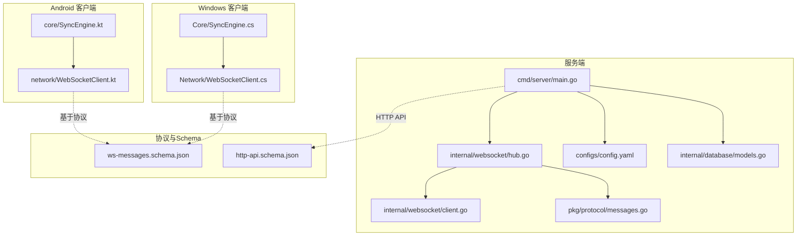
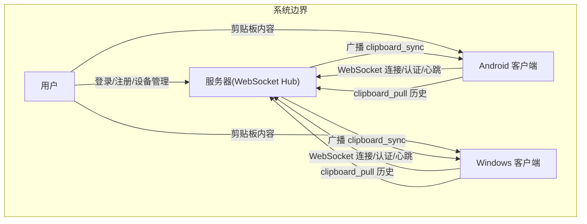
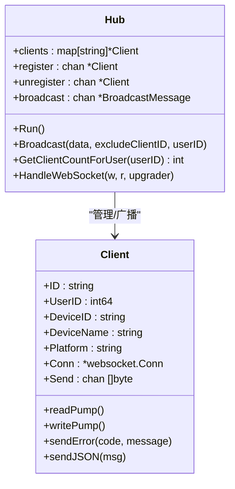
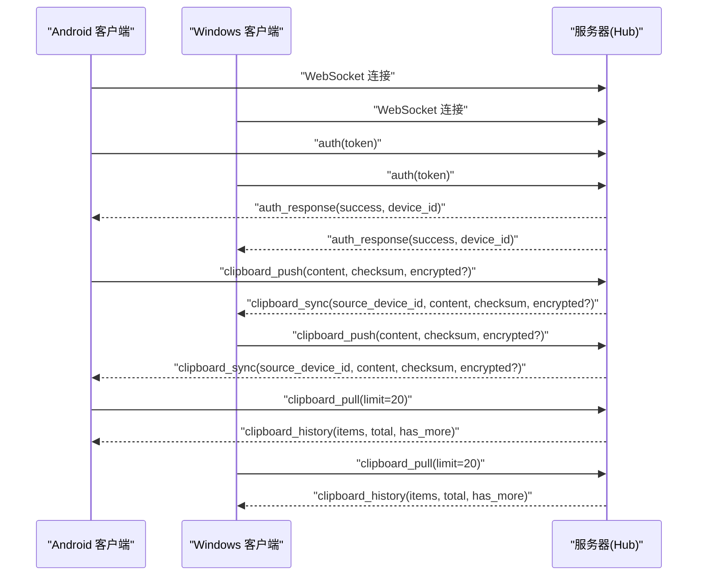
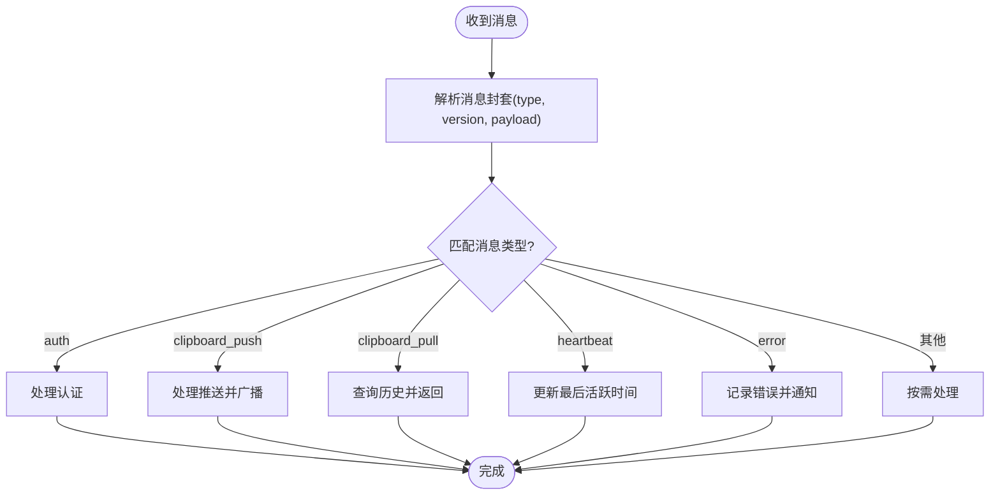
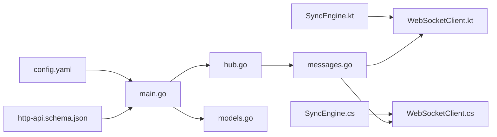
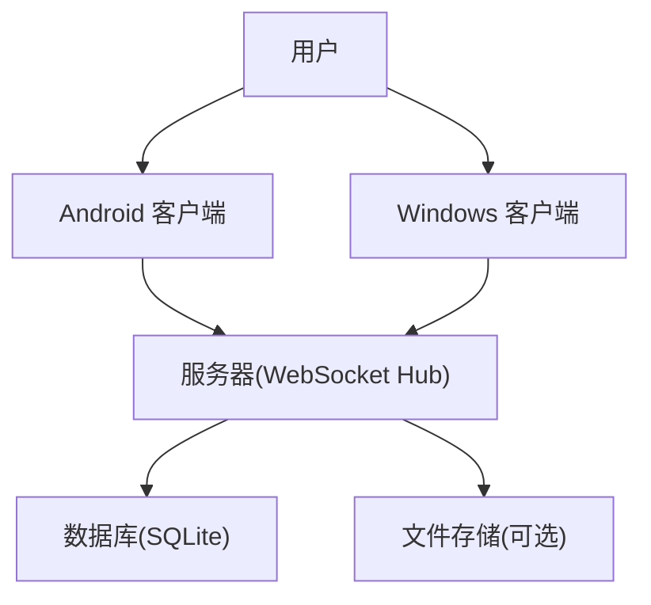

# 整体架构

<cite>
**本文引用的文件列表**
- [main.go](file://clipSync-server/cmd/server/main.go)
- [hub.go](file://clipSync-server/internal/websocket/hub.go)
- [client.go](file://clipSync-server/internal/websocket/client.go)
- [protocol.go](file://clipSync-server/internal/websocket/protocol.go)
- [messages.go](file://clipSync-server/pkg/protocol/messages.go)
- [config.yaml](file://clipSync-server/configs/config.yaml)
- [models.go](file://clipSync-server/internal/database/models.go)
- [SyncEngine.kt](file://clipSync-android/app/src/main/java/com/clipsync/app/core/SyncEngine.kt)
- [WebSocketClient.kt](file://clipSync-android/app/src/main/java/com/clipsync/app/network/WebSocketClient.kt)
- [SyncEngine.cs](file://clipSync-windows/ClipSync.WPF/Core/SyncEngine.cs)
- [WebSocketClient.cs](file://clipSync-windows/ClipSync.WPF/Network/WebSocketClient.cs)
- [ws-messages.schema.json](file://protocol/ws-messages.schema.json)
- [http-api.schema.json](file://protocol/http-api.schema.json)
- [DEVELOPMENT_PLAN.md](file://DEVELOPMENT_PLAN.md)
</cite>

## 目录
1. [引言](#引言)
2. [项目结构](#项目结构)
3. [核心组件](#核心组件)
4. [架构总览](#架构总览)
5. [详细组件分析](#详细组件分析)
6. [依赖关系分析](#依赖关系分析)
7. [性能考虑](#性能考虑)
8. [故障排查指南](#故障排查指南)
9. [结论](#结论)
10. [附录](#附录)

## 引言
本文件面向ClipSync的整体架构，系统性阐述“服务器-客户端-客户端”三端架构的设计思路与实现细节。重点包括：
- 服务器端作为WebSocket Hub的核心职责：连接管理、消息路由、心跳检测、广播机制、鉴权与安全。
- 客户端作为同步引擎的职责分工：本地剪贴板监听、消息编排、去重与加密、历史缓存、自动重连与心跳维持。
- 架构模式选择：事件驱动、分层架构、接口隔离、协议即契约等设计原则。
- 系统上下文图：展示各组件之间的交互关系。
- 技术栈选择考量：Go语言并发优势、跨平台统一性、协议与Schema驱动开发。
- 架构演进历程与未来扩展方向。

## 项目结构
ClipSync采用多模块并行开发策略，服务端与两端客户端分别独立构建，通过共享协议规范实现解耦与并行交付。服务端以Go语言实现，客户端分别使用Android Kotlin与Windows WPF实现。

图表来源
- [main.go:1-146](file://clipSync-server/cmd/server/main.go#L1-L146)
- [hub.go:1-230](file://clipSync-server/internal/websocket/hub.go#L1-L230)
- [client.go:1-150](file://clipSync-server/internal/websocket/client.go#L1-L150)
- [messages.go:1-132](file://clipSync-server/pkg/protocol/messages.go#L1-L132)
- [config.yaml:1-29](file://clipSync-server/configs/config.yaml#L1-L29)
- [models.go:1-46](file://clipSync-server/internal/database/models.go#L1-L46)
- [SyncEngine.kt:1-250](file://clipSync-android/app/src/main/java/com/clipsync/app/core/SyncEngine.kt#L1-L250)
- [WebSocketClient.kt:1-156](file://clipSync-android/app/src/main/java/com/clipsync/app/network/WebSocketClient.kt#L1-L156)
- [SyncEngine.cs:1-422](file://clipSync-windows/ClipSync.WPF/Core/SyncEngine.cs#L1-L422)
- [WebSocketClient.cs:1-146](file://clipSync-windows/ClipSync.WPF/Network/WebSocketClient.cs#L1-L146)
- [ws-messages.schema.json:1-261](file://protocol/ws-messages.schema.json#L1-L261)
- [http-api.schema.json:1-293](file://protocol/http-api.schema.json#L1-L293)

章节来源
- [DEVELOPMENT_PLAN.md:365-527](file://DEVELOPMENT_PLAN.md#L365-L527)

## 核心组件
- 服务器端
  - 入口与配置：加载配置、初始化数据库、运行迁移、注册HTTP路由与WebSocket处理器。
  - WebSocket Hub：集中管理客户端连接、广播消息、心跳超时处理、设备在线状态统计。
  - 协议模型：定义WebSocket消息类型、负载结构与版本号。
  - 数据模型：用户、设备、剪贴板条目、上传文件等实体。
- 客户端
  - 同步引擎：负责本地剪贴板变化监听、推送、接收同步、历史拉取与保存、去重与加密。
  - WebSocket客户端：封装连接生命周期、消息收发、自动重连与心跳维持。
  - 设置与存储：本地设置、历史数据库、设备信息持久化。

章节来源
- [main.go:21-146](file://clipSync-server/cmd/server/main.go#L21-L146)
- [hub.go:18-230](file://clipSync-server/internal/websocket/hub.go#L18-L230)
- [messages.go:5-132](file://clipSync-server/pkg/protocol/messages.go#L5-L132)
- [models.go:3-46](file://clipSync-server/internal/database/models.go#L3-L46)
- [SyncEngine.kt:27-250](file://clipSync-android/app/src/main/java/com/clipsync/app/core/SyncEngine.kt#L27-L250)
- [WebSocketClient.kt:26-156](file://clipSync-android/app/src/main/java/com/clipsync/app/network/WebSocketClient.kt#L26-L156)
- [SyncEngine.cs:8-422](file://clipSync-windows/ClipSync.WPF/Core/SyncEngine.cs#L8-L422)
- [WebSocketClient.cs:10-146](file://clipSync-windows/ClipSync.WPF/Network/WebSocketClient.cs#L10-L146)

## 架构总览
ClipSync采用“服务器-客户端-客户端”的三端架构，核心思想是：
- 服务器作为WebSocket Hub，统一承载实时消息的接入与转发，实现跨设备的剪贴板同步。
- 客户端作为同步引擎，负责本地事件感知、消息编排、去重与加密、历史缓存与UI展示。
- 协议与Schema作为单一事实来源，确保三端在消息格式、字段约束、错误码等方面保持一致。

图表来源
- [main.go:74-125](file://clipSync-server/cmd/server/main.go#L74-L125)
- [hub.go:181-208](file://clipSync-server/internal/websocket/hub.go#L181-L208)
- [SyncEngine.kt:72-203](file://clipSync-android/app/src/main/java/com/clipsync/app/core/SyncEngine.kt#L72-L203)
- [SyncEngine.cs:73-386](file://clipSync-windows/ClipSync.WPF/Core/SyncEngine.cs#L73-L386)

## 详细组件分析

### 服务器端：WebSocket Hub
- 职责
  - 统一升级HTTP到WebSocket，管理客户端连接集合。
  - 广播消息给同一用户的其他设备，排除发送者，避免回环。
  - 心跳超时检测，断开长时间无响应的客户端。
  - 提供设备在线查询、设备断连、客户端计数等辅助能力。
- 关键数据结构
  - Hub：包含客户端映射、注册/注销/广播通道、认证服务与仓库实例、心跳超时与历史限制。
  - BroadcastMessage：携带广播数据、排除客户端ID、目标用户ID。
  - Client：持有连接、发送缓冲、认证状态、心跳定时器、最后活跃时间等。
- 处理流程
  - 主循环select监听注册/注销/广播事件，按用户维度进行广播。
  - 对于广播通道中的消息，遍历当前用户的所有客户端，非发送者写入发送缓冲；若缓冲满则标记断连。
  - 心跳超时：读取超时触发断连；写入PongHandler刷新读取超时。
  - 认证超时：未在30秒内完成认证则断开并返回错误消息。

图表来源
- [hub.go:18-153](file://clipSync-server/internal/websocket/hub.go#L18-L153)
- [client.go:13-150](file://clipSync-server/internal/websocket/client.go#L13-L150)

章节来源
- [hub.go:60-121](file://clipSync-server/internal/websocket/hub.go#L60-L121)
- [client.go:33-117](file://clipSync-server/internal/websocket/client.go#L33-L117)

### 客户端：同步引擎与WebSocket客户端
- Android
  - SyncEngine：负责本地剪贴板监听、去重（基于校验和）、加密/解密、推送与同步、历史拉取与保存。
  - WebSocketClient：OkHttp封装，提供连接状态流、消息流、自动重连、发送与断开。
- Windows
  - SyncEngine：事件驱动，处理认证响应、剪贴板同步、心跳确认、设备列表、错误处理与历史保存。
  - WebSocketClient：System.Net.WebSockets封装，异步收发、取消令牌控制、最大消息大小限制。

图表来源
- [SyncEngine.kt:72-203](file://clipSync-android/app/src/main/java/com/clipsync/app/core/SyncEngine.kt#L72-L203)
- [WebSocketClient.kt:83-139](file://clipSync-android/app/src/main/java/com/clipsync/app/network/WebSocketClient.kt#L83-L139)
- [SyncEngine.cs:73-386](file://clipSync-windows/ClipSync.WPF/Core/SyncEngine.cs#L73-L386)
- [WebSocketClient.cs:22-81](file://clipSync-windows/ClipSync.WPF/Network/WebSocketClient.cs#L22-L81)

章节来源
- [SyncEngine.kt:27-250](file://clipSync-android/app/src/main/java/com/clipsync/app/core/SyncEngine.kt#L27-L250)
- [WebSocketClient.kt:26-156](file://clipSync-android/app/src/main/java/com/clipsync/app/network/WebSocketClient.kt#L26-L156)
- [SyncEngine.cs:8-422](file://clipSync-windows/ClipSync.WPF/Core/SyncEngine.cs#L8-L422)
- [WebSocketClient.cs:10-146](file://clipSync-windows/ClipSync.WPF/Network/WebSocketClient.cs#L10-L146)

### 协议与Schema
- WebSocket消息模型
  - 消息封套：type、version、timestamp、device_id、payload。
  - 类型覆盖：认证、心跳、剪贴板推送/同步/拉取、历史、设备列表、错误、ping/pong。
  - 负载结构：auth、clipboard_push、clipboard_sync、clipboard_pull、clipboard_history、device_list_response、error等。
- HTTP API契约
  - 登录/注册/刷新、健康检查、设备管理、文件上传下载等端点与错误码。
- Schema验证
  - 使用JSON Schema对WebSocket与HTTP请求进行结构与约束校验，保证跨端一致性。

图表来源
- [messages.go:5-132](file://clipSync-server/pkg/protocol/messages.go#L5-L132)
- [ws-messages.schema.json:46-87](file://protocol/ws-messages.schema.json#L46-L87)

章节来源
- [messages.go:5-132](file://clipSync-server/pkg/protocol/messages.go#L5-L132)
- [ws-messages.schema.json:1-261](file://protocol/ws-messages.schema.json#L1-L261)
- [http-api.schema.json:1-293](file://protocol/http-api.schema.json#L1-L293)

## 依赖关系分析
- 服务器端
  - 入口依赖配置、数据库、鉴权中间件、HTTP路由与WebSocket Hub。
  - Hub依赖认证服务、剪贴板仓库、设备仓库、用户仓库与协议模型。
  - 配置与Schema驱动服务端行为（端口、JWT、文件存储、历史限制、心跳超时）。
- 客户端
  - 同步引擎依赖WebSocket客户端、剪贴板监听、设置管理、本地数据库。
  - WebSocket客户端依赖网络库（OkHttp或System.Net.WebSockets），提供连接状态与消息流。
- 协议与Schema
  - 三端均依赖协议模型与Schema，确保消息一致性与错误码统一。

图表来源
- [config.yaml:1-29](file://clipSync-server/configs/config.yaml#L1-L29)
- [main.go:31-106](file://clipSync-server/cmd/server/main.go#L31-L106)
- [hub.go:44-57](file://clipSync-server/internal/websocket/hub.go#L44-L57)
- [messages.go:1-132](file://clipSync-server/pkg/protocol/messages.go#L1-L132)
- [models.go:1-46](file://clipSync-server/internal/database/models.go#L1-L46)
- [SyncEngine.kt:27-32](file://clipSync-android/app/src/main/java/com/clipsync/app/core/SyncEngine.kt#L27-L32)
- [WebSocketClient.kt:26-44](file://clipSync-android/app/src/main/java/com/clipsync/app/network/WebSocketClient.kt#L26-L44)
- [SyncEngine.cs:8-47](file://clipSync-windows/ClipSync.WPF/Core/SyncEngine.cs#L8-L47)
- [WebSocketClient.cs:10-40](file://clipSync-windows/ClipSync.WPF/Network/WebSocketClient.cs#L10-L40)
- [http-api.schema.json:1-293](file://protocol/http-api.schema.json#L1-L293)

章节来源
- [main.go:31-106](file://clipSync-server/cmd/server/main.go#L31-L106)
- [config.yaml:1-29](file://clipSync-server/configs/config.yaml#L1-L29)

## 性能考虑
- 服务器端
  - 并发模型：Go goroutine与select主循环，适合高并发低延迟的实时通信场景。
  - 缓冲与背压：客户端发送缓冲队列与满缓冲断连策略，避免内存膨胀。
  - 心跳与超时：读取超时与PongHandler刷新，保障连接健康与资源回收。
  - 数据库：SQLite WAL模式优化写入性能，迁移脚本保证Schema一致性。
- 客户端
  - 去重：基于校验和避免重复推送，降低带宽与服务器压力。
  - 加密：可选AES-256加密，支持大内容通过HTTP上传/下载。
  - 自动重连：指数退避与状态回调，提升鲁棒性。
- 协议与Schema
  - 明确的消息类型与负载约束，减少解析与序列化成本，便于缓存与压缩。

[本节为通用性能讨论，不直接分析具体文件]

## 故障排查指南
- 服务器端
  - 认证超时：客户端未在30秒内完成认证会被断开并返回错误消息。
  - 心跳超时：读取超时触发断连，检查客户端心跳定时器与网络稳定性。
  - 广播异常：检查广播通道是否阻塞、客户端发送缓冲是否满导致断连。
- 客户端
  - 连接失败：检查URL、证书与防火墙；确认自动重连逻辑生效。
  - 消息解析错误：检查协议版本与payload字段是否符合Schema。
  - 历史缺失：确认clipboard_pull参数与服务器历史限制配置。
- 协议与Schema
  - 使用Schema校验请求/响应，定位字段缺失或类型不符问题。

章节来源
- [hub.go:197-204](file://clipSync-server/internal/websocket/hub.go#L197-L204)
- [client.go:40-45](file://clipSync-server/internal/websocket/client.go#L40-L45)
- [SyncEngine.kt:85-91](file://clipSync-android/app/src/main/java/com/clipsync/app/core/SyncEngine.kt#L85-L91)
- [SyncEngine.cs:95-125](file://clipSync-windows/ClipSync.WPF/Core/SyncEngine.cs#L95-L125)
- [ws-messages.schema.json:46-87](file://protocol/ws-messages.schema.json#L46-L87)

## 结论
ClipSync通过“服务器-客户端-客户端”的三端架构，结合事件驱动与分层设计，实现了跨平台的实时剪贴板同步。服务器端以WebSocket Hub为核心，承担连接管理、消息广播与心跳检测；两端客户端作为同步引擎，负责本地事件感知与消息编排。协议与Schema作为单一事实来源，确保三端一致性与可测试性。技术栈选择上，Go语言的并发优势与跨平台统一性（Kotlin/WPF）共同支撑了快速迭代与稳定交付。

[本节为总结性内容，不直接分析具体文件]

## 附录

### 系统上下文图（概念）

[该图为概念性上下文图，不直接映射到具体源文件，故不提供图表来源]

### 架构演进历程与未来扩展
- 并行开发计划：三端并行起步，协议先行，Mock/Stub策略降低耦合。
- 集成里程碑：协议兼容、认证集成、WebSocket连接、剪贴板同步、全功能集成、生产就绪。
- 未来扩展方向：设备管理增强、文件传输优化、多用户会话、权限与审计日志、监控与告警、弹性扩容与限流策略。

章节来源
- [DEVELOPMENT_PLAN.md:531-796](file://DEVELOPMENT_PLAN.md#L531-L796)