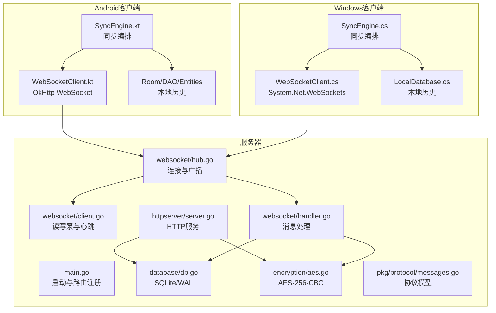
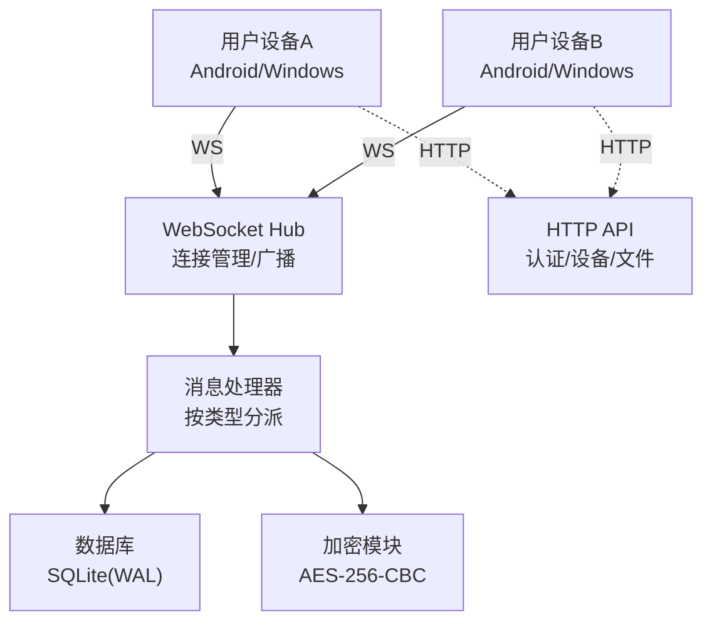
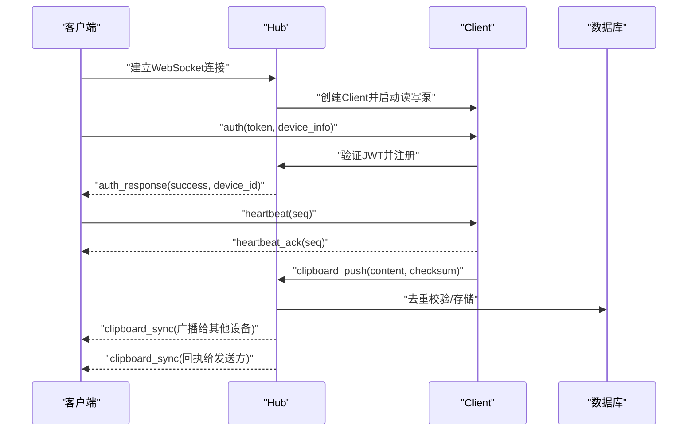
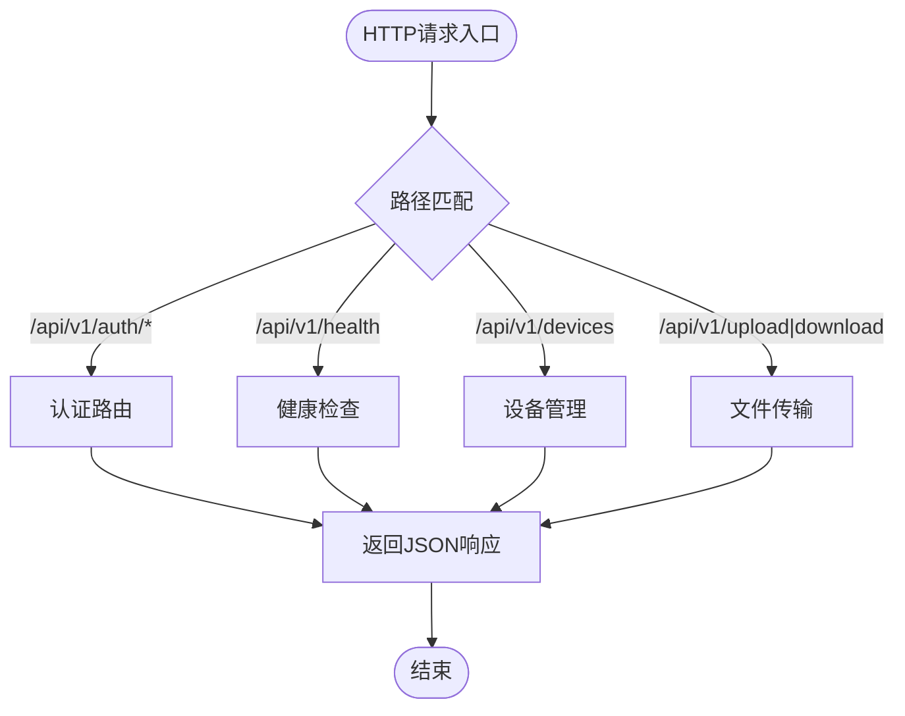
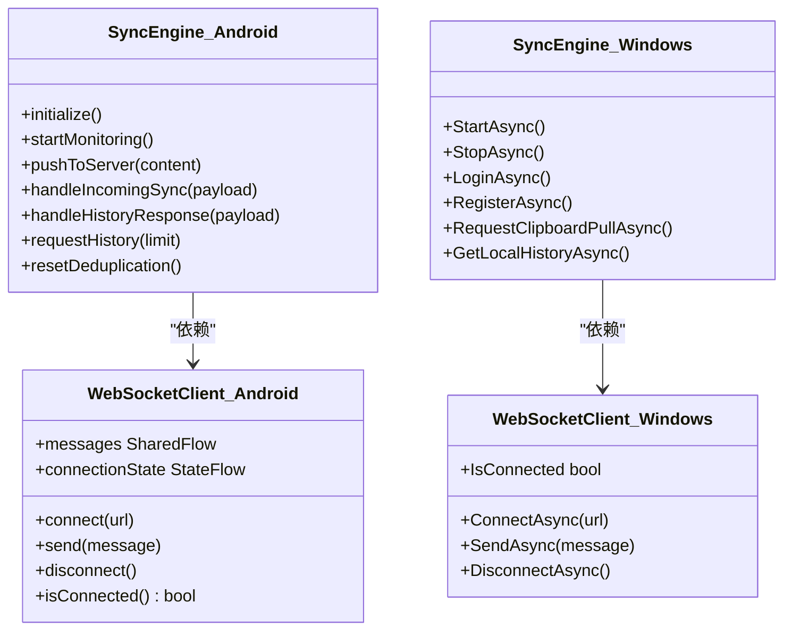
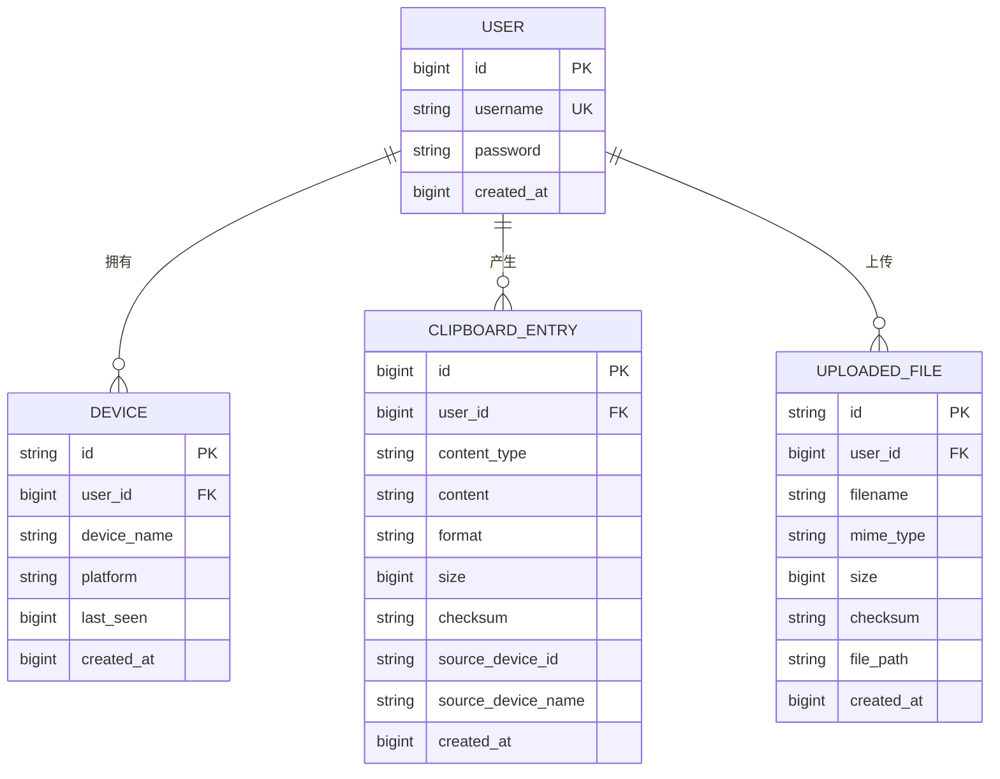
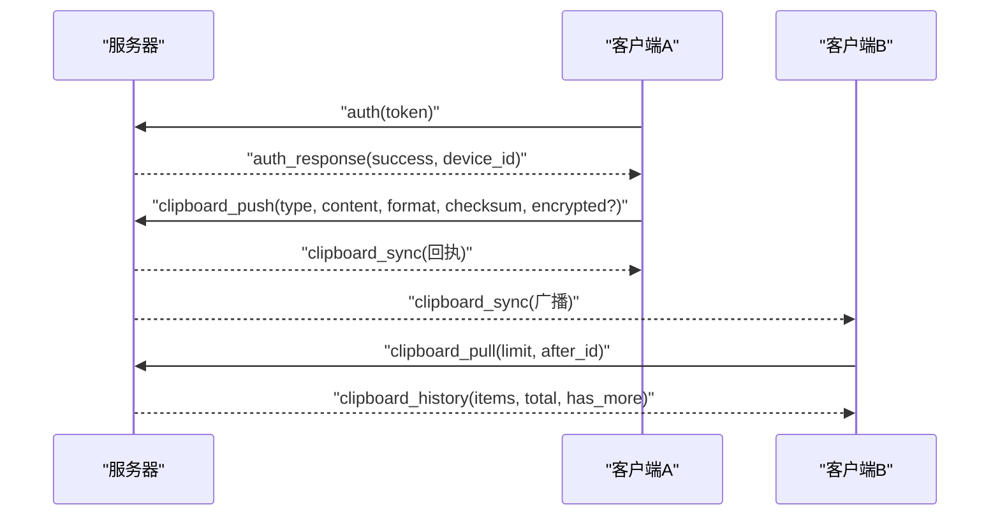
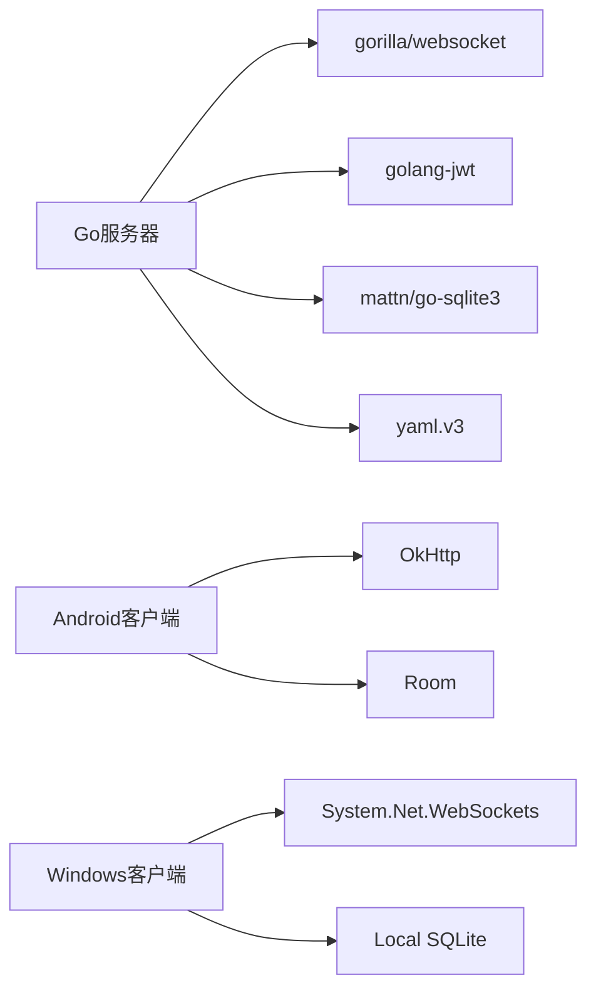

# 系统架构设计

<cite>
**本文档引用的文件**
- [clipSync-server/cmd/server/main.go](file://clipSync-server/cmd/server/main.go)
- [clipSync-server/internal/websocket/hub.go](file://clipSync-server/internal/websocket/hub.go)
- [clipSync-server/internal/websocket/client.go](file://clipSync-server/internal/websocket/client.go)
- [clipSync-server/internal/websocket/handler.go](file://clipSync-server/internal/websocket/handler.go)
- [clipSync-server/internal/httpserver/server.go](file://clipSync-server/internal/httpserver/server.go)
- [clipSync-server/pkg/protocol/messages.go](file://clipSync-server/pkg/protocol/messages.go)
- [clipSync-server/internal/database/db.go](file://clipSync-server/internal/database/db.go)
- [clipSync-server/internal/database/models.go](file://clipSync-server/internal/database/models.go)
- [clipSync-server/internal/encryption/aes.go](file://clipSync-server/internal/encryption/aes.go)
- [clipSync-server/go.mod](file://clipSync-server/go.mod)
- [clipSync-server/configs/config.yaml](file://clipSync-server/configs/config.yaml)
- [DEVELOPMENT_PLAN.md](file://DEVELOPMENT_PLAN.md)
- [protocol/http-api.schema.json](file://protocol/http-api.schema.json)
- [protocol/ws-messages.schema.json](file://protocol/ws-messages.schema.json)
- [clipSync-android/app/src/main/java/com/clipsync/app/core/SyncEngine.kt](file://clipSync-android/app/src/main/java/com/clipsync/app/core/SyncEngine.kt)
- [clipSync-android/app/src/main/java/com/clipsync/app/network/WebSocketClient.kt](file://clipSync-android/app/src/main/java/com/clipsync/app/network/WebSocketClient.kt)
- [clipSync-windows/ClipSync.WPF/Core/SyncEngine.cs](file://clipSync-windows/ClipSync.WPF/Core/SyncEngine.cs)
</cite>

## 目录
1. [引言](#引言)
2. [项目结构](#项目结构)
3. [核心组件](#核心组件)
4. [架构总览](#架构总览)
5. [详细组件分析](#详细组件分析)
6. [依赖关系分析](#依赖关系分析)
7. [性能考量](#性能考量)
8. [故障排查指南](#故障排查指南)
9. [结论](#结论)
10. [附录](#附录)

## 引言
本架构文档面向ClipSync系统，描述其三端（服务器-客户端-客户端）实时剪贴板同步方案。系统采用“协议先行”的设计，通过共享的WebSocket消息规范与HTTP API契约驱动跨平台开发与集成。服务器端基于Go实现，使用SQLite存储与WAL模式优化；客户端分别在Android与Windows平台提供原生体验，均内置去重、心跳、自动重连与可选加密能力。

## 项目结构
系统由三个主要子项目组成：
- 服务器（Go）：负责认证、设备管理、剪贴板历史、WebSocket Hub与HTTP API服务
- 客户端（Android）：Kotlin应用，使用OkHttp WebSocket、Room本地缓存与协程
- 客户端（Windows WPF）：C#应用，使用System.Net.WebSockets与本地SQLite缓存

**图表来源**
- [clipSync-server/cmd/server/main.go:19-126](file://clipSync-server/cmd/server/main.go#L19-L126)
- [clipSync-server/internal/websocket/hub.go:18-112](file://clipSync-server/internal/websocket/hub.go#L18-L112)
- [clipSync-server/internal/websocket/client.go:13-117](file://clipSync-server/internal/websocket/client.go#L13-L117)
- [clipSync-server/internal/websocket/handler.go:10-31](file://clipSync-server/internal/websocket/handler.go#L10-L31)
- [clipSync-server/internal/httpserver/server.go:10-49](file://clipSync-server/internal/httpserver/server.go#L10-L49)
- [clipSync-server/internal/database/db.go:12-56](file://clipSync-server/internal/database/db.go#L12-L56)
- [clipSync-server/internal/encryption/aes.go:16-106](file://clipSync-server/internal/encryption/aes.go#L16-L106)
- [clipSync-android/app/src/main/java/com/clipsync/app/core/SyncEngine.kt:27-250](file://clipSync-android/app/src/main/java/com/clipsync/app/core/SyncEngine.kt#L27-L250)
- [clipSync-android/app/src/main/java/com/clipsync/app/network/WebSocketClient.kt:26-156](file://clipSync-android/app/src/main/java/com/clipsync/app/network/WebSocketClient.kt#L26-L156)
- [clipSync-windows/ClipSync.WPF/Core/SyncEngine.cs:8-422](file://clipSync-windows/ClipSync.WPF/Core/SyncEngine.cs#L8-L422)

**章节来源**
- [DEVELOPMENT_PLAN.md:365-527](file://DEVELOPMENT_PLAN.md#L365-L527)

## 核心组件
- WebSocket Hub：集中管理所有客户端连接，执行鉴权、心跳超时检测、广播与去重校验
- 消息处理器：按消息类型分派到对应处理逻辑（认证、心跳、推送、拉取、设备列表、注销）
- HTTP API：登录/注册/刷新令牌、健康检查、设备管理、文件上传下载
- 数据层：SQLite（WAL模式）、用户/设备/剪贴板实体、迁移脚本
- 加密模块：AES-256-CBC（PBKDF2密钥派生），支持可选启用
- 协议模型：统一的消息结构与枚举，确保三端一致性

**章节来源**
- [clipSync-server/internal/websocket/hub.go:18-112](file://clipSync-server/internal/websocket/hub.go#L18-L112)
- [clipSync-server/internal/websocket/handler.go:10-31](file://clipSync-server/internal/websocket/handler.go#L10-L31)
- [clipSync-server/internal/httpserver/server.go:10-49](file://clipSync-server/internal/httpserver/server.go#L10-L49)
- [clipSync-server/internal/database/db.go:12-56](file://clipSync-server/internal/database/db.go#L12-L56)
- [clipSync-server/internal/encryption/aes.go:16-106](file://clipSync-server/internal/encryption/aes.go#L16-L106)
- [clipSync-server/pkg/protocol/messages.go:5-132](file://clipSync-server/pkg/protocol/messages.go#L5-L132)

## 架构总览
ClipSync采用“三端架构”：两个客户端通过WebSocket与服务器进行实时双向同步，HTTP API用于认证、设备管理与大文件传输。服务器以Hub为中心，负责消息路由与状态维护；客户端负责本地监听、去重、历史持久化与UI反馈。

**图表来源**
- [clipSync-server/cmd/server/main.go:68-115](file://clipSync-server/cmd/server/main.go#L68-L115)
- [clipSync-server/internal/websocket/hub.go:18-112](file://clipSync-server/internal/websocket/hub.go#L18-L112)
- [clipSync-server/internal/websocket/handler.go:10-31](file://clipSync-server/internal/websocket/handler.go#L10-L31)
- [clipSync-server/internal/httpserver/server.go:10-49](file://clipSync-server/internal/httpserver/server.go#L10-L49)

## 详细组件分析

### WebSocket Hub 设计
- 连接生命周期：升级HTTP为WebSocket后创建Client，注册到Hub；断开或超时则注销并关闭发送通道
- 广播策略：按用户维度过滤目标客户端，排除发送方；对阻塞发送缓冲区的客户端进行断开清理
- 心跳与超时：客户端每30秒发送心跳，服务端设置读超时；服务端主动Ping，客户端Pong回传
- 鉴权：30秒内必须完成认证，否则断开；认证成功后更新设备在线状态

**图表来源**
- [clipSync-server/internal/websocket/hub.go:182-208](file://clipSync-server/internal/websocket/hub.go#L182-L208)
- [clipSync-server/internal/websocket/client.go:34-117](file://clipSync-server/internal/websocket/client.go#L34-L117)
- [clipSync-server/internal/websocket/handler.go:34-110](file://clipSync-server/internal/websocket/handler.go#L34-L110)
- [clipSync-server/internal/websocket/handler.go:142-234](file://clipSync-server/internal/websocket/handler.go#L142-L234)

**章节来源**
- [clipSync-server/internal/websocket/hub.go:18-112](file://clipSync-server/internal/websocket/hub.go#L18-L112)
- [clipSync-server/internal/websocket/client.go:13-117](file://clipSync-server/internal/websocket/client.go#L13-L117)
- [clipSync-server/internal/websocket/handler.go:10-31](file://clipSync-server/internal/websocket/handler.go#L10-L31)

### HTTP API 架构
- 认证：登录/注册返回JWT，刷新接口续期
- 健康检查：返回运行状态、版本、运行时长与在线客户端数
- 设备管理：列出与注销设备，支持离线/在线标记
- 文件传输：大内容走HTTP上传/下载，避免WebSocket过大消息

**图表来源**
- [clipSync-server/cmd/server/main.go:68-89](file://clipSync-server/cmd/server/main.go#L68-L89)
- [protocol/http-api.schema.json:8-279](file://protocol/http-api.schema.json#L8-L279)

**章节来源**
- [clipSync-server/cmd/server/main.go:68-115](file://clipSync-server/cmd/server/main.go#L68-L115)
- [protocol/http-api.schema.json:8-279](file://protocol/http-api.schema.json#L8-L279)

### 客户端同步引擎
- Android：基于OkHttp WebSocket，协程驱动消息流；本地Room缓存剪贴板历史；去重与可选加密
- Windows：基于System.Net.WebSockets，Dispatcher线程切换设置剪贴板；本地SQLite缓存；心跳与自动重连

**图表来源**
- [clipSync-android/app/src/main/java/com/clipsync/app/core/SyncEngine.kt:27-250](file://clipSync-android/app/src/main/java/com/clipsync/app/core/SyncEngine.kt#L27-L250)
- [clipSync-android/app/src/main/java/com/clipsync/app/network/WebSocketClient.kt:26-156](file://clipSync-android/app/src/main/java/com/clipsync/app/network/WebSocketClient.kt#L26-L156)
- [clipSync-windows/ClipSync.WPF/Core/SyncEngine.cs:8-422](file://clipSync-windows/ClipSync.WPF/Core/SyncEngine.cs#L8-L422)

**章节来源**
- [clipSync-android/app/src/main/java/com/clipsync/app/core/SyncEngine.kt:27-250](file://clipSync-android/app/src/main/java/com/clipsync/app/core/SyncEngine.kt#L27-L250)
- [clipSync-android/app/src/main/java/com/clipsync/app/network/WebSocketClient.kt:26-156](file://clipSync-android/app/src/main/java/com/clipsync/app/network/WebSocketClient.kt#L26-L156)
- [clipSync-windows/ClipSync.WPF/Core/SyncEngine.cs:8-422](file://clipSync-windows/ClipSync.WPF/Core/SyncEngine.cs#L8-L422)

### 数据模型与存储
- 用户、设备、剪贴板条目、上传文件等模型定义清晰，支持按用户隔离与历史上限控制
- SQLite使用WAL模式提升并发读性能，连接池参数针对2核2G服务器优化

**图表来源**
- [clipSync-server/internal/database/models.go:3-46](file://clipSync-server/internal/database/models.go#L3-L46)
- [clipSync-server/internal/database/db.go:17-56](file://clipSync-server/internal/database/db.go#L17-L56)

**章节来源**
- [clipSync-server/internal/database/models.go:3-46](file://clipSync-server/internal/database/models.go#L3-L46)
- [clipSync-server/internal/database/db.go:17-56](file://clipSync-server/internal/database/db.go#L17-L56)

### 协议与消息流
- 统一的WebSocket消息封装包含类型、版本、时间戳与载荷；服务端定义了认证、心跳、剪贴板推送/同步/拉取、设备列表、错误等消息类型
- HTTP API契约明确各端请求/响应字段与错误码映射

**图表来源**
- [clipSync-server/pkg/protocol/messages.go:5-132](file://clipSync-server/pkg/protocol/messages.go#L5-L132)
- [protocol/ws-messages.schema.json:8-261](file://protocol/ws-messages.schema.json#L8-L261)
- [protocol/http-api.schema.json:8-279](file://protocol/http-api.schema.json#L8-L279)

**章节来源**
- [clipSync-server/pkg/protocol/messages.go:5-132](file://clipSync-server/pkg/protocol/messages.go#L5-L132)
- [protocol/ws-messages.schema.json:8-261](file://protocol/ws-messages.schema.json#L8-L261)
- [protocol/http-api.schema.json:8-279](file://protocol/http-api.schema.json#L8-L279)

## 依赖关系分析
- 服务器依赖
  - gorilla/websocket：WebSocket协议实现
  - golang-jwt：JWT令牌生成与解析
  - mattn/go-sqlite3：SQLite驱动
  - gopkg.in/yaml.v3：配置文件解析
- 客户端依赖
  - Android：OkHttp（WebSocket）、Room（数据库）、协程（异步）
  - Windows：System.Net.WebSockets、Dispatcher（UI线程）

**图表来源**
- [clipSync-server/go.mod:5-11](file://clipSync-server/go.mod#L5-L11)

**章节来源**
- [clipSync-server/go.mod:5-11](file://clipSync-server/go.mod#L5-L11)

## 性能考量
- 服务器
  - SQLite WAL模式与连接池参数针对2核2G服务器优化，建议在生产环境按负载调整最大连接数
  - Hub使用select循环与RWMutex保护，广播时对阻塞客户端进行清理，避免内存膨胀
  - 心跳超时与Ping/Pong机制降低无效连接占用
- 客户端
  - Android使用背压缓冲与SharedFlow，避免消息堆积
  - Windows在STA线程中操作剪贴板，避免跨线程异常
- 可扩展性
  - 当前为单实例；若需水平扩展，建议引入Redis作为Hub间共享状态或消息队列，并在网关层做会话粘性

[本节为通用性能讨论，无需特定文件引用]

## 故障排查指南
- 认证失败/过期
  - 检查HTTP认证流程与JWT签名密钥；确认刷新令牌接口可用
- 连接断开/心跳超时
  - 核对客户端心跳间隔与服务端读超时配置；查看服务端日志中的AUTH_TIMEOUT与连接计数
- 消息重复/未同步
  - 检查客户端去重逻辑（checksum）与服务端重复校验；确认广播排除发送方
- 文件上传失败
  - 检查HTTP上传大小限制与校验和；确认文件存储目录权限
- 加密问题
  - 确认客户端与服务端加密开关一致；检查密钥派生参数与格式

**章节来源**
- [clipSync-server/internal/websocket/hub.go:197-204](file://clipSync-server/internal/websocket/hub.go#L197-L204)
- [clipSync-server/internal/websocket/handler.go:162-172](file://clipSync-server/internal/websocket/handler.go#L162-L172)
- [clipSync-server/configs/config.yaml:21-28](file://clipSync-server/configs/config.yaml#L21-L28)
- [clipSync-server/internal/encryption/aes.go:25-106](file://clipSync-server/internal/encryption/aes.go#L25-L106)

## 结论
ClipSync通过“协议即契约”的方式实现了三端无缝协作：服务器提供稳定Hub与HTTP API，客户端专注本地体验与数据安全。系统具备良好的可扩展性与可维护性，适合在资源受限环境中运行，并可通过引入外部缓存/消息中间件进一步扩展。

[本节为总结性内容，无需特定文件引用]

## 附录

### 技术栈与版本兼容
- 服务器
  - Go 1.26.2
  - gorilla/websocket v1.5.3
  - golang-jwt v5.3.1
  - mattn/go-sqlite3 v1.14.42
  - golang.org/x/crypto v0.50.0
  - gopkg.in/yaml.v3 v3.0.1
- 客户端
  - Android：OkHttp、Room、协程
  - Windows：System.Net.WebSockets、Dispatcher、SQLite

**章节来源**
- [clipSync-server/go.mod:3-11](file://clipSync-server/go.mod#L3-L11)

### 基础设施与部署拓扑
- 单实例部署建议
  - 2核CPU、2GB内存、SSD存储
  - 开放端口：WebSocket 8080、HTTP 8081
  - 配置文件：JWT密钥、数据库路径、文件存储目录、心跳超时
- 可扩展部署
  - 多实例+Redis（可选）+反向代理（Nginx/HAProxy）
  - 使用容器编排（Docker/K8s）与健康检查

**章节来源**
- [DEVELOPMENT_PLAN.md:789-797](file://DEVELOPMENT_PLAN.md#L789-L797)
- [clipSync-server/configs/config.yaml:3-28](file://clipSync-server/configs/config.yaml#L3-L28)

### 安全性、监控与灾备
- 安全性
  - JWT令牌保护WebSocket与HTTP API；可选AES-256-CBC加密
  - 服务端强制认证时限与心跳超时；错误码标准化
- 监控
  - 健康检查端点返回运行状态与在线客户端数
  - 日志记录连接/断开/错误事件
- 灾难恢复
  - SQLite WAL模式提升可靠性；定期备份数据目录
  - 客户端本地历史缓存保证离线可用

**章节来源**
- [clipSync-server/cmd/server/main.go:77-78](file://clipSync-server/cmd/server/main.go#L77-L78)
- [clipSync-server/internal/httpserver/server.go:26-40](file://clipSync-server/internal/httpserver/server.go#L26-L40)
- [clipSync-server/internal/encryption/aes.go:25-106](file://clipSync-server/internal/encryption/aes.go#L25-L106)