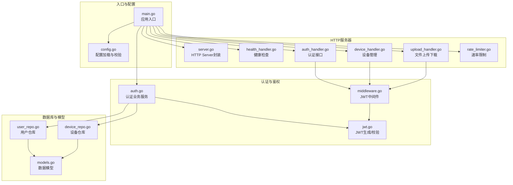
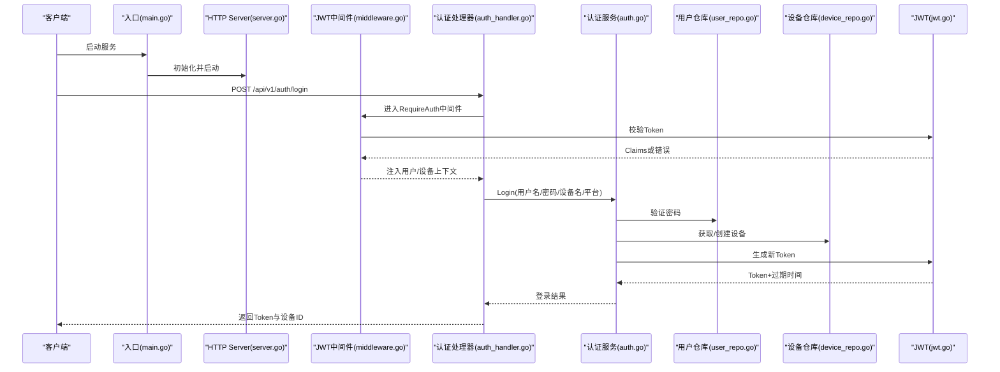
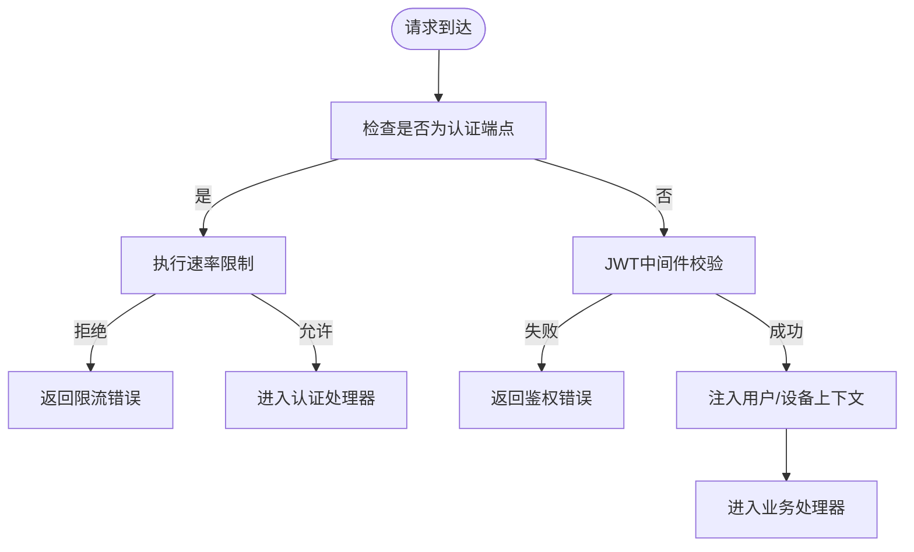
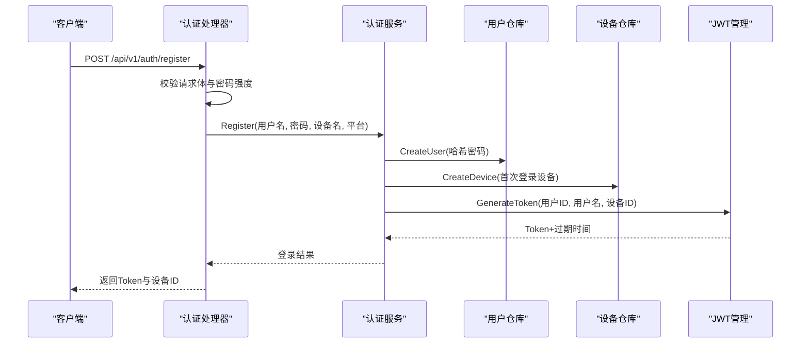
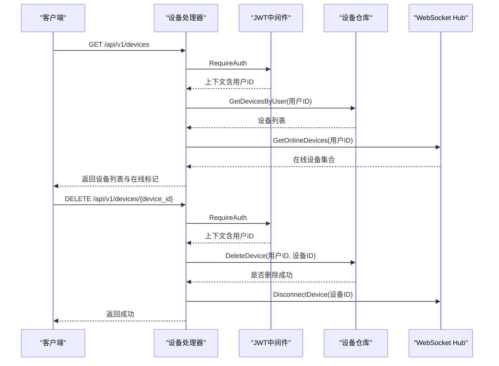
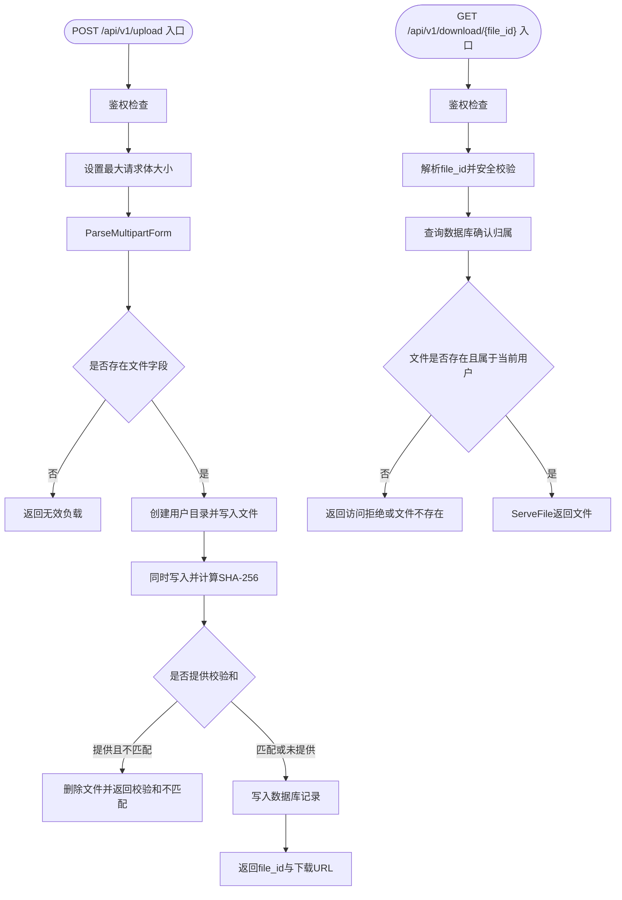
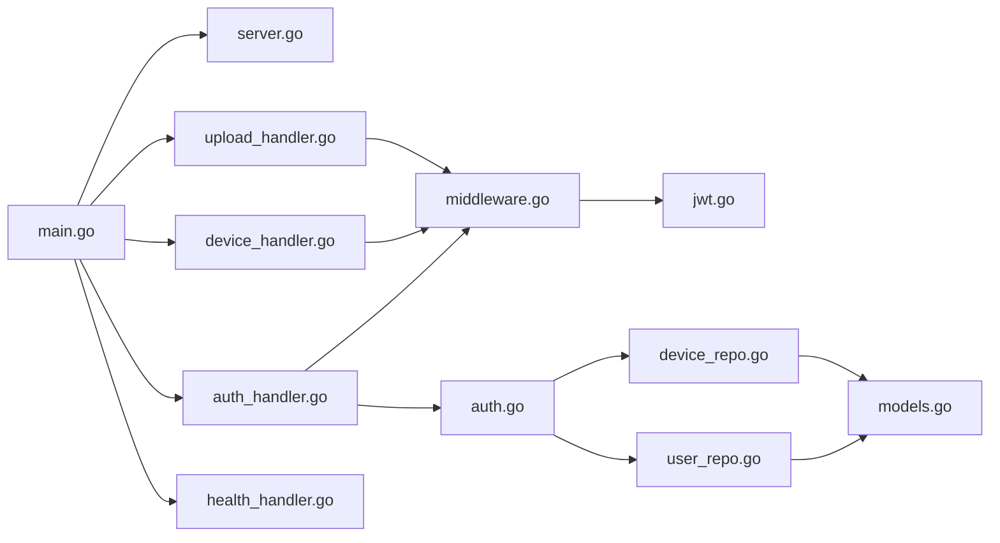

# HTTP服务器组件

<cite>
**本文引用的文件**
- [main.go](file://clipSync-server/cmd/server/main.go)
- [server.go](file://clipSync-server/internal/httpserver/server.go)
- [auth_handler.go](file://clipSync-server/internal/httpserver/auth_handler.go)
- [device_handler.go](file://clipSync-server/internal/httpserver/device_handler.go)
- [upload_handler.go](file://clipSync-server/internal/httpserver/upload_handler.go)
- [health_handler.go](file://clipSync-server/internal/httpserver/health_handler.go)
- [middleware.go](file://clipSync-server/internal/auth/middleware.go)
- [jwt.go](file://clipSync-server/internal/auth/jwt.go)
- [auth.go](file://clipSync-server/internal/auth/auth.go)
- [config.go](file://clipSync-server/internal/config/config.go)
- [models.go](file://clipSync-server/internal/database/models.go)
- [device_repo.go](file://clipSync-server/internal/database/device_repo.go)
- [user_repo.go](file://clipSync-server/internal/database/user_repo.go)
- [rate_limiter.go](file://clipSync-server/internal/httpserver/rate_limiter.go)
</cite>

## 目录
1. [简介](#简介)
2. [项目结构](#项目结构)
3. [核心组件](#核心组件)
4. [架构总览](#架构总览)
5. [详细组件分析](#详细组件分析)
6. [依赖分析](#依赖分析)
7. [性能考量](#性能考量)
8. [故障排查指南](#故障排查指南)
9. [结论](#结论)
10. [附录](#附录)

## 简介
本文件面向HTTP服务器组件，系统化梳理其路由设计与中间件架构，深入解析认证处理器的JWT令牌验证流程与用户设备关联机制，解释设备管理处理器的RESTful API设计（含设备注册、注销与状态查询），记录文件上传处理器的实现细节（文件验证、存储与访问控制），并提供统一的错误处理策略、响应格式标准化与API版本管理建议。同时给出安全考虑、性能优化与扩展性设计要点。

## 项目结构
HTTP服务器位于Go后端子模块中，采用按功能分层组织：入口程序负责初始化配置、数据库、仓库层、认证服务与中间件，并构建HTTP路由；各处理器封装具体业务接口；认证模块提供JWT生成与校验、上下文注入；数据库层提供用户与设备等实体的持久化能力；配置模块集中管理运行参数。

**图表来源**
- [main.go:21-146](file://clipSync-server/cmd/server/main.go#L21-L146)
- [server.go:11-50](file://clipSync-server/internal/httpserver/server.go#L11-L50)
- [auth_handler.go:11-215](file://clipSync-server/internal/httpserver/auth_handler.go#L11-L215)
- [device_handler.go:11-137](file://clipSync-server/internal/httpserver/device_handler.go#L11-L137)
- [upload_handler.go:19-221](file://clipSync-server/internal/httpserver/upload_handler.go#L19-L221)
- [health_handler.go:10-55](file://clipSync-server/internal/httpserver/health_handler.go#L10-L55)
- [middleware.go:22-111](file://clipSync-server/internal/auth/middleware.go#L22-L111)
- [jwt.go:18-76](file://clipSync-server/internal/auth/jwt.go#L18-L76)
- [auth.go:8-137](file://clipSync-server/internal/auth/auth.go#L8-L137)
- [config.go:10-72](file://clipSync-server/internal/config/config.go#L10-L72)
- [models.go:3-46](file://clipSync-server/internal/database/models.go#L3-L46)
- [user_repo.go:11-91](file://clipSync-server/internal/database/user_repo.go#L11-L91)
- [device_repo.go:11-126](file://clipSync-server/internal/database/device_repo.go#L11-L126)
- [rate_limiter.go:9-85](file://clipSync-server/internal/httpserver/rate_limiter.go#L9-L85)

**章节来源**
- [main.go:21-146](file://clipSync-server/cmd/server/main.go#L21-L146)
- [config.go:38-72](file://clipSync-server/internal/config/config.go#L38-L72)

## 核心组件
- HTTP服务器封装：提供启动、优雅关闭与超时配置。
- 路由与中间件：基于标准库ServeMux构建，结合JWT中间件与速率限制中间件。
- 认证处理器：登录、注册、刷新，含请求体校验与错误响应。
- 设备管理处理器：列出设备、删除设备，结合WebSocket Hub在线状态。
- 文件上传处理器：多部分表单解析、大小限制、校验和比对、数据库记录与文件落盘。
- 健康检查处理器：返回版本、运行时间、连接客户端数与数据库状态。
- 配置模块：默认值、环境覆盖、生产安全警告。
- 数据模型与仓库：用户、设备、剪贴板条目、已上传文件的结构与操作。

**章节来源**
- [server.go:11-50](file://clipSync-server/internal/httpserver/server.go#L11-L50)
- [auth_handler.go:11-215](file://clipSync-server/internal/httpserver/auth_handler.go#L11-L215)
- [device_handler.go:11-137](file://clipSync-server/internal/httpserver/device_handler.go#L11-L137)
- [upload_handler.go:19-221](file://clipSync-server/internal/httpserver/upload_handler.go#L19-L221)
- [health_handler.go:10-55](file://clipSync-server/internal/httpserver/health_handler.go#L10-L55)
- [config.go:23-72](file://clipSync-server/internal/config/config.go#L23-L72)
- [models.go:3-46](file://clipSync-server/internal/database/models.go#L3-L46)

## 架构总览
HTTP服务器通过入口程序完成依赖注入与路由装配，认证中间件在进入业务处理器前进行JWT校验并将用户/设备信息写入请求上下文。设备管理与文件上传均依赖该中间件确保鉴权。WebSocket服务器独立于HTTP，用于实时同步。

**图表来源**
- [main.go:74-84](file://clipSync-server/cmd/server/main.go#L74-L84)
- [server.go:27-41](file://clipSync-server/internal/httpserver/server.go#L27-L41)
- [middleware.go:32-61](file://clipSync-server/internal/auth/middleware.go#L32-L61)
- [auth_handler.go:63-109](file://clipSync-server/internal/httpserver/auth_handler.go#L63-L109)
- [auth.go:67-116](file://clipSync-server/internal/auth/auth.go#L67-L116)
- [user_repo.go:65-80](file://clipSync-server/internal/database/user_repo.go#L65-L80)
- [device_repo.go:21-42](file://clipSync-server/internal/database/device_repo.go#L21-L42)
- [jwt.go:32-55](file://clipSync-server/internal/auth/jwt.go#L32-L55)

## 详细组件分析

### 路由与中间件架构
- 路由装配：使用标准库ServeMux注册各端点，认证相关端点使用速率限制中间件，其余受JWT中间件保护。
- 速率限制：基于IP的滑动窗口计数器，支持自动清理过期条目。
- JWT中间件：从Authorization头提取Bearer Token，校验失败直接返回JSON错误；成功则将用户ID、用户名、设备ID写入上下文供后续处理器使用。

**图表来源**
- [main.go:77-98](file://clipSync-server/cmd/server/main.go#L77-L98)
- [rate_limiter.go:34-85](file://clipSync-server/internal/httpserver/rate_limiter.go#L34-L85)
- [middleware.go:32-61](file://clipSync-server/internal/auth/middleware.go#L32-L61)

**章节来源**
- [main.go:74-98](file://clipSync-server/cmd/server/main.go#L74-L98)
- [rate_limiter.go:9-85](file://clipSync-server/internal/httpserver/rate_limiter.go#L9-L85)
- [middleware.go:22-111](file://clipSync-server/internal/auth/middleware.go#L22-L111)

### 认证处理器与JWT令牌验证流程
- 请求体校验：用户名/密码/设备名/平台非空检查；注册场景进一步校验用户名长度与密码强度。
- 登录流程：验证凭据、查找或创建设备、生成JWT并返回Token与过期时间。
- 注册流程：检查用户名唯一性、创建用户、创建设备、生成JWT。
- 刷新流程：从Authorization头提取Token，校验通过后重新签发新Token。
- 错误处理：针对无效凭据、用户名冲突、内部错误、未授权等场景返回标准化JSON。

**图表来源**
- [auth_handler.go:111-175](file://clipSync-server/internal/httpserver/auth_handler.go#L111-L175)
- [auth.go:32-65](file://clipSync-server/internal/auth/auth.go#L32-L65)
- [user_repo.go:21-47](file://clipSync-server/internal/database/user_repo.go#L21-L47)
- [device_repo.go:21-42](file://clipSync-server/internal/database/device_repo.go#L21-L42)
- [jwt.go:32-55](file://clipSync-server/internal/auth/jwt.go#L32-L55)

**章节来源**
- [auth_handler.go:21-215](file://clipSync-server/internal/httpserver/auth_handler.go#L21-L215)
- [auth.go:32-116](file://clipSync-server/internal/auth/auth.go#L32-L116)
- [jwt.go:18-76](file://clipSync-server/internal/auth/jwt.go#L18-L76)

### 设备管理处理器（RESTful API）
- 列出设备：需鉴权，查询用户所有设备并标注在线状态（基于WebSocket Hub）。
- 删除设备：需鉴权，支持路径参数或回退解析；删除后尝试断开当前在线连接。
- 在线状态：通过Hub提供的在线设备集合判断，避免额外数据库查询。

**图表来源**
- [device_handler.go:25-82](file://clipSync-server/internal/httpserver/device_handler.go#L25-L82)
- [device_handler.go:84-137](file://clipSync-server/internal/httpserver/device_handler.go#L84-L137)
- [middleware.go:63-74](file://clipSync-server/internal/auth/middleware.go#L63-L74)
- [device_repo.go:60-106](file://clipSync-server/internal/database/device_repo.go#L60-L106)

**章节来源**
- [device_handler.go:11-137](file://clipSync-server/internal/httpserver/device_handler.go#L11-L137)
- [device_repo.go:11-126](file://clipSync-server/internal/database/device_repo.go#L11-L126)

### 文件上传处理器（验证、存储与访问控制）
- 上传流程：鉴权后限制请求体大小，解析multipart/form-data，读取文件与可选校验和；并发写入磁盘与计算SHA-256；若提供校验和则比对不一致则回滚并报错；记录元数据到数据库。
- 下载流程：鉴权后解析file_id，安全校验防止路径穿越；查询数据库确认归属；检查文件存在且为文件；返回静态文件。
- 存储策略：按用户ID建立子目录隔离；文件名包含时间戳片段以降低碰撞概率；校验和用于完整性保障。

**图表来源**
- [upload_handler.go:36-150](file://clipSync-server/internal/httpserver/upload_handler.go#L36-L150)
- [upload_handler.go:152-214](file://clipSync-server/internal/httpserver/upload_handler.go#L152-L214)
- [middleware.go:63-74](file://clipSync-server/internal/auth/middleware.go#L63-L74)

**章节来源**
- [upload_handler.go:19-221](file://clipSync-server/internal/httpserver/upload_handler.go#L19-L221)

### 健康检查处理器
- 提供GET /api/v1/health，返回服务状态、版本、运行时长、在线客户端数量与数据库连通性状态。

**章节来源**
- [health_handler.go:28-54](file://clipSync-server/internal/httpserver/health_handler.go#L28-L54)

## 依赖分析
- 组件耦合：HTTP处理器依赖认证中间件与仓库层；认证服务依赖用户/设备仓库与JWT管理；入口程序负责组装依赖并注册路由。
- 外部依赖：标准库net/http、crypto/sha256、bcrypt、golang-jwt等。
- 潜在循环依赖：当前结构清晰，未发现循环导入。

**图表来源**
- [main.go:61-69](file://clipSync-server/cmd/server/main.go#L61-L69)
- [auth_handler.go:3-9](file://clipSync-server/internal/httpserver/auth_handler.go#L3-L9)
- [device_handler.go:3-9](file://clipSync-server/internal/httpserver/device_handler.go#L3-L9)
- [upload_handler.go:3-17](file://clipSync-server/internal/httpserver/upload_handler.go#L3-L17)
- [middleware.go:23-30](file://clipSync-server/internal/auth/middleware.go#L23-L30)
- [auth.go:8-22](file://clipSync-server/internal/auth/auth.go#L8-L22)
- [user_repo.go:11-19](file://clipSync-server/internal/database/user_repo.go#L11-L19)
- [device_repo.go:11-19](file://clipSync-server/internal/database/device_repo.go#L11-L19)
- [models.go:3-46](file://clipSync-server/internal/database/models.go#L3-L46)

**章节来源**
- [main.go:61-69](file://clipSync-server/cmd/server/main.go#L61-L69)

## 性能考量
- 超时配置：HTTP服务器设置读取、写入与空闲超时，避免资源占用。
- 速率限制：对认证端点施加IP级滑动窗口限流，缓解暴力破解与爬虫压力。
- 文件上传：使用MaxBytesReader限制请求体大小，避免内存溢出；并发写入与哈希计算，提升吞吐。
- 在线状态：设备在线标记来自WebSocket Hub，避免重复查询数据库。
- 扩展建议：引入连接池与缓存（如Redis）加速鉴权与设备查询；对热点接口增加本地缓存；上传文件可考虑CDN或对象存储。

**章节来源**
- [server.go:27-34](file://clipSync-server/internal/httpserver/server.go#L27-L34)
- [rate_limiter.go:22-32](file://clipSync-server/internal/httpserver/rate_limiter.go#L22-L32)
- [upload_handler.go:52-53](file://clipSync-server/internal/httpserver/upload_handler.go#L52-L53)

## 故障排查指南
- 鉴权失败：检查Authorization头格式是否为Bearer Token；确认JWT密钥与过期时间配置；查看中间件错误响应。
- 速率限制触发：确认同一IP短时间内请求过多；调整限流阈值或白名单。
- 文件上传失败：检查请求体大小是否超过限制；确认multipart字段命名与校验和一致性；查看数据库插入错误与文件删除回滚逻辑。
- 设备删除失败：确认设备ID与用户绑定关系；检查WebSocket Hub断开逻辑。
- 健康检查异常：核对数据库连接字符串与权限；关注Hub客户端计数变化。

**章节来源**
- [middleware.go:32-61](file://clipSync-server/internal/auth/middleware.go#L32-L61)
- [rate_limiter.go:71-85](file://clipSync-server/internal/httpserver/rate_limiter.go#L71-L85)
- [upload_handler.go:52-143](file://clipSync-server/internal/httpserver/upload_handler.go#L52-L143)
- [device_handler.go:100-136](file://clipSync-server/internal/httpserver/device_handler.go#L100-L136)
- [health_handler.go:28-54](file://clipSync-server/internal/httpserver/health_handler.go#L28-L54)

## 结论
该HTTP服务器组件以清晰的分层与中间件机制实现了认证、设备管理与文件上传的核心能力。JWT中间件统一注入用户上下文，路由层通过速率限制与鉴权保障安全与稳定性。建议在生产环境中强化密钥管理、缩短JWT有效期、引入缓存与CDN，并持续监控健康指标与日志。

## 附录

### API版本管理建议
- 当前路由采用/v1前缀，便于未来演进。
- 建议在入口处统一注入版本号并在响应头或响应体中体现，便于客户端兼容与灰度发布。

**章节来源**
- [main.go:19](file://clipSync-server/cmd/server/main.go#L19)
- [main.go:47-54](file://clipSync-server/cmd/server/main.go#L47-L54)

### 安全考虑
- 密钥与配置：默认密钥仅用于开发，生产必须替换；JWT有效期建议不超过30天。
- 请求限制：启用MaxBytesReader与速率限制；对路径参数进行严格校验。
- 访问控制：所有受保护端点均需通过JWT中间件；文件下载严格校验归属。
- 日志与审计：记录关键事件与错误，避免敏感信息泄露。

**章节来源**
- [config.go:57-71](file://clipSync-server/internal/config/config.go#L57-L71)
- [upload_handler.go:175-182](file://clipSync-server/internal/httpserver/upload_handler.go#L175-L182)