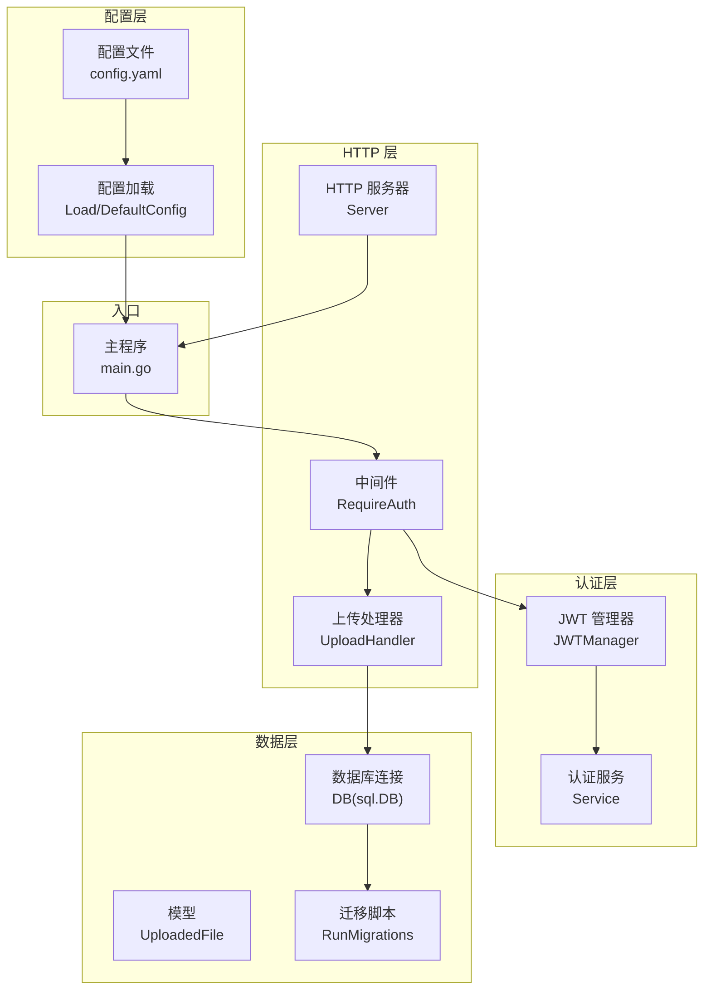
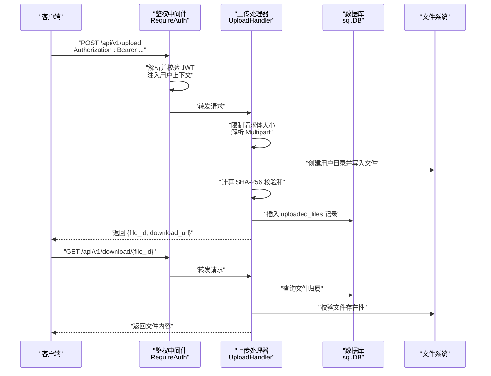
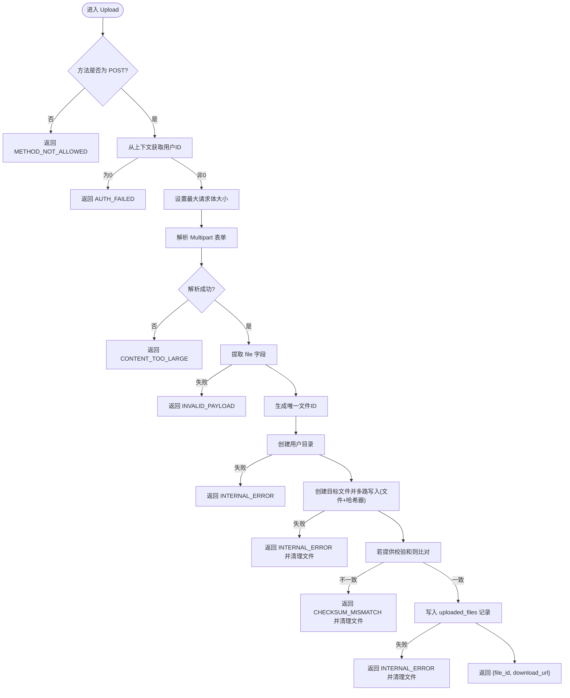
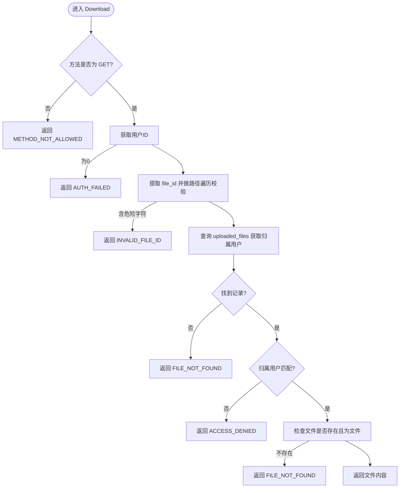
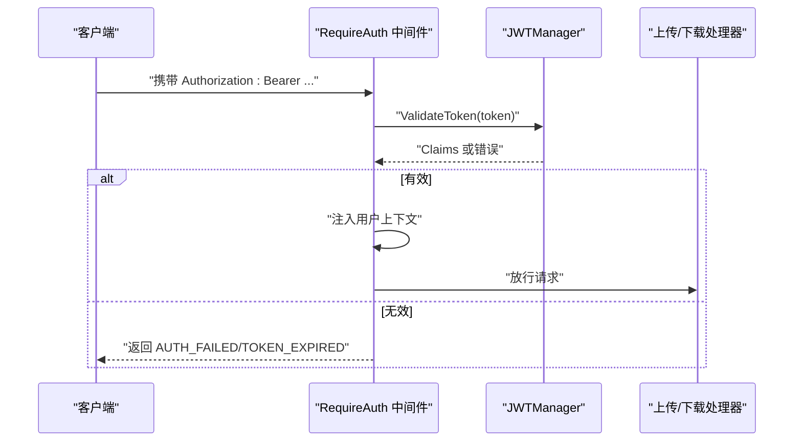
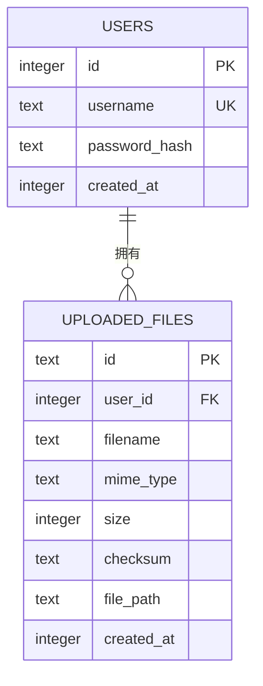
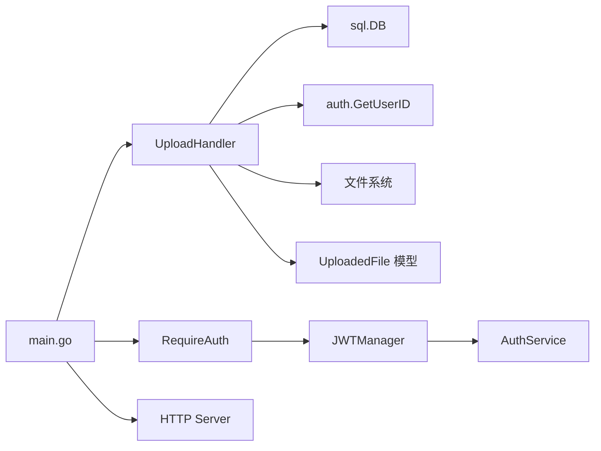

# 文件上传处理器

<cite>
**本文引用的文件**
- [upload_handler.go](file://clipSync-server/internal/httpserver/upload_handler.go)
- [server.go](file://clipSync-server/internal/httpserver/server.go)
- [middleware.go](file://clipSync-server/internal/auth/middleware.go)
- [jwt.go](file://clipSync-server/internal/auth/jwt.go)
- [auth.go](file://clipSync-server/internal/auth/auth.go)
- [models.go](file://clipSync-server/internal/database/models.go)
- [db.go](file://clipSync-server/internal/database/db.go)
- [migrations.go](file://clipSync-server/internal/database/migrations.go)
- [config.go](file://clipSync-server/internal/config/config.go)
- [config.yaml](file://clipSync-server/configs/config.yaml)
- [main.go](file://clipSync-server/cmd/server/main.go)
- [rate_limiter.go](file://clipSync-server/internal/httpserver/rate_limiter.go)
</cite>

## 目录
1. [简介](#简介)
2. [项目结构](#项目结构)
3. [核心组件](#核心组件)
4. [架构总览](#架构总览)
5. [详细组件分析](#详细组件分析)
6. [依赖关系分析](#依赖关系分析)
7. [性能考虑](#性能考虑)
8. [故障排查指南](#故障排查指南)
9. [结论](#结论)
10. [附录](#附录)

## 简介
本文件上传处理器为 ClipSync 服务端的核心模块之一，负责提供安全、可靠的文件上传与下载能力。其 RESTful API 设计遵循统一的鉴权与错误响应规范，采用 Multipart 表单接收文件流，结合 SHA-256 校验确保数据完整性，并通过用户隔离目录实现文件存储与访问控制。同时，系统具备请求体大小限制、路径遍历防护、数据库记录落盘等关键机制，满足生产环境对安全性与可维护性的要求。

## 项目结构
围绕文件上传功能的关键文件组织如下：
- HTTP 层：路由注册、鉴权中间件、上传/下载处理器
- 认证层：JWT 签发与校验、上下文注入
- 数据层：SQLite 模型与迁移、连接池与 WAL 模式优化
- 配置层：默认配置、YAML 加载与运行时校验
- 入口：主程序装配路由、启动 HTTP 与 WebSocket 服务

图表来源
- [main.go:74-106](file://clipSync-server/cmd/server/main.go#L74-L106)
- [upload_handler.go:19-34](file://clipSync-server/internal/httpserver/upload_handler.go#L19-L34)
- [middleware.go:22-61](file://clipSync-server/internal/auth/middleware.go#L22-L61)
- [jwt.go:18-55](file://clipSync-server/internal/auth/jwt.go#L18-L55)
- [models.go:35-45](file://clipSync-server/internal/database/models.go#L35-L45)
- [migrations.go:8-113](file://clipSync-server/internal/database/migrations.go#L8-L113)
- [config.go:38-55](file://clipSync-server/internal/config/config.go#L38-L55)
- [config.yaml:1-29](file://clipSync-server/configs/config.yaml#L1-L29)
- [server.go:18-41](file://clipSync-server/internal/httpserver/server.go#L18-L41)

章节来源
- [main.go:74-106](file://clipSync-server/cmd/server/main.go#L74-L106)
- [config.go:23-36](file://clipSync-server/internal/config/config.go#L23-L36)
- [config.yaml:18-22](file://clipSync-server/configs/config.yaml#L18-L22)

## 核心组件
- 上传处理器 UploadHandler
  - 负责 /api/v1/upload（POST）与 /api/v1/download/{file_id}（GET）
  - 实现请求体大小限制、Multipart 解析、文件写入与 SHA-256 校验、数据库记录落盘
- 鉴权中间件 Middleware
  - 基于 Bearer Token 的 RequireAuth 中间件，将用户信息注入请求上下文
- JWT 管理器 JWTManager
  - 生成与校验 JWT，携带用户 ID、用户名、设备 ID
- 数据库与模型
  - SQLite 连接池与 WAL 模式优化；uploaded_files 表记录文件元数据
- 配置与入口
  - YAML 配置加载与默认值；主程序装配路由并启动服务

章节来源
- [upload_handler.go:19-34](file://clipSync-server/internal/httpserver/upload_handler.go#L19-L34)
- [middleware.go:22-61](file://clipSync-server/internal/auth/middleware.go#L22-L61)
- [jwt.go:18-55](file://clipSync-server/internal/auth/jwt.go#L18-L55)
- [models.go:35-45](file://clipSync-server/internal/database/models.go#L35-L45)
- [db.go:17-56](file://clipSync-server/internal/database/db.go#L17-L56)
- [config.go:38-55](file://clipSync-server/internal/config/config.go#L38-L55)
- [config.yaml:18-22](file://clipSync-server/configs/config.yaml#L18-L22)

## 架构总览
文件上传与下载的端到端流程如下：

图表来源
- [main.go:95-98](file://clipSync-server/cmd/server/main.go#L95-L98)
- [middleware.go:32-61](file://clipSync-server/internal/auth/middleware.go#L32-L61)
- [upload_handler.go:36-150](file://clipSync-server/internal/httpserver/upload_handler.go#L36-L150)
- [upload_handler.go:152-214](file://clipSync-server/internal/httpserver/upload_handler.go#L152-L214)

## 详细组件分析

### 上传处理器 UploadHandler
- 职责
  - 接收 Multipart 表单中的文件字段
  - 限制最大上传大小
  - 同步写入磁盘并计算 SHA-256 校验和
  - 将文件元数据写入数据库
  - 返回可下载链接
- 关键点
  - 请求体大小限制：使用 MaxBytesReader 与 ParseMultipartForm 双重保障
  - 用户隔离存储：按用户 ID 创建子目录，避免跨用户访问
  - 完整性校验：支持客户端提供的校验和比对，不一致则回滚删除
  - 错误处理：针对鉴权失败、参数无效、IO 错误、数据库异常分别返回标准化错误码

图表来源
- [upload_handler.go:36-150](file://clipSync-server/internal/httpserver/upload_handler.go#L36-L150)

章节来源
- [upload_handler.go:36-150](file://clipSync-server/internal/httpserver/upload_handler.go#L36-L150)

### 下载处理器 UploadHandler.Download
- 职责
  - 根据 file_id 返回文件内容
  - 强制鉴权与访问控制：仅允许文件所属用户下载
  - 路径遍历防护：禁止包含 /、\、.. 等危险字符
- 关键点
  - 通过数据库确认文件归属
  - 组合用户目录与文件 ID 定位真实文件路径
  - 使用标准文件服务返回内容

图表来源
- [upload_handler.go:152-214](file://clipSync-server/internal/httpserver/upload_handler.go#L152-L214)

章节来源
- [upload_handler.go:152-214](file://clipSync-server/internal/httpserver/upload_handler.go#L152-L214)

### 鉴权与权限验证
- 中间件 RequireAuth
  - 从 Authorization 头解析 Bearer Token
  - 校验格式与有效性，失败返回标准化错误
  - 将用户 ID、用户名、设备 ID 注入请求上下文
- JWT 管理器 JWTManager
  - 生成带过期时间的签名令牌
  - 校验令牌合法性并解析声明
- 权限验证
  - 上传/下载均需通过 RequireAuth
  - 下载阶段进一步校验文件归属用户

图表来源
- [middleware.go:32-61](file://clipSync-server/internal/auth/middleware.go#L32-L61)
- [jwt.go:57-75](file://clipSync-server/internal/auth/jwt.go#L57-L75)

章节来源
- [middleware.go:32-61](file://clipSync-server/internal/auth/middleware.go#L32-L61)
- [jwt.go:57-75](file://clipSync-server/internal/auth/jwt.go#L57-L75)

### 数据模型与存储策略
- 数据模型 UploadedFile
  - 字段：id、user_id、filename、mime_type、size、checksum、file_path、created_at
- 存储策略
  - 文件系统：以用户 ID 为子目录，文件名即文件 ID
  - 数据库：记录文件元数据，便于检索与权限校验
- 迁移脚本
  - 初始化 uploaded_files 表及索引，确保查询效率

图表来源
- [models.go:35-45](file://clipSync-server/internal/database/models.go#L35-L45)
- [migrations.go:65-78](file://clipSync-server/internal/database/migrations.go#L65-L78)

章节来源
- [models.go:35-45](file://clipSync-server/internal/database/models.go#L35-L45)
- [migrations.go:65-78](file://clipSync-server/internal/database/migrations.go#L65-L78)

### 配置与初始化
- 默认配置
  - HTTP/WS 端口、数据库路径、JWT 密钥与过期时间、文件存储路径、最大文件大小、历史条数、心跳超时
- 配置加载
  - 优先读取 YAML，未提供时使用默认值
- 主程序装配
  - 初始化数据库与迁移
  - 注册上传/下载路由并绑定鉴权中间件
  - 启动 HTTP 与 WebSocket 服务

章节来源
- [config.go:23-36](file://clipSync-server/internal/config/config.go#L23-L36)
- [config.yaml:18-22](file://clipSync-server/configs/config.yaml#L18-L22)
- [main.go:44-54](file://clipSync-server/cmd/server/main.go#L44-L54)
- [main.go:95-98](file://clipSync-server/cmd/server/main.go#L95-L98)
- [main.go:101-106](file://clipSync-server/cmd/server/main.go#L101-L106)

## 依赖关系分析
- 组件耦合
  - UploadHandler 依赖 sql.DB、auth 工具函数、文件系统与数据库模型
  - 中间件依赖 JWTManager，用于签发与校验
  - 主程序装配各组件并注册路由
- 外部依赖
  - SQLite3 驱动、JWT 库、Go 标准库（net/http、crypto/sha256、os、path/filepath 等）

图表来源
- [upload_handler.go:19-34](file://clipSync-server/internal/httpserver/upload_handler.go#L19-L34)
- [middleware.go:22-61](file://clipSync-server/internal/auth/middleware.go#L22-L61)
- [main.go:95-98](file://clipSync-server/cmd/server/main.go#L95-L98)

章节来源
- [upload_handler.go:19-34](file://clipSync-server/internal/httpserver/upload_handler.go#L19-L34)
- [middleware.go:22-61](file://clipSync-server/internal/auth/middleware.go#L22-L61)
- [main.go:95-98](file://clipSync-server/cmd/server/main.go#L95-L98)

## 性能考虑
- 连接池与 WAL 模式
  - 设置最大打开连接数与空闲连接数，启用 WAL 模式提升并发读性能
- 写入策略
  - 使用 io.MultiWriter 同步写入文件与哈希器，避免二次读取
- 上传限制
  - 通过 MaxBytesReader 与 ParseMultipartForm 双重限制，防止内存与磁盘压力过大
- 并发与限流
  - 上传/下载接口受 RequireAuth 保护；认证端点使用滑动窗口限流中间件，缓解暴力尝试
- 存储空间管理
  - 建议在部署层面对存储路径进行配额与清理策略（例如基于 TTL 的定期扫描与删除），当前代码未内置自动清理逻辑

章节来源
- [db.go:29-50](file://clipSync-server/internal/database/db.go#L29-L50)
- [upload_handler.go:52-61](file://clipSync-server/internal/httpserver/upload_handler.go#L52-L61)
- [rate_limiter.go:9-32](file://clipSync-server/internal/httpserver/rate_limiter.go#L9-L32)

## 故障排查指南
- 常见错误与定位
  - AUTH_FAILED：缺少或格式错误的 Authorization 头，或 JWT 校验失败
  - TOKEN_EXPIRED：令牌过期或签名不合法
  - METHOD_NOT_ALLOWED：请求方法不被允许（如上传用 GET）
  - INVALID_PAYLOAD：Multipart 缺少 file 字段或 JSON 解析失败
  - CONTENT_TOO_LARGE：超过最大文件大小限制
  - INVALID_FILE_ID：下载路径包含非法字符
  - FILE_NOT_FOUND：文件不存在或数据库记录缺失
  - ACCESS_DENIED：非文件归属用户尝试下载
  - CHECKSUM_MISMATCH：客户端与服务端校验和不一致
  - INTERNAL_ERROR：IO 或数据库异常
- 排查步骤
  - 确认请求头 Authorization 是否为 Bearer Token
  - 检查配置文件中 max_file_size_mb 与 file_storage_path
  - 查看数据库 uploaded_files 记录与文件系统路径一致性
  - 观察服务日志与错误响应体中的 error 字段
- 建议
  - 在网关或反向代理层增加速率限制与请求大小限制
  - 对存储路径实施定期巡检与容量告警

章节来源
- [middleware.go:32-61](file://clipSync-server/internal/auth/middleware.go#L32-L61)
- [upload_handler.go:36-150](file://clipSync-server/internal/httpserver/upload_handler.go#L36-L150)
- [upload_handler.go:152-214](file://clipSync-server/internal/httpserver/upload_handler.go#L152-L214)

## 结论
该文件上传处理器以清晰的职责分离与严格的鉴权校验为基础，结合请求体限制、路径遍历防护与完整性校验，提供了安全可靠的上传能力；配合用户隔离存储与数据库记录，实现了可追溯的下载访问控制。在性能方面，通过 WAL 模式与连接池优化提升了并发读写能力；建议在部署层面补充存储空间管理与自动清理策略，以满足长期稳定运行的需求。

## 附录
- API 定义
  - 上传
    - 方法：POST
    - 路径：/api/v1/upload
    - 鉴权：必需
    - 表单字段：
      - file：二进制文件（必填）
      - checksum：SHA-256 十六进制字符串（可选）
    - 成功响应：返回 file_id 与 download_url
  - 下载
    - 方法：GET
    - 路径：/api/v1/download/{file_id}
    - 鉴权：必需
    - 成功响应：返回文件内容
- 配置项
  - file_storage_path：文件存储根目录
  - max_file_size_mb：最大文件大小（MB）
  - 其他配置参见配置文件与默认值定义

章节来源
- [config.yaml:18-22](file://clipSync-server/configs/config.yaml#L18-L22)
- [config.go:23-36](file://clipSync-server/internal/config/config.go#L23-L36)
- [upload_handler.go:36-150](file://clipSync-server/internal/httpserver/upload_handler.go#L36-L150)
- [upload_handler.go:152-214](file://clipSync-server/internal/httpserver/upload_handler.go#L152-L214)