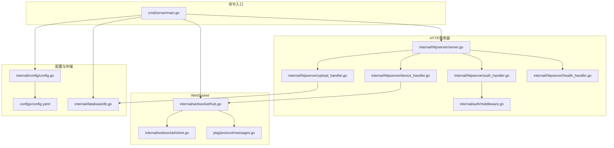
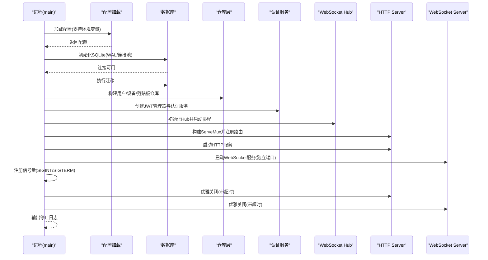
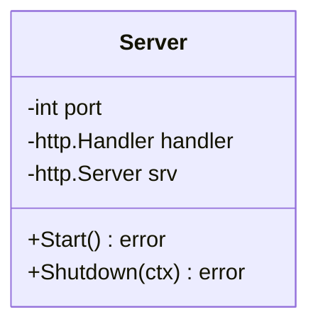
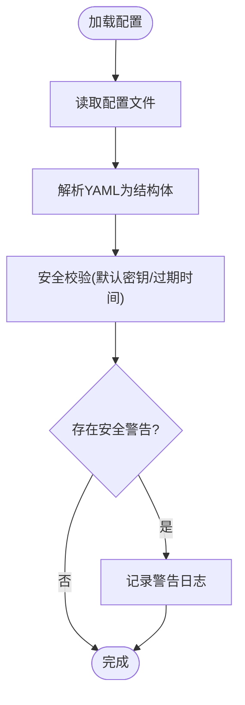
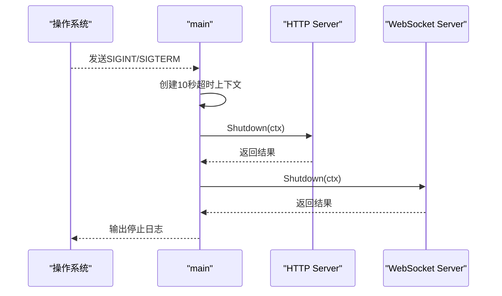
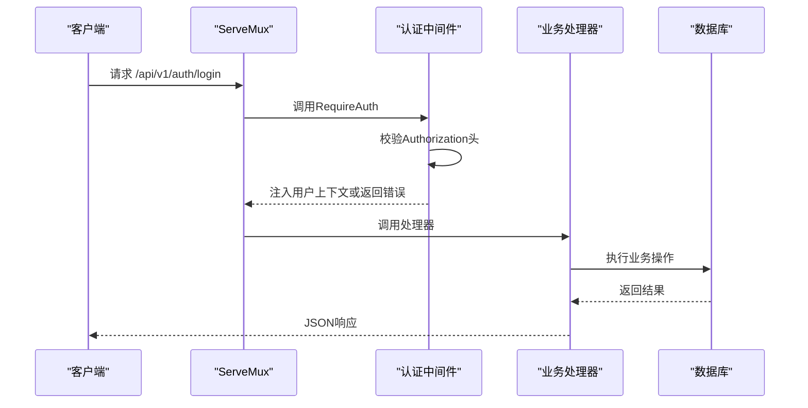
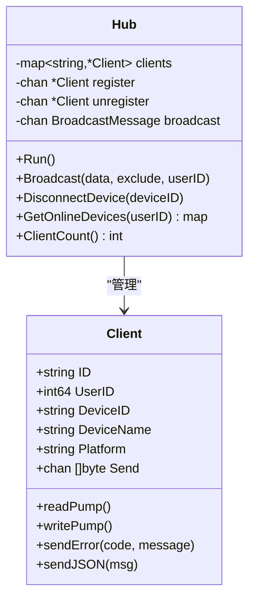
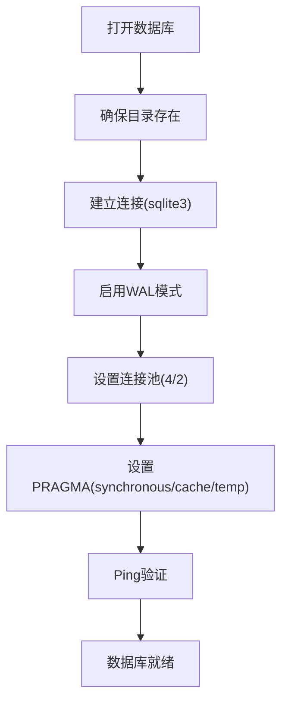
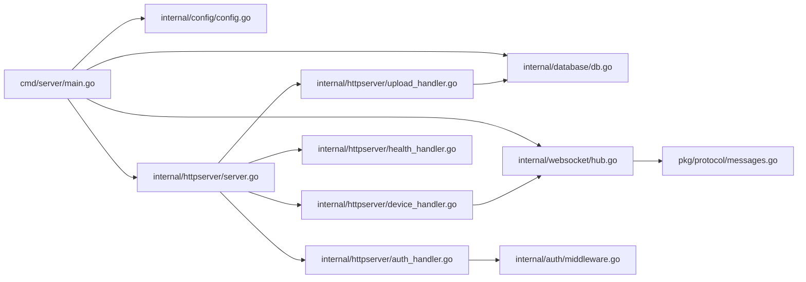

# 服务器核心架构

<cite>
**本文引用的文件**
- [main.go](file://clipSync-server/cmd/server/main.go)
- [server.go](file://clipSync-server/internal/httpserver/server.go)
- [config.go](file://clipSync-server/internal/config/config.go)
- [config.yaml](file://clipSync-server/configs/config.yaml)
- [middleware.go](file://clipSync-server/internal/auth/middleware.go)
- [auth_handler.go](file://clipSync-server/internal/httpserver/auth_handler.go)
- [device_handler.go](file://clipSync-server/internal/httpserver/device_handler.go)
- [upload_handler.go](file://clipSync-server/internal/httpserver/upload_handler.go)
- [health_handler.go](file://clipSync-server/internal/httpserver/health_handler.go)
- [hub.go](file://clipSync-server/internal/websocket/hub.go)
- [client.go](file://clipSync-server/internal/websocket/client.go)
- [messages.go](file://clipSync-server/pkg/protocol/messages.go)
- [db.go](file://clipSync-server/internal/database/db.go)
- [go.mod](file://clipSync-server/go.mod)
</cite>

## 目录
1. [简介](#简介)
2. [项目结构](#项目结构)
3. [核心组件](#核心组件)
4. [架构总览](#架构总览)
5. [详细组件分析](#详细组件分析)
6. [依赖关系分析](#依赖关系分析)
7. [性能考量](#性能考量)
8. [故障排查指南](#故障排查指南)
9. [结论](#结论)

## 简介
本文件面向HTTP服务器核心架构，系统性解析服务端设计与实现，重点覆盖以下方面：
- Server结构体的设计模式与生命周期管理
- 服务器初始化流程、端口配置与超时策略
- 优雅关闭机制与错误处理流程
- 中间件集成点与路由注册机制
- 启动、停止与监控的最佳实践
- 性能调优参数与资源管理策略

该服务器采用“双端口”架构：HTTP API服务（REST）与WebSocket服务（实时同步），通过统一的配置中心加载运行参数，并在进程退出时执行优雅关闭。

## 项目结构
服务器代码位于clipSync-server目录，核心模块包括：
- 命令入口：cmd/server/main.go
- HTTP服务器封装：internal/httpserver/server.go
- 配置管理：internal/config/config.go + configs/config.yaml
- 认证与中间件：internal/auth/middleware.go
- HTTP处理器：internal/httpserver/*（认证、设备、上传下载、健康检查）
- WebSocket中枢：internal/websocket/hub.go、client.go
- 协议定义：pkg/protocol/messages.go
- 数据库：internal/database/db.go
- 依赖声明：go.mod

图表来源
- [main.go:1-146](file://clipSync-server/cmd/server/main.go#L1-L146)
- [server.go:1-50](file://clipSync-server/internal/httpserver/server.go#L1-L50)
- [config.go:1-72](file://clipSync-server/internal/config/config.go#L1-L72)
- [config.yaml:1-29](file://clipSync-server/configs/config.yaml#L1-L29)
- [middleware.go:1-111](file://clipSync-server/internal/auth/middleware.go#L1-L111)
- [auth_handler.go:1-215](file://clipSync-server/internal/httpserver/auth_handler.go#L1-L215)
- [device_handler.go:1-137](file://clipSync-server/internal/httpserver/device_handler.go#L1-L137)
- [upload_handler.go:1-221](file://clipSync-server/internal/httpserver/upload_handler.go#L1-L221)
- [health_handler.go:1-55](file://clipSync-server/internal/httpserver/health_handler.go#L1-L55)
- [hub.go:1-230](file://clipSync-server/internal/websocket/hub.go#L1-L230)
- [client.go:1-150](file://clipSync-server/internal/websocket/client.go#L1-L150)
- [messages.go:1-132](file://clipSync-server/pkg/protocol/messages.go#L1-L132)
- [db.go:1-62](file://clipSync-server/internal/database/db.go#L1-L62)

章节来源
- [main.go:1-146](file://clipSync-server/cmd/server/main.go#L1-L146)
- [config.go:1-72](file://clipSync-server/internal/config/config.go#L1-L72)
- [config.yaml:1-29](file://clipSync-server/configs/config.yaml#L1-L29)

## 核心组件
本节聚焦Server结构体及其生命周期、配置与路由注册。

- Server结构体
  - 字段：port、handler、srv（底层http.Server）
  - 职责：封装HTTP服务器的启动与优雅关闭，统一超时配置
- 初始化流程
  - 读取配置并校验安全警告
  - 初始化数据库（SQLite，WAL模式，连接池）
  - 运行数据库迁移
  - 构建仓库层（用户、设备、剪贴板）
  - 初始化JWT管理器与认证服务
  - 初始化WebSocket Hub并启动协程
  - 构建HTTP ServeMux并注册路由
  - 启动HTTP与WebSocket服务
  - 注册信号量，执行优雅关闭
- 端口与超时
  - HTTP服务：默认端口、读/写/空闲超时
  - WebSocket服务：独立端口，读超时由心跳超时控制
- 中间件与路由
  - 认证中间件RequireAuth注入用户上下文
  - 路由按功能分组：认证、健康检查、设备管理、文件上传下载
- 错误处理
  - 统一JSON错误响应格式
  - 优雅关闭时捕获并记录错误

章节来源
- [server.go:11-50](file://clipSync-server/internal/httpserver/server.go#L11-L50)
- [main.go:21-146](file://clipSync-server/cmd/server/main.go#L21-L146)
- [config.go:10-72](file://clipSync-server/internal/config/config.go#L10-L72)
- [config.yaml:1-29](file://clipSync-server/configs/config.yaml#L1-L29)
- [middleware.go:22-61](file://clipSync-server/internal/auth/middleware.go#L22-L61)
- [auth_handler.go:63-109](file://clipSync-server/internal/httpserver/auth_handler.go#L63-L109)
- [health_handler.go:28-54](file://clipSync-server/internal/httpserver/health_handler.go#L28-L54)

## 架构总览
下图展示从进程启动到服务运行与优雅关闭的关键交互。

图表来源
- [main.go:21-146](file://clipSync-server/cmd/server/main.go#L21-L146)
- [server.go:26-49](file://clipSync-server/internal/httpserver/server.go#L26-L49)
- [db.go:17-56](file://clipSync-server/internal/database/db.go#L17-L56)
- [hub.go:60-112](file://clipSync-server/internal/websocket/hub.go#L60-L112)

## 详细组件分析

### Server结构体与生命周期
- 设计模式
  - 封装模式：对外暴露Start/Shutdown，内部持有底层http.Server
  - 生命周期：Start创建并启动服务器；Shutdown在上下文中执行优雅关闭
- 关键字段
  - port：监听端口
  - handler：路由处理器
  - srv：实际的http.Server实例
- 超时策略
  - ReadTimeout：读取请求体超时
  - WriteTimeout：写出响应超时
  - IdleTimeout：空闲连接超时
- 优雅关闭
  - 使用context.WithTimeout控制最大等待时间
  - 对HTTP与WebSocket分别执行Shutdown

图表来源
- [server.go:11-50](file://clipSync-server/internal/httpserver/server.go#L11-L50)

章节来源
- [server.go:11-50](file://clipSync-server/internal/httpserver/server.go#L11-L50)

### 配置系统与端口策略
- 配置结构
  - 包含HTTP端口、WebSocket端口、数据库路径、JWT密钥与过期、文件存储路径、最大文件大小、剪贴板历史限制、心跳超时等
- 默认值与校验
  - DefaultConfig提供生产不安全默认值提示
  - Validate返回安全警告（如JWT密钥未修改、过期时间较长）
- 环境变量
  - 支持通过环境变量覆盖配置文件路径
- 端口分离
  - HTTP API与WebSocket使用不同端口，便于反向代理与负载均衡

图表来源
- [config.go:38-72](file://clipSync-server/internal/config/config.go#L38-L72)
- [config.yaml:1-29](file://clipSync-server/configs/config.yaml#L1-L29)
- [main.go:25-42](file://clipSync-server/cmd/server/main.go#L25-L42)

章节来源
- [config.go:10-72](file://clipSync-server/internal/config/config.go#L10-L72)
- [config.yaml:1-29](file://clipSync-server/configs/config.yaml#L1-L29)
- [main.go:25-42](file://clipSync-server/cmd/server/main.go#L25-L42)

### 优雅关闭机制与错误处理
- 信号量注册
  - 接收SIGINT/SIGTERM后进入关闭流程
- 关闭顺序
  - 先HTTP，再WebSocket，均使用10秒超时
- 错误处理
  - 仅记录错误，不中断整体关闭流程
  - HTTP服务器ListenAndServe返回ErrServerClosed视为正常关闭

图表来源
- [main.go:127-145](file://clipSync-server/cmd/server/main.go#L127-L145)
- [server.go:43-49](file://clipSync-server/internal/httpserver/server.go#L43-L49)

章节来源
- [main.go:127-145](file://clipSync-server/cmd/server/main.go#L127-L145)
- [server.go:43-49](file://clipSync-server/internal/httpserver/server.go#L43-L49)

### 中间件集成点与路由注册
- 认证中间件
  - RequireAuth从Authorization头提取Bearer Token
  - 验证失败返回JSON错误
  - 成功后将用户信息注入请求上下文
- 路由注册
  - 认证路由：登录、注册、刷新（带限流）
  - 健康检查：/api/v1/health
  - 设备管理：列出设备、删除设备（需认证）
  - 文件上传/下载：上传（需认证）、下载（需认证）
- 速率限制
  - 认证接口使用限流器（每分钟10次）

图表来源
- [main.go:74-99](file://clipSync-server/cmd/server/main.go#L74-L99)
- [middleware.go:32-61](file://clipSync-server/internal/auth/middleware.go#L32-L61)
- [auth_handler.go:63-109](file://clipSync-server/internal/httpserver/auth_handler.go#L63-L109)

章节来源
- [main.go:74-99](file://clipSync-server/cmd/server/main.go#L74-L99)
- [middleware.go:22-61](file://clipSync-server/internal/auth/middleware.go#L22-L61)
- [auth_handler.go:63-109](file://clipSync-server/internal/httpserver/auth_handler.go#L63-L109)

### WebSocket Hub与客户端管理
- Hub职责
  - 维护客户端集合、注册/注销、广播消息
  - 统计在线客户端数量
  - 断开指定设备连接
- 客户端管理
  - readPump：读取消息、心跳超时、PONG处理
  - writePump：发送队列、批量写入、定时Ping
  - 发送缓冲满时自动断开客户端
- 协议与消息
  - 使用统一WSMessage结构，支持多种消息类型
  - 错误消息通过sendError发送

图表来源
- [hub.go:18-179](file://clipSync-server/internal/websocket/hub.go#L18-L179)
- [client.go:13-150](file://clipSync-server/internal/websocket/client.go#L13-L150)
- [messages.go:5-132](file://clipSync-server/pkg/protocol/messages.go#L5-L132)

章节来源
- [hub.go:18-179](file://clipSync-server/internal/websocket/hub.go#L18-L179)
- [client.go:13-150](file://clipSync-server/internal/websocket/client.go#L13-L150)
- [messages.go:5-132](file://clipSync-server/pkg/protocol/messages.go#L5-L132)

### 数据库与连接池
- 初始化
  - 自动创建目录
  - 打开SQLite，启用WAL、外键约束
  - 设置连接池：最大打开4，最大空闲2
- 性能优化
  - synchronous=NORMAL、cache_size=-2000、temp_store=MEMORY
  - Ping验证连接可用性

图表来源
- [db.go:17-56](file://clipSync-server/internal/database/db.go#L17-L56)

章节来源
- [db.go:17-56](file://clipSync-server/internal/database/db.go#L17-L56)

## 依赖关系分析
- 外部依赖
  - gorilla/websocket：WebSocket协议
  - github.com/mattn/go-sqlite3：SQLite驱动
  - golang.org/x/crypto：加密工具
  - gopkg.in/yaml.v3：YAML解析
- 内部模块
  - internal/httpserver：HTTP路由与处理器
  - internal/auth：JWT与中间件
  - internal/websocket：Hub与客户端
  - internal/database：数据库封装
  - pkg/protocol：消息协议

图表来源
- [go.mod:5-11](file://clipSync-server/go.mod#L5-L11)
- [main.go:3-17](file://clipSync-server/cmd/server/main.go#L3-L17)

章节来源
- [go.mod:5-11](file://clipSync-server/go.mod#L5-L11)

## 性能考量
- 连接池与并发
  - SQLite连接池：最大打开4，最大空闲2，适合低并发场景
  - WebSocket Hub使用RWMutex保护客户端集合，广播时对每个客户端尝试非阻塞发送
- 超时与资源
  - HTTP ReadTimeout/WriteTimeout/IdleTimeout避免资源泄露
  - WebSocket心跳超时控制空闲连接清理
- 存储与I/O
  - 文件上传同时计算SHA256并落盘，使用MultiWriter减少一次拷贝
  - 用户文件按用户ID分目录存储，避免单目录过大
- 可观测性
  - 健康检查返回连接数、数据库状态、版本与运行时长
  - 日志输出启动、关闭、错误与连接统计

章节来源
- [db.go:29-50](file://clipSync-server/internal/database/db.go#L29-L50)
- [server.go:27-41](file://clipSync-server/internal/httpserver/server.go#L27-L41)
- [hub.go:60-112](file://clipSync-server/internal/websocket/hub.go#L60-L112)
- [upload_handler.go:88-111](file://clipSync-server/internal/httpserver/upload_handler.go#L88-L111)
- [health_handler.go:28-54](file://clipSync-server/internal/httpserver/health_handler.go#L28-L54)

## 故障排查指南
- 启动失败
  - 检查配置文件路径与权限
  - 确认端口未被占用
  - 查看安全警告（JWT密钥未修改）
- 数据库问题
  - 确认数据库目录可写
  - 检查WAL模式与PRAGMA设置是否生效
  - 查看迁移是否成功
- 认证失败
  - 确认Authorization头格式为Bearer Token
  - 检查JWT密钥与过期时间
- WebSocket连接异常
  - 检查心跳超时与客户端PONG处理
  - 观察发送缓冲满导致的断连
- 优雅关闭异常
  - 确认信号量正确注册
  - 查看Shutdown返回的错误信息

章节来源
- [config.go:57-72](file://clipSync-server/internal/config/config.go#L57-L72)
- [main.go:31-54](file://clipSync-server/cmd/server/main.go#L31-L54)
- [db.go:17-56](file://clipSync-server/internal/database/db.go#L17-L56)
- [middleware.go:32-61](file://clipSync-server/internal/auth/middleware.go#L32-L61)
- [hub.go:197-208](file://clipSync-server/internal/websocket/hub.go#L197-L208)
- [main.go:134-142](file://clipSync-server/cmd/server/main.go#L134-L142)

## 结论
本服务器以清晰的模块化设计实现了HTTP API与WebSocket双栈服务：
- Server结构体封装了HTTP服务的生命周期与超时策略
- 配置系统支持默认值与安全校验，便于生产部署
- 中间件与路由注册提供了统一的认证与授权入口
- WebSocket Hub具备完善的客户端管理与广播机制
- 优雅关闭与错误处理保障了服务稳定退出
建议在生产环境中：
- 修改默认JWT密钥与缩短令牌过期时间
- 调整数据库连接池与PRAGMA参数以适配更高并发
- 在反向代理后统一暴露端口并开启TLS
- 增加更细粒度的指标与日志分级