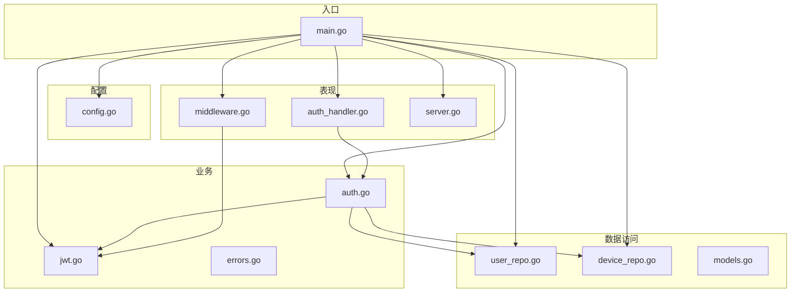
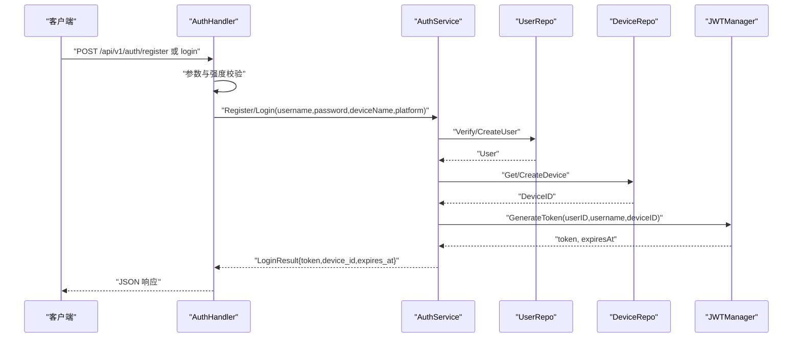
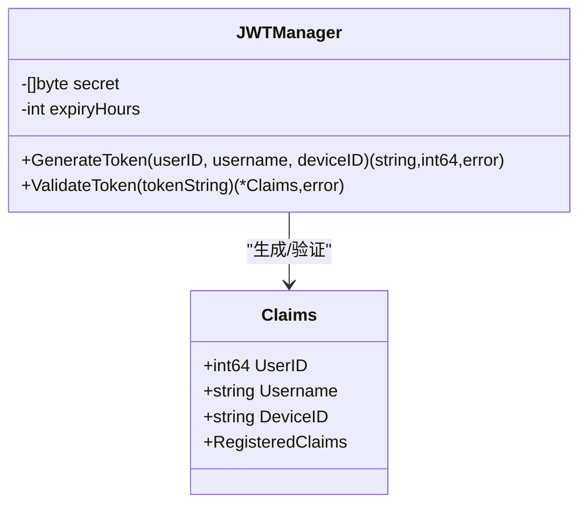
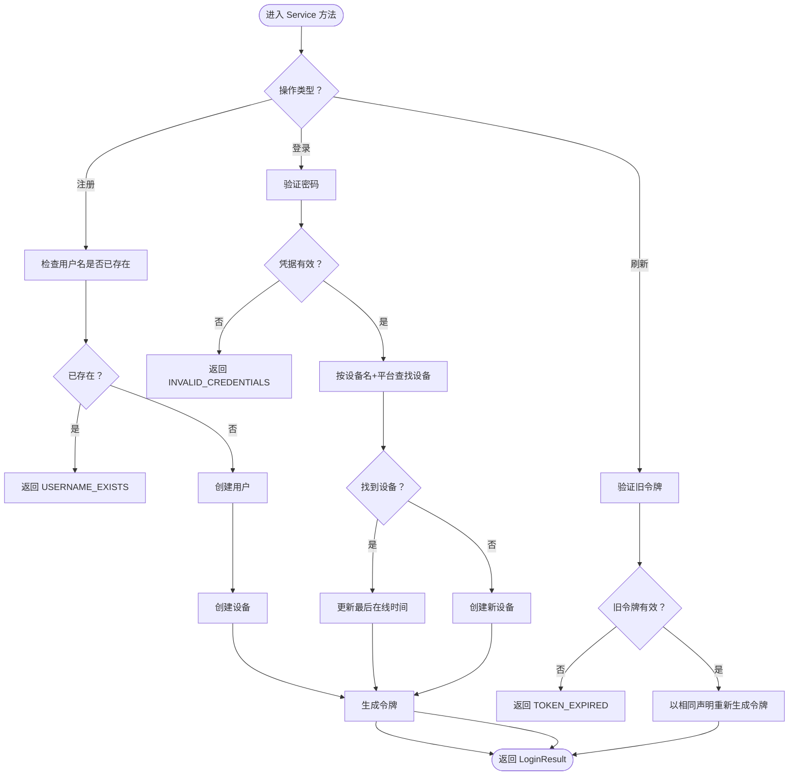
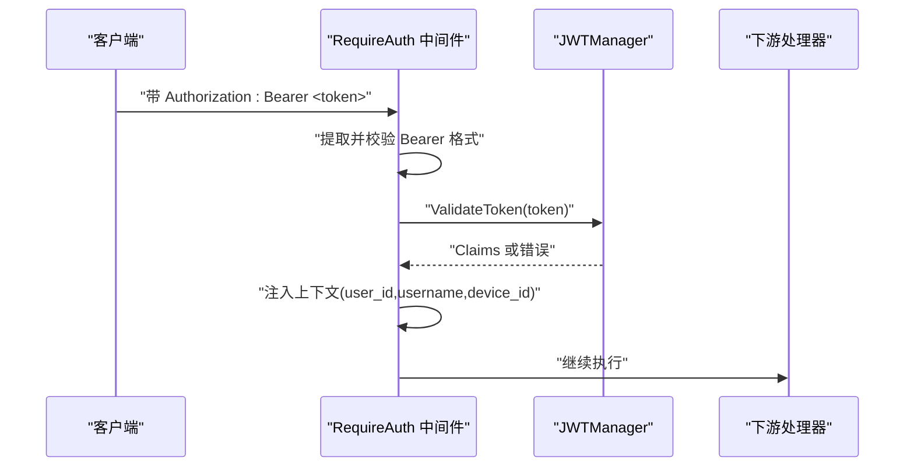
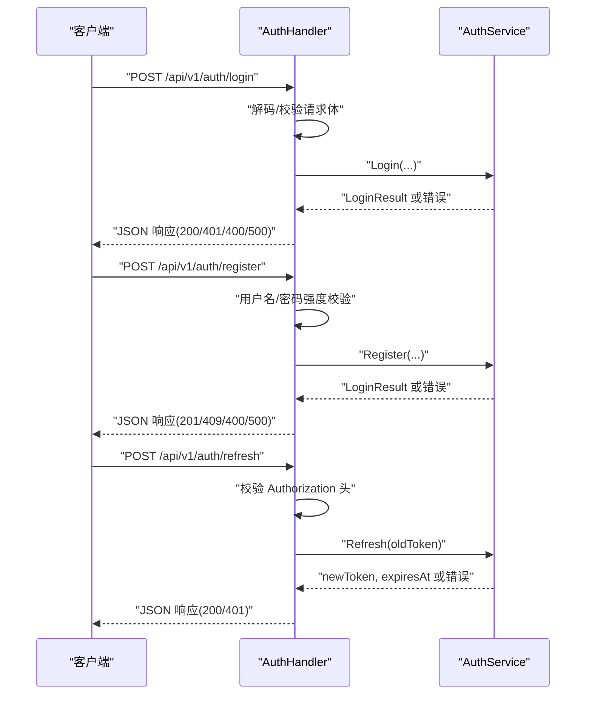
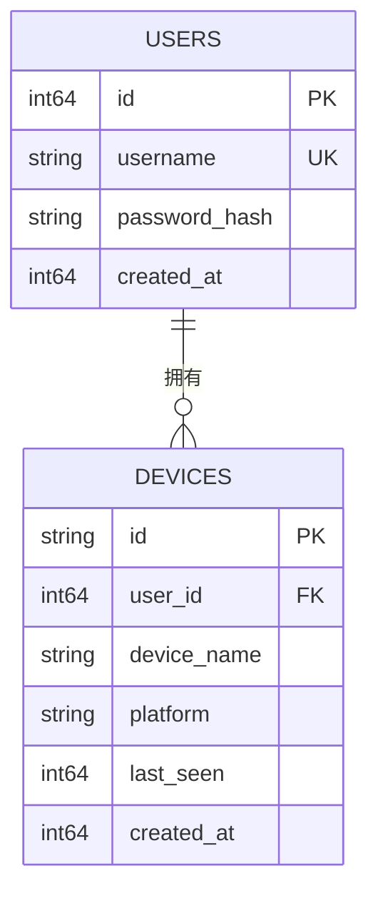
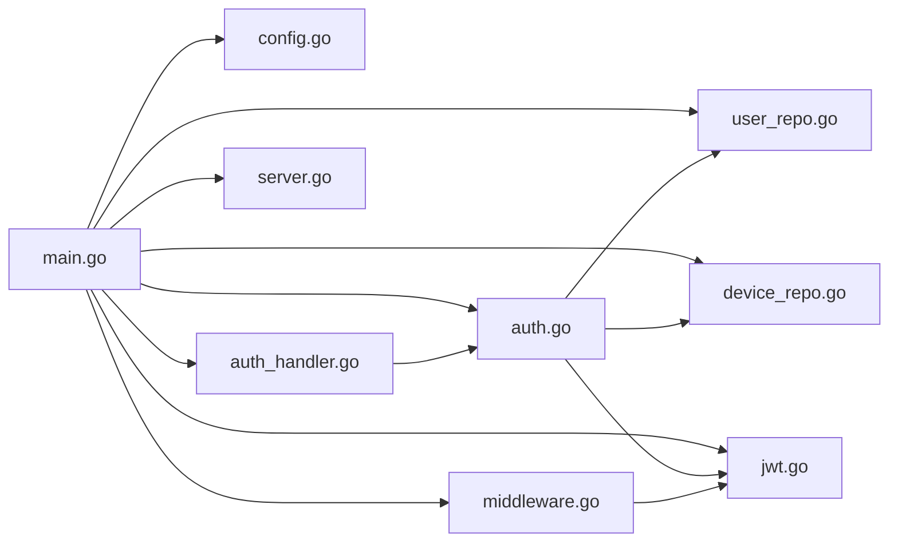

# 认证处理器

<cite>
**本文引用的文件列表**
- [auth.go](file://clipSync-server/internal/auth/auth.go)
- [jwt.go](file://clipSync-server/internal/auth/jwt.go)
- [middleware.go](file://clipSync-server/internal/auth/middleware.go)
- [errors.go](file://clipSync-server/internal/auth/errors.go)
- [auth_handler.go](file://clipSync-server/internal/httpserver/auth_handler.go)
- [server.go](file://clipSync-server/internal/httpserver/server.go)
- [main.go](file://clipSync-server/cmd/server/main.go)
- [config.go](file://clipSync-server/internal/config/config.go)
- [user_repo.go](file://clipSync-server/internal/database/user_repo.go)
- [device_repo.go](file://clipSync-server/internal/database/device_repo.go)
- [models.go](file://clipSync-server/internal/database/models.go)
- [http-api.schema.json](file://protocol/http-api.schema.json)
- [DEVELOPMENT_PLAN.md](file://DEVELOPMENT_PLAN.md)
</cite>

## 目录
1. [简介](#简介)
2. [项目结构](#项目结构)
3. [核心组件](#核心组件)
4. [架构总览](#架构总览)
5. [详细组件分析](#详细组件分析)
6. [依赖关系分析](#依赖关系分析)
7. [性能与安全考量](#性能与安全考量)
8. [故障排查指南](#故障排查指南)
9. [结论](#结论)
10. [附录：API 规范与响应格式](#附录api-规范与响应格式)

## 简介
本文件面向“认证处理器”的实现与使用，系统化梳理以下内容：
- JWT 令牌生成与验证流程
- 用户注册与登录的 RESTful API 设计
- 令牌刷新机制与过期处理策略
- 用户设备关联逻辑与会话管理
- 认证中间件实现细节与安全考虑
- 错误处理、统一响应格式与 API 版本兼容性
- 调试技巧与常见问题解决方案

## 项目结构
认证相关代码集中在 Go 服务端的内部模块中，采用分层设计：
- 配置层：读取并校验运行时配置（含 JWT 密钥与过期时间）
- 数据访问层：用户与设备仓库，负责密码哈希、设备 ID 生成与持久化
- 业务层：认证服务封装注册/登录/刷新等业务逻辑
- 表现层：HTTP 处理器实现 RESTful 接口，中间件提供请求拦截与上下文注入
- 入口层：主程序装配各组件，挂载路由与限流策略

图表来源
- [main.go:1-146](file://clipSync-server/cmd/server/main.go#L1-L146)
- [config.go:1-72](file://clipSync-server/internal/config/config.go#L1-L72)
- [auth.go:1-137](file://clipSync-server/internal/auth/auth.go#L1-L137)
- [jwt.go:1-76](file://clipSync-server/internal/auth/jwt.go#L1-L76)
- [middleware.go:1-111](file://clipSync-server/internal/auth/middleware.go#L1-L111)
- [auth_handler.go:1-215](file://clipSync-server/internal/httpserver/auth_handler.go#L1-L215)
- [user_repo.go:1-91](file://clipSync-server/internal/database/user_repo.go#L1-L91)
- [device_repo.go:1-126](file://clipSync-server/internal/database/device_repo.go#L1-L126)
- [models.go:1-46](file://clipSync-server/internal/database/models.go#L1-L46)

章节来源
- [main.go:1-146](file://clipSync-server/cmd/server/main.go#L1-L146)
- [config.go:1-72](file://clipSync-server/internal/config/config.go#L1-L72)

## 核心组件
- 认证服务 Service：封装注册、登录、刷新等业务逻辑；协调用户/设备仓库与 JWT 管理器
- JWT 管理器 JWTManager：生成与验证 JWT，携带用户 ID、用户名、设备 ID 等声明
- 认证中间件 Middleware：拦截 HTTP 请求，校验 Authorization 头中的 Bearer 令牌，并将声明写入请求上下文
- HTTP 处理器 AuthHandler：实现 /api/v1/auth/* 的 RESTful 接口，负责参数校验、调用认证服务、返回统一 JSON 响应
- 仓库层：UserRepo、DeviceRepo 提供用户与设备的 CRUD 操作，含密码哈希与设备 ID 生成
- 配置层：加载并校验 JWT 密钥、过期小时数等关键参数

章节来源
- [auth.go:1-137](file://clipSync-server/internal/auth/auth.go#L1-L137)
- [jwt.go:1-76](file://clipSync-server/internal/auth/jwt.go#L1-L76)
- [middleware.go:1-111](file://clipSync-server/internal/auth/middleware.go#L1-L111)
- [auth_handler.go:1-215](file://clipSync-server/internal/httpserver/auth_handler.go#L1-L215)
- [user_repo.go:1-91](file://clipSync-server/internal/database/user_repo.go#L1-L91)
- [device_repo.go:1-126](file://clipSync-server/internal/database/device_repo.go#L1-L126)
- [config.go:1-72](file://clipSync-server/internal/config/config.go#L1-L72)

## 架构总览
认证子系统的控制流如下：
- 客户端发起注册/登录请求，HTTP 处理器进行参数与强度校验
- 认证服务调用仓库层完成用户/设备持久化或查询
- JWT 管理器生成/验证令牌，返回过期时间戳
- 中间件在后续受保护的 HTTP/WebSocket 路由中校验令牌并将上下文注入
- 主程序装配路由、限流与服务器启动

图表来源
- [auth_handler.go:63-175](file://clipSync-server/internal/httpserver/auth_handler.go#L63-L175)
- [auth.go:31-116](file://clipSync-server/internal/auth/auth.go#L31-L116)
- [user_repo.go:21-80](file://clipSync-server/internal/database/user_repo.go#L21-L80)
- [device_repo.go:21-42](file://clipSync-server/internal/database/device_repo.go#L21-L42)
- [jwt.go:32-55](file://clipSync-server/internal/auth/jwt.go#L32-L55)

## 详细组件分析

### JWT 令牌生成与验证
- Claims 结构包含用户 ID、用户名、设备 ID 以及标准注册声明（过期、签发时间、发行者）
- 生成流程：计算过期时间，构造 Claims，使用 HS256 签名，返回签名字符串与毫秒级过期时间戳
- 验证流程：解析令牌并校验签名方法，断言令牌有效且能转换为 Claims

图表来源
- [jwt.go:10-76](file://clipSync-server/internal/auth/jwt.go#L10-L76)

章节来源
- [jwt.go:18-76](file://clipSync-server/internal/auth/jwt.go#L18-L76)

### 认证服务：注册、登录与刷新
- 注册：检查用户名是否存在，不存在则创建用户并创建设备，随后生成令牌
- 登录：验证凭据，查找用户已登记的设备（按设备名与平台匹配），若存在则更新最后在线时间，否则新建设备，再生成令牌
- 刷新：对旧令牌进行验证，通过后以相同声明重新签发新令牌

图表来源
- [auth.go:31-137](file://clipSync-server/internal/auth/auth.go#L31-L137)

章节来源
- [auth.go:31-137](file://clipSync-server/internal/auth/auth.go#L31-L137)

### 认证中间件：HTTP 请求拦截与上下文注入
- 校验 Authorization 头是否以 Bearer 开头
- 使用 JWTManager 验证令牌有效性
- 将用户 ID、用户名、设备 ID 写入请求上下文，供后续处理器使用
- 统一 JSON 错误响应格式

图表来源
- [middleware.go:32-61](file://clipSync-server/internal/auth/middleware.go#L32-L61)

章节来源
- [middleware.go:22-111](file://clipSync-server/internal/auth/middleware.go#L22-L111)

### HTTP 处理器：RESTful API 设计与响应
- 登录：POST /api/v1/auth/login，参数校验与强度校验，调用认证服务，返回成功响应或错误码
- 注册：POST /api/v1/auth/register，用户名/密码强度校验，调用认证服务，返回成功响应或冲突错误
- 刷新：POST /api/v1/auth/refresh，从 Authorization 头提取 Bearer 令牌，调用认证服务刷新，返回新令牌与过期时间
- 统一响应格式：success 字段、错误码与可选消息字段；错误码与状态码映射见协议规范

图表来源
- [auth_handler.go:63-208](file://clipSync-server/internal/httpserver/auth_handler.go#L63-L208)

章节来源
- [auth_handler.go:11-215](file://clipSync-server/internal/httpserver/auth_handler.go#L11-L215)

### 用户与设备模型与仓库
- User：用户名、密码哈希、创建时间（毫秒）
- Device：设备 ID、用户 ID、设备名、平台、最后在线时间、创建时间（毫秒）
- UserRepo：创建用户（密码哈希）、按用户名查询、验证密码、检查用户名是否存在
- DeviceRepo：创建设备（随机设备 ID）、按 ID 查询、按用户查询、更新最后在线时间、删除设备、校验所有权

图表来源
- [models.go:3-19](file://clipSync-server/internal/database/models.go#L3-L19)
- [user_repo.go:21-90](file://clipSync-server/internal/database/user_repo.go#L21-L90)
- [device_repo.go:21-126](file://clipSync-server/internal/database/device_repo.go#L21-L126)

章节来源
- [models.go:1-46](file://clipSync-server/internal/database/models.go#L1-L46)
- [user_repo.go:1-91](file://clipSync-server/internal/database/user_repo.go#L1-L91)
- [device_repo.go:1-126](file://clipSync-server/internal/database/device_repo.go#L1-L126)

### 令牌刷新机制与过期处理策略
- 刷新端点要求 Authorization: Bearer <token>，服务端验证旧令牌有效性，通过后以相同声明重新签发新令牌
- 过期时间由配置项决定，默认 720 小时（30 天），建议生产环境适当缩短
- 无效或过期令牌返回统一错误码，客户端应提示重新登录或引导到登录页

章节来源
- [auth_handler.go:177-208](file://clipSync-server/internal/httpserver/auth_handler.go#L177-L208)
- [auth.go:118-131](file://clipSync-server/internal/auth/auth.go#L118-L131)
- [jwt.go:32-55](file://clipSync-server/internal/auth/jwt.go#L32-L55)
- [config.go:24-36](file://clipSync-server/internal/config/config.go#L24-L36)

### 用户设备关联逻辑与会话管理
- 登录时优先复用用户已登记的设备（按设备名与平台匹配），若存在则更新最后在线时间；否则创建新设备
- 令牌中包含设备 ID，用于区分不同设备的会话与权限边界
- 受保护的 HTTP 路由通过中间件注入上下文，下游处理器可通过工具函数提取用户/设备信息

章节来源
- [auth.go:67-116](file://clipSync-server/internal/auth/auth.go#L67-L116)
- [middleware.go:63-100](file://clipSync-server/internal/auth/middleware.go#L63-L100)
- [device_repo.go:60-90](file://clipSync-server/internal/database/device_repo.go#L60-L90)

### 认证中间件实现细节与安全考虑
- 严格校验 Authorization 头格式，避免空头或非 Bearer 格式
- 令牌验证失败统一返回 401 与 TOKEN_EXPIRED/AUTH_FAILED 错误码
- 上下文键名固定，便于下游处理器一致地读取用户/设备信息
- 建议生产环境：
  - 更换默认 JWT 密钥
  - 合理设置过期时间
  - 对敏感接口启用速率限制
  - 在反向代理层开启 HTTPS

章节来源
- [middleware.go:32-61](file://clipSync-server/internal/auth/middleware.go#L32-L61)
- [config.go:57-71](file://clipSync-server/internal/config/config.go#L57-L71)
- [main.go:77-84](file://clipSync-server/cmd/server/main.go#L77-L84)

## 依赖关系分析
- 入口 main.go 负责装配配置、数据库、仓库、JWT 管理器、认证服务、中间件与 HTTP 路由
- HTTP 路由对认证端点应用速率限制，对受保护端点应用 RequireAuth 中间件
- 认证服务依赖仓库层与 JWT 管理器
- 中间件仅依赖 JWT 管理器

图表来源
- [main.go:56-100](file://clipSync-server/cmd/server/main.go#L56-L100)
- [auth_handler.go:16-19](file://clipSync-server/internal/httpserver/auth_handler.go#L16-L19)
- [auth.go:15-22](file://clipSync-server/internal/auth/auth.go#L15-L22)

章节来源
- [main.go:1-146](file://clipSync-server/cmd/server/main.go#L1-L146)

## 性能与安全考量
- 性能
  - 令牌生成/验证为轻量操作，瓶颈通常在数据库访问与网络 I/O
  - 建议对认证端点启用速率限制，防止暴力破解与滥用
  - 使用 WAL 模式优化 SQLite 写入性能
- 安全
  - 生产环境必须更换默认 JWT 密钥
  - 合理设置过期时间，短周期令牌配合刷新端点
  - 传输层使用 TLS，避免明文传输
  - 密码存储使用 bcrypt，不可逆
  - 对设备 ID 生成使用加密安全的随机源

章节来源
- [config.go:57-71](file://clipSync-server/internal/config/config.go#L57-L71)
- [user_repo.go:21-47](file://clipSync-server/internal/database/user_repo.go#L21-L47)
- [device_repo.go:121-126](file://clipSync-server/internal/database/device_repo.go#L121-L126)
- [main.go:77-84](file://clipSync-server/cmd/server/main.go#L77-L84)

## 故障排查指南
- 常见错误码与含义
  - AUTH_FAILED：缺少或格式不正确的 Authorization 头
  - TOKEN_EXPIRED：令牌无效或已过期
  - INVALID_CREDENTIALS：用户名或密码错误
  - USERNAME_EXISTS：注册时用户名已被占用
  - INVALID_PAYLOAD：请求体缺失或格式不正确
  - RATE_LIMITED：超过速率限制
- 定位步骤
  - 检查请求头 Authorization 是否为 Bearer <token>
  - 校验 JWT 密钥与过期时间配置
  - 查看数据库连接与迁移是否成功
  - 关注中间件日志与 HTTP 处理器返回的错误码
- 建议
  - 在开发阶段使用默认密钥与较长过期时间，生产环境务必修改
  - 对客户端实现统一的错误处理与重试策略

章节来源
- [auth_handler.go:63-208](file://clipSync-server/internal/httpserver/auth_handler.go#L63-L208)
- [middleware.go:32-61](file://clipSync-server/internal/auth/middleware.go#L32-L61)
- [errors.go:7-11](file://clipSync-server/internal/auth/errors.go#L7-L11)
- [http-api.schema.json:280-292](file://protocol/http-api.schema.json#L280-L292)

## 结论
本认证处理器以清晰的分层设计实现了完整的注册、登录、刷新与中间件拦截能力，结合严格的参数校验、统一的错误码与响应格式，满足跨平台客户端的安全与一致性需求。建议在生产环境中强化密钥管理、合理设置过期时间与速率限制，并在传输层启用 TLS。

## 附录：API 规范与响应格式

### RESTful 端点与请求/响应
- 登录
  - 方法与路径：POST /api/v1/auth/login
  - 请求体字段：username、password、device_name、platform
  - 成功响应：success=true、token、device_id、expires_at（毫秒）
  - 失败响应：INVALID_CREDENTIALS（401）
- 注册
  - 方法与路径：POST /api/v1/auth/register
  - 请求体字段：username、password、device_name、platform
  - 成功响应：success=true、token、device_id、expires_at（毫秒）
  - 失败响应：USERNAME_EXISTS（409）
- 刷新
  - 方法与路径：POST /api/v1/auth/refresh
  - 请求头：Authorization: Bearer <token>
  - 成功响应：success=true、token、expires_at（毫秒）
  - 失败响应：AUTH_FAILED/TOKEN_EXPIRED（401）

章节来源
- [http-api.schema.json:8-49](file://protocol/http-api.schema.json#L8-L49)
- [http-api.schema.json:50-90](file://protocol/http-api.schema.json#L50-L90)
- [http-api.schema.json:92-124](file://protocol/http-api.schema.json#L92-L124)
- [auth_handler.go:63-208](file://clipSync-server/internal/httpserver/auth_handler.go#L63-L208)

### 统一响应格式
- 成功响应：包含 success=true 与业务字段（如 token、device_id、expires_at）
- 失败响应：包含 success=false、error（错误码）与可选 message
- 错误码与状态码映射详见协议规范

章节来源
- [auth_handler.go:210-215](file://clipSync-server/internal/httpserver/auth_handler.go#L210-L215)
- [http-api.schema.json:280-292](file://protocol/http-api.schema.json#L280-L292)

### API 版本兼容性
- 当前实现遵循 /api/v1 路由前缀，保持语义化版本控制
- 协议规范中定义了明确的请求/响应结构与错误码，便于客户端侧进行兼容性测试

章节来源
- [DEVELOPMENT_PLAN.md:182-329](file://DEVELOPMENT_PLAN.md#L182-L329)
- [http-api.schema.json:1-7](file://protocol/http-api.schema.json#L1-L7)