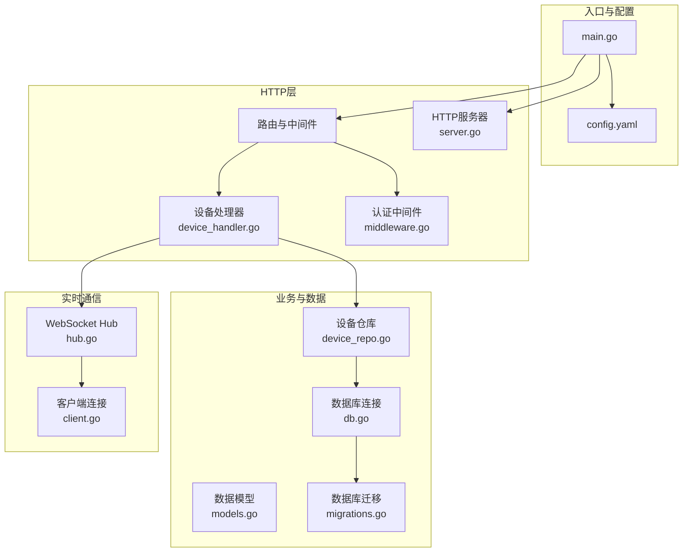
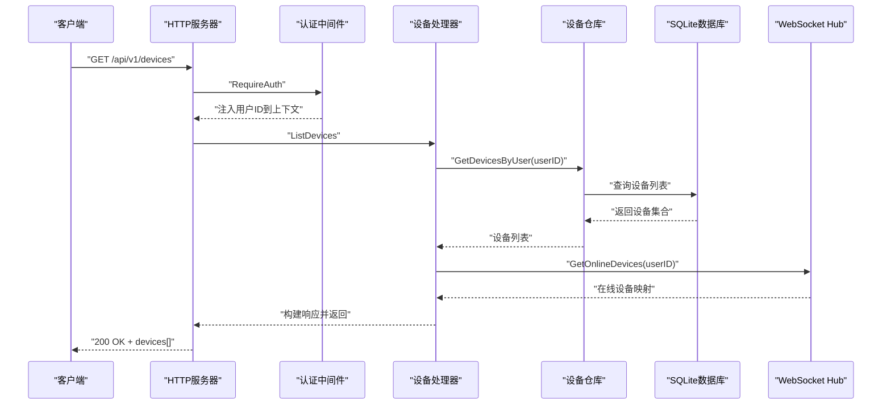
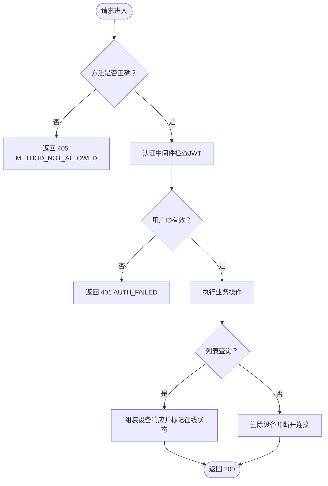
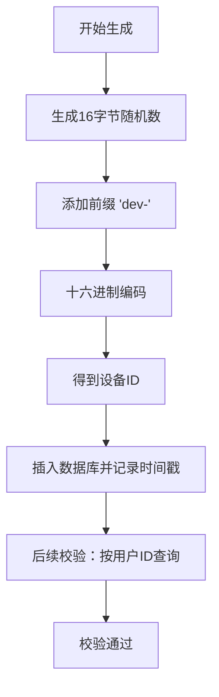
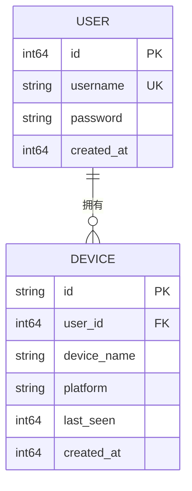
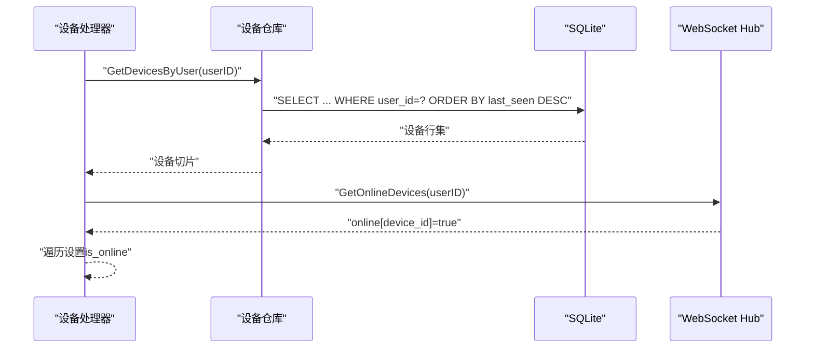
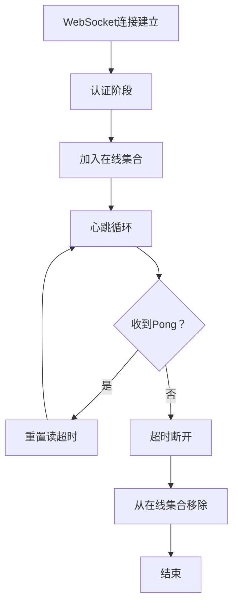
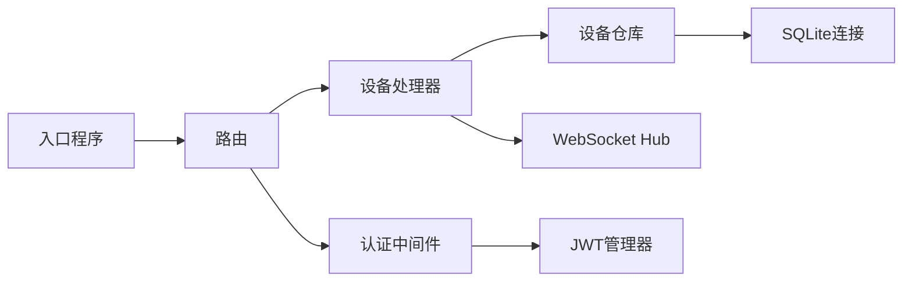

# 设备管理处理器

<cite>
**本文档引用的文件**
- [device_handler.go](file://clipSync-server/internal/httpserver/device_handler.go)
- [device_repo.go](file://clipSync-server/internal/database/device_repo.go)
- [models.go](file://clipSync-server/internal/database/models.go)
- [middleware.go](file://clipSync-server/internal/auth/middleware.go)
- [hub.go](file://clipSync-server/internal/websocket/hub.go)
- [client.go](file://clipSync-server/internal/websocket/client.go)
- [db.go](file://clipSync-server/internal/database/db.go)
- [migrations.go](file://clipSync-server/internal/database/migrations.go)
- [main.go](file://clipSync-server/cmd/server/main.go)
- [server.go](file://clipSync-server/internal/httpserver/server.go)
- [config.yaml](file://clipSync-server/configs/config.yaml)
- [http-api.schema.json](file://protocol/http-api.schema.json)
- [ws-messages.schema.json](file://protocol/ws-messages.schema.json)
- [DEVELOPMENT_PLAN.md](file://DEVELOPMENT_PLAN.md)
</cite>

## 目录
1. [简介](#简介)
2. [项目结构](#项目结构)
3. [核心组件](#核心组件)
4. [架构总览](#架构总览)
5. [详细组件分析](#详细组件分析)
6. [依赖关系分析](#依赖关系分析)
7. [性能考虑](#性能考虑)
8. [故障排除指南](#故障排除指南)
9. [结论](#结论)
10. [附录](#附录)

## 简介
本文件针对设备管理处理器进行系统化技术文档编写，重点覆盖以下方面：
- 设备注册、注销与状态查询的RESTful API设计与实现
- 设备唯一标识符生成与验证机制
- 设备与用户关联关系及权限控制
- 设备列表查询与过滤逻辑
- 设备状态监控与离线检测机制
- 安全策略与数据一致性保证
- API使用示例与错误处理指南

该处理器位于服务端Go模块中，通过HTTP路由暴露设备管理接口，并与WebSocket Hub协作实现在线状态判定。

## 项目结构
服务器端采用分层架构：入口程序负责初始化配置、数据库、仓库、认证中间件与路由；HTTP层提供设备管理等API；数据库层封装SQLite访问与迁移；WebSocket层负责实时连接与心跳检测；协议层提供HTTP与WebSocket消息契约。

**图表来源**
- [main.go:1-146](file://clipSync-server/cmd/server/main.go#L1-L146)
- [device_handler.go:1-137](file://clipSync-server/internal/httpserver/device_handler.go#L1-L137)
- [device_repo.go:1-126](file://clipSync-server/internal/database/device_repo.go#L1-L126)
- [models.go:1-46](file://clipSync-server/internal/database/models.go#L1-L46)
- [db.go:1-62](file://clipSync-server/internal/database/db.go#L1-L62)
- [migrations.go:1-114](file://clipSync-server/internal/database/migrations.go#L1-L114)
- [hub.go:1-230](file://clipSync-server/internal/websocket/hub.go#L1-L230)
- [client.go:1-150](file://clipSync-server/internal/websocket/client.go#L1-L150)
- [server.go:1-50](file://clipSync-server/internal/httpserver/server.go#L1-L50)
- [config.yaml:1-29](file://clipSync-server/configs/config.yaml#L1-L29)

**章节来源**
- [main.go:1-146](file://clipSync-server/cmd/server/main.go#L1-L146)
- [config.yaml:1-29](file://clipSync-server/configs/config.yaml#L1-L29)

## 核心组件
- 设备处理器（DeviceHandler）：负责HTTP设备管理端点，包括设备列表查询与删除。
- 设备仓库（DeviceRepo）：封装设备的增删查改与归属校验，提供设备ID生成。
- 认证中间件（Middleware）：基于JWT的HTTP请求鉴权与上下文注入。
- WebSocket Hub：维护在线客户端集合，提供在线设备判定与断开能力。
- 数据库与迁移：SQLite连接、索引优化与模式迁移。
- 模型定义：Device/User/ClipboardEntry/UploadedFile等数据结构。

**章节来源**
- [device_handler.go:11-23](file://clipSync-server/internal/httpserver/device_handler.go#L11-L23)
- [device_repo.go:11-19](file://clipSync-server/internal/database/device_repo.go#L11-L19)
- [middleware.go:22-30](file://clipSync-server/internal/auth/middleware.go#L22-L30)
- [hub.go:18-35](file://clipSync-server/internal/websocket/hub.go#L18-L35)
- [models.go:3-46](file://clipSync-server/internal/database/models.go#L3-L46)
- [db.go:12-56](file://clipSync-server/internal/database/db.go#L12-L56)
- [migrations.go:8-114](file://clipSync-server/internal/database/migrations.go#L8-L114)

## 架构总览
设备管理处理器通过HTTP路由受认证中间件保护，调用设备仓库访问数据库，同时与WebSocket Hub协作获取在线状态信息。整体流程如下：

**图表来源**
- [device_handler.go:25-82](file://clipSync-server/internal/httpserver/device_handler.go#L25-L82)
- [device_repo.go:60-80](file://clipSync-server/internal/database/device_repo.go#L60-L80)
- [hub.go:168-179](file://clipSync-server/internal/websocket/hub.go#L168-L179)
- [middleware.go:32-61](file://clipSync-server/internal/auth/middleware.go#L32-L61)

## 详细组件分析

### 设备管理API设计与实现
- 路由绑定
  - 列表查询：GET /api/v1/devices，受RequireAuth保护
  - 删除设备：DELETE /api/v1/devices/{device_id}，受RequireAuth保护
- 权限控制
  - 通过认证中间件从JWT提取用户ID，若无效则返回401
  - 删除操作额外校验路径参数有效性
- 响应格式
  - 列表查询返回devices数组，包含device_id、device_name、platform、last_seen、is_online、created_at
  - 删除操作返回success字段或错误码

**图表来源**
- [device_handler.go:25-137](file://clipSync-server/internal/httpserver/device_handler.go#L25-L137)
- [middleware.go:32-61](file://clipSync-server/internal/auth/middleware.go#L32-L61)

**章节来源**
- [device_handler.go:25-137](file://clipSync-server/internal/httpserver/device_handler.go#L25-L137)
- [main.go:90-98](file://clipSync-server/cmd/server/main.go#L90-L98)

### 设备唯一标识符生成与验证机制
- 生成机制
  - 使用加密安全的随机源生成16字节随机数，拼接前缀形成唯一ID
  - 时间戳用于创建与最后活跃时间记录
- 验证与归属
  - 删除时通过“id AND user_id”条件确保仅能删除属于当前用户的设备
  - 查询时按用户维度过滤，避免跨用户数据泄露
- 平台与名称
  - 支持多平台枚举，设备名称长度限制在合理范围

**图表来源**
- [device_repo.go:121-126](file://clipSync-server/internal/database/device_repo.go#L121-L126)
- [device_repo.go:21-42](file://clipSync-server/internal/database/device_repo.go#L21-L42)
- [device_repo.go:92-106](file://clipSync-server/internal/database/device_repo.go#L92-L106)

**章节来源**
- [device_repo.go:121-126](file://clipSync-server/internal/database/device_repo.go#L121-L126)
- [device_repo.go:21-42](file://clipSync-server/internal/database/device_repo.go#L21-L42)
- [device_repo.go:92-106](file://clipSync-server/internal/database/device_repo.go#L92-L106)

### 设备与用户的关联关系与权限控制
- 关联关系
  - Device模型包含user_id外键，建立用户与设备的一对多关系
  - 迁移脚本定义外键约束与级联删除
- 权限控制
  - HTTP端点均需Bearer Token，中间件将用户ID注入上下文
  - 删除操作强制校验设备归属（user_id匹配）
  - 列表查询按用户维度过滤，防止越权访问

**图表来源**
- [models.go:3-19](file://clipSync-server/internal/database/models.go#L3-L19)
- [migrations.go:35-45](file://clipSync-server/internal/database/migrations.go#L35-L45)

**章节来源**
- [models.go:3-19](file://clipSync-server/internal/database/models.go#L3-L19)
- [migrations.go:35-45](file://clipSync-server/internal/database/migrations.go#L35-L45)
- [device_repo.go:92-106](file://clipSync-server/internal/database/device_repo.go#L92-L106)

### 设备列表查询与过滤逻辑
- 查询逻辑
  - 按用户ID查询设备列表，按last_seen降序排列
  - 将数据库结果转换为对外响应结构体
- 在线状态判定
  - 结合WebSocket Hub中的在线设备映射，将is_online字段置位
  - 仅对当前用户可见的在线设备进行标记
- 响应结构
  - 包含设备ID、名称、平台、最后活跃时间、创建时间与在线状态

**图表来源**
- [device_handler.go:60-81](file://clipSync-server/internal/httpserver/device_handler.go#L60-L81)
- [device_repo.go:60-80](file://clipSync-server/internal/database/device_repo.go#L60-L80)
- [hub.go:168-179](file://clipSync-server/internal/websocket/hub.go#L168-L179)

**章节来源**
- [device_handler.go:60-81](file://clipSync-server/internal/httpserver/device_handler.go#L60-L81)
- [device_repo.go:60-80](file://clipSync-server/internal/database/device_repo.go#L60-L80)
- [hub.go:168-179](file://clipSync-server/internal/websocket/hub.go#L168-L179)

### 设备状态监控与离线检测机制
- WebSocket Hub在线判定
  - 维护客户端映射，按用户维度统计在线设备
  - 提供GetOnlineDevices(userID)返回在线设备ID集合
- 心跳与超时
  - 客户端读取设置读超时，心跳超时触发自动断开
  - 服务器定时Ping，客户端Pong回执更新读超时
- 设备注销联动
  - 删除设备后主动断开对应设备ID的WebSocket连接

**图表来源**
- [hub.go:168-179](file://clipSync-server/internal/websocket/hub.go#L168-L179)
- [client.go:33-67](file://clipSync-server/internal/websocket/client.go#L33-L67)
- [client.go:106-116](file://clipSync-server/internal/websocket/client.go#L106-L116)
- [device_handler.go:130-132](file://clipSync-server/internal/httpserver/device_handler.go#L130-L132)

**章节来源**
- [hub.go:168-179](file://clipSync-server/internal/websocket/hub.go#L168-L179)
- [client.go:33-67](file://clipSync-server/internal/websocket/client.go#L33-L67)
- [client.go:106-116](file://clipSync-server/internal/websocket/client.go#L106-L116)
- [device_handler.go:130-132](file://clipSync-server/internal/httpserver/device_handler.go#L130-L132)

### 安全策略与数据一致性保证
- 安全策略
  - 所有设备管理端点均要求Bearer Token，中间件校验JWT有效性
  - 删除设备强制校验归属（user_id），防止越权删除
  - 配置文件中JWT密钥与过期时间可调整，建议生产环境修改默认值
- 数据一致性
  - SQLite启用WAL模式，提升并发读性能
  - 外键约束与级联删除确保用户删除时设备级联清理
  - 连接池配置与同步模式优化，减少锁竞争

**章节来源**
- [middleware.go:32-61](file://clipSync-server/internal/auth/middleware.go#L32-L61)
- [device_repo.go:92-106](file://clipSync-server/internal/database/device_repo.go#L92-L106)
- [db.go:17-56](file://clipSync-server/internal/database/db.go#L17-L56)
- [migrations.go:35-45](file://clipSync-server/internal/database/migrations.go#L35-L45)
- [config.yaml:12-28](file://clipSync-server/configs/config.yaml#L12-L28)

## 依赖关系分析
- 组件耦合
  - 设备处理器依赖设备仓库与WebSocket Hub
  - 设备仓库依赖数据库连接
  - 认证中间件依赖JWT管理器
- 外部依赖
  - SQLite驱动、gorilla/websocket
- 可能的循环依赖
  - 当前模块间为单向依赖，未发现循环

**图表来源**
- [device_handler.go:12-23](file://clipSync-server/internal/httpserver/device_handler.go#L12-L23)
- [device_repo.go:12-19](file://clipSync-server/internal/database/device_repo.go#L12-L19)
- [hub.go:18-35](file://clipSync-server/internal/websocket/hub.go#L18-L35)
- [main.go:62-72](file://clipSync-server/cmd/server/main.go#L62-L72)

**章节来源**
- [device_handler.go:12-23](file://clipSync-server/internal/httpserver/device_handler.go#L12-L23)
- [device_repo.go:12-19](file://clipSync-server/internal/database/device_repo.go#L12-L19)
- [hub.go:18-35](file://clipSync-server/internal/websocket/hub.go#L18-L35)
- [main.go:62-72](file://clipSync-server/cmd/server/main.go#L62-L72)

## 性能考虑
- 数据库优化
  - WAL模式与索引优化，支持高并发读写
  - 连接池配置（最大打开连接数、空闲连接数）适配2核2G服务器
- WebSocket优化
  - 心跳超时与Ping/Pong机制降低无效连接占用
  - 发送缓冲区与批量写入减少网络抖动影响
- API层面
  - 列表查询按last_seen排序，便于前端展示最新设备
  - 在线状态标记在内存Hub中完成，避免重复数据库查询

**章节来源**
- [db.go:17-56](file://clipSync-server/internal/database/db.go#L17-L56)
- [client.go:70-116](file://clipSync-server/internal/websocket/client.go#L70-L116)
- [device_handler.go:60-81](file://clipSync-server/internal/httpserver/device_handler.go#L60-L81)

## 故障排除指南
- 常见错误与处理
  - 401 AUTH_FAILED/TOKEN_EXPIRED：检查Authorization头格式与令牌有效期
  - 404 DEVICE_NOT_FOUND：确认device_id存在且属于当前用户
  - 400 INVALID_PAYLOAD：检查URL路径参数与请求体格式
  - 500 INTERNAL_ERROR：查看服务器日志定位数据库异常
- 排查步骤
  - 确认JWT中间件已正确注入用户ID
  - 检查设备仓库的归属校验逻辑
  - 验证WebSocket Hub在线设备映射是否正确
  - 查看数据库迁移是否成功执行

**章节来源**
- [device_handler.go:27-47](file://clipSync-server/internal/httpserver/device_handler.go#L27-L47)
- [device_handler.go:108-128](file://clipSync-server/internal/httpserver/device_handler.go#L108-L128)
- [middleware.go:32-61](file://clipSync-server/internal/auth/middleware.go#L32-L61)
- [migrations.go:82-113](file://clipSync-server/internal/database/migrations.go#L82-L113)

## 结论
设备管理处理器以清晰的分层架构实现了RESTful设备管理API，结合WebSocket Hub提供了可靠的在线状态判定与离线检测能力。通过JWT认证与归属校验确保了权限控制与数据隔离，SQLite的WAL模式与索引优化保障了性能与一致性。整体设计满足跨平台客户端的设备生命周期管理需求。

## 附录

### API使用示例与错误处理
- 获取设备列表
  - 方法：GET /api/v1/devices
  - 请求头：Authorization: Bearer <token>
  - 成功响应：devices数组，包含设备基本信息与在线状态
- 注销设备
  - 方法：DELETE /api/v1/devices/{device_id}
  - 请求头：Authorization: Bearer <token>
  - 成功响应：success: true
  - 常见错误：DEVICE_NOT_FOUND、AUTH_FAILED、TOKEN_EXPIRED

**章节来源**
- [http-api.schema.json:144-210](file://protocol/http-api.schema.json#L144-L210)
- [device_handler.go:25-137](file://clipSync-server/internal/httpserver/device_handler.go#L25-L137)