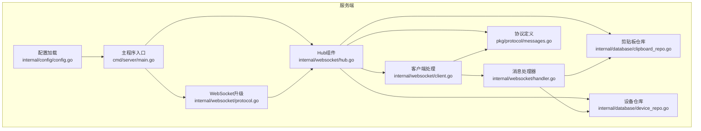
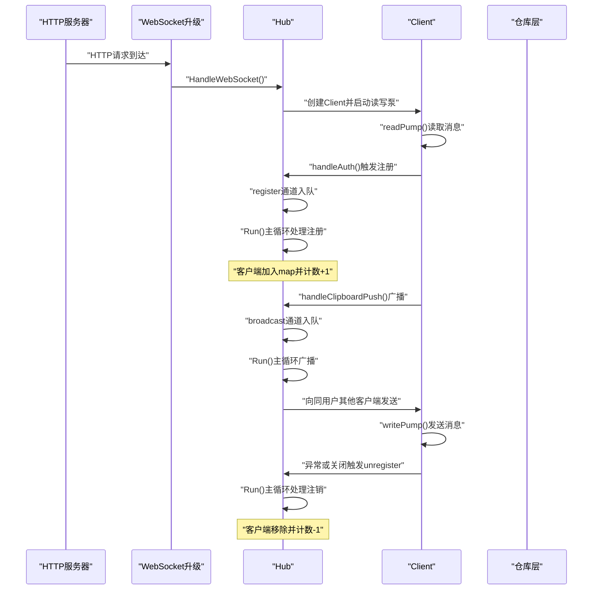
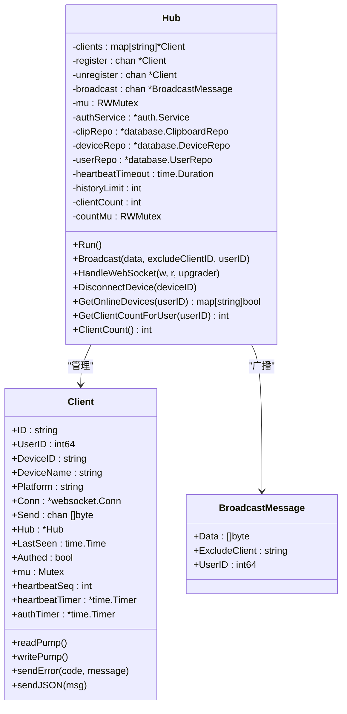
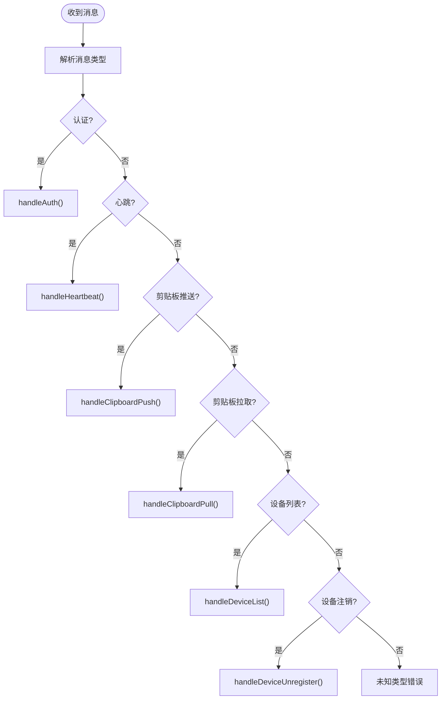
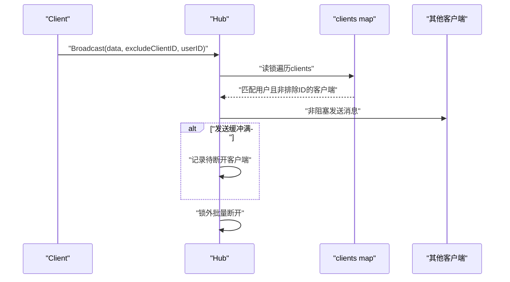
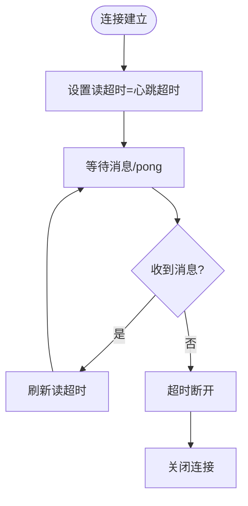
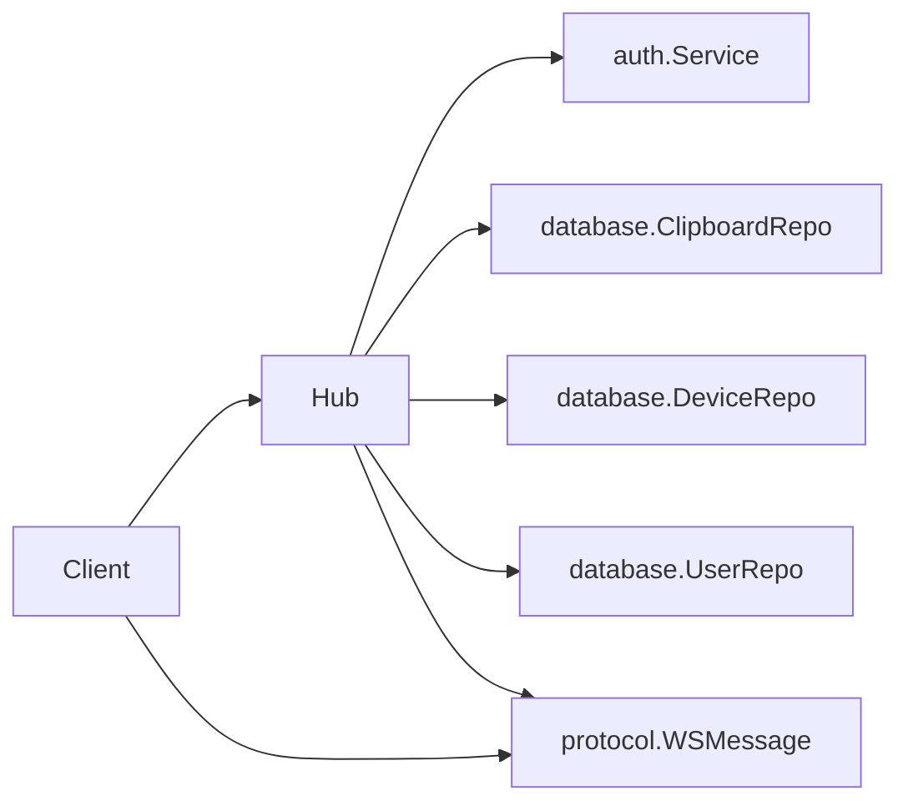

# WebSocket Hub组件

<cite>
**本文档引用的文件**
- [hub.go](file://clipSync-server/internal/websocket/hub.go)
- [client.go](file://clipSync-server/internal/websocket/client.go)
- [handler.go](file://clipSync-server/internal/websocket/handler.go)
- [protocol.go](file://clipSync-server/internal/websocket/protocol.go)
- [messages.go](file://clipSync-server/pkg/protocol/messages.go)
- [main.go](file://clipSync-server/cmd/server/main.go)
- [config.go](file://clipSync-server/internal/config/config.go)
- [clipboard_repo.go](file://clipSync-server/internal/database/clipboard_repo.go)
- [device_repo.go](file://clipSync-server/internal/database/device_repo.go)
</cite>

## 目录
1. [简介](#简介)
2. [项目结构](#项目结构)
3. [核心组件](#核心组件)
4. [架构概览](#架构概览)
5. [详细组件分析](#详细组件分析)
6. [依赖关系分析](#依赖关系分析)
7. [性能考量](#性能考量)
8. [故障排查指南](#故障排查指南)
9. [结论](#结论)

## 简介
本文件针对ClipSync服务端的WebSocket Hub组件进行深入技术文档化，重点覆盖以下方面：
- Hub的核心架构与职责边界
- 客户端注册/注销机制与生命周期管理
- 消息广播系统与过滤策略（按用户过滤、排除特定客户端）
- 心跳检测与超时处理机制
- 并发安全设计（读写锁、goroutine协调）
- 用户隔离与设备去重策略
- 资源清理与错误处理策略
- 性能优化与内存管理建议

## 项目结构
WebSocket Hub位于服务端Go模块中，采用分层组织：协议定义、WebSocket处理、HTTP路由与配置加载。关键文件如下：
- 协议定义：pkg/protocol/messages.go
- WebSocket Hub：internal/websocket/hub.go
- 客户端与消息处理：internal/websocket/client.go、internal/websocket/handler.go
- WebSocket升级与路由：internal/websocket/protocol.go
- 服务器入口与配置：cmd/server/main.go、internal/config/config.go
- 数据访问层：internal/database/clipboard_repo.go、internal/database/device_repo.go

**图表来源**
- [config.go:1-72](file://clipSync-server/internal/config/config.go#L1-L72)
- [main.go:1-146](file://clipSync-server/cmd/server/main.go#L1-L146)
- [hub.go:1-230](file://clipSync-server/internal/websocket/hub.go#L1-L230)
- [client.go:1-150](file://clipSync-server/internal/websocket/client.go#L1-L150)
- [handler.go:1-392](file://clipSync-server/internal/websocket/handler.go#L1-L392)
- [protocol.go:1-27](file://clipSync-server/internal/websocket/protocol.go#L1-L27)
- [messages.go:1-132](file://clipSync-server/pkg/protocol/messages.go#L1-L132)
- [clipboard_repo.go:1-140](file://clipSync-server/internal/database/clipboard_repo.go#L1-L140)
- [device_repo.go:1-126](file://clipSync-server/internal/database/device_repo.go#L1-L126)

**章节来源**
- [main.go:67-69](file://clipSync-server/cmd/server/main.go#L67-L69)
- [config.go:10-36](file://clipSync-server/internal/config/config.go#L10-L36)

## 核心组件
- Hub：负责维护所有WebSocket客户端连接、注册/注销、广播消息、统计在线数、设备断连等。
- Client：封装单个WebSocket连接的状态与行为，包括读写泵、心跳定时器、认证超时定时器、错误发送等。
- 消息处理器：根据消息类型分派到具体处理函数，如认证、心跳、剪贴板推送/拉取、设备列表、设备注销等。
- 协议模型：统一的消息格式与各消息类型的载荷结构，确保跨平台一致性。
- 仓库层：剪贴板历史存储与设备信息管理，支持重复内容校验、历史限制、设备在线状态更新等。

**章节来源**
- [hub.go:18-35](file://clipSync-server/internal/websocket/hub.go#L18-L35)
- [client.go:13-31](file://clipSync-server/internal/websocket/client.go#L13-L31)
- [handler.go:10-31](file://clipSync-server/internal/websocket/handler.go#L10-L31)
- [messages.go:5-132](file://clipSync-server/pkg/protocol/messages.go#L5-L132)
- [clipboard_repo.go:9-18](file://clipSync-server/internal/database/clipboard_repo.go#L9-L18)
- [device_repo.go:11-19](file://clipSync-server/internal/database/device_repo.go#L11-L19)

## 架构概览
Hub采用事件驱动的主循环模式，通过三个通道实现解耦：
- register/unregister：用于客户端注册与注销
- broadcast：用于广播消息队列
- 客户端Send缓冲通道：用于向客户端异步发送消息

**图表来源**
- [hub.go:61-112](file://clipSync-server/internal/websocket/hub.go#L61-L112)
- [hub.go:181-208](file://clipSync-server/internal/websocket/hub.go#L181-L208)
- [client.go:33-67](file://clipSync-server/internal/websocket/client.go#L33-L67)
- [client.go:69-117](file://clipSync-server/internal/websocket/client.go#L69-L117)
- [handler.go:33-110](file://clipSync-server/internal/websocket/handler.go#L33-L110)
- [handler.go:142-234](file://clipSync-server/internal/websocket/handler.go#L142-L234)

## 详细组件分析

### Hub组件
- 结构体字段
  - clients：客户端映射表，键为客户端ID，值为Client指针
  - register/unregister/broadcast：三个通道分别用于注册、注销、广播
  - mu：读写锁，保护clients与统计信息
  - authService/clipRepo/deviceRepo/userRepo：依赖注入的服务与仓库
  - heartbeatTimeout/historyLimit：心跳超时与历史条目限制
  - clientCount/countMu：总连接数与互斥锁
- 关键方法
  - Run：主循环，处理注册、注销、广播；广播时按用户过滤与排除特定客户端；对发送缓冲满的客户端进行标记并在锁外断开
  - Broadcast：向指定用户广播消息，排除sender
  - HandleWebSocket：HTTP升级为WebSocket，设置认证超时定时器，启动读写泵
  - DisconnectDevice：按设备ID断开连接
  - GetOnlineDevices/GetClientCountForUser：查询在线设备与用户连接数
  - ClientCount/incrementCount/decrementCount：连接数统计

**图表来源**
- [hub.go:18-35](file://clipSync-server/internal/websocket/hub.go#L18-L35)
- [hub.go:37-42](file://clipSync-server/internal/websocket/hub.go#L37-L42)
- [client.go:13-31](file://clipSync-server/internal/websocket/client.go#L13-L31)

**章节来源**
- [hub.go:18-58](file://clipSync-server/internal/websocket/hub.go#L18-L58)
- [hub.go:61-112](file://clipSync-server/internal/websocket/hub.go#L61-L112)
- [hub.go:114-153](file://clipSync-server/internal/websocket/hub.go#L114-L153)
- [hub.go:155-179](file://clipSync-server/internal/websocket/hub.go#L155-L179)
- [hub.go:181-208](file://clipSync-server/internal/websocket/hub.go#L181-L208)

### 客户端与消息处理
- Client结构体
  - 包含连接、发送缓冲、Hub引用、认证状态、心跳序列、定时器等
  - readPump：设置读超时与pong处理器，解析消息并调用handleMessage
  - writePump：周期性发送心跳，批量写出Send缓冲中的消息
  - 错误发送与JSON发送辅助方法
- 消息处理
  - handleMessage：按消息类型分派到具体处理函数
  - 认证：验证JWT令牌，设置用户身份，注册到Hub
  - 心跳：返回心跳确认并更新设备最后在线时间
  - 剪贴板推送：校验内容类型与去重，入库并广播同步消息
  - 剪贴板拉取：查询历史并返回
  - 设备列表：返回用户设备清单，并标注在线状态
  - 设备注销：删除设备并断开其他同设备ID的连接

**图表来源**
- [handler.go:10-31](file://clipSync-server/internal/websocket/handler.go#L10-L31)
- [handler.go:33-110](file://clipSync-server/internal/websocket/handler.go#L33-L110)
- [handler.go:112-140](file://clipSync-server/internal/websocket/handler.go#L112-L140)
- [handler.go:142-234](file://clipSync-server/internal/websocket/handler.go#L142-L234)
- [handler.go:236-285](file://clipSync-server/internal/websocket/handler.go#L236-L285)
- [handler.go:287-339](file://clipSync-server/internal/websocket/handler.go#L287-L339)
- [handler.go:341-391](file://clipSync-server/internal/websocket/handler.go#L341-L391)

**章节来源**
- [client.go:33-67](file://clipSync-server/internal/websocket/client.go#L33-L67)
- [client.go:69-117](file://clipSync-server/internal/websocket/client.go#L69-L117)
- [handler.go:10-31](file://clipSync-server/internal/websocket/handler.go#L10-L31)
- [handler.go:33-110](file://clipSync-server/internal/websocket/handler.go#L33-L110)
- [handler.go:112-140](file://clipSync-server/internal/websocket/handler.go#L112-L140)
- [handler.go:142-234](file://clipSync-server/internal/websocket/handler.go#L142-L234)
- [handler.go:236-285](file://clipSync-server/internal/websocket/handler.go#L236-L285)
- [handler.go:287-339](file://clipSync-server/internal/websocket/handler.go#L287-L339)
- [handler.go:341-391](file://clipSync-server/internal/websocket/handler.go#L341-L391)

### 广播系统与过滤机制
- 广播消息结构包含数据、排除客户端ID、目标用户ID
- Hub在广播时：
  - 使用读锁遍历clients
  - 过滤条件：仅目标用户且不等于排除ID
  - 发送时采用非阻塞select，若缓冲满则收集待断开客户端
  - 在锁外批量断开，避免死锁
- 客户端侧writePump会批量写出累积消息，减少系统调用次数

**图表来源**
- [hub.go:81-110](file://clipSync-server/internal/websocket/hub.go#L81-L110)
- [client.go:77-104](file://clipSync-server/internal/websocket/client.go#L77-L104)

**章节来源**
- [hub.go:37-42](file://clipSync-server/internal/websocket/hub.go#L37-L42)
- [hub.go:81-110](file://clipSync-server/internal/websocket/hub.go#L81-L110)
- [client.go:77-104](file://clipSync-server/internal/websocket/client.go#L77-L104)

### 心跳检测与超时处理
- 客户端readPump设置读超时为心跳超时，每次收到消息或pong都会刷新超时
- 客户端writePump每30秒发送一次Ping，作为服务器发起的心跳
- Hub在HandleWebSocket中设置30秒认证超时，未认证则断开
- 设备最后在线时间通过仓库层UpdateDeviceLastSeen更新

**图表来源**
- [client.go:40-45](file://clipSync-server/internal/websocket/client.go#L40-L45)
- [client.go:106-115](file://clipSync-server/internal/websocket/client.go#L106-L115)
- [hub.go:197-204](file://clipSync-server/internal/websocket/hub.go#L197-L204)
- [handler.go:136-139](file://clipSync-server/internal/websocket/handler.go#L136-L139)

**章节来源**
- [client.go:40-45](file://clipSync-server/internal/websocket/client.go#L40-L45)
- [client.go:106-115](file://clipSync-server/internal/websocket/client.go#L106-L115)
- [hub.go:197-204](file://clipSync-server/internal/websocket/hub.go#L197-L204)
- [handler.go:136-139](file://clipSync-server/internal/websocket/handler.go#L136-L139)

### 并发安全设计
- Hub使用读写锁：
  - mu保护clients映射与统计，读多写少场景下读锁提升并发
  - countMu独立保护clientCount，避免与mu竞争
- 客户端内部使用互斥锁：
  - writePump中对连接writer加锁，防止并发写入
  - authTimer与heartbeatTimer的停止与更新均在锁内进行
- 通道通信：
  - register/unregister/broadcast均为带缓冲通道，降低阻塞概率
  - 客户端Send通道默认缓冲256，平衡延迟与内存占用

**章节来源**
- [hub.go:24](file://clipSync-server/internal/websocket/hub.go#L24)
- [hub.go:34](file://clipSync-server/internal/websocket/hub.go#L34)
- [client.go:26](file://clipSync-server/internal/websocket/client.go#L26)
- [client.go:85-104](file://clipSync-server/internal/websocket/client.go#L85-L104)

### 用户隔离与设备去重
- 用户隔离：
  - Hub在广播时通过UserID过滤，确保不同用户间消息隔离
  - 设备列表接口仅返回当前用户设备，并标注在线状态
- 设备去重：
  - 设备注销时，Hub查找其他同设备ID的连接并断开，避免同一设备多连接
  - 剪贴板推送前检查重复checksum，避免重复内容广播

**章节来源**
- [hub.go:84-90](file://clipSync-server/internal/websocket/hub.go#L84-L90)
- [handler.go:315-327](file://clipSync-server/internal/websocket/handler.go#L315-L327)
- [handler.go:372-381](file://clipSync-server/internal/websocket/handler.go#L372-L381)
- [handler.go:162-172](file://clipSync-server/internal/websocket/handler.go#L162-L172)

### 客户端生命周期管理与资源清理
- 注册：handleAuth成功后通过register通道通知Hub，Hub将其加入clients映射并增加计数
- 运行期：readPump负责读取与解析消息；writePump负责心跳与批量发送
- 注销：readPump退出时向unregister通道发送自身；Hub移除clients映射并关闭Send通道
- 异常断开：readPump捕获意外关闭错误并触发注销；writePump在ticker或发送失败时关闭连接
- 资源清理：关闭连接、关闭Send通道、释放定时器、更新统计

**章节来源**
- [handler.go:93-94](file://clipSync-server/internal/websocket/handler.go#L93-L94)
- [hub.go:64-79](file://clipSync-server/internal/websocket/hub.go#L64-L79)
- [client.go:34-38](file://clipSync-server/internal/websocket/client.go#L34-L38)
- [client.go:70-75](file://clipSync-server/internal/websocket/client.go#L70-L75)

### 错误处理策略
- 协议错误：解析失败或未知类型时发送错误消息
- 认证失败：令牌无效或未在30秒内完成认证
- 业务错误：重复内容、设备不存在、数据库操作失败等
- 网络错误：读写超时、意外关闭、发送缓冲满等

**章节来源**
- [client.go:120-135](file://clipSync-server/internal/websocket/client.go#L120-L135)
- [handler.go:40-51](file://clipSync-server/internal/websocket/handler.go#L40-L51)
- [handler.go:156-172](file://clipSync-server/internal/websocket/handler.go#L156-L172)
- [client.go:49-54](file://clipSync-server/internal/websocket/client.go#L49-L54)

## 依赖关系分析
- Hub依赖：
  - auth.Service：JWT验证
  - database.ClipboardRepo：剪贴板历史存储与去重
  - database.DeviceRepo：设备信息与在线状态
  - database.UserRepo：用户相关操作
- Client依赖：
  - protocol.WSMessage：统一消息格式
  - gorilla/websocket：底层WebSocket库
- 协议层：
  - 统一的消息类型与载荷结构，便于跨平台兼容

**图表来源**
- [hub.go:26-29](file://clipSync-server/internal/websocket/hub.go#L26-L29)
- [client.go:3-11](file://clipSync-server/internal/websocket/client.go#L3-L11)
- [messages.go:5-132](file://clipSync-server/pkg/protocol/messages.go#L5-L132)

**章节来源**
- [hub.go:26-29](file://clipSync-server/internal/websocket/hub.go#L26-L29)
- [client.go:3-11](file://clipSync-server/internal/websocket/client.go#L3-L11)
- [messages.go:5-132](file://clipSync-server/pkg/protocol/messages.go#L5-L132)

## 性能考量
- 缓冲区设计
  - Hub广播通道容量为256，可缓解突发广播压力
  - 客户端Send通道容量为256，平衡延迟与内存占用
- 批量写出
  - writePump在写出时检查剩余可写消息数量，批量写出减少系统调用
- 读写分离
  - Hub使用读写锁，广播时读锁遍历clients，提高并发度
- 历史限制
  - 剪贴板历史上限由配置控制，插入时强制删除超出部分，避免无限增长
- 心跳与超时
  - 合理的心跳超时与认证超时，及时清理僵尸连接
- 建议
  - 可根据负载调整广播通道容量与客户端缓冲大小
  - 对高频广播场景可考虑分片或分区策略
  - 监控Send缓冲满率，必要时动态降级或限流

**章节来源**
- [hub.go:50](file://clipSync-server/internal/websocket/hub.go#L50)
- [client.go:192](file://clipSync-server/internal/websocket/client.go#L192)
- [client.go:94-98](file://clipSync-server/internal/websocket/client.go#L94-L98)
- [clipboard_repo.go:39-50](file://clipSync-server/internal/database/clipboard_repo.go#L39-L50)
- [config.go:19](file://clipSync-server/internal/config/config.go#L19)
- [config.go:20](file://clipSync-server/internal/config/config.go#L20)

## 故障排查指南
- 连接无法升级
  - 检查HTTP升级日志与错误输出
  - 确认WebSocket升级器配置与CORS策略
- 认证超时
  - 客户端应在30秒内完成认证，否则被断开
  - 检查JWT密钥与过期时间配置
- 心跳超时
  - 客户端读超时等于心跳超时，需确保网络稳定
  - 检查客户端writePump是否正常发送Ping
- 广播失败
  - 若客户端Send缓冲满，Hub会标记断开，需检查客户端消费速度
  - 确认目标用户ID与排除ID正确
- 设备重复登录
  - 注销设备时应断开其他同设备ID连接
  - 检查设备仓库的DeleteDevice与UpdateDeviceLastSeen逻辑

**章节来源**
- [hub.go:182-208](file://clipSync-server/internal/websocket/hub.go#L182-L208)
- [hub.go:197-204](file://clipSync-server/internal/websocket/hub.go#L197-L204)
- [client.go:40-45](file://clipSync-server/internal/websocket/client.go#L40-L45)
- [client.go:106-115](file://clipSync-server/internal/websocket/client.go#L106-L115)
- [handler.go:372-381](file://clipSync-server/internal/websocket/handler.go#L372-L381)

## 结论
WebSocket Hub组件通过清晰的职责划分与严格的并发控制，实现了高可用的多客户端消息广播系统。其核心优势包括：
- 明确的用户隔离与设备去重策略
- 健壮的心跳与超时处理机制
- 高效的广播过滤与批量写出
- 完善的生命周期管理与资源清理
配合合理的配置与监控，可在生产环境中稳定运行并具备良好的扩展性。