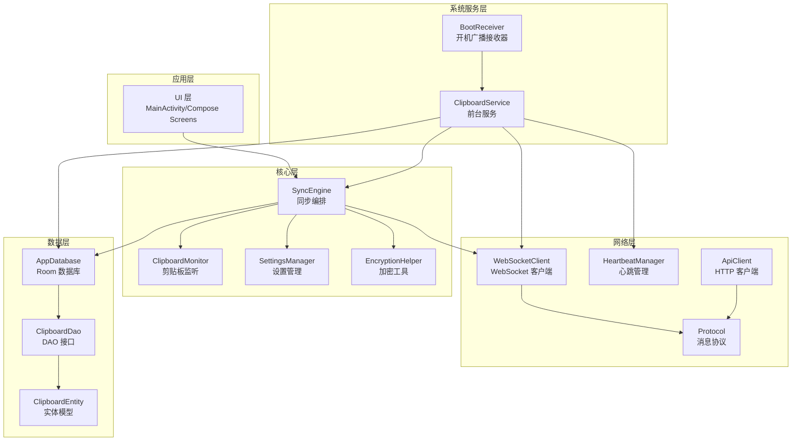
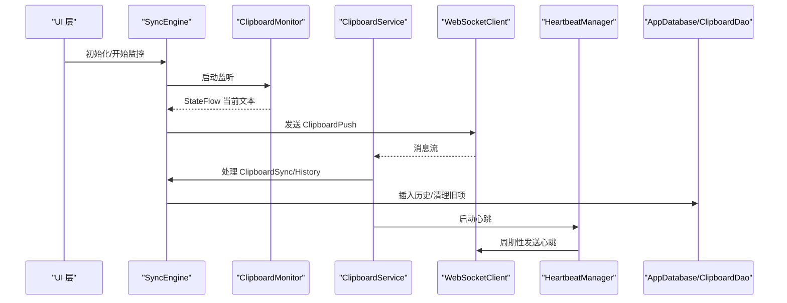
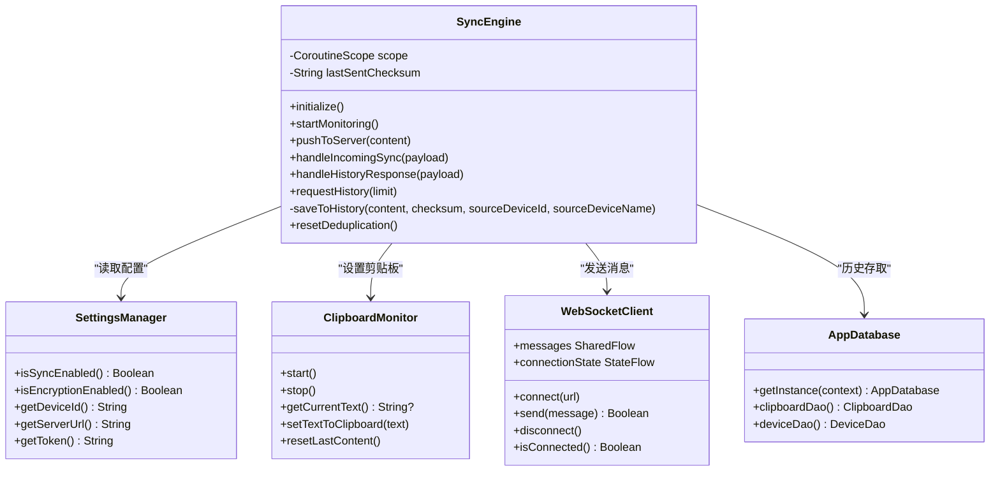
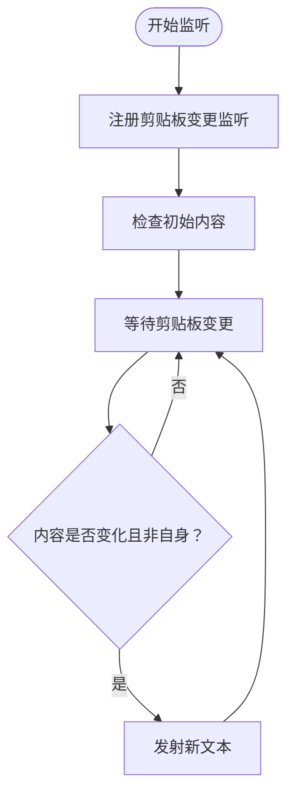
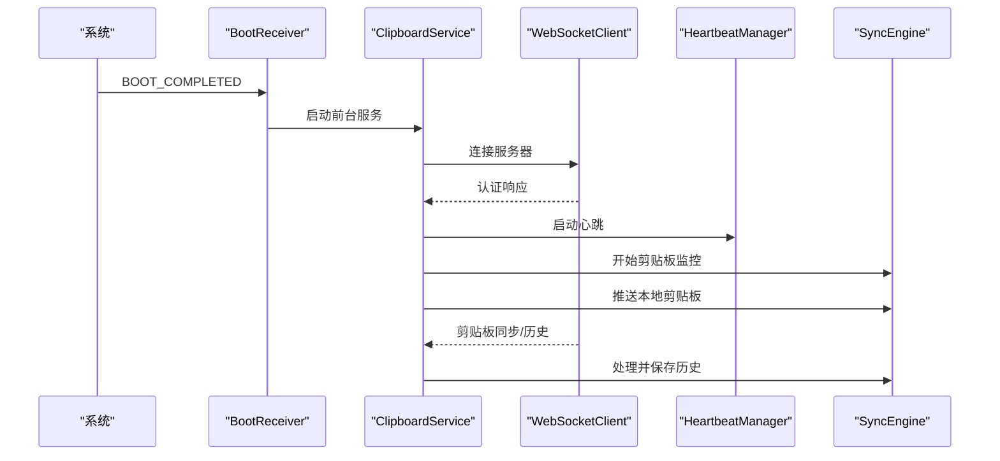
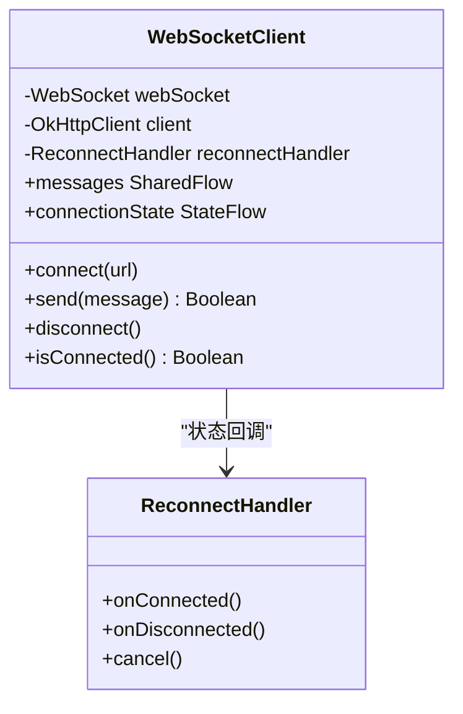
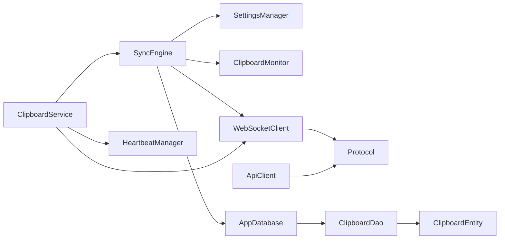

# Android同步引擎实现

<cite>
**本文档引用的文件**
- [SyncEngine.kt](file://clipSync-android/app/src/main/java/com/clipsync/app/core/SyncEngine.kt)
- [ClipboardService.kt](file://clipSync-android/app/src/main/java/com/clipsync/app/service/ClipboardService.kt)
- [ClipboardMonitor.kt](file://clipSync-android/app/src/main/java/com/clipsync/app/core/ClipboardMonitor.kt)
- [WebSocketClient.kt](file://clipSync-android/app/src/main/java/com/clipsync/app/network/WebSocketClient.kt)
- [SettingsManager.kt](file://clipSync-android/app/src/main/java/com/clipsync/app/core/SettingsManager.kt)
- [Protocol.kt](file://clipSync-android/app/src/main/java/com/clipsync/app/network/Protocol.kt)
- [EncryptionHelper.kt](file://clipSync-android/app/src/main/java/com/clipsync/app/core/EncryptionHelper.kt)
- [AppDatabase.kt](file://clipSync-android/app/src/main/java/com/clipsync/app/data/AppDatabase.kt)
- [ClipboardDao.kt](file://clipSync-android/app/src/main/java/com/clipsync/app/data/ClipboardDao.kt)
- [ClipboardEntity.kt](file://clipSync-android/app/src/main/java/com/clipsync/app/data/entities/ClipboardEntity.kt)
- [ApiClient.kt](file://clipSync-android/app/src/main/java/com/clipsync/app/network/ApiClient.kt)
- [HeartbeatManager.kt](file://clipSync-android/app/src/main/java/com/clipsync/app/network/HeartbeatManager.kt)
- [BootReceiver.kt](file://clipSync-android/app/src/main/java/com/clipsync/app/service/BootReceiver.kt)
- [AndroidManifest.xml](file://clipSync-android/app/src/main/AndroidManifest.xml)
- [MainActivity.kt](file://clipSync-android/app/src/main/java/com/clipsync/app/MainActivity.kt)
</cite>

## 目录
1. [简介](#简介)
2. [项目结构](#项目结构)
3. [核心组件](#核心组件)
4. [架构总览](#架构总览)
5. [详细组件分析](#详细组件分析)
6. [依赖关系分析](#依赖关系分析)
7. [性能考量](#性能考量)
8. [故障排除指南](#故障排除指南)
9. [结论](#结论)
10. [附录](#附录)

## 简介
本文件针对Android平台的SyncEngine实现进行全面技术文档化，重点覆盖以下方面：
- 协程异步处理与生命周期管理
- 后台服务与前台通知
- Android剪贴板监听机制、权限处理与系统集成
- 协程上下文切换、主线程更新与后台任务执行
- Android特有的内存管理、垃圾回收优化与电池续航考虑
- 权限申请流程、用户授权处理与隐私保护措施
- 性能监控、崩溃捕获与用户体验优化策略

## 项目结构
Android应用采用按功能域分层的组织方式：core（核心）、data（数据存储）、network（网络通信）、service（系统服务）、ui（界面）等模块清晰分离，便于维护与扩展。

图表来源
- [MainActivity.kt:1-139](file://clipSync-android/app/src/main/java/com/clipsync/app/MainActivity.kt#L1-L139)
- [SyncEngine.kt:1-250](file://clipSync-android/app/src/main/java/com/clipsync/app/core/SyncEngine.kt#L1-L250)
- [ClipboardMonitor.kt:1-106](file://clipSync-android/app/src/main/java/com/clipsync/app/core/ClipboardMonitor.kt#L1-L106)
- [SettingsManager.kt:1-170](file://clipSync-android/app/src/main/java/com/clipsync/app/core/SettingsManager.kt#L1-L170)
- [EncryptionHelper.kt:1-157](file://clipSync-android/app/src/main/java/com/clipsync/app/core/EncryptionHelper.kt#L1-L157)
- [WebSocketClient.kt:1-156](file://clipSync-android/app/src/main/java/com/clipsync/app/network/WebSocketClient.kt#L1-L156)
- [HeartbeatManager.kt:1-76](file://clipSync-android/app/src/main/java/com/clipsync/app/network/HeartbeatManager.kt#L1-L76)
- [ApiClient.kt:1-142](file://clipSync-android/app/src/main/java/com/clipsync/app/network/ApiClient.kt#L1-L142)
- [Protocol.kt:1-263](file://clipSync-android/app/src/main/java/com/clipsync/app/network/Protocol.kt#L1-L263)
- [AppDatabase.kt:1-41](file://clipSync-android/app/src/main/java/com/clipsync/app/data/AppDatabase.kt#L1-L41)
- [ClipboardDao.kt:1-50](file://clipSync-android/app/src/main/java/com/clipsync/app/data/ClipboardDao.kt#L1-L50)
- [ClipboardEntity.kt:1-20](file://clipSync-android/app/src/main/java/com/clipsync/app/data/entities/ClipboardEntity.kt#L1-L20)
- [ClipboardService.kt:1-249](file://clipSync-android/app/src/main/java/com/clipsync/app/service/ClipboardService.kt#L1-L249)
- [BootReceiver.kt:1-38](file://clipSync-android/app/src/main/java/com/clipsync/app/service/BootReceiver.kt#L1-L38)

章节来源
- [MainActivity.kt:1-139](file://clipSync-android/app/src/main/java/com/clipsync/app/MainActivity.kt#L1-L139)
- [AndroidManifest.xml:1-64](file://clipSync-android/app/src/main/AndroidManifest.xml#L1-L64)

## 核心组件
本节对关键组件进行深入分析，涵盖职责、数据结构、复杂度与性能特征。

- SyncEngine：负责剪贴板推送、远程同步、历史管理与去重控制；通过协程在IO线程执行，状态通过StateFlow暴露给UI。
- ClipboardMonitor：基于系统剪贴板服务监听变化，使用StateFlow对外发布文本变更；具备防回环机制。
- SettingsManager：基于DataStore持久化配置，提供流式读取与写入，支持默认值与设备ID生成。
- WebSocketClient：基于OkHttp封装WebSocket，提供连接状态、消息流与自动重连；消息通过SharedFlow传递。
- HeartbeatManager：周期性发送心跳，维持长连接活跃。
- EncryptionHelper：提供AES-256-CBC加解密与校验和计算，支持盐值与IV随机化。
- AppDatabase/ClipboardDao/ClipboardEntity：基于Room的本地数据库，用于历史记录存储与查询。
- ClipboardService：前台服务，整合上述组件，确保后台持续运行与剪贴板监控。
- BootReceiver：开机自启广播接收器，启动前台服务。
- ApiClient：HTTP客户端，提供登录、注册、设备列表等接口调用。
- Protocol：统一的WebSocket消息协议定义与构建器。

章节来源
- [SyncEngine.kt:27-250](file://clipSync-android/app/src/main/java/com/clipsync/app/core/SyncEngine.kt#L27-L250)
- [ClipboardMonitor.kt:15-106](file://clipSync-android/app/src/main/java/com/clipsync/app/core/ClipboardMonitor.kt#L15-L106)
- [SettingsManager.kt:21-170](file://clipSync-android/app/src/main/java/com/clipsync/app/core/SettingsManager.kt#L21-L170)
- [WebSocketClient.kt:26-156](file://clipSync-android/app/src/main/java/com/clipsync/app/network/WebSocketClient.kt#L26-L156)
- [HeartbeatManager.kt:16-76](file://clipSync-android/app/src/main/java/com/clipsync/app/network/HeartbeatManager.kt#L16-L76)
- [EncryptionHelper.kt:22-157](file://clipSync-android/app/src/main/java/com/clipsync/app/core/EncryptionHelper.kt#L22-L157)
- [AppDatabase.kt:14-41](file://clipSync-android/app/src/main/java/com/clipsync/app/data/AppDatabase.kt#L14-L41)
- [ClipboardDao.kt:13-50](file://clipSync-android/app/src/main/java/com/clipsync/app/data/ClipboardDao.kt#L13-L50)
- [ClipboardEntity.kt:9-20](file://clipSync-android/app/src/main/java/com/clipsync/app/data/entities/ClipboardEntity.kt#L9-L20)
- [ClipboardService.kt:39-249](file://clipSync-android/app/src/main/java/com/clipsync/app/service/ClipboardService.kt#L39-L249)
- [BootReceiver.kt:13-38](file://clipSync-android/app/src/main/java/com/clipsync/app/service/BootReceiver.kt#L13-L38)
- [ApiClient.kt:14-142](file://clipSync-android/app/src/main/java/com/clipsync/app/network/ApiClient.kt#L14-L142)
- [Protocol.kt:20-263](file://clipSync-android/app/src/main/java/com/clipsync/app/network/Protocol.kt#L20-L263)

## 架构总览
下图展示从UI到系统服务与网络的端到端交互路径，突出协程上下文、消息流与状态管理。

图表来源
- [SyncEngine.kt:43-250](file://clipSync-android/app/src/main/java/com/clipsync/app/core/SyncEngine.kt#L43-L250)
- [ClipboardMonitor.kt:31-93](file://clipSync-android/app/src/main/java/com/clipsync/app/core/ClipboardMonitor.kt#L31-L93)
- [ClipboardService.kt:52-249](file://clipSync-android/app/src/main/java/com/clipsync/app/service/ClipboardService.kt#L52-L249)
- [WebSocketClient.kt:83-144](file://clipSync-android/app/src/main/java/com/clipsync/app/network/WebSocketClient.kt#L83-L144)
- [HeartbeatManager.kt:27-70](file://clipSync-android/app/src/main/java/com/clipsync/app/network/HeartbeatManager.kt#L27-L70)
- [AppDatabase.kt:30-41](file://clipSync-android/app/src/main/java/com/clipsync/app/data/AppDatabase.kt#L30-L41)
- [ClipboardDao.kt:25-49](file://clipSync-android/app/src/main/java/com/clipsync/app/data/ClipboardDao.kt#L25-L49)

## 详细组件分析

### SyncEngine 组件分析
- 职责：协调本地剪贴板与服务器之间的同步，处理推送、拉取、历史管理与去重。
- 关键点：
  - 使用SupervisorJob + IO调度器的协程作用域，避免单个异常影响整体。
  - 通过SettingsManager控制开关与加密策略，结合EncryptionHelper进行加解密。
  - 去重逻辑基于内容校验和，防止重复推送与回环。
  - 历史保存时限制条目数量，避免无限增长。
- 复杂度：
  - 推送/接收处理为O(1)，历史插入为O(n)（批量插入），查询为O(log n + k)（分页）。

图表来源
- [SyncEngine.kt:27-250](file://clipSync-android/app/src/main/java/com/clipsync/app/core/SyncEngine.kt#L27-L250)
- [SettingsManager.kt:21-170](file://clipSync-android/app/src/main/java/com/clipsync/app/core/SettingsManager.kt#L21-L170)
- [ClipboardMonitor.kt:15-106](file://clipSync-android/app/src/main/java/com/clipsync/app/core/ClipboardMonitor.kt#L15-L106)
- [WebSocketClient.kt:26-156](file://clipSync-android/app/src/main/java/com/clipsync/app/network/WebSocketClient.kt#L26-L156)
- [AppDatabase.kt:14-41](file://clipSync-android/app/src/main/java/com/clipsync/app/data/AppDatabase.kt#L14-L41)

章节来源
- [SyncEngine.kt:43-250](file://clipSync-android/app/src/main/java/com/clipsync/app/core/SyncEngine.kt#L43-L250)

### ClipboardMonitor 组件分析
- 职责：监听系统剪贴板变化，提供当前文本流，并安全地设置剪贴板内容而不触发自身监听。
- 防回环机制：通过lastContent标记避免“收到自己发出的内容”导致的循环。
- 异常处理：对SecurityException进行日志记录，保证稳定性。

图表来源
- [ClipboardMonitor.kt:31-93](file://clipSync-android/app/src/main/java/com/clipsync/app/core/ClipboardMonitor.kt#L31-L93)

章节来源
- [ClipboardMonitor.kt:15-106](file://clipSync-android/app/src/main/java/com/clipsync/app/core/ClipboardMonitor.kt#L15-L106)

### ClipboardService 组件分析
- 职责：前台服务，整合剪贴板监听、WebSocket通信、心跳管理与数据库操作，确保应用在后台稳定运行。
- 生命周期：onCreate中初始化各组件，onDestroy中释放资源；START_STICKY保证被杀后重启。
- 通知与权限：创建通知渠道并以前台服务运行；声明必要的系统权限。
- 消息处理：根据消息类型分发至相应处理器，如认证响应、剪贴板同步、设备列表、错误与Ping。

图表来源
- [BootReceiver.kt:15-32](file://clipSync-android/app/src/main/java/com/clipsync/app/service/BootReceiver.kt#L15-L32)
- [ClipboardService.kt:52-249](file://clipSync-android/app/src/main/java/com/clipsync/app/service/ClipboardService.kt#L52-L249)
- [WebSocketClient.kt:83-144](file://clipSync-android/app/src/main/java/com/clipsync/app/network/WebSocketClient.kt#L83-L144)
- [HeartbeatManager.kt:27-70](file://clipSync-android/app/src/main/java/com/clipsync/app/network/HeartbeatManager.kt#L27-L70)
- [SyncEngine.kt:72-160](file://clipSync-android/app/src/main/java/com/clipsync/app/core/SyncEngine.kt#L72-L160)

章节来源
- [ClipboardService.kt:39-249](file://clipSync-android/app/src/main/java/com/clipsync/app/service/ClipboardService.kt#L39-L249)
- [AndroidManifest.xml:43-59](file://clipSync-android/app/src/main/AndroidManifest.xml#L43-L59)

### WebSocketClient 组件分析
- 职责：封装OkHttp WebSocket，提供连接状态、消息流与自动重连。
- 设计要点：
  - 使用SharedFlow传递消息，避免阻塞；StateFlow暴露连接状态。
  - ping间隔与超时配置，提升连接稳定性。
  - 失败回调触发重连处理器，保持连接可用性。

图表来源
- [WebSocketClient.kt:26-156](file://clipSync-android/app/src/main/java/com/clipsync/app/network/WebSocketClient.kt#L26-L156)

章节来源
- [WebSocketClient.kt:26-156](file://clipSync-android/app/src/main/java/com/clipsync/app/network/WebSocketClient.kt#L26-L156)

### SettingsManager 组件分析
- 职责：基于DataStore Preferences持久化配置，提供流式读取与写入。
- 特性：
  - 默认值管理，首次访问自动生成设备ID。
  - 支持服务器URL、用户名、令牌、设备名、同步开关与加密开关等。
  - 提供登录状态检查方法。

章节来源
- [SettingsManager.kt:21-170](file://clipSync-android/app/src/main/java/com/clipsync/app/core/SettingsManager.kt#L21-L170)

### EncryptionHelper 组件分析
- 职责：提供AES-256-CBC加解密与SHA-256校验和计算。
- 安全设计：
  - PBKDF2-SHA256派生密钥，10000次迭代，256位密钥长度。
  - 每次加密生成随机盐与IV，格式兼容跨平台传输。
  - 解密失败返回空值，避免泄露明文。

章节来源
- [EncryptionHelper.kt:22-157](file://clipSync-android/app/src/main/java/com/clipsync/app/core/EncryptionHelper.kt#L22-L157)

### AppDatabase/ClipboardDao/ClipboardEntity 组件分析
- 职责：Room数据库提供本地历史存储，支持分页查询与去重插入。
- 查询优化：
  - 历史表按时间倒序，限制保留数量，定期清理旧数据。
  - 通过索引与LIMIT优化常见查询。

章节来源
- [AppDatabase.kt:14-41](file://clipSync-android/app/src/main/java/com/clipsync/app/data/AppDatabase.kt#L14-L41)
- [ClipboardDao.kt:13-50](file://clipSync-android/app/src/main/java/com/clipsync/app/data/ClipboardDao.kt#L13-L50)
- [ClipboardEntity.kt:9-20](file://clipSync-android/app/src/main/java/com/clipsync/app/data/entities/ClipboardEntity.kt#L9-L20)

### BootReceiver 组件分析
- 职责：监听系统开机与包替换事件，启动前台服务。
- 兼容性：根据系统版本选择startForegroundService或startService。

章节来源
- [BootReceiver.kt:13-38](file://clipSync-android/app/src/main/java/com/clipsync/app/service/BootReceiver.kt#L13-L38)

### ApiClient 组件分析
- 职责：提供HTTP API调用，支持登录、注册、刷新令牌、设备列表与注销。
- 实现：基于HttpURLConnection，避免引入额外依赖，简化构建。

章节来源
- [ApiClient.kt:14-142](file://clipSync-android/app/src/main/java/com/clipsync/app/network/ApiClient.kt#L14-L142)

### Protocol 组件分析
- 职责：统一WebSocket消息协议，定义消息类型、载荷结构与构建器。
- 价值：确保客户端与服务端消息格式一致，便于扩展与维护。

章节来源
- [Protocol.kt:20-263](file://clipSync-android/app/src/main/java/com/clipsync/app/network/Protocol.kt#L20-L263)

## 依赖关系分析
- 组件耦合：
  - SyncEngine依赖SettingsManager、ClipboardMonitor、WebSocketClient与AppDatabase，内聚性高，职责单一。
  - ClipboardService作为编排者，聚合多个组件并负责生命周期管理。
  - WebSocketClient与HeartbeatManager松耦合，通过消息流与状态流交互。
- 外部依赖：
  - OkHttp用于WebSocket通信。
  - Room用于本地持久化。
  - DataStore用于配置持久化。
  - Jetpack Compose用于UI。

图表来源
- [SyncEngine.kt:27-32](file://clipSync-android/app/src/main/java/com/clipsync/app/core/SyncEngine.kt#L27-L32)
- [ClipboardService.kt:63-68](file://clipSync-android/app/src/main/java/com/clipsync/app/service/ClipboardService.kt#L63-L68)
- [WebSocketClient.kt:28-44](file://clipSync-android/app/src/main/java/com/clipsync/app/network/WebSocketClient.kt#L28-L44)
- [Protocol.kt:20-34](file://clipSync-android/app/src/main/java/com/clipsync/app/network/Protocol.kt#L20-L34)
- [AppDatabase.kt:21-22](file://clipSync-android/app/src/main/java/com/clipsync/app/data/AppDatabase.kt#L21-L22)
- [ClipboardDao.kt:14-29](file://clipSync-android/app/src/main/java/com/clipsync/app/data/ClipboardDao.kt#L14-L29)

章节来源
- [SyncEngine.kt:27-32](file://clipSync-android/app/src/main/java/com/clipsync/app/core/SyncEngine.kt#L27-L32)
- [ClipboardService.kt:63-68](file://clipSync-android/app/src/main/java/com/clipsync/app/service/ClipboardService.kt#L63-L68)
- [WebSocketClient.kt:28-44](file://clipSync-android/app/src/main/java/com/clipsync/app/network/WebSocketClient.kt#L28-L44)
- [Protocol.kt:20-34](file://clipSync-android/app/src/main/java/com/clipsync/app/network/Protocol.kt#L20-L34)
- [AppDatabase.kt:21-22](file://clipSync-android/app/src/main/java/com/clipsync/app/data/AppDatabase.kt#L21-L22)
- [ClipboardDao.kt:14-29](file://clipSync-android/app/src/main/java/com/clipsync/app/data/ClipboardDao.kt#L14-L29)

## 性能考量
- 协程与上下文：
  - 所有网络与数据库操作在IO调度器执行，避免阻塞主线程。
  - 使用SupervisorJob隔离子任务异常，提高鲁棒性。
- 内存与GC：
  - 使用SharedFlow缓冲队列，合理设置容量，避免内存暴涨。
  - 历史表限制条目数量，定期清理旧数据，降低数据库压力。
- 电池续航：
  - 心跳间隔30秒，适度降低功耗。
  - 前台服务使用低重要性通知通道，减少打扰。
- 网络优化：
  - WebSocket长连接+心跳保活，减少频繁握手开销。
  - 自动重连与连接状态流，提升稳定性。

## 故障排除指南
- 常见问题与定位：
  - 无法连接服务器：检查SettingsManager中的服务器URL与令牌，确认WebSocketClient连接状态。
  - 剪贴板无响应：确认ClipboardMonitor已启动，检查系统权限与通知渠道。
  - 历史未更新：核对handleHistoryResponse处理逻辑与数据库插入流程。
  - 加解密失败：检查EncryptionHelper密码设置与输入格式。
- 日志与调试：
  - 各组件均输出详细日志，便于定位问题。
  - 使用StateFlow/SharedFlow观察状态变化，辅助诊断。

章节来源
- [ClipboardService.kt:131-144](file://clipSync-android/app/src/main/java/com/clipsync/app/service/ClipboardService.kt#L131-L144)
- [SyncEngine.kt:72-123](file://clipSync-android/app/src/main/java/com/clipsync/app/core/SyncEngine.kt#L72-L123)
- [EncryptionHelper.kt:72-102](file://clipSync-android/app/src/main/java/com/clipsync/app/core/EncryptionHelper.kt#L72-L102)

## 结论
该Android同步引擎通过清晰的分层架构与协程异步处理，实现了稳定的剪贴板跨设备同步。前台服务确保后台运行，剪贴板监听与去重机制有效避免回环，Room本地存储与历史管理兼顾性能与可维护性。建议后续增强用户授权流程与隐私保护措施，并完善性能监控与崩溃捕获体系。

## 附录
- 权限清单与用途
  - INTERNET/ACCESS_NETWORK_STATE：网络通信
  - FOREGROUND_SERVICE/FOREGROUND_SERVICE_CLIPBOARD：前台服务运行
  - RECEIVE_BOOT_COMPLETED：开机自启
  - POST_NOTIFICATIONS：通知权限（Android 13+）
- 用户授权与隐私
  - 登录/注册通过HTTP API完成，令牌用于WebSocket认证。
  - 可选加密传输，建议在生产环境提供用户可控的加密密码设置。
- 用户体验优化
  - 前台通知显示运行状态，避免误关闭。
  - 分页加载历史，减少首屏压力。
  - 心跳保活与自动重连，提升连接稳定性。

章节来源
- [AndroidManifest.xml:5-17](file://clipSync-android/app/src/main/AndroidManifest.xml#L5-L17)
- [ApiClient.kt:23-71](file://clipSync-android/app/src/main/java/com/clipsync/app/network/ApiClient.kt#L23-L71)
- [SettingsManager.kt:99-112](file://clipSync-android/app/src/main/java/com/clipsync/app/core/SettingsManager.kt#L99-L112)
- [EncryptionHelper.kt:33-41](file://clipSync-android/app/src/main/java/com/clipsync/app/core/EncryptionHelper.kt#L33-L41)