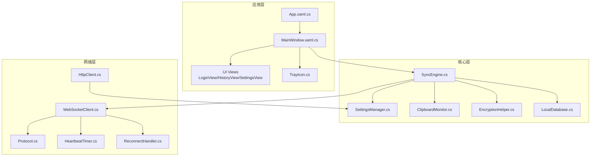
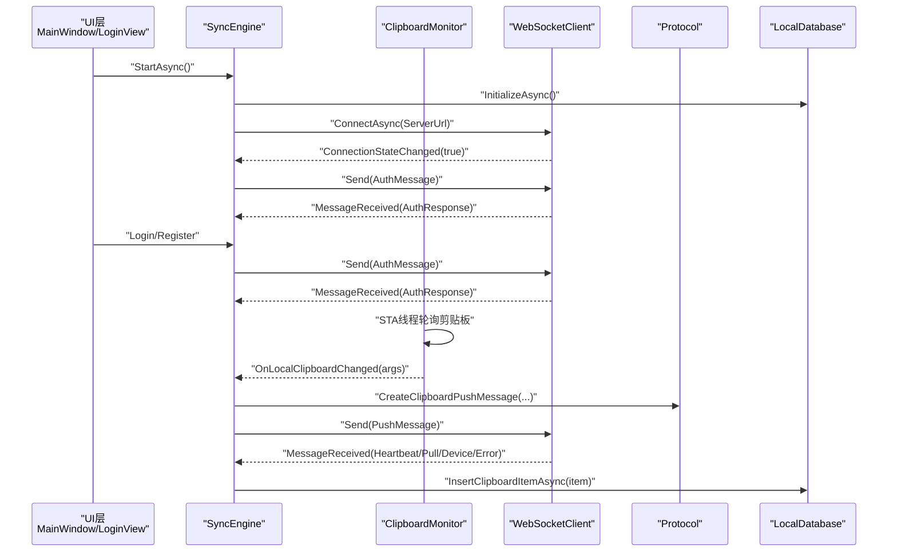
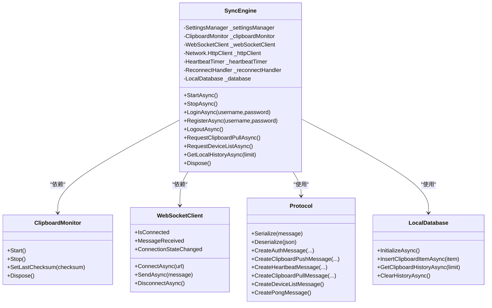
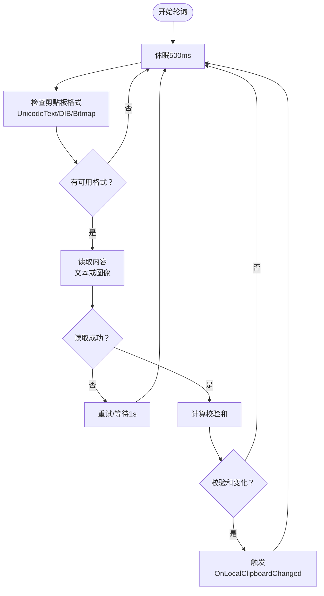
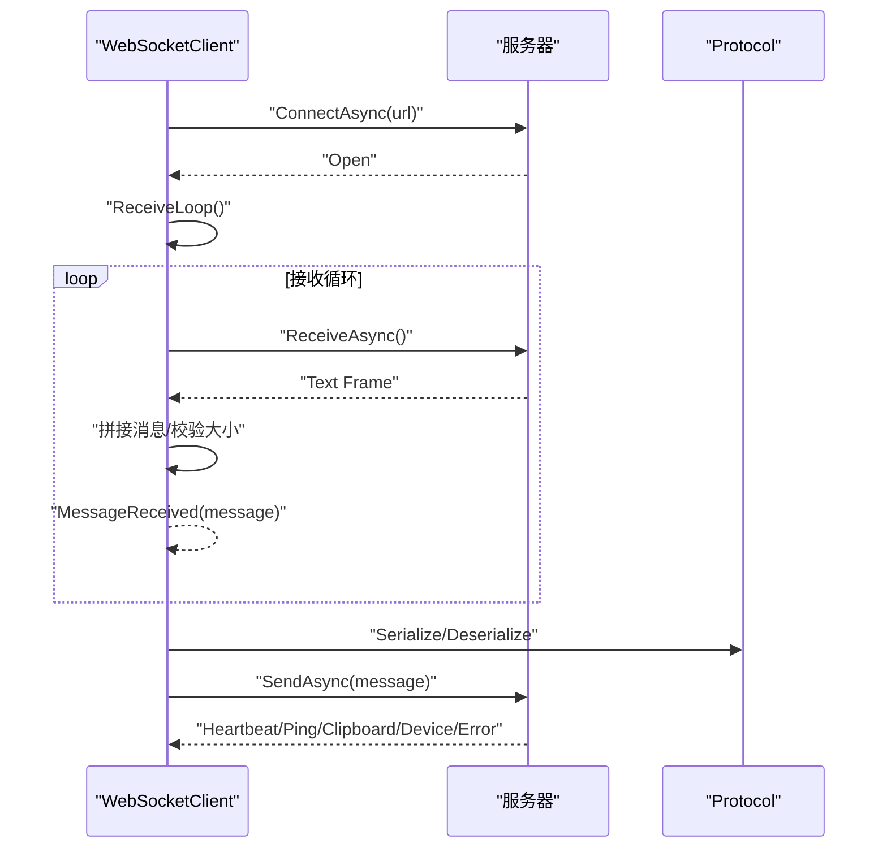
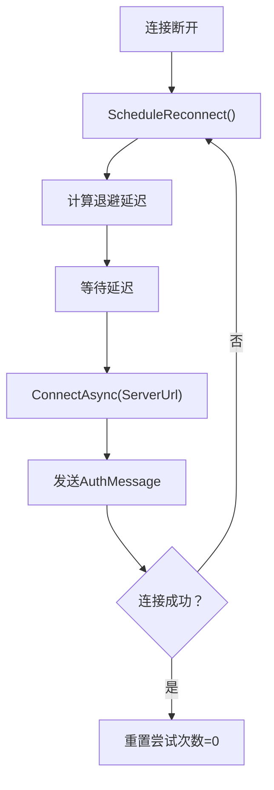
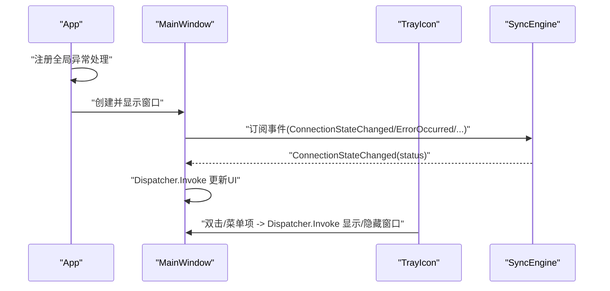
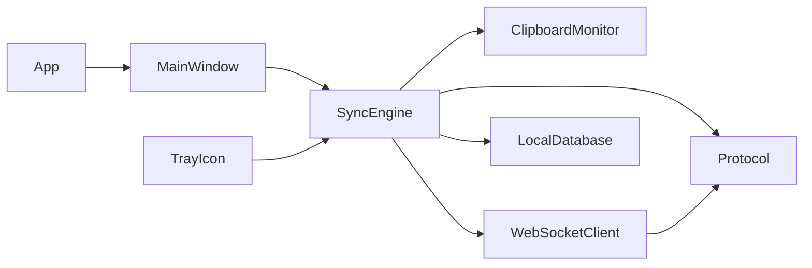

# Windows同步引擎实现

<cite>
**本文档引用的文件**
- [SyncEngine.cs](file://clipSync-windows/ClipSync.WPF/Core/SyncEngine.cs)
- [ClipboardMonitor.cs](file://clipSync-windows/ClipSync.WPF/Core/ClipboardMonitor.cs)
- [EncryptionHelper.cs](file://clipSync-windows/ClipSync.WPF/Core/EncryptionHelper.cs)
- [WebSocketClient.cs](file://clipSync-windows/ClipSync.WPF/Network/WebSocketClient.cs)
- [Protocol.cs](file://clipSync-windows/ClipSync.WPF/Network/Protocol.cs)
- [SettingsManager.cs](file://clipSync-windows/ClipSync.WPF/Core/SettingsManager.cs)
- [LocalDatabase.cs](file://clipSync-windows/ClipSync.WPF/Storage/LocalDatabase.cs)
- [HttpClient.cs](file://clipSync-windows/ClipSync.WPF/Network/HttpClient.cs)
- [HeartbeatTimer.cs](file://clipSync-windows/ClipSync.WPF/Network/HeartbeatTimer.cs)
- [ReconnectHandler.cs](file://clipSync-windows/ClipSync.WPF/Network/ReconnectHandler.cs)
- [App.xaml.cs](file://clipSync-windows/ClipSync.WPF/App.xaml.cs)
- [MainWindow.xaml.cs](file://clipSync-windows/ClipSync.WPF/MainWindow.xaml.cs)
- [TrayIcon.cs](file://clipSync-windows/ClipSync.WPF/SystemTray/TrayIcon.cs)
- [LoginView.xaml.cs](file://clipSync-windows/ClipSync.WPF/UI/Views/LoginView.xaml.cs)
- [HistoryView.xaml.cs](file://clipSync-windows/ClipSync.WPF/UI/Views/HistoryView.xaml.cs)
- [SettingsView.xaml.cs](file://clipSync-windows/ClipSync.WPF/UI/Views/SettingsView.xaml.cs)
</cite>

## 目录
1. [简介](#简介)
2. [项目结构](#项目结构)
3. [核心组件](#核心组件)
4. [架构总览](#架构总览)
5. [详细组件分析](#详细组件分析)
6. [依赖关系分析](#依赖关系分析)
7. [性能考虑](#性能考虑)
8. [故障排除指南](#故障排除指南)
9. [结论](#结论)
10. [附录](#附录)

## 简介
本文件面向Windows平台的SyncEngine实现，系统性解析同步引擎在Windows环境中的架构与实现细节，重点覆盖以下方面：
- 剪贴板监控机制：基于STA线程模型的轮询与事件驱动结合、内容读取与校验、去重与防抖
- WebSocket通信处理：连接管理、心跳保活、消息序列化与反序列化、重连策略
- 消息序列化与反序列化：统一的WebSocket消息格式、JSON序列化与错误容错
- Windows特有的UI线程调度：Dispatcher.Invoke模式、WPF集成与托盘交互
- 图像处理与文本设置：图像编码、内存流使用、位图冻结与剪贴板写入
- 错误处理策略：异常捕获、用户反馈、全局异常处理
- 性能优化与资源管理：线程模型选择、数据库索引、SQLite写入限制、加密开销控制
- 调试方法与常见问题：日志输出、断点定位、典型问题排查

## 项目结构
Windows客户端采用WPF应用，核心逻辑集中在ClipSync.WPF项目中，按职责划分为：
- Core：同步引擎、剪贴板监控、加密工具、设置管理、本地数据库
- Network：WebSocket客户端、HTTP认证、心跳定时器、重连处理器、协议编解码
- UI：主窗口、登录视图、历史视图、设置视图
- SystemTray：托盘图标与菜单
- Storage：SQLite本地历史存储

图表来源
- [App.xaml.cs:12-52](file://clipSync-windows/ClipSync.WPF/App.xaml.cs#L12-L52)
- [MainWindow.xaml.cs:21-48](file://clipSync-windows/ClipSync.WPF/MainWindow.xaml.cs#L21-L48)
- [SyncEngine.cs:32-57](file://clipSync-windows/ClipSync.WPF/Core/SyncEngine.cs#L32-L57)
- [WebSocketClient.cs:22-39](file://clipSync-windows/ClipSync.WPF/Network/WebSocketClient.cs#L22-L39)
- [Protocol.cs:60-77](file://clipSync-windows/ClipSync.WPF/Network/Protocol.cs#L60-L77)
- [HttpClient.cs:32-82](file://clipSync-windows/ClipSync.WPF/Network/HttpClient.cs#L32-L82)
- [HeartbeatTimer.cs:21-28](file://clipSync-windows/ClipSync.WPF/Network/HeartbeatTimer.cs#L21-L28)
- [ReconnectHandler.cs:33-71](file://clipSync-windows/ClipSync.WPF/Network/ReconnectHandler.cs#L33-L71)

章节来源
- [App.xaml.cs:12-52](file://clipSync-windows/ClipSync.WPF/App.xaml.cs#L12-L52)
- [MainWindow.xaml.cs:21-48](file://clipSync-windows/ClipSync.WPF/MainWindow.xaml.cs#L21-L48)
- [SyncEngine.cs:32-57](file://clipSync-windows/ClipSync.WPF/Core/SyncEngine.cs#L32-L57)

## 核心组件
- 同步引擎（SyncEngine）：协调剪贴板监控、WebSocket通信、心跳、重连、本地数据库、加密与消息协议；提供登录/注册/登出、历史拉取、设备列表查询等业务接口
- 剪贴板监控（ClipboardMonitor）：在STA线程中轮询剪贴板，检测文本或图像变化，计算校验和，避免重复推送
- 加密工具（EncryptionHelper）：AES-256-CBC统一格式，PBKDF2-SHA256派生密钥，支持内容加密与校验和计算
- WebSocket客户端（WebSocketClient）：连接/发送/接收循环、最大消息大小限制、连接状态事件
- 协议编解码（Protocol）：WebSocket消息结构、序列化/反序列化、各类消息构造器
- 设置管理（SettingsManager）：应用配置持久化、并发安全更新
- 本地数据库（LocalDatabase）：SQLite表结构、索引、插入与历史查询、自动清理
- HTTP客户端（HttpClient）：登录/注册/刷新令牌的REST调用
- 心跳定时器（HeartbeatTimer）：周期性发送心跳消息
- 重连处理器（ReconnectHandler）：指数退避重连、认证后重置尝试次数
- 托盘与UI（TrayIcon、MainWindow、各View）：WPF UI、Dispatcher调度、托盘菜单、登录/历史/设置视图

章节来源
- [SyncEngine.cs:8-31](file://clipSync-windows/ClipSync.WPF/Core/SyncEngine.cs#L8-L31)
- [ClipboardMonitor.cs:26-37](file://clipSync-windows/ClipSync.WPF/Core/ClipboardMonitor.cs#L26-L37)
- [EncryptionHelper.cs:18-55](file://clipSync-windows/ClipSync.WPF/Core/EncryptionHelper.cs#L18-L55)
- [WebSocketClient.cs:10-21](file://clipSync-windows/ClipSync.WPF/Network/WebSocketClient.cs#L10-L21)
- [Protocol.cs:60-165](file://clipSync-windows/ClipSync.WPF/Network/Protocol.cs#L60-L165)
- [SettingsManager.cs:44-99](file://clipSync-windows/ClipSync.WPF/Core/SettingsManager.cs#L44-L99)
- [LocalDatabase.cs:9-58](file://clipSync-windows/ClipSync.WPF/Storage/LocalDatabase.cs#L9-L58)
- [HttpClient.cs:20-134](file://clipSync-windows/ClipSync.WPF/Network/HttpClient.cs#L20-L134)
- [HeartbeatTimer.cs:7-29](file://clipSync-windows/ClipSync.WPF/Network/HeartbeatTimer.cs#L7-L29)
- [ReconnectHandler.cs:8-31](file://clipSync-windows/ClipSync.WPF/Network/ReconnectHandler.cs#L8-L31)
- [TrayIcon.cs:9-27](file://clipSync-windows/ClipSync.WPF/SystemTray/TrayIcon.cs#L9-L27)
- [MainWindow.xaml.cs:11-48](file://clipSync-windows/ClipSync.WPF/MainWindow.xaml.cs#L11-L48)

## 架构总览
Windows同步引擎以“事件驱动+轮询”的方式工作：UI通过SyncEngine触发登录/注册/设置变更；后台STA线程监控剪贴板变化；WebSocket负责与服务器通信，配合心跳与重连；本地SQLite保存历史；加密模块贯穿发送与接收两端。

图表来源
- [SyncEngine.cs:32-93](file://clipSync-windows/ClipSync.WPF/Core/SyncEngine.cs#L32-L93)
- [ClipboardMonitor.cs:39-87](file://clipSync-windows/ClipSync.WPF/Core/ClipboardMonitor.cs#L39-L87)
- [WebSocketClient.cs:22-39](file://clipSync-windows/ClipSync.WPF/Network/WebSocketClient.cs#L22-L39)
- [Protocol.cs:79-141](file://clipSync-windows/ClipSync.WPF/Network/Protocol.cs#L79-L141)
- [LocalDatabase.cs:60-96](file://clipSync-windows/ClipSync.WPF/Storage/LocalDatabase.cs#L60-L96)

## 详细组件分析

### 同步引擎（SyncEngine）
- 职责与生命周期：初始化数据库、WebSocket、HTTP、心跳、重连、剪贴板监控；启动/停止/注销流程；事件发布（连接状态、剪贴板接收、错误、设备列表）
- 登录/注册：通过HTTP完成认证，成功后建立WebSocket并发送鉴权消息
- 剪贴板推送：根据内容类型（文本/图像）构造消息，可选加密；发送后保存本地历史
- 消息处理：分发到不同处理函数（鉴权响应、剪贴板同步、心跳确认、设备列表、错误、Ping/Pong）
- 剪贴板写入：在UI线程通过Dispatcher.Invoke执行，文本直接SetText，图像转换为BitmapImage并SetImage
- 数据持久化：本地历史最多保留固定条目，自动清理旧数据

图表来源
- [SyncEngine.cs:8-31](file://clipSync-windows/ClipSync.WPF/Core/SyncEngine.cs#L8-L31)
- [ClipboardMonitor.cs:26-37](file://clipSync-windows/ClipSync.WPF/Core/ClipboardMonitor.cs#L26-L37)
- [WebSocketClient.cs:10-21](file://clipSync-windows/ClipSync.WPF/Network/WebSocketClient.cs#L10-L21)
- [Protocol.cs:60-165](file://clipSync-windows/ClipSync.WPF/Network/Protocol.cs#L60-L165)
- [LocalDatabase.cs:9-58](file://clipSync-windows/ClipSync.WPF/Storage/LocalDatabase.cs#L9-L58)

章节来源
- [SyncEngine.cs:32-93](file://clipSync-windows/ClipSync.WPF/Core/SyncEngine.cs#L32-L93)
- [SyncEngine.cs:95-163](file://clipSync-windows/ClipSync.WPF/Core/SyncEngine.cs#L95-L163)
- [SyncEngine.cs:188-267](file://clipSync-windows/ClipSync.WPF/Core/SyncEngine.cs#L188-L267)
- [SyncEngine.cs:312-360](file://clipSync-windows/ClipSync.WPF/Core/SyncEngine.cs#L312-L360)
- [SyncEngine.cs:374-386](file://clipSync-windows/ClipSync.WPF/Core/SyncEngine.cs#L374-L386)
- [SyncEngine.cs:388-392](file://clipSync-windows/ClipSync.WPF/Core/SyncEngine.cs#L388-L392)
- [SyncEngine.cs:413-420](file://clipSync-windows/ClipSync.WPF/Core/SyncEngine.cs#L413-L420)

### 剪贴板监控（ClipboardMonitor）
- 线程模型：后台STA线程，避免COM对象跨线程访问问题
- 轮询策略：每500ms检查可用格式，存在则读取文本或图像
- 内容读取与校验：文本使用UTF-8字节长度与SHA-256校验；图像先PNG编码再计算校验
- 去重机制：基于上次校验和判断是否变化，避免重复推送
- 异常处理：COM异常重试，其他异常记录并等待下次轮询

图表来源
- [ClipboardMonitor.cs:39-87](file://clipSync-windows/ClipSync.WPF/Core/ClipboardMonitor.cs#L39-L87)
- [ClipboardMonitor.cs:89-153](file://clipSync-windows/ClipSync.WPF/Core/ClipboardMonitor.cs#L89-L153)

章节来源
- [ClipboardMonitor.cs:26-57](file://clipSync-windows/ClipSync.WPF/Core/ClipboardMonitor.cs#L26-L57)
- [ClipboardMonitor.cs:58-87](file://clipSync-windows/ClipSync.WPF/Core/ClipboardMonitor.cs#L58-L87)
- [ClipboardMonitor.cs:89-153](file://clipSync-windows/ClipSync.WPF/Core/ClipboardMonitor.cs#L89-L153)

### WebSocket通信与消息协议
- 连接管理：ConnectAsync建立连接，启动接收循环；DisconnectAsync关闭并释放资源
- 接收循环：分片接收，拼接完整消息，限制最大消息大小，异常时触发连接状态变更
- 发送：UTF-8编码文本帧发送
- 协议编解码：统一WebSocketMessage结构，包含type/version/timestamp/device_id/payload
- 消息类型：鉴权、心跳、剪贴板推送/拉取/历史、设备列表、错误、Ping/Pong
- 加密策略：发送前可对内容进行AES-256-CBC加密，失败时不回退为明文

图表来源
- [WebSocketClient.cs:22-39](file://clipSync-windows/ClipSync.WPF/Network/WebSocketClient.cs#L22-L39)
- [WebSocketClient.cs:83-136](file://clipSync-windows/ClipSync.WPF/Network/WebSocketClient.cs#L83-L136)
- [Protocol.cs:60-77](file://clipSync-windows/ClipSync.WPF/Network/Protocol.cs#L60-L77)
- [Protocol.cs:79-165](file://clipSync-windows/ClipSync.WPF/Network/Protocol.cs#L79-L165)

章节来源
- [WebSocketClient.cs:10-62](file://clipSync-windows/ClipSync.WPF/Network/WebSocketClient.cs#L10-L62)
- [WebSocketClient.cs:64-81](file://clipSync-windows/ClipSync.WPF/Network/WebSocketClient.cs#L64-L81)
- [WebSocketClient.cs:83-136](file://clipSync-windows/ClipSync.WPF/Network/WebSocketClient.cs#L83-L136)
- [Protocol.cs:8-36](file://clipSync-windows/ClipSync.WPF/Network/Protocol.cs#L8-L36)
- [Protocol.cs:67-77](file://clipSync-windows/ClipSync.WPF/Network/Protocol.cs#L67-L77)
- [Protocol.cs:79-165](file://clipSync-windows/ClipSync.WPF/Network/Protocol.cs#L79-L165)

### 加密与校验（EncryptionHelper）
- 统一格式：base64(salt):base64(IV + ciphertext)，PBKDF2-SHA256派生密钥，10000次迭代
- 加密：随机盐+随机IV+PKCS7填充+AES-256-CBC
- 解密：解析格式、校验长度、派生密钥、解密后UTF-8还原
- 校验：对字符串与字节数组分别计算SHA-256

章节来源
- [EncryptionHelper.cs:18-103](file://clipSync-windows/ClipSync.WPF/Core/EncryptionHelper.cs#L18-L103)
- [EncryptionHelper.cs:105-131](file://clipSync-windows/ClipSync.WPF/Core/EncryptionHelper.cs#L105-L131)

### 心跳与重连
- 心跳：每30秒发送一次心跳消息，服务端ACK后保持连接活跃
- 重连：断线后按指数退避延迟重连，最大延迟上限；认证成功后重置尝试次数

图表来源
- [HeartbeatTimer.cs:21-49](file://clipSync-windows/ClipSync.WPF/Network/HeartbeatTimer.cs#L21-L49)
- [ReconnectHandler.cs:33-71](file://clipSync-windows/ClipSync.WPF/Network/ReconnectHandler.cs#L33-L71)
- [ReconnectHandler.cs:89-94](file://clipSync-windows/ClipSync.WPF/Network/ReconnectHandler.cs#L89-L94)

章节来源
- [HeartbeatTimer.cs:7-49](file://clipSync-windows/ClipSync.WPF/Network/HeartbeatTimer.cs#L7-L49)
- [ReconnectHandler.cs:8-79](file://clipSync-windows/ClipSync.WPF/Network/ReconnectHandler.cs#L8-L79)

### UI线程调度与WPF集成
- 全局异常处理：App级别注册未处理异常、域异常、任务异常回调，防止崩溃并记录日志
- Dispatcher.Invoke：在UI线程更新状态指示器、显示错误横幅、切换窗口可见性、托盘菜单操作
- 主窗口：根据登录状态切换内容区域，订阅连接状态、错误、剪贴板接收事件
- 托盘：右键菜单显示/隐藏窗口、退出应用；双击唤醒主窗口

图表来源
- [App.xaml.cs:16-33](file://clipSync-windows/ClipSync.WPF/App.xaml.cs#L16-L33)
- [MainWindow.xaml.cs:112-140](file://clipSync-windows/ClipSync.WPF/MainWindow.xaml.cs#L112-L140)
- [MainWindow.xaml.cs:142-154](file://clipSync-windows/ClipSync.WPF/MainWindow.xaml.cs#L142-L154)
- [TrayIcon.cs:59-78](file://clipSync-windows/ClipSync.WPF/SystemTray/TrayIcon.cs#L59-L78)

章节来源
- [App.xaml.cs:16-33](file://clipSync-windows/ClipSync.WPF/App.xaml.cs#L16-L33)
- [MainWindow.xaml.cs:112-154](file://clipSync-windows/ClipSync.WPF/MainWindow.xaml.cs#L112-L154)
- [TrayIcon.cs:28-57](file://clipSync-windows/ClipSync.WPF/SystemTray/TrayIcon.cs#L28-L57)

### 图像处理与文本设置（STA线程模型）
- 文本设置：直接调用剪贴板SetText，无需UI线程
- 图像设置：从内存流创建BitmapImage，设置CacheOption为OnLoad并freeze，最后SetImage
- STA要求：剪贴板读取与图像解码必须在STA线程执行，因此在SyncEngine中通过Dispatcher.Invoke在UI线程写入

章节来源
- [ClipboardMonitor.cs:100-133](file://clipSync-windows/ClipSync.WPF/Core/ClipboardMonitor.cs#L100-L133)
- [SyncEngine.cs:223-241](file://clipSync-windows/ClipSync.WPF/Core/SyncEngine.cs#L223-L241)

### 认证与HTTP客户端
- 登录/注册：向HTTP API提交用户名、密码、设备名与平台，解析返回的token与设备ID
- 刷新令牌：携带Bearer Token请求刷新接口
- 失败处理：捕获异常并返回错误信息

章节来源
- [HttpClient.cs:32-82](file://clipSync-windows/ClipSync.WPF/Network/HttpClient.cs#L32-L82)
- [HttpClient.cs:84-134](file://clipSync-windows/ClipSync.WPF/Network/HttpClient.cs#L84-L134)
- [HttpClient.cs:136-177](file://clipSync-windows/ClipSync.WPF/Network/HttpClient.cs#L136-L177)

### 本地数据库与历史管理
- 表结构：clipboard_history包含内容类型、格式、大小、校验和、来源设备、时间戳
- 索引：按创建时间倒序索引，提升查询性能
- 写入：插入后仅保留最近N条记录，自动清理
- 查询：支持分页查询最近历史

章节来源
- [LocalDatabase.cs:26-58](file://clipSync-windows/ClipSync.WPF/Storage/LocalDatabase.cs#L26-L58)
- [LocalDatabase.cs:60-96](file://clipSync-windows/ClipSync.WPF/Storage/LocalDatabase.cs#L60-L96)
- [LocalDatabase.cs:98-137](file://clipSync-windows/ClipSync.WPF/Storage/LocalDatabase.cs#L98-L137)

## 依赖关系分析
- 组件耦合：SyncEngine聚合多个子系统，但通过事件与接口解耦；WebSocketClient与Protocol松耦合
- 外部依赖：Newtonsoft.Json用于序列化；System.Net.Http用于HTTP；Microsoft.Data.Sqlite用于本地存储；Hardcodet.Wpf.TaskbarNotification用于托盘
- 循环依赖：未发现循环引用；各层职责清晰

图表来源
- [SyncEngine.cs:10-16](file://clipSync-windows/ClipSync.WPF/Core/SyncEngine.cs#L10-L16)
- [WebSocketClient.cs:4-4](file://clipSync-windows/ClipSync.WPF/Network/WebSocketClient.cs#L4-L4)
- [MainWindow.xaml.cs:13-25](file://clipSync-windows/ClipSync.WPF/MainWindow.xaml.cs#L13-L25)
- [TrayIcon.cs:11-21](file://clipSync-windows/ClipSync.WPF/SystemTray/TrayIcon.cs#L11-L21)
- [App.xaml.cs:8-10](file://clipSync-windows/ClipSync.WPF/App.xaml.cs#L8-L10)

章节来源
- [SyncEngine.cs:10-16](file://clipSync-windows/ClipSync.WPF/Core/SyncEngine.cs#L10-L16)
- [WebSocketClient.cs:4-4](file://clipSync-windows/ClipSync.WPF/Network/WebSocketClient.cs#L4-L4)
- [MainWindow.xaml.cs:13-25](file://clipSync-windows/ClipSync.WPF/MainWindow.xaml.cs#L13-L25)
- [TrayIcon.cs:11-21](file://clipSync-windows/ClipSync.WPF/SystemTray/TrayIcon.cs#L11-L21)
- [App.xaml.cs:8-10](file://clipSync-windows/ClipSync.WPF/App.xaml.cs#L8-L10)

## 性能考虑
- 线程模型
  - 剪贴板监控使用STA线程，避免COM跨线程问题
  - UI更新统一通过Dispatcher.Invoke，避免跨线程访问
- 序列化与网络
  - 使用UTF-8文本帧，减少编码开销
  - 最大消息大小限制，防止内存暴涨
- 图像处理
  - 图像先PNG编码再写入剪贴板，确保兼容性
  - BitmapImage设置CacheOption为OnLoad并freeze，降低内存占用与锁竞争
- 数据库
  - 创建索引按时间倒序，加速查询
  - 自动清理历史记录，限制表大小
- 加密
  - 加密失败不回退为明文，保证一致性
  - PBKDF2迭代次数适中，兼顾安全性与性能

## 故障排除指南
- 剪贴板无变化
  - 检查剪贴板监控线程是否运行、STA线程是否被阻塞
  - 查看日志中“Read error”或COM异常重试记录
- 无法连接服务器
  - 检查服务器URL格式（ws://或wss://），确认防火墙与代理
  - 观察心跳是否持续发送，断线后是否按退避重连
- 登录失败
  - 检查HTTP接口返回的错误信息，确认用户名/密码正确
  - 确认设备名与平台参数正确
- 剪贴板写入失败
  - 检查UI线程是否被阻塞，确保Dispatcher.Invoke执行路径
  - 图像写入失败多因内存流或编码问题，检查图像字节与BitmapImage创建
- 历史记录异常
  - 检查数据库初始化与索引是否存在
  - 确认自动清理逻辑未过早删除记录

章节来源
- [ClipboardMonitor.cs:148-152](file://clipSync-windows/ClipSync.WPF/Core/ClipboardMonitor.cs#L148-L152)
- [WebSocketClient.cs:110-117](file://clipSync-windows/ClipSync.WPF/Network/WebSocketClient.cs#L110-L117)
- [SyncEngine.cs:243-248](file://clipSync-windows/ClipSync.WPF/Core/SyncEngine.cs#L243-L248)
- [LocalDatabase.cs:26-58](file://clipSync-windows/ClipSync.WPF/Storage/LocalDatabase.cs#L26-L58)

## 结论
Windows同步引擎在STA线程模型下实现了可靠的剪贴板监控与UI线程安全的写入，结合WebSocket的心跳与重连、统一的消息协议与SQLite本地历史，形成了完整的跨设备剪贴板同步方案。通过合理的异常处理与资源管理，系统具备良好的稳定性与可维护性。建议后续可扩展为更细粒度的日志分级、更丰富的错误提示与用户引导。

## 附录
- 关键实现路径参考
  - 启动流程：[SyncEngine.cs:32-57](file://clipSync-windows/ClipSync.WPF/Core/SyncEngine.cs#L32-L57)
  - 剪贴板读取与推送：[ClipboardMonitor.cs:89-153](file://clipSync-windows/ClipSync.WPF/Core/ClipboardMonitor.cs#L89-L153)、[SyncEngine.cs:95-125](file://clipSync-windows/ClipSync.WPF/Core/SyncEngine.cs#L95-L125)
  - WebSocket消息处理：[SyncEngine.cs:127-163](file://clipSync-windows/ClipSync.WPF/Core/SyncEngine.cs#L127-L163)
  - 图像写入：[SyncEngine.cs:223-241](file://clipSync-windows/ClipSync.WPF/Core/SyncEngine.cs#L223-L241)
  - 登录/注册：[HttpClient.cs:32-82](file://clipSync-windows/ClipSync.WPF/Network/HttpClient.cs#L32-L82)、[SyncEngine.cs:312-360](file://clipSync-windows/ClipSync.WPF/Core/SyncEngine.cs#L312-L360)
  - 历史管理：[LocalDatabase.cs:60-96](file://clipSync-windows/ClipSync.WPF/Storage/LocalDatabase.cs#L60-L96)、[SyncEngine.cs:388-392](file://clipSync-windows/ClipSync.WPF/Core/SyncEngine.cs#L388-L392)