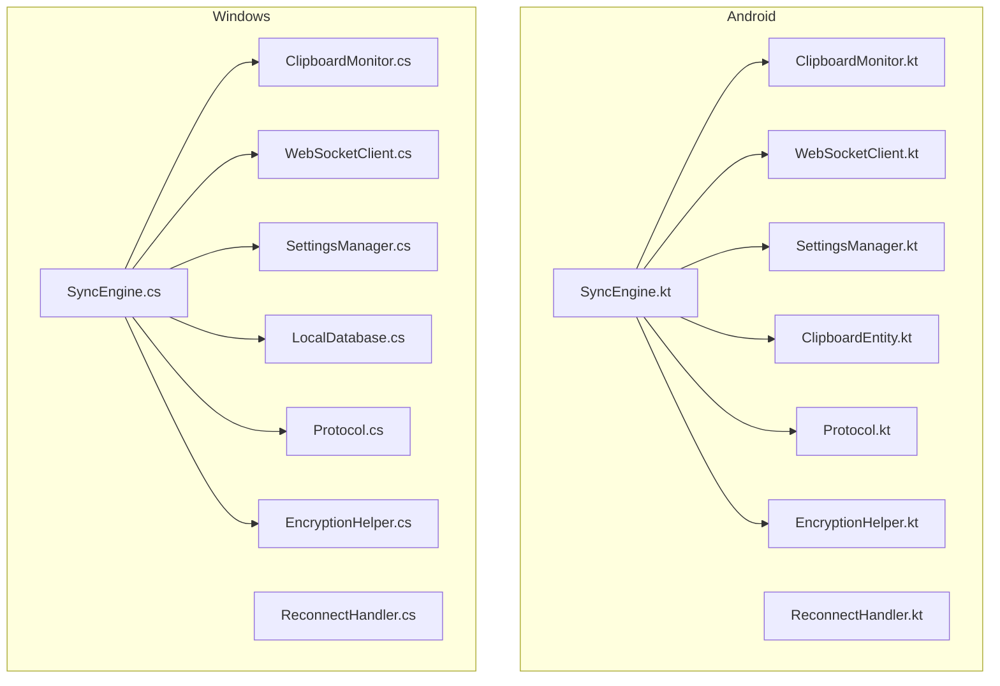
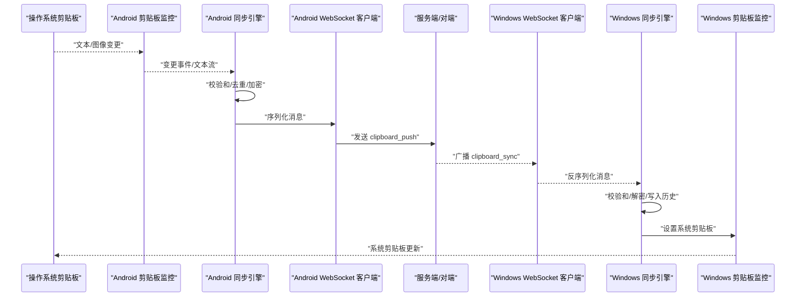
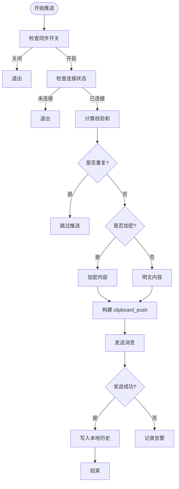
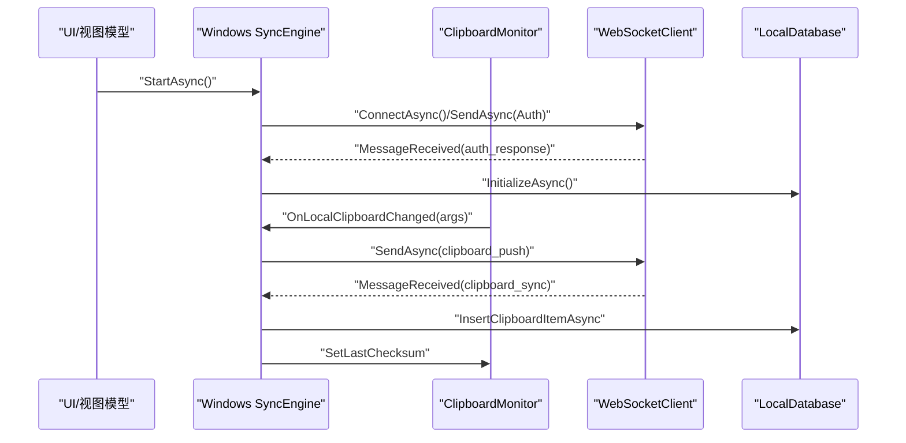
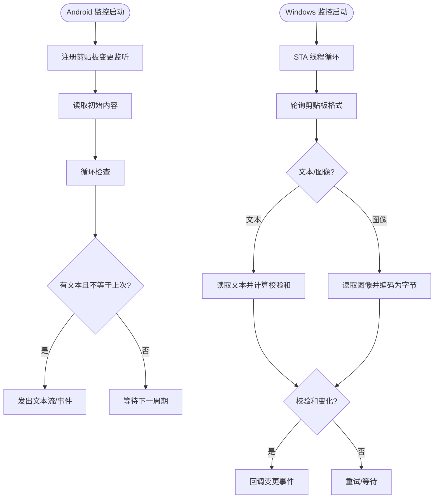
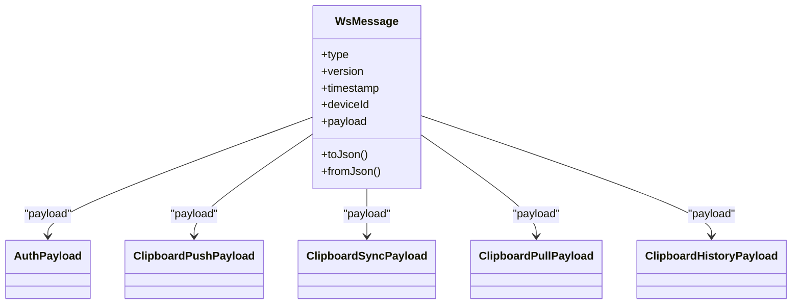
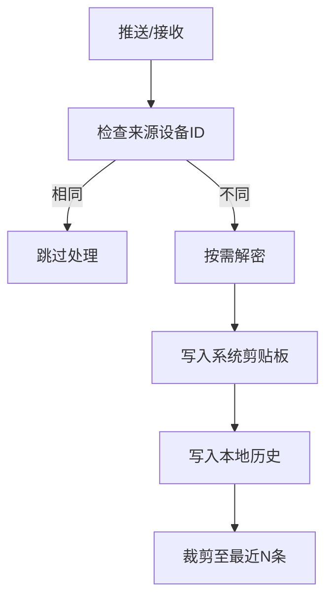
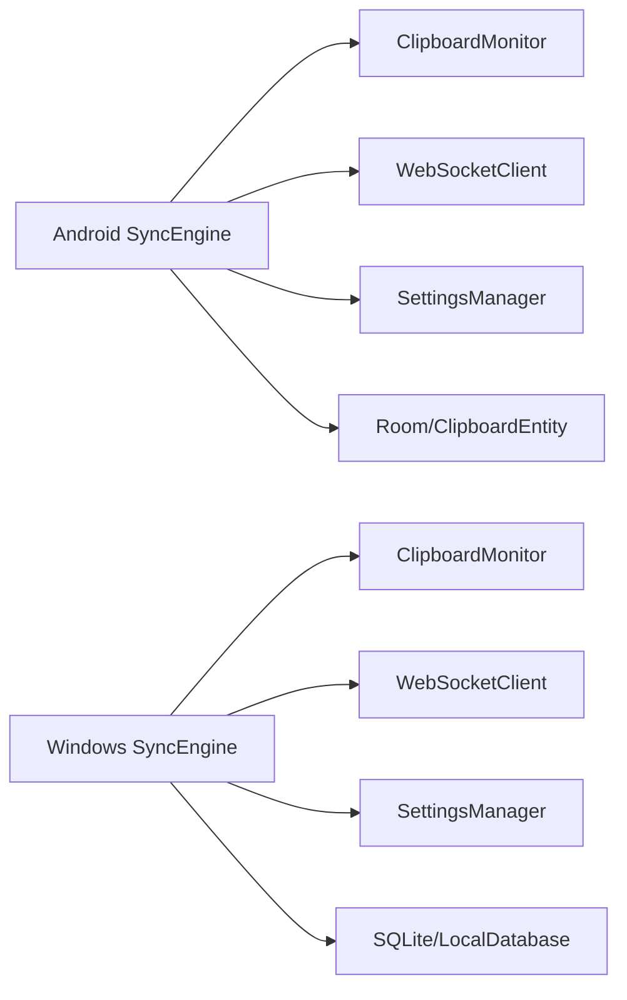

# 同步引擎组件

<cite>
**本文引用的文件**
- [SyncEngine.kt](file://clipSync-android/app/src/main/java/com/clipsync/app/core/SyncEngine.kt)
- [ClipboardMonitor.kt](file://clipSync-android/app/src/main/java/com/clipsync/app/core/ClipboardMonitor.kt)
- [EncryptionHelper.kt](file://clipSync-android/app/src/main/java/com/clipsync/app/core/EncryptionHelper.kt)
- [SettingsManager.kt](file://clipSync-android/app/src/main/java/com/clipsync/app/core/SettingsManager.kt)
- [Protocol.kt](file://clipSync-android/app/src/main/java/com/clipsync/app/network/Protocol.kt)
- [WebSocketClient.kt](file://clipSync-android/app/src/main/java/com/clipsync/app/network/WebSocketClient.kt)
- [ReconnectHandler.kt](file://clipSync-android/app/src/main/java/com/clipsync/app/network/ReconnectHandler.kt)
- [ClipboardEntity.kt](file://clipSync-android/app/src/main/java/com/clipsync/app/data/entities/ClipboardEntity.kt)
- [SyncEngine.cs](file://clipSync-windows/ClipSync.WPF/Core/SyncEngine.cs)
- [ClipboardMonitor.cs](file://clipSync-windows/ClipSync.WPF/Core/ClipboardMonitor.cs)
- [EncryptionHelper.cs](file://clipSync-windows/ClipSync.WPF/Core/EncryptionHelper.cs)
- [SettingsManager.cs](file://clipSync-windows/ClipSync.WPF/Core/SettingsManager.cs)
- [Protocol.cs](file://clipSync-windows/ClipSync.WPF/Network/Protocol.cs)
- [WebSocketClient.cs](file://clipSync-windows/ClipSync.WPF/Network/WebSocketClient.cs)
- [ReconnectHandler.cs](file://clipSync-windows/ClipSync.WPF/Network/ReconnectHandler.cs)
- [LocalDatabase.cs](file://clipSync-windows/ClipSync.WPF/Storage/LocalDatabase.cs)
- [ws-messages.schema.json](file://protocol/ws-messages.schema.json)
</cite>

## 目录
1. [简介](#简介)
2. [项目结构](#项目结构)
3. [核心组件](#核心组件)
4. [架构总览](#架构总览)
5. [详细组件分析](#详细组件分析)
6. [依赖关系分析](#依赖关系分析)
7. [性能考量](#性能考量)
8. [故障排查指南](#故障排查指南)
9. [结论](#结论)
10. [附录](#附录)

## 简介
本文件针对同步引擎组件进行系统化技术文档编写，覆盖 Windows 与 Android 平台的实现差异与共同特性，重点解析以下方面：
- 剪贴板监控机制：本地变更检测与去重策略
- 内容检测与变化检测算法：基于校验和与平台差异
- 消息序列化与反序列化：协议模型与跨平台兼容
- 同步状态管理、冲突解决策略与离线缓存机制
- 跨平台兼容性与平台特定优化
- 错误处理、重试机制与用户体验优化策略

## 项目结构
同步引擎位于两端应用的核心目录中，分别由各自平台的剪贴板监控、网络通信、加密与设置管理模块协同工作，形成统一的消息协议与历史存储。

**图表来源**
- [SyncEngine.kt:27-239](file://clipSync-android/app/src/main/java/com/clipsync/app/core/SyncEngine.kt#L27-L239)
- [ClipboardMonitor.kt:15-105](file://clipSync-android/app/src/main/java/com/clipsync/app/core/ClipboardMonitor.kt#L15-L105)
- [EncryptionHelper.kt:22-156](file://clipSync-android/app/src/main/java/com/clipsync/app/core/EncryptionHelper.kt#L22-L156)
- [SettingsManager.kt:21-169](file://clipSync-android/app/src/main/java/com/clipsync/app/core/SettingsManager.kt#L21-L169)
- [Protocol.kt:20-262](file://clipSync-android/app/src/main/java/com/clipsync/app/network/Protocol.kt#L20-L262)
- [WebSocketClient.kt:26-145](file://clipSync-android/app/src/main/java/com/clipsync/app/network/WebSocketClient.kt#L26-L145)
- [ReconnectHandler.kt:14-79](file://clipSync-android/app/src/main/java/com/clipsync/app/network/ReconnectHandler.kt#L14-L79)
- [ClipboardEntity.kt:9-19](file://clipSync-android/app/src/main/java/com/clipsync/app/data/entities/ClipboardEntity.kt#L9-L19)
- [SyncEngine.cs:8-421](file://clipSync-windows/ClipSync.WPF/Core/SyncEngine.cs#L8-L421)
- [ClipboardMonitor.cs:26-173](file://clipSync-windows/ClipSync.WPF/Core/ClipboardMonitor.cs#L26-L173)
- [EncryptionHelper.cs:18-133](file://clipSync-windows/ClipSync.WPF/Core/EncryptionHelper.cs#L18-L133)
- [SettingsManager.cs:44-101](file://clipSync-windows/ClipSync.WPF/Core/SettingsManager.cs#L44-L101)
- [Protocol.cs:60-165](file://clipSync-windows/ClipSync.WPF/Network/Protocol.cs#L60-L165)
- [WebSocketClient.cs:10-145](file://clipSync-windows/ClipSync.WPF/Network/WebSocketClient.cs#L10-L145)
- [ReconnectHandler.cs:8-96](file://clipSync-windows/ClipSync.WPF/Network/ReconnectHandler.cs#L8-L96)
- [LocalDatabase.cs:9-168](file://clipSync-windows/ClipSync.WPF/Storage/LocalDatabase.cs#L9-L168)

**章节来源**
- [SyncEngine.kt:27-239](file://clipSync-android/app/src/main/java/com/clipsync/app/core/SyncEngine.kt#L27-L239)
- [SyncEngine.cs:8-421](file://clipSync-windows/ClipSync.WPF/Core/SyncEngine.cs#L8-L421)

## 核心组件
- 同步引擎（SyncEngine）：协调本地剪贴板监控、消息构建与发送、远程消息处理、历史入库与状态管理。
- 剪贴板监控（ClipboardMonitor）：检测系统剪贴板变化，生成变更事件或文本流；具备回环抑制与去重。
- 加密辅助（EncryptionHelper）：统一的 AES-256-CBC 加解密与校验和计算，确保跨平台一致格式。
- 设置管理（SettingsManager）：持久化配置（服务器地址、设备名、令牌、加密开关等），提供流式读取。
- 协议定义（Protocol）：WebSocket 消息结构、枚举类型与消息构造器，保证两端协议一致性。
- 网络客户端（WebSocketClient）：连接生命周期、消息收发、连接状态与异常处理。
- 重连处理器（ReconnectHandler）：指数退避重连策略，避免频繁重试。
- 数据库与实体（Room/SQLite）：本地历史表结构与增删查操作。

**章节来源**
- [SyncEngine.kt:27-239](file://clipSync-android/app/src/main/java/com/clipsync/app/core/SyncEngine.kt#L27-L239)
- [SyncEngine.cs:8-421](file://clipSync-windows/ClipSync.WPF/Core/SyncEngine.cs#L8-L421)
- [ClipboardMonitor.kt:15-105](file://clipSync-android/app/src/main/java/com/clipsync/app/core/ClipboardMonitor.kt#L15-L105)
- [ClipboardMonitor.cs:26-173](file://clipSync-windows/ClipSync.WPF/Core/ClipboardMonitor.cs#L26-L173)
- [EncryptionHelper.kt:22-156](file://clipSync-android/app/src/main/java/com/clipsync/app/core/EncryptionHelper.kt#L22-L156)
- [EncryptionHelper.cs:18-133](file://clipSync-windows/ClipSync.WPF/Core/EncryptionHelper.cs#L18-L133)
- [SettingsManager.kt:21-169](file://clipSync-android/app/src/main/java/com/clipsync/app/core/SettingsManager.kt#L21-L169)
- [SettingsManager.cs:44-101](file://clipSync-windows/ClipSync.WPF/Core/SettingsManager.cs#L44-L101)
- [Protocol.kt:20-262](file://clipSync-android/app/src/main/java/com/clipsync/app/network/Protocol.kt#L20-L262)
- [Protocol.cs:60-165](file://clipSync-windows/ClipSync.WPF/Network/Protocol.cs#L60-L165)
- [WebSocketClient.kt:26-145](file://clipSync-android/app/src/main/java/com/clipsync/app/network/WebSocketClient.kt#L26-L145)
- [WebSocketClient.cs:10-145](file://clipSync-windows/ClipSync.WPF/Network/WebSocketClient.cs#L10-L145)
- [ReconnectHandler.kt:14-79](file://clipSync-android/app/src/main/java/com/clipsync/app/network/ReconnectHandler.kt#L14-L79)
- [ReconnectHandler.cs:8-96](file://clipSync-windows/ClipSync.WPF/Network/ReconnectHandler.cs#L8-L96)
- [ClipboardEntity.kt:9-19](file://clipSync-android/app/src/main/java/com/clipsync/app/data/entities/ClipboardEntity.kt#L9-L19)
- [LocalDatabase.cs:9-168](file://clipSync-windows/ClipSync.WPF/Storage/LocalDatabase.cs#L9-L168)

## 架构总览
两端同步引擎均遵循“监控本地变更 → 序列化消息 → 发送/接收 → 去重/解密 → 写入历史”的闭环流程，并通过统一的协议与加密格式实现跨平台互操作。

**图表来源**
- [SyncEngine.kt:72-123](file://clipSync-android/app/src/main/java/com/clipsync/app/core/SyncEngine.kt#L72-L123)
- [ClipboardMonitor.kt:79-93](file://clipSync-android/app/src/main/java/com/clipsync/app/core/ClipboardMonitor.kt#L79-L93)
- [Protocol.kt:210-262](file://clipSync-android/app/src/main/java/com/clipsync/app/network/Protocol.kt#L210-L262)
- [WebSocketClient.kt:108-122](file://clipSync-android/app/src/main/java/com/clipsync/app/network/WebSocketClient.kt#L108-L122)
- [SyncEngine.cs:188-267](file://clipSync-windows/ClipSync.WPF/Core/SyncEngine.cs#L188-L267)
- [ClipboardMonitor.cs:58-87](file://clipSync-windows/ClipSync.WPF/Core/ClipboardMonitor.cs#L58-L87)
- [Protocol.cs:99-141](file://clipSync-windows/ClipSync.WPF/Network/Protocol.cs#L99-L141)
- [WebSocketClient.cs:64-81](file://clipSync-windows/ClipSync.WPF/Network/WebSocketClient.cs#L64-L81)

## 详细组件分析

### 同步引擎（Android）
- 初始化与状态
  - 从设置管理器读取同步开关，启用时进入活动状态；支持状态流对外暴露。
- 本地推送
  - 在连接可用且同步开启的前提下，计算内容校验和，跳过重复内容；可选加密后发送 clipboard_push；成功后写入本地历史并限制条目数量。
- 远程同步
  - 处理 clipboard_sync：跳过自身来源内容；按需解密；设置系统剪贴板；写入历史。
- 历史拉取
  - 发送 clipboard_pull 请求，解析 clipboard_history 并批量入库。
- 去重与重置
  - 维护 lastSentChecksum，断线重连时可重置以避免误判重复。

**图表来源**
- [SyncEngine.kt:72-123](file://clipSync-android/app/src/main/java/com/clipsync/app/core/SyncEngine.kt#L72-L123)
- [EncryptionHelper.kt:107-111](file://clipSync-android/app/src/main/java/com/clipsync/app/core/EncryptionHelper.kt#L107-L111)

**章节来源**
- [SyncEngine.kt:43-234](file://clipSync-android/app/src/main/java/com/clipsync/app/core/SyncEngine.kt#L43-L234)
- [EncryptionHelper.kt:51-102](file://clipSync-android/app/src/main/java/com/clipsync/app/core/EncryptionHelper.kt#L51-L102)

### 同步引擎（Windows）
- 生命周期与认证
  - 启动时初始化数据库、WebSocket 客户端、心跳与重连；登录/注册成功后建立连接并发送认证消息。
- 本地推送
  - 支持文本与图像（Base64 编码）；根据设置决定是否加密；发送 clipboard_push；保存本地历史。
- 远程同步
  - 反序列化消息，区分 clipboard_sync；设置系统剪贴板（STA 线程）；写入本地历史。
- 设备列表与错误处理
  - 解析 device_list_response；捕获并上报错误消息。
- 历史查询与清理
  - 提供历史查询接口；SQLite 表自动维护索引与上限。

**图表来源**
- [SyncEngine.cs:32-125](file://clipSync-windows/ClipSync.WPF/Core/SyncEngine.cs#L32-L125)
- [ClipboardMonitor.cs:58-87](file://clipSync-windows/ClipSync.WPF/Core/ClipboardMonitor.cs#L58-L87)
- [WebSocketClient.cs:22-81](file://clipSync-windows/ClipSync.WPF/Network/WebSocketClient.cs#L22-L81)
- [LocalDatabase.cs:60-96](file://clipSync-windows/ClipSync.WPF/Storage/LocalDatabase.cs#L60-L96)

**章节来源**
- [SyncEngine.cs:32-392](file://clipSync-windows/ClipSync.WPF/Core/SyncEngine.cs#L32-L392)
- [LocalDatabase.cs:26-137](file://clipSync-windows/ClipSync.WPF/Storage/LocalDatabase.cs#L26-L137)

### 剪贴板监控机制与变化检测
- Android
  - 使用系统 ClipboardManager 的 OnPrimaryClipChangedListener，读取主剪贴板文本，比较 lastContent 防止回环；提供 setTextToClipboard 用于写入而不触发监听。
- Windows
  - 后台线程轮询，使用 Win32 API 判断格式可用性；对文本与图像分别读取；计算校验和；失败重试；设置 lastChecksum 避免回环。

**图表来源**
- [ClipboardMonitor.kt:24-93](file://clipSync-android/app/src/main/java/com/clipsync/app/core/ClipboardMonitor.kt#L24-L93)
- [ClipboardMonitor.cs:58-153](file://clipSync-windows/ClipSync.WPF/Core/ClipboardMonitor.cs#L58-L153)

**章节来源**
- [ClipboardMonitor.kt:15-105](file://clipSync-android/app/src/main/java/com/clipsync/app/core/ClipboardMonitor.kt#L15-L105)
- [ClipboardMonitor.cs:26-173](file://clipSync-windows/ClipSync.WPF/Core/ClipboardMonitor.cs#L26-L173)

### 消息序列化与反序列化
- Android
  - 使用 kotlinx.serialization 定义 WsMessage 与各负载类型；提供 WsMessageBuilder 构造消息；toJson/fromJson 支持忽略未知字段与默认值。
- Windows
  - 使用 Newtonsoft.Json 定义 WebSocketMessage 与 ClipboardItem；提供 Protocol 工具方法序列化/反序列化；加密开关影响 payload 字段。
- 共同点
  - 协议版本固定；消息体包含 type、version、timestamp、device_id、payload；枚举与负载字段严格对应 schema。

**图表来源**
- [Protocol.kt:20-170](file://clipSync-android/app/src/main/java/com/clipsync/app/network/Protocol.kt#L20-L170)

**章节来源**
- [Protocol.kt:12-262](file://clipSync-android/app/src/main/java/com/clipsync/app/network/Protocol.kt#L12-L262)
- [Protocol.cs:60-165](file://clipSync-windows/ClipSync.WPF/Network/Protocol.cs#L60-L165)

### 同步状态管理、冲突解决与离线缓存
- 状态管理
  - Android：SyncStatus 流式暴露 Idle/Active/Paused/Error；WebSocket 连接状态 ConnectionState。
  - Windows：事件通知连接状态、错误、设备列表；内部维护 IsConnected。
- 冲突解决
  - 基于 source_device_id 识别回环，避免重复同步；Windows 通过 SetLastChecksum 与 Android 的 lastSentChecksum 实现去重。
- 离线缓存
  - Android：Room 表 clipboard_history，插入后仅保留最近 50 条。
  - Windows：SQLite 表 clipboard_history，插入后清理超出 50 条的旧记录；提供查询接口。

**图表来源**
- [SyncEngine.kt:136-160](file://clipSync-android/app/src/main/java/com/clipsync/app/core/SyncEngine.kt#L136-L160)
- [SyncEngine.cs:190-267](file://clipSync/windows/ClipSync.WPF/Core/SyncEngine.cs#L190-L267)
- [LocalDatabase.cs:85-95](file://clipSync-windows/ClipSync.WPF/Storage/LocalDatabase.cs#L85-L95)

**章节来源**
- [SyncEngine.kt:35-66](file://clipSync-android/app/src/main/java/com/clipsync/app/core/SyncEngine.kt#L35-L66)
- [SyncEngine.cs:20-26](file://clipSync-windows/ClipSync.WPF/Core/SyncEngine.cs#L20-L26)
- [LocalDatabase.cs:60-137](file://clipSync-windows/ClipSync.WPF/Storage/LocalDatabase.cs#L60-L137)

### 跨平台兼容性与平台特定优化
- 协议与数据类型
  - 两端均支持 text/image/file 类型；content_type 与 format 字段保持一致；checksum 作为去重依据。
- 加密格式
  - 统一采用 base64(salt):base64(IV+ciphertext) 格式；迭代次数、密钥长度、填充方式一致。
- 平台差异
  - Android：协程 IO 线程、OkHttp WebSocket、DataStore Preferences；去重基于 lastSentChecksum。
  - Windows：STA 线程轮询、System.Net.WebSockets、SQLite；去重基于 SetLastChecksum。

**章节来源**
- [EncryptionHelper.kt:22-156](file://clipSync-android/app/src/main/java/com/clipsync/app/core/EncryptionHelper.kt#L22-L156)
- [EncryptionHelper.cs:18-133](file://clipSync-windows/ClipSync.WPF/Core/EncryptionHelper.cs#L18-L133)
- [Protocol.kt:153-157](file://clipSync-android/app/src/main/java/com/clipsync/app/network/Protocol.kt#L153-L157)
- [Protocol.cs:99-141](file://clipSync-windows/ClipSync.WPF/Network/Protocol.cs#L99-L141)

## 依赖关系分析
- 组件耦合
  - SyncEngine 依赖 ClipboardMonitor、WebSocketClient、SettingsManager、数据库；两者实现相似但平台 API 不同。
- 外部依赖
  - Android：OkHttp、kotlinx.serialization、Room。
  - Windows：Newtonsoft.Json、System.Net.WebSockets、Microsoft.Data.Sqlite。

**图表来源**
- [SyncEngine.kt:27-32](file://clipSync-android/app/src/main/java/com/clipsync/app/core/SyncEngine.kt#L27-L32)
- [SyncEngine.cs:10-16](file://clipSync-windows/ClipSync.WPF/Core/SyncEngine.cs#L10-L16)
- [ClipboardEntity.kt:9-19](file://clipSync-android/app/src/main/java/com/clipsync/app/data/entities/ClipboardEntity.kt#L9-L19)
- [LocalDatabase.cs:9-24](file://clipSync-windows/ClipSync.WPF/Storage/LocalDatabase.cs#L9-L24)

**章节来源**
- [SyncEngine.kt:27-32](file://clipSync-android/app/src/main/java/com/clipsync/app/core/SyncEngine.kt#L27-L32)
- [SyncEngine.cs:10-16](file://clipSync-windows/ClipSync.WPF/Core/SyncEngine.cs#L10-L16)

## 性能考量
- 剪贴板轮询与监听
  - Windows 使用后台线程轮询，建议适当增大轮询间隔以降低 CPU 占用；Android 使用系统监听，避免轮询开销。
- 序列化与网络
  - Android 使用 OkHttp 与协程 IO；Windows 使用 System.Net.WebSockets；注意消息大小限制与异常吞吐。
- 存储与索引
  - Windows SQLite 创建索引以加速查询；两端均限制历史条目数量，避免无限增长。
- 加密成本
  - 加密/解密与校验和计算为 CPU 密集操作，建议在必要时才启用加密，避免对高频剪贴板场景造成延迟。

[本节为通用指导，无需列出具体文件来源]

## 故障排查指南
- 连接问题
  - 检查服务器地址与协议前缀；确认 WebSocket 可达；查看连接状态事件与日志。
- 认证失败
  - 核对令牌与设备名；确认服务端返回的 device_id 是否正确写入设置。
- 内容无法解密
  - 确认两端加密密码一致；检查加密格式是否符合 base64(salt):base64(IV+ciphertext)。
- 重复推送/回环
  - 检查 source_device_id 与本地设备 ID；确认去重逻辑是否生效。
- 历史缺失
  - 确认历史请求是否发送；检查数据库初始化与索引；核对条目裁剪逻辑。

**章节来源**
- [WebSocketClient.kt:46-78](file://clipSync-android/app/src/main/java/com/clipsync/app/network/WebSocketClient.kt#L46-L78)
- [WebSocketClient.cs:22-62](file://clipSync-windows/ClipSync.WPF/Network/WebSocketClient.cs#L22-L62)
- [ReconnectHandler.kt:27-53](file://clipSync-android/app/src/main/java/com/clipsync/app/network/ReconnectHandler.kt#L27-L53)
- [ReconnectHandler.cs:33-71](file://clipSync-windows/ClipSync.WPF/Network/ReconnectHandler.cs#L33-L71)
- [EncryptionHelper.kt:72-102](file://clipSync-android/app/src/main/java/com/clipsync/app/core/EncryptionHelper.kt#L72-L102)
- [EncryptionHelper.cs:62-103](file://clipSync-windows/ClipSync.WPF/Core/EncryptionHelper.cs#L62-L103)
- [LocalDatabase.cs:85-95](file://clipSync-windows/ClipSync.WPF/Storage/LocalDatabase.cs#L85-L95)

## 结论
两端同步引擎在协议、加密与历史管理上保持高度一致性，同时针对平台特性进行了优化：Android 侧重系统监听与协程 IO，Windows 强调 STA 线程与本地 SQLite。通过严格的去重策略、加密格式与历史裁剪，系统在保证安全与性能的同时实现了可靠的跨平台剪贴板同步。

[本节为总结性内容，无需列出具体文件来源]

## 附录
- 协议与模式参考
  - WebSocket 消息基线与负载定义见协议 schema 文件。

**章节来源**
- [ws-messages.schema.json:1-261](file://protocol/ws-messages.schema.json#L1-L261)